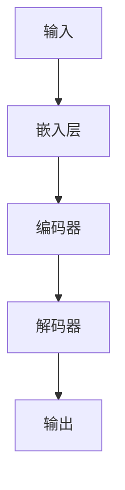

                 

## AI 大模型创业：如何利用资本优势？

> 关键词：大模型、创业、资本、优势、AI、算法、架构、资源、应用、未来

## 1. 背景介绍

当前，人工智能（AI）领域正处于快速发展的时期，其中大模型（Large Language Models）的出现和应用引起了广泛的关注。大模型是一种能够理解、生成和处理人类语言的AI模型，其在自然语言处理（NLP）、机器翻译、对话系统等领域取得了显著的成就。然而，开发和部署大模型需要大量的资源和资本投入，这为创业者带来了挑战和机遇。本文将探讨如何利用资本优势进行AI大模型创业，并分享相关的核心概念、算法原理、数学模型、项目实践和工具资源。

## 2. 核心概念与联系

### 2.1 大模型的定义与特点

大模型是一种通过学习大量文本数据而训练的语言模型，其具有以下特点：

- **规模**：大模型需要大量的计算资源和数据集，通常需要数千万甚至数十亿个参数。
- **泛化能力**：大模型能够理解和生成各种语言任务，如翻译、写作、对话等。
- **零样本学习**：大模型可以在没有额外训练数据的情况下学习新任务。

### 2.2 大模型架构

大模型的架构通常基于Transformer模型，其由自注意力机制组成。下图是大模型架构的Mermaid流程图：



### 2.3 资本优势

资本优势指的是创业者能够获得的资金、资源和人脉网络。利用资本优势进行AI大模型创业，可以帮助创业者获取先进的硬件设施、聘请优秀的人才，并建立合作伙伴关系。

## 3. 核心算法原理 & 具体操作步骤

### 3.1 算法原理概述

大模型的核心算法是Transformer模型，其基于自注意力机制。自注意力机制允许模型在处理输入序列时考虑到上下文信息，从而提高模型的理解和生成能力。

### 3.2 算法步骤详解

大模型的训练过程包括以下步骤：

1. **数据预处理**：收集和预处理大量文本数据，并将其转换为模型可以理解的格式。
2. **模型构建**：构建Transformer模型，并定义模型的参数和超参数。
3. **模型训练**：使用预处理的数据集训练模型，并优化模型参数以最小化损失函数。
4. **模型评估**：评估模型的性能，并调整模型参数以提高性能。
5. **模型部署**：将训练好的模型部署到生产环境中，并提供API接口供用户使用。

### 3.3 算法优缺点

大模型的优点包括：

- 具有出色的泛化能力，能够理解和生成各种语言任务。
- 可以进行零样本学习，无需额外的训练数据即可学习新任务。

缺点包括：

- 需要大量的计算资源和数据集，训练和部署成本高昂。
- 存在过拟合和泛化不足的风险。
- 可能会产生不准确或有偏见的输出。

### 3.4 算法应用领域

大模型的应用领域包括：

- 自然语言处理（NLP）：大模型可以用于文本分类、命名实体识别、机器翻译等NLP任务。
- 对话系统：大模型可以用于构建智能对话系统，如客服机器人和虚拟助手。
- 创意写作：大模型可以用于生成各种文本，如新闻报道、小说和诗歌。

## 4. 数学模型和公式 & 详细讲解 & 举例说明

### 4.1 数学模型构建

大模型的数学模型基于Transformer模型，其可以表示为：

$$h_t = \text{Attention}(Q_t, K_t, V_t) + \text{FFN}(h_t)$$

其中，$h_t$表示时间步$t$的隐藏状态，$Q_t$, $K_t$, $V_t$表示查询、键和值向量，$Attention$表示自注意力机制，$FFN$表示前向网络。

### 4.2 公式推导过程

自注意力机制的公式如下：

$$Attention(Q, K, V) = \text{softmax}\left(\frac{QK^T}{\sqrt{d_k}}\right)V$$

其中，$Q$, $K$, $V$表示查询、键和值向量，$d_k$表示键向量的维度。

### 4.3 案例分析与讲解

例如，假设我们要构建一个大模型来生成新闻标题。我们首先收集大量的新闻数据，并预处理数据以生成输入序列。然后，我们构建Transformer模型，并使用预处理的数据集训练模型。在训练过程中，我们优化模型参数以最小化损失函数，并评估模型的性能。一旦模型训练完成，我们就可以部署模型并提供API接口，供用户输入新闻文本并生成新闻标题。

## 5. 项目实践：代码实例和详细解释说明

### 5.1 开发环境搭建

要开发大模型，我们需要搭建一个强大的开发环境。我们需要安装Python、PyTorch或TensorFlow等深度学习框架，并配置GPU加速。此外，我们还需要安装-transformers库，该库提供了预训练的大模型和训练工具。

### 5.2 源代码详细实现

以下是大模型训练过程的伪代码：

```python
from transformers import AutoTokenizer, AutoModelForSeq2SeqLM, Trainer, TrainingArguments

# 加载预训练模型和分词器
model_name = "t5-base"
tokenizer = AutoTokenizer.from_pretrained(model_name)
model = AutoModelForSeq2SeqLM.from_pretrained(model_name)

# 加载数据集
datasets = load_dataset("path/to/dataset")

# 定义训练参数
training_args = TrainingArguments(
    output_dir="./results",
    num_train_epochs=3,
    per_device_train_batch_size=16,
    per_device_eval_batch_size=64,
    warmup_steps=500,
    weight_decay=0.01,
    logging_dir="./logs",
)

# 定义训练器
trainer = Trainer(
    model=model,
    args=training_args,
    train_dataset=datasets["train"],
    eval_dataset=datasets["validation"],
)

# 训练模型
trainer.train()

# 保存模型
model.save_pretrained("./saved_model")
```

### 5.3 代码解读与分析

在上述代码中，我们首先加载预训练的大模型和分词器。然后，我们加载数据集并定义训练参数。我们使用Trainer类来训练模型，并指定训练和验证数据集。最后，我们保存训练好的模型。

### 5.4 运行结果展示

在训练过程中，我们可以监控模型的损失函数和评估指标，并调整模型参数以提高性能。一旦模型训练完成，我们就可以使用模型生成新闻标题，如下所示：

输入：新闻文本
输出：新闻标题

## 6. 实际应用场景

大模型可以应用于各种实际场景，例如：

- **客服机器人**：大模型可以用于构建智能客服机器人，提供24/7在线支持。
- **内容创作**：大模型可以用于生成各种文本内容，如新闻报道、小说和诗歌。
- **搜索引擎**：大模型可以用于改进搜索引擎的相关性和准确性。

### 6.4 未来应用展望

未来，大模型将会在更多的领域得到应用，如自动驾驶、医疗诊断和科学研究。此外，大模型还将与其他技术结合，如物联网和区块链，从而开创新的应用场景。

## 7. 工具和资源推荐

### 7.1 学习资源推荐

- **课程**：斯坦福大学的“深度学习”课程（CS224n）和“自然语言处理”课程（CS224u）是学习大模型的好资源。
- **文档**：transformers库的文档提供了大模型的详细介绍和示例。
- **论文**：阅读相关的学术论文，如“Attention is All You Need”、“BERT: Pre-training of Deep Bidirectional Transformers for Language Understanding”、“T5: Text-to-Text Transfer Transformer”等。

### 7.2 开发工具推荐

- **开发环境**：搭建强大的开发环境，包括Python、PyTorch或TensorFlow等深度学习框架，并配置GPU加速。
- **硬件**：购买高性能的GPU，如Nvidia A100或RTX 3090，以加速大模型的训练过程。
- **云平台**：使用云平台，如Google Colab或Amazon Web Services，以节省成本和方便管理。

### 7.3 相关论文推荐

- **Attention is All You Need** - Vaswani et al. (2017)
- **BERT: Pre-training of Deep Bidirectional Transformers for Language Understanding** - Jacob Devlin and Ming-Wei Chang and Kenton Lee (2018)
- **T5: Text-to-Text Transfer Transformer** - Colin Raffel and Noam Shazeer and Adam J. Schuster and Michael Matena and Yanqi Zhou and Wei Li and Peter J. Liu (2019)

## 8. 总结：未来发展趋势与挑战

### 8.1 研究成果总结

本文介绍了大模型的核心概念、算法原理、数学模型和项目实践。我们讨论了大模型的优缺点，并提供了代码示例和工具资源推荐。

### 8.2 未来发展趋势

未来，大模型将会继续发展，并与其他技术结合，如物联网和区块链。此外，大模型还将在更多的领域得到应用，如自动驾驶、医疗诊断和科学研究。

### 8.3 面临的挑战

然而，大模型也面临着挑战，如训练和部署成本高昂、过拟合和泛化不足的风险，以及可能会产生不准确或有偏见的输出。

### 8.4 研究展望

未来的研究将关注于提高大模型的泛化能力、降低训练和部署成本，并开发新的大模型架构和训练方法。

## 9. 附录：常见问题与解答

**Q1：大模型需要多少计算资源？**

A1：大模型需要大量的计算资源，通常需要数千万甚至数十亿个参数。训练和部署大模型需要强大的GPU和大量的内存。

**Q2：大模型的训练时间有多长？**

A2：大模型的训练时间取决于模型的规模和硬�件设施。通常，训练大模型需要数天甚至数周的时间。

**Q3：大模型的应用领域有哪些？**

A3：大模型的应用领域包括自然语言处理、对话系统、创意写作、客服机器人、搜索引擎等。

**Q4：大模型存在哪些挑战？**

A4：大模型存在训练和部署成本高昂、过拟合和泛化不足的风险，以及可能会产生不准确或有偏见的输出等挑战。

**Q5：如何利用资本优势进行AI大模型创业？**

A5：利用资本优势进行AI大模型创业，可以帮助创业者获取先进的硬件设施、聘请优秀的人才，并建立合作伙伴关系。创业者还需要关注市场需求、开发可行的商业模式，并不断创新以保持竞争优势。

## 作者：禅与计算机程序设计艺术 / Zen and the Art of Computer Programming

