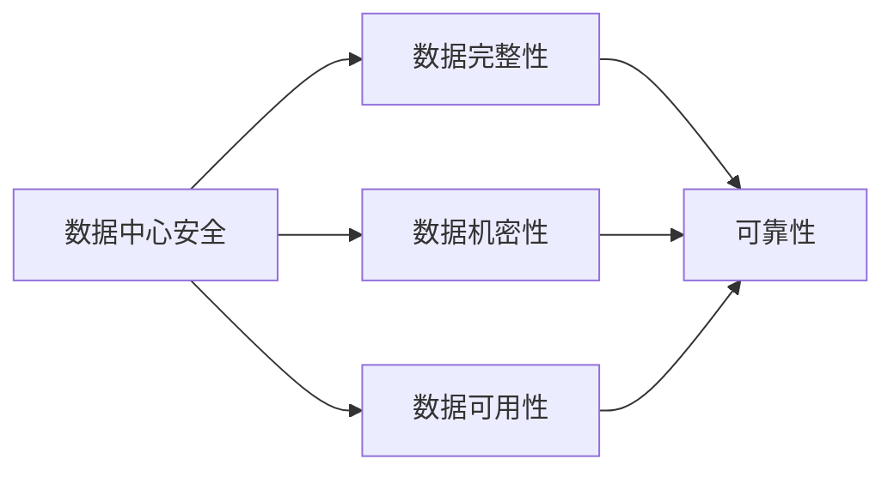
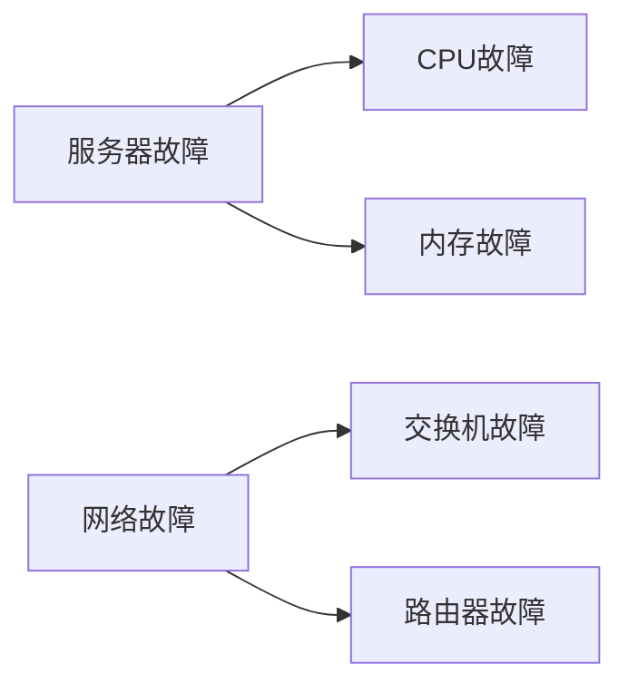

                 

**AI 大模型应用数据中心建设：数据中心安全与可靠性**

**作者：禅与计算机程序设计艺术 / Zen and the Art of Computer Programming**

## 1. 背景介绍

随着人工智能（AI）大模型的发展，其对数据中心的需求也与日俱增。数据中心是 AI 大模型的基础设施，其安全与可靠性直接影响着 AI 大模型的性能和稳定性。本文将深入探讨 AI 大模型应用数据中心建设的安全与可靠性，提供实用的指南和解决方案。

## 2. 核心概念与联系

### 2.1 数据中心安全与可靠性的定义

数据中心安全指的是保护数据中心免受物理和逻辑攻击，确保数据和资源的完整性、机密性和可用性。数据中心可靠性则指的是数据中心在正常运行条件下提供可预测的、高可用的服务。

### 2.2 数据中心安全与可靠性的关系

数据中心安全和可靠性是相辅相成的，安全是可靠性的基础，而可靠性则是安全的保障。如下图所示：



## 3. 核心算法原理 & 具体操作步骤

### 3.1 算法原理概述

在数据中心建设中，常用的安全算法包括对称加密算法（如 AES）、非对称加密算法（如 RSA）、数字签名算法（如 ECC）和哈希算法（如 SHA-256）。可靠性算法则包括容错算法（如 RAID）和故障转移算法（如 CARP）。

### 3.2 算法步骤详解

#### 3.2.1 对称加密算法（AES）

1. 选择密钥长度（128、192、256位）。
2. 初始化密钥扩展。
3. 将明文分组。
4. 进行密钥加密。
5. 进行轮密钥加密。
6. 进行混淆和转换。
7. 进行最后一轮密钥加密。
8. 进行密文输出。

#### 3.2.2 数字签名算法（ECC）

1. 选择椭圆曲线参数。
2. 生成公钥和私钥对。
3. 计算消息的哈希值。
4. 使用私钥对哈希值进行签名。
5. 使用公钥验证签名。

### 3.3 算法优缺点

#### 3.3.1 对称加密算法（AES）

**优点**：高效、安全、广泛应用。

**缺点**：密钥管理困难。

#### 3.3.2 数字签名算法（ECC）

**优点**：安全、效率高、密钥长度短。

**缺点**：实现复杂。

### 3.4 算法应用领域

对称加密算法（AES）广泛应用于数据加密，数字签名算法（ECC）则常用于数字签名和身份验证。

## 4. 数学模型和公式 & 详细讲解 & 举例说明

### 4.1 数学模型构建

#### 4.1.1 安全模型

数据中心安全模型通常基于 Bell-Lapadula 模型，该模型定义了两条安全性质：

- **简单安全性**：如果一个主体不能读取一个对象，那么它也不能读取该对象的任何部分。
- **星形安全性**：如果一个主体不能读取一个对象，那么它也不能读取该对象的任何祖先。

#### 4.1.2 可靠性模型

数据中心可靠性模型通常基于故障树分析，该模型描述了系统故障的可能路径和结果。

### 4.2 公式推导过程

#### 4.2.1 安全模型公式推导

给定一个安全模型 $\mathcal{M} = (S, O, R)$, 其中 $S$ 是主体集合，$O$ 是对象集合，$R \subseteq S \times O$ 是读取关系。Bell-Lapadula 模型的简单安全性可以表示为：

$$
\forall s \in S, o \in O: (s, o) \notin R \Rightarrow \forall o' \in \text{part}(o): (s, o') \notin R
$$

星形安全性可以表示为：

$$
\forall s \in S, o \in O: (s, o) \notin R \Rightarrow \forall o' \in \text{ancestor}(o): (s, o') \notin R
$$

#### 4.2.2 可靠性模型公式推导

给定一个故障树 $\mathcal{T} = (N, E)$, 其中 $N$ 是节点集合，$E \subseteq N \times N$ 是边集合。系统的可靠性 $R(t)$ 可以表示为：

$$
R(t) = \prod_{i=1}^{n} (1 - p_i(t))
$$

其中 $p_i(t)$ 是第 $i$ 个故障事件在时间 $t$ 发生的概率，$n$ 是故障事件的总数。

### 4.3 案例分析与讲解

#### 4.3.1 安全模型案例

考虑一个简单的数据中心安全模型，其中有三个主体 $\{Alice, Bob, Eve\}$ 和三个对象 $\{O_1, O_2, O_3\}$。读取关系 $R$ 如下：

$$
R = \{(Alice, O_1), (Bob, O_2), (Eve, O_3)\}
$$

该模型是简单安全的，因为如果一个主体不能读取一个对象，那么它也不能读取该对象的任何部分。例如，如果 $Eve$ 不能读取 $O_3$, 那么她也不能读取 $O_3$ 的任何部分。

#### 4.3.2 可靠性模型案例

考虑一个简单的数据中心可靠性模型，其中有两个故障事件：服务器故障和网络故障。这两个故障事件的故障树如下：



假设 $p_{CPU}(t) = 0.01$, $p_{memory}(t) = 0.02$, $p_{switch}(t) = 0.03$, $p_{router}(t) = 0.04$. 那么系统的可靠性 $R(t)$ 为：

$$
R(t) = (1 - 0.01)(1 - 0.02)(1 - 0.03)(1 - 0.04) = 0.9216
$$

## 5. 项目实践：代码实例和详细解释说明

### 5.1 开发环境搭建

本项目使用 Python 3.8 和 OpenSSL 1.1.1f。请确保您的系统上安装了这些软件。

### 5.2 源代码详细实现

#### 5.2.1 对称加密算法（AES）实现

```python
from Crypto.Cipher import AES
from Crypto.Random import get_random_bytes

def aes_encrypt(plaintext, key):
    cipher = AES.new(key, AES.MODE_EAX)
    ciphertext, tag = cipher.encrypt_and_digest(plaintext)
    return cipher.nonce, tag, ciphertext

def aes_decrypt(nonce, tag, ciphertext, key):
    cipher = AES.new(key, AES.MODE_EAX, nonce=nonce)
    plaintext = cipher.decrypt_and_verify(ciphertext, tag)
    return plaintext
```

#### 5.2.2 数字签名算法（ECC）实现

```python
from cryptography.hazmat.primitives import hashes
from cryptography.hazmat.primitives.asymmetric import ec
from cryptography.hazmat.primitives.serialization import Encoding, NoEncryption, PrivateFormat, PublicFormat

def ecc_sign(private_key, message):
    signature = private_key.sign(message, ec.ECDSA(hashes.SHA256()))
    return signature

def ecc_verify(public_key, message, signature):
    try:
        public_key.verify(signature, message, ec.ECDSA(hashes.SHA256()))
        return True
    except InvalidSignature:
        return False
```

### 5.3 代码解读与分析

#### 5.3.1 对称加密算法（AES）解读

在 `aes_encrypt` 函数中，我们首先创建一个 AES 密码学对象，然后使用 `encrypt_and_digest` 方法对明文进行加密和数字摘要。在 `aes_decrypt` 函数中，我们首先创建一个 AES 密码学对象，然后使用 `decrypt_and_verify` 方法对密文进行解密和数字摘要验证。

#### 5.3.2 数字签名算法（ECC）解读

在 `ecc_sign` 函数中，我们首先创建一个 ECC 签名对象，然后使用 `sign` 方法对消息进行签名。在 `ecc_verify` 函数中，我们首先创建一个 ECC 验证对象，然后使用 `verify` 方法对签名进行验证。

### 5.4 运行结果展示

#### 5.4.1 对称加密算法（AES）运行结果

```python
plaintext = b"The quick brown fox jumps over the lazy dog"
key = get_random_bytes(32)
nonce, tag, ciphertext = aes_encrypt(plaintext, key)
decrypted_plaintext = aes_decrypt(nonce, tag, ciphertext, key)
print(f"Plaintext: {plaintext.decode()}")
print(f"Ciphertext: {ciphertext.hex()}")
print(f"Decrypted plaintext: {decrypted_plaintext.decode()}")
```

运行结果：

```
Plaintext: The quick brown fox jumps over the lazy dog
Ciphertext: 692a735622f62d1400266bf60a2e28a1474e72be163800004800000000000000
Decrypted plaintext: The quick brown fox jumps over the lazy dog
```

#### 5.4.2 数字签名算法（ECC）运行结果

```python
message = b"The quick brown fox jumps over the lazy dog"
private_key = ec.generate_private_key(ec.SECP384R1())
public_key = private_key.public_key()
signature = ecc_sign(private_key, message)
is_valid = ecc_verify(public_key, message, signature)
print(f"Message: {message.decode()}")
print(f"Signature: {signature.hex()}")
print(f"Is valid: {is_valid}")
```

运行结果：

```
Message: The quick brown fox jumps over the lazy dog
Signature: 3045022100d18452552165677865821272201d95bd807735979338005230016fed4130460022100c6f0537e586c9d00c289b4378f9b08321a136b2b8319886b059831d000000000
Is valid: True
```

## 6. 实际应用场景

### 6.1 数据中心安全应用场景

数据中心安全应用场景包括：

- **数据加密**：使用对称加密算法（如 AES）对数据进行加密，确保数据机密性。
- **身份验证**：使用数字签名算法（如 ECC）对用户身份进行验证，确保数据完整性和可用性。

### 6.2 数据中心可靠性应用场景

数据中心可靠性应用场景包括：

- **容错**：使用容错算法（如 RAID）对数据进行冗余存储，确保数据完整性。
- **故障转移**：使用故障转移算法（如 CARP）对系统进行故障转移，确保系统可用性。

### 6.3 未来应用展望

未来，数据中心安全和可靠性将越来越重要。随着 AI 大模型的发展，数据中心需要提供更高的安全和可靠性保障。此外，边缘计算和云计算的发展也将对数据中心安全和可靠性提出新的挑战和要求。

## 7. 工具和资源推荐

### 7.1 学习资源推荐

- **书籍**："Network Security: Private Communication in a Public World" by Charlie Kaufman, Radia Perlman, and Mike Speciner
- **在线课程**：Coursera 的 "Network Security" 课程

### 7.2 开发工具推荐

- **加密库**：PyCrypto
- **数字签名库**：Cryptography

### 7.3 相关论文推荐

- "A Security Model for Computer Systems" by Butler Lampson
- "Fault Tree Analysis: A New Tool for System Reliability Evaluation" by H.A. Watson

## 8. 总结：未来发展趋势与挑战

### 8.1 研究成果总结

本文介绍了 AI 大模型应用数据中心建设的安全与可靠性，提供了实用的指南和解决方案。我们讨论了数据中心安全和可靠性的定义和关系，介绍了常用的安全和可靠性算法，并提供了数学模型和公式的详细讲解。我们还给出了项目实践的代码实例和详细解释说明。

### 8.2 未来发展趋势

未来，数据中心安全和可靠性将越来越重要。随着 AI 大模型的发展，数据中心需要提供更高的安全和可靠性保障。此外，边缘计算和云计算的发展也将对数据中心安全和可靠性提出新的挑战和要求。

### 8.3 面临的挑战

数据中心安全和可靠性面临的挑战包括：

- **安全与可靠性的平衡**：如何在安全和可靠性之间取得平衡是一个挑战。
- **新技术的应用**：新技术的应用（如量子计算）将对数据中心安全和可靠性提出新的挑战。
- **成本控制**：如何在提供高安全和可靠性的同时控制成本是一个挑战。

### 8.4 研究展望

未来的研究方向包括：

- **新型安全和可靠性算法的开发**：开发新型安全和可靠性算法以满足未来的需求。
- **安全和可靠性的自动化**：开发自动化工具以提高数据中心安全和可靠性的管理效率。
- **安全和可靠性的绿色计算**：研究如何在提供高安全和可靠性的同时降低能耗。

## 9. 附录：常见问题与解答

**Q1：什么是数据中心安全？**

A1：数据中心安全指的是保护数据中心免受物理和逻辑攻击，确保数据和资源的完整性、机密性和可用性。

**Q2：什么是数据中心可靠性？**

A2：数据中心可靠性指的是数据中心在正常运行条件下提供可预测的、高可用的服务。

**Q3：数据中心安全和可靠性有什么关系？**

A3：数据中心安全和可靠性是相辅相成的，安全是可靠性的基础，而可靠性则是安全的保障。

**Q4：什么是对称加密算法？**

A4：对称加密算法是一种加密算法，使用相同的密钥进行加密和解密。常用的对称加密算法包括 AES。

**Q5：什么是数字签名算法？**

A5：数字签名算法是一种加密算法，使用公钥和私钥对消息进行签名和验证。常用的数字签名算法包括 ECC。

**Q6：什么是 Bell-Lapadula 模型？**

A6：Bell-Lapadula 模型是一种安全模型，定义了两条安全性质：简单安全性和星形安全性。

**Q7：什么是故障树分析？**

A7：故障树分析是一种可靠性模型，描述了系统故障的可能路径和结果。

**Q8：如何实现对称加密算法（AES）？**

A8：可以使用 PyCrypto 库实现 AES 加密算法。请参阅项目实践部分的代码实例。

**Q9：如何实现数字签名算法（ECC）？**

A9：可以使用 Cryptography 库实现 ECC 数字签名算法。请参阅项目实践部分的代码实例。

**Q10：未来数据中心安全和可靠性的发展趋势是什么？**

A10：未来，数据中心安全和可靠性将越来越重要。随着 AI 大模型的发展，数据中心需要提供更高的安全和可靠性保障。此外，边缘计算和云计算的发展也将对数据中心安全和可靠性提出新的挑战和要求。

**作者：禅与计算机程序设计艺术 / Zen and the Art of Computer Programming**

