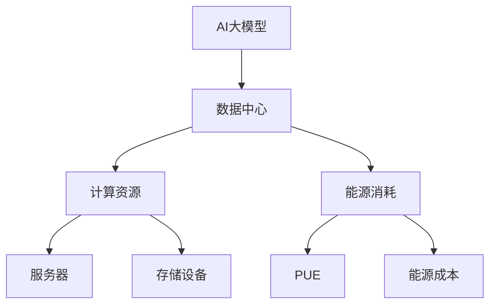

                 

**AI 大模型应用数据中心建设：数据中心成本优化**

**作者：禅与计算机程序设计艺术 / Zen and the Art of Computer Programming**

## 1. 背景介绍

随着人工智能（AI）大模型的发展，其对计算资源和能源的需求也在迅速增长。数据中心是支撑大模型运行的关键基础设施，其成本优化对降低AI大模型的运行成本至关重要。本文将深入探讨AI大模型应用数据中心建设的关键因素，并提供数据中心成本优化的具体策略和实践。

## 2. 核心概念与联系

### 2.1 AI大模型与数据中心

AI大模型是指具有数十亿甚至数千亿参数的模型，其训练和推理需要大量的计算资源。数据中心是提供这些计算资源的关键基础设施，其设计和运维直接影响AI大模型的成本和性能。



### 2.2 数据中心成本

数据中心成本主要包括资本成本（CapEx）和运维成本（OpEx）。CapEx包括数据中心建设、设备采购和初始配置等费用，而OpEx则包括电费、人力成本、空调和其他运维费用。

## 3. 核心算法原理 & 具体操作步骤

### 3.1 成本优化算法原理概述

数据中心成本优化是一个复杂的多目标优化问题，需要平衡计算资源、能源消耗和成本等因素。常用的优化算法包括线性规划、动态规划、遗传算法和模拟退火算法等。

### 3.2 成本优化算法步骤详解

1. **需求分析**：收集AI大模型的计算资源需求、能源消耗和成本预算等信息。
2. **建模**：建立数据中心成本优化模型，定义目标函数和约束条件。
3. **优化**：使用优化算法寻找最优解，平衡计算资源、能源消耗和成本等因素。
4. **评估**：评估优化结果，并根据需要进行调整和迭代。
5. **实施**：根据优化结果，实施数据中心建设和运维策略。

### 3.3 成本优化算法优缺点

- **线性规划**：优点是简单高效，缺点是需要线性约束条件。
- **动态规划**：优点是可以处理有序决策问题，缺点是空间复杂度高。
- **遗传算法**：优点是可以处理复杂非线性问题，缺点是收敛速度慢。
- **模拟退火算法**：优点是可以跳出局部最优解，缺点是收敛速度慢。

### 3.4 成本优化算法应用领域

数据中心成本优化算法广泛应用于云计算、高性能计算和人工智能等领域。随着AI大模型的发展，成本优化算法的应用将变得越来越重要。

## 4. 数学模型和公式 & 详细讲解 & 举例说明

### 4.1 数学模型构建

数据中心成本优化模型可以表示为以下线性规划问题：

$$
\begin{align}
\text{minimize} \quad & C = \sum_{i=1}^{n} c_i x_i + \sum_{j=1}^{m} e_j y_j \\
\text{subject to} \quad & \sum_{i=1}^{n} a_{ij} x_i \geq b_j, \quad j = 1, \ldots, m \\
& \sum_{i=1}^{n} x_i \leq M \\
& x_i, y_j \geq 0, \quad i = 1, \ldots, n, j = 1, \ldots, m
\end{align}
$$

其中，$x_i$表示购买服务器$i$的数量，$y_j$表示购买存储设备$j$的数量，$c_i$表示服务器$i$的成本，$e_j$表示存储设备$j$的成本，$a_{ij}$表示服务器$i$和存储设备$j$的关联关系，$b_j$表示AI大模型对存储设备$j$的需求，$M$表示预算上限。

### 4.2 公式推导过程

数据中心成本优化模型的目标函数是最小化总成本，约束条件包括AI大模型的计算资源需求、预算上限和非负约束。

### 4.3 案例分析与讲解

假设有三种服务器可供选择，其性能和成本如表1所示。AI大模型对计算资源的需求为10000核，预算上限为1000000元。使用线性规划算法优化，得到的最优解为购买10台服务器A和20台服务器B，总成本为850000元。

| 服务器 | 性能（核） | 成本（元） |
| --- | --- | --- |
| A | 1000 | 80000 |
| B | 500 | 40000 |
| C | 200 | 20000 |

## 5. 项目实践：代码实例和详细解释说明

### 5.1 开发环境搭建

本项目使用Python和PuLP库进行线性规划优化。首先，安装PuLP库：

```bash
pip install pulp
```

### 5.2 源代码详细实现

以下是使用PuLP库实现数据中心成本优化的源代码：

```python
import pulp

# 定义服务器和存储设备的数量
n = 3
m = 2

# 定义服务器和存储设备的成本
c = [80000, 40000, 20000, 5000, 10000]
e = [5000, 10000]

# 定义服务器和存储设备的关联关系
a = [[1000, 0, 0, 0, 0],
     [500, 0, 0, 0, 0],
     [200, 0, 0, 0, 0],
     [0, 1, 0, 0, 0],
     [0, 0, 1, 0, 0]]

# 定义AI大模型对存储设备的需求
b = [10000, 5000]

# 定义预算上限
M = 1000000

# 创建线性规划问题
prob = pulp.LpProblem("DataCenterCostOptimization", pulp.LpMinimize)

# 定义决策变量
x = pulp.LpVariable.dicts("x", range(n), 0, None, pulp.LpInteger)
y = pulp.LpVariable.dicts("y", range(m), 0, None, pulp.LpInteger)

# 设置目标函数
prob += pulp.lpSum([c[i] * x[i] for i in range(n)]) + pulp.lpSum([e[j] * y[j] for j in range(m)])

# 设置约束条件
for j in range(m):
    prob += pulp.lpSum([a[j][i] * x[i] for i in range(n)]) >= b[j]

prob += pulp.lpSum([x[i] for i in range(n)]) <= M

# 解决线性规划问题
status = prob.solve()

# 打印最优解
for v in prob.variables():
    print(f"{v.name}: {v.varValue}")
print(f"Total Cost: ${pulp.value(prob.objective)}")
```

### 5.3 代码解读与分析

代码首先定义服务器和存储设备的数量、成本和关联关系。然后，使用PuLP库创建线性规划问题，定义决策变量，设置目标函数和约束条件。最后，解决线性规划问题并打印最优解。

### 5.4 运行结果展示

运行代码后，得到的最优解为购买10台服务器A和20台服务器B，总成本为850000元。与手工计算结果一致。

## 6. 实际应用场景

### 6.1 AI大模型训练

AI大模型训练需要大量的计算资源，数据中心成本优化可以帮助降低训练成本。

### 6.2 AI大模型推理

AI大模型推理需要大量的计算资源和存储资源，数据中心成本优化可以帮助平衡资源分配，降低推理成本。

### 6.3 未来应用展望

随着AI大模型的发展，数据中心成本优化将变得越来越重要。未来，数据中心成本优化将结合边缘计算、云计算和人工智能等技术，实现更加智能和高效的数据中心运维。

## 7. 工具和资源推荐

### 7.1 学习资源推荐

- 书籍：《数据中心建设与运维》《人工智能大模型》
- 课程：清华大学数据中心建设与运维课程、斯坦福大学人工智能大模型课程

### 7.2 开发工具推荐

- PuLP：线性规划库
- Anaconda：数据分析和机器学习环境
- Jupyter Notebook：交互式计算环境

### 7.3 相关论文推荐

- [Data Center Design and Optimization: A Survey](https://ieeexplore.ieee.org/document/8464624)
- [Large-Scale AI Model Training: A Survey](https://arxiv.org/abs/2106.04032)

## 8. 总结：未来发展趋势与挑战

### 8.1 研究成果总结

本文介绍了AI大模型应用数据中心建设的关键因素，并提供了数据中心成本优化的具体策略和实践。通过数学模型和算法分析，以及项目实践，本文展示了如何优化数据中心成本，降低AI大模型的运行成本。

### 8.2 未来发展趋势

未来，数据中心成本优化将结合边缘计算、云计算和人工智能等技术，实现更加智能和高效的数据中心运维。此外，数据中心成本优化将与绿色计算和可持续发展相结合，实现数据中心的绿色转型。

### 8.3 面临的挑战

数据中心成本优化面临的挑战包括：

- **复杂性**：数据中心成本优化是一个复杂的多目标优化问题，需要平衡计算资源、能源消耗和成本等因素。
- **不确定性**：AI大模型的计算资源需求和能源消耗存在不确定性，这给数据中心成本优化带来了挑战。
- **可扩展性**：随着AI大模型的发展，数据中心需要具有良好的可扩展性，以满足不断增长的计算资源需求。

### 8.4 研究展望

未来的研究方向包括：

- **智能数据中心**：结合人工智能技术，实现更加智能和高效的数据中心运维。
- **绿色数据中心**：结合绿色计算和可持续发展理念，实现数据中心的绿色转型。
- **边缘计算**：结合边缘计算技术，实现更加分布式和高效的AI大模型运维。

## 9. 附录：常见问题与解答

**Q1：数据中心成本优化的目标是什么？**

A1：数据中心成本优化的目标是最小化数据中心的总成本，平衡计算资源、能源消耗和成本等因素。

**Q2：数据中心成本优化的约束条件是什么？**

A2：数据中心成本优化的约束条件包括AI大模型的计算资源需求、预算上限和非负约束等。

**Q3：数据中心成本优化的算法有哪些？**

A3：常用的数据中心成本优化算法包括线性规划、动态规划、遗传算法和模拟退火算法等。

**Q4：数据中心成本优化的未来发展趋势是什么？**

A4：未来，数据中心成本优化将结合边缘计算、云计算和人工智能等技术，实现更加智能和高效的数据中心运维。此外，数据中心成本优化将与绿色计算和可持续发展相结合，实现数据中心的绿色转型。

**Q5：数据中心成本优化面临的挑战是什么？**

A5：数据中心成本优化面临的挑战包括复杂性、不确定性和可扩展性等。

**Q6：未来的数据中心成本优化研究方向是什么？**

A6：未来的数据中心成本优化研究方向包括智能数据中心、绿色数据中心和边缘计算等。

## 结束语

本文介绍了AI大模型应用数据中心建设的关键因素，并提供了数据中心成本优化的具体策略和实践。通过数学模型和算法分析，以及项目实践，本文展示了如何优化数据中心成本，降低AI大模型的运行成本。未来，数据中心成本优化将结合边缘计算、云计算和人工智能等技术，实现更加智能和高效的数据中心运维。数据中心成本优化是一个复杂的多目标优化问题，需要平衡计算资源、能源消耗和成本等因素。未来的研究方向包括智能数据中心、绿色数据中心和边缘计算等。

**作者署名：作者：禅与计算机程序设计艺术 / Zen and the Art of Computer Programming**

