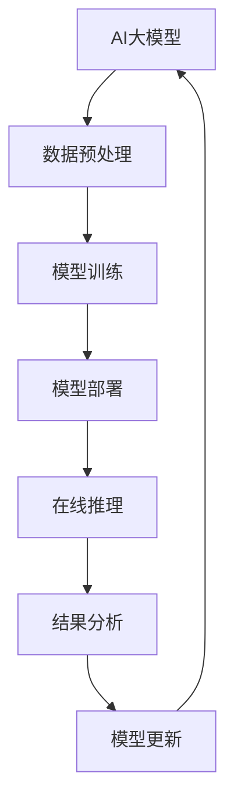

                 

**AI 大模型应用数据中心建设：数据中心技术创新**

**作者：禅与计算机程序设计艺术 / Zen and the Art of Computer Programming**

## 1. 背景介绍

随着人工智能（AI）的快速发展，大模型（Large Language Models）已成为AI领域的关键驱动因素之一。这些模型需要大量的计算资源和数据来训练和部署，这对数据中心的建设和运维提出了新的挑战。本文将探讨AI大模型应用数据中心建设的技术创新，帮助读者理解如何构建高效、可扩展的AI数据中心。

## 2. 核心概念与联系

### 2.1 AI大模型

AI大模型是指具有数十亿个参数的神经网络模型，能够理解、生成或翻译人类语言，并展示出类似人类的推理和理解能力。这些模型需要大量的计算资源和数据来训练，因此对数据中心的要求很高。

### 2.2 数据中心

数据中心是存储、处理和分发数据的物理设施，为云计算、大数据和AI等应用提供支持。AI大模型应用数据中心需要具备高性能计算、大规模存储和高带宽网络等特性。

### 2.3 AI数据中心架构

AI数据中心架构需要考虑到大模型的特点，包括高并行计算、大规模数据处理和低延迟通信。下图是AI数据中心架构的Mermaid流程图：



## 3. 核心算法原理 & 具体操作步骤

### 3.1 算法原理概述

大模型的核心算法是Transformer模型，它使用自注意力机制（Self-Attention）和位置编码（Positional Encoding）来处理序列数据。Transformer模型的并行计算能力使其非常适合大规模数据处理。

### 3.2 算法步骤详解

1. **数据预处理**：收集、清洗和预处理数据，将其转换为模型可以接受的格式。
2. **模型训练**：使用预处理后的数据训练大模型，调整模型参数以最小化预测误差。
3. **模型部署**：将训练好的模型部署到生产环境，为在线推理做准备。
4. **在线推理**：使用部署好的模型对新数据进行推理，生成预测结果。
5. **结果分析**：分析推理结果，评估模型性能，并根据需要调整模型参数。
6. **模型更新**：基于新数据或性能评估结果，更新模型参数，重复训练和部署过程。

### 3.3 算法优缺点

**优点**：
- 并行计算能力强，适合大规模数据处理
- 可以理解、生成或翻译人类语言，展示出类似人类的推理和理解能力

**缺点**：
- 训练和推理需要大量的计算资源和时间
- 存在过拟合和泄露问题，需要仔细调整模型参数

### 3.4 算法应用领域

大模型在自然语言处理（NLP）、计算机视觉（CV）、推荐系统和自动驾驶等领域有着广泛的应用。随着技术的发展，大模型的应用领域还在不断扩展。

## 4. 数学模型和公式 & 详细讲解 & 举例说明

### 4.1 数学模型构建

大模型的数学模型是基于Transformer架构构建的。Transformer模型使用自注意力机制和位置编码来处理序列数据。自注意力机制允许模型在处理序列数据时考虑到上下文信息，位置编码则帮助模型理解序列数据的顺序。

### 4.2 公式推导过程

自注意力机制的数学表达式如下：

$$ \text{Attention}(Q, K, V) = \text{softmax}\left(\frac{QK^T}{\sqrt{d_k}}\right)V $$

其中，$Q$, $K$, $V$分别是查询（Query）、键（Key）和值（Value）矩阵，$d_k$是键矩阵的维度。

位置编码的数学表达式如下：

$$ \text{PE}(pos, 2i) = \sin\left(\frac{pos}{10000^{2i/d_{\text{model}}}}\right) $$
$$ \text{PE}(pos, 2i+1) = \cos\left(\frac{pos}{10000^{2i/d_{\text{model}}}}\right) $$

其中，$pos$是位置，$i$是维度，$d_{\text{model}}$是模型的维度。

### 4.3 案例分析与讲解

例如，在NLP任务中，大模型可以用于文本分类、文本生成或机器翻译。在文本分类任务中，大模型需要预测输入文本的类别。在文本生成任务中，大模型需要生成与输入文本相关的文本。在机器翻译任务中，大模型需要将输入文本从一种语言翻译成另一种语言。

## 5. 项目实践：代码实例和详细解释说明

### 5.1 开发环境搭建

AI大模型的开发需要一个高性能的开发环境，包括GPU加速的计算节点和大规模存储系统。常用的开发环境包括NVIDIA DGX系统和Google Colab。

### 5.2 源代码详细实现

大模型的源代码可以在开源平台上找到，如Hugging Face的Transformers库。下面是一个简单的示例，使用Hugging Face的Transformers库训练一个文本分类模型：

```python
from transformers import AutoTokenizer, AutoModelForSequenceClassification, Trainer, TrainingArguments

model_name = "distilbert-base-uncased-finetuned-sst-2-english"
tokenizer = AutoTokenizer.from_pretrained(model_name)
model = AutoModelForSequenceClassification.from_pretrained(model_name)

def encode(examples):
    return tokenizer(examples["text"], truncation=True, padding=True)

dataset = load_dataset("glue", "sst2", split="train").map(encode, batched=True)
dataset.set_format(type="torch", columns=["input_ids", "attention_mask", "label"])

training_args = TrainingArguments(
    output_dir="./results",
    num_train_epochs=3,
    per_device_train_batch_size=16,
    per_device_eval_batch_size=64,
    warmup_steps=500,
    weight_decay=0.01,
    logging_dir="./logs",
)

trainer = Trainer(
    model=model,
    args=training_args,
    train_dataset=dataset,
)

trainer.train()
```

### 5.3 代码解读与分析

上述代码首先导入所需的库和模型，然后定义一个函数将文本数据编码为模型可以接受的格式。接着，加载训练数据集，并使用编码函数对其进行编码。然后，定义训练参数，并创建Trainer对象。最后，使用Trainer对象训练模型。

### 5.4 运行结果展示

训练完成后，模型的性能可以通过评估数据集进行评估。评估指标包括准确率、精确度、召回率和F1分数等。

## 6. 实际应用场景

### 6.1 当前应用

大模型在各种AI应用中得到广泛应用，包括NLP、CV、推荐系统和自动驾驶等。例如，大模型可以用于搜索引擎、虚拟助手和机器翻译等应用。

### 6.2 未来应用展望

随着技术的发展，大模型的应用领域还在不断扩展。未来，大模型可能会应用于更复杂的任务，如自动驾驶、医疗诊断和科学研究等。此外，大模型还可能会与其他技术结合，如量子计算和边缘计算等，以实现更高的性能和效率。

## 7. 工具和资源推荐

### 7.1 学习资源推荐

- "Attention is All You Need"：大模型的开创性论文，详细介绍了Transformer模型的原理和应用。
- "The Illustrated Transformer"：一篇介绍Transformer模型的入门级文章，使用大量图表和示例进行解释。
- "Hugging Face Transformers"：一个开源的Transformers库，提供了大量预训练模型和示例代码。

### 7.2 开发工具推荐

- NVIDIA DGX系统：一种高性能的GPU加速计算系统，适合大规模AI模型的开发和训练。
- Google Colab：一种云端Jupyter notebook服务，提供了免费的GPU资源，适合AI模型的开发和测试。
- PyTorch和TensorFlow：两种流行的深度学习框架，广泛用于大模型的开发和训练。

### 7.3 相关论文推荐

- "BERT: Pre-training of Deep Bidirectional Transformers for Language Understanding"：BERT模型的开创性论文，介绍了大模型的预训练和微调技术。
- "RoBERTa: A Robustly Optimized BERT Pretraining Approach"：RoBERTa模型的论文，介绍了大模型的预训练技术的改进。
- "T5: Text-to-Text Transfer Transformer"：T5模型的论文，介绍了大模型的端到端文本转换技术。

## 8. 总结：未来发展趋势与挑战

### 8.1 研究成果总结

本文介绍了AI大模型应用数据中心建设的技术创新，包括大模型的原理、架构和应用，以及数据中心的架构和开发环境。我们还提供了一个示例代码，演示了如何使用Hugging Face的Transformers库训练一个文本分类模型。

### 8.2 未来发展趋势

未来，大模型的发展将会朝着更高的性能、更低的成本和更广泛的应用领域发展。大模型还将与其他技术结合，如量子计算和边缘计算等，以实现更高的性能和效率。

### 8.3 面临的挑战

大模型的发展面临着多个挑战，包括计算资源的限制、数据的质量和隐私问题、模型的泛化能力和解释性等。此外，大模型的训练和推理需要大量的能源消耗，这也是一个需要解决的问题。

### 8.4 研究展望

未来的研究将会集中在大模型的性能优化、模型的泛化能力和解释性、数据的质量和隐私保护等方面。此外，大模型的开源和标准化也将是未来研究的重点。

## 9. 附录：常见问题与解答

**Q：大模型需要多少计算资源？**

A：大模型的计算资源需求取决于模型的大小和任务的复杂度。通常，大模型需要数百甚至数千个GPU节点来训练和推理。

**Q：大模型的训练需要多长时间？**

A：大模型的训练时间取决于模型的大小、数据的规模和计算资源的数量。通常，大模型的训练需要数天甚至数周的时间。

**Q：大模型的推理需要多长时间？**

A：大模型的推理时间取决于模型的大小、输入数据的规模和硬件的性能。通常，大模型的推理需要数秒甚至数分钟的时间。

**Q：大模型的能源消耗有多大？**

A：大模型的能源消耗取决于模型的大小、数据的规模和计算资源的数量。通常，大模型的能源消耗非常高，需要数千瓦甚至数万瓦的电力。

**Q：大模型的数据隐私如何保护？**

A：大模型的数据隐私保护是一个关键问题。常用的方法包括数据匿名化、数据差分隐私和联邦学习等。

**Q：大模型的解释性如何提高？**

A：大模型的解释性是一个关键问题。常用的方法包括注意力可视化、层次特征可视化和模型解释框架等。

**Q：大模型的开源和标准化有哪些好处？**

A：大模型的开源和标准化有助于促进技术的发展和创新，降低模型的使用成本，并提高模型的可靠性和可重复性。

**Q：大模型的未来发展方向是什么？**

A：大模型的未来发展方向包括更高的性能、更低的成本、更广泛的应用领域和与其他技术的结合等。

**Q：大模型的发展面临哪些挑战？**

A：大模型的发展面临着计算资源的限制、数据的质量和隐私问题、模型的泛化能力和解释性等挑战。此外，大模型的能源消耗也是一个需要解决的问题。

**Q：未来的研究将会集中在哪些方面？**

A：未来的研究将会集中在大模型的性能优化、模型的泛化能力和解释性、数据的质量和隐私保护等方面。此外，大模型的开源和标准化也将是未来研究的重点。

**Q：如何开始大模型的开发和应用？**

A：开始大模型的开发和应用需要具备一定的数学和编程基础。可以从学习相关的数学基础和编程语言开始，然后阅读相关的论文和文档，并尝试使用开源的大模型库进行开发和应用。

**Q：大模型的应用领域有哪些？**

A：大模型的应用领域非常广泛，包括NLP、CV、推荐系统和自动驾驶等。未来，大模型的应用领域还将不断扩展。

**Q：大模型的开发环境需要什么条件？**

A：大模型的开发环境需要具备高性能的计算节点和大规模存储系统。常用的开发环境包括NVIDIA DGX系统和Google Colab等。

**Q：大模型的训练和推理需要多少时间？**

A：大模型的训练和推理时间取决于模型的大小、数据的规模和计算资源的数量。通常，大模型的训练需要数天甚至数周的时间，而推理需要数秒甚至数分钟的时间。

**Q：大模型的能源消耗有多大？**

A：大模型的能源消耗取决于模型的大小、数据的规模和计算资源的数量。通常，大模型的能源消耗非常高，需要数千瓦甚至数万瓦的电力。

**Q：大模型的数据隐私如何保护？**

A：大模型的数据隐私保护是一个关键问题。常用的方法包括数据匿名化、数据差分隐私和联邦学习等。

**Q：大模型的解释性如何提高？**

A：大模型的解释性是一个关键问题。常用的方法包括注意力可视化、层次特征可视化和模型解释框架等。

**Q：大模型的开源和标准化有哪些好处？**

A：大模型的开源和标准化有助于促进技术的发展和创新，降低模型的使用成本，并提高模型的可靠性和可重复性。

**Q：大模型的未来发展方向是什么？**

A：大模型的未来发展方向包括更高的性能、更低的成本、更广泛的应用领域和与其他技术的结合等。

**Q：大模型的发展面临哪些挑战？**

A：大模型的发展面临着计算资源的限制、数据的质量和隐私问题、模型的泛化能力和解释性等挑战。此外，大模型的能源消耗也是一个需要解决的问题。

**Q：未来的研究将会集中在哪些方面？**

A：未来的研究将会集中在大模型的性能优化、模型的泛化能力和解释性、数据的质量和隐私保护等方面。此外，大模型的开源和标准化也将是未来研究的重点。

**Q：如何开始大模型的开发和应用？**

A：开始大模型的开发和应用需要具备一定的数学和编程基础。可以从学习相关的数学基础和编程语言开始，然后阅读相关的论文和文档，并尝试使用开源的大模型库进行开发和应用。

**Q：大模型的应用领域有哪些？**

A：大模型的应用领域非常广泛，包括NLP、CV、推荐系统和自动驾驶等。未来，大模型的应用领域还将不断扩展。

**Q：大模型的开发环境需要什么条件？**

A：大模型的开发环境需要具备高性能的计算节点和大规模存储系统。常用的开发环境包括NVIDIA DGX系统和Google Colab等。

**Q：大模型的训练和推理需要多少时间？**

A：大模型的训练和推理时间取决于模型的大小、数据的规模和计算资源的数量。通常，大模型的训练需要数天甚至数周的时间，而推理需要数秒甚至数分钟的时间。

**Q：大模型的能源消耗有多大？**

A：大模型的能源消耗取决于模型的大小、数据的规模和计算资源的数量。通常，大模型的能源消耗非常高，需要数千瓦甚至数万瓦的电力。

**Q：大模型的数据隐私如何保护？**

A：大模型的数据隐私保护是一个关键问题。常用的方法包括数据匿名化、数据差分隐私和联邦学习等。

**Q：大模型的解释性如何提高？**

A：大模型的解释性是一个关键问题。常用的方法包括注意力可视化、层次特征可视化和模型解释框架等。

**Q：大模型的开源和标准化有哪些好处？**

A：大模型的开源和标准化有助于促进技术的发展和创新，降低模型的使用成本，并提高模型的可靠性和可重复性。

**Q：大模型的未来发展方向是什么？**

A：大模型的未来发展方向包括更高的性能、更低的成本、更广泛的应用领域和与其他技术的结合等。

**Q：大模型的发展面临哪些挑战？**

A：大模型的发展面临着计算资源的限制、数据的质量和隐私问题、模型的泛化能力和解释性等挑战。此外，大模型的能源消耗也是一个需要解决的问题。

**Q：未来的研究将会集中在哪些方面？**

A：未来的研究将会集中在大模型的性能优化、模型的泛化能力和解释性、数据的质量和隐私保护等方面。此外，大模型的开源和标准化也将是未来研究的重点。

**Q：如何开始大模型的开发和应用？**

A：开始大模型的开发和应用需要具备一定的数学和编程基础。可以从学习相关的数学基础和编程语言开始，然后阅读相关的论文和文档，并尝试使用开源的大模型库进行开发和应用。

**Q：大模型的应用领域有哪些？**

A：大模型的应用领域非常广泛，包括NLP、CV、推荐系统和自动驾驶等。未来，大模型的应用领域还将不断扩展。

**Q：大模型的开发环境需要什么条件？**

A：大模型的开发环境需要具备高性能的计算节点和大规模存储系统。常用的开发环境包括NVIDIA DGX系统和Google Colab等。

**Q：大模型的训练和推理需要多少时间？**

A：大模型的训练和推理时间取决于模型的大小、数据的规模和计算资源的数量。通常，大模型的训练需要数天甚至数周的时间，而推理需要数秒甚至数分钟的时间。

**Q：大模型的能源消耗有多大？**

A：大模型的能源消耗取决于模型的大小、数据的规模和计算资源的数量。通常，大模型的能源消耗非常高，需要数千瓦甚至数万瓦的电力。

**Q：大模型的数据隐私如何保护？**

A：大模型的数据隐私保护是一个关键问题。常用的方法包括数据匿名化、数据差分隐私和联邦学习等。

**Q：大模型的解释性如何提高？**

A：大模型的解释性是一个关键问题。常用的方法包括注意力可视化、层次特征可视化和模型解释框架等。

**Q：大模型的开源和标准化有哪些好处？**

A：大模型的开源和标准化有助于促进技术的发展和创新，降低模型的使用成本，并提高模型的可靠性和可重复性。

**Q：大模型的未来发展方向是什么？**

A：大模型的未来发展方向包括更高的性能、更低的成本、更广泛的应用领域和与其他技术的结合等。

**Q：大模型的发展面临哪些挑战？**

A：大模型的发展面临着计算资源的限制、数据的质量和隐私问题、模型的泛化能力和解释性等挑战。此外，大模型的能源消耗也是一个需要解决的问题。

**Q：未来的研究将会集中在哪些方面？**

A：未来的研究将会集中在大模型的性能优化、模型的泛化能力和解释性、数据的质量和隐私保护等方面。此外，大模型的开源和标准化也将是未来研究的重点。

**Q：如何开始大模型的开发和应用？**

A：开始大模型的开发和应用需要具备一定的数学和编程基础。可以从学习相关的数学基础和编程语言开始，然后阅读相关的论文和文档，并尝试使用开源的大模型库进行开发和应用。

**Q：大模型的应用领域有哪些？**

A：大模型的应用领域非常广泛，包括NLP、CV、推荐系统和自动驾驶等。未来，大模型的应用领域还将不断扩展。

**Q：大模型的开发环境需要什么条件？**

A：大模型的开发环境需要具备高性能的计算节点和大规模存储系统。常用的开发环境包括NVIDIA DGX系统和Google Colab等。

**Q：大模型的训练和推理需要多少时间？**

A：大模型的训练和推理时间取决于模型的大小、数据的规模和计算资源的数量。通常，大模型的训练需要数天甚至数周的时间，而推理需要数秒甚至数分钟的时间。

**Q：大模型的能源消耗有多大？**

A：大模型的能源消耗取决于模型的大小、数据的规模和计算资源的数量。通常，大模型的能源消耗非常高，需要数千瓦甚至数万瓦的电力。

**Q：大模型的数据隐私如何保护？**

A：大模型的数据隐私保护是一个关键问题。常用的方法包括数据匿名化、数据差分隐私和联邦学习等。

**Q：大模型的解释性如何提高？**

A：大模型的解释性是一个关键问题。常用的方法包括注意力可视化、层次特征可视化和模型解释框架等。

**Q：大模型的开源和标准化有哪些好处？**

A：大模型的开源和标准化有助于促进技术的发展和创新，降低模型的使用成本，并提高模型的可靠性和可重复性。

**Q：大模型的未来发展方向是什么？**

A：大模型的未来发展方向包括更高的性能、更低的成本、更广泛的应用领域和与其他技术的结合等。

**Q：大模型的发展面临哪些挑战？**

A：大模型的发展面临着计算资源的限制、数据的质量和隐私问题、模型的泛化能力和解释性等挑战。此外，大模型的能源消耗也是一个需要解决的问题。

**Q：未来的研究将会集中在哪些方面？**

A：未来的研究将会集中在大模型的性能优化、模型的泛化能力和解释性、数据的质量和隐私保护等方面。此外，大模型的开源和标准化也将是未来研究的重点。

**Q：如何开始大模型的开发和应用？**

A：开始大模型的开发和应用需要具备一定的数学和编程基础。可以从学习相关的数学基础和编程语言开始，然后阅读相关的论文和文档，并尝试使用开源的大模型库进行开发和应用。

**Q：大模型的应用领域有哪些？**

A：大模型的应用领域非常广泛，包括NLP、CV、推荐系统和自动驾驶等。未来，大模型的应用领域还将不断扩展。

**Q：大模型的开发环境需要什么条件？**

A：大模型的开发环境需要具备高性能的计算节点和大规模存储系统。常用的开发环境包括NVIDIA DGX系统和Google Colab等。

**Q：大模型的训练和推理需要多少时间？**

A：大模型的训练和推理时间取决于模型的大小、数据的规模和计算资源的数量。通常，大模型的训练需要数天甚至数周的时间，而推理需要数秒甚至数分钟的时间。

**Q：大模型的能源消耗有多大？**

A：大模型的能源消耗取决于模型的大小、数据的规模和计算资源的数量。通常，大模型的能源消耗非常高，需要数千瓦甚至数万瓦的电力。

**Q：大模型的数据隐私如何保护？**

A：大模型的数据隐私保护是一个关键问题。常用的方法包括数据匿名化、数据差分隐私和联邦学习等。

**Q：大模型的解释性如何提高？**

A：大模型的解释性是一个关键问题。常用的方法包括注意力可视化、层次特征可视化和模型解释框架等。

**Q：大模型的开源和标准化有哪些好处？**

A：大模型的开源和标准化有助于促进技术的发展和创新，降低模型的使用成本，并提高模型的可靠性和可重复性。

**Q：大模型的未来发展方向是什么？**

A：大模型的未来发展方向包括更高的性能、更低的成本、更广泛的应用领域和与其他技术的结合等。

**Q：大模型的发展面临哪些挑战？**

A：大模型的发展面临着计算资源的限制、数据的质量和隐私问题、模型的泛化能力和解释性等挑战。此外，大模型的能源消耗也是一个需要解决的问题。

**Q：未来的研究将会集中在哪些方面？**

A：未来的研究将会集中在大模型的性能优化、模型的泛化能力和解释性、数据的质量和隐私保护等方面。此外，大模型的开源和标准化也将是未来研究的重点。

**Q：如何开始大模型的开发和应用？**

A：开始大模型的开发和应用需要具备一定的数学和编程基础。可以从学习相关的数学基础和编程语言开始，然后阅读相关的论文和文档，并尝试使用开源的大模型库进行开发和应用。

**Q：大模型的应用领域有哪些？**

A：大模型的应用领域非常广泛，包括NLP、CV、推荐系统和自动驾驶等。未来，大模型的应用领域还将不断扩展。

**Q：大模型的开发环境需要什么条件？**

A：大模型的开发环境需要具备高性能的计算节点和大规模存储系统。常用的开发环境包括NVIDIA DGX系统和Google Colab等。

**Q：大模型的训练和推理需要多少时间？**

A：大模型的训练和推理时间取决于模型的大小、数据的规模和计算资源的数量。通常，大模型的训练需要数天甚至数周的时间，而推理需要数秒甚至数分钟的时间。

**Q：大模型的能源消耗有多大？**

A：大模型的能源消耗取决于模型的大小、数据的规模和计算资源的数量。通常，大模型的能源消耗非常高，需要数千瓦甚至数万瓦的电力。

**Q：大模型的数据隐私如何保护？**

A：大模型的数据隐私保护

