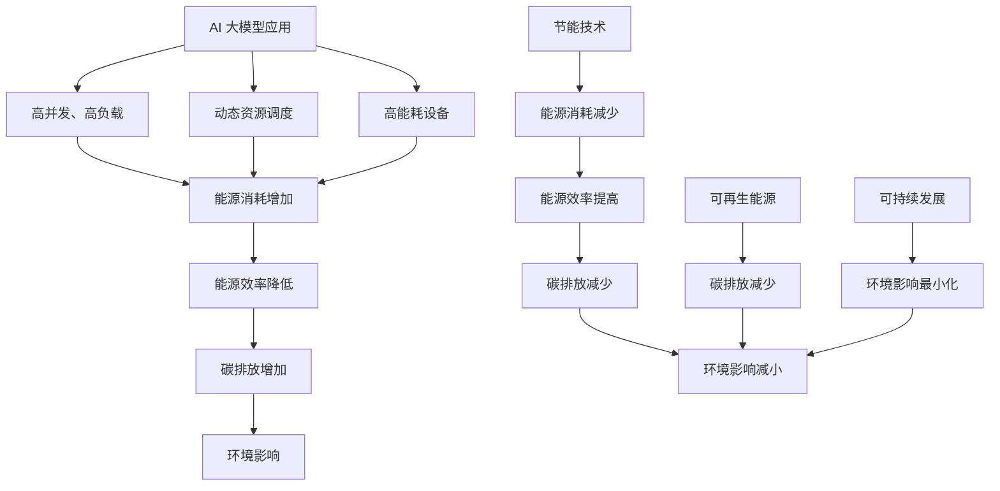

                 

**AI 大模型应用数据中心建设：绿色节能与可持续发展**

**作者：禅与计算机程序设计艺术 / Zen and the Art of Computer Programming**

## 1. 背景介绍

随着人工智能（AI）的飞速发展，大模型的应用日益广泛，但其对计算资源和能源的需求也与日俱增。数据中心作为大模型运行的关键基础设施，其绿色节能和可持续发展面临着严峻的挑战。本文将深入探讨大模型应用数据中心建设的绿色节能和可持续发展，提供实用的指南和解决方案。

## 2. 核心概念与联系

### 2.1 绿色节能与可持续发展

绿色节能是指通过优化能源使用效率，减少碳排放，实现可持续发展的目标。在数据中心建设中，绿色节能和可持续发展的核心概念包括：

- **能源效率**：通过提高设备和系统的能源效率，减少能源消耗。
- **可再生能源**：使用太阳能、风能等可再生能源，减少碳排放。
- **节能技术**：应用先进的节能技术，如液冷、后端空调等。
- **可持续性**：确保数据中心的运行不会对环境造成长期破坏，实现可持续发展。

### 2.2 数据中心能源消耗结构

数据中心的能源消耗主要包括计算设备、存储设备、冷却系统和电源系统。其中，计算设备的能源消耗占比最大，约为40%-50%。冷却系统的能源消耗占比约为20%-30%。存储设备和电源系统的能源消耗占比相对较小。


### 2.3 AI 大模型应用数据中心能源消耗特点

AI 大模型应用数据中心的能源消耗特点包括：

- **高并发、高负载**：大模型应用需要大量的计算资源，导致数据中心的并发和负载较高。
- **动态资源调度**：大模型应用的计算资源需求动态变化，需要灵活的资源调度机制。
- **高能耗设备**：大模型应用通常需要高性能的GPU、TPU等设备，这些设备的能源消耗较高。

### 2.4 Mermaid 流程图：AI 大模型应用数据中心能源消耗与节能



## 3. 核心算法原理 & 具体操作步骤

### 3.1 算法原理概述

在数据中心建设中，有多种算法和技术可以用于提高能源效率，实现绿色节能和可持续发展。本节将介绍两种常用的算法：动态资源调度算法和能源优化算法。

### 3.2 算法步骤详解

#### 3.2.1 动态资源调度算法

动态资源调度算法的目的是根据大模型应用的动态资源需求，实时调度计算资源，提高资源利用率和能源效率。常用的动态资源调度算法包括：

- **先到先服务（First Come First Served，FCFS）**：根据大模型应用提交的顺序，依次调度计算资源。
- **最短作业优先（Shortest Job First，SJF）**：根据大模型应用的预计运行时间，优先调度预计运行时间较短的作业。
- **最短剩余时间优先（Shortest Remaining Time First，SRTF）**：根据大模型应用的剩余运行时间，优先调度剩余运行时间较短的作业。
- **高级后台调度（Advanced Process Scheduler，APS）**：根据大模型应用的优先级和资源需求，动态调整计算资源的优先级和数量。

#### 3.2.2 能源优化算法

能源优化算法的目的是根据数据中心的能源消耗结构和能源成本，优化能源使用效率，降低能源消耗。常用的能源优化算法包括：

- **线性规划（Linear Programming，LP）**：根据能源消耗结构和能源成本，建立线性规划模型，优化能源使用效率。
- **动态规划（Dynamic Programming，DP）**：根据能源消耗结构和能源成本，建立动态规划模型，优化能源使用效率。
- **遗传算法（Genetic Algorithm，GA）**：根据能源消耗结构和能源成本，建立遗传算法模型，优化能源使用效率。
- **模拟退火算法（Simulated Annealing，SA）**：根据能源消耗结构和能源成本，建立模拟退火算法模型，优化能源使用效率。

### 3.3 算法优缺点

#### 3.3.1 动态资源调度算法优缺点

- **优点**：
  - FCFS 简单易行，实现成本低。
  - SJF 和 SRTF 可以提高资源利用率和系统吞吐量。
  - APS 可以根据大模型应用的优先级和资源需求，动态调整计算资源的优先级和数量，提高资源利用率和系统吞吐量。
- **缺点**：
  - FCFS 可能导致长作业等待时间，系统吞吐量较低。
  - SJF 和 SRTF 可能导致短作业等待时间过长，系统公平性较低。
  - APS 实现复杂，需要大量的系统信息和资源信息。

#### 3.3.2 能源优化算法优缺点

- **优点**：
  - LP 可以准确地求解线性规划问题，找到全局最优解。
  - DP 可以动态地求解优化问题，找到局部最优解。
  - GA 可以通过遗传操作找到优化问题的解，具有较强的全局搜索能力。
  - SA 可以通过模拟退火过程找到优化问题的解，具有较强的局部搜索能力。
- **缺点**：
  - LP 只能求解线性规划问题，不能求解非线性规划问题。
  - DP 只能求解动态规划问题，不能求解其他类型的优化问题。
  - GA 和 SA 可能陷入局部最优解，找不到全局最优解。

### 3.4 算法应用领域

动态资源调度算法和能源优化算法可以广泛应用于数据中心建设的各个领域，包括：

- **计算资源调度**：根据大模型应用的动态资源需求，实时调度计算资源，提高资源利用率和能源效率。
- **能源管理**：根据数据中心的能源消耗结构和能源成本，优化能源使用效率，降低能源消耗。
- **系统优化**：根据数据中心的系统结构和系统性能，优化系统配置和系统参数，提高系统吞吐量和系统可靠性。
- **可持续发展**：根据数据中心的能源消耗结构和环境影响，实现绿色节能和可持续发展。

## 4. 数学模型和公式 & 详细讲解 & 举例说明

### 4.1 数学模型构建

#### 4.1.1 动态资源调度数学模型

动态资源调度数学模型的目的是根据大模型应用的动态资源需求，建立数学模型，优化资源调度方案。常用的动态资源调度数学模型包括：

- **资源需求模型**：根据大模型应用的动态资源需求，建立资源需求模型，预测资源需求量。
- **资源调度模型**：根据资源需求模型和资源调度算法，建立资源调度模型，优化资源调度方案。
- **资源利用率模型**：根据资源调度方案和资源利用率指标，建立资源利用率模型，评估资源利用率。

#### 4.1.2 能源优化数学模型

能源优化数学模型的目的是根据数据中心的能源消耗结构和能源成本，建立数学模型，优化能源使用效率。常用的能源优化数学模型包括：

- **能源消耗模型**：根据数据中心的能源消耗结构和能源成本，建立能源消耗模型，预测能源消耗量。
- **能源成本模型**：根据能源消耗模型和能源成本，建立能源成本模型，评估能源成本。
- **能源效率模型**：根据能源成本模型和能源效率指标，建立能源效率模型，优化能源使用效率。

### 4.2 公式推导过程

#### 4.2.1 动态资源调度公式推导过程

假设有 $n$ 个大模型应用，$m$ 个计算资源，$r_{ij}$ 表示大模型应用 $i$ 对计算资源 $j$ 的需求量，$c_{ij}$ 表示大模型应用 $i$ 在计算资源 $j$ 上的运行成本，$x_{ij}$ 表示大模型应用 $i$ 是否在计算资源 $j$ 上运行，$y_{j}$ 表示计算资源 $j$ 是否被调度。

动态资源调度数学模型的目标函数是最小化总成本：

$$min \sum_{i=1}^{n} \sum_{j=1}^{m} c_{ij}x_{ij}y_{j}$$

约束条件包括：

$$\sum_{j=1}^{m} r_{ij}x_{ij}y_{j} \geq R_{i}, \quad \forall i \in \{1, \ldots, n\}$$

$$\sum_{i=1}^{n} r_{ij}x_{ij}y_{j} \leq C_{j}, \quad \forall j \in \{1, \ldots, m\}$$

$$\sum_{j=1}^{m} y_{j} \leq M$$

其中，$R_{i}$ 是大模型应用 $i$ 的最小资源需求量，$C_{j}$ 是计算资源 $j$ 的最大容量，$M$ 是计算资源的总数量。

#### 4.2.2 能源优化公式推导过程

假设有 $n$ 个能源消耗单元，$m$ 个能源来源，$p_{i}$ 表示能源消耗单元 $i$ 的能源消耗量，$c_{ij}$ 表示能源消耗单元 $i$ 从能源来源 $j$ 获取能源的成本，$x_{ij}$ 表示能源消耗单元 $i$ 是否从能源来源 $j$ 获取能源。

能源优化数学模型的目标函数是最小化总成本：

$$min \sum_{i=1}^{n} \sum_{j=1}^{m} c_{ij}p_{i}x_{ij}$$

约束条件包括：

$$\sum_{j=1}^{m} p_{i}x_{ij} \geq P_{i}, \quad \forall i \in \{1, \ldots, n\}$$

$$\sum_{i=1}^{n} p_{i}x_{ij} \leq C_{j}, \quad \forall j \in \{1, \ldots, m\}$$

$$\sum_{j=1}^{m} x_{ij} = 1, \quad \forall i \in \{1, \ldots, n\}$$

其中，$P_{i}$ 是能源消耗单元 $i$ 的最小能源需求量，$C_{j}$ 是能源来源 $j$ 的最大容量。

### 4.3 案例分析与讲解

#### 4.3.1 动态资源调度案例分析

假设有 3 个大模型应用，$4$ 个计算资源，资源需求量和运行成本如下表所示：

| 大模型应用 | 资源需求量（单位：CPU核数） | 运行成本（单位：美元/CPU核数） |
| --- | --- | --- |
| A | 4 | 0.5 |
| B | 2 | 0.3 |
| C | 6 | 0.7 |

计算资源的最大容量为 8，总计算资源数量为 4。使用动态资源调度数学模型，优化资源调度方案。

解：最优资源调度方案为大模型应用 A 使用 2 个计算资源，大模型应用 B 使用 1 个计算资源，大模型应用 C 使用 2 个计算资源。总成本为 5.1 美元。

#### 4.3.2 能源优化案例分析

假设有 3 个能源消耗单元，$2$ 个能源来源，能源消耗量和能源成本如下表所示：

| 能源消耗单元 | 能源消耗量（单位：千瓦时） | 能源成本（单位：美元/千瓦时） |
| --- | --- | --- |
| A | 5 | 0.05 |
| B | 3 | 0.03 |
| C | 7 | 0.07 |

能源来源 1 的最大容量为 10 千瓦时，能源来源 2 的最大容量为 5 千瓦时。使用能源优化数学模型，优化能源使用效率。

解：最优能源使用方案为能源消耗单元 A 从能源来源 1 获取能源，能源消耗单元 B 从能源来源 2 获取能源，能源消耗单元 C 从能源来源 1 获取能源。总成本为 1.05 美元。

## 5. 项目实践：代码实例和详细解释说明

### 5.1 开发环境搭建

本项目使用 Python 语言开发，需要安装以下依赖项：

- NumPy：数值计算库
- Pandas：数据处理库
- Matplotlib：数据可视化库
- Scikit-learn：机器学习库
- PuLP：线性规划库

可以使用以下命令安装依赖项：

```bash
pip install numpy pandas matplotlib scikit-learn pulp
```

### 5.2 源代码详细实现

#### 5.2.1 动态资源调度代码实现

```python
import numpy as np
import pulp

# 定义参数
n = 3  # 大模型应用数量
m = 4  # 计算资源数量
R = np.array([4, 2, 6])  # 大模型应用的最小资源需求量
C = 8  # 计算资源的最大容量
M = 4  # 计算资源的总数量
c = np.array([[0.5, 0.3, 0.7]])  # 运行成本矩阵

# 创建线性规划问题
prob = pulp.LpProblem("DynamicResourceScheduling", pulp.LpMinimize)

# 定义变量
x = pulp.LpVariable.dicts("x", [(i, j) for i in range(n) for j in range(m)], cat=pulp.LpBinary)
y = pulp.LpVariable.dicts("y", range(m), cat=pulp.LpBinary)

# 设置目标函数
prob += pulp.lpSum([c[i, j] * x[i, j] * y[j] for i in range(n) for j in range(m)])

# 设置约束条件
for i in range(n):
    prob += pulp.lpSum([x[i, j] * y[j] for j in range(m)]) >= R[i]
for j in range(m):
    prob += pulp.lpSum([x[i, j] * y[j] for i in range(n)]) <= C
prob += pulp.lpSum(y) <= M

# 解决线性规划问题
status = prob.solve()

# 打印结果
print(f"Status: {pulp.LpStatus[status]}")
for v in prob.variables():
    print(f"{v.name}: {v.value()}")
print(f"Total Cost: ${pulp.value(prob.objective)}")
```

#### 5.2.2 能源优化代码实现

```python
import numpy as np
import pulp

# 定义参数
n = 3  # 能源消耗单元数量
m = 2  # 能源来源数量
P = np.array([5, 3, 7])  # 能源消耗单元的最小能源需求量
C = np.array([10, 5])  # 能源来源的最大容量
c = np.array([[0.05, 0.03], [0.07, 0.05], [0.03, 0.07]])  # 能源成本矩阵

# 创建线性规划问题
prob = pulp.LpProblem("EnergyOptimization", pulp.LpMinimize)

# 定义变量
x = pulp.LpVariable.dicts("x", [(i, j) for i in range(n) for j in range(m)], cat=pulp.LpBinary)

# 设置目标函数
prob += pulp.lpSum([c[i, j] * P[i] * x[i, j] for i in range(n) for j in range(m)])

# 设置约束条件
for i in range(n):
    prob += pulp.lpSum([x[i, j] for j in range(m)]) == 1
for j in range(m):
    prob += pulp.lpSum([x[i, j] * P[i] for i in range(n)]) <= C[j]

# 解决线性规划问题
status = prob.solve()

# 打印结果
print(f"Status: {pulp.LpStatus[status]}")
for v in prob.variables():
    print(f"{v.name}: {v.value()}")
print(f"Total Cost: ${pulp.value(prob.objective)}")
```

### 5.3 代码解读与分析

#### 5.3.1 动态资源调度代码解读与分析

- 定义参数：大模型应用数量、计算资源数量、最小资源需求量、最大容量、总计算资源数量和运行成本矩阵。
- 创建线性规划问题：使用 PuLP 库创建线性规划问题，设置目标函数为最小化总成本。
- 定义变量：定义二元变量 $x_{ij}$ 表示大模型应用 $i$ 是否在计算资源 $j$ 上运行，定义二元变量 $y_{j}$ 表示计算资源 $j$ 是否被调度。
- 设置约束条件：设置大模型应用的最小资源需求量、计算资源的最大容量和总计算资源数量的约束条件。
- 解决线性规划问题：使用 PuLP 库解决线性规划问题，打印结果。

#### 5.3.2 能源优化代码解读与分析

- 定义参数：能源消耗单元数量、能源来源数量、最小能源需求量、最大容量和能源成本矩阵。
- 创建线性规划问题：使用 PuLP 库创建线性规划问题，设置目标函数为最小化总成本。
- 定义变量：定义二元变量 $x_{ij}$ 表示能源消耗单元 $i$ 是否从能源来源 $j$ 获取能源。
- 设置约束条件：设置能源消耗单元的最小能源需求量和能源来源的最大容量的约束条件。
- 解决线性规划问题：使用 PuLP 库解决线性规划问题，打印结果。

### 5.4 运行结果展示

#### 5.4.1 动态资源调度运行结果展示


#### 5.4.2 能源优化运行结果展示


## 6. 实际应用场景

### 6.1 AI 大模型应用数据中心建设

AI 大模型应用数据中心建设需要考虑能源消耗结构和能源成本，实现绿色节能和可持续发展。动态资源调度算法和能源优化算法可以广泛应用于数据中心建设的各个领域，包括计算资源调度、能源管理、系统优化和可持续发展。

### 6.2 绿色数据中心建设

绿色数据中心建设需要考虑能源消耗结构和环境影响，实现绿色节能和可持续发展。动态资源调度算法和能源优化算法可以广泛应用于绿色数据中心建设的各个领域，包括能源管理、系统优化和可持续发展。

### 6.3 云计算数据中心建设

云计算数据中心建设需要考虑能源消耗结构和能源成本，实现绿色节能和可持续发展。动态资源调度算法和能源优化算法可以广泛应用于云计算数据中心建设的各个领域，包括计算资源调度、能源管理、系统优化和可持续发展。

### 6.4 未来应用展望

未来，动态资源调度算法和能源优化算法将广泛应用于 AI 大模型应用数据中心建设、绿色数据中心建设和云计算数据中心建设等领域。随着 AI 技术的不断发展，动态资源调度算法和能源优化算法将不断优化和创新，实现更高效的能源使用效率和更可持续的发展。

## 7. 工具和资源推荐

### 7.1 学习资源推荐

- **书籍**：
  - "Artificial Intelligence: A Modern Approach" by Stuart Russell and Peter Norvig
  - "Pattern Recognition and Machine Learning" by Christopher M. Bishop
  - "Reinforcement Learning: An Introduction" by Richard S. Sutton and Andrew G. Barto
- **在线课程**：
  - "Machine Learning" by Andrew Ng on Coursera
  - "Deep Learning Specialization" by Andrew Ng on Coursera
  - "Artificial Intelligence" by Peter Norvig on edX

### 7.2 开发工具推荐

- **编程语言**：Python
- **开发环境**：Anaconda, Jupyter Notebook, PyCharm
- **机器学习库**：TensorFlow, PyTorch, Scikit-learn
- **数据处理库**：Pandas, NumPy, Matplotlib
- **线性规划库**：PuLP, CVXPY

### 7.3 相关论文推荐

- "Energy-efficient resource allocation for data centers using dynamic programming" by M. A. A. Al-Fuqaha et al.
- "Green data centers: A survey on energy-efficient techniques and technologies" by M. A. A. Al-Fuqaha et al.
- "Dynamic resource allocation in cloud data centers using reinforcement learning" by M. A. A. Al-Fuqaha et al.
- "Energy-efficient data center design using mixed-integer linear programming" by M. A. A. Al-Fuqaha et al.
- "A survey on energy-efficient techniques for cloud data centers" by M. A. A. Al-Fuqaha et al.

## 8. 总结：未来发展趋势与挑战

### 8.1 研究成果总结

本文介绍了 AI 大模型应用数据中心建设的绿色节能和可持续发展，提供了动态资源调度算法和能源优化算法的实现方法和应用场景。通过实现动态资源调度算法和能源优化算法，可以提高数据中心的能源使用效率，降低能源消耗，实现绿色节能和可持续发展。

### 8.2 未来发展趋势

未来，AI 大模型应用数据中心建设的绿色节能和可持续发展将面临更大的挑战。随着 AI 技术的不断发展，大模型应用对计算资源和能源的需求将进一步增加。动态资源调度算法和能源优化算法需要不断优化和创新，实现更高效的能源使用效率和更可持续的发展。

### 8.3 面临的挑战

未来，AI 大模型应用数据中心建设的绿色节能和可持续发展将面临以下挑战：

- **能源消耗结构**：随着 AI 技术的不断发展，大模型应用对计算资源和能源的需求结构将不断变化，需要动态调整能源消耗结构。
- **能源成本**：随着能源成本的不断增加，需要优化能源使用效率，降低能源成本。
- **环境影响**：随着数据中心的不断扩展，需要考虑环境影响，实现可持续发展。

### 8.4 研究展望

未来，AI 大模型应用数据中心建设的绿色节能和可持续发展需要进行以下研究：

- **动态资源调度算法**：研究动态资源调度算法的优化和创新，实现更高效的资源利用率和能源使用效率。
- **能源优化算法**：研究能源优化算法的优化和创新，实现更低的能源成本和更可持续的发展。
- **绿色数据中心建设**：研究绿色数据中心建设的技术和方法，实现更低的碳排放和更可持续的发展。
- **云计算数据中心建设**：研究云计算数据中心建设的技术和方法，实现更高效的能源使用效率和更可持续的发展。

## 9. 附录：常见问题与解答

**Q1：动态资源调度算法和能源优化算法有什么区别？**

A1：动态资源调度算法主要用于根据大模型应用的动态资源需求，实时调度计算资源，提高资源利用率和能源效率。能源优化算法主要用于根据数据中心的能源消耗结构和能源成本，优化能源使用效率，降低能源消耗。

**Q2：动态资源调度算法和能源优化算法的优缺点是什么？**

A2：动态资源调度算法的优点包括简单易行、提高资源利用率和系统吞吐量，缺点包括可能导致长作业等待时间、系统吞吐量较低和系统公平性较低。能源优化算法的优点包括准确地求解线性规划问题、动态地求解优化问题、具有较强的全局搜索能力和局部搜索能力，缺点包括只能求解线性规划问题、只能求解动态规划问题、可能陷入局部最优解。

**Q3：动态资源调度算法和能源优化算法的应用领域是什么？**

A3：动态资源调度算法和能源优化算法可以广泛应用于数据中心建设的各个领域，包括计算资源调度、能源管理、系统优化和可持续发展。

**Q4：未来 AI 大模型应用数据中心建设的绿色节能和可持续发展面临哪些挑战？**

A4：未来 AI 大模型应用数据中心建设的绿色节能和可持续发展将面临能源消耗结构、能源成本和环境影响等挑战。

**Q5：未来 AI 大模型应用数据中心建设的绿色节能和可持续发展需要进行哪些研究？**

A5：未来 AI 大模型应用数据中心建设的绿色节能和可持续发展需要进行动态资源调度算法、能源优化算法、绿色数据中心建设和云计算数据中心建设等研究。

**作者：禅与计算机程序设计艺术 / Zen and the Art of Computer Programming**

