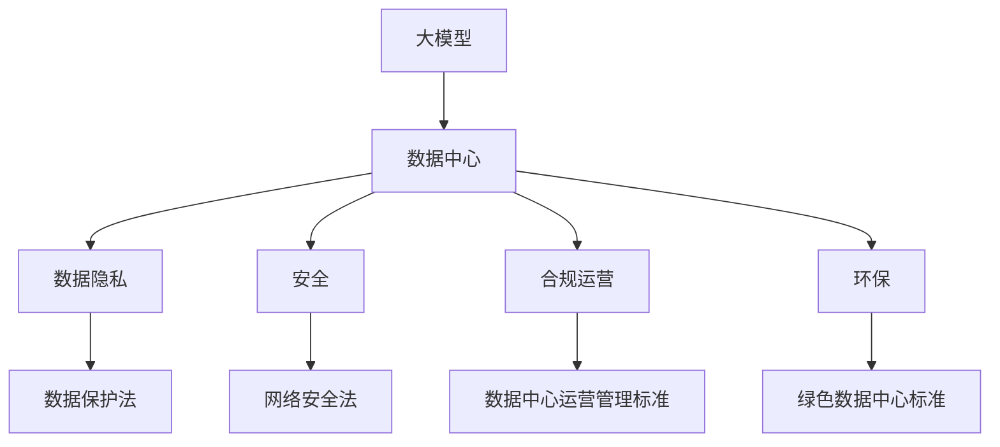

                 

**AI 大模型应用数据中心的法律法规**

**作者：禅与计算机程序设计艺术 / Zen and the Art of Computer Programming**

## 1. 背景介绍

随着人工智能（AI）技术的飞速发展，大模型在各行各业的应用日益广泛。数据中心作为大模型运行的关键基础设施，其合法性和安全性受到越来越多的关注。本文将深入探讨AI大模型应用数据中心的法律法规，帮助读者理解其合规运行的必要性和挑战。

## 2. 核心概念与联系

### 2.1 关键概念

- **大模型（Large Model）**：指具有数十亿甚至数千亿参数的模型，能够处理大量数据并产生人类可理解的输出。
- **数据中心（Data Center）**：为大模型提供运算、存储和网络服务的物理基础设施。
- **法律法规（Legal and Regulatory）**：指规范数据中心运行的法律、法规和标准。

### 2.2 关联关系

大模型应用数据中心的法律法规涉及多个领域，包括数据隐私、安全、合规运营、环保等。这些领域相互关联，共同构成了大模型应用数据中心的合法性框架。下图展示了这些概念的关系：



## 3. 核心算法原理 & 具体操作步骤

### 3.1 算法原理概述

大模型应用数据中心的法律法规实施需要依赖于一系列算法，用于数据收集、分析和决策支持。这些算法包括但不限于：

- **数据收集算法**：用于从各种来源收集数据，包括但不限于用户数据、设备数据和环境数据。
- **数据分析算法**：用于分析收集到的数据，识别模式和趋势，并提供见解。
- **决策支持算法**：用于根据数据分析结果，提供合规决策建议。

### 3.2 算法步骤详解

1. **数据收集**：收集数据中心的各种数据，包括但不限于用户数据、设备数据和环境数据。
2. **数据预处理**：清洗、转换和标准化收集到的数据，以便于分析。
3. **数据分析**：使用机器学习算法分析预处理后的数据，识别模式和趋势。
4. **决策支持**：根据数据分析结果，提供合规决策建议，帮助数据中心运营者做出决策。

### 3.3 算法优缺点

**优点**：

- 提高数据中心运营的效率和效果。
- 降低人为错误和偏见。
- 提供数据驱动的决策支持。

**缺点**：

- 算法本身可能存在偏见和错误。
- 算法结果需要由人类专家进行审查和验证。
- 算法的复杂性可能导致理解和解释困难。

### 3.4 算法应用领域

大模型应用数据中心的法律法规算法可以应用于以下领域：

- **数据隐私**：用于识别和保护用户数据。
- **安全**：用于检测和预防数据泄露和攻击。
- **合规运营**：用于监控和改进数据中心的运营合规性。
- **环保**：用于监控和改进数据中心的能源效率和环保合规性。

## 4. 数学模型和公式 & 详细讲解 & 举例说明

### 4.1 数学模型构建

构建大模型应用数据中心的法律法规数学模型需要考虑以下因素：

- **数据输入**：用户数据、设备数据和环境数据。
- **数据处理**：数据清洗、转换和标准化。
- **数据分析**：机器学习算法。
- **决策输出**：合规决策建议。

### 4.2 公式推导过程

假设数据中心的运营合规性可以用函数$C$表示，则可以将其表示为：

$$C = f(D, P, A, R)$$

其中，$D$表示数据输入，$P$表示数据处理，$A$表示数据分析，$R$表示决策输出。

### 4.3 案例分析与讲解

例如，在数据隐私领域，可以使用差异隐私机制来保护用户数据。差异隐私机制可以表示为：

$$K = \max\left(\frac{1}{2}\left(\frac{\epsilon}{\delta}\right)^{1/\epsilon}, 1\right)$$

其中，$K$表示数据的差异隐私保护强度，$epsilon$表示可接受的错误率，$delta$表示可接受的差异。

## 5. 项目实践：代码实例和详细解释说明

### 5.1 开发环境搭建

本项目使用Python作为编程语言，并依赖于以下库：

- Pandas：数据处理和分析。
- Scikit-learn：机器学习算法。
- TensorFlow：神经网络算法。

### 5.2 源代码详细实现

以下是一个简单的数据分析算法示例，用于识别数据中心的异常运行：

```python
import pandas as pd
from sklearn.ensemble import IsolationForest

# 加载数据
data = pd.read_csv('data_center_data.csv')

# 数据预处理
data = data.dropna()

# 定义异常检测算法
clf = IsolationForest(contamination=0.01)

# 训练算法
clf.fit(data)

# 检测异常
predictions = clf.predict(data)

# 筛选异常数据
anomalies = data[predictions == -1]

# 保存结果
anomalies.to_csv('anomalies.csv', index=False)
```

### 5.3 代码解读与分析

该代码使用 Isolation Forest 算法检测数据中心的异常运行。Isolation Forest 是一种无监督学习算法，用于检测数据集中的异常值。它通过构建决策树来分隔异常值，并将异常值与正常值进行比较，从而识别异常值。

### 5.4 运行结果展示

运行该代码后，将会生成一个名为 'anomalies.csv' 的文件，其中包含数据中心的异常运行数据。

## 6. 实际应用场景

### 6.1 数据隐私

大模型应用数据中心的法律法规可以帮助保护用户数据隐私。例如，可以使用差异隐私机制来保护用户数据，并使用访问控制列表（ACL）来限制数据访问权限。

### 6.2 安全

大模型应用数据中心的法律法规可以帮助提高数据中心的安全性。例如，可以使用入侵检测系统（IDS）来检测和预防数据泄露和攻击，并使用加密技术来保护数据。

### 6.3 合规运营

大模型应用数据中心的法律法规可以帮助数据中心运营者合规运营。例如，可以使用合规检查算法来监控和改进数据中心的运营合规性，并使用合规报告系统来记录和报告合规情况。

### 6.4 未来应用展望

随着大模型技术的发展，大模型应用数据中心的法律法规将会变得越来越重要。未来，大模型将会在更多领域得到应用，包括自动驾驶、医疗保健和金融服务等。数据中心的法律法规将会帮助这些领域的数据中心合法运行，并保护用户数据和安全。

## 7. 工具和资源推荐

### 7.1 学习资源推荐

- **书籍**：《数据中心运营管理》《数据隐私保护》《网络安全基础》《环保法规与实践》。
- **在线课程**：Coursera、Udacity、edX 上的数据中心运营、数据隐私保护、网络安全和环保法规课程。

### 7.2 开发工具推荐

- **数据处理和分析**：Python（Pandas、NumPy）、R、SAS。
- **机器学习**：Scikit-learn、TensorFlow、PyTorch。
- **数据可视化**：Matplotlib、Seaborn、Tableau。

### 7.3 相关论文推荐

- **数据隐私保护**：Differential Privacy: A Survey of Results（2008）。
- **网络安全**：Intrusion Detection Systems: A Survey（2002）。
- **环保法规**：Green Data Centers: A Review（2019）。

## 8. 总结：未来发展趋势与挑战

### 8.1 研究成果总结

本文介绍了大模型应用数据中心的法律法规的核心概念、算法原理、数学模型和公式、项目实践、实际应用场景、工具和资源推荐。通过这些内容，读者可以更好地理解大模型应用数据中心的法律法规，并学习如何实施和应用这些法律法规。

### 8.2 未来发展趋势

未来，大模型应用数据中心的法律法规将会变得越来越复杂和多样化。随着大模型技术的发展，数据中心的规模和复杂性也将会增加。法律法规需要不断更新和完善，以适应新的技术和挑战。

### 8.3 面临的挑战

大模型应用数据中心的法律法规面临着多个挑战，包括：

- **数据隐私保护**：如何在保护用户数据隐私的同时，允许数据中心合法运行。
- **安全**：如何防止数据泄露和攻击，并保护数据中心的安全。
- **合规运营**：如何监控和改进数据中心的运营合规性，并满足各种法规要求。
- **环保**：如何降低数据中心的能源消耗和碳排放，并满足环保法规要求。

### 8.4 研究展望

未来的研究将会关注大模型应用数据中心的法律法规的以下领域：

- **自动化合规**：开发自动化工具，帮助数据中心运营者合规运营。
- **区块链技术**：研究区块链技术在大模型应用数据中心法律法规中的应用，以提高安全性和透明度。
- **人工智能合规**：研究人工智能在大模型应用数据中心法律法规中的应用，以提高合规性和效率。

## 9. 附录：常见问题与解答

**Q1：大模型应用数据中心的法律法规有哪些？**

A1：大模型应用数据中心的法律法规包括但不限于数据隐私保护法、网络安全法、数据中心运营管理标准和绿色数据中心标准等。

**Q2：如何实施大模型应用数据中心的法律法规？**

A2：实施大模型应用数据中心的法律法规需要依赖于一系列算法，用于数据收集、分析和决策支持。这些算法包括但不限于数据收集算法、数据分析算法和决策支持算法。

**Q3：大模型应用数据中心的法律法规面临哪些挑战？**

A3：大模型应用数据中心的法律法规面临着多个挑战，包括数据隐私保护、安全、合规运营和环保等。

**Q4：未来大模型应用数据中心的法律法规将会如何发展？**

A4：未来，大模型应用数据中心的法律法规将会变得越来越复杂和多样化。法律法规需要不断更新和完善，以适应新的技术和挑战。未来的研究将会关注自动化合规、区块链技术和人工智能合规等领域。

**Q5：如何学习大模型应用数据中心的法律法规？**

A5：可以通过阅读相关书籍、在线课程和论文，并使用相关开发工具和资源，学习大模型应用数据中心的法律法规。

**END**

