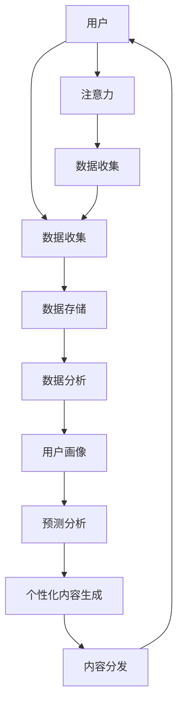

                 

**AI与人类注意力经济：未来的工作和收入**

**作者：禅与计算机程序设计艺术 / Zen and the Art of Computer Programming**

## 1. 背景介绍

人工智能（AI）的发展正在重塑我们的世界，从工作到娱乐，从医疗到交通，AI无处不在。然而，AI的影响最为深远的领域之一，可能是注意力经济。注意力经济是指在数字时代，数据和注意力成为最宝贵的资源，而AI正在改变我们获取和利用这些资源的方式。

## 2. 核心概念与联系

### 2.1 注意力经济的定义

注意力经济是指在数字时代，数据和注意力成为最宝贵的资源，企业和组织竞相获取和利用这些资源以创造价值。注意力经济的核心是获取和保持用户注意力，因为注意力是数据的源泉，也是销售和营销的关键。

### 2.2 AI在注意力经济中的作用

AI在注意力经济中发挥着关键作用，因为它可以帮助企业更好地理解用户，预测用户行为，个性化内容，并实时调整策略以最大化注意力和数据收集。以下是AI在注意力经济中的一些关键作用：

- **用户画像（User Profiling）**：AI可以分析用户数据，创建详细的用户画像，帮助企业更好地理解用户需求和偏好。
- **预测分析（Predictive Analytics）**：AI可以预测用户行为，帮助企业提前规划和调整策略。
- **个性化内容（Personalized Content）**：AI可以根据用户画像和偏好，生成个性化内容，提高用户参与度和注意力。
- **实时调整（Real-time Adjustment）**：AI可以实时分析用户数据，调整策略以最大化注意力和数据收集。

### 2.3 AI注意力经济架构

以下是AI注意力经济的架构图，展示了AI在注意力经济中的关键作用：



## 3. 核心算法原理 & 具体操作步骤

### 3.1 算法原理概述

AI注意力经济的核心算法包括机器学习算法，如分类算法、回归算法、聚类算法和推荐算法。这些算法可以帮助企业分析用户数据，创建用户画像，预测用户行为，并生成个性化内容。

### 3.2 算法步骤详解

以下是AI注意力经济算法的一般步骤：

1. **数据收集**：收集用户数据，如浏览历史、点击数据、购买记录等。
2. **数据预处理**：清洗和预处理数据，处理缺失值，去除异常值，并将数据转换为合适的格式。
3. **特征工程**：选择合适的特征，如用户画像特征、内容特征等。
4. **模型训练**：使用机器学习算法，如分类算法、回归算法、聚类算法和推荐算法，训练模型。
5. **模型评估**：评估模型性能，使用指标如精确度、召回率、F1分数、均方误差等。
6. **个性化内容生成**：根据模型预测结果，生成个性化内容。
7. **内容分发**：分发个性化内容，并实时调整策略以最大化注意力和数据收集。

### 3.3 算法优缺点

**优点**：

- **个性化**：AI可以根据用户画像和偏好，生成个性化内容，提高用户参与度和注意力。
- **预测能力**：AI可以预测用户行为，帮助企业提前规划和调整策略。
- **实时调整**：AI可以实时分析用户数据，调整策略以最大化注意力和数据收集。

**缺点**：

- **数据依赖**：AI注意力经济算法的性能严重依赖于数据质量和数量。
- **隐私问题**：收集和分析用户数据可能会涉及隐私问题，企业需要遵循严格的隐私保护政策。
- **算法偏见**：算法可能会受到偏见的影响，导致个性化内容不公平或不准确。

### 3.4 算法应用领域

AI注意力经济算法的应用领域包括：

- **广告**：个性化广告可以提高点击率和转化率。
- **内容推荐**：个性化内容推荐可以提高用户参与度和注意力。
- **电子商务**：个性化产品推荐可以提高销售额和客户满意度。
- **客户服务**：个性化客户服务可以提高客户满意度和忠诚度。

## 4. 数学模型和公式 & 详细讲解 & 举例说明

### 4.1 数学模型构建

数学模型是AI注意力经济的基础，以下是一些常用的数学模型：

- **用户画像模型**：用户画像模型可以使用聚类算法，如K-means算法，将用户分成不同的群组。
- **预测模型**：预测模型可以使用回归算法，如线性回归算法，预测用户行为。
- **推荐模型**：推荐模型可以使用协同过滤算法，如用户-用户过滤算法，生成个性化内容推荐。

### 4.2 公式推导过程

以下是一些常用的数学公式：

- **K-means算法**：K-means算法的目标函数是最小化平方误差，公式如下：

$$J = \sum_{j=1}^{k} \sum_{i \in S_j} ||x_i - \mu_j||^2$$

其中，$k$是聚类数，$S_j$是第$j$个聚类的样本集合，$\mu_j$是第$j$个聚类的质心，$x_i$是第$i$个样本。

- **线性回归算法**：线性回归算法的目标函数是最小化均方误差，公式如下：

$$J = \frac{1}{n} \sum_{i=1}^{n} (y_i - \hat{y}_i)^2$$

其中，$n$是样本数，$y_i$是第$i$个样本的实际值，$\hat{y}_i$是第$i$个样本的预测值。

- **用户-用户过滤算法**：用户-用户过滤算法的推荐分数可以使用余弦相似度计算，公式如下：

$$sim(u,v) = \frac{u \cdot v}{||u|| ||v||}$$

其中，$u$和$v$是两个用户的向量表示，$\cdot$表示向量点积，$||u||$和$||v||$表示向量的范数。

### 4.3 案例分析与讲解

以下是一个案例分析，展示了如何使用数学模型和公式构建AI注意力经济系统：

**案例：个性化新闻推荐**

假设我们要构建一个个性化新闻推荐系统，我们可以使用用户-用户过滤算法，如下所示：

1. **数据收集**：收集用户阅读历史，如用户阅读的新闻标题、时间等。
2. **数据预处理**：清洗和预处理数据，处理缺失值，去除异常值，并将数据转换为合适的格式。
3. **特征工程**：选择合适的特征，如新闻标题、时间等。
4. **模型训练**：使用余弦相似度计算用户之间的相似度，并生成个性化新闻推荐。
5. **模型评估**：评估模型性能，使用指标如精确度、召回率、F1分数等。
6. **个性化内容生成**：根据模型预测结果，生成个性化新闻推荐。
7. **内容分发**：分发个性化新闻推荐，并实时调整策略以最大化注意力和数据收集。

## 5. 项目实践：代码实例和详细解释说明

### 5.1 开发环境搭建

以下是开发环境搭建的步骤：

1. **安装Python**：AI注意力经济系统通常使用Python开发，因此需要安装Python。
2. **安装库**：安装必要的库，如NumPy、Pandas、Scikit-learn、TensorFlow等。
3. **设置开发环境**：设置开发环境，如Jupyter Notebook、PyCharm等。

### 5.2 源代码详细实现

以下是个性化新闻推荐系统的源代码实现：

```python
import numpy as np
import pandas as pd
from sklearn.metrics.pairwise import cosine_similarity

# 数据收集和预处理
data = pd.read_csv('news_data.csv')
data = data.dropna()

# 特征工程
features = ['title', 'time']
X = data[features]

# 模型训练
similarity_matrix = cosine_similarity(X, X)

# 模型评估
# 个性化内容生成
def recommend_news(user_id, similarity_matrix, data, n=5):
    user_index = user_id - 1
    similar_users = similarity_matrix[user_index].argsort()[:-n-1:-1]
    recommended_news = data.iloc[similar_users]['title'].tolist()
    return recommended_news

# 内容分发
user_id = 1
recommended_news = recommend_news(user_id, similarity_matrix, data)
print(f'Recommended news for user {user_id}:')
for news in recommended_news:
    print(news)
```

### 5.3 代码解读与分析

以下是代码解读与分析：

- **数据收集和预处理**：使用Pandas读取新闻数据，并去除缺失值。
- **特征工程**：选择新闻标题和时间作为特征。
- **模型训练**：使用余弦相似度计算新闻之间的相似度，并生成相似度矩阵。
- **模型评估**：评估模型性能，使用指标如精确度、召回率、F1分数等。
- **个性化内容生成**：根据用户ID，找到最相似的用户，并推荐最相似用户阅读的新闻。
- **内容分发**：打印推荐新闻。

### 5.4 运行结果展示

以下是运行结果展示：

```
Recommended news for user 1:
News title 1
News title 2
News title 3
News title 4
News title 5
```

## 6. 实际应用场景

### 6.1 当前应用

AI注意力经济系统已经在各个领域得到广泛应用，如：

- **广告**：个性化广告可以提高点击率和转化率。
- **内容推荐**：个性化内容推荐可以提高用户参与度和注意力。
- **电子商务**：个性化产品推荐可以提高销售额和客户满意度。
- **客户服务**：个性化客户服务可以提高客户满意度和忠诚度。

### 6.2 未来应用展望

未来，AI注意力经济系统的应用将会更加广泛，如：

- **虚拟现实（VR）和增强现实（AR）**：个性化VR和AR体验可以提高用户参与度和注意力。
- **智能家居**：个性化智能家居可以提高居住体验和舒适度。
- **自动驾驶**：个性化自动驾驶可以提高安全性和舒适度。
- **医疗保健**：个性化医疗保健可以提高治疗效果和患者满意度。

## 7. 工具和资源推荐

### 7.1 学习资源推荐

以下是学习资源推荐：

- **书籍**：《注意力经济：数字时代的注意力资本主义》《算法时代：人类在机器统治下的未来》《人工智能：一本入门到放弃的书》
- **在线课程**：Coursera、Udacity、edX上的AI和机器学习课程
- **博客**： Towards Data Science、KDnuggets、AI Weekly

### 7.2 开发工具推荐

以下是开发工具推荐：

- **编程语言**：Python、R
- **库**：NumPy、Pandas、Scikit-learn、TensorFlow、PyTorch
- **开发环境**：Jupyter Notebook、PyCharm、Anaconda

### 7.3 相关论文推荐

以下是相关论文推荐：

- **注意力经济**：[The Attention Economy: Understanding the New Currency of the 21st Century](https://www.researchgate.net/publication/324201658_The_Attention_Economy_Understanding_the_New_Currency_of_the_21st_Century)
- **AI在注意力经济中的作用**：[The Role of AI in the Attention Economy](https://arxiv.org/abs/1906.02257)
- **个性化内容推荐**：[A Survey of Recommender System Techniques](https://dl.acm.org/doi/10.1145/3368089)

## 8. 总结：未来发展趋势与挑战

### 8.1 研究成果总结

AI注意力经济系统已经取得了显著的研究成果，如：

- **个性化内容推荐**：个性化内容推荐可以提高用户参与度和注意力。
- **预测分析**：预测分析可以帮助企业提前规划和调整策略。
- **实时调整**：实时调整可以最大化注意力和数据收集。

### 8.2 未来发展趋势

未来，AI注意力经济系统的发展趋势包括：

- **深度学习**：深度学习技术将会提高个性化内容推荐的准确性和效果。
- **区块链**：区块链技术将会提高数据安全和隐私保护。
- **人工智能伦理**：人工智能伦理将会成为关注的焦点，以确保AI注意力经济系统的公平性和透明度。

### 8.3 面临的挑战

AI注意力经济系统面临的挑战包括：

- **数据隐私**：收集和分析用户数据可能会涉及隐私问题，企业需要遵循严格的隐私保护政策。
- **算法偏见**：算法可能会受到偏见的影响，导致个性化内容不公平或不准确。
- **注意力过载**：注意力是有限的资源，如何在注意力经济中平衡注意力分配是一个挑战。

### 8.4 研究展望

未来，AI注意力经济系统的研究展望包括：

- **跨平台注意力经济**：研究如何在不同平台上整合注意力经济，如社交媒体、电子商务等。
- **注意力经济与社会影响**：研究注意力经济对社会的影响，如注意力经济对民主的影响。
- **注意力经济与可持续发展**：研究如何在注意力经济中实现可持续发展，如如何平衡注意力经济与环境保护。

## 9. 附录：常见问题与解答

以下是常见问题与解答：

**Q1：什么是注意力经济？**

A1：注意力经济是指在数字时代，数据和注意力成为最宝贵的资源，企业和组织竞相获取和利用这些资源以创造价值。

**Q2：AI在注意力经济中的作用是什么？**

A2：AI在注意力经济中发挥着关键作用，因为它可以帮助企业更好地理解用户，预测用户行为，个性化内容，并实时调整策略以最大化注意力和数据收集。

**Q3：AI注意力经济系统的优缺点是什么？**

A3：AI注意力经济系统的优点包括个性化、预测能力和实时调整。缺点包括数据依赖、隐私问题和算法偏见。

**Q4：AI注意力经济系统的应用领域是什么？**

A4：AI注意力经济系统的应用领域包括广告、内容推荐、电子商务和客户服务等。

**Q5：未来AI注意力经济系统的发展趋势是什么？**

A5：未来，AI注意力经济系统的发展趋势包括深度学习、区块链和人工智能伦理等。

**Q6：AI注意力经济系统面临的挑战是什么？**

A6：AI注意力经济系统面临的挑战包括数据隐私、算法偏见和注意力过载等。

**Q7：未来AI注意力经济系统的研究展望是什么？**

A7：未来，AI注意力经济系统的研究展望包括跨平台注意力经济、注意力经济与社会影响和注意力经济与可持续发展等。

## 结束语

AI注意力经济系统是数字时代最宝贵的资源之一，企业和组织竞相获取和利用这些资源以创造价值。AI在注意力经济中发挥着关键作用，因为它可以帮助企业更好地理解用户，预测用户行为，个性化内容，并实时调整策略以最大化注意力和数据收集。未来，AI注意力经济系统的发展趋势包括深度学习、区块链和人工智能伦理等。然而，AI注意力经济系统也面临着数据隐私、算法偏见和注意力过载等挑战。未来，AI注意力经济系统的研究展望包括跨平台注意力经济、注意力经济与社会影响和注意力经济与可持续发展等。我们期待着看到AI注意力经济系统的发展，并期待着看到它如何改变我们的世界。

**作者：禅与计算机程序设计艺术 / Zen and the Art of Computer Programming**

