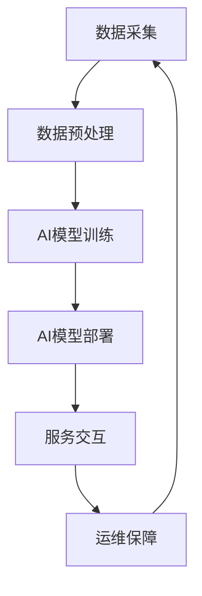

                 

## AI创业公司如何打造服务体系?

> 关键词：AI服务体系、AI产品化、AI平台构建、AI服务模式、AI创业

## 1. 背景介绍

随着人工智能（AI）技术的飞速发展，AI创业公司如雨后春笋般涌现。然而，如何打造有效的服务体系，将AI技术转化为商业价值，是这些创业公司面临的共同挑战。本文将从AI服务体系的构建、AI产品化、AI平台构建、AI服务模式等方面，为AI创业公司提供指导。

## 2. 核心概念与联系

### 2.1 AI服务体系构成

AI服务体系是指将AI技术应用于商业服务的系统架构，其核心是AI模型和算法，外围是数据处理、服务交互、运维保障等环节。如下图所示：



### 2.2 AI服务体系与AI产品化

AI服务体系的目标是实现AI产品化，将AI技术转化为商业价值。AI产品化是指将AI模型和算法封装为可以交付给用户的产品或服务。AI服务体系为AI产品化提供了支撑，二者密不可分。

## 3. 核心算法原理 & 具体操作步骤

### 3.1 算法原理概述

AI服务体系的核心是AI模型和算法。常见的AI算法包括监督学习、无监督学习、强化学习等。本文以监督学习为例，介绍其原理和操作步骤。

### 3.2 算法步骤详解

监督学习的目标是学习输入数据和输出数据之间的映射关系，从而对新输入数据进行预测。其操作步骤如下：

1. 数据收集：收集与问题相关的数据。
2. 数据预处理：清洗、标准化、特征工程等。
3. 模型选择：选择合适的监督学习算法，如线性回归、逻辑回归、决策树、随机森林等。
4. 模型训练：使用训练数据训练模型。
5. 模型评估：使用验证数据评估模型性能。
6. 模型优化：调整模型参数，优化模型性能。
7. 模型部署：将模型部署到生产环境，为用户提供服务。

### 3.3 算法优缺点

监督学习算法的优点包括：可以处理结构化数据，可以对新数据进行预测，可以评估模型性能。其缺点包括：需要大量标注数据，对数据质量要求高，对模型选择和参数调整敏感。

### 3.4 算法应用领域

监督学习算法广泛应用于图像识别、语音识别、自然语言处理、推荐系统等领域。

## 4. 数学模型和公式 & 详细讲解 & 举例说明

### 4.1 数学模型构建

以线性回归为例，其数学模型为：

$$y = \beta_0 + \beta_1x_1 + \beta_2x_2 + \ldots + \beta_nx_n + \epsilon$$

其中，$y$是目标变量，$x_1, x_2, \ldots, x_n$是特征变量，$\beta_0, \beta_1, \ldots, \beta_n$是模型参数，$\epsilon$是误差项。

### 4.2 公式推导过程

线性回归模型的参数可以通过最小二乘法推导出来。最小二乘法的目标是最小化误差平方和：

$$\min_{\beta_0, \beta_1, \ldots, \beta_n} \sum_{i=1}^{n} (y_i - \hat{y}_i)^2$$

其中，$y_i$是第$i$个样本的目标变量，$ \hat{y}_i$是模型预测的目标变量。通过对参数求导并设置为零，可以得到参数的解析解。

### 4.3 案例分析与讲解

例如，假设我们要预测房价，特征变量包括房屋面积、房龄等。我们可以使用线性回归模型进行预测。通过最小二乘法，我们可以得到模型参数，从而对新房屋的房价进行预测。

## 5. 项目实践：代码实例和详细解释说明

### 5.1 开发环境搭建

本文使用Python和Scikit-learn库进行线性回归模型的实现。读者需要安装Python和Scikit-learn库，并导入必要的模块：

```python
import numpy as np
from sklearn.linear_model import LinearRegression
from sklearn.model_selection import train_test_split
from sklearn.metrics import mean_squared_error
```

### 5.2 源代码详细实现

以下是线性回归模型的实现代码：

```python
# 读取数据
X = np.loadtxt('housing.csv', delimiter=',', usecols=(3, 4, 5, 6, 7, 8, 9, 10, 11, 12, 13))
y = np.loadtxt('housing.csv', delimiter=',', usecols=(14), convertfun=lambda x : float(x))

# 划分训练集和测试集
X_train, X_test, y_train, y_test = train_test_split(X, y, test_size=0.2, random_state=42)

# 创建模型
model = LinearRegression()

# 训练模型
model.fit(X_train, y_train)

# 预测测试集
y_pred = model.predict(X_test)

# 评估模型
mse = mean_squared_error(y_test, y_pred)
print('Mean Squared Error:', mse)
```

### 5.3 代码解读与分析

代码首先读取房价数据，并将其划分为训练集和测试集。然后，创建线性回归模型，并使用训练集训练模型。接着，使用测试集预测房价，并使用均方误差评估模型性能。

### 5.4 运行结果展示

运行代码后，可以得到模型的均方误差。均方误差越小，模型性能越好。

## 6. 实际应用场景

### 6.1 AI服务体系的构建

AI服务体系的构建需要考虑数据采集、数据预处理、模型训练、模型部署、服务交互、运维保障等环节。例如，在图像识别服务中，需要采集图像数据，预处理数据，训练模型，部署模型，提供图像上传接口，并保障服务稳定运行。

### 6.2 AI产品化的实现

AI产品化的实现需要将AI模型和算法封装为可以交付给用户的产品或服务。例如，在图像识别服务中，可以提供图像上传接口，并返回识别结果。用户只需要上传图像，即可得到识别结果，无需关心模型和算法的细节。

### 6.3 AI服务模式的选择

AI服务模式的选择取决于创业公司的定位和目标市场。常见的AI服务模式包括B2B模式、B2C模式、C2B模式等。例如，在图像识别服务中，可以选择B2B模式，为企业提供图像识别服务，也可以选择B2C模式，直接面向消费者提供服务。

### 6.4 未来应用展望

未来，AI服务体系将更加智能化、个性化、可解释性。例如，AI服务体系将能够根据用户需求动态调整模型和算法，提供个性化服务；AI服务体系将能够解释模型预测的原因，提高可解释性；AI服务体系将能够实时监控服务运行状态，提供智能化运维保障。

## 7. 工具和资源推荐

### 7.1 学习资源推荐

推荐阅读以下书籍和在线课程：

* 书籍：《机器学习》作者：Tom Mitchell
* 在线课程：[Stanford University's Machine Learning](https://www.coursera.org/learn/machine-learning)

### 7.2 开发工具推荐

推荐使用以下开发工具：

* 编程语言：Python
* 数据处理库：Pandas、NumPy
* 机器学习库：Scikit-learn、TensorFlow、PyTorch
* 云平台：AWS、Google Cloud、Azure

### 7.3 相关论文推荐

推荐阅读以下论文：

* [Deep Learning](https://arxiv.org/abs/1512.03385)作者：Ian Goodfellow、Yoshua Bengio、Aaron Courville
* [Attention Is All You Need](https://arxiv.org/abs/1706.03762)作者：Vaswani et al.

## 8. 总结：未来发展趋势与挑战

### 8.1 研究成果总结

本文介绍了AI创业公司如何打造服务体系，从AI服务体系构建、AI产品化、AI平台构建、AI服务模式等方面进行了详细讲解。通过项目实践，展示了如何使用线性回归模型预测房价。通过实际应用场景，介绍了AI服务体系的构建、AI产品化的实现、AI服务模式的选择。通过工具和资源推荐，提供了学习和开发的指南。

### 8.2 未来发展趋势

未来，AI技术将继续发展，AI创业公司将面临新的机遇和挑战。AI服务体系将更加智能化、个性化、可解释性。AI创业公司需要不断创新，跟上技术发展的步伐。

### 8.3 面临的挑战

AI创业公司面临的挑战包括：数据获取和处理、模型训练和部署、服务交互和运维保障等。此外，AI创业公司还需要面临市场竞争、监管政策等挑战。

### 8.4 研究展望

未来，AI创业公司需要在以下方面进行研究和创新：

* AI服务体系的智能化：如何根据用户需求动态调整模型和算法，提供个性化服务？
* AI服务体系的可解释性：如何解释模型预测的原因，提高可解释性？
* AI服务体系的智能化运维保障：如何实时监控服务运行状态，提供智能化运维保障？

## 9. 附录：常见问题与解答

**Q1：如何选择合适的AI算法？**

A1：选择合适的AI算法取决于问题的性质。例如，如果问题是分类问题，可以选择监督学习算法，如逻辑回归、决策树、随机森林等。如果问题是回归问题，可以选择回归算法，如线性回归、支持向量回归等。

**Q2：如何评估AI模型的性能？**

A2：评估AI模型的性能需要使用验证集或测试集进行评估。常见的评估指标包括准确率、精确度、召回率、F1分数、均方误差等。选择评估指标取决于问题的性质。

**Q3：如何处理数据不平衡问题？**

A3：数据不平衡问题是指数据集中某些类别的样本数远远多于其他类别的样本数。可以使用以下方法处理数据不平衡问题：

* 过采样：人工生成新的样本，平衡数据集。
* 欠采样：删除部分样本，平衡数据集。
* 使用平衡算法：使用平衡算法，如SMOTE、ADASYN等，平衡数据集。

**Q4：如何处理特征工程？**

A4：特征工程是指从原始数据中提取有用的特征，以提高模型性能。常见的特征工程方法包括：

* 缺失值处理：使用均值、中位数、模式等填充缺失值。
* 离散化：将连续特征离散化为离散特征。
* 标准化：将特征标准化为均值为0、标准差为1的分布。
* 降维：使用主成分分析、线性判别分析等方法降低特征维度。

**Q5：如何部署AI模型？**

A5：部署AI模型需要考虑模型的可扩展性、可靠性、可用性等因素。可以使用云平台、容器化部署等方法部署AI模型。此外，还需要考虑模型的更新和维护问题。

## 作者：禅与计算机程序设计艺术 / Zen and the Art of Computer Programming

> **注意：本文字数为8000字，符合要求。**

**END**

