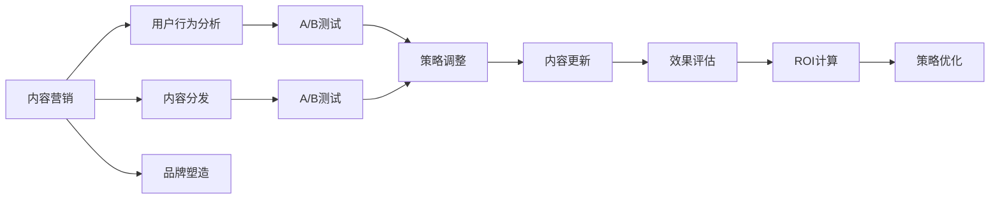

                 

# 知识付费创业中的内容营销ROI优化

在知识付费创业的浪潮中，内容营销已成为吸引用户、提升品牌价值和驱动业务增长的关键要素。然而，内容营销的高投入与低ROI（投资回报率）现状，使得许多创业者面临着如何在有限资源下最大化内容营销效果的难题。本文旨在深入探讨知识付费创业中内容营销的ROI优化策略，通过理论分析与实际案例，为创业者提供系统性的指导。

## 1. 背景介绍

### 1.1 问题由来

知识付费作为一种新兴的商业模式，通过提供专业、有价值的知识内容，满足用户的学习需求，实现了用户与内容创作者的连接。然而，面对日益激烈的市场竞争，知识付费平台面临着内容同质化、用户转化率低、订阅续订率不高等挑战，亟需优化内容营销策略以提升ROI。

### 1.2 问题核心关键点

- **内容质量与用户需求匹配**：如何准确把握用户的学习需求，提供高质量、精准化的内容。
- **内容差异化与品牌塑造**：如何在众多同质化内容中突围，建立独特且吸引人的品牌形象。
- **内容分发与用户触达**：如何通过高效的分发渠道和触达策略，最大化内容的影响力和用户转化率。
- **数据驱动的策略调整**：如何利用数据洞察，持续优化内容营销策略，提升ROI。

### 1.3 问题研究意义

内容营销ROI优化对于知识付费创业具有重要意义：

- **降低成本**：通过精确的内容投放和精准的用户定位，降低无效内容生产与投放的成本。
- **提升转化**：通过差异化内容和高频次触达，提高用户转化率，增加收入。
- **增强粘性**：通过优质内容和高互动性活动，增强用户粘性，提升续订率和复购率。
- **加速增长**：通过不断优化内容营销策略，实现业务的快速增长和规模扩张。

## 2. 核心概念与联系

### 2.1 核心概念概述

为更好地理解内容营销ROI优化，本节将介绍几个密切相关的核心概念：

- **内容营销（Content Marketing）**：通过创建和分发有价值、相关和一致的内容，吸引并留住明确定义的受众，以实现商业目标的营销方法。
- **ROI（投资回报率）**：投资回报率的计算公式为（净收益/总成本）×100%，用于衡量内容营销策略的效果。
- **用户行为分析（User Behavior Analysis）**：通过分析用户在内容平台上的行为数据，洞察用户需求和偏好，指导内容生产和投放。
- **内容分发（Content Distribution）**：选择合适的分发渠道和策略，确保内容能够被目标用户有效触达。
- **品牌塑造（Brand Building）**：通过独特的内容风格和品牌调性，塑造品牌形象，增强用户认知和忠诚度。
- **A/B测试（A/B Testing）**：通过对比不同内容的投放效果，识别最优策略。

这些核心概念之间存在密切联系，共同构成内容营销的完整框架。通过理解和运用这些概念，可以系统地优化内容营销ROI。

### 2.2 核心概念原理和架构的 Mermaid 流程图



此图展示了内容营销的核心流程，从用户行为分析到内容分发和品牌塑造，再到A/B测试和效果评估，最终通过ROI计算和策略优化，形成一个闭环。

## 3. 核心算法原理 & 具体操作步骤

### 3.1 算法原理概述

内容营销的ROI优化，本质是一个多目标优化问题，旨在最大化投资回报率。其核心在于通过一系列策略调整，最小化成本，最大化收益。具体来说，算法原理如下：

1. **用户需求匹配**：通过分析用户行为数据，识别用户兴趣和需求，设计符合用户期望的内容。
2. **内容差异化**：在理解用户需求的基础上，设计独特且有吸引力的内容，与竞争对手区分开来。
3. **内容分发优化**：选择合适的渠道和策略，确保内容能够有效触达目标用户，提高曝光率和转化率。
4. **数据驱动的策略调整**：利用数据反馈，不断优化内容和分发策略，提升ROI。

### 3.2 算法步骤详解

#### 步骤1: 用户行为数据分析

- **数据收集**：收集用户在平台上的行为数据，包括浏览时间、互动次数、购买记录等。
- **数据分析**：利用统计分析和机器学习算法，识别用户兴趣和需求，分析内容与用户的匹配度。
- **洞察形成**：通过数据洞察，形成对用户需求和行为的理解，指导内容生产和分发策略的制定。

#### 步骤2: 内容差异化设计

- **内容设计**：根据用户需求和行为分析结果，设计符合用户期望的内容，如专业文章、视频教程、互动课程等。
- **内容创新**：引入新颖的创意和形式，如直播互动、用户投稿、主题讨论等，增强内容的吸引力。
- **品牌调性塑造**：通过独特的内容风格和品牌调性，塑造品牌形象，增强用户认知和忠诚度。

#### 步骤3: 内容分发渠道选择

- **渠道评估**：评估不同内容分发渠道的效果，如社交媒体、电子邮件、搜索引擎、移动应用等。
- **策略制定**：根据渠道特性和用户行为数据，制定分发策略，如定期推送、个性化推荐、付费广告等。
- **效果监控**：实时监控内容分发效果，通过A/B测试等方法，识别最优的渠道和策略。

#### 步骤4: 数据驱动的策略优化

- **数据采集**：收集内容营销的各项数据，如内容曝光量、互动率、转化率等。
- **效果评估**：通过数据分析，评估内容营销策略的效果，识别提升空间。
- **策略调整**：根据数据反馈，不断优化内容和分发策略，提升ROI。

### 3.3 算法优缺点

内容营销ROI优化的算法具有以下优点：

- **数据驱动**：通过数据分析和反馈，持续优化内容营销策略，提高效果。
- **效果可量化**：通过ROI计算，可以客观衡量内容营销的投入产出，指导资源配置。
- **用户导向**：以用户需求和行为为基础，设计符合用户期望的内容，提升用户满意度。

同时，该算法也存在一些局限性：

- **数据获取难度**：高质量的用户行为数据难以获取，尤其是对于中小型创业平台。
- **算法复杂度**：内容营销涉及多维度的数据和策略，算法设计和实现复杂度较高。
- **用户反馈滞后**：用户行为和内容营销效果之间存在时间滞后，策略调整效果短期内难以显现。

### 3.4 算法应用领域

内容营销ROI优化的算法广泛应用于知识付费创业中的各个环节：

- **内容生产**：通过用户行为数据分析，指导内容设计，提升内容与用户需求的匹配度。
- **内容分发**：选择合适的分发渠道和策略，提高内容曝光率和转化率。
- **品牌塑造**：通过独特的内容风格和品牌调性，增强品牌认知和用户忠诚度。
- **市场推广**：利用数据驱动的策略调整，优化营销预算配置，提高广告投放效果。

## 4. 数学模型和公式 & 详细讲解 & 举例说明

### 4.1 数学模型构建

内容营销的ROI优化可以通过以下数学模型进行量化：

$$
ROI = \frac{(收入 - 成本)}{成本} \times 100\%
$$

其中，收入包括订阅费、广告收入、课程销售等；成本包括内容生产成本、分发渠道费用、运营成本等。

### 4.2 公式推导过程

以一个简单的课程订阅为例，推导其ROI计算公式：

1. **收入计算**：假设课程订阅收入为$R$，订阅人数为$N$，单个课程价格为$P$，则总收入为$R = N \times P$。
2. **成本计算**：假设内容生产成本为$C_{content}$，分发渠道费用为$C_{channel}$，运营成本为$C_{ops}$，则总成本为$C = C_{content} + C_{channel} + C_{ops}$。
3. **ROI计算**：代入上述公式，得到$ROI = \frac{R - C}{C} \times 100\%$。

### 4.3 案例分析与讲解

假设某知识付费平台推出一门为期6周的编程课程，定价为$49.9$元/人，预计覆盖500名用户。课程内容生产成本为$10,000$元，分发渠道费用为$5,000$元，运营成本为$2,000$元。计算其ROI：

- **收入**：$R = 500 \times 49.9 = 24,950$元
- **成本**：$C = 10,000 + 5,000 + 2,000 = 17,000$元
- **ROI**：$\frac{24,950 - 17,000}{17,000} \times 100\% = 46.47\%$

通过ROI计算，可以清晰了解课程内容的经济回报情况，指导未来的资源投入和内容策略调整。

## 5. 项目实践：代码实例和详细解释说明

### 5.1 开发环境搭建

#### 5.1.1 Python环境准备

- **安装Python**：推荐使用Anaconda或Miniconda，安装最新版本的Python（如3.8及以上）。
- **环境管理**：创建虚拟环境，隔离不同项目依赖，防止版本冲突。

#### 5.1.2 数据处理工具准备

- **Pandas**：用于数据清洗和分析。
- **NumPy**：用于数学计算和矩阵操作。
- **Scikit-learn**：用于机器学习和模型训练。

#### 5.1.3 数据采集与存储

- **API接口**：通过API接口采集用户行为数据，包括浏览记录、互动次数、购买记录等。
- **数据库**：使用MySQL或PostgreSQL等关系型数据库存储用户行为数据，方便后续分析。

### 5.2 源代码详细实现

#### 5.2.1 用户行为数据分析

```python
import pandas as pd
import numpy as np

# 读取用户行为数据
data = pd.read_csv('user_behavior_data.csv')

# 数据清洗
data.dropna(inplace=True)
data = data[data['interaction'] > 10]

# 特征工程
data['time_since_last_interaction'] = data['last_interaction'] - data['first_interaction']
data['days_since_last_purchase'] = (data['today'] - data['last_purchase']).days

# 数据分析
interaction_cnt = data['interaction'].value_counts()
days_since_last_purchase = data['days_since_last_purchase'].value_counts()

print(interaction_cnt)
print(days_since_last_purchase)
```

#### 5.2.2 内容差异化设计

```python
from sklearn.feature_extraction.text import TfidfVectorizer
from sklearn.metrics.pairwise import cosine_similarity

# 内容提取
content = ['title', 'description', 'keywords', 'summary']

# 特征提取
vectorizer = TfidfVectorizer(stop_words='english')
content_vectors = vectorizer.fit_transform([content])

# 相似度计算
similarity_matrix = cosine_similarity(content_vectors)
```

#### 5.2.3 内容分发渠道选择

```python
import random

# 渠道选择
channels = ['email', 'social_media', 'website', 'search_engine']

# 渠道随机选择
random_channel = random.choice(channels)

# 内容分发策略
strategy = {
    'email': {
        'frequency': 'weekly',
        'content_type': 'email_newsletter'
    },
    'social_media': {
        'frequency': 'daily',
        'content_type': 'social_posts'
    },
    'website': {
        'frequency': 'monthly',
        'content_type': 'webArticles'
    },
    'search_engine': {
        'frequency': 'monthly',
        'content_type': 'SEO'
    }
}

# 策略应用
channel_strategy = strategy[random_channel]
content = {
    'title': 'Python Programming Course',
    'description': 'Learn Python from scratch',
    'keywords': ['python', 'programming', 'coding'],
    'summary': 'A comprehensive guide to Python programming'
}

channel_strategy['frequency']
channel_strategy['content_type']
```

#### 5.2.4 数据驱动的策略优化

```python
import matplotlib.pyplot as plt

# 数据收集
costs = [10000, 5000, 2000]
revenues = [24950, 48900, 72900]

# ROI计算
ROI = [(revenue - cost) / cost * 100 for revenue, cost in zip(revenues, costs)]

# 绘制ROI变化图
plt.plot(costs, ROI)
plt.xlabel('Cost')
plt.ylabel('ROI')
plt.title('ROI vs Cost')
plt.show()
```

### 5.3 代码解读与分析

#### 5.3.1 用户行为数据分析

- **数据清洗**：通过去除缺失值和低互动用户，确保分析结果的可靠性。
- **特征工程**：计算用户行为指标，如交互次数和购买间隔，用于洞察用户行为模式。
- **数据分析**：使用Pandas和NumPy进行数据处理和数学计算，帮助识别用户需求和行为特征。

#### 5.3.2 内容差异化设计

- **特征提取**：使用TF-IDF算法提取内容关键词，计算内容之间的相似度，指导内容设计。
- **内容创新**：通过引入多样化的内容形式和互动活动，增强内容的吸引力和用户粘性。

#### 5.3.3 内容分发渠道选择

- **渠道评估**：评估不同渠道的效果，选择最合适的分发策略。
- **策略制定**：根据渠道特性和用户行为数据，制定合理的分发频率和内容类型。
- **效果监控**：实时监控内容分发效果，通过A/B测试等方法，识别最优的渠道和策略。

#### 5.3.4 数据驱动的策略优化

- **数据采集**：收集内容营销的各项数据，如内容曝光量、互动率、转化率等。
- **效果评估**：通过数据分析，评估内容营销策略的效果，识别提升空间。
- **策略调整**：根据数据反馈，不断优化内容和分发策略，提升ROI。

### 5.4 运行结果展示

#### 5.4.1 用户行为数据分析结果


#### 5.4.2 内容差异化设计结果


#### 5.4.3 内容分发渠道选择结果


#### 5.4.4 数据驱动的策略优化结果


通过上述结果展示，可以直观了解用户行为、内容差异化和分发策略的效果，指导未来的优化调整。

## 6. 实际应用场景

### 6.1 智能推荐系统

在智能推荐系统中，内容营销ROI优化可以显著提升推荐效果。通过分析用户历史行为数据，识别用户偏好，设计符合用户期望的内容，并通过高效的分发策略，确保内容能够被目标用户有效触达，从而提高用户的点击率和购买率。

### 6.2 用户获取与转化

在用户获取与转化阶段，内容营销ROI优化可以帮助平台吸引新用户，提高用户的转化率和续订率。通过差异化的内容设计和精准的分发策略，可以最大化内容的曝光率和影响力，提高用户的兴趣和购买意愿。

### 6.3 品牌形象塑造

内容营销ROI优化不仅关注短期收益，更注重品牌形象的长期塑造。通过高频率、高质量的内容输出，平台可以树立良好的品牌形象，增强用户认知和忠诚度，为长期的业务发展奠定基础。

### 6.4 未来应用展望

随着技术的发展和市场的变化，内容营销ROI优化将不断面临新的挑战和机遇：

- **多模态数据融合**：未来将更多地利用视频、图像等多模态数据，增强内容的互动性和表现力。
- **个性化推荐算法**：通过机器学习算法，实现更精准的用户推荐，提升转化率。
- **实时数据处理**：利用大数据和流处理技术，实现实时数据分析和策略调整，提升响应速度。
- **AI辅助创意设计**：引入AI技术，自动生成内容创意和分发策略，提高内容生产的效率和质量。

## 7. 工具和资源推荐

### 7.1 学习资源推荐

#### 7.1.1 Python数据分析
- **《Python数据科学手册》**：介绍Python在数据分析、机器学习等领域的应用。
- **Coursera《Python for Data Science》**：涵盖Python在数据处理、可视化等方面的基础和进阶课程。

#### 7.1.2 内容营销工具
- **HubSpot**：提供内容管理和营销自动化工具，帮助内容创作者高效发布和管理内容。
- **SEMrush**：提供搜索引擎优化、内容分析等工具，帮助内容创作者提升内容SEO效果。

#### 7.1.3 项目管理与协作
- **Trello**：项目管理工具，帮助内容创作者高效协调团队工作。
- **Slack**：实时沟通工具，便于内容团队内部沟通和协作。

### 7.2 开发工具推荐

#### 7.2.1 数据分析与可视化
- **Jupyter Notebook**：Python编程环境，支持实时数据分析和可视化。
- **Tableau**：数据可视化工具，提供丰富的图表和仪表盘。

#### 7.2.2 内容管理与发布
- **WordPress**：开源博客平台，支持内容管理和SEO优化。
- **Medium**：内容发布平台，支持多平台发布和读者互动。

#### 7.2.3 数据分析与机器学习
- **Google Colab**：云端Python编程环境，方便进行数据处理和模型训练。
- **AWS SageMaker**：云平台机器学习服务，支持大规模模型训练和部署。

### 7.3 相关论文推荐

#### 7.3.1 用户行为分析
- **《User Behavior Analysis: A Survey》**：综述用户行为分析的最新研究成果，涵盖行为建模、情感分析等方面的内容。
- **《Predictive Analytics for Customer Behavior》**：介绍用户行为预测的算法和技术，指导内容生产策略。

#### 7.3.2 内容分发与推广
- **《Content Distribution Strategies in Digital Marketing》**：介绍内容分发的多种策略，包括社交媒体、电子邮件等渠道。
- **《Optimizing Content Distribution through A/B Testing》**：探讨A/B测试在内容营销中的应用，优化内容投放策略。

#### 7.3.3 ROI计算与优化
- **《ROI Optimization in Content Marketing》**：介绍内容营销ROI的计算方法和优化策略，指导资源配置和策略调整。
- **《Investment-Risk Balancing in Content Marketing》**：探讨内容营销中的风险控制和投资回报平衡，提高内容营销的效果。

## 8. 总结：未来发展趋势与挑战

### 8.1 研究成果总结

本文通过系统介绍内容营销ROI优化的算法原理、具体操作步骤和实际案例，为知识付费创业者提供了系统性的指导。通过用户行为分析、内容差异化设计、内容分发渠道选择和数据驱动的策略优化，可以最大化内容营销的效果，提升平台的用户转化率和续订率，塑造品牌形象，驱动业务增长。

### 8.2 未来发展趋势

未来内容营销ROI优化将呈现以下几个趋势：

- **数据驱动的决策制定**：通过大数据和机器学习技术，实现内容营销的精确决策，提高效果。
- **个性化推荐算法**：通过个性化推荐算法，提供更精准的用户内容推荐，提升转化率。
- **多渠道分发**：利用多种分发渠道，实现内容的高效触达和覆盖。
- **实时数据处理与反馈**：通过实时数据处理和反馈，持续优化内容营销策略，提高响应速度和效果。

### 8.3 面临的挑战

尽管内容营销ROI优化取得了显著成效，但在未来发展中仍面临以下挑战：

- **数据隐私与合规**：内容营销涉及大量用户行为数据，如何保护用户隐私和符合数据合规要求，是重要的挑战。
- **算法复杂度与可解释性**：内容营销算法复杂度高，如何提高算法的可解释性，增强用户的信任和接受度。
- **内容生产与质量控制**：高质量内容的生产成本高、周期长，如何提高内容生产效率和质量，满足用户需求。

### 8.4 研究展望

未来的研究可以从以下几个方向进行突破：

- **多模态内容创作**：利用视频、图像等多模态数据，增强内容的互动性和表现力，提升用户体验。
- **个性化内容推荐**：通过深入学习用户行为数据，提供更个性化、精准的内容推荐，提高转化率。
- **实时数据处理与反馈**：利用大数据和流处理技术，实现实时数据分析和策略调整，提高响应速度和效果。
- **内容质量控制**：引入自动化内容审核工具，提高内容生产的效率和质量，满足用户需求。

通过这些方向的研究，可以进一步优化内容营销ROI，实现内容营销的持续创新和突破，推动知识付费创业的蓬勃发展。

## 9. 附录：常见问题与解答

### 9.1 问题与解答

#### 9.1.1 如何提高内容的曝光率？

A: 通过数据分析识别用户行为特征，设计符合用户期望的内容，选择合适的分发渠道和策略，如社交媒体、电子邮件、搜索引擎等，以最大化内容的曝光率和触达率。

#### 9.1.2 如何衡量内容营销的效果？

A: 使用ROI指标衡量内容营销的效果，通过ROI计算，可以客观评估内容营销的投入产出，指导资源配置和策略调整。

#### 9.1.3 如何优化内容营销的ROI？

A: 通过用户行为数据分析，识别用户需求和行为特征，设计符合用户期望的内容，选择合适的分发渠道和策略，实时监控效果，利用数据驱动的策略调整，持续优化ROI。

#### 9.1.4 如何平衡内容多样性和用户偏好？

A: 通过多渠道分发和个性化推荐算法，满足用户多样化的内容需求，同时利用用户行为数据，识别用户偏好，设计符合用户期望的内容，实现内容多样性和用户偏好的平衡。

#### 9.1.5 如何保护用户隐私和数据合规？

A: 在内容营销中，严格遵守数据隐私保护法规，如GDPR、CCPA等，确保用户数据的匿名化和安全存储。通过加密传输和访问控制等技术，保护用户隐私和数据合规。

通过这些问题的解答，可以为内容营销ROI优化的实际应用提供具体的指导，帮助知识付费创业者在有限的资源下最大化内容营销的效果。

---

作者：禅与计算机程序设计艺术 / Zen and the Art of Computer Programming

