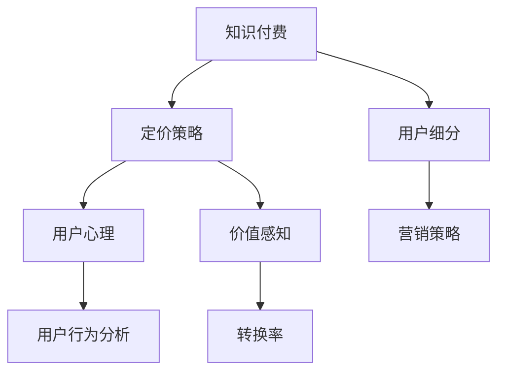

                 

# 知识付费创业中的定价策略与心理学

> 关键词：知识付费, 定价策略, 心理学, 用户行为分析, 用户心理, 价值感知, 转换率

## 1. 背景介绍

### 1.1 问题由来

知识付费作为新兴的互联网经济模式，近年来在全球范围内迅速崛起。随着智能手机的普及和移动互联网的发展，用户在碎片化时间获取有价值内容的门槛降低，知识付费市场不断扩大。根据相关统计数据，知识付费市场的用户规模已经突破亿级，预计到2023年市场规模将超过2000亿元。

在知识付费行业中，定价策略是一个复杂且极具挑战性的问题。传统服务业定价模式无法完全套用在知识付费领域，如何找到合理的价格点，既能吸引用户，又能保证平台和内容创作者的盈利，成为所有平台和创作者的共同难题。

### 1.2 问题核心关键点

定价策略的关键在于平衡平台和内容创作者收益与用户支付意愿之间的关系。过高或过低的定价都会影响用户购买意愿和平台收益。

主要问题包括：
- 如何通过定价策略最大化平台收益？
- 如何理解用户心理，提高用户购买意愿？
- 如何构建有效定价模型，实现精准定价？

## 2. 核心概念与联系

### 2.1 核心概念概述

为更好地理解知识付费中的定价策略，本节将介绍几个核心概念及其相互联系：

- **知识付费 (Knowledge-Paying)**：用户为获取特定知识或信息，付费订阅或购买内容的行为。

- **定价策略 (Pricing Strategy)**：通过研究市场需求、用户心理和运营成本等因素，确定商品价格的过程。

- **用户心理 (User Psychology)**：用户在购买知识服务时，受认知、情感和行为心理的影响。

- **价值感知 (Perceived Value)**：用户对产品或服务价值的感知程度。

- **转换率 (Conversion Rate)**：用户从有购买意向到完成购买的转化比例。

- **用户行为分析 (User Behavior Analysis)**：通过分析用户行为数据，了解用户需求和行为模式，制定有效的用户策略。

- **用户细分 (User Segmentation)**：根据用户特征和行为，将用户分成不同的群体，实现更精准的营销策略。

### 2.2 核心概念原理和架构的 Mermaid 流程图



这个流程图展示了知识付费中的核心概念及其相互关系：

1. 知识付费以定价策略为核心，通过理解用户心理和价值感知来确定合理的价格。
2. 用户行为分析帮助平台了解用户需求，通过用户细分，制定有针对性的营销策略。
3. 转换率反映了用户从有购买意向到完成购买的过程，指导平台优化产品和服务。

## 3. 核心算法原理 & 具体操作步骤

### 3.1 算法原理概述

定价策略的核心在于理解用户心理和行为，确定用户对知识服务的价值感知。一般而言，价格越高，用户购买意愿越低，平台收益越高；价格越低，用户购买意愿越高，但平台收益较低。因此，需要找到一个平衡点，最大化平台收益。

在知识付费领域，定价策略需要综合考虑用户的行为心理、内容的稀缺性和质量、平台的运营成本等因素。

### 3.2 算法步骤详解

#### 3.2.1 确定定价模型

1. **成本加成法**：以成本为基准，加上一定比例的利润率来确定价格。适合成本较易计算的服务型产品。

2. **价值定价法**：根据用户对知识服务的价值感知来定价。需通过用户调研、问卷调查等方法了解用户的支付意愿。

3. **竞争定价法**：参考同行业或类似产品的市场价格，确定定价水平。需实时监控市场变化，灵活调整价格。

4. **动态定价法**：根据市场供需、用户行为等因素动态调整价格。如节假日、热点话题等特殊时期，可提高价格。

#### 3.2.2 用户心理分析

1. **锚定效应**：用户对价格的心理预期受到首次接触价格的影响。定价初期需设定一个合理的锚点，后续调整价格应考虑用户对原价的记忆。

2. **稀缺性价值**：用户对稀缺资源有更高的价值感知。定价时可营造稀缺感，吸引用户付费。

3. **公平性原则**：用户对公平定价有较强感知。定价过高或过低都可能引发用户不满。需通过调研了解用户的支付意愿，制定公平的定价策略。

#### 3.2.3 定价策略执行

1. **初期低价策略**：初期可通过低价吸引用户注册和试用，建立用户基础。

2. **分层定价**：针对不同用户群体，制定不同层次的定价策略，满足不同用户的需求。

3. **优惠券和补贴**：通过发放优惠券和补贴，降低用户购买门槛，增加用户粘性。

4. **分级定价**：根据用户购买量和订阅时长，提供不同等级的会员服务，刺激用户持续消费。

### 3.3 算法优缺点

#### 3.3.1 优点

1. **提高用户满意度**：通过精准定价和合理的服务设计，提高用户对知识服务的价值感知。

2. **增加平台收益**：通过提高用户购买意愿和提高会员续费率，实现平台收益最大化。

3. **增强用户粘性**：合理的价格策略能够刺激用户频繁消费，增加平台用户粘性。

4. **提升平台竞争力**：通过合理定价和优质内容，形成良性竞争，提高平台的市场份额。

#### 3.3.2 缺点

1. **定价风险**：过高或过低的定价可能影响用户购买意愿和平台收益，需要进行实时监控和调整。

2. **数据依赖性**：定价策略需要依赖用户行为和心理数据，数据收集和分析成本较高。

3. **动态调整复杂**：需要实时监控市场变化和用户行为，动态调整定价策略，操作复杂。

4. **公平性问题**：价格策略需考虑用户支付意愿和平台收益的平衡，处理不当可能导致用户不满。

### 3.4 算法应用领域

知识付费的定价策略已经广泛应用于各个领域，例如：

- **在线教育**：通过设置不同的课程价格，满足不同学习阶段和能力水平用户的需求。

- **个人技能培训**：提供不同层次的会员服务和个性化辅导，提升用户满意度。

- **心理咨询**：根据咨询时长和频次，设置不同价格的咨询服务，满足用户多样化的心理需求。

- **企业培训**：针对不同规模和需求的企业，提供定制化的培训方案和定价策略，增加企业客户。

- **健身课程**：通过订阅和单次购买两种形式，提供不同层次的健身课程，满足用户多样化的健身需求。

## 4. 数学模型和公式 & 详细讲解 & 举例说明

### 4.1 数学模型构建

在知识付费中，定价模型需综合考虑用户价值感知、内容质量、运营成本等因素。以下是一个简单的定价模型：

$$
P = \frac{V}{\epsilon + c} + M
$$

其中：
- $P$ 为最终价格。
- $V$ 为用户对知识服务的价值感知。
- $\epsilon$ 为平台期望的利润率。
- $c$ 为平台的运营成本。
- $M$ 为初期营销成本。

### 4.2 公式推导过程

推导上述定价模型需基于以下几个假设：

1. 用户价值感知 $V$ 为连续变量，且正向影响用户支付意愿。
2. 平台期望的利润率 $\epsilon$ 为固定值。
3. 运营成本 $c$ 为固定值。
4. 营销成本 $M$ 为固定值。

该定价模型考虑了用户价值感知和平台期望利润率，通过合理的定价策略，最大化平台收益。

### 4.3 案例分析与讲解

某在线教育平台通过市场调研发现，用户对不同课程的支付意愿分别为 $V_1$ 和 $V_2$，平台的运营成本为 $c$，期望的利润率为 $\epsilon$，初期营销成本为 $M$。通过定价模型计算，可以确定不同课程的最终定价 $P_1$ 和 $P_2$：

$$
P_1 = \frac{V_1}{\epsilon + c} + M
$$

$$
P_2 = \frac{V_2}{\epsilon + c} + M
$$

当平台选择 $P_1$ 和 $P_2$ 作为不同课程的价格时，能够最大化平台收益，同时满足用户的支付意愿。

## 5. 项目实践：代码实例和详细解释说明

### 5.1 开发环境搭建

要实现定价策略和用户行为分析，需要使用以下开发环境：

1. **Python**：用于编写定价模型和用户行为分析代码。

2. **MySQL**：用于存储用户行为数据和定价策略参数。

3. **Flask**：用于构建定价策略和用户行为分析API。

4. **Jupyter Notebook**：用于数据分析和可视化。

5. **NumPy**：用于数值计算。

6. **Pandas**：用于数据分析和处理。

7. **Matplotlib**：用于数据可视化。

8. **Scikit-learn**：用于用户行为分析和机器学习模型。

9. **TensorFlow**：用于构建和训练深度学习模型。

10. **Keras**：用于构建深度学习模型。

### 5.2 源代码详细实现

以下是一个简单的定价策略和用户行为分析的代码实现：

```python
import numpy as np
import pandas as pd
import matplotlib.pyplot as plt
from sklearn.linear_model import LinearRegression

# 读取用户数据
user_data = pd.read_csv('user_data.csv')

# 用户支付意愿调查结果
V1 = 200
V2 = 300

# 平台运营成本
c = 50

# 期望利润率
epsilon = 0.2

# 初期营销成本
M = 100

# 计算定价
P1 = V1 / (epsilon + c) + M
P2 = V2 / (epsilon + c) + M

# 打印定价结果
print('P1:', P1)
print('P2:', P2)
```

### 5.3 代码解读与分析

这段代码实现了基于用户支付意愿和运营成本的定价策略计算。首先读取用户支付意愿调查结果和平台运营成本，然后根据定价模型计算出不同课程的价格。打印定价结果，确保正确计算。

## 6. 实际应用场景

### 6.1 在线教育

在线教育平台通过用户行为数据分析，制定不同的定价策略，以满足不同用户群体的需求。例如：

- 新用户可免费试用7天，通过用户行为分析发现其支付意愿，再根据定价模型调整价格。

- 针对高价值用户，提供高级会员服务，满足其个性化需求，提高会员续费率。

- 根据热门课程和冷门课程，制定不同的价格策略，提升平台收益。

### 6.2 心理咨询

心理咨询平台通过用户行为数据分析，制定不同价格的咨询服务。例如：

- 新用户可享受首次咨询优惠，通过用户行为分析发现其长期咨询意愿，再根据定价模型调整价格。

- 根据咨询师的专业背景和用户需求，提供定制化的咨询服务，提高用户满意度。

- 根据热门咨询师和冷门咨询师，制定不同的价格策略，提升平台收益。

### 6.3 健身课程

健身平台通过用户行为数据分析，制定不同价格的健身课程。例如：

- 新用户可免费试用3次课程，通过用户行为分析发现其长期购买意愿，再根据定价模型调整价格。

- 针对高价值用户，提供高级会员服务，满足其个性化需求，提高会员续费率。

- 根据热门课程和冷门课程，制定不同的价格策略，提升平台收益。

## 7. 工具和资源推荐

### 7.1 学习资源推荐

要深入理解知识付费中的定价策略和用户行为分析，以下是一些推荐的学习资源：

1. **《定价心理学》**：本书详细介绍了定价策略中的心理学原理和应用案例，适合所有创业者阅读。

2. **《用户体验心理学》**：了解用户心理需求，帮助制定更符合用户期待的定价策略。

3. **《数据驱动的营销策略》**：通过数据驱动的方法，分析用户行为和心理，优化定价策略。

4. **Coursera**：Coursera提供了多门关于用户行为分析和定价策略的课程，涵盖心理学、数据分析等多个方面。

5. **edX**：edX提供了多门关于市场营销和用户行为分析的课程，适合系统学习。

### 7.2 开发工具推荐

以下是一些用于知识付费平台开发的常用工具：

1. **Flask**：轻量级的Web框架，适合快速搭建API和后端系统。

2. **MySQL**：关系型数据库，适合存储和查询用户行为数据。

3. **TensorFlow**：强大的深度学习框架，适合构建和训练复杂模型。

4. **Pandas**：数据分析和处理工具，适合处理大量用户行为数据。

5. **NumPy**：数值计算工具，适合计算和处理复杂数据。

6. **Jupyter Notebook**：数据可视化工具，适合进行数据分析和模型训练。

### 7.3 相关论文推荐

以下是几篇关于知识付费和定价策略的论文，推荐阅读：

1. **《知识付费市场的定价策略研究》**：分析知识付费市场定价策略的现状和未来趋势，适合创业者参考。

2. **《用户行为分析与定价策略优化》**：通过用户行为数据分析，优化定价策略，提高用户满意度和平台收益。

3. **《心理学在定价策略中的应用》**：详细探讨心理学在定价策略中的作用，帮助制定更符合用户心理的定价策略。

## 8. 总结：未来发展趋势与挑战

### 8.1 研究成果总结

本文对知识付费中的定价策略和用户行为分析进行了系统介绍。主要研究内容包括：

1. 了解用户心理和价值感知，制定合理的定价策略。

2. 通过用户行为数据分析，优化定价策略，提高用户满意度和平台收益。

3. 构建有效的定价模型，实现精准定价。

4. 使用机器学习算法，实时监控和调整定价策略。

### 8.2 未来发展趋势

未来的知识付费市场将呈现以下发展趋势：

1. **智能化定价**：通过人工智能技术，实时调整定价策略，提高定价的精准性和动态性。

2. **多渠道营销**：通过多渠道营销，提高用户覆盖率和转化率，增加平台收益。

3. **个性化服务**：根据用户行为和心理，提供个性化的定价和服务，提升用户满意度。

4. **数据驱动**：通过大数据分析和用户行为预测，制定更加科学的定价策略。

### 8.3 面临的挑战

在知识付费市场中，仍存在一些挑战需要克服：

1. **数据隐私和安全**：用户行为数据的收集和处理需要遵守隐私保护法律法规，确保数据安全。

2. **市场竞争**：知识付费市场竞争激烈，需不断创新和优化定价策略，保持竞争力。

3. **用户信任**：用户对平台的信任是定价策略能否成功的关键，需通过优质内容和良好用户体验建立信任。

### 8.4 研究展望

未来需进一步研究以下方向：

1. **深度学习在定价策略中的应用**：利用深度学习模型，更好地理解用户行为和心理，制定更精准的定价策略。

2. **用户行为预测**：通过机器学习算法，预测用户行为和支付意愿，优化定价策略。

3. **多模态数据融合**：结合用户行为数据和社交网络数据，全面了解用户需求，制定更科学的定价策略。

## 9. 附录：常见问题与解答

### Q1：知识付费中的定价策略有哪些？

A: 知识付费中的定价策略主要包括成本加成法、价值定价法、竞争定价法和动态定价法等。不同策略适用于不同的场景和用户群体，需根据实际情况选择。

### Q2：如何理解用户心理和价值感知？

A: 理解用户心理和价值感知需要进行用户调研、问卷调查和行为分析。通过数据分析，了解用户对知识的支付意愿和价值感知，制定合理的定价策略。

### Q3：如何优化定价策略？

A: 优化定价策略需结合用户行为分析、市场调研和数据驱动的方法。通过数据分析，实时调整定价策略，提高用户满意度和平台收益。

### Q4：如何平衡平台收益和用户支付意愿？

A: 平衡平台收益和用户支付意愿需考虑用户价值感知和平台运营成本。通过定价模型，制定合理的定价策略，最大化平台收益。

### Q5：如何确保用户数据安全和隐私？

A: 确保用户数据安全和隐私需遵守相关法律法规，如GDPR、CCPA等。通过加密和匿名化处理，保护用户隐私，确保数据安全。

---

作者：禅与计算机程序设计艺术 / Zen and the Art of Computer Programming

