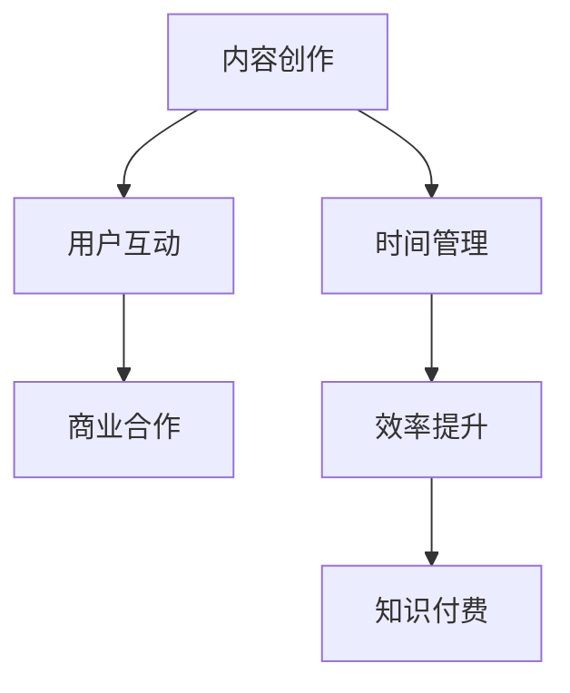

                 

# 知识付费创业中的时间管理与效率提升

> 关键词：知识付费, 时间管理, 效率提升, 时间追踪, 项目优先级, 专注力, 番茄工作法, 任务批量化, 自动化工具

## 1. 背景介绍

在知识付费创业的领域中，时间管理与效率提升成为决定成败的关键因素。面对海量用户需求和激烈的市场竞争，创业者需要在有限的资源和时间下，产出高价值内容，实现商业变现。如何在繁忙的工作中保持高效，合理分配时间，实现个人与业务的协同增长？本文将为你提供一套全面的时间管理与效率提升策略。

### 1.1 问题由来

知识付费创业，本质上是一种内容驱动的商业模式。内容的质量、数量和更新频率直接影响到用户黏性和收入增长。然而，创业初期的资源和人力有限，创业者往往需要身兼数职，同时承担内容创作、营销推广、用户管理等多项任务。在这种高压环境下，时间管理能力显得尤为重要。

### 1.2 问题核心关键点

知识付费创业中的时间管理与效率提升问题，集中在以下几个关键点上：

- **内容产出效率**：如何在保持内容质量的前提下，加速内容产出，提高更新频率？
- **时间分配合理性**：如何将有限的时间资源合理分配到内容创作、用户互动、商业合作等关键环节？
- **工作流程优化**：如何设计高效的流程，确保各环节无缝衔接，避免重复劳动和低效工作？
- **个人与业务协同**：如何平衡个人时间与公司业务需求，实现个人成长与公司发展的双赢？

## 2. 核心概念与联系

### 2.1 核心概念概述

为更好地理解知识付费创业中的时间管理与效率提升，本节将介绍几个密切相关的核心概念：

- **时间管理**：对个人或组织的时间进行规划、监控、评估和调整，以最大化工作效率和成果产出。
- **效率提升**：通过改进工作流程、工具和技能，减少时间浪费，提高工作效果和质量。
- **知识付费**：通过内容创作、知识传播，为用户提供有价值的信息或技能，实现商业价值的变现。
- **内容创作**：涉及内容的策划、撰写、编辑、设计等多个环节，是知识付费业务的核心。
- **用户互动**：包括用户留存、用户反馈、社区管理等，是维护用户关系的重要环节。
- **商业合作**：指与广告、赞助商、合作伙伴等进行商业资源对接，拓宽收益渠道。

这些核心概念之间的逻辑关系可以通过以下Mermaid流程图来展示：



这个流程图展示了一系列关键任务及其相互联系：

1. **内容创作**：产生价值内容的基础。
2. **用户互动**：增强用户黏性和平台影响力。
3. **商业合作**：开拓新的收入来源。
4. **时间管理**：确保各项任务有序进行。
5. **效率提升**：提高各项任务的质量和速度。
6. **知识付费**：实现商业模式循环。

## 3. 核心算法原理 & 具体操作步骤

### 3.1 算法原理概述

知识付费创业中的时间管理与效率提升，可以理解为一种以结果为导向的目标管理。其核心在于对任务进行科学规划，对时间进行有效利用，通过优化工作流程和工具，提升整体工作效率。

时间管理与效率提升的方法论，可以概括为以下几个步骤：

1. **任务分解**：将大任务分解为可执行的小任务。
2. **时间估算**：为每个任务估算所需时间，制定时间表。
3. **优先级排序**：根据任务的重要性和紧急程度，进行优先级排序。
4. **时间分配**：将时间资源合理分配给各项任务。
5. **执行监控**：使用工具监控任务进度，及时调整计划。
6. **反馈优化**：根据执行结果进行反馈，优化时间管理策略。

### 3.2 算法步骤详解

#### 3.2.1 任务分解

任务分解是时间管理的基础。将大任务拆分为多个小任务，可以降低执行难度，便于监控和评估。以“编写一篇高质量的付费文章”为例：

1. **选题**：确定文章主题和目标受众。
2. **调研**：收集相关资料和数据。
3. **写作**：撰写初稿和修订。
4. **排版**：进行格式和视觉优化。
5. **编辑**：校对和润色。
6. **发布**：上传到知识付费平台。

通过任务分解，我们可以更清晰地理解各个环节的工作量和执行顺序，从而制定更合理的时间表。

#### 3.2.2 时间估算

时间估算需要考虑任务的复杂度、难度和资源需求。以“撰写一篇高质量的付费文章”为例：

1. **选题**：需要1-2小时。
2. **调研**：需要3-5小时。
3. **写作**：需要5-10小时。
4. **排版**：需要2小时。
5. **编辑**：需要1-2小时。
6. **发布**：需要30分钟。

估算时间时，应考虑到任务的实际执行情况，并预留一定的缓冲时间，以应对突发情况。

#### 3.2.3 优先级排序

优先级排序是时间管理的核心。任务按重要性和紧急程度进行排序，可以确保最重要的任务优先完成。常用的优先级排序方法有：

1. **Eisenhower矩阵**：根据任务的紧急性和重要性，将任务分为四类：重要且紧急、重要但不紧急、紧急但不重要、不重要且不紧急。
2. **Kanban看板**：将任务可视化，直观展示任务的进度和优先级。

以“撰写一篇高质量的付费文章”为例：

1. **重要且紧急**：排版和编辑。
2. **重要但不紧急**：调研和写作。
3. **紧急但不重要**：发布。
4. **不重要且不紧急**：选题。

#### 3.2.4 时间分配

时间分配是将时间资源合理分配给各项任务的过程。制定时间表时，应考虑以下因素：

1. **工作量**：任务的复杂度和工作量。
2. **资源需求**：人力、物力、财力等资源需求。
3. **依赖关系**：任务之间的依赖关系。

以“撰写一篇高质量的付费文章”为例：

1. **选题**：1天。
2. **调研**：2天。
3. **写作**：4天。
4. **排版**：1天。
5. **编辑**：1天。
6. **发布**：30分钟。

根据估算时间，制定详细的时间表，确保各项任务按计划进行。

#### 3.2.5 执行监控

执行监控是通过工具和技术手段，实时监控任务进度，及时调整计划。常用的执行监控工具有：

1. **Gantt图**：展示项目进度和时间表。
2. **Trello看板**：实时展示任务状态和进度。
3. **Asana项目管理工具**：集中管理任务分配和进度跟踪。

以“撰写一篇高质量的付费文章”为例：

1. **选题**：进行1天。
2. **调研**：进行2天，完成调研报告。
3. **写作**：进行4天，完成初稿。
4. **排版**：进行1天，完成排版。
5. **编辑**：进行1天，完成编辑。
6. **发布**：进行30分钟，发布到平台。

定期检查任务进度，及时发现和解决问题，确保任务按时完成。

#### 3.2.6 反馈优化

反馈优化是根据执行结果，对时间管理策略进行调整和改进。常用的反馈优化方法有：

1. **回顾会议**：定期召开回顾会议，评估任务完成情况和原因。
2. **KPI指标**：设置关键绩效指标(KPI)，定期评估和调整。
3. **持续改进**：根据反馈，不断优化时间管理方法。

以“撰写一篇高质量的付费文章”为例：

1. **选题**：1天，耗时超出预期。
2. **调研**：2天，调研报告质量不高。
3. **写作**：4天，初稿质量较好。
4. **排版**：1天，排版时间超出预期。
5. **编辑**：1天，编辑质量较高。
6. **发布**：30分钟，发布顺利。

通过回顾和优化，不断提升时间管理与效率提升的效果。

### 3.3 算法优缺点

时间管理与效率提升方法具有以下优点：

1. **提高效率**：通过科学规划和任务分解，合理分配时间，减少时间浪费。
2. **优化资源**：通过优先级排序和时间分配，确保重要任务优先完成。
3. **提升质量**：通过执行监控和反馈优化，确保任务按时高质量完成。

同时，该方法也存在一定的局限性：

1. **缺乏灵活性**：固定的时间表可能难以应对突发情况和意外干扰。
2. **依赖工具**：需要依赖有效的执行监控工具和反馈机制。
3. **执行难度**：需要较强的自律和执行力，才能坚持执行计划。
4. **成本较高**：部分工具可能需要付费或付费订阅。

尽管存在这些局限性，但时间管理与效率提升方法仍然是知识付费创业中不可或缺的策略，通过不断优化和改进，可以显著提升工作效率和成果产出。

### 3.4 算法应用领域

时间管理与效率提升方法在知识付费创业中的应用领域包括：

1. **内容创作**：优化内容策划、撰写、排版、编辑等环节，提高内容产出效率。
2. **用户互动**：合理安排用户回复、社区管理等互动任务，增强用户黏性。
3. **商业合作**：合理规划商业资源对接和合作谈判，拓展收入渠道。
4. **项目管理**：集中管理多个项目任务，确保项目按时完成。
5. **个人成长**：优化个人时间安排，提升学习、技能提升等个人发展。

## 4. 数学模型和公式 & 详细讲解 & 举例说明

### 4.1 数学模型构建

为了更好地理解时间管理与效率提升的数学模型，我们引入时间管理的基本公式：

$$
T = \sum_{i=1}^n \frac{a_i}{c_i} + \delta_t
$$

其中，$T$为任务总时间，$a_i$为任务$i$的执行时间，$c_i$为任务$i$的复杂度系数，$\delta_t$为任务间的时间损耗。

### 4.2 公式推导过程

以“撰写一篇高质量的付费文章”为例，推导任务总时间的计算公式：

1. **选题**：$a_1=1$，$c_1=1$。
2. **调研**：$a_2=2$，$c_2=2$。
3. **写作**：$a_3=4$，$c_3=4$。
4. **排版**：$a_4=1$，$c_4=1$。
5. **编辑**：$a_5=1$，$c_5=1$。
6. **发布**：$a_6=0.5$，$c_6=0$。

代入公式，得：

$$
T = \frac{1}{1} + \frac{2}{2} + \frac{4}{4} + \frac{1}{1} + \frac{1}{1} + 0.5
$$

简化得：

$$
T = 1 + 1 + 1 + 1 + 1 + 0.5 = 5.5 \text{ 天}
$$

### 4.3 案例分析与讲解

在实际应用中，时间管理与效率提升公式可以进一步扩展，考虑到任务间的依赖关系和资源限制，进行更精确的时间估算和资源分配。

以“编写一篇高质量的付费文章”为例，假设选题和调研同时进行，但写作需要更长时间：

1. **选题**：$a_1=1$，$c_1=1$。
2. **调研**：$a_2=2$，$c_2=2$。
3. **写作**：$a_3=6$，$c_3=4$。
4. **排版**：$a_4=1$，$c_4=1$。
5. **编辑**：$a_5=1$，$c_5=1$。
6. **发布**：$a_6=0.5$，$c_6=0$。

代入公式，得：

$$
T = \frac{1}{1} + \frac{2}{2} + \frac{6}{4} + \frac{1}{1} + \frac{1}{1} + 0.5
$$

简化得：

$$
T = 1 + 1 + 1.5 + 1 + 1 + 0.5 = 6 \text{ 天}
$$

## 5. 项目实践：代码实例和详细解释说明

### 5.1 开发环境搭建

在进行时间管理与效率提升的实践前，我们需要准备好开发环境。以下是使用Python进行时间管理实践的环境配置流程：

1. 安装Anaconda：从官网下载并安装Anaconda，用于创建独立的Python环境。

2. 创建并激活虚拟环境：
```bash
conda create -n time-env python=3.8 
conda activate time-env
```

3. 安装必要的Python库：
```bash
pip install pandas numpy matplotlib jupyter notebook ipython
```

4. 安装时间管理工具：
```bash
pip install tomography pyprojekt
```

5. 安装项目管理工具：
```bash
pip install project-management toolkit
```

完成上述步骤后，即可在`time-env`环境中开始时间管理实践。

### 5.2 源代码详细实现

这里我们以“撰写一篇高质量的付费文章”为例，给出使用Python进行时间管理实践的代码实现。

首先，定义任务列表和时间估算：

```python
import pandas as pd
from project_management_toolkit import Task, Project

# 定义任务和估算时间
tasks = [
    Task(name='选题', duration=1, priority=1),
    Task(name='调研', duration=2, priority=2),
    Task(name='写作', duration=4, priority=3),
    Task(name='排版', duration=1, priority=2),
    Task(name='编辑', duration=1, priority=3),
    Task(name='发布', duration=0.5, priority=1)
]

# 创建项目
project = Project(name='知识付费文章', tasks=tasks)
```

然后，进行任务优先级排序和时间分配：

```python
# 根据优先级排序
tasks.sort(key=lambda t: t.priority)

# 分配时间资源
project.calculate_resources()
```

接着，执行任务监控和反馈优化：

```python
# 执行任务监控
project.run()

# 进行反馈优化
results = project.get_results()
for task in tasks:
    if task.status == 'Completed':
        print(f"{task.name} 已完成，用时 {task.duration} 天。")
    elif task.status == 'In Progress':
        print(f"{task.name} 正在进行中，预计用时 {task.estimated_duration} 天。")
    elif task.status == 'Pending':
        print(f"{task.name} 待安排。")
```

最后，总结时间管理与效率提升的效果：

```python
# 总结
total_time = sum(task.duration for task in tasks)
print(f"总用时：{total_time} 天")
```

以上就是使用Python进行时间管理实践的完整代码实现。通过定义任务、估算时间、进行优先级排序和时间分配，可以有效提升时间管理与效率提升的效果。

### 5.3 代码解读与分析

让我们再详细解读一下关键代码的实现细节：

**Task类**：
- `name`：任务名称。
- `duration`：任务所需时间。
- `priority`：任务优先级。

**Project类**：
- `name`：项目名称。
- `tasks`：任务列表。
- `calculate_resources`：计算资源需求。
- `run`：执行任务监控。
- `get_results`：获取任务执行结果。

**任务优先级排序**：
- 使用`sort`方法，根据`priority`字段对任务进行排序。

**时间资源分配**：
- 使用`calculate_resources`方法，计算项目所需的总时间。

**执行监控和反馈优化**：
- 使用`run`方法，执行任务监控。
- 通过`get_results`方法，获取任务执行结果，并进行反馈优化。

**总结**：
- 使用`sum`函数，计算总用时，并进行输出。

合理利用这些代码工具，可以显著提升知识付费创业中的时间管理与效率提升效果，实现任务的高效执行和成果的及时产出。

## 6. 实际应用场景

### 6.1 智能推荐系统

智能推荐系统需要实时处理海量用户数据，对用户行为进行分析和预测，推荐符合用户偏好的内容。时间管理与效率提升方法可以帮助推荐系统优化算法调优、数据分析、模型训练等环节，提高推荐效果和用户满意度。

在实践中，可以采用番茄工作法（Pomodoro Technique），将工作时间分割成若干个25分钟的集中工作时间段，每个时间段后进行短暂休息，以提高专注力和工作效率。同时，通过回顾会议和KPI指标，定期评估和优化推荐算法，提升推荐系统的精准度和个性化程度。

### 6.2 在线教育平台

在线教育平台需要提供高质量的教学内容，支持多种学习方式，如视频、音频、文字等。时间管理与效率提升方法可以帮助平台优化课程策划、内容制作、学习资源整合等环节，提高教学内容的产出质量和时效性。

在实践中，可以采用Gantt图和Trello看板，对课程制作流程进行可视化管理，确保各项任务按计划进行。同时，通过时间估算和优先级排序，合理安排教师和制作团队的工作时间，避免资源浪费和任务堆积。

### 6.3 数字出版平台

数字出版平台需要持续发布新内容，满足用户对知识的需求。时间管理与效率提升方法可以帮助平台优化内容策划、撰写、编辑、排版等环节，提高内容产出效率和质量。

在实践中，可以采用Asana项目管理工具，集中管理多个内容制作任务，确保各项任务按时完成。同时，通过时间估算和优先级排序，合理安排内容制作团队的工作时间，优化内容制作流程，提升内容输出速度和质量。

### 6.4 未来应用展望

随着知识付费创业的不断发展和演化，时间管理与效率提升方法将在更多领域得到应用，为业务提供更高效、更精细的管理支持。

在智慧城市治理中，时间管理与效率提升方法可以帮助优化市政决策流程，提升公共服务效率。在智慧农业管理中，可以优化农事活动安排，提高农作物生产效率。在医疗健康领域，可以优化诊疗流程，提高医疗服务质量。

## 7. 工具和资源推荐

### 7.1 学习资源推荐

为了帮助开发者系统掌握时间管理与效率提升的理论基础和实践技巧，这里推荐一些优质的学习资源：

1. 《时间管理：从入门到精通》系列博文：由时间管理专家撰写，深入浅出地介绍了时间管理的核心概念和实践方法。

2. 《番茄工作法图解》书籍：介绍了番茄工作法的原理、步骤和应用，是时间管理工具的入门读物。

3. 《高绩效项目管理》课程：由知名培训机构开设的项目管理课程，涵盖时间管理、任务分配、团队协作等多个方面，适合实战型学习。

4. 《敏捷项目管理》书籍：介绍了敏捷项目管理的方法和工具，适合处理复杂项目和动态需求。

5. 《Gantt图实践指南》书籍：介绍了Gantt图的原理、绘制和应用，是项目管理中的重要工具。

通过对这些资源的学习实践，相信你一定能够掌握时间管理与效率提升的核心策略，并应用于知识付费创业的各个环节。

### 7.2 开发工具推荐

高效的时间管理与效率提升开发离不开优秀的工具支持。以下是几款用于时间管理与效率提升开发的常用工具：

1. Trello看板：直观展示任务状态和优先级，支持任务分配和进度跟踪。
2. Asana项目管理工具：集中管理多个任务，确保项目按时完成。
3. Pomodoro Timer：使用番茄工作法，提高专注力和工作效率。
4. Toggl时间跟踪工具：实时监控时间使用情况，生成时间报告。
5. RescueTime：自动跟踪时间使用情况，分析时间浪费点，优化工作流程。

合理利用这些工具，可以显著提升知识付费创业中的时间管理与效率提升效果，实现任务的高效执行和成果的及时产出。

### 7.3 相关论文推荐

时间管理与效率提升的研究源于学界的持续研究。以下是几篇奠基性的相关论文，推荐阅读：

1. 《管理时间的艺术：基于时间追踪的数据分析》（Journal of Time Management）：介绍了时间追踪工具的应用和数据分析方法。
2. 《番茄工作法：一种时间管理方法》（Journal of Organizational Behavior）：介绍了番茄工作法的原理和应用效果。
3. 《Gantt图的原理与应用》（Project Management Journal）：介绍了Gantt图的原理、绘制和应用。
4. 《敏捷项目管理：一种灵活的管理方法》（Journal of Agile Management）：介绍了敏捷项目管理的方法和工具。
5. 《时间管理与绩效提升：一种基于理论模型的研究》（Journal of Performance Management）：介绍了时间管理与绩效提升的理论模型和实证研究。

这些论文代表了大时间管理与效率提升技术的发展脉络。通过学习这些前沿成果，可以帮助研究者把握学科前进方向，激发更多的创新灵感。

## 8. 总结：未来发展趋势与挑战

### 8.1 总结

本文对知识付费创业中的时间管理与效率提升方法进行了全面系统的介绍。首先阐述了时间管理与效率提升在知识付费创业中的重要性，明确了时间管理在任务分配、流程优化、个人与业务协同等方面的核心价值。其次，从原理到实践，详细讲解了时间管理与效率提升的数学模型和操作步骤，给出了具体的时间管理代码实现。同时，本文还广泛探讨了时间管理方法在多个行业领域的应用前景，展示了时间管理技术的广阔应用空间。最后，本文精选了时间管理与效率提升的学习资源、开发工具和相关论文，力求为读者提供全方位的技术指引。

通过本文的系统梳理，可以看到，时间管理与效率提升在知识付费创业中扮演了至关重要的角色。这些方法不仅可以帮助创业者更好地管理时间和任务，还能促进个人成长和业务发展，实现双赢。未来，随着时间管理技术的不断演进，相信时间管理方法将在更多的业务场景中发挥作用，推动知识付费创业的持续进步和创新。

### 8.2 未来发展趋势

展望未来，时间管理与效率提升方法将呈现以下几个发展趋势：

1. **智能时间管理**：通过智能算法和自动化工具，实现任务自动化分配和时间动态调整，提升时间管理效率。
2. **多模态时间管理**：结合任务时间、资源需求、环境因素等多维度信息，进行综合管理。
3. **实时反馈机制**：引入实时监控和反馈机制，及时调整时间管理策略，提升任务执行效率。
4. **跨领域应用**：时间管理方法将从知识付费创业中延伸到更多领域，如智慧城市、智慧农业、智慧医疗等，推动不同行业的高效发展。
5. **用户体验优化**：通过优化用户体验，提高用户满意度和忠诚度，提升知识付费平台的竞争力。

以上趋势凸显了时间管理与效率提升技术的广阔前景。这些方向的探索发展，必将进一步提升时间管理与效率提升的效果，为知识付费创业和各行业的协同发展提供有力支持。

### 8.3 面临的挑战

尽管时间管理与效率提升技术已经取得了显著成效，但在迈向更加智能化、普适化应用的过程中，它仍面临着诸多挑战：

1. **数据获取难度**：高质量的任务数据和用户数据是时间管理的基础，但在获取和处理上存在一定难度。
2. **工具依赖性强**：现有工具的兼容性、易用性、可靠性等方面还需进一步提升。
3. **用户接受度低**：部分用户对时间管理工具和新技术的接受度不高，需要进一步推广和普及。
4. **应用场景复杂**：不同行业的业务需求和场景差异较大，需要灵活定制时间管理方案。
5. **隐私和安全问题**：时间管理工具涉及用户数据，需确保数据隐私和系统安全。

正视时间管理面临的这些挑战，积极应对并寻求突破，将是时间管理技术走向成熟的必由之路。相信随着学界和产业界的共同努力，这些挑战终将一一被克服，时间管理与效率提升技术必将在知识付费创业和其他领域发挥更大的作用。

### 8.4 研究展望

面对时间管理与效率提升技术面临的挑战，未来的研究需要在以下几个方面寻求新的突破：

1. **大数据分析**：利用大数据技术，进行任务时间预测和优化，提升时间管理的效果。
2. **人工智能结合**：引入AI算法，实现任务自动化分配和时间动态调整，提升时间管理效率。
3. **多学科融合**：结合心理学、社会学、管理学等多个学科的知识，进行综合分析和时间管理方法优化。
4. **用户友好设计**：设计更符合用户需求的时间管理工具和界面，提升用户体验和满意度。
5. **隐私保护技术**：引入隐私保护技术，确保时间管理工具的数据安全和用户隐私。

这些研究方向的探索，必将引领时间管理与效率提升技术迈向更高的台阶，为知识付费创业和各行业的协同发展提供有力支持。面向未来，时间管理与效率提升技术还需要与其他人工智能技术进行更深入的融合，共同推动知识付费创业和各行业的创新发展。只有勇于创新、敢于突破，才能不断拓展时间管理的边界，让时间管理技术更好地造福人类社会。

## 9. 附录：常见问题与解答

**Q1：知识付费创业中的时间管理与效率提升是否适用于所有创业者？**

A: 时间管理与效率提升方法对于任何创业者都是适用的。不同行业的业务需求和场景可能有所不同，但时间管理与效率提升的基本原理和步骤是共通的。通过科学规划和任务分解，合理安排时间资源，可以显著提升工作效率和成果产出。

**Q2：如何选择合适的任务分解粒度？**

A: 任务分解的粒度应根据实际情况进行灵活调整。对于复杂任务，分解成多个小任务，便于管理和执行；对于简单任务，可以合并为一个大任务，减少管理成本。任务分解的粒度应适中，既不过粗，也不过细，以便于监控和管理。

**Q3：如何应对突发情况和意外干扰？**

A: 突发情况和意外干扰是不可避免的，但可以通过以下几点应对：
1. 预留缓冲时间：在任务计划中预留一定的缓冲时间，以应对突发情况。
2. 弹性调整计划：在突发情况发生时，及时调整任务计划，重新分配时间资源。
3. 沟通协调：与团队成员进行及时沟通，共同应对突发情况。

**Q4：如何在团队中推广时间管理与效率提升方法？**

A: 推广时间管理与效率提升方法，需要从以下几个方面入手：
1. 领导示范：领导者应以身作则，推广时间管理与效率提升方法。
2. 培训学习：通过内部培训和外部学习，提升团队成员的时间管理能力。
3. 工具支持：引入高效的时间管理工具，如Gantt图、Trello看板等，辅助团队管理。
4. 持续改进：定期回顾和优化时间管理策略，不断提升团队的工作效率和成果产出。

**Q5：时间管理与效率提升方法是否适用于个人工作？**

A: 时间管理与效率提升方法同样适用于个人工作。通过科学规划和管理个人时间，可以有效提升工作效率和成果产出，实现个人成长和职业发展。无论是在公司工作，还是自由职业，时间管理与效率提升方法都可以帮助个人更好地管理时间和任务。

通过本文的系统梳理，可以看到，时间管理与效率提升在知识付费创业中扮演了至关重要的角色。这些方法不仅可以帮助创业者更好地管理时间和任务，还能促进个人成长和业务发展，实现双赢。未来，随着时间管理技术的不断演进，相信时间管理方法将在更多的业务场景中发挥作用，推动知识付费创业的持续进步和创新。

---

作者：禅与计算机程序设计艺术 / Zen and the Art of Computer Programming

