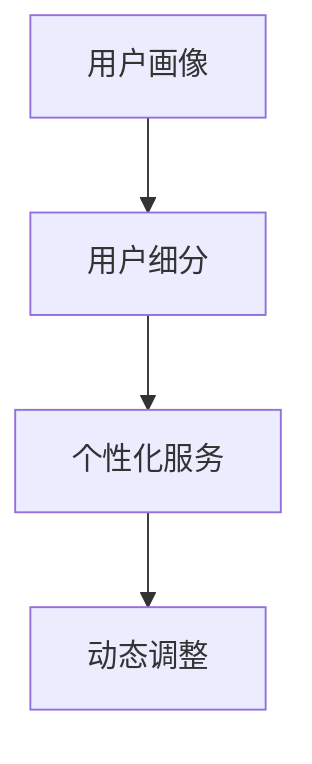
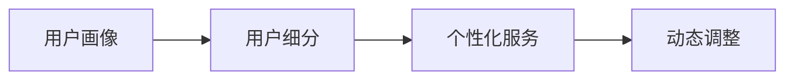

                 

# 知识付费创业中的用户分层运营策略

在知识付费领域，用户分层运营策略是确保产品竞争力和用户满意度的核心。通过精确识别用户群体，制定个性化的运营策略，能够显著提升用户体验和转化率，推动企业持续增长。本文将深入探讨知识付费创业中的用户分层运营策略，包括用户分层的原理、方法、实施步骤，以及实际应用中的案例分析。

## 1. 背景介绍

### 1.1 问题由来

知识付费行业随着互联网的普及和内容消费习惯的改变而迅速发展，各类知识付费平台不断涌现，如得到、喜马拉雅、分答等。然而，由于知识付费产品内容同质化严重，以及用户粘性不足等问题，导致用户流失率高，平台盈利能力受到挑战。

为了应对这些挑战，知识付费企业开始探索用户分层运营策略，通过精准识别不同用户群体，并针对性地提供个性化内容和服务，提升用户体验和留存率，进而实现高效转化和提升业务收入。

### 1.2 问题核心关键点

用户分层运营的核心在于识别不同用户群体的特征，制定差异化的运营策略。其关键点包括：

- **用户画像**：建立详尽的用户画像，了解用户的人口统计学特征、兴趣偏好、消费行为等。
- **细分市场**：根据用户画像将市场细分为多个细分市场，即用户分层。
- **个性化服务**：针对不同细分市场，提供个性化内容和服务。
- **动态调整**：根据用户行为变化和市场反馈，动态调整运营策略。

## 2. 核心概念与联系

### 2.1 核心概念概述

为更好地理解用户分层运营策略，我们先介绍几个核心概念：

- **用户画像(User Profile)**：通过数据收集和分析，建立详尽的用户画像，包括用户基本信息、兴趣偏好、消费习惯、行为特征等。
- **用户细分(User Segmentation)**：根据用户画像将用户群体细分为多个细分市场，每个细分市场代表一类特定用户群体。
- **个性化服务(Personalized Service)**：针对不同细分市场，提供定制化的内容和服务，提升用户体验和满意度。
- **动态调整(Dynamic Adjustment)**：根据用户行为变化和市场反馈，实时调整运营策略，保持市场竞争力。

这些概念通过以下Mermaid流程图来展示它们之间的联系：



### 2.2 核心概念原理和架构的 Mermaid 流程图



## 3. 核心算法原理 & 具体操作步骤

### 3.1 算法原理概述

用户分层运营的核心算法是聚类算法（Clustering Algorithm），包括K-Means、层次聚类、DBSCAN等。聚类算法通过将用户按照相似性分组，形成多个用户群体，进而提供个性化服务。

聚类算法的目标是最小化聚类内部相似性和聚类间差异性的差距，即簇内凝聚性和簇间离散性。常用的度量标准包括欧几里得距离、曼哈顿距离等。

### 3.2 算法步骤详解

用户分层运营的核心步骤包括：

1. **数据收集与预处理**：收集用户行为数据（如浏览记录、购买历史、评论等），并对其进行清洗和预处理。
2. **特征提取**：从预处理后的数据中提取有意义的特征，如兴趣标签、消费时间、浏览时长等。
3. **聚类分析**：应用聚类算法对用户进行分组，形成多个用户细分市场。
4. **个性化服务设计**：根据各细分市场的特征，设计相应的个性化内容和推荐策略。
5. **动态调整**：实时监控用户行为变化和市场反馈，调整个性化策略，提升运营效果。

### 3.3 算法优缺点

#### 优点：

1. **提升用户体验**：通过个性化服务，满足不同用户的需求，提升用户满意度和粘性。
2. **提高转化率**：针对特定用户群体，提供精准内容推荐，提高用户转化率。
3. **优化运营成本**：通过细分市场，集中资源优化特定用户群体，降低运营成本。

#### 缺点：

1. **数据隐私问题**：大量用户数据的收集和处理可能涉及隐私保护问题。
2. **聚类质量不稳定**：聚类结果受特征提取和算法参数的影响，可能存在偏差。
3. **动态调整难度大**：市场和用户行为变化迅速，动态调整运营策略的难度较大。

### 3.4 算法应用领域

用户分层运营策略在知识付费平台、在线教育、电子商务等多个领域都有广泛应用。通过精准识别用户群体，提供个性化服务，这些平台能够显著提升用户粘性和转化率，推动企业增长。

## 4. 数学模型和公式 & 详细讲解 & 举例说明

### 4.1 数学模型构建

聚类算法中的目标函数为：

$$
\min_{K,C} \sum_{i=1}^{n} \sum_{j=1}^{K} z_{ij} ||x_i - \mu_j||^2
$$

其中，$x_i$ 表示用户特征向量，$\mu_j$ 表示聚类中心，$z_{ij}$ 表示用户$i$属于聚类$j$的指示变量。

### 4.2 公式推导过程

以K-Means算法为例，目标函数可进一步简化为：

$$
\min_{K,C} \sum_{i=1}^{n} \sum_{j=1}^{K} z_{ij} ||x_i - \mu_j||^2
$$

其优化过程如下：

1. **初始化聚类中心**：随机初始化K个聚类中心。
2. **分配用户到聚类**：计算每个用户与每个聚类中心的距离，将用户分配到最近的聚类中。
3. **更新聚类中心**：根据当前分配情况，计算每个聚类新的中心位置。
4. **迭代优化**：重复步骤2和步骤3，直至收敛。

### 4.3 案例分析与讲解

以在线教育平台为例，通过聚类算法对用户进行分层，发现以下用户群体：

- **基础学员**：主要关注基础课程，学习时间较短，购买力较低。
- **专业学员**：关注专业课程，学习时间较长，购买力较高。
- **兴趣学员**：关注兴趣课程，活跃度较高，但购买力一般。

针对不同群体，平台可提供如下个性化服务：

- **基础学员**：提供基础课程推荐和优惠活动，增加购买转化率。
- **专业学员**：提供高级课程和专业导师咨询，提升学习效果。
- **兴趣学员**：提供相关兴趣课程和社群互动，增加活跃度和黏性。

## 5. 项目实践：代码实例和详细解释说明

### 5.1 开发环境搭建

使用Python进行用户分层运营策略的开发，需要以下环境：

1. **Python**：安装Python 3.6及以上版本。
2. **Pandas**：用于数据处理和分析。
3. **NumPy**：用于数值计算。
4. **Scikit-learn**：用于聚类分析。
5. **Matplotlib**：用于数据可视化。

### 5.2 源代码详细实现

以下是使用Scikit-learn库进行K-Means聚类分析的Python代码：

```python
from sklearn.cluster import KMeans
from sklearn.preprocessing import StandardScaler
import pandas as pd

# 读取用户数据
data = pd.read_csv('user_data.csv')

# 数据预处理
X = data.drop('label', axis=1)
y = data['label']

# 标准化数据
scaler = StandardScaler()
X_scaled = scaler.fit_transform(X)

# 聚类分析
kmeans = KMeans(n_clusters=3, random_state=42)
clusters = kmeans.fit_predict(X_scaled)

# 输出聚类结果
print(clusters)
```

### 5.3 代码解读与分析

**数据读取与预处理**：
- 使用`pd.read_csv`读取用户数据，将其转换为DataFrame格式。
- 使用`X = data.drop('label', axis=1)`获取特征数据，去除标签列。
- 使用`y = data['label']`获取标签数据。
- 使用`StandardScaler`对特征数据进行标准化处理。

**聚类分析**：
- 使用`KMeans`进行聚类分析，指定聚类数为3。
- 使用`kmeans.fit_predict`计算每个用户所属聚类。

**结果输出**：
- 输出聚类结果，即每个用户所属的聚类编号。

### 5.4 运行结果展示

聚类结果将展示每个用户所属的聚类编号，如：

```
[0 0 1 1 2 0 1 2 0 1 2]
```

其中，0、1、2分别代表三个不同的聚类。

## 6. 实际应用场景

### 6.1 在线教育平台

在线教育平台如Coursera、Udacity等通过用户分层运营策略，提升用户转化率和留存率。例如，Coursera根据用户学习行为和成绩，将用户分为初级、中级和高级三个群体，针对不同群体提供不同难度的课程和个性化推荐，提升用户体验和满意度。

### 6.2 电子商务平台

电子商务平台如Amazon、淘宝等，通过用户分层运营策略，提升商品转化率。例如，Amazon通过用户浏览历史和购买记录，将用户分为价格敏感型、品质敏感型和时效敏感型三种群体，针对不同群体推荐不同价格和品质的商品，增加用户购买欲望。

### 6.3 知识付费平台

知识付费平台如得到、喜马拉雅等，通过用户分层运营策略，提升用户订阅率和课程购买率。例如，得到根据用户听书习惯和评论反馈，将用户分为基础学员、专业学员和兴趣学员，针对不同群体推荐相应课程和活动，增加用户粘性和转化率。

## 7. 工具和资源推荐

### 7.1 学习资源推荐

1. **《机器学习实战》**：李航著，详细介绍各类机器学习算法及其应用。
2. **《Python数据科学手册》**：Jake VanderPlas著，涵盖Python在数据科学和机器学习中的应用。
3. **《数据科学入门》**：吴恩达著，详细介绍数据科学的基础知识和方法。

### 7.2 开发工具推荐

1. **Jupyter Notebook**：用于数据探索和模型训练的交互式编程环境。
2. **PyCharm**：Python开发工具，支持数据科学和机器学习项目开发。
3. **RStudio**：R语言开发工具，适合进行数据分析和可视化。

### 7.3 相关论文推荐

1. **《聚类分析：方法与应用》**：一本系统介绍聚类算法的书籍。
2. **《数据挖掘与统计学习》**：涵盖数据挖掘和统计学习的基础知识和算法。
3. **《K-means算法：原理与实现》**：详细介绍K-means算法的原理和实现方法。

## 8. 总结：未来发展趋势与挑战

### 8.1 研究成果总结

本文详细介绍了知识付费创业中的用户分层运营策略，包括用户分层的原理、方法、实施步骤，以及实际应用中的案例分析。通过用户分层运营策略，知识付费企业能够提升用户体验和留存率，推动企业持续增长。

### 8.2 未来发展趋势

未来用户分层运营策略的发展趋势包括：

1. **多维用户画像**：通过多维度的用户画像，更全面地了解用户需求和行为特征。
2. **实时动态调整**：利用实时数据和机器学习技术，动态调整运营策略，提升市场竞争力。
3. **AI驱动的个性化推荐**：通过AI技术提升个性化推荐精度，满足用户多样化需求。
4. **跨平台数据融合**：实现不同平台用户数据的融合，提供更统一的用户体验。

### 8.3 面临的挑战

用户分层运营策略面临的挑战包括：

1. **数据隐私保护**：如何在提供个性化服务的同时，保护用户隐私。
2. **数据质量问题**：数据质量不稳定，可能影响聚类结果和个性化推荐精度。
3. **模型复杂度**：随着数据维度的增加，模型复杂度增大，优化难度加大。

### 8.4 研究展望

未来的研究可以从以下几个方向进行：

1. **用户行为预测**：通过时间序列分析和深度学习技术，预测用户行为变化，实时调整运营策略。
2. **情感分析**：通过情感分析技术，了解用户对产品内容的情感倾向，提升推荐精度。
3. **跨领域知识迁移**：利用跨领域知识迁移技术，将其他领域的知识应用到用户分层运营中。
4. **强化学习**：通过强化学习技术，不断优化个性化推荐策略，提升用户体验。

通过这些研究方向，可以进一步提升用户分层运营策略的效果，推动知识付费企业的持续增长。

## 9. 附录：常见问题与解答

**Q1: 用户分层运营策略的原理是什么？**

A: 用户分层运营策略的原理是通过聚类算法将用户按照相似性分组，形成多个用户群体，并针对不同群体提供个性化服务。聚类算法目标是最小化聚类内部相似性和聚类间差异性，通过优化算法参数和特征提取，提升聚类效果。

**Q2: 用户分层运营策略有哪些步骤？**

A: 用户分层运营策略的步骤包括数据收集与预处理、特征提取、聚类分析、个性化服务设计和动态调整。通过这些步骤，可以实现精准用户分层和个性化服务。

**Q3: 如何提升用户分层运营的效果？**

A: 提升用户分层运营效果的措施包括多维用户画像、实时动态调整、AI驱动的个性化推荐、跨平台数据融合等。通过这些措施，可以提升用户满意度和转化率。

**Q4: 用户分层运营策略的缺点是什么？**

A: 用户分层运营策略的缺点包括数据隐私问题、聚类质量不稳定、动态调整难度大等。需要在实际应用中加以注意和解决。

**Q5: 用户分层运营策略在哪些领域有应用？**

A: 用户分层运营策略在在线教育、电子商务、知识付费等多个领域都有广泛应用，通过精准识别用户群体，提供个性化服务，推动企业增长。

---

作者：禅与计算机程序设计艺术 / Zen and the Art of Computer Programming

