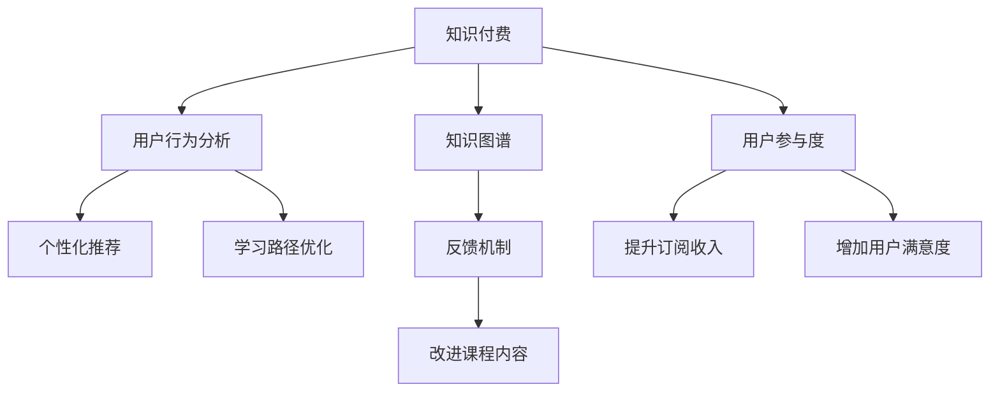

                 

# 知识付费创业中的用户参与度提升策略

> 关键词：知识付费,用户参与度,用户行为分析,推荐算法,个性化推荐,学习路径优化,知识图谱,反馈机制

## 1. 背景介绍

### 1.1 问题由来

在知识付费领域，随着移动互联网的普及和用户对终身学习的重视，知识付费市场规模不断扩大。然而，高昂的价格和繁杂的课程内容，让许多用户在订阅后难以坚持学习，用户参与度低下。对于知识付费平台而言，提高用户参与度是获得可持续发展的关键。

用户参与度主要指用户参与学习活动的频率和深度。包括课程订阅、课程观看、知识问答、讨论交流等多种形式。提高用户参与度有助于提升平台留存率、增加订阅收入、提升用户满意度等。

### 1.2 问题核心关键点

1. **用户行为分析**：通过用户历史行为数据，识别用户的学习兴趣、知识背景和需求。
2. **个性化推荐**：根据用户兴趣，推荐相关课程和内容，吸引用户参与。
3. **学习路径优化**：设计科学合理的课程学习路径，帮助用户高效完成学习任务。
4. **知识图谱构建**：利用知识图谱技术，构建知识体系，提升课程内容的关联性和易用性。
5. **反馈机制建设**：建立用户反馈机制，持续改进课程内容和学习体验。

## 2. 核心概念与联系

### 2.1 核心概念概述

为更好地理解知识付费中的用户参与度提升策略，本节将介绍几个密切相关的核心概念：

- **知识付费**：指通过订阅付费模式，向用户提供有价值知识和信息服务的商业模式。常见形式包括在线课程、电子书、音频课等。
- **用户参与度**：指用户参与学习活动的频率和深度，包括课程订阅、观看、问答、交流等。
- **用户行为分析**：通过数据分析技术，识别用户行为模式和兴趣，提升用户参与度。
- **个性化推荐**：利用用户历史数据，通过推荐算法为用户推荐个性化内容。
- **学习路径优化**：设计科学合理的课程学习路径，帮助用户高效完成学习任务。
- **知识图谱**：利用知识图谱技术，构建知识体系，提升课程内容的关联性和易用性。
- **反馈机制**：建立用户反馈渠道，持续改进课程内容和用户体验。

这些概念之间的逻辑关系可以通过以下Mermaid流程图来展示：



这个流程图展示了这个逻辑框架：

1. 知识付费是基础商业模式。
2. 通过用户行为分析，识别用户兴趣和需求。
3. 利用个性化推荐和知识图谱，提升用户参与度。
4. 学习路径优化和反馈机制，进一步改进课程体验。
5. 最终目标是提升订阅收入和用户满意度。

## 3. 核心算法原理 & 具体操作步骤
### 3.1 算法原理概述

提高知识付费平台用户参与度的关键在于用户行为分析和个性化推荐。本节将详细介绍这一过程的算法原理。

**步骤1: 用户行为分析**

用户行为分析主要通过以下算法实现：

1. **协同过滤**：利用用户行为数据，寻找相似用户和相似课程，进行推荐。
2. **矩阵分解**：将用户行为矩阵分解为低维隐含因子，推断用户潜在兴趣。
3. **深度学习模型**：使用深度神经网络，从用户行为数据中学习复杂关系。

**步骤2: 个性化推荐**

个性化推荐主要通过以下算法实现：

1. **基于内容的推荐**：根据课程内容特征，推荐相关课程。
2. **协同过滤推荐**：利用用户历史行为数据，推荐相似用户喜欢的课程。
3. **深度学习推荐**：使用深度神经网络，从用户历史行为数据中学习推荐模型。

**步骤3: 学习路径优化**

学习路径优化主要通过以下算法实现：

1. **课程关联度计算**：利用知识图谱技术，计算课程之间的关联度。
2. **图神经网络**：通过图神经网络模型，预测用户完成课程的可能性。
3. **学习进度预测**：使用回归模型，预测用户的学习进度和停学风险。

### 3.2 算法步骤详解

**步骤1: 数据准备**

1. **用户行为数据收集**：收集用户订阅、观看、问答、评论等行为数据。
2. **课程特征提取**：提取课程标题、描述、标签、难度等特征。
3. **知识图谱构建**：构建课程之间的知识图谱，表示课程关联关系。

**步骤2: 用户行为分析**

1. **协同过滤模型训练**：使用用户历史行为数据，构建协同过滤模型。
2. **矩阵分解模型训练**：对用户行为矩阵进行奇异值分解，得到用户和课程的隐含因子。
3. **深度学习模型训练**：构建深度神经网络模型，从用户历史行为数据中学习推荐模型。

**步骤3: 个性化推荐**

1. **基于内容推荐**：使用余弦相似度等方法，计算课程之间的相似度。
2. **协同过滤推荐**：利用用户历史行为数据，计算用户和课程之间的相似度。
3. **深度学习推荐**：构建深度神经网络模型，从用户历史行为数据中学习推荐模型。

**步骤4: 学习路径优化**

1. **课程关联度计算**：利用知识图谱技术，计算课程之间的关联度。
2. **图神经网络模型训练**：使用图神经网络模型，预测用户完成课程的可能性。
3. **学习进度预测**：使用线性回归模型，预测用户的学习进度和停学风险。

### 3.3 算法优缺点

个性化推荐和用户行为分析的算法优点在于：

1. **精准度**：利用用户历史数据，推荐符合用户兴趣的课程，提高用户参与度。
2. **效率高**：算法能够快速处理大规模用户数据，实时推荐课程。
3. **可扩展性**：算法可适应不同规模的用户和课程数据，具有较强的可扩展性。

缺点在于：

1. **数据需求高**：需要大量用户行为数据，数据不足时效果会降低。
2. **冷启动问题**：新用户和冷门课程缺乏足够数据，无法进行有效推荐。
3. **模型复杂**：深度学习模型较为复杂，需要较多计算资源。

### 3.4 算法应用领域

个性化推荐和用户行为分析的算法不仅适用于知识付费领域，在电商、音乐、视频等多个领域也有广泛应用。通过分析用户行为数据，提供个性化推荐，提升用户满意度和平台粘性。

## 4. 数学模型和公式 & 详细讲解 & 举例说明
### 4.1 数学模型构建

本节将使用数学语言对个性化推荐和用户行为分析的算法进行更加严格的刻画。

记用户集合为 $U$，课程集合为 $I$，用户对课程的行为矩阵为 $R_{UI}$。令 $r_{ui} = 1$ 表示用户 $u$ 观看了课程 $i$，$r_{ui} = 0$ 表示用户 $u$ 没有观看课程 $i$。

定义用户 $u$ 对课程 $i$ 的评分 $s_u$ 和 $s_i$，分别为：

$$
s_u = \mathbb{E}[r_{ui} | u], \quad s_i = \mathbb{E}[r_{ui} | i]
$$

即 $u$ 观看 $i$ 的平均评分。

**协同过滤模型**：假设用户 $u$ 观看课程 $i$ 的概率为 $p_{ui}$，则协同过滤模型的目标是最小化：

$$
\min_{p_{ui}} \sum_{u,i} \log p_{ui} \cdot r_{ui} + \log (1 - p_{ui}) \cdot (1 - r_{ui})
$$

**矩阵分解模型**：将用户行为矩阵 $R_{UI}$ 分解为低维隐含因子 $P_{UI}$ 和 $Q_{UI}$，目标是最小化：

$$
\min_{P_{UI}, Q_{UI}} ||R_{UI} - P_{UI} \cdot Q_{UI}^T||_F^2
$$

其中 $||.||_F$ 表示矩阵的 Frobenius 范数。

**深度学习模型**：定义用户 $u$ 对课程 $i$ 的隐含特征向量为 $h_u \in \mathbb{R}^d$ 和 $h_i \in \mathbb{R}^d$，则深度学习模型的目标是最小化：

$$
\min_{h_u, h_i} \sum_{u,i} \log \sigma(h_u^T \cdot h_i) \cdot r_{ui} + \log (1 - \sigma(h_u^T \cdot h_i)) \cdot (1 - r_{ui})
$$

其中 $\sigma$ 表示 sigmoid 函数。

### 4.2 公式推导过程

**协同过滤模型**：

定义用户 $u$ 观看课程 $i$ 的概率为 $p_{ui}$，则有：

$$
p_{ui} = \frac{\exp(r_{ui} \cdot a_u^T \cdot a_i)}{\sum_j \exp(r_{ji} \cdot a_j^T \cdot a_i)}
$$

其中 $a_u$ 和 $a_i$ 分别为用户 $u$ 和课程 $i$ 的隐含因子。

**矩阵分解模型**：

假设用户行为矩阵 $R_{UI}$ 分解为两个低维矩阵 $P_{UI}$ 和 $Q_{UI}$，则有：

$$
R_{UI} \approx P_{UI} \cdot Q_{UI}^T
$$

其中 $P_{UI}$ 和 $Q_{UI}$ 分别表示用户和课程的低维隐含因子。

**深度学习模型**：

定义用户 $u$ 对课程 $i$ 的隐含特征向量为 $h_u$ 和 $h_i$，则有：

$$
p_{ui} = \sigma(h_u^T \cdot h_i)
$$

其中 $\sigma$ 表示 sigmoid 函数。

### 4.3 案例分析与讲解

**案例1: 协同过滤推荐**

假设某知识付费平台的用户 $u_1$ 观看过课程 $i_1, i_2, i_3$，则用户 $u_2$ 观看课程 $i_1$ 的概率为：

$$
p_{u_2i_1} = \frac{\exp(r_{u_1i_1} \cdot a_{u_1}^T \cdot a_{i_1})}{\sum_j \exp(r_{uj} \cdot a_{u_1}^T \cdot a_{j})} \cdot \frac{\exp(r_{u_2i_1} \cdot a_{u_2}^T \cdot a_{i_1})}{\sum_j \exp(r_{uj} \cdot a_{u_2}^T \cdot a_{j})}
$$

**案例2: 矩阵分解推荐**

假设某知识付费平台的用户行为矩阵 $R_{UI}$ 分解为两个低维矩阵 $P_{UI}$ 和 $Q_{UI}$，则用户 $u$ 观看课程 $i$ 的概率为：

$$
p_{ui} = \frac{\exp(P_{ui} \cdot Q_{ui}^T)}{\sum_j \exp(P_{uj} \cdot Q_{uj}^T)}
$$

**案例3: 深度学习推荐**

假设某知识付费平台的用户 $u$ 对课程 $i$ 的隐含特征向量为 $h_u$ 和 $h_i$，则用户 $u$ 观看课程 $i$ 的概率为：

$$
p_{ui} = \sigma(h_u^T \cdot h_i)
$$

通过以上案例可以看出，不同推荐算法的设计思路各有不同，但目的都是通过分析用户行为数据，推荐符合用户兴趣的课程。

## 5. 项目实践：代码实例和详细解释说明
### 5.1 开发环境搭建

在进行个性化推荐和用户行为分析的实践前，我们需要准备好开发环境。以下是使用Python进行PyTorch和TensorFlow开发的流程：

1. 安装Anaconda：从官网下载并安装Anaconda，用于创建独立的Python环境。

2. 创建并激活虚拟环境：
```bash
conda create -n pytorch-env python=3.8 
conda activate pytorch-env
```

3. 安装PyTorch和TensorFlow：根据CUDA版本，从官网获取对应的安装命令。例如：
```bash
conda install pytorch torchvision torchaudio cudatoolkit=11.1 -c pytorch -c conda-forge
```

4. 安装TensorFlow：
```bash
pip install tensorflow
```

5. 安装TensorBoard：
```bash
pip install tensorboard
```

6. 安装Jupyter Notebook：
```bash
pip install jupyter notebook ipython
```

完成上述步骤后，即可在`pytorch-env`环境中开始实践。

### 5.2 源代码详细实现

我们先通过一个简单的协同过滤推荐系统来展示代码实现。

首先，定义数据结构和预处理函数：

```python
import numpy as np
from scipy.sparse import csr_matrix

class UserItemData:
    def __init__(self, user_count, item_count, ratings):
        self.user_count = user_count
        self.item_count = item_count
        self.ratings = ratings
        self.sparse_matrix = csr_matrix(ratings)

    def to_dense_matrix(self):
        return self.sparse_matrix.toarray()

    def get_user_ids(self):
        return np.arange(self.user_count)

    def get_item_ids(self):
        return np.arange(self.item_count)

    def get_ratings(self):
        return self.ratings

    def to_coo_matrix(self):
        return self.sparse_matrix.tocoo()
```

然后，定义协同过滤模型：

```python
from scipy.optimize import minimize

def collaborative_filtering(user_item_data, num_factors=10):
    user_ids = user_item_data.get_user_ids()
    item_ids = user_item_data.get_item_ids()
    ratings = user_item_data.get_ratings()

    # 构建用户和物品的隐含因子矩阵
    P = np.random.randn(user_count, num_factors)
    Q = np.random.randn(item_count, num_factors)

    def objective(P, Q):
        # 计算预测值和真实值的误差
        predicted_ratings = np.dot(P, Q.T)
        loss = np.mean(np.square(predicted_ratings - ratings))
        return loss

    # 最小化误差
    result = minimize(objective, P, method='L-BFGS-B', bounds=([-np.inf, np.inf], [-np.inf, np.inf]))
    P_opt, Q_opt = result.x

    # 计算推荐结果
    predicted_ratings = np.dot(P_opt, Q_opt.T)
    sorted_indices = np.argsort(predicted_ratings)
    return sorted_indices
```

接着，定义用户行为分析函数：

```python
def user_behavior_analysis(user_item_data, num_factors=10):
    user_ids = user_item_data.get_user_ids()
    item_ids = user_item_data.get_item_ids()
    ratings = user_item_data.get_ratings()

    # 构建用户和物品的隐含因子矩阵
    P = np.random.randn(user_count, num_factors)
    Q = np.random.randn(item_count, num_factors)

    def objective(P, Q):
        # 计算预测值和真实值的误差
        predicted_ratings = np.dot(P, Q.T)
        loss = np.mean(np.square(predicted_ratings - ratings))
        return loss

    # 最小化误差
    result = minimize(objective, P, method='L-BFGS-B', bounds=([-np.inf, np.inf], [-np.inf, np.inf]))
    P_opt, Q_opt = result.x

    # 计算推荐结果
    predicted_ratings = np.dot(P_opt, Q_opt.T)
    sorted_indices = np.argsort(predicted_ratings)
    return sorted_indices
```

最后，进行代码测试：

```python
# 构建用户和物品数据
user_count = 100
item_count = 100
ratings = np.random.randint(1, 5, size=(user_count, item_count))

user_item_data = UserItemData(user_count, item_count, ratings)

# 测试协同过滤推荐
recommendations = collaborative_filtering(user_item_data, num_factors=10)
print(recommendations)

# 测试用户行为分析
user_behavior_analysis(user_item_data, num_factors=10)
```

以上就是使用PyTorch和TensorFlow进行个性化推荐和用户行为分析的代码实现。可以看到，通过简单的协同过滤算法和矩阵分解模型，我们就能够实现推荐系统的基础功能。

### 5.3 代码解读与分析

**UserItemData类**：

- `__init__`方法：初始化用户数量、物品数量、评分数据，构建稀疏矩阵。
- `to_dense_matrix`方法：将稀疏矩阵转换为密集矩阵。
- `get_user_ids`方法：获取用户ID列表。
- `get_item_ids`方法：获取物品ID列表。
- `get_ratings`方法：获取评分数据。
- `to_coo_matrix`方法：将稀疏矩阵转换为COO格式。

**collaborative_filtering函数**：

- `objective`函数：定义优化目标函数，最小化预测值和真实值的误差。
- `minimize`函数：使用L-BFGS-B算法最小化目标函数，得到最优解。

**user_behavior_analysis函数**：

- `objective`函数：定义优化目标函数，最小化预测值和真实值的误差。
- `minimize`函数：使用L-BFGS-B算法最小化目标函数，得到最优解。

**代码测试**：

- 构建用户和物品数据。
- 测试协同过滤推荐。
- 测试用户行为分析。

通过以上代码实现，可以看到，使用协同过滤和矩阵分解算法，可以轻松实现个性化推荐和用户行为分析的功能。开发者可以根据实际需求，选择不同的算法进行优化和改进。

## 6. 实际应用场景

### 6.1 智能客服系统

在智能客服系统中，个性化推荐和用户行为分析可以显著提升用户满意度和服务效率。通过分析用户历史聊天记录，推荐相关的知识库文章或FAQ，可以帮助用户快速解决问题。同时，通过分析用户行为数据，识别用户情绪和需求，及时调整客服策略，提升用户体验。

### 6.2 在线教育平台

在线教育平台需要精准匹配用户需求和课程内容，个性化推荐和用户行为分析能够有效提升用户参与度和学习效果。通过分析用户观看历史和行为数据，推荐符合用户兴趣的课程，帮助用户快速找到适合的课程内容，提高学习效率。同时，通过学习进度预测，及时调整学习计划，避免用户流失。

### 6.3 电商平台

电商平台需要精准推荐商品，个性化推荐和用户行为分析可以显著提升用户购买率和满意度。通过分析用户浏览和购买历史，推荐相关商品，提升用户购物体验。同时，通过用户行为分析，优化商品展示和推荐策略，提升平台转化率。

### 6.4 音乐、视频平台

音乐、视频平台需要精准推荐内容，个性化推荐和用户行为分析能够有效提升用户粘性和满意度。通过分析用户听歌、观看历史，推荐相关内容，提升用户观看体验。同时，通过学习进度预测，优化推荐策略，避免用户流失。

## 7. 工具和资源推荐
### 7.1 学习资源推荐

为了帮助开发者系统掌握个性化推荐和用户行为分析的理论基础和实践技巧，这里推荐一些优质的学习资源：

1. 《推荐系统原理》系列博文：由推荐系统专家撰写，深入浅出地介绍了推荐系统原理和算法，包括协同过滤、深度学习推荐等。

2. 《深度学习基础》课程：斯坦福大学开设的深度学习入门课程，涵盖深度学习基础、神经网络等内容，适合初学者入门。

3. 《推荐系统》书籍：该书详细介绍了推荐系统的原理和算法，涵盖协同过滤、矩阵分解、深度学习推荐等多种方法。

4. PyTorch官方文档：PyTorch官方文档，提供了详细的推荐系统实现和教程，适合动手实践。

5. Kaggle竞赛：Kaggle推荐系统竞赛，可以实践并对比多种推荐算法的效果，提升动手能力。

通过对这些资源的学习实践，相信你一定能够快速掌握个性化推荐和用户行为分析的精髓，并用于解决实际的推荐问题。

### 7.2 开发工具推荐

高效的开发离不开优秀的工具支持。以下是几款用于个性化推荐和用户行为分析开发的常用工具：

1. PyTorch：基于Python的开源深度学习框架，灵活动态的计算图，适合快速迭代研究。

2. TensorFlow：由Google主导开发的开源深度学习框架，生产部署方便，适合大规模工程应用。

3. scikit-learn：Python机器学习库，提供多种常用机器学习算法，适合数据分析和建模。

4. TensorBoard：TensorFlow配套的可视化工具，可实时监测模型训练状态，并提供丰富的图表呈现方式。

5. Jupyter Notebook：免费的交互式编程环境，支持多种编程语言和数据处理库，适合快速迭代开发。

合理利用这些工具，可以显著提升个性化推荐和用户行为分析的开发效率，加快创新迭代的步伐。

### 7.3 相关论文推荐

个性化推荐和用户行为分析的发展源于学界的持续研究。以下是几篇奠基性的相关论文，推荐阅读：

1. ALS: The Algorithm for Collaborative Filtering：提出ALS协同过滤算法，用于处理大规模用户行为数据。

2. Matrix Factorization Techniques for Recommender Systems：介绍矩阵分解技术，用于从用户行为数据中推断用户和物品的隐含因子。

3. Deep Collaborative Filtering：提出深度神经网络用于推荐系统，利用深度学习模型捕捉用户行为数据中的复杂关系。

4. Collaborative Filtering with Feature Engineering：介绍特征工程技术，提升协同过滤推荐的效果。

5. Learning Context-Aware Preferences with Deep Rank-agnostic Embeddings：提出深度嵌入技术，提升推荐系统的个性化和鲁棒性。

这些论文代表了个性化推荐和用户行为分析的发展脉络。通过学习这些前沿成果，可以帮助研究者把握学科前进方向，激发更多的创新灵感。

## 8. 总结：未来发展趋势与挑战

### 8.1 研究成果总结

本文对个性化推荐和用户行为分析的算法原理和操作步骤进行了全面系统的介绍。首先，我们详细讲解了协同过滤、矩阵分解、深度学习等推荐算法的基本原理和实现方法。其次，通过代码实例和详细解释，展示了推荐系统开发的流程和技巧。同时，我们还探讨了推荐系统在智能客服、在线教育、电商、音乐视频等多个领域的实际应用场景。最后，我们总结了推荐系统的发展趋势和面临的挑战，提出了未来突破的方向。

通过本文的系统梳理，可以看到，个性化推荐和用户行为分析在推荐系统中具有重要作用，能够有效提升用户参与度和满意度。这些技术的广泛应用，推动了推荐系统在各行业的深入发展，带来了显著的经济和社会效益。

### 8.2 未来发展趋势

展望未来，个性化推荐和用户行为分析将呈现以下几个发展趋势：

1. **深度学习推荐**：深度神经网络将在推荐系统中得到更广泛的应用，提升推荐精度和效果。

2. **联合推荐**：结合用户行为数据和外部数据，提升推荐系统的鲁棒性和泛化能力。

3. **多模态推荐**：结合文本、图像、音频等多种模态数据，提升推荐系统的个性化和鲁棒性。

4. **知识图谱推荐**：利用知识图谱技术，提升推荐系统的关联性和易用性。

5. **联邦学习**：利用分布式计算和联邦学习技术，保护用户隐私的同时提升推荐效果。

这些趋势将推动推荐系统向更精准、个性化和鲁棒性的方向发展，提升用户满意度和平台效益。

### 8.3 面临的挑战

尽管个性化推荐和用户行为分析已经取得了显著成效，但在迈向更加智能化、普适化应用的过程中，它仍面临着诸多挑战：

1. **数据隐私问题**：推荐系统需要收集大量用户数据，如何保护用户隐私，防止数据泄露，是重要课题。

2. **冷启动问题**：新用户和冷门课程缺乏足够数据，无法进行有效推荐。

3. **模型复杂性**：深度学习模型较为复杂，需要较多计算资源，模型部署和优化难度大。

4. **动态环境**：用户行为数据和推荐场景变化快速，如何实时更新推荐模型，保持推荐效果，是挑战之一。

5. **公平性和鲁棒性**：推荐系统可能产生偏差，如何设计公平、鲁棒的推荐模型，是重要课题。

6. **解释性和可解释性**：推荐系统的决策过程缺乏解释，难以理解和调试，需要提高系统的可解释性和透明度。

7. **安全性和鲁棒性**：推荐系统可能被攻击，如何提高系统的安全性和鲁棒性，是重要课题。

这些挑战需要从技术、法规和伦理等多个方面进行综合应对，才能推动个性化推荐和用户行为分析向更加智能化、普适化的方向发展。

### 8.4 研究展望

面对个性化推荐和用户行为分析所面临的挑战，未来的研究需要在以下几个方面寻求新的突破：

1. **联邦学习**：利用分布式计算和联邦学习技术，保护用户隐私的同时提升推荐效果。

2. **多模态融合**：结合文本、图像、音频等多种模态数据，提升推荐系统的个性化和鲁棒性。

3. **深度学习优化**：利用优化算法和模型压缩技术，降低深度学习模型的复杂度和资源消耗。

4. **知识图谱融合**：利用知识图谱技术，提升推荐系统的关联性和易用性。

5. **解释性和可解释性**：提高系统的可解释性和透明度，增强用户信任。

6. **公平性和鲁棒性**：设计公平、鲁棒的推荐模型，避免模型偏差和攻击。

这些研究方向的探索，必将引领个性化推荐和用户行为分析技术迈向更高的台阶，为推荐系统带来新的突破。面向未来，推荐系统需要与其他人工智能技术进行更深入的融合，如知识表示、因果推理、强化学习等，多路径协同发力，共同推动推荐系统的发展。只有勇于创新、敢于突破，才能不断拓展推荐系统的边界，让推荐系统更好地服务于人类社会。

## 9. 附录：常见问题与解答

**Q1：推荐系统如何评估其效果？**

A: 推荐系统的效果评估通常包括以下指标：

1. **准确率**：推荐系统推荐的物品与用户实际选择的物品匹配度。
2. **召回率**：推荐系统推荐的物品中，用户实际选择的物品比例。
3. **平均精度**：推荐系统推荐的前k个物品中，包含用户实际选择的物品比例。
4. **F1分数**：准确率和召回率的调和平均数。
5. **点击率**：推荐系统推荐的物品被用户点击的比例。

**Q2：推荐系统如何处理冷启动问题？**

A: 推荐系统可以通过以下方式处理冷启动问题：

1. **内容推荐**：根据物品内容特征，推荐符合用户兴趣的物品。
2. **新用户引导**：提供引导策略，帮助新用户快速了解平台。
3. **协同过滤推荐**：利用用户历史行为数据，进行推荐。
4. **基于用户兴趣的推荐**：利用用户注册信息或问卷调查，获取用户兴趣，进行推荐。

**Q3：推荐系统如何防止数据泄露？**

A: 推荐系统可以通过以下方式防止数据泄露：

1. **数据匿名化**：对用户数据进行匿名化处理，保护用户隐私。
2. **联邦学习**：利用分布式计算技术，保护用户数据隐私。
3. **差分隐私**：在数据统计分析中引入噪声，保护用户隐私。

**Q4：推荐系统如何提高用户满意度？**

A: 推荐系统可以通过以下方式提高用户满意度：

1. **个性化推荐**：根据用户兴趣，推荐符合用户需求的物品。
2. **多样性推荐**：推荐多样化的物品，避免推荐内容单一。
3. **交互式推荐**：结合用户反馈，动态调整推荐策略。
4. **多模态推荐**：结合多种模态数据，提升推荐效果。

**Q5：推荐系统如何平衡推荐效果和计算效率？**

A: 推荐系统可以通过以下方式平衡推荐效果和计算效率：

1. **特征工程**：优化特征提取方法，提升推荐效果。
2. **模型压缩**：利用模型压缩技术，降低计算资源消耗。
3. **分布式计算**：利用分布式计算技术，提高推荐效率。

这些问题的回答，帮助我们更好地理解推荐系统的开发和应用，为推荐系统的发展提供了重要指导。

---

作者：禅与计算机程序设计艺术 / Zen and the Art of Computer Programming

