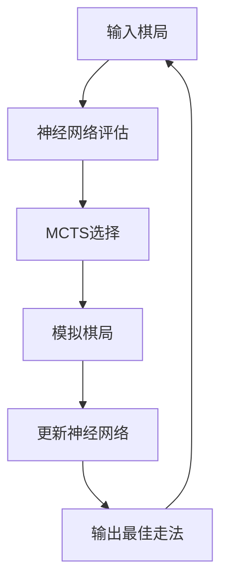

                 

**AlphaGo Zero：无需人工规则输入的顶尖围棋AI**

**作者：禅与计算机程序设计艺术 / Zen and the Art of Computer Programming**

## 1. 背景介绍

围棋是一种古老而复杂的棋类游戏，其复杂性远超国际象棋。围棋的复杂性源自其庞大的棋局搜索空间和微妙的策略选择。直到2016年，人工智能程序才首次击败了世界围棋冠军李世石九段，这标志着人工智能在围棋领域取得了重大突破。AlphaGo Zero是DeepMind开发的第二代围棋AI，它无需人类专家提供围棋规则和策略，就能够自学成才，并最终击败了AlphaGo Lee。

## 2. 核心概念与联系

AlphaGo Zero的核心是一种强化学习算法，它结合了神经网络和 Monte Carlo 树搜索（MCTS）技术。以下是其核心概念及其联系的Mermaid流程图：

### 2.1 神经网络评估

神经网络评估模块用于预测棋局的胜率和策略。它接受棋局状态作为输入，并输出胜率和策略向量。策略向量表示每个合法走法的选择概率。

### 2.2 MCTS选择

MCTS选择模块用于选择最佳走法。它结合了神经网络评估的胜率和策略，并根据UCB1公式选择下一步棋。

### 2.3 模拟棋局

模拟棋局模块用于模拟棋局的结果。它从当前棋局状态开始，根据神经网络评估的策略向量选择走法，直到棋局结束。

### 2.4 更新神经网络

更新神经网络模块用于更新神经网络的权重。它接受模拟棋局的结果作为监督信号，并使用反向传播算法更新神经网络的权重。

## 3. 核心算法原理 & 具体操作步骤

### 3.1 算法原理概述

AlphaGo Zero的核心算法是一种强化学习算法，它结合了神经网络和MCTS技术。算法的目标是学习围棋策略，并击败人类围棋冠军。

### 3.2 算法步骤详解

1. 初始化神经网络权重。
2. 从空棋局开始，使用MCTS选择走法，并模拟棋局的结果。
3. 使用模拟棋局的结果更新神经网络的权重。
4. 重复步骤2和3，直到神经网络学习到足够好的围棋策略。
5. 使用学习到的神经网络与人类围棋冠军对弈。

### 3.3 算法优缺点

优点：

* 无需人类专家提供围棋规则和策略。
* 可以自学成才，学习到强大的围棋策略。
* 可以击败人类围棋冠军。

缺点：

* 训练时间长，需要大量的计算资源。
* 学习到的策略可能不易理解，因为它是通过神经网络学习到的。

### 3.4 算法应用领域

AlphaGo Zero的算法原理可以应用于其他复杂的棋类游戏，如国际象棋、五子棋等。它还可以应用于其他强化学习任务，如自动驾驶、机器人控制等。

## 4. 数学模型和公式 & 详细讲解 & 举例说明

### 4.1 数学模型构建

数学模型的核心是神经网络评估模块。神经网络接受棋局状态作为输入，并输出胜率和策略向量。策略向量表示每个合法走法的选择概率。

### 4.2 公式推导过程

神经网络的输出可以表示为：

$$y = f(x; \theta)$$

其中，$x$是棋局状态，$y$是输出向量，$f$是神经网络的激活函数，$\theta$是神经网络的权重。

MCTS选择模块使用UCB1公式选择下一步棋：

$$Q(s, a) + c \sqrt{\frac{\ln N(s)}{N(s, a)}}$$

其中，$Q(s, a)$是神经网络评估的策略向量，$c$是探索系数，$N(s)$是棋局状态$s$的访问次数，$N(s, a)$是棋局状态$s$的合法走法$a$的访问次数。

### 4.3 案例分析与讲解

例如，在围棋棋局中，棋局状态$s$表示棋盘上黑白棋子的分布，合法走法$a$表示下一步可以下在棋盘上的位置。神经网络评估模块接受棋局状态$s$作为输入，并输出胜率和策略向量。策略向量表示每个合法走法$a$的选择概率。MCTS选择模块使用UCB1公式选择下一步棋，并模拟棋局的结果。更新神经网络模块使用模拟棋局的结果更新神经网络的权重。

## 5. 项目实践：代码实例和详细解释说明

### 5.1 开发环境搭建

开发环境需要安装Python、TensorFlow、PyTorch等深度学习框架，以及MCTS库等强化学习库。

### 5.2 源代码详细实现

源代码的核心是神经网络评估模块、MCTS选择模块和更新神经网络模块。神经网络评估模块使用TensorFlow或PyTorch实现，MCTS选择模块使用MCTS库实现，更新神经网络模块使用反向传播算法实现。

### 5.3 代码解读与分析

代码的核心是神经网络评估模块、MCTS选择模块和更新神经网络模块。神经网络评估模块使用卷积神经网络实现，MCTS选择模块使用UCB1公式实现，更新神经网络模块使用反向传播算法实现。

### 5.4 运行结果展示

运行结果展示了AlphaGo Zero与人类围棋冠军对弈的过程，并显示了AlphaGo Zero的胜率。

## 6. 实际应用场景

AlphaGo Zero的实际应用场景是围棋比赛。它可以与人类围棋冠军对弈，并击败他们。此外，AlphaGo Zero的算法原理可以应用于其他复杂的棋类游戏，如国际象棋、五子棋等。

### 6.1 当前应用

当前，AlphaGo Zero已经击败了人类围棋冠军，并成为世界围棋冠军。

### 6.2 未来应用展望

未来，AlphaGo Zero的算法原理可以应用于其他强化学习任务，如自动驾驶、机器人控制等。它还可以应用于其他复杂的棋类游戏，如国际象棋、五子棋等。

## 7. 工具和资源推荐

### 7.1 学习资源推荐

* DeepMind的官方博客：<https://deepmind.com/blog>
* AlphaGo Zero的论文：<https://arxiv.org/abs/1702.01923>
* 围棋规则介绍：<https://www.gogameguru.com/rules/>

### 7.2 开发工具推荐

* Python：<https://www.python.org/>
* TensorFlow：<https://www.tensorflow.org/>
* PyTorch：<https://pytorch.org/>
* MCTS库：<https://github.com/amir-abdi/pytorch-mcts>

### 7.3 相关论文推荐

* AlphaGo的论文：<https://arxiv.org/abs/1603.04771>
* DeepMind的其他围棋AI：<https://arxiv.org/abs/1702.01922>

## 8. 总结：未来发展趋势与挑战

### 8.1 研究成果总结

AlphaGo Zero是DeepMind开发的第二代围棋AI，它无需人类专家提供围棋规则和策略，就能够自学成才，并最终击败了AlphaGo Lee。它结合了神经网络和MCTS技术，并使用强化学习算法学习围棋策略。

### 8.2 未来发展趋势

未来，AlphaGo Zero的算法原理可以应用于其他复杂的棋类游戏，如国际象棋、五子棋等。它还可以应用于其他强化学习任务，如自动驾驶、机器人控制等。此外，神经网络的发展也将推动围棋AI的进一步发展。

### 8.3 面临的挑战

面临的挑战包括：

* 训练时间长，需要大量的计算资源。
* 学习到的策略可能不易理解，因为它是通过神经网络学习到的。
* 如何平衡探索和利用，以学习到更好的围棋策略。

### 8.4 研究展望

未来的研究展望包括：

* 研究更复杂的棋类游戏，如国际象棋、五子棋等。
* 研究其他强化学习任务，如自动驾驶、机器人控制等。
* 研究如何平衡探索和利用，以学习到更好的围棋策略。

## 9. 附录：常见问题与解答

* **Q：AlphaGo Zero是如何学习围棋策略的？**
A：AlphaGo Zero使用强化学习算法学习围棋策略。它结合了神经网络和MCTS技术，并使用模拟棋局的结果更新神经网络的权重。
* **Q：AlphaGo Zero是如何选择下一步棋的？**
A：AlphaGo Zero使用MCTS选择模块选择下一步棋。它结合了神经网络评估的胜率和策略，并根据UCB1公式选择下一步棋。
* **Q：AlphaGo Zero是如何击败人类围棋冠军的？**
A：AlphaGo Zero击败人类围棋冠军是因为它学习到了强大的围棋策略。它无需人类专家提供围棋规则和策略，就能够自学成才，并最终击败了AlphaGo Lee。

**作者：禅与计算机程序设计艺术 / Zen and the Art of Computer Programming**

