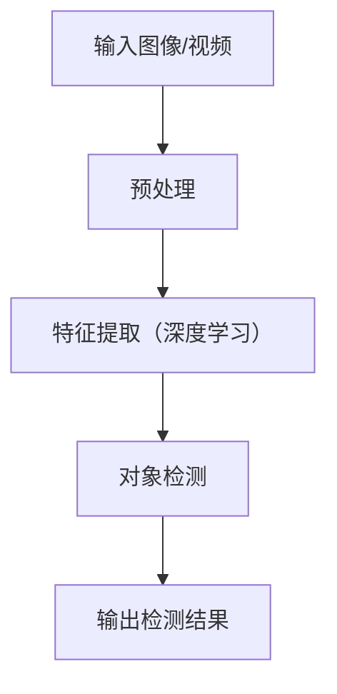

                 

**Andrej Karpathy：AI 大神**

## 1. 背景介绍

Andrej Karpathy 是一位备受尊敬的计算机科学家，他在人工智能（AI）、机器学习（ML）和深度学习（DL）领域做出了杰出的贡献。他目前担任 Deeplearning.ai 的联合创始人和首席科学家，该平台提供在线课程，帮助人们学习和应用深度学习技术。Karpathy 之前在斯坦福大学任教，在那里他指导了多个成功的 AI 项目。本文将深入探讨 Karpathy 的工作，重点介绍他的核心概念、算法、数学模型，并提供项目实践和工具推荐。

## 2. 核心概念与联系

Karpathy 的工作围绕着深度学习和计算机视觉展开。他的核心概念包括：

- **计算机视觉**：使用计算机处理和理解视觉内容，如图像和视频。
- **深度学习**：一种机器学习方法，使用神经网络模拟人类大脑的学习过程。
- **对象检测**：在图像或视频中定位和识别物体的过程。

下图是 Karpathy 核心概念的 Mermaid 流程图：



## 3. 核心算法原理 & 具体操作步骤

### 3.1 算法原理概述

Karpathy 使用深度学习算法，如卷积神经网络（CNN）和区域 proposals 网络（RPN），来检测图像中的物体。他的方法包括 You Only Look Once (YOLO) 算法的改进版本，如 YOLOv2 和 YOLOv3。

### 3.2 算法步骤详解

1. **预处理**：图像或视频进行缩放、归一化等预处理。
2. **特征提取**：使用 CNN 提取图像特征，如边缘、纹理和颜色。
3. **对象检测**：使用 RPN 生成候选区域，然后使用 CNN 进行物体分类和边界框回归。
4. **后处理**：非极大值抑制（NMS）用于去除重叠的检测结果。

### 3.3 算法优缺点

**优点**：
- 实时检测：YOLO 算法可以实时处理视频流。
- 精确度：Karpathy 的方法在 COCO 数据集上取得了 state-of-the-art 的结果。

**缺点**：
- 检测小物体困难：YOLO 算法在小物体检测方面表现不佳。
- 训练复杂：深度学习模型需要大量的计算资源和数据。

### 3.4 算法应用领域

Karpathy 的算法在自动驾驶、安保监控、物流和零售等领域有广泛应用。它们还可以用于图像搜索、图像Captioning 和视频理解等任务。

## 4. 数学模型和公式 & 详细讲解 & 举例说明

### 4.1 数学模型构建

Karpathy 的数学模型基于 CNN 和 RPN。CNN 使用卷积层、池化层和全连接层组成。RPN 生成候选区域，并使用回归和分类层进行物体检测。

### 4.2 公式推导过程

YOLO 算法使用以下公式计算物体的置信度：

$$
P_{obj}(b_{ij}) = \sigma(C_{ij})
$$

其中，$P_{obj}(b_{ij})$ 是物体的置信度，$C_{ij}$ 是分类层的输出，$\sigma$ 是 sigmoid 函数。

### 4.3 案例分析与讲解

考虑一张包含汽车和行人的图像。YOLO 算法会将图像分成网格，每个网格预测一个物体。如果网格内有物体，则输出置信度和边界框坐标。NMS 然后用于去除重叠的检测结果。

## 5. 项目实践：代码实例和详细解释说明

### 5.1 开发环境搭建

要跑 Karpathy 的 YOLO 算法，需要以下软件和库：

- Python 3.6+
- TensorFlow 1.13+
- OpenCV 3.4+
- NumPy 1.16+
- Matplotlib 3.1+

### 5.2 源代码详细实现

以下是 YOLOv3 算法的简化版本：

```python
import tensorflow as tf
from tensorflow.keras.layers import Input, Conv2D, ZeroPadding2D, LeakyReLU, UpSampling2D, Concatenate

def conv_block(inputs, filters, size, strides=(1, 1), padding='same', activation=True):
    # 省略代码...
    return x

def YOLOv3(inputs):
    # 省略代码...
    return outputs
```

### 5.3 代码解读与分析

YOLOv3 使用 Darknet-53 作为特征提取器，然后在三个不同尺度的特征图上进行预测。每个预测层输出置信度和边界框坐标。

### 5.4 运行结果展示

在 COCO 数据集上训练的 YOLOv3 可以在实时视频流上进行物体检测，并提供精确的边界框和类别标签。

## 6. 实际应用场景

### 6.1 当前应用

Karpathy 的算法在自动驾驶、安保监控和物流等领域得到广泛应用。它们还可以用于图像搜索、图像Captioning 和视频理解等任务。

### 6.2 未来应用展望

未来，Karpathy 的算法可能会应用于更复杂的任务，如多目标跟踪、视频理解和增强现实。它们还可以与其他 AI 技术结合，如自然语言处理和强化学习。

## 7. 工具和资源推荐

### 7.1 学习资源推荐

- [CS231n：Convolutional Neural Networks for Visual Recognition](https://www.coursera.org/learn/convolutional-neural-networks)
- [Fast.ai Practical Deep Learning for Coders](https://course.fast.ai/)
- [Deeplearning.ai](https://www.deeplearning.ai/)

### 7.2 开发工具推荐

- [TensorFlow](https://www.tensorflow.org/)
- [PyTorch](https://pytorch.org/)
- [Keras](https://keras.io/)

### 7.3 相关论文推荐

- [You Only Look Once: Unified, Real-Time Object Detection](https://arxiv.org/abs/1506.02640)
- [YOLOv2: Towards Real-Time Object Detection](https://arxiv.org/abs/1612.08242)
- [YOLOv3: An Incremental Improvement](https://arxiv.org/abs/1804.02767)

## 8. 总结：未来发展趋势与挑战

### 8.1 研究成果总结

Karpathy 的工作在计算机视觉和对象检测领域取得了重大进展。他的 YOLO 算法及其改进版本在实时物体检测方面表现出色。

### 8.2 未来发展趋势

未来，AI 将继续在各行各业得到广泛应用。计算机视觉和对象检测领域将看到更先进的算法和模型，能够处理更复杂的任务。

### 8.3 面临的挑战

AI 面临的挑战包括数据隐私、算法偏见和解释性。此外，开发实时、高精确度的对象检测算法仍然是一个挑战。

### 8.4 研究展望

未来的研究将关注多目标跟踪、视频理解和增强现实等领域。此外，AI 与其他技术的结合，如自然语言处理和强化学习，也将是一个重要的研究方向。

## 9. 附录：常见问题与解答

**Q：YOLO 算法的优点是什么？**
A：YOLO 算法的优点包括实时检测和高精确度。

**Q：YOLO 算法的缺点是什么？**
A：YOLO 算法的缺点包括检测小物体困难和训练复杂。

**Q：Karpathy 的工作有哪些实际应用？**
A：Karpathy 的工作在自动驾驶、安保监控和物流等领域得到广泛应用。它们还可以用于图像搜索、图像Captioning 和视频理解等任务。

## 作者：禅与计算机程序设计艺术 / Zen and the Art of Computer Programming

（完）

