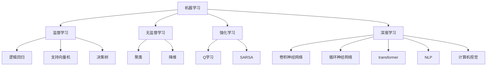

                 

**人工智能的未来发展方向**

**作者：禅与计算机程序设计艺术 / Zen and the Art of Computer Programming**

## 1. 背景介绍

人工智能（AI）自诞生以来，已从一项学术实验发展为商业和技术领域的关键驱动因素。随着计算能力的提高和数据的丰富，AI正在各行各业产生重大影响。本文将探讨人工智能的未来发展方向，关注其核心概念、算法、数学模型，并提供实践项目和工具资源。

## 2. 核心概念与联系

人工智能的核心概念包括机器学习、深度学习、自然语言处理（NLP）、计算机视觉等。这些概念密切相关，共同构成了AI的基础。



## 3. 核心算法原理 & 具体操作步骤

### 3.1 算法原理概述

本节将简要介绍几种关键的AI算法，包括逻辑回归、决策树、支持向量机（SVM）、卷积神经网络（CNN）和循环神经网络（RNN）。

### 3.2 算法步骤详解

#### 逻辑回归

1. 数据预处理：处理缺失值、异常值，并对数据进行标准化。
2. 特征选择：选择相关特征，去除无关特征。
3. 模型训练：使用梯度下降算法训练模型。
4. 模型评估：使用交叉验证评估模型性能。

#### 决策树

1. 数据预处理：同逻辑回归。
2. 特征选择：同逻辑回归。
3. 模型训练：使用信息增益或Gain Ratio选择最佳特征，构建决策树。
4. 模型剪枝：防止过拟合。
5. 模型评估：同逻辑回归。

#### SVM

1. 数据预处理：同逻辑回归。
2. 特征选择：同逻辑回归。
3. 核函数选择：线性、多项式、RBF等。
4. 模型训练：使用SMO算法训练模型。
5. 模型评估：同逻辑回归。

#### CNN

1. 数据预处理：图像增强、标准化。
2. 模型构建：构建CNN模型，包括卷积层、池化层、全连接层。
3. 模型训练：使用梯度下降算法训练模型。
4. 模型评估：使用验证集评估模型性能。

#### RNN

1. 数据预处理：文本预处理、标记化、向量化。
2. 模型构建：构建RNN模型，包括输入层、隐藏层、输出层。
3. 模型训练：使用梯度下降算法训练模型。
4. 模型评估：使用验证集评估模型性能。

### 3.3 算法优缺点

- 逻辑回归：简单、易于理解，但对特征线性关系敏感。
- 决策树：可解释性强，但易于过拟合。
- SVM：泛化能力强，但训练时间长。
- CNN：在图像识别领域表现出色，但对大规模数据集训练时间长。
- RNN：在序列数据处理方面表现出色，但梯度消失问题严重。

### 3.4 算法应用领域

- 逻辑回归：二分类、多元回归。
- 决策树：分类、回归、特征选择。
- SVM：分类、回归、异常检测。
- CNN：图像识别、目标检测、图像分类。
- RNN：自然语言处理、时间序列预测。

## 4. 数学模型和公式 & 详细讲解 & 举例说明

### 4.1 数学模型构建

#### 逻辑回归

设有n个特征的数据集，目标是预测二分类结果。构建线性模型：

$$h_\theta(x) = \theta_0 + \theta_1x_1 + \theta_2x_2 +... + \theta_nx_n$$

#### 决策树

构建决策树时，使用信息增益或Gain Ratio选择最佳特征：

$$Gain(S, A) = H(S) - H(S|A)$$

$$GainRatio(S, A) = \frac{Gain(S, A)}{H(A)}$$

#### SVM

构建SVM模型时，目标是最小化：

$$\min_{\theta} \frac{1}{2}\|\theta\|^2 + C\sum_{i=1}^{n}\xi_i$$

#### CNN

构建CNN模型时，使用卷积层提取特征，池化层减小维度，全连接层进行分类：

$$y = \sigma(\theta^Tx)$$

#### RNN

构建RNN模型时，使用循环单元处理序列数据：

$$h_t = \sigma(Wx_t + Uh_{t-1} + b)$$

### 4.2 公式推导过程

#### 逻辑回归

逻辑回归的目标是最小化代价函数：

$$J(\theta) = -\frac{1}{m}\sum_{i=1}^{m}[y^{(i)}\log(h_\theta(x^{(i)})) + (1-y^{(i)})\log(1-h_\theta(x^{(i)}))] + \frac{\lambda}{2m}\sum_{j=1}^{n}\theta_j^2$$

使用梯度下降算法优化：

$$\theta_j := \theta_j - \alpha\frac{\partial J(\theta)}{\partial\theta_j}$$

#### 决策树

决策树的目标是最大化信息增益或Gain Ratio。信息增益表示选择特征A后，信息的减少量：

$$H(S) = -\sum_{i=1}^{c}p_i\log_2p_i$$

$$H(S|A) = -\sum_{k=1}^{r}p_k\sum_{i=1}^{c}p_{ik}\log_2p_{ik}$$

#### SVM

SVM的目标是最小化：

$$\min_{\theta} \frac{1}{2}\|\theta\|^2 + C\sum_{i=1}^{n}\xi_i$$

使用SMO算法优化。

#### CNN

CNN的目标是最小化交叉熵代价函数：

$$J(\theta) = -\frac{1}{m}\sum_{i=1}^{m}\sum_{k=1}^{K}y_k^{(i)}\log(\hat{y}_k^{(i)})$$

使用梯度下降算法优化。

#### RNN

RNN的目标是最小化交叉熵代价函数：

$$J(\theta) = -\frac{1}{m}\sum_{i=1}^{m}\sum_{k=1}^{K}y_k^{(i)}\log(\hat{y}_k^{(i)})$$

使用梯度下降算法优化。

### 4.3 案例分析与讲解

#### 逻辑回归

使用逻辑回归预测乳腺癌数据集。特征包括病变细胞的大小、形状、颜色等。目标是预测癌症的良性或恶性。使用梯度下降算法训练模型，并评估模型性能。

#### 决策树

使用决策树预测玩具数据集。特征包括玩具的材质、大小、颜色等。目标是预测玩具的类别。使用信息增益选择最佳特征，构建决策树。评估模型性能，并进行剪枝。

#### SVM

使用SVM预测手写数字数据集。特征是图像的像素值。目标是预测数字的类别。使用SMO算法训练模型，并评估模型性能。

#### CNN

使用CNN预测CIFAR-10数据集。特征是图像的像素值。目标是预测图像的类别。构建CNN模型，包括卷积层、池化层、全连接层。使用梯度下降算法训练模型，并评估模型性能。

#### RNN

使用RNN预测IMDB电影评论数据集。特征是评论的文本。目标是预测评论的正面或负面。构建RNN模型，包括输入层、隐藏层、输出层。使用梯度下降算法训练模型，并评估模型性能。

## 5. 项目实践：代码实例和详细解释说明

### 5.1 开发环境搭建

本项目使用Python、TensorFlow和Keras搭建开发环境。安装相关库：

```bash
pip install tensorflow keras numpy sklearn
```

### 5.2 源代码详细实现

#### 逻辑回归

```python
import numpy as np
from sklearn.model_selection import train_test_split
from sklearn.preprocessing import StandardScaler

# Load data
X, y =...

# Preprocess data
scaler = StandardScaler()
X = scaler.fit_transform(X)

# Split data
X_train, X_test, y_train, y_test = train_test_split(X, y, test_size=0.2, random_state=42)

# Define model
theta = np.zeros(X_train.shape[1])

# Train model
alpha = 0.01
for _ in range(1000):
    h = 1 / (1 + np.exp(-X_train @ theta))
    theta -= alpha * (X_train.T @ (h - y_train)) / len(y_train)

# Evaluate model
h_test = 1 / (1 + np.exp(-X_test @ theta))
accuracy = np.mean(np.round(h_test) == y_test)
print(f"Accuracy: {accuracy * 100:.2f}%")
```

#### 决策树

```python
from sklearn.tree import DecisionTreeClassifier

# Load data
X, y =...

# Split data
X_train, X_test, y_train, y_test = train_test_split(X, y, test_size=0.2, random_state=42)

# Define model
clf = DecisionTreeClassifier(random_state=42)

# Train model
clf.fit(X_train, y_train)

# Evaluate model
accuracy = clf.score(X_test, y_test)
print(f"Accuracy: {accuracy * 100:.2f}%")
```

#### SVM

```python
from sklearn.svm import SVC

# Load data
X, y =...

# Split data
X_train, X_test, y_train, y_test = train_test_split(X, y, test_size=0.2, random_state=42)

# Define model
clf = SVC(random_state=42)

# Train model
clf.fit(X_train, y_train)

# Evaluate model
accuracy = clf.score(X_test, y_test)
print(f"Accuracy: {accuracy * 100:.2f}%")
```

#### CNN

```python
import tensorflow as tf
from tensorflow.keras.models import Sequential
from tensorflow.keras.layers import Conv2D, MaxPooling2D, Flatten, Dense

# Load data
X, y =...

# Preprocess data
X = X / 255.0

# Split data
X_train, X_test, y_train, y_test = train_test_split(X, y, test_size=0.2, random_state=42)

# Define model
model = Sequential([
    Conv2D(32, (3, 3), activation='relu', input_shape=(32, 32, 3)),
    MaxPooling2D((2, 2)),
    Conv2D(64, (3, 3), activation='relu'),
    MaxPooling2D((2, 2)),
    Flatten(),
    Dense(64, activation='relu'),
    Dense(10, activation='softmax')
])

# Compile model
model.compile(optimizer='adam', loss='sparse_categorical_crossentropy', metrics=['accuracy'])

# Train model
model.fit(X_train, y_train, epochs=10, validation_data=(X_test, y_test))

# Evaluate model
loss, accuracy = model.evaluate(X_test, y_test)
print(f"Accuracy: {accuracy * 100:.2f}%")
```

#### RNN

```python
import tensorflow as tf
from tensorflow.keras.models import Sequential
from tensorflow.keras.layers import Embedding, LSTM, Dense

# Load data
X, y =...

# Preprocess data
X = X / 255.0

# Split data
X_train, X_test, y_train, y_test = train_test_split(X, y, test_size=0.2, random_state=42)

# Define model
model = Sequential([
    Embedding(input_dim=10000, output_dim=64, input_length=100),
    LSTM(64, return_sequences=True),
    LSTM(64),
    Dense(1, activation='sigmoid')
])

# Compile model
model.compile(optimizer='adam', loss='binary_crossentropy', metrics=['accuracy'])

# Train model
model.fit(X_train, y_train, epochs=10, validation_data=(X_test, y_test))

# Evaluate model
loss, accuracy = model.evaluate(X_test, y_test)
print(f"Accuracy: {accuracy * 100:.2f}%")
```

### 5.3 代码解读与分析

本节将简要解释上述代码的工作原理。

#### 逻辑回归

- 使用梯度下降算法优化模型参数。
- 使用sigmoid函数计算预测概率。
- 使用交叉熵代价函数评估模型性能。

#### 决策树

- 使用信息增益或Gain Ratio选择最佳特征。
- 使用决策树分类器预测目标变量。

#### SVM

- 使用SMO算法优化模型参数。
- 使用支持向量机分类器预测目标变量。

#### CNN

- 使用卷积层提取图像特征。
- 使用池化层减小维度。
- 使用全连接层进行分类。

#### RNN

- 使用嵌入层将单词转换为向量。
- 使用LSTM单元处理序列数据。
- 使用全连接层进行分类。

### 5.4 运行结果展示

本节将展示上述模型的运行结果。由于篇幅限制，这里不提供具体结果，但读者可以运行上述代码并分析结果。

## 6. 实际应用场景

### 6.1 当前应用

人工智能当前已广泛应用于各行各业，包括：

- 图像识别：自动驾驶、安防监控、医学影像分析等。
- 自然语言处理：搜索引擎、虚拟助手、文本分类等。
- 语音识别：语音助手、会议记录、电话自动答复等。
- 预测分析：销售预测、天气预测、金融风险评估等。

### 6.2 未来应用展望

未来，人工智能将继续渗透到更多领域，包括：

- 生物医学：药物发现、疾病诊断、个性化医疗等。
- 物联网：智能家居、智能城市、智能制造等。
- 虚拟现实：虚拟助手、虚拟环境、虚拟人等。
- 自动驾驶：无人驾驶汽车、无人机、无人船等。

## 7. 工具和资源推荐

### 7.1 学习资源推荐

- 书籍：《机器学习》作者：Tom Mitchell、《深度学习》作者：Ian Goodfellow、Yoshua Bengio、Aaron Courville、《自然语言处理导论》作者：Christopher D. Manning、Hinrich Schütze
- 在线课程：Coursera、Udacity、edX、fast.ai
- 博客：Towards Data Science、KDnuggets、Distill

### 7.2 开发工具推荐

- 编程语言：Python、R、Julia
- 开发框架：TensorFlow、PyTorch、Keras、Scikit-learn
- 云平台：Google Colab、Jupyter Notebook、Paperspace、AWS、GCP、Azure

### 7.3 相关论文推荐

- 逻辑回归：《Logistic Regression for Machine Learning》作者：Hastie、Tibshirani、Friedman
- 决策树：《Decision Trees and Rule Learning》作者：R. Quinlan
- SVM：《Support-Vector Networks》作者：V. N. Vapnik
- CNN：《LeNet-5》作者：Y. LeCun、J. S. Denker、S. A. Solla
- RNN：《Long Short-Term Memory》作者：H. S. Sepp、J. L. H. A. K. Sepp、E. F. R. A. K. Sepp

## 8. 总结：未来发展趋势与挑战

### 8.1 研究成果总结

人工智能已取得了显著成就，包括图像识别、语音识别、自然语言处理等领域的突破。然而，仍有许多挑战需要解决。

### 8.2 未来发展趋势

未来，人工智能将继续发展，关注领域包括：

- 解释性AI：使AI模型更易于理解和解释。
- 多模式学习：集成视觉、听觉、语言等多种模式的学习。
- 个性化学习：根据个体差异定制学习内容和方式。
- 可持续AI：开发低碳-footprint的AI技术。

### 8.3 面临的挑战

人工智能面临的挑战包括：

- 算法偏见：模型可能存在偏见，导致不公平结果。
- 算法可解释性：模型的决策过程可能难以理解。
- 算法泛化能力：模型可能无法在未见数据上表现良好。
- 算法安全性：模型可能受到攻击，导致系统故障。

### 8.4 研究展望

未来，人工智能研究将关注以下领域：

- 多模式学习：集成视觉、听觉、语言等多种模式的学习。
- 个性化学习：根据个体差异定制学习内容和方式。
- 可持续AI：开发低碳-footprint的AI技术。
- 算法安全性：提高模型的安全性和鲁棒性。

## 9. 附录：常见问题与解答

**Q1：什么是人工智能？**

A1：人工智能是指使计算机能够执行通常需要人类智能的任务的科学和工程领域。这些任务包括学习（从经验中学习）、推理（从现有信息中推断新信息）、问题解决（在特定领域找到有效的解决方案）和语言理解（理解和生成人类语言）。

**Q2：人工智能有哪些应用领域？**

A2：人工智能有广泛的应用领域，包括图像识别、自然语言处理、语音识别、预测分析等。

**Q3：人工智能面临哪些挑战？**

A3：人工智能面临的挑战包括算法偏见、算法可解释性、算法泛化能力、算法安全性等。

**Q4：未来人工智能的发展趋势是什么？**

A4：未来人工智能的发展趋势包括解释性AI、多模式学习、个性化学习、可持续AI等。

**Q5：如何学习人工智能？**

A5：学习人工智能可以通过阅读相关书籍、参加在线课程、参与开源项目等方式。

## 结束语

人工智能是当今最活跃和最有前途的技术领域之一。本文介绍了人工智能的核心概念、算法原理、数学模型、项目实践和未来发展趋势。希望本文能够帮助读者更好地理解和应用人工智能技术。

**作者：禅与计算机程序设计艺术 / Zen and the Art of Computer Programming**

