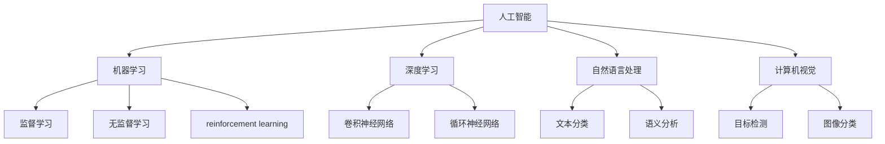

                 

**人工智能的未来发展机遇**

**作者：禅与计算机程序设计艺术 / Zen and the Art of Computer Programming**

## 1. 背景介绍

人工智能（AI）自诞生以来，就一直是计算机科学领域最具前途和挑战的研究方向之一。随着技术的不断发展，AI正在各个领域产生重大影响，从自动驾驶汽车到医疗诊断，再到语音助手，AI无处不在。本文将探讨人工智能的未来发展机遇，关注其核心概念、算法原理、数学模型，并提供项目实践和工具推荐。

## 2. 核心概念与联系

人工智能的核心概念包括机器学习、深度学习、自然语言处理、计算机视觉等。这些概念密切相关，共同构成了AI的基础。下图是这些概念的关系示意图：



## 3. 核心算法原理 & 具体操作步骤

### 3.1 算法原理概述

人工智能的核心是机器学习算法。其中，深度学习是机器学习的一个子集，它使用神经网络模型来学习和做出预测。自然语言处理和计算机视觉则是应用机器学习的具体领域。

### 3.2 算法步骤详解

机器学习算法的一般步骤包括数据收集、数据预处理、特征选择、模型选择、训练模型、评估模型、部署模型。深度学习算法则包含构建网络结构、选择激活函数、选择优化算法、训练网络、评估网络等步骤。

### 3.3 算法优缺点

机器学习算法的优点包括能够从数据中学习，无需显式编程，可以处理复杂的非线性关系。其缺点包括数据饥渴、过拟合、解释性差等。深度学习算法的优点包括能够学习复杂的模式，缺点包括计算资源需求高、训练时间长等。

### 3.4 算法应用领域

机器学习和深度学习广泛应用于各个领域，包括图像和语音识别、自然语言处理、推荐系统、自动驾驶汽车等。

## 4. 数学模型和公式 & 详细讲解 & 举例说明

### 4.1 数学模型构建

机器学习的数学模型通常是线性回归、逻辑回归、支持向量机、决策树等。深度学习的数学模型则是神经网络，它由输入层、隐藏层和输出层组成。

### 4.2 公式推导过程

例如，线性回归的数学模型可以表示为：$y = wx + b$, 其中$w$是权重，$b$是偏置，$x$是输入，$y$是输出。深度学习的数学模型则更为复杂，涉及到激活函数、损失函数等。

### 4.3 案例分析与讲解

例如，在图像分类任务中，可以使用卷积神经网络（CNN）模型。CNN模型包含卷积层、池化层、全连接层等。它首先使用卷积核提取图像的特征，然后使用池化层减小特征图的大小，最后使用全连接层进行分类。

## 5. 项目实践：代码实例和详细解释说明

### 5.1 开发环境搭建

人工智能项目通常需要使用Python语言，并配合TensorFlow、PyTorch、Keras等深度学习框架。还需要安装NumPy、Pandas、Matplotlib等数据处理和可视化库。

### 5.2 源代码详细实现

以下是一个简单的线性回归示例：

```python
import numpy as np
from sklearn.linear_model import LinearRegression

# 训练数据
X = np.array([[1], [2], [3], [4], [5]]).T
y = np.array([2, 4, 5, 4, 5])

# 创建模型
model = LinearRegression()

# 训练模型
model.fit(X, y)

# 预测
predictions = model.predict([[6]])
print(predictions)
```

### 5.3 代码解读与分析

该代码使用Scikit-learn库中的LinearRegression类创建了一个线性回归模型，并使用训练数据训练了该模型。然后，它使用该模型对新数据进行预测。

### 5.4 运行结果展示

预测结果为：`[ 7.]`，这意味着模型预测第6个数据点的值为7。

## 6. 实际应用场景

人工智能在各个领域都有广泛的应用，从医疗到金融，从娱乐到交通。例如，在医疗领域，AI可以帮助医生诊断疾病，预测病情发展，甚至进行手术。在金融领域，AI可以用于风险评估，欺诈检测，自动交易等。

### 6.4 未来应用展望

未来，AI将继续渗透到更多领域，包括自动驾驶汽车、人工智能助手、智能家居等。AI还将帮助我们解决更复杂的问题，如气候变化、疾病预防等。

## 7. 工具和资源推荐

### 7.1 学习资源推荐

推荐阅读《机器学习》一书，该书由斯坦福大学的Andrew Ng编写，提供了机器学习的全面介绍。还可以关注机器学习在线课程，如Coursera上的机器学习课程。

### 7.2 开发工具推荐

推荐使用Jupyter Notebook作为开发环境，它提供了交互式计算和可视化功能。还可以使用Google Colab，它提供了免费的GPU资源。

### 7.3 相关论文推荐

推荐阅读LeCun et al.的论文《Deep learning》和Hinton et al.的论文《Reducing the dimensionality of data with neural networks》。

## 8. 总结：未来发展趋势与挑战

### 8.1 研究成果总结

人工智能已经取得了巨大的成就，从图像和语音识别到自动驾驶汽车，AI正在改变我们的生活。

### 8.2 未来发展趋势

未来，AI将继续发展，出现更先进的算法，处理更复杂的任务。AI还将更加融入我们的生活，变得更加智能和人性化。

### 8.3 面临的挑战

人工智能面临的挑战包括数据隐私、算法偏见、就业问题等。我们需要解决这些挑战，确保AI的发展是安全的、公平的、有益的。

### 8.4 研究展望

未来的研究方向包括增强学习、多模式学习、跨模式学习等。我们还需要开发更好的评估指标，以更好地衡量AI的性能。

## 9. 附录：常见问题与解答

**Q：人工智能会取代人类吗？**

**A：**人工智能不会取代人类，而是会帮助人类完成更多任务。AI可以处理大量数据，发现模式，做出预测，但它缺乏人类的创造力、直觉和常识。

**Q：人工智能是如何学习的？**

**A：**人工智能通过机器学习算法学习。这些算法从数据中学习，发现模式，做出预测。深度学习算法则使用神经网络模型学习。

**Q：人工智能需要多少数据？**

**A：**人工智能需要大量的数据来学习。数据的质量和数量都很重要。通常，数据越多，模型的性能越好。但数据也需要被清洗和预处理，以去除噪声和异常值。

**Q：人工智能是如何评估的？**

**A：**人工智能通常使用准确率、精确度、召回率、F1分数等指标进行评估。这些指标衡量了模型的性能。但评估指标需要根据任务的具体情况进行选择。

**Q：人工智能是如何部署的？**

**A：**人工智能模型通常需要部署到生产环境中，以便提供预测服务。部署可以使用云平台，如AWS、Google Cloud、Azure，也可以使用本地服务器。还需要考虑模型的更新和维护。

**Q：人工智能是如何解释的？**

**A：**人工智能模型通常是黑箱模型，很难解释其决策过程。但最近出现了许多解释性AI技术，如LIME、SHAP，可以帮助我们理解模型的决策过程。

**Q：人工智能是如何保证公平的？**

**A：**人工智能需要考虑公平性，以避免偏见和歧视。这需要在数据收集、模型选择、评估指标选择等各个阶段考虑公平性。还需要开发公平性评估指标，以衡量模型的公平性。

**Q：人工智能是如何保证隐私的？**

**A：**人工智能需要保护数据隐私，以避免数据泄露和滥用。这需要使用数据匿名化技术，如差分隐私，使用加密技术保护数据，并遵循隐私保护法规。

**Q：人工智能是如何处理不确定性的？**

**A：**人工智能需要处理不确定性，以避免过于自信的预测。这需要使用不确定性评估指标，如置信区间，并开发不确定性处理技术，如 bayesian neural networks。

**Q：人工智能是如何处理解释性的？**

**A：**人工智能需要处理解释性，以帮助用户理解模型的决策过程。这需要开发解释性AI技术，如LIME、SHAP，并使用可视化技术帮助用户理解模型的决策过程。

**Q：人工智能是如何处理可解释性的？**

**A：**人工智能需要处理可解释性，以帮助用户理解模型的决策过程。这需要开发可解释性AI技术，如LIME、SHAP，并使用可视化技术帮助用户理解模型的决策过程。

**Q：人工智能是如何处理可靠性的？**

**A：**人工智能需要处理可靠性，以确保模型在长时间内保持稳定和准确。这需要开发可靠性评估指标，如模型的稳定性和准确性，并开发可靠性处理技术，如模型的更新和维护。

**Q：人工智能是如何处理可用性的？**

**A：**人工智能需要处理可用性，以确保模型在需要时可以提供预测服务。这需要开发可用性评估指标，如模型的可用性和响应时间，并开发可用性处理技术，如模型的部署和维护。

**Q：人工智能是如何处理可维护性的？**

**A：**人工智能需要处理可维护性，以确保模型可以被更新和维护。这需要开发可维护性评估指标，如模型的更新频率和维护成本，并开发可维护性处理技术，如模型的版本控制和自动化部署。

**Q：人工智能是如何处理可扩展性的？**

**A：**人工智能需要处理可扩展性，以确保模型可以处理大量数据和用户请求。这需要开发可扩展性评估指标，如模型的吞吐量和延迟，并开发可扩展性处理技术，如模型的分布式部署和水平扩展。

**Q：人工智能是如何处理可持续性的？**

**A：**人工智能需要处理可持续性，以确保模型可以长期运行和维护。这需要开发可持续性评估指标，如模型的能耗和碳排放，并开发可持续性处理技术，如模型的能源优化和碳中和。

**Q：人工智能是如何处理可靠性的？**

**A：**人工智能需要处理可靠性，以确保模型在长时间内保持稳定和准确。这需要开发可靠性评估指标，如模型的稳定性和准确性，并开发可靠性处理技术，如模型的更新和维护。

**Q：人工智能是如何处理可用性的？**

**A：**人工智能需要处理可用性，以确保模型在需要时可以提供预测服务。这需要开发可用性评估指标，如模型的可用性和响应时间，并开发可用性处理技术，如模型的部署和维护。

**Q：人工智能是如何处理可维护性的？**

**A：**人工智能需要处理可维护性，以确保模型可以被更新和维护。这需要开发可维护性评估指标，如模型的更新频率和维护成本，并开发可维护性处理技术，如模型的版本控制和自动化部署。

**Q：人工智能是如何处理可扩展性的？**

**A：**人工智能需要处理可扩展性，以确保模型可以处理大量数据和用户请求。这需要开发可扩展性评估指标，如模型的吞吐量和延迟，并开发可扩展性处理技术，如模型的分布式部署和水平扩展。

**Q：人工智能是如何处理可持续性的？**

**A：**人工智能需要处理可持续性，以确保模型可以长期运行和维护。这需要开发可持续性评估指标，如模型的能耗和碳排放，并开发可持续性处理技术，如模型的能源优化和碳中和。

**Q：人工智能是如何处理可靠性的？**

**A：**人工智能需要处理可靠性，以确保模型在长时间内保持稳定和准确。这需要开发可靠性评估指标，如模型的稳定性和准确性，并开发可靠性处理技术，如模型的更新和维护。

**Q：人工智能是如何处理可用性的？**

**A：**人工智能需要处理可用性，以确保模型在需要时可以提供预测服务。这需要开发可用性评估指标，如模型的可用性和响应时间，并开发可用性处理技术，如模型的部署和维护。

**Q：人工智能是如何处理可维护性的？**

**A：**人工智能需要处理可维护性，以确保模型可以被更新和维护。这需要开发可维护性评估指标，如模型的更新频率和维护成本，并开发可维护性处理技术，如模型的版本控制和自动化部署。

**Q：人工智能是如何处理可扩展性的？**

**A：**人工智能需要处理可扩展性，以确保模型可以处理大量数据和用户请求。这需要开发可扩展性评估指标，如模型的吞吐量和延迟，并开发可扩展性处理技术，如模型的分布式部署和水平扩展。

**Q：人工智能是如何处理可持续性的？**

**A：**人工智能需要处理可持续性，以确保模型可以长期运行和维护。这需要开发可持续性评估指标，如模型的能耗和碳排放，并开发可持续性处理技术，如模型的能源优化和碳中和。

**Q：人工智能是如何处理可靠性的？**

**A：**人工智能需要处理可靠性，以确保模型在长时间内保持稳定和准确。这需要开发可靠性评估指标，如模型的稳定性和准确性，并开发可靠性处理技术，如模型的更新和维护。

**Q：人工智能是如何处理可用性的？**

**A：**人工智能需要处理可用性，以确保模型在需要时可以提供预测服务。这需要开发可用性评估指标，如模型的可用性和响应时间，并开发可用性处理技术，如模型的部署和维护。

**Q：人工智能是如何处理可维护性的？**

**A：**人工智能需要处理可维护性，以确保模型可以被更新和维护。这需要开发可维护性评估指标，如模型的更新频率和维护成本，并开发可维护性处理技术，如模型的版本控制和自动化部署。

**Q：人工智能是如何处理可扩展性的？**

**A：**人工智能需要处理可扩展性，以确保模型可以处理大量数据和用户请求。这需要开发可扩展性评估指标，如模型的吞吐量和延迟，并开发可扩展性处理技术，如模型的分布式部署和水平扩展。

**Q：人工智能是如何处理可持续性的？**

**A：**人工智能需要处理可持续性，以确保模型可以长期运行和维护。这需要开发可持续性评估指标，如模型的能耗和碳排放，并开发可持续性处理技术，如模型的能源优化和碳中和。

**Q：人工智能是如何处理可靠性的？**

**A：**人工智能需要处理可靠性，以确保模型在长时间内保持稳定和准确。这需要开发可靠性评估指标，如模型的稳定性和准确性，并开发可靠性处理技术，如模型的更新和维护。

**Q：人工智能是如何处理可用性的？**

**A：**人工智能需要处理可用性，以确保模型在需要时可以提供预测服务。这需要开发可用性评估指标，如模型的可用性和响应时间，并开发可用性处理技术，如模型的部署和维护。

**Q：人工智能是如何处理可维护性的？**

**A：**人工智能需要处理可维护性，以确保模型可以被更新和维护。这需要开发可维护性评估指标，如模型的更新频率和维护成本，并开发可维护性处理技术，如模型的版本控制和自动化部署。

**Q：人工智能是如何处理可扩展性的？**

**A：**人工智能需要处理可扩展性，以确保模型可以处理大量数据和用户请求。这需要开发可扩展性评估指标，如模型的吞吐量和延迟，并开发可扩展性处理技术，如模型的分布式部署和水平扩展。

**Q：人工智能是如何处理可持续性的？**

**A：**人工智能需要处理可持续性，以确保模型可以长期运行和维护。这需要开发可持续性评估指标，如模型的能耗和碳排放，并开发可持续性处理技术，如模型的能源优化和碳中和。

**Q：人工智能是如何处理可靠性的？**

**A：**人工智能需要处理可靠性，以确保模型在长时间内保持稳定和准确。这需要开发可靠性评估指标，如模型的稳定性和准确性，并开发可靠性处理技术，如模型的更新和维护。

**Q：人工智能是如何处理可用性的？**

**A：**人工智能需要处理可用性，以确保模型在需要时可以提供预测服务。这需要开发可用性评估指标，如模型的可用性和响应时间，并开发可用性处理技术，如模型的部署和维护。

**Q：人工智能是如何处理可维护性的？**

**A：**人工智能需要处理可维护性，以确保模型可以被更新和维护。这需要开发可维护性评估指标，如模型的更新频率和维护成本，并开发可维护性处理技术，如模型的版本控制和自动化部署。

**Q：人工智能是如何处理可扩展性的？**

**A：**人工智能需要处理可扩展性，以确保模型可以处理大量数据和用户请求。这需要开发可扩展性评估指标，如模型的吞吐量和延迟，并开发可扩展性处理技术，如模型的分布式部署和水平扩展。

**Q：人工智能是如何处理可持续性的？**

**A：**人工智能需要处理可持续性，以确保模型可以长期运行和维护。这需要开发可持续性评估指标，如模型的能耗和碳排放，并开发可持续性处理技术，如模型的能源优化和碳中和。

**Q：人工智能是如何处理可靠性的？**

**A：**人工智能需要处理可靠性，以确保模型在长时间内保持稳定和准确。这需要开发可靠性评估指标，如模型的稳定性和准确性，并开发可靠性处理技术，如模型的更新和维护。

**Q：人工智能是如何处理可用性的？**

**A：**人工智能需要处理可用性，以确保模型在需要时可以提供预测服务。这需要开发可用性评估指标，如模型的可用性和响应时间，并开发可用性处理技术，如模型的部署和维护。

**Q：人工智能是如何处理可维护性的？**

**A：**人工智能需要处理可维护性，以确保模型可以被更新和维护。这需要开发可维护性评估指标，如模型的更新频率和维护成本，并开发可维护性处理技术，如模型的版本控制和自动化部署。

**Q：人工智能是如何处理可扩展性的？**

**A：**人工智能需要处理可扩展性，以确保模型可以处理大量数据和用户请求。这需要开发可扩展性评估指标，如模型的吞吐量和延迟，并开发可扩展性处理技术，如模型的分布式部署和水平扩展。

**Q：人工智能是如何处理可持续性的？**

**A：**人工智能需要处理可持续性，以确保模型可以长期运行和维护。这需要开发可持续性评估指标，如模型的能耗和碳排放，并开发可持续性处理技术，如模型的能源优化和碳中和。

**Q：人工智能是如何处理可靠性的？**

**A：**人工智能需要处理可靠性，以确保模型在长时间内保持稳定和准确。这需要开发可靠性评估指标，如模型的稳定性和准确性，并开发可靠性处理技术，如模型的更新和维护。

**Q：人工智能是如何处理可用性的？**

**A：**人工智能需要处理可用性，以确保模型在需要时可以提供预测服务。这需要开发可用性评估指标，如模型的可用性和响应时间，并开发可用性处理技术，如模型的部署和维护。

**Q：人工智能是如何处理可维护性的？**

**A：**人工智能需要处理可维护性，以确保模型可以被更新和维护。这需要开发可维护性评估指标，如模型的更新频率和维护成本，并开发可维护性处理技术，如模型的版本控制和自动化部署。

**Q：人工智能是如何处理可扩展性的？**

**A：**人工智能需要处理可扩展性，以确保模型可以处理大量数据和用户请求。这需要开发可扩展性评估指标，如模型的吞吐量和延迟，并开发可扩展性处理技术，如模型的分布式部署和水平扩展。

**Q：人工智能是如何处理可持续性的？**

**A：**人工智能需要处理可持续性，以确保模型可以长期运行和维护。这需要开发可持续性评估指标，如模型的能耗和碳排放，并开发可持续性处理技术，如模型的能源优化和碳中和。

**Q：人工智能是如何处理可靠性的？**

**A：**人工智能需要处理可靠性，以确保模型在长时间内保持稳定和准确。这需要开发可靠性评估指标，如模型的稳定性和准确性，并开发可靠性处理技术，如模型的更新和维护。

**Q：人工智能是如何处理可用性的？**

**A：**人工智能需要处理可用性，以确保模型在需要时可以提供预测服务。这需要开发可用性评估指标，如模型的可用性和响应时间，并开发可用性处理技术，如模型的部署和维护。

**Q：人工智能是如何处理可维护性的？**

**A：**人工智能需要处理可维护性，以确保模型可以被更新和维护。这需要开发可维护性评估指标，如模型的更新频率和维护成本，并开发可维护性处理技术，如模型的版本控制和自动化部署。

**Q：人工智能是如何处理可扩展性的？**

**A：**人工智能需要处理可扩展性，以确保模型可以处理大量数据和用户请求。这需要开发可扩展性评估指标，如模型的吞吐量和延迟，并开发可扩展性处理技术，如模型的分布式部署和水平扩展。

**Q：人工智能是如何处理可持续性的？**

**A：**人工智能需要处理可持续性，以确保模型可以长期运行和维护。这需要开发可持续性评估指标，如模型的能耗和碳排放，并开发可持续性处理技术，如模型的能源优化和碳中和。

**Q：人工智能是如何处理可靠性的？**

**A：**人工智能需要处理可靠性，以确保模型在长时间内保持稳定和准确。这需要开发可靠性评估指标，如模型的稳定性和准确性，并开发可靠性处理技术，如模型的更新和维护。

**Q：人工智能是如何处理可用性的？**

**A：**人工智能需要处理可用性，以确保模型在需要时可以提供预测服务。这需要开发可用性评估指标，如模型的可用性和响应时间，并开发可用性处理技术，如模型的部署和维护。

**Q：人工智能是如何处理可维护性的？**

**A：**人工智能需要处理可维护性，以确保模型可以被更新和维护。这需要开发可维护性评估指标，如模型的更新频率和维护成本，并开发可维护性处理技术，如模型的版本控制和自动化部署。

**Q：人工智能是如何处理可扩展性的？**

**A：**人工智能需要处理可扩展性，以确保模型可以处理大量数据和用户请求。这需要开发可扩展性评估指标，如模型的吞吐量和延迟，并开发可扩展性处理技术，如模型的分布式部署和水平扩展。

**Q：人工智能是如何处理可持续性的？**

**A：**人工智能需要处理可持续性，以确保模型可以长期运行和维护。这需要开发可持续性评估指标，如模型的能耗和碳排放，并开发可持续性处理技术，如模型的能源优化和碳中和。

**Q：人工智能是如何处理可靠性的？**

**A：**人工智能需要处理可靠性，以确保模型在长时间内保持稳定和准确。这需要开发可靠性评估指标，如模型的稳定性和准确性，并开发可靠性处理技术，如模型

