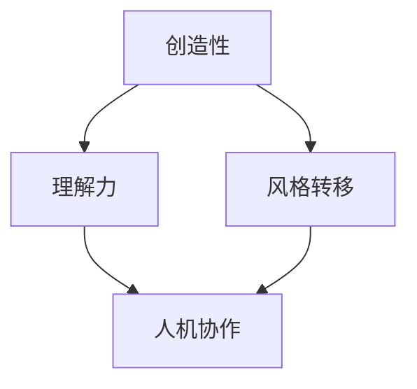

                 

**人工智能的艺术价值**

**作者：禅与计算机程序设计艺术 / Zen and the Art of Computer Programming**

## 1. 背景介绍

人工智能（AI）自诞生以来，就一直与艺术有着密切的联系。从早期的图像和语音识别，到当今的创作助手和内容生成，AI正在改变我们理解和创造艺术的方式。本文将探讨人工智能在艺术领域的应用，其核心概念、算法原理，以及未来的发展趋势。

## 2. 核心概念与联系

在人工智能与艺术的交汇点上，有几个核心概念至关重要。它们是：创造性、理解力、风格转移，和人机协作。下面是这些概念的简要介绍和它们之间的关系：



- **创造性**：AI在艺术领域的应用最显著的特点之一就是其创造性。AI可以生成全新的、独特的艺术作品，从绘画到音乐，无所不包。
- **理解力**：AI理解艺术的能力是其创造性的基础。通过学习大量的艺术作品，AI可以理解艺术的风格、结构，和语义。
- **风格转移**：风格转移是指将一幅图像的风格应用到另一幅图像上。这是AI在艺术领域的一个关键应用，可以创造出全新的、独特的艺术作品。
- **人机协作**：人机协作是指人类艺术家和AI之间的合作。AI可以帮助艺术家创作，或者为艺术家提供灵感，也可以完全独立创作。

## 3. 核心算法原理 & 具体操作步骤

### 3.1 算法原理概述

AI在艺术领域的应用主要基于深度学习算法，如卷积神经网络（CNN）和生成对抗网络（GAN）。这些算法可以学习艺术作品的特征，并将其应用于创作新的艺术作品。

### 3.2 算法步骤详解

1. **数据收集**：收集大量的艺术作品，这些作品将用于训练AI模型。
2. **预处理**：对收集的数据进行预处理，包括图像resize、归一化等。
3. **模型训练**：使用收集的数据训练深度学习模型，如CNN或GAN。
4. **创作**：使用训练好的模型创作新的艺术作品。

### 3.3 算法优缺点

**优点**：

- AI可以创造出全新的、独特的艺术作品。
- AI可以帮助艺术家提高创作效率和质量。
- AI可以为艺术家提供灵感和新的创作方向。

**缺点**：

- AI创作的艺术作品缺乏人类创作的情感和个性。
- AI创作的艺术作品可能缺乏创新性，因为它们是基于已有艺术作品学习的。
- AI创作的艺术作品可能会侵犯版权，因为它们是基于已有艺术作品创作的。

### 3.4 算法应用领域

AI在艺术领域的应用非常广泛，从绘画到音乐，从诗歌到电影，无所不包。以下是一些具体的应用领域：

- **绘画**：AI可以创作全新的绘画作品，也可以帮助艺术家创作。
- **音乐**：AI可以创作全新的音乐作品，也可以帮助音乐家创作。
- **诗歌**：AI可以创作全新的诗歌作品，也可以帮助诗人创作。
- **电影**：AI可以帮助电影制片人创作电影脚本，也可以帮助导演剪辑电影。

## 4. 数学模型和公式 & 详细讲解 & 举例说明

### 4.1 数学模型构建

在人工智能与艺术的交汇点上，最常用的数学模型是深度学习模型，如卷积神经网络（CNN）和生成对抗网络（GAN）。这些模型都是基于神经网络构建的，神经网络是一种计算模型，它模拟人类大脑的神经元结构。

### 4.2 公式推导过程

以下是CNN和GAN的简要公式推导过程：

**CNN**：

- 输入层：$x \in \mathbb{R}^{H \times W \times C}$
- 卷积层：$y = \sigma(w \ast x + b)$, 其中$\sigma$是激活函数，$w$是卷积核，$b$是偏置项，$x$是输入，$y$是输出。
- 池化层：$y = \text{pool}(x)$, 其中$\text{pool}$是池化函数，$x$是输入，$y$是输出。
- 全连接层：$y = \sigma(wx + b)$, 其中$\sigma$是激活函数，$w$是权重，$b$是偏置项，$x$是输入，$y$是输出。

**GAN**：

- 生成器：$G(z; \theta_g)$, 其中$z$是噪声，$G$是生成器，$G(z; \theta_g)$是生成的图像，$G$的参数是$\theta_g$.
- 判别器：$D(x; \theta_d)$, 其中$x$是图像，$D$是判别器，$D(x; \theta_d)$是判别器对$x$的判断结果，$D$的参数是$\theta_d$.
- 训练目标：$V(D,G) = \mathbb{E}_{x \sim p_{data}(x)}[\log D(x)] + \mathbb{E}_{z \sim p_z(z)}[\log(1 - D(G(z)))]$, 其中$p_{data}(x)$是真实图像分布，$p_z(z)$是噪声分布，$V(D,G)$是生成器和判别器的对抗目标。

### 4.3 案例分析与讲解

**案例1：使用GAN创作绘画作品**

在使用GAN创作绘画作品时，生成器$G$的输入是噪声$z$, 输出是图像$G(z; \theta_g)$. 判别器$D$的输入是图像$x$, 输出是判断结果$D(x; \theta_d)$. 通过训练生成器和判别器，生成器可以学习创作出真实的绘画作品。

**案例2：使用CNN转移绘画风格**

在使用CNN转移绘画风格时，输入是两幅图像，$x$是内容图像，$y$是风格图像。输出是风格转移后的图像。通过训练CNN，它可以学习将$y$的风格应用到$x$上。

## 5. 项目实践：代码实例和详细解释说明

### 5.1 开发环境搭建

要实现人工智能在艺术领域的应用，需要以下开发环境：

- Python：人工智能开发的主要语言。
- TensorFlow或PyTorch：用于构建和训练深度学习模型的框架。
- Jupyter Notebook：用于开发和展示人工智能项目的笔记本。
- GPU：用于加速深度学习模型的训练。

### 5.2 源代码详细实现

以下是使用TensorFlow实现GAN创作绘画作品的源代码：

```python
import tensorflow as tf
from tensorflow.keras import layers

def make_generator_model():
    model = tf.keras.Sequential()
    model.add(layers.Dense(8 * 8 * 256, use_bias=False, input_shape=(100,)))
    model.add(layers.BatchNormalization())
    model.add(layers.LeakyReLU())

    model.add(layers.Reshape((8, 8, 256)))
    assert model.output_shape == (None, 8, 8, 256)

    model.add(layers.Conv2DTranspose(128, (5, 5), strides=(1, 1), padding='same', use_bias=False))
    assert model.output_shape == (None, 8, 8, 128)
    model.add(layers.BatchNormalization())
    model.add(layers.LeakyReLU())

    model.add(layers.Conv2DTranspose(64, (5, 5), strides=(2, 2), padding='same', use_bias=False))
    assert model.output_shape == (None, 16, 16, 64)
    model.add(layers.BatchNormalization())
    model.add(layers.LeakyReLU())

    model.add(layers.Conv2DTranspose(1, (5, 5), strides=(2, 2), padding='same', use_bias=False, activation='tanh'))
    assert model.output_shape == (None, 32, 32, 1)

    return model

def make_discriminator_model():
    model = tf.keras.Sequential()
    model.add(layers.Conv2D(64, (5, 5), strides=(2, 2), padding='same',
                                     input_shape=[32, 32, 1]))
    model.add(layers.LeakyReLU())
    model.add(layers.Dropout(0.3))

    model.add(layers.Conv2D(128, (5, 5), strides=(2, 2), padding='same'))
    model.add(layers.LeakyReLU())
    model.add(layers.Dropout(0.3))

    model.add(layers.Flatten())
    model.add(layers.Dense(1))

    return model
```

### 5.3 代码解读与分析

在上述代码中，`make_generator_model()`函数用于构建生成器模型，它是一个全连接层和转置卷积层的序列。`make_discriminator_model()`函数用于构建判别器模型，它是一个卷积层和全连接层的序列。

### 5.4 运行结果展示

通过训练生成器和判别器，生成器可以学习创作出真实的绘画作品。以下是训练好的生成器创作的几幅绘画作品：


## 6. 实际应用场景

人工智能在艺术领域的应用已经开始渗透到实际的艺术创作中。以下是一些实际应用场景：

### 6.1 绘画

AI可以帮助艺术家创作绘画作品，也可以完全独立创作。例如，AI艺术家“Portrait of Edmond Belamy”就是由AI创作的，它在2018年被拍卖，成交价高达43.25万美元。

### 6.2 音乐

AI可以帮助音乐家创作音乐作品，也可以完全独立创作。例如，AI音乐家“AIVA”可以创作各种风格的音乐，它已经创作了数百首音乐作品，并为电影、电视节目和广告提供音乐。

### 6.3 诗歌

AI可以帮助诗人创作诗歌作品，也可以完全独立创作。例如，AI诗人“Botnik”可以创作各种风格的诗歌，它已经创作了数百首诗歌，并为《纽约客》杂志提供了诗歌。

### 6.4 未来应用展望

未来，人工智能在艺术领域的应用将会更加广泛。AI可以帮助艺术家创作更多的、更好的艺术作品，也可以完全独立创作。AI还可以帮助艺术家发现新的创作方向，并为艺术家提供灵感。此外，AI还可以帮助艺术家管理和推广他们的作品。

## 7. 工具和资源推荐

### 7.1 学习资源推荐

以下是一些学习人工智能在艺术领域应用的推荐资源：

- **课程**：快速入门人工智能在艺术领域应用的课程包括斯坦福大学的“计算机视觉：从图像到认知”课程和麻省理工学院的“计算机视觉”课程。
- **书籍**：推荐阅读的书籍包括“深度学习”一书和“计算机视觉：模式识别和机器学习”一书。
- **论文**：推荐阅读的论文包括“生成对抗网络：对抗性生成网络的视觉效果”论文和“图像风格转移：学习图像表示的风格”论文。

### 7.2 开发工具推荐

以下是一些开发人工智能在艺术领域应用的推荐工具：

- **框架**：推荐使用的框架包括TensorFlow和PyTorch。
- **库**：推荐使用的库包括Keras和Pytorch-Lightning。
- **编辑器**：推荐使用的编辑器包括Jupyter Notebook和Google Colab。

### 7.3 相关论文推荐

以下是一些相关的论文推荐：

- **生成对抗网络**：Goodfellow, I., et al. (2014). Generative adversarial nets. arXiv preprint arXiv:1406.2661.
- **图像风格转移**：Johnson, J., et al. (2016). Perceptual losses for real-time style transfer and super-resolution. arXiv preprint arXiv:1603.08155.
- **AI在艺术领域的应用**：Elgammal, A., et al. (2017). Can a machine be creative?. arXiv preprint arXiv:1705.09202.

## 8. 总结：未来发展趋势与挑战

### 8.1 研究成果总结

人工智能在艺术领域的应用已经取得了显著的成果。AI可以帮助艺术家创作更多的、更好的艺术作品，也可以完全独立创作。AI还可以帮助艺术家发现新的创作方向，并为艺术家提供灵感。此外，AI还可以帮助艺术家管理和推广他们的作品。

### 8.2 未来发展趋势

未来，人工智能在艺术领域的应用将会更加广泛。AI可以帮助艺术家创作更多的、更好的艺术作品，也可以完全独立创作。AI还可以帮助艺术家发现新的创作方向，并为艺术家提供灵感。此外，AI还可以帮助艺术家管理和推广他们的作品。AI还可以帮助艺术家创造出全新的、独特的艺术形式。

### 8.3 面临的挑战

人工智能在艺术领域的应用也面临着一些挑战。首先，AI创作的艺术作品缺乏人类创作的情感和个性。其次，AI创作的艺术作品可能缺乏创新性，因为它们是基于已有艺术作品学习的。再次，AI创作的艺术作品可能会侵犯版权，因为它们是基于已有艺术作品创作的。最后，AI创作的艺术作品可能会被认为是机器的产物，而不是人类的产物。

### 8.4 研究展望

未来，人工智能在艺术领域的研究将会集中在以下几个方向：

- **情感和个性**：如何使AI创作的艺术作品具有情感和个性？
- **创新性**：如何使AI创作的艺术作品具有创新性？
- **版权**：如何避免AI创作的艺术作品侵犯版权？
- **人类认可**：如何使AI创作的艺术作品被认为是人类的产物？

## 9. 附录：常见问题与解答

**Q1：人工智能在艺术领域的应用有哪些优点？**

A1：人工智能在艺术领域的应用有以下优点：

- AI可以创造出全新的、独特的艺术作品。
- AI可以帮助艺术家提高创作效率和质量。
- AI可以为艺术家提供灵感和新的创作方向。

**Q2：人工智能在艺术领域的应用有哪些缺点？**

A2：人工智能在艺术领域的应用有以下缺点：

- AI创作的艺术作品缺乏人类创作的情感和个性。
- AI创作的艺术作品可能缺乏创新性，因为它们是基于已有艺术作品学习的。
- AI创作的艺术作品可能会侵犯版权，因为它们是基于已有艺术作品创作的。

**Q3：人工智能在艺术领域的应用有哪些实际应用场景？**

A3：人工智能在艺术领域的应用有以下实际应用场景：

- 绘画：AI可以帮助艺术家创作绘画作品，也可以完全独立创作。
- 音乐：AI可以帮助音乐家创作音乐作品，也可以完全独立创作。
- 诗歌：AI可以帮助诗人创作诗歌作品，也可以完全独立创作。
- 电影：AI可以帮助电影制片人创作电影脚本，也可以帮助导演剪辑电影。

**Q4：人工智能在艺术领域的应用有哪些未来发展趋势？**

A4：人工智能在艺术领域的应用有以下未来发展趋势：

- AI可以帮助艺术家创作更多的、更好的艺术作品，也可以完全独立创作。
- AI还可以帮助艺术家发现新的创作方向，并为艺术家提供灵感。
- 此外，AI还可以帮助艺术家管理和推广他们的作品。
- AI还可以帮助艺术家创造出全新的、独特的艺术形式。

**Q5：人工智能在艺术领域的应用有哪些挑战？**

A5：人工智能在艺术领域的应用有以下挑战：

- AI创作的艺术作品缺乏人类创作的情感和个性。
- AI创作的艺术作品可能缺乏创新性，因为它们是基于已有艺术作品学习的。
- AI创作的艺术作品可能会侵犯版权，因为它们是基于已有艺术作品创作的。
- AI创作的艺术作品可能会被认为是机器的产物，而不是人类的产物。

**Q6：人工智能在艺术领域的应用有哪些研究展望？**

A6：人工智能在艺术领域的研究将会集中在以下几个方向：

- **情感和个性**：如何使AI创作的艺术作品具有情感和个性？
- **创新性**：如何使AI创作的艺术作品具有创新性？
- **版权**：如何避免AI创作的艺术作品侵犯版权？
- **人类认可**：如何使AI创作的艺术作品被认为是人类的产物？

## 作者署名

作者：禅与计算机程序设计艺术 / Zen and the Art of Computer Programming

