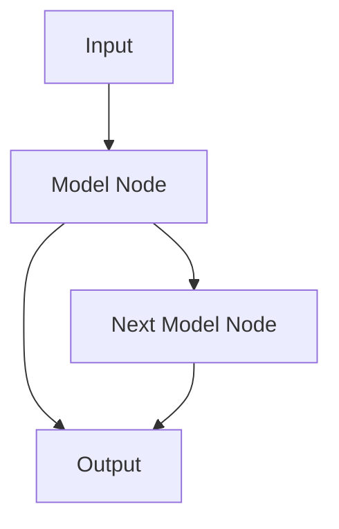

                 

**ComfyUI** 是一个开源的、面向生成式人工智能的用户界面，它允许用户通过简单的拖放操作来组合和运行各种模型。本文将深入探讨 ComfyUI 的发展方向，包括其核心概念、算法原理、数学模型、项目实践，以及未来的应用场景和挑战。

## 1. 背景介绍

ComfyUI 于 2022 年由 [comfyanonymous](https://github.com/comfyanonymous) 发布，旨在提供一个易于使用的平台，帮助用户探索和利用生成式人工智能模型。它支持各种模型，包括 Stability AI 的 Stable Diffusion、CompVis 的 Latent Diffusion、和 Autodesk 的 Canvas 等。ComfyUI 允许用户通过简单的拖放操作来组合和运行这些模型，无需编写任何代码。

## 2. 核心概念与联系

ComfyUI 的核心是其模型节点系统。用户可以将各种模型节点拖放到工作区，并通过连接它们来创建复杂的图形处理流程。下面是 ComfyUI 的核心概念原理的 Mermaid 流程图：



在 ComfyUI 中，每个模型节点都有输入和输出，用户可以通过连接这些输入和输出来创建复杂的图形处理流程。例如，用户可以将图像输入节点连接到 Stable Diffusion 模型节点，然后将模型节点的输出连接到图像输出节点，从而创建一个简单的图像生成流程。

## 3. 核心算法原理 & 具体操作步骤

### 3.1 算法原理概述

ComfyUI 的核心算法是基于生成式对抗网络 (GAN) 和扩散模型的。GAN 由生成器和判别器组成，生成器学习生成真实的数据，判别器学习区分真实数据和生成数据。扩散模型则是一种无监督学习算法，它学习数据的分布，并使用这个分布来生成新的数据。

### 3.2 算法步骤详解

在 ComfyUI 中，用户可以通过以下步骤来创建一个图像生成流程：

1. 将图像输入节点拖放到工作区。
2. 将图像输入节点的输出连接到模型节点的输入。
3. 选择要使用的模型（例如，Stable Diffusion）。
4. 设置模型的参数（例如，prompt、negative prompt、种子等）。
5. 将模型节点的输出连接到图像输出节点。
6. 运行流程。

### 3.3 算法优缺点

ComfyUI 的算法优点包括：

- 易于使用：用户无需编写任何代码即可创建复杂的图形处理流程。
- 灵活性：用户可以组合和运行各种模型，创建独特的图像生成效果。
- 可扩展性：用户可以添加自定义模型节点，扩展 ComfyUI 的功能。

其缺点包括：

- 资源消耗：生成式人工智能模型通常需要大量的计算资源。
- 学习曲线：虽然 ComfyUI 很容易使用，但用户仍需花时间学习如何创建复杂的图形处理流程。

### 3.4 算法应用领域

ComfyUI 的算法应用领域包括图像生成、图像修改、图像风格转换等。它可以用于创意设计、数字艺术、游戏开发等领域。

## 4. 数学模型和公式 & 详细讲解 & 举例说明

### 4.1 数学模型构建

ComfyUI 的数学模型基于生成式对抗网络 (GAN) 和扩散模型。GAN 的数学模型可以表示为：

$$G(z; \theta_g), D(x; \theta_d)$$

其中，$G$ 是生成器，$D$ 是判别器，$z$ 是输入噪声，$x$ 是生成的数据，$ \theta_g$ 和 $ \theta_d$ 是生成器和判别器的参数。

扩散模型的数学模型可以表示为：

$$p_\theta(x_t|x_{t-1}), q_\phi(x_{t-1}|x_t)$$

其中，$p_\theta$ 是正向扩散过程，$q_\phi$ 是反向扩散过程，$x_t$ 是时间步长为 $t$ 的数据，$ \theta$ 和 $ \phi$ 是模型的参数。

### 4.2 公式推导过程

GAN 的训练目标是最小化判别器的损失函数，并最大化生成器的损失函数。判别器的损失函数可以表示为：

$$L_D = \mathbb{E}_{x \sim p_{data}(x)}[\log D(x)] + \mathbb{E}_{z \sim p_z(z)}[\log(1 - D(G(z)))]$$

生成器的损失函数可以表示为：

$$L_G = \mathbb{E}_{z \sim p_z(z)}[\log(1 - D(G(z)))]$$

扩散模型的训练目标是最小化重构误差。重构误差可以表示为：

$$L = \mathbb{E}_{x \sim p_{data}(x), t}[\|q_\phi(x_{t-1}|x_t) - p_\theta(x_t|x_{t-1})\|_2^2]$$

### 4.3 案例分析与讲解

例如，用户想要使用 ComfyUI 创建一个简单的图像生成流程，生成一张猫的图像。用户可以将图像输入节点连接到 Stable Diffusion 模型节点，设置模型的参数（例如，prompt 为 "a cat"），然后将模型节点的输出连接到图像输出节点。运行流程后，ComfyUI 会生成一张猫的图像。

## 5. 项目实践：代码实例和详细解释说明

### 5.1 开发环境搭建

要使用 ComfyUI，用户需要安装 Python、PyTorch、和 ComfyUI 本身。用户可以使用以下命令来安装 ComfyUI：

```bash
pip install comfyui
```

### 5.2 源代码详细实现

ComfyUI 的源代码位于 [comfyanonymous/comfyui](https://github.com/comfyanonymous/comfyui) 仓库中。它使用 Python 和 PyTorch 编写，并提供了各种模型节点的实现。

### 5.3 代码解读与分析

ComfyUI 的代码结构清晰，易于理解。它的核心是 `nodes` 目录，其中包含各种模型节点的实现。每个模型节点都是一个 Python 类，它有输入和输出，并实现了 `INPUT_TYPES`、`OUTPUT_TYPES`、`CATEGORY` 等属性，以及 `PROCESS` 方法。

### 5.4 运行结果展示

用户可以通过运行以下命令来启动 ComfyUI：

```bash
comfyui
```

这将打开 ComfyUI 的用户界面，用户可以开始创建图形处理流程。

## 6. 实际应用场景

### 6.1 当前应用

ComfyUI 当前被广泛用于图像生成、图像修改、图像风格转换等领域。它已被用于创建数字艺术、游戏资产、和虚拟现实内容等。

### 6.2 未来应用展望

未来，ComfyUI 可能会被用于更多的应用领域，例如视频生成、3D 模型生成、和虚拟人生成等。它也可能会被集成到更多的应用程序中，例如设计软件、游戏引擎、和虚拟现实平台等。

## 7. 工具和资源推荐

### 7.1 学习资源推荐

- [ComfyUI 文档](https://comfyui.readthedocs.io/en/latest/)
- [Stable Diffusion 文档](https://huggingface.co/CompVis/stable-diffusion)
- [扩散模型教程](https://diffusers.readthedocs.io/en/latest/diffusion_tutorial.html)

### 7.2 开发工具推荐

- [PyTorch](https://pytorch.org/)
- [Hugging Face Transformers](https://huggingface.co/transformers/)
- [Diffusers](https://huggingface.co/CompVis/diffusers)

### 7.3 相关论文推荐

- [Stable Diffusion](https://arxiv.org/abs/2112.10752)
- [扩散模型](https://arxiv.org/abs/2006.11239)

## 8. 总结：未来发展趋势与挑战

### 8.1 研究成果总结

ComfyUI 为用户提供了一个易于使用的平台，帮助他们探索和利用生成式人工智能模型。它的核心算法基于 GAN 和扩散模型，并提供了各种模型节点的实现。

### 8.2 未来发展趋势

未来，ComfyUI 可能会被集成到更多的应用程序中，并被用于更多的应用领域。它也可能会被扩展以支持更多的模型和功能。

### 8.3 面临的挑战

ComfyUI 面临的挑战包括资源消耗、学习曲线、和模型的可靠性等。未来的工作需要关注这些挑战，并寻求解决方案。

### 8.4 研究展望

未来的研究可以关注 ComfyUI 的扩展，以支持更多的模型和功能。它也可以关注 ComfyUI 的集成，以将其与更多的应用程序连接起来。此外，未来的研究还可以关注 ComfyUI 的可靠性，以提高模型的稳定性和可预测性。

## 9. 附录：常见问题与解答

**Q：ComfyUI 与其他生成式人工智能平台有何不同？**

A：ComfyUI 与其他生成式人工智能平台的不同之处在于其模型节点系统。用户可以将各种模型节点拖放到工作区，并通过连接它们来创建复杂的图形处理流程。这使得 ComfyUI 非常灵活和易于使用。

**Q：如何在 ComfyUI 中添加自定义模型节点？**

A：用户可以通过编写 Python 代码来添加自定义模型节点。自定义模型节点需要实现 `INPUT_TYPES`、`OUTPUT_TYPES`、`CATEGORY` 等属性，以及 `PROCESS` 方法。更多信息请参阅 [ComfyUI 文档](https://comfyui.readthedocs.io/en/latest/).

**Q：ComfyUI 是否免费使用？**

A：是的，ComfyUI 是开源软件，用户可以免费使用和修改它。它的源代码位于 [comfyanonymous/comfyui](https://github.com/comfyanonymous/comfyui) 仓库中。

## 作者：禅与计算机程序设计艺术 / Zen and the Art of Computer Programming

