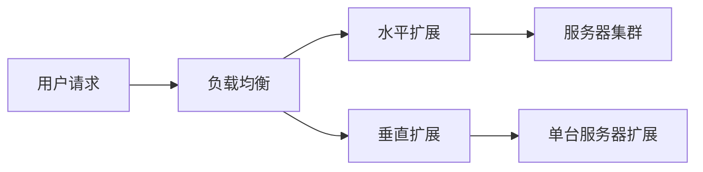

                 

## 1. 背景介绍

在互联网时代，Web应用的规模和复杂性不断增加，对系统的可扩展性和性能提出了更高的要求。如何设计出能够支撑海量用户访问、高并发请求、可靠稳定的Web架构，是当前面临的挑战。本文将从可扩展性和高性能两个维度出发，介绍Web架构设计的关键概念、原理、算法、数学模型，并结合实际项目实践和应用场景，提供详细的设计指南和工具推荐。

## 2. 核心概念与联系

### 2.1 可扩展性

可扩展性（Scalability）是指系统能够在不中断服务的情况下，扩展其资源（如服务器、带宽等）以满足更大的负载需求。Web架构的可扩展性主要体现在水平扩展（Scale Out）和垂直扩展（Scale Up）两个维度。



### 2.2 高性能

高性能（High Performance）是指系统能够在给定资源下，提供最优的响应时间和吞吐量。Web架构的高性能主要体现在缓存、压缩、异步处理等优化手段。

### 2.3 关联概念

- **并发（Concurrency）**：多个任务在同一时间段内同时执行。
- **并行（Parallelism）**：多个任务在同一时刻同时执行。
- **无状态（Stateless）**：服务器不保存任何客户端会话信息，每个请求都可以独立处理。
- **缓存（Caching）**：临时存储频繁访问的数据，减少后续访问的开销。

## 3. 核心算法原理 & 具体操作步骤

### 3.1 算法原理概述

在Web架构设计中，常用的算法包括负载均衡算法、缓存算法、压缩算法等。

### 3.2 算法步骤详解

#### 3.2.1 负载均衡算法

- **轮询（Round Robin）**：将请求轮流分发给后端服务器。
- **随机（Random）**：随机分发请求给后端服务器。
- **IP Hash（IP Hash）**：根据客户端IP地址的哈希值，将请求分发给后端服务器。
- **最小连接数（Least Connections）**：将请求分发给当前连接数最少的后端服务器。

#### 3.2.2 缓存算法

- **LRU（Least Recently Used）**：移除最久未使用的缓存项。
- **LFU（Least Frequently Used）**：移除访问次数最少的缓存项。
- **FIFO（First In First Out）**：移除最先添加的缓存项。

### 3.3 算法优缺点

- **轮询算法**：简单易实现，但可能导致某些服务器压力过大。
- **随机算法**：可以避免某些服务器压力过大，但可能导致请求分布不均。
- **IP Hash算法**：可以保证同一客户端的请求始终发往同一服务器，但可能导致服务器压力不均。
- **最小连接数算法**：可以平衡服务器压力，但可能导致请求分布不均。
- **LRU算法**：可以有效利用缓存空间，但可能导致缓存命中率下降。
- **LFU算法**：可以提高缓存命中率，但可能导致缓存空间利用率下降。
- **FIFO算法**：简单易实现，但可能导致缓存命中率和缓存空间利用率下降。

### 3.4 算法应用领域

- **负载均衡算法**：应用于Web服务器集群、数据库集群等需要分布式处理请求的场景。
- **缓存算法**：应用于Web缓存、数据库缓存等需要缓存频繁访问数据的场景。

## 4. 数学模型和公式 & 详细讲解 & 举例说明

### 4.1 数学模型构建

#### 4.1.1 并发模型

并发模型描述系统在给定时间内能够处理的请求数。常用的并发模型包括：

- **M/M/c/K**：指数分布的到达率和服务率，c台服务器，最大等待请求数为K。
- **M/G/c**：指数分布的到达率，任意分布的服务率，c台服务器。

#### 4.1.2 缓存模型

缓存模型描述缓存命中率和缓存空间利用率。常用的缓存模型包括：

- **LRU模型**：缓存空间为C，缓存命中率为H，缓存空间利用率为U。
- **LFU模型**：缓存空间为C，缓存命中率为H，缓存空间利用率为U。

### 4.2 公式推导过程

#### 4.2.1 并发模型公式推导

- **M/M/c/K**模型的请求等待时间E[W]可以推导为：

$$E[W] = \frac{\frac{\lambda}{\mu - \lambda} + \frac{c}{c - 1} + \frac{1}{c - 1} \cdot \frac{(\frac{\lambda}{\mu - \lambda})^{c}}{1 - \frac{(\frac{\lambda}{\mu - \lambda})^{c}}{K - c + 1}}}{c \cdot (\mu - \lambda)}$$

- **M/G/c**模型的请求等待时间E[W]可以推导为：

$$E[W] = \frac{1}{c \cdot (\mu - \lambda)} + \frac{\frac{c}{c - 1} \cdot \frac{1}{2} \cdot \frac{\lambda}{\mu - \lambda} \cdot Var[X]}{1 - \frac{\lambda}{\mu - \lambda}}$$

其中，Var[X]为服务时间分布的方差。

#### 4.2.2 缓存模型公式推导

- **LRU模型**的缓存命中率H可以推导为：

$$H = \frac{C}{C + \lambda \cdot E[X]}$$

其中，C为缓存空间，λ为请求到达率，E[X]为请求服务时间。

- **LFU模型**的缓存命中率H可以推导为：

$$H = \frac{C}{C + \lambda \cdot E[X] \cdot \frac{1}{f}}$$

其中，C为缓存空间，λ为请求到达率，E[X]为请求服务时间，f为请求访问频率。

### 4.3 案例分析与讲解

#### 4.3.1 并发模型案例

假设有一个Web服务器集群，到达率为100请求/秒，服务率为200请求/秒，有4台服务器，最大等待请求数为1000。使用M/M/c/K模型计算请求等待时间E[W]。

$$E[W] = \frac{\frac{100}{200 - 100} + \frac{4}{4 - 1} + \frac{1}{4 - 1} \cdot \frac{(\frac{100}{200 - 100})^{4}}{1 - \frac{(\frac{100}{200 - 100})^{4}}{1000 - 4 + 1}}}{4 \cdot (200 - 100)} \approx 0.05 秒$$

#### 4.3.2 缓存模型案例

假设有一个Web缓存，缓存空间为1GB，请求到达率为1000请求/秒，请求服务时间为0.1秒。使用LRU模型计算缓存命中率H。

$$H = \frac{1024}{1024 + 1000 \cdot 0.1} \approx 0.91$$

## 5. 项目实践：代码实例和详细解释说明

### 5.1 开发环境搭建

本项目使用Node.js和Express框架开发，需要安装Node.js和npm（Node Package Manager）环境。可以通过官方网站下载安装：<https://nodejs.org/>

### 5.2 源代码详细实现

#### 5.2.1 负载均衡示例

```javascript
const express = require('express');
const app = express();
const loadBalancer = require('express-load-balancer');

const backendServers = [
  { host: '10.0.0.1', port: 80 },
  { host: '10.0.0.2', port: 80 },
  { host: '10.0.0.3', port: 80 },
];

app.use(loadBalancer(backendServers, 'round-robin'));

app.get('/', (req, res) => {
  res.send('Hello, World!');
});

app.listen(3000, () => {
  console.log('Server listening on port 3000');
});
```

#### 5.2.2 缓存示例

```javascript
const express = require('express');
const app = express();
const NodeCache = require('node-cache');

const cache = new NodeCache({ stdTTL: 300, checkperiod: 120 });

app.get('/data/:id', (req, res) => {
  const key = req.params.id;
  const value = cache.get(key);

  if (value) {
    res.json(value);
  } else {
    // Fetch data from database or other sources
    const data = { id: key, name: 'Test' };
    cache.set(key, data);
    res.json(data);
  }
});

app.listen(3000, () => {
  console.log('Server listening on port 3000');
});
```

### 5.3 代码解读与分析

#### 5.3.1 负载均衡示例解读

本示例使用express-load-balancer中间件实现了轮询负载均衡算法。后端服务器列表定义在backendServers数组中，并传递给中间件。中间件会根据请求分发给后端服务器，并记录每台服务器的连接数。

#### 5.3.2 缓存示例解读

本示例使用node-cache库实现了LRU缓存算法。缓存实例定义在cache变量中，并设置了缓存过期时间和检查周期。当接收到GET请求时，会先检查缓存中是否存在对应的数据。如果存在，则直接返回缓存数据；否则，从数据库或其他来源获取数据，并存入缓存后返回。

### 5.4 运行结果展示

运行示例代码后，可以使用curl或Postman等工具发送请求测试结果。例如：

```bash
curl http://localhost:3000/data/1
```

如果是第一次请求，则会从数据库或其他来源获取数据，并存入缓存。如果是缓存命中，则会直接返回缓存数据。

## 6. 实际应用场景

### 6.1 Web服务器集群

在Web服务器集群中，可以使用负载均衡算法将请求分发给后端服务器，提高系统的可扩展性和可靠性。常见的负载均衡算法包括轮询、随机、IP Hash和最小连接数等。

### 6.2 CDN缓存

在内容分发网络（CDN）中，可以使用缓存算法缓存静态资源，减少后续访问的开销，提高系统的性能和可靠性。常见的缓存算法包括LRU、LFU和FIFO等。

### 6.3 数据库缓存

在数据库系统中，可以使用缓存算法缓存频繁访问的数据，减少数据库查询的开销，提高系统的性能和可靠性。常见的缓存算法包括LRU、LFU和FIFO等。

### 6.4 未来应用展望

随着互联网技术的发展，Web架构设计面临着更高的要求，需要考虑边缘计算、服务网格等新技术。未来的Web架构设计将更加注重弹性、智能化和安全性。

## 7. 工具和资源推荐

### 7.1 学习资源推荐

- **书籍**：
  - "Web架构设计：可扩展和高性能系统的构建" - 陈硕
  - "高性能Web站点" - 斯蒂夫·斯默利安
- **在线课程**：
  - Coursera - "Web应用架构设计" - 斯坦福大学
  - Udemy - "Web架构设计与优化" - 陈硕

### 7.2 开发工具推荐

- **负载均衡器**：
  - Nginx - <https://nginx.org/>
  - HAProxy - <http://www.haproxy.org/>
- **缓存系统**：
  - Redis - <https://redis.io/>
  - Memcached - <https://memcached.org/>
- **Web服务器**：
  - Apache - <https://httpd.apache.org/>
  - Nginx - <https://nginx.org/>

### 7.3 相关论文推荐

- "Scalable Internet Architectures" - 陈硕等
- "High Performance Web Sites" - 斯蒂夫·斯默利安
- "Web Caching: A Survey of Results and Open Problems" - 卡特琳·多尔

## 8. 总结：未来发展趋势与挑战

### 8.1 研究成果总结

本文介绍了Web架构设计的关键概念、原理、算法、数学模型，并结合实际项目实践和应用场景，提供了详细的设计指南和工具推荐。通过合理的设计和优化，可以构建出可扩展和高性能的Web系统。

### 8.2 未来发展趋势

未来的Web架构设计将更加注重弹性、智能化和安全性。边缘计算、服务网格等新技术将成为主流，并与传统的Web架构设计相结合，构建出更加先进的系统。

### 8.3 面临的挑战

未来的Web架构设计面临着更高的要求，需要解决的挑战包括：

- **弹性**：如何构建能够自动适应负载变化的系统？
- **智能化**：如何利用人工智能技术优化系统性能？
- **安全性**：如何保护系统免受各种安全威胁？

### 8.4 研究展望

未来的Web架构设计研究将围绕弹性、智能化和安全性展开。研究人员将探索新的算法、模型和工具，以构建更加先进的Web系统。同时，研究人员也将关注如何将这些技术应用于实际场景，构建出真正有价值的系统。

## 9. 附录：常见问题与解答

**Q1：什么是可扩展性？**

A1：可扩展性是指系统能够在不中断服务的情况下，扩展其资源以满足更大的负载需求。

**Q2：什么是高性能？**

A2：高性能是指系统能够在给定资源下，提供最优的响应时间和吞吐量。

**Q3：什么是并发？**

A3：并发是指多个任务在同一时间段内同时执行。

**Q4：什么是并行？**

A4：并行是指多个任务在同一时刻同时执行。

**Q5：什么是无状态？**

A5：无状态是指服务器不保存任何客户端会话信息，每个请求都可以独立处理。

**Q6：什么是缓存？**

A6：缓存是指临时存储频繁访问的数据，减少后续访问的开销。

**Q7：什么是负载均衡算法？**

A7：负载均衡算法是指将请求分发给后端服务器的算法，常见的算法包括轮询、随机、IP Hash和最小连接数等。

**Q8：什么是缓存算法？**

A8：缓存算法是指缓存频繁访问数据的算法，常见的算法包括LRU、LFU和FIFO等。

**Q9：什么是并发模型？**

A9：并发模型是指描述系统在给定时间内能够处理的请求数的模型，常用的模型包括M/M/c/K和M/G/c等。

**Q10：什么是缓存模型？**

A10：缓存模型是指描述缓存命中率和缓存空间利用率的模型，常用的模型包括LRU和LFU等。

## 作者：禅与计算机程序设计艺术 / Zen and the Art of Computer Programming

