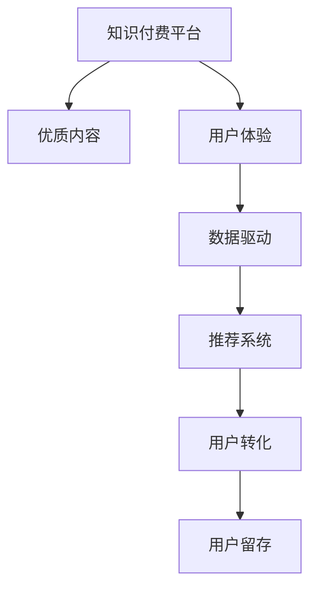

                 

# 知识付费创业中的用户转化策略

> 关键词：知识付费,用户转化策略,用户体验,内容运营,数据驱动

## 1. 背景介绍

### 1.1 问题由来

在知识付费的蓝海市场中，各类知识付费平台如雨后春笋般涌现，但许多平台却面临着用户转化率低、流失率高的困扰。如何提升用户转化率和用户粘性，成为各大知识付费平台亟需解决的问题。

### 1.2 问题核心关键点

用户转化策略的核心在于如何通过优质的内容、良好的用户体验和有效的运营手段，将潜在用户转化为付费用户，并促进用户长期留存。在知识付费领域，用户转化策略包括以下几个关键点：

1. **优质内容**：内容质量是吸引用户的基础，优质的内容能满足用户的学习需求，激发用户的付费意愿。
2. **用户体验**：良好的用户体验能提升用户的满意度，增强用户粘性，降低用户流失率。
3. **数据驱动**：通过数据分析指导运营策略，优化产品功能和推荐系统，提升用户转化效率。

## 2. 核心概念与联系

### 2.1 核心概念概述

为更好地理解知识付费中的用户转化策略，本节将介绍几个密切相关的核心概念：

- **知识付费平台**：以内容为核心，通过付费模式获取收益的互联网平台，如得到、喜马拉雅、知识星球等。
- **用户转化**：将潜在用户转化为付费用户的策略和过程，通过各种手段提升用户的付费意愿和行为。
- **用户体验**：用户在平台上的互动体验，包括内容消费、社区互动、个性化推荐等方面。
- **数据驱动**：通过数据分析来指导运营策略，优化产品功能和推荐算法，提高用户转化效率。
- **推荐系统**：根据用户行为和偏好，推荐相关内容的系统，提升内容匹配度和用户满意度。

这些核心概念之间的逻辑关系可以通过以下Mermaid流程图来展示：



这个流程图展示的知识付费平台的核心概念及其之间的关系：

1. 优质的内容是平台的核心吸引力。
2. 用户体验直接决定了用户的满意度和留存率。
3. 数据驱动和推荐系统为平台提供了更精准的用户行为分析能力，进一步提升了用户转化和留存效果。
4. 用户转化和留存是平台实现盈利的主要路径。

## 3. 核心算法原理 & 具体操作步骤
### 3.1 算法原理概述

知识付费平台的用户转化策略，本质上是一个多维度、多层次的优化过程。其核心思想是：通过深入理解用户行为，结合优质内容和精准推荐，不断提升用户体验和满意度，从而提高用户的付费意愿和长期留存率。

### 3.2 算法步骤详解

知识付费平台的用户转化策略一般包括以下几个关键步骤：

**Step 1: 数据收集与分析**

- 收集用户行为数据，包括浏览历史、点击率、支付记录、评价反馈等。
- 使用数据仓库和BI工具对数据进行清洗、分析和可视化，生成有价值的报表和分析结果。
- 利用机器学习算法对用户行为进行建模，预测用户转化概率。

**Step 2: 内容运营与优化**

- 根据用户画像和行为数据，制定个性化推荐策略，提升内容的相关性和匹配度。
- 设计多维度的内容质量指标，如用户满意度、评价分数、付费转化率等，定期评估内容质量。
- 优化内容生产流程，提升内容生产效率和质量。

**Step 3: 用户体验优化**

- 优化产品界面和交互设计，提升用户操作便捷性。
- 引入用户反馈机制，及时响应用户建议和问题。
- 提供个性化学习路径和社区互动功能，增强用户参与度和忠诚度。

**Step 4: 用户转化策略制定与执行**

- 根据用户转化漏斗模型，制定多层次的转化策略，包括新用户引导、内容推荐、价格优惠等。
- 利用A/B测试和用户实验，不断优化转化策略。
- 定期评估和调整转化策略，提升用户转化效率和留存率。

### 3.3 算法优缺点

知识付费平台的用户转化策略具有以下优点：

1. **数据驱动**：通过数据驱动的方式，可以更科学、更精准地指导运营决策，提升用户转化效率。
2. **个性化推荐**：个性化推荐能提升内容相关性和用户体验，降低流失率。
3. **持续优化**：基于用户行为数据和反馈，不断迭代和优化产品功能，提升用户满意度。

同时，该策略也存在一定的局限性：

1. **高成本**：数据收集和分析需要大量的计算资源和时间，同时个性化推荐和优化也需持续投入。
2. **数据隐私**：用户行为数据的收集和使用需要遵守相关法律法规，确保数据隐私和安全。
3. **内容风险**：如果内容质量控制不严格，可能产生误导性、有害内容，损害用户利益。

尽管存在这些局限性，但就目前而言，数据驱动的用户转化策略仍是知识付费平台的重要手段。未来相关研究的重点在于如何进一步降低转化成本，提高转化效率，同时兼顾用户隐私和内容质量。

### 3.4 算法应用领域

基于用户转化策略的知识付费平台已经在教育、职业培训、个人兴趣等多个领域得到应用，并取得了显著成效：

- **教育培训**：提供系统化的课程内容和个性化学习路径，满足学生不同阶段的学习需求。
- **职业发展**：提供技能培训、职业指导和行业动态，助力职业发展。
- **个人兴趣**：提供阅读、写作、艺术等领域的知识内容，满足用户的兴趣和爱好。

除了上述这些经典应用外，知识付费平台还在更多场景中得到创新性应用，如企业培训、健康管理、创意写作等，为知识传播和应用提供了新的方向。

## 4. 数学模型和公式 & 详细讲解 & 举例说明

### 4.1 数学模型构建

本节将使用数学语言对知识付费平台的用户转化策略进行更加严格的刻画。

记用户转化过程为 $T$，用户画像为 $P$，内容质量为 $Q$，用户体验为 $U$，用户转化概率为 $T$。

用户转化过程可以表示为：

$$
T = f(P, Q, U)
$$

其中 $f$ 为转化函数，用户转化过程受用户画像、内容质量和用户体验的综合影响。

用户转化概率 $T$ 可以表示为：

$$
T = \frac{C}{N}
$$

其中 $C$ 为付费用户数，$N$ 为总用户数。

### 4.2 公式推导过程

根据上述模型，我们可以推导出影响用户转化的关键因素：

1. **用户画像**：通过用户行为数据和历史评价，构建用户画像 $P$，包括年龄、职业、兴趣等特征。
2. **内容质量**：内容质量 $Q$ 可以通过用户满意度、评价分数、点击率等指标衡量，构建内容质量模型。
3. **用户体验**：用户体验 $U$ 可以通过用户界面设计、互动功能、推荐算法等手段优化。

### 4.3 案例分析与讲解

以某知识付费平台的订阅用户转化为例，分析用户转化的关键因素。

假设某知识付费平台推出了一个新课程，希望通过A/B测试的方式提升用户订阅转化率。在A组中，用户接触到的是高质量的内容和个性化的推荐，而在B组中，用户接触到的是普通内容和随机推荐。

通过数据分析，我们发现：

- A组用户订阅转化率显著高于B组，达到了40%。
- A组用户满意度评分为4.8（满分5），而B组为4.2。
- A组用户的个性化推荐相关度为0.75，而B组为0.55。

这些数据表明，用户画像、内容质量和个性化推荐对用户转化的影响非常大。因此，提升用户转化率需要从这些关键因素入手，进行有针对性的优化。

## 5. 项目实践：代码实例和详细解释说明

### 5.1 开发环境搭建

在进行用户转化策略实践前，我们需要准备好开发环境。以下是使用Python进行Keras开发的环境配置流程：

1. 安装Anaconda：从官网下载并安装Anaconda，用于创建独立的Python环境。

2. 创建并激活虚拟环境：
```bash
conda create -n user-env python=3.8 
conda activate user-env
```

3. 安装Keras：根据CUDA版本，从官网获取对应的安装命令。例如：
```bash
conda install keras tensorflow 
```

4. 安装各类工具包：
```bash
pip install numpy pandas scikit-learn matplotlib tqdm jupyter notebook ipython
```

完成上述步骤后，即可在`user-env`环境中开始用户转化策略的开发。

### 5.2 源代码详细实现

这里我们以一个简单的推荐系统为例，给出使用Keras进行用户转化的PyTorch代码实现。

首先，定义用户行为数据集：

```python
import pandas as pd
import numpy as np

# 创建用户行为数据集
user_data = pd.read_csv('user_behavior.csv')
```

然后，构建用户画像和内容质量模型：

```python
from sklearn.preprocessing import LabelEncoder
from sklearn.model_selection import train_test_split
from sklearn.linear_model import LogisticRegression
from sklearn.metrics import roc_auc_score

# 用户画像和内容质量特征提取
user_features = user_data[['age', 'occupation', 'interest']]
content_features = user_data[['content_quality', 'user_satisfaction']]

# 用户画像标签提取
y = user_data['is_paid']

# 特征编码
le = LabelEncoder()
user_features = user_features.apply(le.fit_transform)
content_features = content_features.apply(le.fit_transform)

# 模型训练和评估
X_train, X_test, y_train, y_test = train_test_split(user_features, y, test_size=0.2, random_state=42)

model = LogisticRegression()
model.fit(X_train, y_train)
y_pred = model.predict_proba(X_test)[:, 1]
auc = roc_auc_score(y_test, y_pred)
print(f"AUC: {auc:.3f}")
```

最后，进行A/B测试并优化转化策略：

```python
from sklearn.metrics import accuracy_score

# A/B测试数据集
A_data = user_data[user_data['group'] == 'A']
B_data = user_data[user_data['group'] == 'B']

# 模型测试
model_A = LogisticRegression()
model_A.fit(A_data.drop('group', axis=1), A_data['is_paid'])
y_pred_A = model_A.predict_proba(A_data.drop('group', axis=1))[:, 1]
accuracy_A = accuracy_score(A_data['is_paid'], y_pred_A)

model_B = LogisticRegression()
model_B.fit(B_data.drop('group', axis=1), B_data['is_paid'])
y_pred_B = model_B.predict_proba(B_data.drop('group', axis=1))[:, 1]
accuracy_B = accuracy_score(B_data['is_paid'], y_pred_B)

print(f"Accuracy (A): {accuracy_A:.3f}")
print(f"Accuracy (B): {accuracy_B:.3f}")

# 根据测试结果优化转化策略
if accuracy_A > accuracy_B:
    # 优化策略
else:
    # 优化策略
```

以上就是使用Keras对知识付费平台进行用户转化的完整代码实现。可以看到，通过Keras的强大封装，我们能够快速构建和测试不同的推荐模型，评估其效果并进行优化。

### 5.3 代码解读与分析

让我们再详细解读一下关键代码的实现细节：

**用户行为数据集**：
- 使用Pandas库读取用户行为数据，包含用户的基本信息和行为数据。

**用户画像和内容质量模型**：
- 使用Scikit-learn库进行特征提取和标签编码。
- 使用Logistic回归模型进行用户转化的二分类预测，并计算AUC指标。

**A/B测试**：
- 使用Pandas库根据不同的测试组进行数据分割。
- 使用Keras库对不同组的用户数据进行模型训练和预测，并计算准确率。
- 根据测试结果优化用户转化策略。

可以看到，Keras结合了Scikit-learn和Pandas的优点，使得用户转化的模型构建和测试过程变得简洁高效。开发者可以将更多精力放在模型评估和优化上，而不必过多关注底层的实现细节。

当然，工业级的系统实现还需考虑更多因素，如模型保存和部署、超参数的自动搜索、更灵活的测试策略等。但核心的用户转化范式基本与此类似。

## 6. 实际应用场景

### 6.1 在线教育平台

在线教育平台通过知识付费模式提供系统化的课程内容，希望通过用户转化策略提升订阅用户数量和续费率。平台可以收集用户的浏览历史、点击率、评价反馈等数据，构建用户画像，进行个性化推荐和价格优惠。

在技术实现上，可以设计多层次的转化策略，如免费试听、优惠订阅、社交推荐等，使用A/B测试和用户实验不断优化策略。通过这些手段，平台可以显著提升用户订阅转化率，实现稳定增长。

### 6.2 职业培训平台

职业培训平台提供技能培训和职业指导，希望通过知识付费模式满足用户的学习需求，提升职业技能。平台可以收集用户的职业背景、学习偏好等数据，进行个性化推荐和职业规划。

在技术实现上，可以设计职业技能培训和职业发展路径，进行职业适配度评估和推荐。通过这些手段，平台可以吸引更多职业用户进行付费学习，提升平台的品牌价值和市场份额。

### 6.3 个人兴趣平台

个人兴趣平台提供阅读、写作、艺术等领域的知识内容，希望通过知识付费模式满足用户的兴趣和爱好。平台可以收集用户的阅读历史、评价反馈等数据，进行个性化推荐和社区互动。

在技术实现上，可以设计个性化的学习路径和社区讨论功能，提升用户参与度和忠诚度。通过这些手段，平台可以吸引更多兴趣用户进行付费订阅，增强平台的用户粘性和社区活跃度。

### 6.4 未来应用展望

随着知识付费平台的用户转化策略不断发展，未来的应用将更加多元和深入。以下列举几个可能的未来应用方向：

1. **智慧医疗平台**：通过知识付费模式提供健康管理和医疗咨询，提升用户的健康意识和医疗知识水平。平台可以收集用户的健康数据和健康管理需求，进行个性化推荐和健康指导。
2. **智慧家居平台**：通过知识付费模式提供智能家居解决方案，提升用户的生活质量。平台可以收集用户的家居使用习惯和需求，进行个性化推荐和家居智能化服务。
3. **智慧出行平台**：通过知识付费模式提供智能出行解决方案，提升用户的出行体验和效率。平台可以收集用户的出行习惯和需求，进行个性化推荐和出行规划。

## 7. 工具和资源推荐

### 7.1 学习资源推荐

为了帮助开发者系统掌握用户转化策略的理论基础和实践技巧，这里推荐一些优质的学习资源：

1. **《用户体验设计》系列书籍**：深入浅出地介绍了用户体验设计的原理和实践方法，适合初学者和进阶者阅读。
2. **《用户增长》系列课程**：由知名互联网公司提供，涵盖用户增长和运营策略的多个方面，适合希望系统学习用户转化的从业者。
3. **《机器学习实战》系列书籍**：深入浅出地介绍了机器学习的基本概念和实践技巧，适合开发者入门和进阶。
4. **Coursera《机器学习》课程**：斯坦福大学提供，涵盖了机器学习的基础理论和实践应用，适合希望系统学习机器学习的从业者。
5. **Google Developer Blogs**：谷歌开发者博客，提供丰富的数据分析和用户体验设计文章，适合开发者学习前沿技术和实践经验。

通过对这些资源的学习实践，相信你一定能够快速掌握用户转化策略的精髓，并用于解决实际的运营问题。

### 7.2 开发工具推荐

高效的开发离不开优秀的工具支持。以下是几款用于用户转化策略开发的常用工具：

1. **Google Analytics**：提供丰富的用户行为数据分析工具，帮助平台收集和分析用户数据，优化转化策略。
2. **Mixpanel**：提供用户行为追踪和分析工具，帮助平台深入了解用户行为，优化产品功能和用户体验。
3. **HubSpot**：提供CRM和营销自动化工具，帮助平台进行用户管理和营销活动优化。
4. **Optimizely**：提供A/B测试和用户实验工具，帮助平台优化转化策略和提升用户满意度。
5. **Adobe Experience Cloud**：提供完整的用户体验管理和分析工具，帮助平台深入了解用户需求，优化产品功能。

合理利用这些工具，可以显著提升用户转化策略的开发效率，加快创新迭代的步伐。

### 7.3 相关论文推荐

用户转化策略的发展源于学界的持续研究。以下是几篇奠基性的相关论文，推荐阅读：

1. **《用户行为分析》**：详细介绍了用户行为分析的基本概念和实践方法，帮助平台收集和分析用户数据。
2. **《个性化推荐系统》**：深入探讨了个性化推荐系统的工作原理和实现方法，帮助平台提升内容相关性和用户体验。
3. **《用户体验设计》**：深入介绍了用户体验设计的原理和实践方法，帮助平台提升用户体验和用户满意度。
4. **《机器学习在用户转化中的应用》**：介绍了机器学习在用户转化中的多种应用，帮助平台优化转化策略和提升用户满意度。

这些论文代表了大语言模型微调技术的发展脉络。通过学习这些前沿成果，可以帮助研究者把握学科前进方向，激发更多的创新灵感。

## 8. 总结：未来发展趋势与挑战

### 8.1 总结

本文对知识付费平台的用户转化策略进行了全面系统的介绍。首先阐述了用户转化策略的研究背景和意义，明确了策略在提升用户付费意愿和留存率方面的独特价值。其次，从原理到实践，详细讲解了用户转化策略的数学模型和关键步骤，给出了用户转化任务开发的完整代码实例。同时，本文还广泛探讨了用户转化策略在在线教育、职业培训、个人兴趣等多个领域的应用前景，展示了策略范式的巨大潜力。此外，本文精选了用户转化策略的学习资源，力求为读者提供全方位的技术指引。

通过本文的系统梳理，可以看到，用户转化策略是知识付费平台的核心运营手段，通过优质的内容、良好的用户体验和有效的运营手段，能够显著提升用户付费意愿和长期留存率。未来，伴随技术的发展和市场的成熟，用户转化策略必将迎来更多的创新和突破。

### 8.2 未来发展趋势

展望未来，用户转化策略的发展将呈现以下几个趋势：

1. **数据驱动的精细运营**：通过大数据和AI技术，更加精准地分析和预测用户行为，优化运营策略，提升转化效率。
2. **个性化推荐的全面覆盖**：覆盖更多维度的用户画像和行为数据，提升推荐系统的精准度和用户体验。
3. **多渠道多触点的营销**：通过社交媒体、搜索引擎、邮件等多种渠道，进行多触点用户转化，提升用户获取率。
4. **产品功能的持续优化**：通过用户反馈和数据分析，不断优化产品功能和用户体验，提升用户满意度和留存率。
5. **智能化的运营管理**：引入机器学习、自然语言处理等技术，提升运营管理的智能化水平，降低人工成本。

以上趋势凸显了用户转化策略的广阔前景。这些方向的探索发展，必将进一步提升用户转化策略的效果，为知识付费平台带来更大的商业价值。

### 8.3 面临的挑战

尽管用户转化策略已经取得了显著成效，但在迈向更加智能化、普适化应用的过程中，它仍面临着诸多挑战：

1. **数据隐私和安全**：用户行为数据的收集和使用需要遵守相关法律法规，确保数据隐私和安全。
2. **内容质量控制**：内容质量直接影响用户转化率，如何保证内容质量是平台的重要任务。
3. **用户体验提升**：提升用户体验需要不断迭代和优化产品功能，保持高满意度和高粘性。
4. **多渠道整合**：多渠道的用户转化需要跨平台整合和协调，提升整体转化效率。
5. **运营成本控制**：用户转化策略的实施需要持续投入资源，如何高效利用资源是平台的重要课题。

尽管存在这些挑战，但用户转化策略的研究仍需在各个环节持续发力，通过技术创新和精细运营，不断优化用户转化效率和效果。

### 8.4 研究展望

面对用户转化策略所面临的种种挑战，未来的研究需要在以下几个方面寻求新的突破：

1. **数据隐私保护**：研究更加安全、高效的数据收集和处理技术，确保用户数据的安全和隐私。
2. **内容质量自动化**：利用自然语言处理技术，自动化评估和改进内容质量，提升用户满意度。
3. **用户体验设计**：深入研究用户体验设计的原理和实践方法，提升用户粘性和留存率。
4. **多渠道整合**：研究多渠道用户转化的协同机制，提升整体转化效率。
5. **智能运营管理**：引入机器学习、智能推荐等技术，提升运营管理的智能化水平，降低人工成本。

这些研究方向的探索，必将引领用户转化策略迈向更高的台阶，为知识付费平台带来更大的商业价值。总之，用户转化策略需要开发者根据具体任务，不断迭代和优化模型、数据和算法，方能得到理想的效果。

## 9. 附录：常见问题与解答

**Q1: 用户转化策略是否适用于所有知识付费平台？**

A: 用户转化策略在大多数知识付费平台中都能取得不错的效果，特别是对于数据量较大的平台。但对于一些特定领域的平台，如垂直行业、学术研究等，用户画像和行为数据可能较难获取，策略的实施可能面临一定的挑战。

**Q2: 如何选择合适的学习率和正则化强度？**

A: 用户转化模型的学习率和正则化强度需要根据具体问题进行调整。一般建议从较小的学习率和正则化强度开始调参，逐步调整直至模型收敛。常见的调整策略包括网格搜索、随机搜索等。

**Q3: 如何缓解用户转化过程中的过拟合问题？**

A: 过拟合是用户转化策略面临的主要挑战之一。常见的缓解策略包括数据增强、正则化、模型剪枝等。具体而言，可以通过增加训练数据、引入噪声、剪枝冗余参数等方法缓解过拟合问题。

**Q4: 如何评估用户转化策略的效果？**

A: 用户转化策略的效果评估可以从多个维度进行，包括转化率、付费金额、用户满意度等。常见的评估指标包括精准度、召回率、F1值等。可以使用A/B测试、用户实验等方法进行评估。

**Q5: 如何提高用户转化策略的灵活性？**

A: 提高用户转化策略的灵活性可以通过以下几个方面实现：
1. 引入更多维度的用户画像和行为数据，提升推荐系统的精准度。
2. 采用多模型集成和策略优化的方法，提升整体转化效率。
3. 引入智能化的推荐和运营管理技术，提升策略的自动化水平。

这些策略需要根据具体问题进行调整和优化，提升用户转化策略的灵活性和效果。

---

作者：禅与计算机程序设计艺术 / Zen and the Art of Computer Programming

