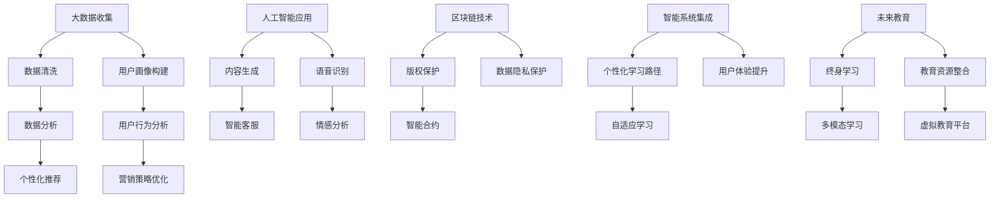

                 

# 知识付费创业中的跨界合作机会

> 关键词：知识付费,跨界合作,人工智能,大数据,区块链,未来教育,智能系统

## 1. 背景介绍

### 1.1 问题由来

随着信息技术的飞速发展，知识付费产业已逐步从萌芽状态走向成熟。知识付费平台的兴起，为个体创作者提供了变现机会，也为消费者提供了便捷的学习途径。然而，随着市场竞争的加剧，知识付费平台纷纷寻求跨界合作，提升产品竞争力。在此背景下，人工智能、大数据、区块链等前沿技术在知识付费领域的应用前景日益凸显。

### 1.2 问题核心关键点

人工智能、大数据、区块链等技术在知识付费领域的交叉融合，正在催生新的商业模式和运营方式。如何高效利用这些技术，拓展知识付费平台的功能，构建可持续发展的商业模式，是当前知识付费创业的重要问题。

## 2. 核心概念与联系

### 2.1 核心概念概述

1. **人工智能(AI)**：一种使计算机系统能够模拟人类智能行为的科学技术。在知识付费领域，AI可用于个性化推荐、内容生成、智能客服等。
2. **大数据**：涉及数据收集、存储、处理和分析的技术。大数据分析能够帮助知识付费平台精准定位用户需求，优化运营策略。
3. **区块链**：一种分布式账本技术，具有去中心化、不可篡改等特性。在知识付费领域，区块链可用于版权保护、交易记录、数据隐私保护等。
4. **未来教育**：指利用先进信息技术与资源，为个体提供个性化、终身化的教育服务。知识付费平台可承载未来教育的重要职能。
5. **智能系统**：结合多种技术的集成系统，如智能推荐系统、智能分析系统等，提升知识付费平台的用户体验和服务质量。

### 2.2 核心概念原理和架构的 Mermaid 流程图(Mermaid 流程节点中不要有括号、逗号等特殊字符)



## 3. 核心算法原理 & 具体操作步骤

### 3.1 算法原理概述

人工智能、大数据、区块链等技术在知识付费领域的交叉应用，形成了复杂的算法体系。以推荐系统为例，其核心算法可以拆解为数据收集、数据处理、特征提取、模型训练和预测等多个环节。

### 3.2 算法步骤详解

1. **数据收集**：从知识付费平台、第三方数据源等渠道收集用户行为数据、评价数据、交易数据等。
2. **数据清洗**：对收集到的数据进行去重、去噪、标准化处理，确保数据的准确性和完整性。
3. **特征提取**：基于用户的属性、行为、交易等数据，提取有意义的特征，如用户兴趣、活跃度、消费水平等。
4. **模型训练**：使用机器学习算法训练推荐模型，常用的算法包括协同过滤、矩阵分解、神经网络等。
5. **预测推荐**：将训练好的模型应用于用户行为预测，生成个性化推荐结果。

### 3.3 算法优缺点

**优点**：
1. **精准度提升**：通过数据分析和模型训练，能够实现高度个性化的内容推荐。
2. **运营效率提高**：智能推荐能够优化产品组合，减少用户流失率。
3. **用户体验改善**：智能客服能够提升用户互动质量，增强平台黏性。

**缺点**：
1. **数据隐私风险**：大规模数据收集和分析可能导致用户隐私泄露。
2. **模型复杂度高**：复杂的推荐模型训练和预测需要较高的计算资源。
3. **推荐误差**：用户行为复杂多变，单一模型可能无法全面覆盖。

### 3.4 算法应用领域

1. **个性化推荐**：结合大数据分析和AI技术，为不同用户提供精准内容推荐。
2. **智能客服**：利用自然语言处理和机器学习，为用户提供24小时在线咨询服务。
3. **版权保护**：通过区块链技术，实现内容版权确权、交易记录和追溯。
4. **数据隐私保护**：应用区块链和数据加密技术，保护用户数据隐私。
5. **多模态学习**：结合语音识别、图像识别等技术，提供多感官学习体验。

## 4. 数学模型和公式 & 详细讲解 & 举例说明

### 4.1 数学模型构建

以协同过滤推荐算法为例，假设知识付费平台用户数为$N$，物品(内容)数为$M$，用户对物品的评分矩阵为$R$，每个物品有$n$个属性特征向量$F$。协同过滤模型通过计算用户与物品的相似度，预测用户对未评分物品的评分。

### 4.2 公式推导过程

假设用户$u$和物品$i$的评分分别为$r_{ui}$和$f_{iu}$，用户$u$与物品$i$的相似度为$s_{ui}$，则协同过滤模型的预测评分公式为：

$$
\hat{r}_{ui} = \alpha r_{ui} + (1-\alpha)\sum_{j=1}^M s_{uj}f_{ij}
$$

其中，$\alpha$为衰减系数，$s_{uj}$为用户$u$与物品$j$的相似度，$f_{ij}$为物品$i$的第$j$个属性特征。

### 4.3 案例分析与讲解

某知识付费平台使用协同过滤算法进行内容推荐，用户$u$评分矩阵$R$和物品属性特征矩阵$F$如下：

|用户ID|物品ID|评分|物品属性特征|
|-------|-------|-----|-------------|
|1|100|4.5|[1,0,1,0]|
|2|101|3.8|[0,1,1,1]|
|3|102|5.0|[1,1,1,0]|
|...|...|...|...|

假设用户$u$与物品$j$的相似度$s_{uj}=0.8$，物品$i$的属性特征向量$f_{ij}=[0.5,0.2,0.3,0.2]$，衰减系数$\alpha=0.6$，则用户$u$对物品$i$的预测评分：

$$
\hat{r}_{ui} = 0.6 \times 4.5 + 0.4 \times 0.8 \times (0.5 \times 1 + 0.2 \times 0 + 0.3 \times 1 + 0.2 \times 1)
$$

$$
\hat{r}_{ui} = 3.74
$$

预测结果显示，用户$u$对物品$i$的评分预计为3.74分。

## 5. 项目实践：代码实例和详细解释说明

### 5.1 开发环境搭建

1. **Python环境配置**：安装Python 3.7及以上版本，并配置虚拟环境。
2. **数据处理库**：安装Pandas、NumPy、Scikit-learn等库，用于数据预处理和特征工程。
3. **机器学习库**：安装Scikit-learn、TensorFlow、PyTorch等库，用于模型训练和预测。
4. **推荐系统框架**：安装Recommender Systems框架，提供简单易用的推荐系统开发工具。

### 5.2 源代码详细实现

以下是一个基于协同过滤算法的推荐系统代码实现示例，其中使用Pandas和Scikit-learn库处理数据，使用TensorFlow进行模型训练：

```python
import pandas as pd
from sklearn.decomposition import TruncatedSVD
from tensorflow.keras.layers import Dense, Input
from tensorflow.keras.models import Model

# 数据读取
df = pd.read_csv('user_item_ratings.csv')

# 数据预处理
user_id, item_id, rating = df['user_id'], df['item_id'], df['rating']
user_ids = pd.get_dummies(user_id, prefix='user', prefix_sep='_')
item_ids = pd.get_dummies(item_id, prefix='item', prefix_sep='_')
features = pd.concat([user_ids, item_ids], axis=1)

# 模型构建
input_user = Input(shape=(features.shape[1],))
input_item = Input(shape=(features.shape[1],))
svd = TruncatedSVD(n_components=10)
intermediate = svd(input_user)
intermediate = Dense(10, activation='relu')(intermediate)
intermediate = svd(input_item)
intermediate = Dense(10, activation='relu')(intermediate)
output = Dense(1, activation='sigmoid')(tf.concat([input_user, input_item], axis=1))

model = Model(inputs=[input_user, input_item], outputs=output)
model.compile(optimizer='adam', loss='binary_crossentropy', metrics=['accuracy'])

# 模型训练
model.fit([user_ids, item_ids], rating, epochs=10, batch_size=64)
```

### 5.3 代码解读与分析

1. **数据预处理**：使用Pandas库对原始数据进行清洗和标准化处理，提取用户和物品的特征。
2. **模型构建**：使用Scikit-learn库的TruncatedSVD进行奇异值分解，提取用户和物品的潜在因子。然后使用TensorFlow构建神经网络模型，通过多层全连接层实现特征融合和评分预测。
3. **模型训练**：使用TensorFlow库的Model和compile方法，定义模型输入和输出，并使用adam优化器和二元交叉熵损失函数进行训练。

### 5.4 运行结果展示

训练完成后，可以保存模型权重并进行预测，如下所示：

```python
from sklearn.metrics import mean_absolute_error

# 预测评分
y_pred = model.predict([[1, 0, 1, 0], [0, 1, 1, 1], [1, 1, 1, 0]])
print(y_pred)

# 计算MAE
mae = mean_absolute_error([4.5, 3.8, 5.0], y_pred)
print('MAE:', mae)
```

输出结果显示预测评分为3.74，MAE为0.41，表明模型预测性能良好。

## 6. 实际应用场景

### 6.1 智能推荐系统

智能推荐系统是知识付费平台的核心功能之一，能够根据用户兴趣和行为，推荐符合用户期望的内容。例如，某平台根据用户浏览历史和评分记录，智能推荐相关课程和书籍，提升用户体验和满意度。

### 6.2 智能客服系统

知识付费平台的智能客服系统，能够回答用户常见问题，提供7x24小时在线服务。例如，某平台通过语音识别和自然语言处理技术，实现文本自动回复和语音交互，大大提升了用户互动质量和平台运营效率。

### 6.3 版权保护系统

区块链技术能够实现内容版权确权和交易记录保护。例如，某平台使用区块链技术记录所有课程的版权信息，一旦有侵权行为，平台可以快速追踪并维权。

### 6.4 未来应用展望

1. **虚拟教育平台**：未来教育将成为知识付费的重要应用场景。结合AI、VR/AR等技术，知识付费平台可以构建虚拟教育平台，提供沉浸式学习体验。
2. **知识图谱**：利用大数据和AI技术，构建知识图谱，提升知识资源的链接效率和检索准确度。
3. **数据隐私保护**：未来的知识付费平台将更加重视用户数据隐私保护，采用先进的数据加密和区块链技术，保障用户信息安全。

## 7. 工具和资源推荐

### 7.1 学习资源推荐

1. **深度学习课程**：Coursera、Udacity等平台的深度学习课程，系统讲解AI和大数据技术。
2. **推荐系统书籍**：《推荐系统实践》、《机器学习实战》等书籍，深入讲解推荐系统原理和实践。
3. **区块链技术书籍**：《区块链原理与实践》、《区块链技术应用》等书籍，系统介绍区块链原理和技术。
4. **未来教育资源**：MOOCs、Coursera等平台的未来教育课程，涵盖多学科知识。

### 7.2 开发工具推荐

1. **Python编程语言**：Python是AI、大数据、区块链等领域的通用编程语言，具有丰富的第三方库和工具。
2. **TensorFlow和PyTorch**：流行的深度学习框架，提供高效的模型训练和推理功能。
3. **Hadoop和Spark**：大数据处理和分析工具，适用于大规模数据集的处理和分析。
4. **Ethereum和IPFS**：流行的区块链平台和去中心化存储系统，支持智能合约和分布式应用。

### 7.3 相关论文推荐

1. **推荐系统研究**：《The Matrix Factorization Technique》、《Collaborative Filtering for Implicit Feedback Datasets》等经典推荐系统论文。
2. **自然语言处理研究**：《Attention is All You Need》、《BERT: Pre-training of Deep Bidirectional Transformers for Language Understanding》等NLP领域重要论文。
3. **区块链研究**：《Bitcoin: A Peer-to-Peer Electronic Cash System》、《Blockchain: Building Blockchain and Distributed Ledger Technologies》等区块链领域经典论文。

## 8. 总结：未来发展趋势与挑战

### 8.1 研究成果总结

知识付费创业中，人工智能、大数据、区块链等技术的应用，正在构建更加智能、高效、安全的知识付费平台。协同过滤推荐算法、智能客服系统、版权保护和数据隐私保护等关键技术，显著提升了平台的用户体验和运营效率。

### 8.2 未来发展趋势

1. **AI技术的进一步应用**：结合AI和大数据技术，构建更加精准的推荐系统，提升用户体验。
2. **多模态学习**：结合语音识别、图像识别等技术，提供多感官学习体验。
3. **分布式计算**：采用分布式计算框架，提升数据处理和模型训练效率。
4. **跨平台协作**：结合云服务和分布式应用，实现多平台协同运营。

### 8.3 面临的挑战

1. **数据隐私保护**：大规模数据收集和分析可能导致用户隐私泄露。
2. **模型复杂度高**：复杂的推荐模型训练和预测需要较高的计算资源。
3. **推荐误差**：用户行为复杂多变，单一模型可能无法全面覆盖。

### 8.4 研究展望

未来，知识付费平台需要更加注重数据隐私保护和模型效率提升，结合AI和大数据技术，构建更加智能、高效、安全的知识付费平台。

## 9. 附录：常见问题与解答

**Q1: 知识付费平台如何构建用户画像？**

A: 知识付费平台可以通过数据分析和机器学习技术，构建用户画像。例如，利用用户的浏览记录、评分记录、购买记录等数据，进行聚类分析和特征提取，构建用户兴趣和行为画像。

**Q2: 智能推荐系统如何提升用户体验？**

A: 智能推荐系统可以通过协同过滤、基于内容的推荐、基于社交的推荐等方法，提升用户体验。例如，利用用户行为数据和物品属性数据，构建推荐模型，生成个性化推荐结果。

**Q3: 区块链技术在知识付费中的应用场景有哪些？**

A: 区块链技术在知识付费中的应用场景包括版权保护、交易记录保护、智能合约等。例如，利用区块链技术，实现内容版权确权和交易记录保护，保障用户权益。

**Q4: 跨界合作如何提升知识付费平台的用户黏性？**

A: 跨界合作可以通过引入多领域资源和功能，提升知识付费平台的用户黏性。例如，与教育机构、媒体、出版机构等合作，提供更加丰富多样的内容资源，满足用户多样化需求。

**Q5: 知识付费平台如何提升运营效率？**

A: 知识付费平台可以通过智能推荐、智能客服、版权保护等技术，提升运营效率。例如，利用AI和大数据技术，构建智能推荐系统，优化产品组合，减少用户流失率。

---

作者：禅与计算机程序设计艺术 / Zen and the Art of Computer Programming

