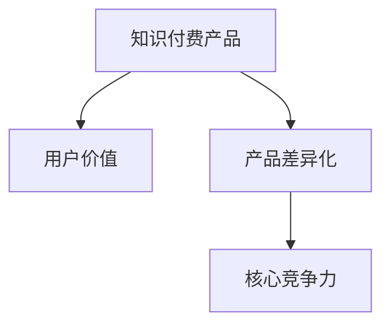

                 

# 知识付费创业的产品差异化策略

## 1. 背景介绍

随着知识经济时代的到来，知识付费成为了人们获取高质量信息的重要途径。面对市场上琳琅满目的知识付费平台，如何突围竞争，打造独特的产品差异化策略，成为了每一位知识付费创业者的重要课题。本文旨在通过深入分析知识付费产品的关键构成要素，揭示产品差异化的核心原理，为创业者提供系统性的策略建议。

## 2. 核心概念与联系

### 2.1 核心概念概述

为了更好地理解知识付费创业的产品差异化策略，我们首先需要明确几个核心概念：

- **知识付费产品**：指通过互联网平台向用户提供有偿的知识服务，如在线课程、文章、音频、视频、直播等，旨在帮助用户解决特定问题或提升特定技能。
- **用户价值**：指用户在使用知识付费产品时所获得的满足感、成就感、便利性等，是衡量产品成功与否的重要指标。
- **产品差异化**：指通过创新设计，使产品在功能、用户体验、价值等方面与竞争对手区别开来，满足特定用户群体的独特需求。
- **核心竞争力**：指产品能够长期保持竞争优势的核心能力，如独特的内容、创新的技术、高效的运营等。

这些核心概念之间的联系可以通过以下Mermaid流程图来展示：



这个流程图展示了一个知识付费产品从核心概念到最终价值实现的全过程：

1. **知识付费产品**基于一定的用户价值设计，旨在解决用户问题或满足用户需求。
2. **产品差异化**通过在功能、体验、价值等方面进行创新，使产品与竞争对手区分开来。
3. **核心竞争力**是支撑产品差异化的关键因素，包括独特的内容、创新的技术、高效的运营等。

## 3. 核心算法原理 & 具体操作步骤

### 3.1 算法原理概述

知识付费产品差异化策略的核心在于如何通过创新设计和市场定位，使产品在满足特定用户需求的同时，形成独特竞争优势。具体而言，我们可以通过以下几个关键步骤实现产品差异化：

1. **用户调研**：通过问卷调查、访谈等方式，了解目标用户群体的需求、痛点和使用习惯，为产品设计提供依据。
2. **价值定位**：根据用户调研结果，确定产品要解决的核心问题，以及用户希望从产品中获得的关键价值。
3. **功能创新**：在核心功能的基础上，通过创新设计增加附加功能，提升用户体验和产品竞争力。
4. **品牌塑造**：通过独特的品牌形象和营销策略，增强用户对产品的认同感和忠诚度。
5. **持续迭代**：根据用户反馈和市场需求，不断优化和升级产品，保持市场竞争力。

### 3.2 算法步骤详解

#### 3.2.1 用户调研

**步骤1：设计调研问卷**  
设计调查问卷时，需要涵盖用户的基本信息、使用习惯、需求痛点、使用场景等多个维度。例如，“您最希望从知识付费产品中获得什么内容？”、“您是否愿意为高品质的知识内容付费？”、“您对目前市场上的知识付费产品有哪些评价？”等问题。

**步骤2：数据收集**  
通过线上线下渠道进行问卷收集，包括社交媒体、官方网站、线下活动等。确保样本的代表性，覆盖不同年龄段、职业背景的用户。

**步骤3：数据分析**  
使用统计软件（如SPSS、R、Python等）对收集到的数据进行整理和分析，找出用户需求的共性和特性。例如，如果多数用户反映对编程、商业管理等领域的学习需求较高，则该产品可以侧重于这些方向。

#### 3.2.2 价值定位

**步骤1：明确用户价值**  
根据用户调研结果，明确产品要解决的核心问题。例如，如果用户普遍反映对专业技能提升的需求强烈，则产品的价值定位可以放在专业技能培训上。

**步骤2：确定关键价值**  
在明确核心问题的基础上，确定用户希望从产品中获得的关键价值。例如，用户希望通过产品获得知识、技能提升、职业发展等，则产品应该围绕这些关键价值展开设计。

#### 3.2.3 功能创新

**步骤1：功能设计**  
根据价值定位，设计出满足用户需求的关键功能模块。例如，如果是针对企业内部培训的产品，则应该包括定制化课程、学习进度跟踪、绩效评估等功能。

**步骤2：附加功能创新**  
在核心功能的基础上，增加附加功能以提升用户体验。例如，通过AR/VR技术增强学习体验、通过社交功能增加用户互动等。

**步骤3：迭代优化**  
根据用户反馈和产品性能数据，不断迭代和优化功能设计，提升用户体验和产品竞争力。例如，通过A/B测试比较不同功能模块的效果，根据测试结果调整产品设计。

#### 3.2.4 品牌塑造

**步骤1：品牌定位**  
确定产品品牌的特点和定位，例如专业、权威、创新等。通过品牌故事、视觉设计等方式传递品牌价值。

**步骤2：品牌传播**  
通过多种渠道进行品牌传播，包括社交媒体、搜索引擎优化（SEO）、广告投放等。确保品牌形象在用户心目中树立。

**步骤3：品牌维护**  
通过定期更新内容和功能、积极回应用户反馈等方式，维护品牌形象和用户信任度。

## 4. 数学模型和公式 & 详细讲解 & 举例说明

### 4.1 数学模型构建

假设知识付费产品 $P$ 包含 $n$ 个用户群体 $U=\{U_1, U_2, ..., U_n\}$，每个用户群体的需求和痛点可以用 $V=\{V_1, V_2, ..., V_n\}$ 表示。产品 $P$ 的功能和用户体验可以用 $F=\{F_1, F_2, ..., F_n\}$ 表示。产品差异化策略可以通过以下数学模型来表达：

$$
P = f(U, V, F)
$$

其中，$f$ 为函数映射，表示根据用户需求和痛点，通过创新设计和功能创新，得到最终的产品。

### 4.2 公式推导过程

在实际应用中，我们可以将上述模型进一步细化为具体的步骤和指标。例如，对于一个在线课程产品，可以将其功能 $F$ 分解为课程设计、互动学习、考核评估等多个子功能。每个子功能可以进一步细化为具体的功能模块和设计方案。通过这些具体的指标，我们可以对产品差异化策略进行更精确的分析和优化。

### 4.3 案例分析与讲解

以Coursera为例，分析其产品差异化策略：

**步骤1：用户调研**  
Coursera 通过问卷调查和用户反馈，了解到用户对在线学习的需求和痛点，例如对高质量教学内容、个性化学习路径、互动学习体验等的需求。

**步骤2：价值定位**  
Coursera 将产品价值定位为“人人可学的在线教育平台”，通过提供高质量的课程内容、个性化的学习路径和互动学习体验，帮助用户实现职业发展和个人成长。

**步骤3：功能创新**  
Coursera 在核心功能的基础上，增加了许多附加功能，例如视频互动、学习进度跟踪、学习证书等，提升了用户体验。

**步骤4：品牌塑造**  
Coursera 通过其独特的品牌形象和全球知名的合作伙伴，增强了用户对其产品的认同感和忠诚度。

**步骤5：持续迭代**  
Coursera 不断根据用户反馈和市场需求，更新课程内容和功能，保持市场竞争力。

## 5. 项目实践：代码实例和详细解释说明

### 5.1 开发环境搭建

为了进行知识付费产品的开发，首先需要搭建相应的开发环境。以下是Python开发环境的搭建步骤：

1. **安装Anaconda**  
从官网下载并安装Anaconda，用于创建独立的Python环境。

```bash
conda install anaconda
```

2. **创建虚拟环境**  
使用Anaconda创建虚拟环境，以隔离不同项目之间的依赖关系。

```bash
conda create -n myenv python=3.8
conda activate myenv
```

3. **安装Python库**  
安装Python的必要库，如Pandas、NumPy、Django等。

```bash
pip install pandas numpy django
```

### 5.2 源代码详细实现

以开发一个简单的在线课程平台为例，展示如何使用Django框架进行开发：

**步骤1：设计数据模型**  
在Django中，通过定义数据模型来存储课程信息和用户信息。例如，定义`Course`和`User`两个模型。

```python
from django.db import models

class Course(models.Model):
    name = models.CharField(max_length=100)
    teacher = models.ForeignKey('User', on_delete=models.CASCADE)
    description = models.TextField()
    # 其他字段...

class User(models.Model):
    username = models.CharField(max_length=50, unique=True)
    email = models.EmailField(unique=True)
    # 其他字段...
```

**步骤2：设计前端界面**  
使用HTML、CSS、JavaScript等技术设计用户界面。例如，设计课程列表、课程详情、用户登录等页面。

```html
<!-- 课程列表页面 -->
<div class="course-list">
    
        <div class="course-item">
            <h3>{{ course.name }}</h3>
            <p>{{ course.description }}</p>
            <a href="">详情</a>
        </div>
    
</div>

<!-- 课程详情页面 -->
<div class="course-detail">
    <h3>{{ course.name }}</h3>
    <p>{{ course.description }}</p>
    <a href="">报名</a>
</div>
```

**步骤3：开发后端逻辑**  
在Django中，使用`views.py`文件编写后端逻辑，例如课程列表的展示、课程详情的展示、用户登录等。

```python
from django.shortcuts import render, redirect
from .models import Course, User
from django.contrib.auth.decorators import login_required

@login_required
def course_list(request):
    courses = Course.objects.all()
    return render(request, 'course_list.html', {'courses': courses})

@login_required
def course_detail(request, pk):
    course = Course.objects.get(id=pk)
    return render(request, 'course_detail.html', {'course': course})

@login_required
def user_login(request):
    if request.method == 'POST':
        username = request.POST['username']
        password = request.POST['password']
        user = User.objects.filter(username=username, password=password).first()
        if user:
            request.session['user_id'] = user.id
            return redirect('home')
        else:
            return render(request, 'login.html', {'error': 'Invalid username or password'})
    else:
        return render(request, 'login.html')
```

**步骤4：进行前端开发**  
使用JavaScript、Ajax等技术实现前端交互功能，例如登录、课程报名等。

```javascript
// 登录函数
function login() {
    var username = document.getElementById('username').value;
    var password = document.getElementById('password').value;
    // 发送Ajax请求，登录验证
}

// 课程报名函数
function enrollCourse(course_id) {
    // 发送Ajax请求，报名课程
}
```

**步骤5：进行测试**  
使用Python的测试框架（如unittest）编写测试用例，确保代码的正确性和稳定性。

```python
import unittest
from .models import Course, User
from django.test import TestCase

class CourseTest(TestCase):
    def test_course_creation(self):
        course = Course(name='Python基础', description='Python入门教程')
        course.save()
        self.assertEqual(str(course), 'Python基础')
```

### 5.3 代码解读与分析

通过上述代码，我们可以看到知识付费产品的开发流程：

1. **环境搭建**：使用Anaconda创建虚拟环境，安装Python库。
2. **数据模型**：定义数据模型，存储课程和用户信息。
3. **前端界面**：设计前端界面，展示课程列表和详情。
4. **后端逻辑**：编写后端逻辑，处理用户登录、课程展示等功能。
5. **前端开发**：实现前端交互功能，例如登录、报名等。
6. **测试用例**：编写测试用例，确保代码的正确性和稳定性。

通过以上步骤，我们完成了一个简单的在线课程平台的开发。

## 6. 实际应用场景

### 6.1 智能课程推荐

基于用户的学习历史和行为数据，通过机器学习算法推荐个性化的课程。例如，根据用户过往的观看记录、评论反馈，推荐与其兴趣相关的课程。

### 6.2 动态课程更新

根据市场反馈和用户需求，动态更新课程内容和形式。例如，根据热门话题和用户反馈，增加新的课程模块或更新课程内容。

### 6.3 多渠道分发

将课程内容通过多种渠道分发，例如网站、移动应用、社交媒体等，扩大课程的覆盖范围和用户基数。

## 7. 工具和资源推荐

### 7.1 学习资源推荐

为了帮助创业者掌握知识付费产品的开发和运营技巧，以下是一些优质的学习资源：

1. **《知识付费：让用户为内容付费》**  
介绍知识付费市场现状、用户需求、产品设计等方面的内容，是创业者的入门必读。

2. **Coursera和Udacity的官方文档**  
这两家知名的知识付费平台提供了详细的技术文档和案例分析，是学习在线课程开发的宝贵资源。

3. **Django官方文档**  
Django是目前最流行的Python Web框架之一，通过官方文档可以学习如何搭建和管理Web应用。

4. **GitHub上的开源项目**  
GitHub上有很多优秀的开源项目，例如Coursera的课程管理系统、Udacity的学习路径管理系统等，可以作为参考和借鉴。

### 7.2 开发工具推荐

为了提高知识付费产品的开发效率，以下是几款推荐的开发工具：

1. **Django**  
Django是目前最流行的Python Web框架之一，提供了强大的ORM、模板引擎、表单处理等功能，适合快速搭建Web应用。

2. **Flask**  
Flask是一个轻量级的Python Web框架，适合小型应用或原型开发。

3. **React**  
React是一个流行的JavaScript库，适合开发交互式前端界面，例如课程详情页面、课程报名页面等。

4. **PostgreSQL**  
PostgreSQL是一个高性能的开源数据库，适合存储和管理大量用户数据和课程数据。

### 7.3 相关论文推荐

为了深入理解知识付费产品的技术实现和创新方向，以下是几篇相关论文：

1. **《在线课程推荐系统的设计与实现》**  
介绍基于用户行为数据的在线课程推荐系统的设计思路和实现方法。

2. **《基于深度学习的课程内容推荐》**  
探讨使用深度学习模型对课程内容进行推荐的方法，例如协同过滤、内容推荐等。

3. **《多渠道分发的知识付费产品》**  
分析知识付费产品在多渠道分发中的策略和技术实现，例如网站、应用、社交媒体等。

## 8. 总结：未来发展趋势与挑战

### 8.1 总结

本文对知识付费创业的产品差异化策略进行了深入分析，揭示了产品设计、功能创新、品牌塑造等关键要素。通过具体案例和步骤详解，为创业者提供了系统性的策略建议。

## 8.2 未来发展趋势

### 8.2.1 技术创新

未来，知识付费产品将进一步引入人工智能、大数据、区块链等前沿技术，提升内容推荐、用户互动、版权保护等方面的能力。

### 8.2.2 内容多样化

知识付费产品的内容将更加多样化，涵盖编程、商业管理、心理健康等多个领域，满足用户多样化的学习需求。

### 8.2.3 多模态融合

未来，知识付费产品将更多地融合视频、音频、文字等多种模态，提升用户的学习体验和互动性。

## 8.3 面临的挑战

### 8.3.1 用户获取

知识付费产品的用户获取成本较高，如何在激烈的市场竞争中吸引用户，是亟待解决的问题。

### 8.3.2 课程质量

高质量的课程内容是知识付费产品的核心竞争力，如何确保课程内容的质量和更新频率，需要持续的投入和优化。

### 8.3.3 运营管理

知识付费产品的运营管理涉及到用户行为数据分析、课程更新维护、平台安全等多方面的工作，需要精细化运营和持续改进。

## 8.4 研究展望

未来，知识付费产品需要更多地关注用户价值、产品创新和运营效率，通过持续的技术和内容创新，提升用户满意度和平台竞争力。

## 9. 附录：常见问题与解答

**Q1：知识付费产品如何进行内容推荐？**

A: 知识付费产品可以通过以下几种方法进行内容推荐：

1. 协同过滤：根据用户行为数据（如浏览、购买、评分等），推荐用户可能感兴趣的其他课程。

2. 基于内容的推荐：分析课程内容（如课程描述、标签等），推荐与用户学习兴趣相关的课程。

3. 混合推荐：结合协同过滤和基于内容的推荐，提升推荐效果。

4. 个性化推荐：根据用户的学习进度、偏好等，进行个性化推荐，提升用户体验。

**Q2：知识付费产品如何进行品牌塑造？**

A: 知识付费产品可以通过以下几种方法进行品牌塑造：

1. 独特的品牌故事：通过品牌故事传递品牌的使命和价值观。

2. 全球知名的合作伙伴：与知名学者、机构合作，提升品牌影响力。

3. 优秀的课程内容：提供高质量的课程内容，赢得用户口碑。

4. 完善的售后服务：提供优质的售后服务，增强用户信任度。

**Q3：知识付费产品如何进行持续迭代？**

A: 知识付费产品可以通过以下几种方法进行持续迭代：

1. 定期收集用户反馈：通过问卷调查、用户评论等方式，收集用户对产品功能和体验的意见和建议。

2. 数据分析：通过用户行为数据分析，发现产品存在的痛点和问题。

3. 快速迭代：根据用户反馈和数据分析结果，快速进行产品迭代和优化。

4. 测试验证：通过A/B测试等方式，验证新功能的用户接受度和效果。

**Q4：知识付费产品如何进行多渠道分发？**

A: 知识付费产品可以通过以下几种方法进行多渠道分发：

1. 官方网站：通过官网提供课程访问入口和报名渠道。

2. 移动应用：开发移动应用，提供课程下载、在线学习、互动交流等功能。

3. 社交媒体：通过微信、微博、抖音等社交媒体平台进行课程推广和用户互动。

4. 在线广告：通过谷歌、百度等搜索引擎进行精准投放广告，吸引潜在用户。

---

作者：禅与计算机程序设计艺术 / Zen and the Art of Computer Programming

