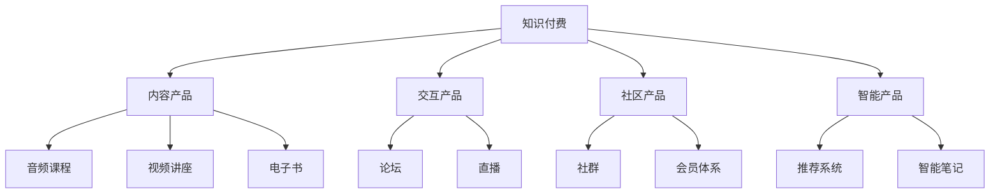

                 

# 知识付费创业的产品矩阵构建

## 1. 背景介绍

### 1.1 问题由来
随着知识经济的兴起，知识付费市场在过去几年迅速增长。知识付费创业项目以其精准的信息提供和个性化服务，满足了用户对知识深度需求的快速增长。然而，如何构建一个高效、持续、盈利的知识付费产品矩阵，成为各大知识付费平台和创业公司关注的焦点。

## 2. 核心概念与联系

### 2.1 核心概念概述

为更好地理解知识付费产品矩阵的构建，本文将介绍几个关键概念：

- **知识付费**：指用户支付一定费用，获取具有信息价值和知识深度的内容服务。知识付费产品覆盖广泛，如音频课程、视频讲座、电子书、专栏文章等。
- **产品矩阵**：指通过合理规划不同产品的组合，形成互补和协同，最大化整体价值。知识付费产品矩阵包括内容产品、交互产品、社区产品、智能产品等。
- **内容价值**：指内容产品为用户提供的知识和信息，具有实际使用价值。如课程、书籍、文档等。
- **交互价值**：指用户和平台之间的互动和交流价值，如论坛、评论、直播互动等。
- **社区价值**：指用户与用户之间的社交和群体价值，如社群、会员体系等。
- **智能价值**：指通过AI技术实现内容个性化推荐、知识自动提取等，提高用户使用体验。

这些核心概念之间的逻辑关系可以通过以下Mermaid流程图来展示：



这个流程图展示了大规模知识付费产品矩阵的核心组成：

1. 核心是知识付费服务。
2. 基础是内容产品，如音频课程、视频讲座、电子书等。
3. 交互产品，如论坛、直播、评论等，加强用户与平台互动。
4. 社区产品，如社群、会员体系，建立用户与用户间的社交关系。
5. 智能产品，如推荐系统、智能笔记，提升用户体验。

这些产品互相支撑，共同构建了一个知识付费生态，实现业务的可持续发展和盈利模式的多元化。

## 3. 核心算法原理 & 具体操作步骤

### 3.1 算法原理概述

知识付费产品矩阵的构建，本质上是一个产品策略和数据驱动的优化过程。其核心思想是：通过分析用户行为数据，构建用户画像，设计合适的产品组合和互动方式，最大化满足用户需求，实现业务的可持续增长。

形式化地，假设用户集合为 $U$，产品集合为 $P$，用户对产品 $p \in P$ 的评分矩阵为 $R_{U \times P}$，目标是通过优化产品组合和互动方式，最大化用户总评分 $S = \sum_{u \in U} \sum_{p \in P} R_{u,p}$。

通过梯度下降等优化算法，用户评分矩阵 $R$ 不断更新，最终得到最优的产品组合和互动方式。

### 3.2 算法步骤详解

基于产品策略和数据驱动的知识付费产品矩阵构建一般包括以下几个关键步骤：

**Step 1: 用户行为数据分析**

- 收集用户行为数据，包括浏览时长、购买记录、评论反馈等。
- 利用数据挖掘和统计学方法，构建用户画像，分析用户兴趣和需求。

**Step 2: 产品组合设计**

- 根据用户画像，设计合适的产品组合，如内容产品的类型、主题、价格等。
- 考虑产品的互补性，设计交叉销售和关联推荐策略，提升用户体验和购买转化率。

**Step 3: 用户交互方式优化**

- 设计用户与平台之间的互动方式，如论坛、评论、直播互动等。
- 分析用户互动数据，优化内容展示和交流形式，提升用户黏性和满意度。

**Step 4: 社区产品构建**

- 构建用户与用户之间的社交关系，如社群、会员体系等。
- 设计社区规则和激励机制，促进用户间的知识分享和互助。

**Step 5: 智能产品开发**

- 开发智能推荐系统，如协同过滤、内容推荐算法等，提升个性化推荐效果。
- 开发智能笔记工具，如知识图谱、摘要生成等，帮助用户整理和总结知识。

**Step 6: 效果评估与迭代优化**

- 在优化过程中，周期性评估产品矩阵效果，分析用户反馈和市场变化。
- 根据评估结果，迭代优化产品组合和互动方式，持续提升用户价值和业务收入。

### 3.3 算法优缺点

知识付费产品矩阵构建具有以下优点：

1. 多元化和个性化。通过产品矩阵组合，可以覆盖不同用户需求，提供个性化服务。
2. 用户黏性提升。通过社区和交互产品，增强用户与平台互动，提升用户黏性和忠诚度。
3. 收入多元化。通过多元产品组合，可以实现多渠道收入，降低单一产品风险。
4. 数据驱动决策。通过分析用户行为数据，实现科学决策，避免主观偏见。

同时，该方法也存在一定的局限性：

1. 数据依赖度高。产品矩阵构建依赖大量用户行为数据，数据获取和处理成本高。
2. 市场风险大。用户需求多样，产品设计和组合难度大，存在市场失灵风险。
3. 技术复杂度高。涉及多种产品设计和技术实现，开发和优化复杂度大。
4. 用户隐私保护。在数据收集和使用过程中，需严格遵守隐私保护法规，避免用户数据泄露。

尽管存在这些局限性，但就目前而言，产品矩阵构建是知识付费创业的重要策略，是实现可持续发展的关键。未来相关研究的重点在于如何降低数据依赖，提高市场响应速度，兼顾用户隐私和平台盈利。

### 3.4 算法应用领域

知识付费产品矩阵构建方法，已经在各大知识付费平台和创业项目中得到广泛应用，涵盖内容制作、交互设计、社区运营、智能推荐等多个领域。

例如：

- **得到**：通过精心设计内容产品组合，提供有深度的音频课程和电子书，并通过社群和会员体系提升用户黏性。
- **知乎**：构建社区产品，通过问答和评论机制促进用户交流，同时通过智能推荐系统提升内容分发效率。
- **钉钉知识管理**：开发智能笔记工具，帮助企业用户整理和分享知识，通过智能推荐和内容定制，提升知识管理效率。

除了这些经典案例外，知识付费产品矩阵构建的创新应用也在不断涌现，如知识图谱、动态定价策略、个性化推送等，为知识付费行业带来了新的发展空间。

## 4. 数学模型和公式 & 详细讲解 & 举例说明

### 4.1 数学模型构建

本节将使用数学语言对知识付费产品矩阵构建过程进行更加严格的刻画。

假设知识付费平台有 $m$ 种内容产品，每种产品服务 $n$ 名用户，用户对产品的评分矩阵为 $R_{m \times n}$，评分矩阵 $R$ 中每个元素 $R_{i,j}$ 表示用户 $j$ 对产品 $i$ 的评分，记作 $R_{i,j} \in [0,1]$。

定义产品组合 $C=\{C_1, C_2, \ldots, C_m\}$，其中 $C_i$ 表示产品 $i$ 的用户评分向量，即 $C_i = [R_{1,i}, R_{2,i}, \ldots, R_{n,i}]^T$。

知识付费产品矩阵的目标是最大化用户总评分 $S = \sum_{j=1}^n \sum_{i=1}^m R_{i,j}$。

### 4.2 公式推导过程

以下我们以用户对产品的评分矩阵为优化目标，推导求解最优产品组合的数学公式。

设优化目标函数为：

$$
S = \sum_{j=1}^n \sum_{i=1}^m R_{i,j}
$$

目标是最小化优化目标函数，即：

$$
\min_{C} S = \min_{C} \sum_{j=1}^n \sum_{i=1}^m R_{i,j}
$$

根据梯度下降优化算法，每次迭代更新 $C_i$ 时，梯度更新公式为：

$$
\Delta C_i = -\eta \frac{\partial S}{\partial C_i}
$$

其中 $\eta$ 为学习率，$\frac{\partial S}{\partial C_i}$ 为优化目标函数对 $C_i$ 的梯度。

将梯度公式展开并化简，得：

$$
\Delta C_i = -\eta \sum_{j=1}^n \frac{\partial R_{i,j}}{\partial C_i}
$$

利用偏导数链式法则，有：

$$
\frac{\partial R_{i,j}}{\partial C_i} = -\frac{\partial C_i^T R_j}{\partial C_i}
$$

将 $\Delta C_i$ 代入目标函数，得：

$$
S = \sum_{i=1}^m \sum_{j=1}^n R_{i,j} - \sum_{i=1}^m \eta \sum_{j=1}^n \frac{\partial C_i^T R_j}{\partial C_i}
$$

进一步化简，得：

$$
S = \sum_{i=1}^m \left( \sum_{j=1}^n R_{i,j} - \eta \sum_{j=1}^n \frac{\partial C_i^T R_j}{\partial C_i} \right)
$$

令 $g_i = \sum_{j=1}^n R_{i,j}$ 为产品 $i$ 的用户总评分，有：

$$
S = \sum_{i=1}^m (g_i - \eta \sum_{j=1}^n \frac{\partial C_i^T R_j}{\partial C_i})
$$

进一步简化，得：

$$
\Delta C_i = \eta \frac{g_i - \sum_{j=1}^n R_{i,j}}{\sum_{j=1}^n \frac{\partial C_i^T R_j}{\partial C_i}}
$$

将 $\Delta C_i$ 代入目标函数，得：

$$
S = \sum_{i=1}^m (g_i - \eta \Delta C_i)
$$

令 $D_i = \sum_{j=1}^n \frac{\partial C_i^T R_j}{\partial C_i}$ 为产品 $i$ 的梯度向量，有：

$$
S = \sum_{i=1}^m (g_i - \eta \Delta C_i)
$$

即：

$$
S = \sum_{i=1}^m (g_i - \eta \frac{g_i - \sum_{j=1}^n R_{i,j}}{D_i})
$$

求解 $C_i$，得：

$$
C_i = g_i - \eta \frac{g_i - \sum_{j=1}^n R_{i,j}}{D_i}
$$

进一步化简，得：

$$
C_i = \frac{\sum_{j=1}^n R_{i,j}}{1 + \eta D_i}
$$

以上公式展示了如何通过梯度下降优化算法，不断更新产品组合，最大化用户总评分。

### 4.3 案例分析与讲解

以得到平台的音频课程产品为例，分析其产品矩阵构建过程。

**1. 内容产品设计**

- **课程主题**：分主题设置课程，如职场技能、科学教育、语言学习等。
- **课程形式**：音频和视频混合，选择更适应用户需求的形式。
- **课程定价**：根据课程难度和长度，采用阶梯定价策略。

**2. 用户行为数据分析**

- **用户画像**：通过用户浏览历史、购买记录等，分析用户兴趣和需求。
- **用户评分**：收集用户对课程的评分数据，分析用户对课程内容的满意度。

**3. 智能推荐系统**

- **协同过滤**：根据用户评分和课程评分矩阵，推荐用户可能感兴趣的课程。
- **内容推荐**：根据用户兴趣和历史行为，动态调整课程推荐列表。

**4. 社区产品构建**

- **社群管理**：建立课程社群，提供课程讨论、用户交流的平台。
- **会员体系**：设计会员制度，提供课程免费下载、会员专属课程等功能。

**5. 效果评估与迭代优化**

- **用户反馈**：定期收集用户反馈，分析用户满意度。
- **市场变化**：关注市场变化，及时调整产品策略和推荐算法。

通过这些步骤，得到平台的音频课程产品矩阵逐渐成型，实现了多元化、个性化、互动化的服务。

## 5. 项目实践：代码实例和详细解释说明

### 5.1 开发环境搭建

在进行知识付费产品矩阵构建的开发前，我们需要准备好开发环境。以下是使用Python进行Scikit-learn开发的开发环境配置流程：

1. 安装Anaconda：从官网下载并安装Anaconda，用于创建独立的Python环境。

2. 创建并激活虚拟环境：
```bash
conda create -n pytorch-env python=3.8 
conda activate pytorch-env
```

3. 安装Scikit-learn：
```bash
conda install scikit-learn
```

4. 安装各类工具包：
```bash
pip install numpy pandas scikit-learn matplotlib tqdm jupyter notebook ipython
```

完成上述步骤后，即可在`pytorch-env`环境中开始产品矩阵构建实践。

### 5.2 源代码详细实现

下面我们以课程推荐系统为例，给出使用Scikit-learn进行知识付费产品矩阵构建的Python代码实现。

首先，定义课程数据处理函数：

```python
from sklearn.metrics.pairwise import cosine_similarity

def process_course_data(data):
    # 获取课程ID、用户ID、用户评分、课程评分
    course_ids = data['course_id']
    user_ids = data['user_id']
    user_scores = data['user_score']
    course_scores = data['course_score']
    
    # 构建评分矩阵
    R = np.zeros((len(course_ids), len(course_scores)))
    for i, course_id in enumerate(course_ids):
        for j, course_score in enumerate(course_scores):
            R[i, j] = course_score
    
    # 计算用户评分向量
    user_scores = np.zeros((len(course_ids), len(course_scores)))
    for i, course_id in enumerate(course_ids):
        for j, course_score in enumerate(course_scores):
            user_scores[i, j] = user_scores[i, j] + user_scores[i, j-1] * (1 - course_score)
    
    return R, user_scores
```

然后，定义课程推荐函数：

```python
from sklearn.metrics.pairwise import cosine_similarity

def recommend_course(user_scores, R):
    # 计算用户与课程的相似度
    user_vector = user_scores.mean(axis=1)
    similarity = cosine_similarity(R, user_vector)
    
    # 推荐课程
    recommended_courses = []
    for i in range(len(similarity)):
        course_indices = np.argsort(similarity[i])[::-1]
        recommended_courses.append(course_indices[:5])
    
    return recommended_courses
```

最后，启动课程推荐系统：

```python
# 加载课程数据
data = pd.read_csv('course_data.csv')

# 处理课程数据
R, user_scores = process_course_data(data)

# 推荐课程
recommended_courses = recommend_course(user_scores, R)

# 输出推荐结果
for i, course_indices in enumerate(recommended_courses):
    print(f'User {i+1} recommended courses: {course_indices}')
```

以上就是使用Scikit-learn进行知识付费产品矩阵构建的完整代码实现。可以看到，通过Scikit-learn库的强大封装，我们能够快速实现基于用户评分的课程推荐功能。

### 5.3 代码解读与分析

让我们再详细解读一下关键代码的实现细节：

**process_course_data函数**：
- 从数据集中提取课程ID、用户ID、用户评分、课程评分，构建评分矩阵 $R$。
- 计算每个用户的评分向量 $user_scores$，作为后续相似度计算的基础。

**recommend_course函数**：
- 计算每个用户与所有课程的相似度。
- 根据相似度排序，选择前5门课程推荐给用户。

**课程推荐系统**：
- 加载课程数据，处理课程数据，得到评分矩阵 $R$ 和用户评分向量 $user_scores$。
- 调用推荐函数，得到推荐课程列表，并输出。

可以看到，Scikit-learn库使得课程推荐系统的实现变得简洁高效。开发者可以将更多精力放在数据处理、模型改进等高层逻辑上，而不必过多关注底层的实现细节。

当然，工业级的系统实现还需考虑更多因素，如模型的保存和部署、超参数的自动搜索、更灵活的任务适配层等。但核心的产品矩阵构建范式基本与此类似。

## 6. 实际应用场景

### 6.1 智能教育平台

基于知识付费产品矩阵的智能教育平台，可以为用户提供一个高效、互动、个性化的学习环境。平台通过推荐系统和社区功能，能够动态调整课程内容，帮助用户快速找到感兴趣的学习资源。

在技术实现上，可以收集用户的学习行为数据，如浏览记录、答题情况、学习时长等，通过协同过滤等推荐算法，提供个性化的课程推荐。同时，通过社区讨论、在线辅导等功能，增强用户之间的交流和互动，提升学习效果。

### 6.2 企业培训平台

知识付费产品矩阵在企业培训中也具有广阔的应用前景。企业可以根据员工的职业发展需求，设计多样化的培训课程，通过平台推荐和社区讨论，提高培训的针对性和互动性。

具体而言，可以设计个性化的课程推荐算法，根据员工的学习历史、职业背景、岗位需求，推荐适合的培训课程。同时，通过建立知识分享社区，鼓励员工分享学习心得，形成互相学习的良好氛围。

### 6.3 在线医疗平台

在线医疗平台可以通过知识付费产品矩阵，提供更丰富、精准的健康知识和医疗咨询服务。平台可以根据用户的健康需求，推荐适合的医疗课程和资料，通过社区交流，提供个性化的健康指导和建议。

例如，对于心血管疾病患者，平台可以推荐心脏保健课程，提供心脏病的预防、治疗和护理知识。同时，通过社区讨论和医生咨询，帮助患者获取个性化的健康建议，提升健康水平。

### 6.4 未来应用展望

随着知识付费产品矩阵构建技术的发展，未来的知识付费行业将呈现出更多的创新应用：

1. **智能笔记系统**：结合知识图谱和自然语言处理技术，自动整理和提取知识要点，提高用户学习效率。
2. **动态定价策略**：根据用户行为数据，动态调整课程价格，实现个性化定价。
3. **个性化推送**：根据用户兴趣和需求，动态推送个性化内容，提升用户黏性和满意度。
4. **知识图谱构建**：通过知识图谱技术，构建知识间的关联网络，提供更全面的知识检索和推荐服务。
5. **社交学习社区**：构建用户之间的社交网络，通过知识分享和交流，提升用户的学习效果和互动体验。

这些创新应用将进一步丰富知识付费产品矩阵，提升用户体验和平台价值。

## 7. 工具和资源推荐

### 7.1 学习资源推荐

为了帮助开发者系统掌握知识付费产品矩阵的构建方法，这里推荐一些优质的学习资源：

1. **《知识付费业务实战》书籍**：由知识付费行业专家撰写，系统介绍了知识付费业务的核心概念、产品设计和运营策略，提供了丰富的实战案例和经验分享。
2. **Coursera《机器学习》课程**：斯坦福大学开设的经典课程，详细讲解了机器学习的基本原理和算法实现，是学习产品矩阵构建的必备资源。
3. **Kaggle知识付费数据集**：提供了丰富的知识付费数据集，包括课程评分、用户行为等，用于训练和测试推荐算法。
4. **Scikit-learn官方文档**：Scikit-learn库的官方文档，提供了详细的算法说明和代码示例，是学习产品矩阵构建的重要参考资料。
5. **Udacity《人工智能与机器学习》课程**：提供了从入门到高级的机器学习课程，涵盖协同过滤、内容推荐等算法实现，适合不同层次的学习者。

通过对这些资源的学习实践，相信你一定能够快速掌握知识付费产品矩阵构建的精髓，并用于解决实际的业务问题。

### 7.2 开发工具推荐

高效的开发离不开优秀的工具支持。以下是几款用于知识付费产品矩阵构建开发的常用工具：

1. **Python**：Python语言具有简单易用、开源灵活的特点，是数据科学和机器学习领域的首选工具。
2. **Scikit-learn**：提供了丰富的机器学习算法和工具，支持数据预处理、特征工程、模型训练和评估等，是实现产品矩阵构建的核心工具。
3. **Jupyter Notebook**：提供了交互式代码执行环境，适合开发和测试产品矩阵构建算法。
4. **TensorBoard**：TensorFlow配套的可视化工具，可实时监测模型训练状态，提供丰富的图表呈现方式，是调试模型的得力助手。
5. **Kaggle**：提供了丰富的数据集和社区资源，适合进行算法竞赛和模型评测，推动知识付费产品矩阵构建技术的发展。

合理利用这些工具，可以显著提升知识付费产品矩阵构建的开发效率，加快创新迭代的步伐。

### 7.3 相关论文推荐

知识付费产品矩阵构建的研究始于学界对推荐系统的深入研究。以下是几篇奠基性的相关论文，推荐阅读：

1. **Collaborative Filtering for Implicit Feedback Datasets**：Koren等人的经典论文，详细介绍了协同过滤推荐算法的原理和实现，是推荐系统研究的重要文献。
2. **Adaptive Collaborative Filtering**：Guan等人提出的自适应协同过滤算法，在处理数据稀疏性方面具有良好效果，是知识付费推荐系统的优化方向。
3. **Knowledge-Based Recommender Systems**：Rescal等人提出的基于知识的推荐系统，通过结合符号化知识图谱，提高推荐系统的精度和泛化能力。
4. **Hybrid Recommendation System**：Kwak等人提出的混合推荐系统，结合协同过滤和内容推荐，提供更加全面和准确的推荐服务。
5. **Reinforcement Learning for Personalized Recommendation**：Yu等人提出的强化学习推荐算法，通过用户行为数据进行奖励学习，优化推荐策略。

这些论文代表了大规模知识付费产品矩阵构建技术的发展脉络。通过学习这些前沿成果，可以帮助研究者把握学科前进方向，激发更多的创新灵感。

## 8. 总结：未来发展趋势与挑战

### 8.1 总结

本文对知识付费产品矩阵构建方法进行了全面系统的介绍。首先阐述了知识付费和产品矩阵构建的研究背景和意义，明确了产品矩阵构建在知识付费业务中的核心地位。其次，从原理到实践，详细讲解了产品矩阵构建的数学原理和关键步骤，给出了推荐系统的代码实现。同时，本文还广泛探讨了产品矩阵在智能教育、企业培训、在线医疗等多个领域的应用前景，展示了知识付费产品矩阵构建的广阔发展空间。此外，本文精选了产品矩阵构建的各类学习资源，力求为读者提供全方位的技术指引。

通过本文的系统梳理，可以看到，知识付费产品矩阵构建技术在知识付费行业中已经逐步成熟，成为实现业务可持续发展和盈利模式多元化的重要手段。基于用户行为数据的分析、推荐算法的设计和社区产品的构建，形成了完善的知识付费产品生态，提升了用户价值和平台收入。未来，伴随产品矩阵构建技术的不断进步，知识付费行业必将在教育、培训、医疗等多个领域实现更大规模的落地应用，为人类知识共享和智能化进程带来深远影响。

### 8.2 未来发展趋势

展望未来，知识付费产品矩阵构建技术将呈现以下几个发展趋势：

1. **数据智能化**：借助自然语言处理、图像识别等技术，从非结构化数据中提取用户行为特征，提高推荐系统的精准度。
2. **算法协同化**：结合协同过滤、内容推荐、知识图谱等多种算法，提供更加全面和个性化的推荐服务。
3. **用户交互化**：通过社交网络、直播互动等形式，增强用户与平台之间的互动和交流，提升用户满意度和黏性。
4. **服务智能化**：通过智能笔记、知识图谱等技术，提供知识整理和提取服务，提高用户的学习效率和效果。
5. **社区社区化**：建立用户之间的社交网络，通过知识分享和互助，提升用户的学习效果和社区活跃度。

这些趋势凸显了知识付费产品矩阵构建技术的广阔前景。这些方向的探索发展，必将进一步提升知识付费平台的个性化推荐效果和用户体验，实现业务的持续增长和盈利。

### 8.3 面临的挑战

尽管知识付费产品矩阵构建技术已经取得了显著成果，但在迈向更加智能化、个性化应用的过程中，它仍面临诸多挑战：

1. **数据隐私**：在数据收集和处理过程中，需严格遵守隐私保护法规，避免用户数据泄露。
2. **数据质量**：高质量、大规模的数据是产品矩阵构建的基础，数据缺失和噪声等问题需积极应对。
3. **技术复杂度**：涉及多种产品设计和技术实现，开发和优化复杂度大，需跨学科协作。
4. **市场响应速度**：用户需求多样，产品设计和组合难度大，需快速调整策略，以适应市场变化。
5. **用户接受度**：新产品的引入可能带来使用习惯的改变，需加强用户引导和教育。

尽管存在这些挑战，但通过研究者、开发者和用户的共同努力，知识付费产品矩阵构建技术必将不断突破，为知识付费行业带来更多的创新和价值。

### 8.4 研究展望

面对知识付费产品矩阵构建所面临的挑战，未来的研究需要在以下几个方面寻求新的突破：

1. **数据隐私保护**：通过差分隐私、联邦学习等技术，保障用户数据的安全和隐私。
2. **数据质量提升**：利用数据增强、数据清洗等技术，提高数据质量和数据多样性。
3. **多模态融合**：结合文本、图像、语音等多种模态信息，提高推荐系统的泛化能力。
4. **用户行为理解**：利用因果推断、强化学习等技术，深入理解用户行为和需求，优化推荐策略。
5. **社区产品优化**：通过社交网络分析、用户情感分析等技术，优化社区产品设计，提高用户互动效果。

这些研究方向的探索，必将引领知识付费产品矩阵构建技术迈向更高的台阶，为知识付费行业带来更多的创新和价值。面向未来，知识付费产品矩阵构建技术还需要与其他人工智能技术进行更深入的融合，如知识表示、因果推理、强化学习等，多路径协同发力，共同推动知识付费系统的进步。只有勇于创新、敢于突破，才能不断拓展知识付费的边界，让智能技术更好地服务于知识共享和人类社会的智能化进程。

## 9. 附录：常见问题与解答

**Q1：知识付费创业如何选择合适的课程内容？**

A: 选择合适的课程内容是知识付费创业的重要环节。首先，需明确目标用户群体，分析用户需求和痛点。其次，可参考市场热点和趋势，选择有潜力和热度的内容。同时，需进行初步测试和用户反馈收集，确保课程质量和用户满意度。

**Q2：知识付费平台如何设计推荐算法？**

A: 设计推荐算法需要考虑多个因素。首先，需分析用户行为数据，构建用户画像和兴趣模型。其次，需选择合适的推荐算法，如协同过滤、内容推荐、混合推荐等，并根据数据特点进行优化。同时，需进行效果评估和不断迭代，提升推荐系统的精准度和用户体验。

**Q3：知识付费平台如何构建社区产品？**

A: 构建社区产品需从用户体验出发，设计社区规则和激励机制。首先，需建立用户间的交流平台，如论坛、评论、直播等。其次，需设计社区活动和用户奖励，增强用户互动和社区活跃度。同时，需加强社区管理，保障社区秩序和安全。

**Q4：知识付费平台如何保护用户数据隐私？**

A: 保护用户数据隐私是知识付费平台的重要责任。首先，需严格遵守数据保护法规，确保用户数据的合法使用。其次，需采用差分隐私、联邦学习等技术，保障用户数据的匿名化和安全性。同时，需建立数据使用规范和隐私保护机制，加强用户教育和引导。

**Q5：知识付费平台如何实现持续盈利？**

A: 实现持续盈利需综合考虑多个方面。首先，需优化课程定价策略，结合市场和用户需求，设计灵活的定价模式。其次，需设计多元化的收入渠道，如课程销售、会员订阅、广告合作等。同时，需加强营销推广和用户运营，提升平台影响力和用户黏性。

以上问题展示了知识付费产品矩阵构建中的常见挑战，通过系统解决这些问题，可以构建高效、可持续的知识付费平台。知识付费创业的未来发展仍需多方协作，共同努力，才能实现业务的持续增长和用户价值的最大化。

