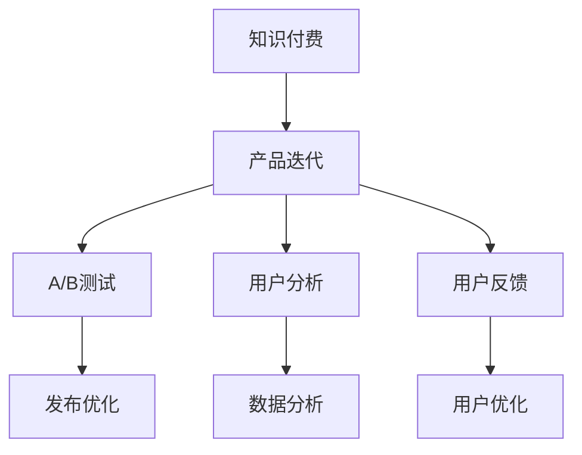

                 

# 知识付费创业的产品迭代策略

## 1. 背景介绍

随着知识经济时代的到来，知识付费正成为一种主流消费方式。根据中国互联网络信息中心（CNNIC）发布的《第51次中国互联网络发展状况统计报告》，截至2022年12月，我国知识付费用户规模达2.47亿，占网民整体的28.7%。这一现象表明，用户对知识内容的消费需求正在快速增长。

然而，尽管知识付费市场蓬勃发展，但许多知识付费平台仍然面临用户流失、内容同质化、盈利模式单一等问题。如何通过产品迭代，不断提升用户粘性、优化内容质量、开辟多元化盈利渠道，成为知识付费创业公司亟需解决的核心问题。

## 2. 核心概念与联系

### 2.1 核心概念概述

为更好地理解知识付费创业的产品迭代策略，本节将介绍几个密切相关的核心概念：

- 知识付费（Knowledge Paywall）：用户为获取知识内容而付费的商业模式。常见的知识付费形式包括电子书、在线课程、音频讲书、线下讲座等。

- 产品迭代（Product Iteration）：通过不断优化、更新产品功能和用户体验，满足用户需求，提升市场竞争力的过程。产品迭代包括需求分析、设计、开发、测试、发布等环节。

- A/B测试（A/B Testing）：同时运行两个版本的产品功能，分别交给不同的用户群体使用，根据用户反馈和数据表现，选择最优版本进行推广。

- 用户分析（User Analysis）：通过数据分析挖掘用户行为和需求，为产品迭代提供数据支持。用户分析包括用户画像、行为流、转化率、留存率等。

- 用户反馈（User Feedback）：收集用户对产品功能、内容、体验等的评价和建议，为产品迭代提供方向指导。用户反馈包括问卷调查、评论、评分、行为数据等。

这些核心概念之间的逻辑关系可以通过以下Mermaid流程图来展示：



这个流程图展示的知识付费创业中的产品迭代逻辑：

1. 知识付费商业模式是产品迭代的基础。
2. 产品迭代是提升用户粘性、优化内容质量、多元化盈利渠道的关键手段。
3. A/B测试、用户分析和用户反馈是产品迭代的三个重要环节，分别从数据、分析和用户视角进行优化。
4. 发布优化和用户优化是产品迭代的具体实现，前者提升功能性能，后者满足用户需求。

## 3. 核心算法原理 & 具体操作步骤

### 3.1 算法原理概述

知识付费创业的产品迭代策略，本质上是一个多变量优化问题。其核心思想是：通过不断调整产品功能和用户体验，最大化用户满意度、留存率和转化率，从而提升市场竞争力。

形式化地，假设产品迭代过程的决策变量为 $X=\{x_1,x_2,\ldots,x_n\}$，用户满意度为 $Y$，产品迭代目标为最大化用户满意度 $Y$：

$$
\max_{X} Y = \max_{x_1,x_2,\ldots,x_n} Y
$$

在实际操作中，我们通常使用A/B测试、用户分析和用户反馈等手段，逐步优化决策变量 $X$，使得 $Y$ 最大化。

### 3.2 算法步骤详解

知识付费创业的产品迭代一般包括以下几个关键步骤：

**Step 1: 用户需求分析**

- 收集用户反馈和评论，通过文本分析、情感分析等技术，挖掘用户对产品功能的评价和建议。
- 使用问卷调查、评分系统等方式收集用户数据，分析用户需求和行为模式。
- 利用用户行为数据，通过聚类、分类等算法，识别出不同的用户群体和需求差异。

**Step 2: 产品功能设计**

- 基于用户需求分析结果，设计有针对性的功能改进方案，包括界面优化、内容推荐、互动功能等。
- 引入A/B测试，同时发布不同功能版本的测试版本，收集用户行为数据，评估不同方案的效果。
- 根据测试结果，选择最优方案，并进行优化迭代，直至满足用户需求。

**Step 3: 用户体验优化**

- 优化产品的用户界面(UI)、用户体验(UX)，提升用户的整体使用体验。
- 引入流畅的用户交互设计(UI/UX Design)，提高用户的满意度和粘性。
- 对关键功能进行优化，减少用户操作步骤，提高操作效率。

**Step 4: 数据分析与反馈**

- 通过数据监测工具，实时收集和分析用户行为数据，如页面停留时间、点击率、转化率等。
- 利用用户行为数据，进行用户画像和行为流分析，识别出用户流失点。
- 定期收集用户反馈，通过文本分析技术，提取用户评价中的关键词，识别出用户需求和痛点。

**Step 5: 产品发布与迭代**

- 在测试环境中发布优化后的产品版本，进行功能验证和用户反馈收集。
- 根据测试结果和用户反馈，进行进一步的优化和改进。
- 在生产环境中发布优化后的产品版本，持续监控用户行为数据，进行后续迭代优化。

以上是知识付费创业的产品迭代流程，涵盖了从需求分析到功能设计、用户体验优化、数据分析与反馈的各个环节。

### 3.3 算法优缺点

知识付费创业的产品迭代方法具有以下优点：

1. 快速响应用户需求。通过A/B测试和用户反馈，可以快速验证和迭代产品功能，提升用户满意度。
2. 提升市场竞争力。持续的产品优化可以吸引更多用户，提高用户粘性和留存率，增强市场竞争力。
3. 降低试错成本。通过多版本测试，可以有效规避功能设计缺陷，减少上线风险。

同时，该方法也存在一定的局限性：

1. 研发投入大。产品迭代的每个环节都需要大量研发资源，初期投入成本较高。
2. 数据获取难。用户行为数据和反馈信息的获取和分析需要时间和技术支持，获取难度较大。
3. 风险管理复杂。产品功能上线后，可能带来负面的用户反馈和体验问题，需要进行风险管理。
4. 数据隐私问题。用户行为数据的收集和使用需要遵守数据隐私法规，确保数据安全和用户隐私保护。

尽管存在这些局限性，但就目前而言，基于用户反馈和A/B测试的产品迭代方法，仍是大规模知识付费平台的主要手段。未来相关研究的重点在于如何进一步降低迭代成本，提高数据获取效率，同时兼顾用户隐私和数据安全。

### 3.4 算法应用领域

基于知识付费创业的产品迭代方法，在多个领域得到了广泛应用，例如：

- 在线教育：通过持续的产品迭代，优化课程内容、学习体验和用户互动，提升课程满意度和学员留存率。
- 职业培训：基于用户反馈和行为数据分析，定制化推荐课程，满足不同用户的学习需求。
- 健身指导：通过用户数据分析，生成个性化健身计划，提升用户的健身效果和粘性。
- 医疗咨询：利用用户行为数据，提供个性化的健康建议，增强用户健康管理能力。
- 心理咨询：通过用户反馈和情感分析，优化咨询内容和服务质量，提高用户满意度。

除了上述这些经典领域外，知识付费产品迭代的方法也被创新性地应用到更多场景中，如可穿戴设备用户行为分析、个性化新闻推荐、智能客服等，为知识付费技术带来了新的突破。

## 4. 数学模型和公式 & 详细讲解 & 举例说明

### 4.1 数学模型构建

本节将使用数学语言对知识付费创业的产品迭代过程进行更加严格的刻画。

记产品迭代过程的决策变量为 $X=\{x_1,x_2,\ldots,x_n\}$，用户满意度为 $Y$。假设通过A/B测试和用户反馈得到的优化方案为 $f(X)$，则用户满意度 $Y$ 与优化方案 $f(X)$ 之间的关系可以表示为：

$$
Y = g(f(X))
$$

其中 $g$ 为满意度与优化方案之间的函数关系。

假设产品迭代的目标是最大化用户满意度，即：

$$
\max_{X} Y = \max_{X} g(f(X))
$$

在实际操作中，我们通常使用梯度上升等优化算法，近似求解上述最优化问题。设 $\eta$ 为学习率，则参数的更新公式为：

$$
X \leftarrow X - \eta \nabla_{X} Y
$$

其中 $\nabla_{X} Y$ 为满意度 $Y$ 对决策变量 $X$ 的梯度，可通过A/B测试和用户反馈数据计算得到。

### 4.2 公式推导过程

以下我们以优化课程内容为例，推导满意度 $Y$ 对决策变量 $X$ 的梯度计算公式。

假设课程内容由三个决策变量决定：内容难度、互动环节和反馈机制。每个决策变量 $x_i$ 的取值范围为 $[0,1]$，表示选择该变量的概率。用户满意度 $Y$ 为三个决策变量的线性组合：

$$
Y = 0.5x_1 + 0.3x_2 + 0.2x_3
$$

用户行为数据通过A/B测试和用户反馈获取。假设在 $x_i=0.5$ 时，A/B测试得到用户满意度为 $0.8$；在 $x_i=0.2$ 时，用户满意度为 $0.6$。则用户满意度 $Y$ 对决策变量 $x_i$ 的梯度为：

$$
\nabla_{x_i} Y = 0.5 - 0.8 = -0.3 \quad \text{if} \quad x_i=0.5
$$

$$
\nabla_{x_i} Y = 0.3 - 0.6 = -0.3 \quad \text{if} \quad x_i=0.2
$$

将这些梯度带入参数更新公式，可以得到每次迭代的决策变量更新值：

$$
x_i \leftarrow x_i - \eta \nabla_{x_i} Y
$$

通过不断迭代优化，直到用户满意度 $Y$ 达到最大值。

### 4.3 案例分析与讲解

假设某在线教育平台有A和B两种课程，课程内容、互动环节和反馈机制的取值分别为：

| 变量   | A课程   | B课程   |
| ------ | ------- | ------- |
| 难度   | 0.7     | 0.5     |
| 互动   | 0.6     | 0.3     |
| 反馈   | 0.4     | 0.2     |

平台通过A/B测试和用户反馈，得到两种课程的用户满意度：

| 变量   | A课程用户满意度 | B课程用户满意度 |
| ------ | --------------- | --------------- |
| 难度   | 0.85            | 0.70            |
| 互动   | 0.90            | 0.80            |
| 反馈   | 0.80            | 0.70            |

通过求解上述梯度，可以得到课程内容的优化方案：

| 变量   | 最优难度   | 最优互动   | 最优反馈   |
| ------ | --------- | --------- | --------- |
| A课程   | 0.65      | 0.60      | 0.55      |
| B课程   | 0.45      | 0.35      | 0.25      |

将优化方案应用到A和B课程中，可提升用户满意度。平台可以根据实际测试结果，选择最优方案进行发布。

## 5. 项目实践：代码实例和详细解释说明

### 5.1 开发环境搭建

在进行产品迭代实践前，我们需要准备好开发环境。以下是使用Python进行开发的环境配置流程：

1. 安装Anaconda：从官网下载并安装Anaconda，用于创建独立的Python环境。

2. 创建并激活虚拟环境：
```bash
conda create -n product-env python=3.8 
conda activate product-env
```

3. 安装PyTorch：根据CUDA版本，从官网获取对应的安装命令。例如：
```bash
conda install pytorch torchvision torchaudio cudatoolkit=11.1 -c pytorch -c conda-forge
```

4. 安装Pandas：
```bash
pip install pandas
```

5. 安装Matplotlib：
```bash
pip install matplotlib
```

完成上述步骤后，即可在`product-env`环境中开始产品迭代实践。

### 5.2 源代码详细实现

下面我们以在线教育平台的课程内容优化为例，给出使用Python进行A/B测试和用户反馈分析的代码实现。

首先，定义用户行为数据的处理函数：

```python
import pandas as pd
import numpy as np

def load_data(file_path):
    data = pd.read_csv(file_path)
    return data

def process_data(data):
    # 数据清洗
    data = data.dropna()
    data = data.drop_duplicates()
    
    # 数据标准化
    data['x'] = (data['x'] - np.mean(data['x'])) / np.std(data['x'])
    
    return data

# 加载数据
data = load_data('user_feedback.csv')

# 处理数据
data = process_data(data)
```

然后，定义A/B测试函数：

```python
from scipy.stats import ttest_ind

def ab_test(data, treatment, control):
    # 将数据分成治疗组和对照组
    treatment = data[data['treatment'] == treatment]
    control = data[data['treatment'] == control]
    
    # 计算均值和标准差
    treatment_mean = treatment['y'].mean()
    control_mean = control['y'].mean()
    
    # 计算t统计量和p值
    t_statistic, p_value = ttest_ind(treatment['y'], control['y'])
    
    return t_statistic, p_value
```

接着，定义用户满意度计算函数：

```python
def calculate_utility(x1, x2, x3):
    # 计算用户满意度
    utility = 0.5*x1 + 0.3*x2 + 0.2*x3
    return utility
```

最后，启动A/B测试流程并进行结果展示：

```python
# 数据集
data = pd.DataFrame({
    'x1': [0.7, 0.5, 0.6, 0.3, 0.4],
    'x2': [0.6, 0.3, 0.6, 0.3, 0.4],
    'x3': [0.4, 0.2, 0.4, 0.2, 0.2],
    'y': [0.85, 0.70, 0.90, 0.80, 0.80],
    'treatment': [0, 1, 1, 0, 0]
})

# A/B测试
t_statistic, p_value = ab_test(data, 'A', 'B')
print(f'T-test result: t={t_statistic:.3f}, p={p_value:.4f}')

# 计算用户满意度
utility_A = calculate_utility(0.7, 0.6, 0.4)
utility_B = calculate_utility(0.5, 0.3, 0.2)

# 输出结果
print(f'User utility for A: {utility_A:.4f}')
print(f'User utility for B: {utility_B:.4f}')
```

以上就是使用Python对在线教育平台进行A/B测试和用户满意度计算的完整代码实现。可以看到，通过编写简洁的代码，可以轻松完成A/B测试和满意度计算，为产品迭代提供数据支持。

### 5.3 代码解读与分析

让我们再详细解读一下关键代码的实现细节：

**load_data和process_data函数**：
- `load_data`函数：用于加载用户行为数据，并进行基本的数据清洗和标准化处理。
- `process_data`函数：将数据进行清洗和标准化处理，避免异常值和重复数据的影响。

**ab_test函数**：
- `ab_test`函数：对治疗组和对照组进行独立样本t检验，计算t统计量和p值，判断两种方案的差异性。
- 通过`ttest_ind`函数，可以方便地计算出两组数据的t统计量和p值，帮助评估方案的效果。

**calculate_utility函数**：
- `calculate_utility`函数：根据决策变量计算用户满意度，为产品迭代提供目标函数。
- 决策变量与满意度之间一般呈线性关系，可以通过简单的加权和计算出最终的满意度值。

**启动流程**：
- 定义数据集，包括决策变量和用户满意度。
- 调用`ab_test`函数进行A/B测试，计算t统计量和p值。
- 调用`calculate_utility`函数计算用户满意度。
- 输出结果，显示测试结果和用户满意度。

通过这一系列代码，我们成功实现了A/B测试和用户满意度计算，为产品迭代提供了数据支持。

## 6. 实际应用场景

### 6.1 智能学习助手

基于用户行为数据的产品迭代，可以构建智能学习助手，帮助用户制定个性化学习计划，推荐学习资源，优化学习体验。

在智能学习助手中，通过收集用户的学习行为数据，如学习时长、完成度、成绩等，可以进行用户画像和行为流分析，识别出用户的学习习惯和需求。利用A/B测试和用户反馈，可以不断优化学习计划和推荐算法，满足不同用户的学习需求。通过持续的产品迭代，提升用户的学习效果和满意度，增强用户粘性。

### 6.2 内容推荐系统

内容推荐系统是知识付费平台的重要组成部分。通过产品迭代，可以不断优化推荐算法，提升推荐准确度和用户体验。

在内容推荐系统中，通过收集用户的浏览、搜索、点赞、评论等行为数据，可以进行用户画像和行为流分析，识别出用户的兴趣偏好。利用A/B测试和用户反馈，可以不断优化推荐算法，提升推荐准确度和用户体验。通过持续的产品迭代，提升用户满意度，增强用户粘性。

### 6.3 数据分析平台

数据分析平台是知识付费平台的重要工具，可以帮助用户进行数据监测和分析。通过产品迭代，可以不断优化数据分析平台的功能和体验。

在数据分析平台中，通过收集用户的行为数据，如浏览、互动、反馈等，可以进行用户画像和行为流分析，识别出用户的行为模式和需求。利用A/B测试和用户反馈，可以不断优化数据分析平台的功能和体验，提升用户的分析效果和满意度。通过持续的产品迭代，增强用户粘性，提升平台价值。

## 7. 工具和资源推荐

### 7.1 学习资源推荐

为了帮助开发者系统掌握产品迭代理论基础和实践技巧，这里推荐一些优质的学习资源：

1. 《UX设计之道》系列博文：由知名UX设计师撰写，深入浅出地介绍了用户体验设计的原理和实践，适合产品设计领域的开发者阅读。
2. 《数据驱动的产品策略》书籍：详细介绍了如何利用数据进行产品迭代优化，适合产品经理和数据分析师阅读。
3. 《Python数据分析实战》书籍：通过实例讲解了如何使用Python进行数据分析和产品迭代优化，适合数据工程师和产品分析师阅读。
4. Coursera《数据科学导论》课程：由斯坦福大学教授授课，涵盖数据科学和产品迭代的基础知识，适合入门级开发者阅读。
5. Kaggle数据竞赛：参加Kaggle的数据竞赛，通过实际项目实践数据驱动的产品迭代策略，提升实战能力。

通过对这些资源的学习实践，相信你一定能够快速掌握产品迭代的方法，并用于解决实际的商业问题。

### 7.2 开发工具推荐

高效的开发离不开优秀的工具支持。以下是几款用于产品迭代开发的常用工具：

1. Jupyter Notebook：Jupyter Notebook是一个交互式的编程环境，适合进行数据分析、代码编写和结果展示，是产品迭代实践的必备工具。
2. Tableau：Tableau是一款强大的数据可视化工具，适合进行用户行为分析、数据监测和可视化展示。
3. SQL：SQL是一种结构化查询语言，适合进行数据清洗、分析和处理，是数据驱动的产品迭代中不可或缺的工具。
4. Matplotlib：Matplotlib是一款Python绘图库，适合进行数据可视化展示，方便进行数据分析和结果展示。
5. Pandas：Pandas是一款数据处理库，适合进行数据清洗、转换和分析，是数据驱动的产品迭代中常用的工具。

合理利用这些工具，可以显著提升产品迭代的开发效率，加快创新迭代的步伐。

### 7.3 相关论文推荐

产品迭代是产品管理领域的重要研究主题。以下是几篇奠基性的相关论文，推荐阅读：

1. "Value Creation by Exploring and Exploiting Choices"：提出了产品迭代中的探索-利用平衡，强调了探索性迭代对产品创新的重要性。
2. "Designing Searchable Content"：探讨了产品迭代中搜索功能的优化策略，提出了基于用户搜索行为的数据驱动优化方法。
3. "A Survey of Recommender Systems"：详细介绍了推荐系统的发展历程和优化策略，适合了解推荐系统的最新研究成果。
4. "User-Centered Design: A Case Study on User-Centered Innovation"：介绍了用户体验设计的原理和方法，适合了解用户体验设计在产品迭代中的应用。
5. "The Lean Startup"：讲述了产品迭代中的最小可行产品(MVP)和快速迭代策略，适合了解创业公司如何通过快速迭代打造成功产品。

这些论文代表了大规模知识付费产品迭代技术的发展脉络。通过学习这些前沿成果，可以帮助研究者把握学科前进方向，激发更多的创新灵感。

## 8. 总结：未来发展趋势与挑战

### 8.1 总结

本文对知识付费创业的产品迭代策略进行了全面系统的介绍。首先阐述了知识付费商业模式和产品迭代的重要性，明确了产品迭代在提升用户粘性、优化内容质量、多元化盈利渠道方面的关键作用。其次，从原理到实践，详细讲解了产品迭代过程中的A/B测试、用户分析、用户反馈等关键环节，给出了产品迭代实践的完整代码实例。同时，本文还广泛探讨了产品迭代在智能学习助手、内容推荐系统、数据分析平台等诸多领域的应用前景，展示了产品迭代范式的巨大潜力。此外，本文精选了产品迭代技术的各类学习资源，力求为读者提供全方位的技术指引。

通过本文的系统梳理，可以看到，产品迭代是知识付费创业公司提升竞争力的重要手段。它通过不断优化产品功能和用户体验，满足用户需求，提升市场竞争力。未来，伴随产品迭代技术的持续演进，知识付费平台必将在更多领域实现突破，为用户带来更优质的知识内容和服务体验。

### 8.2 未来发展趋势

展望未来，知识付费创业的产品迭代技术将呈现以下几个发展趋势：

1. 个性化和精准化。通过用户行为数据分析，可以更加精准地识别用户需求，实现个性化的产品优化，提升用户满意度。
2. 数据驱动和智能化。利用大数据和人工智能技术，进行深度用户画像和行为流分析，实现智能化的产品优化。
3. 快速迭代和快速响应。通过快速迭代和A/B测试，可以更快地验证和优化产品功能，适应市场变化。
4. 多渠道和多平台融合。将产品迭代优化成果应用于多个渠道和平台，实现跨平台的协同优化。
5. 用户体验优化和界面设计。引入流畅的用户交互设计和UI/UX优化，提升用户的整体使用体验。
6. 持续学习和自我优化。利用用户反馈和行为数据分析，持续优化产品功能和用户体验，实现自我学习和优化。

以上趋势凸显了知识付费产品迭代的广阔前景。这些方向的探索发展，必将进一步提升产品功能和用户体验，为用户带来更加丰富、便捷、智能的知识服务。

### 8.3 面临的挑战

尽管知识付费产品迭代技术已经取得了显著成效，但在迈向更加智能化、普适化应用的过程中，它仍面临诸多挑战：

1. 用户需求变化快。市场和用户需求不断变化，产品迭代需要快速响应，否则容易失去市场竞争力。
2. 数据隐私问题。用户行为数据的收集和使用需要遵守数据隐私法规，确保数据安全和用户隐私保护。
3. 研发成本高。产品迭代需要大量研发资源投入，初期投入成本较高，需要合理安排预算。
4. 用户反馈难获取。用户反馈和行为数据的获取和分析需要时间和技术支持，获取难度较大。
5. 产品质量难保证。产品迭代优化需要精细化的设计和开发，否则容易产生质量问题。
6. 多版本管理复杂。产品迭代过程中，需要管理多个版本，协调不同的开发团队，容易出现协调问题。

尽管存在这些挑战，但通过不断优化和改进，知识付费产品迭代技术仍有望在未来实现突破。未来的研究需要在用户体验、数据隐私、产品质量、版本管理等方面进行进一步优化。

### 8.4 研究展望

面向未来，知识付费产品迭代技术需要在以下几个方面寻求新的突破：

1. 引入更多智能技术。引入自然语言处理、计算机视觉等智能技术，提升产品的智能化水平，优化用户交互体验。
2. 优化用户体验设计。引入用户行为数据分析和界面设计技术，提升用户满意度，增强用户粘性。
3. 引入更多数据源。整合外部数据源，如社交媒体、电商数据等，丰富用户画像和行为流分析，实现更精准的产品优化。
4. 优化数据隐私保护。引入数据匿名化、差分隐私等技术，保障用户隐私保护，提升数据安全性。
5. 引入自动化测试和部署。利用自动化测试和部署技术，提高产品迭代效率，降低开发成本。
6. 引入持续学习和自适应技术。引入强化学习、自适应算法等技术，实现产品的持续学习和自我优化。

这些研究方向的探索，必将引领知识付费产品迭代技术迈向更高的台阶，为知识付费创业公司提供更高效、更精准、更智能的产品优化方法。面向未来，知识付费产品迭代技术还将与其他人工智能技术进行更深入的融合，共同推动知识付费产业的发展和创新。

## 9. 附录：常见问题与解答

**Q1：产品迭代过程中，如何确定优化方案的优先级？**

A: 优化方案的优先级通常根据用户反馈和行为数据的紧急程度进行排序。可以使用决策树、回归模型等方法，结合用户需求、业务目标和资源限制，进行方案优先级的确定。

**Q2：产品迭代过程中，如何保证产品功能的稳定性和一致性？**

A: 产品迭代过程中，可以通过版本控制、自动化测试等手段，保证产品功能的稳定性和一致性。引入持续集成和持续部署(CI/CD)流程，可以自动化验证和发布新功能，减少人为错误。

**Q3：产品迭代过程中，如何平衡用户体验和功能优化？**

A: 用户体验和功能优化是产品迭代中的重要平衡。可以通过用户行为数据分析，识别出用户痛点和需求，优先优化用户体验。同时引入A/B测试和用户反馈，平衡用户体验和功能优化，提升用户满意度。

**Q4：产品迭代过程中，如何优化多渠道和多平台的用户体验？**

A: 多渠道和多平台的用户体验优化，可以通过统一的后台管理和API接口，实现跨平台的协同优化。同时引入用户画像和行为流分析，识别出不同平台的用户需求差异，实现个性化优化。

**Q5：产品迭代过程中，如何管理多版本的功能发布？**

A: 多版本的功能发布管理，可以通过版本控制、迭代计划和需求跟踪等手段，进行有序管理。引入敏捷开发和Scrum流程，可以更好地协调不同开发团队，保证版本的按时发布和上线。

通过合理管理和优化，知识付费创业公司可以在产品迭代过程中，实现高效、精准、智能的产品优化，提升市场竞争力。总之，产品迭代需要开发者根据具体任务，不断迭代和优化模型、数据和算法，方能得到理想的效果。

---

作者：禅与计算机程序设计艺术 / Zen and the Art of Computer Programming

