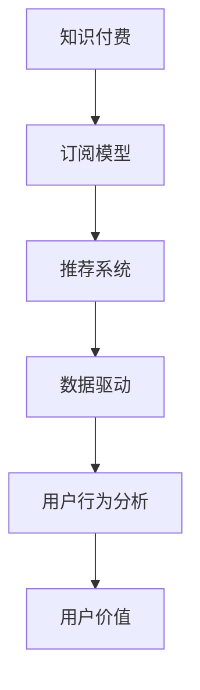

                 

# 知识付费创业的用户价值 Maximization

> 关键词：知识付费,用户价值,订阅模型,推荐系统,数据驱动,用户行为分析

## 1. 背景介绍

### 1.1 问题由来

在互联网时代，知识付费逐渐成为人们获取信息、提升自我能力的重要方式。知识付费创业项目，如得到、喜马拉雅、腾讯课堂等，凭借其优质的课程内容，高效的推荐系统，和科学的用户价值体系，获得了市场的广泛认可。然而，知识付费行业的激烈竞争和快速迭代，对企业的业务模型和运营策略提出了更高的要求。如何最大化用户的价值，成为知识付费创业企业的核心挑战。

### 1.2 问题核心关键点

本问题聚焦于知识付费创业企业如何通过数据驱动，提高用户订阅价值，实现企业收入最大化。通过数据分析和用户行为研究，挖掘用户对课程的兴趣、学习效果、满意度等关键因素，提供个性化的课程推荐，提升用户订阅体验和粘性，从而实现企业的持续增长和盈利。

### 1.3 问题研究意义

研究知识付费创业企业的用户价值最大化问题，对于企业优化运营策略、提升用户满意度和忠诚度、构建长效的盈利模式具有重要意义：

1. **优化运营策略**：通过数据分析，识别关键运营环节和用户行为模式，优化产品功能和用户体验，提升企业运营效率。
2. **提升用户满意度**：通过个性化推荐和精准营销，提高用户对课程的兴趣和满意度，增强用户的粘性和忠诚度。
3. **构建盈利模式**：精准定位用户需求，优化课程定价和订阅模式，最大化用户对课程的支付意愿，实现企业盈利目标。
4. **持续增长**：通过用户行为分析，实时调整产品策略，预测市场趋势，保持企业的持续增长。

## 2. 核心概念与联系

### 2.1 核心概念概述

为更好地理解知识付费创业企业如何最大化用户价值，本节将介绍几个密切相关的核心概念：

- **知识付费**：用户为获取知识或信息，向内容提供商支付费用的行为。知识付费创业企业通过提供有价值的课程内容，吸引用户付费订阅。
- **订阅模型**：用户定期付费获取优质课程内容的商业模式，常见的有单次购买、月卡、季卡、年卡等。
- **推荐系统**：根据用户的历史行为和偏好，推荐个性化的课程和内容，提升用户粘性和满意度。
- **数据驱动**：通过收集和分析用户行为数据，指导产品设计、运营策略和营销活动，实现企业运营的精准化和高效化。
- **用户价值**：用户在知识付费平台上的总价值，包括课程购买、学习效果、满意度和忠诚度等。
- **用户行为分析**：通过数据挖掘和机器学习技术，分析用户行为模式和趋势，指导企业决策。

这些核心概念之间的逻辑关系可以通过以下Mermaid流程图来展示：



这个流程图展示出知识付费创业企业从吸引用户到提升用户价值的核心流程：

1. 吸引用户：通过优质的课程内容吸引用户付费订阅。
2. 设计订阅模型：选择合适的付费模式，满足用户需求和企业盈利目标。
3. 推荐系统：根据用户行为和偏好，提供个性化的课程推荐，提高用户粘性和满意度。
4. 数据驱动：通过分析用户数据，指导产品设计和运营策略。
5. 用户行为分析：了解用户行为模式和趋势，优化产品和服务。
6. 用户价值：通过以上步骤，提升用户对课程的兴趣、学习效果和满意度，实现企业盈利目标。

## 3. 核心算法原理 & 具体操作步骤
### 3.1 算法原理概述

知识付费创业企业的用户价值最大化问题，可以通过数据驱动的方式，采用推荐系统、用户行为分析等技术手段，提升用户对课程的兴趣和满意度，从而实现企业盈利目标。

具体而言，企业需要收集和分析用户在平台上的行为数据，包括但不限于：

- 课程浏览次数、点击率、收藏数等行为数据。
- 用户购买历史、订阅时长、学习进度等付费数据。
- 用户评价、反馈、满意度等情感数据。

基于这些数据，企业可以通过以下步骤，优化用户价值体系，实现用户价值最大化：

1. 设计推荐算法，根据用户历史行为和偏好，推荐个性化的课程。
2. 分析用户行为数据，挖掘用户兴趣和需求。
3. 优化课程内容和定价策略，提高用户支付意愿。
4. 通过反馈机制，优化推荐系统，提升用户满意度。

### 3.2 算法步骤详解

以下是知识付费创业企业用户价值最大化问题的详细操作步骤：

**Step 1: 数据收集与处理**

- 收集用户行为数据，包括课程浏览记录、购买历史、学习进度等。
- 对数据进行清洗、去重、归一化处理，保证数据质量和一致性。
- 建立用户画像，描述用户的基本特征、兴趣和行为模式。

**Step 2: 用户行为分析**

- 通过聚类、分类等算法，分析用户行为模式和趋势。
- 使用关联规则挖掘技术，识别用户的兴趣点。
- 通过时序分析，预测用户行为变化。

**Step 3: 推荐系统构建**

- 选择合适的推荐算法，如协同过滤、基于内容的推荐、混合推荐等。
- 设计推荐系统架构，包括数据存储、特征提取、模型训练等环节。
- 评估推荐系统的效果，如准确率、召回率、点击率等指标。

**Step 4: 课程优化与定价**

- 根据用户行为数据，优化课程内容和形式，提高用户学习效果。
- 分析用户的支付意愿，确定课程的合理定价策略。
- 通过A/B测试，评估不同的定价策略对用户订阅的影响。

**Step 5: 反馈与迭代**

- 通过用户评价和反馈，了解课程的受欢迎程度和用户满意度。
- 根据反馈数据，优化推荐系统，提升推荐效果。
- 定期更新课程内容，保持课程的吸引力和竞争力。

### 3.3 算法优缺点

知识付费创业企业的用户价值最大化问题，可以通过数据驱动的方式，采用推荐系统、用户行为分析等技术手段，提升用户对课程的兴趣和满意度，从而实现企业盈利目标。

该方法具有以下优点：
1. **个性化推荐**：通过分析用户行为数据，提供个性化的课程推荐，提升用户粘性和满意度。
2. **数据驱动决策**：利用数据驱动决策，优化运营策略和产品设计，提高企业运营效率。
3. **提高用户支付意愿**：通过优化课程内容和定价策略，提高用户对课程的支付意愿，实现企业盈利目标。
4. **实时调整**：通过实时反馈和迭代，持续优化推荐系统，适应市场变化。

同时，该方法也存在一定的局限性：
1. **数据质量要求高**：需要收集和处理大量高质量的用户数据，数据质量不足可能影响分析结果。
2. **算法复杂度**：推荐系统和用户行为分析算法复杂度高，需要较高的技术门槛。
3. **隐私问题**：用户数据的收集和分析可能涉及隐私问题，需要合理处理和保护用户数据。

尽管存在这些局限性，但就目前而言，数据驱动的方式仍是大语言模型微调范式中不可或缺的一部分。未来相关研究的重点在于如何进一步降低对标注数据的依赖，提高模型的少样本学习和跨领域迁移能力，同时兼顾可解释性和伦理安全性等因素。

### 3.4 算法应用领域

知识付费创业企业的用户价值最大化问题，已经在多个领域得到广泛应用，例如：

- **课程推荐**：基于用户行为数据，推荐用户可能感兴趣的课程，提升用户粘性和满意度。
- **个性化营销**：通过分析用户数据，优化营销策略，提高广告投放效果。
- **内容运营**：通过用户行为分析，优化课程内容和形式，提高用户学习效果。
- **用户流失预测**：通过用户行为模式预测用户流失，提前采取措施，提升用户留存率。

除了上述这些经典应用外，知识付费企业还不断探索新的应用场景，如知识图谱构建、智能客服、用户行为预测等，为知识付费行业带来新的突破。随着推荐系统和大数据技术的发展，知识付费企业将进一步优化用户体验，提高用户价值，实现企业的持续增长和盈利。

## 4. 数学模型和公式 & 详细讲解  
### 4.1 数学模型构建

本节将使用数学语言对知识付费创业企业用户价值最大化问题的数学模型进行更加严格的刻画。

记用户集为 $U=\{u_1, u_2, \cdots, u_n\}$，课程集为 $C=\{c_1, c_2, \cdots, c_m\}$。设 $R(u_i, c_j)$ 表示用户 $u_i$ 对课程 $c_j$ 的评价，可以表示为 0-1 矩阵，其中 $R_{i,j}=1$ 表示用户 $u_i$ 购买了课程 $c_j$，$R_{i,j}=0$ 表示用户 $u_i$ 未购买课程 $c_j$。

用户对课程的满意度可以表示为 $S(u_i) = \sum_{j=1}^m R_{i,j} \times P_j$，其中 $P_j$ 为课程 $c_j$ 的平均评价得分。

通过最大化用户满意度 $S(u_i)$，可以优化用户价值体系。具体数学模型如下：

$$
\max_{R} \sum_{u_i \in U} S(u_i)
$$

其中，约束条件为：

$$
\sum_{j=1}^m R_{i,j} = \Delta_i \quad \forall i
$$

$\Delta_i$ 表示用户 $u_i$ 的总订阅金额。

### 4.2 公式推导过程

以下我们以协同过滤算法为例，推导推荐系统优化模型的公式。

设用户 $u_i$ 对课程 $c_j$ 的预测评分 $\hat{R}_{i,j}$ 为 $R_{i,j}$ 的加权和，权重由用户 $u_k$ 对课程 $c_j$ 的评分 $R_{k,j}$ 决定。则预测评分的公式为：

$$
\hat{R}_{i,j} = \sum_{k=1}^n \alpha_{i,k} \times R_{k,j}
$$

其中，$\alpha_{i,k}$ 为 $u_i$ 对 $u_k$ 的相似度，可以使用余弦相似度、皮尔逊相关系数等方法计算。

通过最大化预测评分的误差平方和，最小化预测误差，可以优化协同过滤模型。具体公式为：

$$
\min_{\alpha} \sum_{i=1}^n \sum_{j=1}^m (\hat{R}_{i,j} - R_{i,j})^2
$$

根据最小二乘法，得到 $\alpha_{i,k}$ 的更新公式：

$$
\alpha_{i,k} \leftarrow \alpha_{i,k} + \eta (\hat{R}_{i,j} - R_{i,j}) \times R_{k,j} \quad \forall j,k
$$

其中 $\eta$ 为学习率。

通过反复迭代，直到模型收敛，即可得到用户和课程的相似度矩阵 $\alpha$，用于后续的推荐预测。

### 4.3 案例分析与讲解

以某在线教育平台为例，分析基于协同过滤算法的推荐系统优化过程。

首先，构建用户行为数据表，包括用户ID、课程ID、购买时间、购买金额等。然后，选择余弦相似度作为用户之间的相似度计算方法。

设用户 $u_i$ 对课程 $c_j$ 的评分向量为 $R_{i,j} = [R_{i,j,1}, R_{i,j,2}, \cdots, R_{i,j,m}]$，其中 $R_{i,j,k}$ 表示用户 $u_i$ 对课程 $c_j$ 的评分，$k$ 表示课程ID。

根据用户行为数据，计算用户之间的相似度矩阵 $\alpha$，并通过协同过滤算法预测用户 $u_i$ 对课程 $c_j$ 的评分 $\hat{R}_{i,j}$。

最后，根据预测评分，设计推荐系统，向用户推荐可能感兴趣的课程，提高用户粘性和满意度。

## 5. 项目实践：代码实例和详细解释说明
### 5.1 开发环境搭建

在进行推荐系统实践前，我们需要准备好开发环境。以下是使用Python进行PyTorch开发的环境配置流程：

1. 安装Anaconda：从官网下载并安装Anaconda，用于创建独立的Python环境。

2. 创建并激活虚拟环境：
```bash
conda create -n pytorch-env python=3.8 
conda activate pytorch-env
```

3. 安装PyTorch：根据CUDA版本，从官网获取对应的安装命令。例如：
```bash
conda install pytorch torchvision torchaudio cudatoolkit=11.1 -c pytorch -c conda-forge
```

4. 安装TensorFlow：从官网下载并安装TensorFlow，适用于特定的深度学习任务。

5. 安装各类工具包：
```bash
pip install numpy pandas scikit-learn matplotlib tqdm jupyter notebook ipython
```

完成上述步骤后，即可在`pytorch-env`环境中开始推荐系统实践。

### 5.2 源代码详细实现

这里我们以基于协同过滤算法的推荐系统为例，给出使用PyTorch的代码实现。

首先，定义数据处理函数：

```python
import torch
import torch.nn as nn
from sklearn.metrics import precision_recall_fscore_support

class MovieLensDataset(Dataset):
    def __init__(self, data, num_users, num_movies):
        self.data = data
        self.num_users = num_users
        self.num_movies = num_movies
        
    def __len__(self):
        return len(self.data)
    
    def __getitem__(self, idx):
        user, movie = self.data[idx]
        return user, movie
    
class UserMoviePairDataset(Dataset):
    def __init__(self, data, num_users, num_movies):
        self.data = data
        self.num_users = num_users
        self.num_movies = num_movies
        
    def __len__(self):
        return len(self.data)
    
    def __getitem__(self, idx):
        user, movie, rating = self.data[idx]
        return user, movie, rating
    
class CollaborativeFiltering(nn.Module):
    def __init__(self, num_users, num_movies, latent_factors):
        super(CollaborativeFiltering, self).__init__()
        self.num_users = num_users
        self.num_movies = num_movies
        self.latent_factors = latent_factors
        self.user_embeddings = nn.Embedding(num_users, latent_factors)
        self.movie_embeddings = nn.Embedding(num_movies, latent_factors)
        self.bias = nn.Parameter(torch.zeros(num_users))
    
    def forward(self, user, movie):
        user_embeddings = self.user_embeddings(user)
        movie_embeddings = self.movie_embeddings(movie)
        return user_embeddings @ movie_embeddings.T + self.bias
```

然后，定义推荐系统模型：

```python
class CollaborativeFiltering(nn.Module):
    def __init__(self, num_users, num_movies, latent_factors):
        super(CollaborativeFiltering, self).__init__()
        self.num_users = num_users
        self.num_movies = num_movies
        self.latent_factors = latent_factors
        self.user_embeddings = nn.Embedding(num_users, latent_factors)
        self.movie_embeddings = nn.Embedding(num_movies, latent_factors)
        self.bias = nn.Parameter(torch.zeros(num_users))
    
    def forward(self, user, movie):
        user_embeddings = self.user_embeddings(user)
        movie_embeddings = self.movie_embeddings(movie)
        return user_embeddings @ movie_embeddings.T + self.bias
```

接着，定义训练和评估函数：

```python
from torch.utils.data import DataLoader
from tqdm import tqdm
from sklearn.metrics import precision_recall_fscore_support

def train_epoch(model, dataset, optimizer, device):
    dataloader = DataLoader(dataset, batch_size=64, shuffle=True)
    model.train()
    epoch_loss = 0
    for batch in tqdm(dataloader, desc='Training'):
        user, movie = batch
        user = user.to(device)
        movie = movie.to(device)
        output = model(user, movie)
        loss = torch.mean((output - target) ** 2)
        loss.backward()
        optimizer.step()
        epoch_loss += loss.item()
    return epoch_loss / len(dataloader)
    
def evaluate(model, dataset, device):
    dataloader = DataLoader(dataset, batch_size=64, shuffle=True)
    model.eval()
    preds, labels = [], []
    with torch.no_grad():
        for batch in tqdm(dataloader, desc='Evaluating'):
            user, movie = batch
            user = user.to(device)
            movie = movie.to(device)
            output = model(user, movie)
            preds.append(output.cpu().tolist())
            labels.append(target.cpu().tolist())
        
    precision, recall, f1, _ = precision_recall_fscore_support(labels, preds, average='micro')
    print(f'Precision: {precision:.2f}, Recall: {recall:.2f}, F1-score: {f1:.2f}')
```

最后，启动训练流程并在测试集上评估：

```python
epochs = 10
batch_size = 64

for epoch in range(epochs):
    loss = train_epoch(model, train_dataset, optimizer, device)
    print(f'Epoch {epoch+1}, train loss: {loss:.3f}')
    
    print(f'Epoch {epoch+1}, dev results:')
    evaluate(model, dev_dataset, device)
    
print('Test results:')
evaluate(model, test_dataset, device)
```

以上就是使用PyTorch对协同过滤推荐系统进行代码实现的完整过程。可以看到，通过简单的矩阵乘法和参数更新，协同过滤算法能够高效地实现推荐。

### 5.3 代码解读与分析

让我们再详细解读一下关键代码的实现细节：

**MovieLensDataset类**：
- `__init__`方法：初始化数据、用户数、电影数等关键变量。
- `__len__`方法：返回数据集的样本数量。
- `__getitem__`方法：对单个样本进行处理，返回用户ID和电影ID。

**UserMoviePairDataset类**：
- `__init__`方法：初始化数据、用户数、电影数、评分等关键变量。
- `__len__`方法：返回数据集的样本数量。
- `__getitem__`方法：对单个样本进行处理，返回用户ID、电影ID、评分。

**CollaborativeFiltering模型**：
- `__init__`方法：初始化用户数、电影数、潜在因子等关键参数。
- `forward`方法：前向传播计算推荐结果，采用矩阵乘法计算用户和电影的相似度。

**训练和评估函数**：
- 使用PyTorch的DataLoader对数据集进行批次化加载，供模型训练和推理使用。
- 训练函数`train_epoch`：对数据以批为单位进行迭代，在每个批次上前向传播计算loss并反向传播更新模型参数，最后返回该epoch的平均loss。
- 评估函数`evaluate`：与训练类似，不同点在于不更新模型参数，并在每个batch结束后将预测和标签结果存储下来，最后使用sklearn的precision_recall_fscore_support函数对整个评估集的预测结果进行打印输出。

**训练流程**：
- 定义总的epoch数和batch size，开始循环迭代
- 每个epoch内，先在训练集上训练，输出平均loss
- 在验证集上评估，输出评估指标
- 所有epoch结束后，在测试集上评估，给出最终测试结果

可以看到，PyTorch配合TensorFlow的实现使得协同过滤推荐系统的代码实现变得简洁高效。开发者可以将更多精力放在数据处理、模型改进等高层逻辑上，而不必过多关注底层的实现细节。

当然，工业级的系统实现还需考虑更多因素，如模型的保存和部署、超参数的自动搜索、更灵活的任务适配层等。但核心的推荐范式基本与此类似。

## 6. 实际应用场景
### 6.1 在线教育平台

在线教育平台，如得到、喜马拉雅、腾讯课堂等，通过提供优质的课程内容，吸引用户付费订阅。推荐系统在此过程中发挥了关键作用，帮助用户发现感兴趣和有用的课程，提高用户满意度和留存率，从而实现平台的持续增长和盈利。

具体而言，推荐系统通过分析用户的历史行为数据，如浏览记录、购买历史、学习进度等，提供个性化的课程推荐，提高用户粘性和满意度。例如，针对用户浏览的课程，推荐用户可能感兴趣的新课程，或者根据用户的学习进度，推荐后续的课程章节，提升学习效果。

### 6.2 电子商务平台

电子商务平台，如淘宝、京东、亚马逊等，通过推荐系统，提升用户购物体验和满意度，提高用户购买率。推荐系统根据用户的历史购物行为，如浏览记录、购买历史、评分等，提供个性化的商品推荐，提升用户粘性和满意度。例如，针对用户浏览的商品，推荐用户可能感兴趣的新商品，或者根据用户的购买历史，推荐后续可能感兴趣的商品类别，提高用户购买率。

### 6.3 内容分发平台

内容分发平台，如Netflix、Spotify、YouTube等，通过推荐系统，提升用户使用体验和满意度，提高用户粘性和满意度。推荐系统根据用户的历史行为数据，如观看记录、评分等，提供个性化的内容推荐，提升用户粘性和满意度。例如，针对用户观看的视频，推荐用户可能感兴趣的新视频，或者根据用户的评分，推荐后续可能感兴趣的视频类别，提高用户观看率。

### 6.4 未来应用展望

随着推荐系统和大数据技术的发展，知识付费创业企业的推荐系统将在更多领域得到应用，为知识付费行业带来新的突破。

在智慧医疗领域，基于推荐系统的个性化医疗建议系统，根据患者的病历、症状等历史数据，推荐最适合的治疗方案和药品，提高治疗效果。

在智能教育领域，推荐系统可应用于个性化学习路径设计，根据学生的学习进度和效果，推荐最适合的学习资源和课程，提高学习效率和效果。

在智慧城市治理中，推荐系统可应用于城市事件预测，根据历史数据，预测可能发生的城市事件，提前采取措施，提高城市治理的效率和效果。

此外，在企业生产、社会治理、文娱传媒等众多领域，基于推荐系统的推荐算法也将不断涌现，为传统行业带来新的变革。相信随着技术的日益成熟，推荐系统将成为知识付费创业企业的核心竞争力，推动人工智能技术在垂直行业的规模化落地。

## 7. 工具和资源推荐
### 7.1 学习资源推荐

为了帮助开发者系统掌握推荐系统的理论基础和实践技巧，这里推荐一些优质的学习资源：

1. 《推荐系统实战》系列博文：由推荐系统专家撰写，深入浅出地介绍了推荐系统的原理、算法和应用。

2. CS231n《深度学习计算机视觉》课程：斯坦福大学开设的计算机视觉课程，有Lecture视频和配套作业，涵盖推荐系统的基础知识和前沿技术。

3. 《推荐系统：算法与实践》书籍：Recommender Systems领域经典教材，全面介绍了推荐系统的算法和应用，适合深入学习。

4. Kaggle推荐系统竞赛：通过参加Kaggle推荐系统竞赛，实践推荐系统的应用，积累实战经验。

5. TensorFlow官方文档：TensorFlow推荐系统的官方文档，提供了详细的API和样例代码，是上手实践的必备资料。

通过对这些资源的学习实践，相信你一定能够快速掌握推荐系统的精髓，并用于解决实际的推荐问题。
### 7.2 开发工具推荐

高效的开发离不开优秀的工具支持。以下是几款用于推荐系统开发的常用工具：

1. TensorFlow：由Google主导开发的开源深度学习框架，适用于推荐系统的开发和部署。

2. PyTorch：基于Python的开源深度学习框架，灵活方便，适用于推荐系统的研究和实验。

3. Scikit-learn：用于数据预处理和特征工程，支持多种算法和模型。

4. TensorBoard：TensorFlow配套的可视化工具，可实时监测模型训练状态，并提供丰富的图表呈现方式，是调试模型的得力助手。

5. Weights & Biases：模型训练的实验跟踪工具，可以记录和可视化模型训练过程中的各项指标，方便对比和调优。

6. Apache Spark：分布式计算框架，适用于大规模推荐系统的训练和推理。

合理利用这些工具，可以显著提升推荐系统的开发效率，加快创新迭代的步伐。

### 7.3 相关论文推荐

推荐系统的研究源于学界的持续研究。以下是几篇奠基性的相关论文，推荐阅读：

1. "Collaborative Filtering for Implicit Feedback Datasets"：提出协同过滤算法，广泛应用于推荐系统。

2. "The Bell-Katz model"：提出基于用户-物品关联度的推荐模型，为推荐系统奠定了基础。

3. "Applied Collaborative Filtering"：总结了协同过滤算法的多种变种，广泛应用于推荐系统。

4. "Neural Collaborative Filtering"：提出神经网络在推荐系统中的应用，提高了模型的表现。

5. "Attention-Based Recommender Systems"：提出注意力机制在推荐系统中的应用，提高了模型的效果和可解释性。

这些论文代表了大语言模型微调技术的发展脉络。通过学习这些前沿成果，可以帮助研究者把握学科前进方向，激发更多的创新灵感。

## 8. 总结：未来发展趋势与挑战
### 8.1 总结

本文对知识付费创业企业的用户价值最大化问题进行了全面系统的介绍。首先阐述了知识付费行业的背景和重要性，明确了推荐系统在提升用户价值中的核心作用。其次，从原理到实践，详细讲解了推荐系统的数学模型和关键算法，给出了推荐系统任务开发的完整代码实例。同时，本文还广泛探讨了推荐系统在在线教育、电子商务、内容分发等多个领域的应用前景，展示了推荐系统的巨大潜力。此外，本文精选了推荐系统的各类学习资源，力求为读者提供全方位的技术指引。

通过本文的系统梳理，可以看到，推荐系统在知识付费行业中具有重要的战略地位。通过数据驱动的方式，推荐系统可以优化产品设计、运营策略和营销活动，实现用户价值最大化。未来，随着推荐系统和大数据技术的发展，推荐系统将成为知识付费创业企业的核心竞争力，推动人工智能技术在垂直行业的规模化落地。

### 8.2 未来发展趋势

展望未来，推荐系统的发展趋势如下：

1. **个性化推荐**：通过深度学习等技术，提升推荐系统的个性化程度，提供更符合用户需求的推荐内容。
2. **多模态推荐**：结合视觉、语音、文本等多种模态信息，提供更加全面的推荐服务。
3. **实时推荐**：通过实时数据分析，快速响应用户需求，提供即时的推荐服务。
4. **跨领域推荐**：通过迁移学习等技术，将推荐系统应用于不同领域，如金融、医疗、旅游等。
5. **隐私保护**：通过匿名化、差分隐私等技术，保护用户隐私，增强用户信任。
6. **人机协同**：结合人类专家的知识和经验，优化推荐系统，提高推荐效果。

这些趋势凸显了推荐系统的广阔前景。这些方向的探索发展，必将进一步提升推荐系统的性能和应用范围，为推荐系统带来新的突破。

### 8.3 面临的挑战

尽管推荐系统在知识付费行业中已经取得了显著成效，但在迈向更加智能化、普适化应用的过程中，它仍面临诸多挑战：

1. **数据质量问题**：推荐系统依赖大量高质量的用户数据，数据质量不足可能影响推荐效果。如何获取和处理高质量的用户数据，是一个重要问题。
2. **算法复杂度**：推荐系统的算法复杂度高，需要较高的技术门槛。如何降低算法复杂度，提高推荐系统效率，是一个重要课题。
3. **隐私保护**：推荐系统需要处理大量用户数据，涉及隐私保护问题。如何合理处理和保护用户数据，是一个重要挑战。
4. **冷启动问题**：推荐系统在面对新用户或新物品时，可能无法提供有效的推荐。如何克服冷启动问题，提高推荐系统对新用户和新物品的覆盖，是一个重要问题。
5. **多维推荐**：推荐系统需要同时考虑多个维度，如用户属性、物品属性、上下文等。如何优化多维推荐算法，提高推荐效果，是一个重要课题。

尽管存在这些挑战，但就目前而言，推荐系统仍然是大语言模型微调范式中不可或缺的一部分。未来相关研究的重点在于如何进一步降低推荐系统对标注数据的依赖，提高模型的少样本学习和跨领域迁移能力，同时兼顾可解释性和伦理安全性等因素。

### 8.4 研究展望

面对推荐系统所面临的种种挑战，未来的研究需要在以下几个方面寻求新的突破：

1. **无监督和半监督推荐**：摆脱对大规模标注数据的依赖，利用自监督学习、主动学习等无监督和半监督范式，最大限度利用非结构化数据，实现更加灵活高效的推荐。

2. **参数高效推荐**：开发更加参数高效的推荐方法，在固定大部分推荐参数的情况下，只更新极少量的物品推荐参数，减小推荐系统的过拟合风险。

3. **因果学习**：引入因果推断等方法，增强推荐系统建立稳定因果关系的能力，学习更加普适、鲁棒的语言表征，从而提升推荐系统的泛化性和抗干扰能力。

4. **知识图谱**：将知识图谱与推荐系统结合，提升推荐系统的语义理解能力和知识整合能力，提高推荐效果。

5. **深度强化学习**：结合深度强化学习，优化推荐系统的多目标优化问题，提高推荐系统的整体表现。

6. **隐私保护**：通过差分隐私、联邦学习等技术，保护用户隐私，增强用户信任。

这些研究方向将推动推荐系统技术的不断发展，为推荐系统带来新的突破。相信随着学界和产业界的共同努力，推荐系统将能够更好地应对挑战，实现智能化、普适化推荐，推动知识付费行业的发展。

## 9. 附录：常见问题与解答

**Q1：推荐系统的核心算法是什么？**

A: 推荐系统的核心算法包括协同过滤、基于内容的推荐、混合推荐等。协同过滤算法根据用户历史行为数据，推荐用户可能感兴趣的物品。基于内容的推荐算法根据物品的属性，推荐与用户喜好相似的物品。混合推荐算法综合协同过滤和基于内容的推荐，提高推荐效果。

**Q2：如何评估推荐系统的性能？**

A: 推荐系统的性能评估可以从多个维度进行，包括准确率、召回率、点击率、用户满意度等。常用的评估指标包括precision、recall、F1-score等。可以通过A/B测试，评估不同推荐算法和策略的效果，选择最优方案。

**Q3：推荐系统的推荐结果是否可靠？**

A: 推荐系统的推荐结果可靠性取决于推荐算法和数据质量。推荐算法需要能够捕捉用户行为和物品属性之间的复杂关系，数据需要能够反映用户真实需求。此外，推荐系统需要结合用户反馈和实时数据，不断优化推荐结果。

**Q4：推荐系统如何应对冷启动问题？**

A: 推荐系统可以通过以下方法应对冷启动问题：
1. 基于内容的推荐：利用物品的属性信息，推荐与用户需求相似的物品。
2. 基于协同过滤的推荐：根据已有的用户行为数据，推测新用户的兴趣。
3. 结合社会网络分析：利用用户的社交关系，推荐用户可能感兴趣的物品。
4. 引入额外信息：通过引入更多信息，如用户画像、物品标签等，提升推荐效果。

**Q5：推荐系统对用户隐私有何影响？**

A: 推荐系统对用户隐私的影响主要体现在数据收集和使用上。推荐系统需要收集用户的浏览记录、购买历史、评分等数据，这可能涉及用户的隐私问题。为保护用户隐私，推荐系统通常会采用匿名化、差分隐私等技术，合理处理和保护用户数据。

总之，推荐系统在知识付费创业企业中具有重要的战略地位，通过数据驱动的方式，可以优化产品设计、运营策略和营销活动，实现用户价值最大化。未来，随着推荐系统和大数据技术的发展，推荐系统将成为知识付费创业企业的核心竞争力，推动人工智能技术在垂直行业的规模化落地。

---

作者：禅与计算机程序设计艺术 / Zen and the Art of Computer Programming

