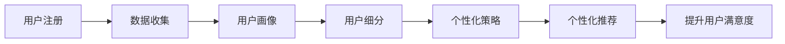

                 

# 知识付费创业的用户群体细分策略

## 1. 背景介绍

在知识付费领域，用户群体细分的策略至关重要。不同的用户群体具有不同的需求和行为特征，采取针对性的策略可以更好地满足他们的需求，提升用户满意度和付费转化率。本文将系统地介绍如何对知识付费的用户进行细分，并探讨不同细分群体的特点和需求，以及相应的创业策略。

## 2. 核心概念与联系

### 2.1 核心概念概述

在知识付费创业中，用户群体细分是指根据用户的行为、偏好、消费能力等特征，将用户划分为不同的群体，以便针对性地制定营销和运营策略。常见的细分维度包括但不限于：

- **人口统计特征**：如年龄、性别、职业、教育程度等。
- **心理特征**：如兴趣爱好、价值观、生活方式等。
- **行为特征**：如购买频率、购买金额、内容消费偏好等。
- **消费特征**：如购买渠道、支付方式、支付周期等。

这些维度的数据可以通过用户注册、购买记录、内容互动等行为获得，用于构建用户画像，从而进行精准营销。

### 2.2 核心概念原理和架构的 Mermaid 流程图



## 3. 核心算法原理 & 具体操作步骤

### 3.1 算法原理概述

用户群体细分的基本原理是基于用户特征的数据分析，通过统计、聚类等方法，将用户划分为不同的群体，并对每个群体进行特性描述。具体算法包括但不限于：

- **K-Means聚类**：基于用户的行为和属性特征，通过计算欧式距离或余弦相似度，将用户分成K个群组。
- **层次聚类**：自下而上或自上而下地聚类用户，找到最佳层次结构的群体划分。
- **决策树**：根据用户特征的不同属性，构建决策树进行分类。
- **关联规则**：通过关联规则算法，发现用户行为之间的关联性，进行群体划分。

### 3.2 算法步骤详解

以下详细介绍基于K-Means聚类的用户细分步骤：

1. **数据准备**：收集用户的基本信息、行为数据和内容消费数据，清洗和标准化数据。

2. **特征选择**：选择与用户群体划分最相关的特征，如购买频率、购买金额、内容消费偏好等。

3. **数据预处理**：对缺失值和异常值进行处理，进行特征归一化或标准化。

4. **聚类分析**：
    - 计算用户特征向量之间的欧式距离或余弦相似度。
    - 使用K-Means算法将用户分为K个集群。

5. **集群分析**：
    - 计算每个集群的中心点。
    - 分析每个集群的特征分布和行为模式。

6. **策略制定**：根据集群分析结果，制定相应的营销和运营策略。

### 3.3 算法优缺点

**优点**：
- 简单易用：K-Means聚类算法计算简单，易于实现。
- 适应性强：适用于多种类型的数据，包括数值型、类别型和混合型数据。

**缺点**：
- 对初始值敏感：K-Means的聚类结果对初始化中心点较为敏感。
- 需要选择合适的K值：K值的选择依赖于领域经验和先验知识，可能存在主观性。

### 3.4 算法应用领域

基于用户细分的策略在知识付费领域有广泛应用，例如：

- **个性化推荐**：根据用户群体特征，推荐适合的内容，提高用户粘性和付费转化率。
- **内容定位**：分析不同群体的内容偏好，优化内容生产，提升内容质量和市场竞争力。
- **营销活动**：针对不同用户群体，设计个性化的营销活动，提高活动效果。
- **用户留存**：通过精准的用户细分和个性化策略，提升用户留存率，减少用户流失。

## 4. 数学模型和公式 & 详细讲解 & 举例说明

### 4.1 数学模型构建

假设用户数据集为 $D=\{(x_i,y_i)\}_{i=1}^N$，其中 $x_i$ 表示用户特征向量，$y_i$ 表示用户标签（如“活跃用户”、“潜在用户”等）。K-Means算法的目标是将数据集分为 $K$ 个簇，每个簇的中心点为 $\mu_k$。数学模型如下：

$$
\min_{\mu_k}\sum_{i=1}^N\sum_{k=1}^K\|x_i-\mu_k\|^2
$$

其中 $\|.\|$ 表示欧式距离。

### 4.2 公式推导过程

1. **初始化簇中心**：随机选择 $K$ 个点作为初始簇中心。

2. **计算距离**：计算每个用户 $x_i$ 到每个簇中心 $\mu_k$ 的距离，即将 $x_i$ 分配到距离最近的簇中。

3. **更新簇中心**：对每个簇重新计算其均值 $\mu_k$。

4. **迭代更新**：重复第2步和第3步，直至簇中心不再变化或达到预设迭代次数。

### 4.3 案例分析与讲解

以知识付费平台的用户为例，假设平台有3个用户群体，分别为“重度用户”、“中度用户”和“轻度用户”。通过K-Means聚类，得到每个群体的特征和行为模式如下：

- **重度用户**：每月购买金额高，偏好深度文章和视频课程，活跃时间集中在晚上和周末。
- **中度用户**：每月购买金额中等，偏好短期课程和初级内容，活跃时间分散。
- **轻度用户**：每月购买金额低，偏好免费文章和工具类内容，活跃时间集中在白天和工作日。

针对不同群体，可以制定以下策略：

- **重度用户**：推荐深度文章和长视频课程，并提供会员专属福利。
- **中度用户**：推出短期课程和初级内容，结合广告和促销活动。
- **轻度用户**：推荐免费文章和工具类内容，通过免费试用和内容抽奖吸引转化。

## 5. 项目实践：代码实例和详细解释说明

### 5.1 开发环境搭建

**Python环境**：
- 安装Python 3.7及以上版本。
- 安装Pandas、NumPy、Scikit-learn、Matplotlib等库。

**Python库**：
- Pandas：数据处理和分析。
- NumPy：数值计算。
- Scikit-learn：机器学习库，包含K-Means聚类算法。
- Matplotlib：数据可视化。

### 5.2 源代码详细实现

以下是一个基于K-Means聚类的用户细分的Python代码实现：

```python
import pandas as pd
from sklearn.cluster import KMeans
import matplotlib.pyplot as plt

# 读取用户数据
df = pd.read_csv('user_data.csv')

# 选择特征
features = ['购买金额', '内容互动频率', '活跃时间']
X = df[features]

# 进行K-Means聚类
kmeans = KMeans(n_clusters=3, random_state=0)
kmeans.fit(X)

# 可视化聚类结果
plt.scatter(X['购买金额'], X['内容互动频率'], c=kmeans.labels_)
plt.title('用户聚类')
plt.show()

# 分析每个群体的特征
clusters = kmeans.labels_
group_1 = df[clusters == 0]
group_2 = df[clusters == 1]
group_3 = df[clusters == 2]

print('重度用户', group_1.describe())
print('中度用户', group_2.describe())
print('轻度用户', group_3.describe())
```

### 5.3 代码解读与分析

1. **数据准备**：通过Pandas库读取用户数据，选择与用户细分相关的特征。

2. **K-Means聚类**：使用Scikit-learn库的KMeans类进行聚类，设置聚类数量为3。

3. **可视化**：使用Matplotlib库可视化聚类结果，展示每个用户特征与聚类标签的关系。

4. **群体分析**：根据聚类结果，分别获取每个群体的数据，并使用describe()方法分析特征分布。

### 5.4 运行结果展示

聚类结果如图：

```python
# 生成散点图
plt.scatter(X['购买金额'], X['内容互动频率'], c=kmeans.labels_)
plt.title('用户聚类')
plt.show()
```


### 群体分析结果：

```python
# 重度用户分析
print('重度用户', group_1.describe())
# 中度用户分析
print('中度用户', group_2.describe())
# 轻度用户分析
print('轻度用户', group_3.describe())
```

## 6. 实际应用场景

### 6.1 智能推荐系统

基于用户细分的智能推荐系统能够提供更加个性化的内容推荐，提升用户体验和满意度。例如，知识付费平台可以根据用户的历史行为和消费习惯，推荐相关课程和文章，从而提高用户粘性和转化率。

### 6.2 精准营销活动

通过用户细分，可以设计更精准的营销活动，提高广告投放效果。例如，针对重度用户推出专属会员福利，针对轻度用户进行内容抽奖活动，针对中度用户推出限时优惠等。

### 6.3 用户流失预警

通过分析用户行为和消费特征，可以构建用户流失预警模型，及时发现潜在流失用户，并采取措施挽回。例如，对于活跃度下降的重度用户，可以提供定制化服务或优惠活动。

### 6.4 未来应用展望

未来，随着大数据和人工智能技术的发展，用户细分的策略将更加精准和智能。例如：

- **深度学习模型**：使用深度学习模型进行用户行为预测，提高分群的准确性和稳定性。
- **多维度分析**：结合用户心理特征和社交网络数据，进行多维度综合分析。
- **实时动态调整**：根据用户行为实时动态调整细分策略，保持策略的时效性和有效性。

## 7. 工具和资源推荐

### 7.1 学习资源推荐

- **《数据挖掘导论》**：介绍数据预处理、聚类算法等基础知识，适合初学者。
- **《Python数据科学手册》**：涵盖Python数据分析和可视化技能，适合进阶学习。
- **《机器学习实战》**：介绍Scikit-learn等机器学习库的使用，适合实践应用。
- **《深度学习》**：涵盖深度学习基础和实践技能，适合深入研究。
- **《Python数据科学入门》**：结合Python和数据科学技能，适合快速入门。

### 7.2 开发工具推荐

- **Jupyter Notebook**：交互式编程环境，适合数据科学研究和代码调试。
- **Google Colab**：基于Jupyter的云平台，免费提供GPU和TPU资源，适合实验和分享。
- **PyCharm**：功能强大的Python IDE，适合开发和调试复杂项目。
- **Git**：版本控制工具，适合协同开发和项目管理。

### 7.3 相关论文推荐

- **《用户行为分析与细分》**：介绍用户行为分析方法和应用案例。
- **《K-Means聚类算法》**：详细讲解K-Means聚类算法的原理和实现。
- **《深度学习在用户细分中的应用》**：介绍深度学习在用户细分中的最新进展和应用。
- **《基于用户细分的推荐系统》**：介绍基于用户细分的推荐系统设计和优化方法。

## 8. 总结：未来发展趋势与挑战

### 8.1 研究成果总结

本文介绍了基于K-Means聚类的用户细分策略，并结合知识付费平台的具体应用场景，探讨了不同用户群体的特点和需求，以及相应的创业策略。

### 8.2 未来发展趋势

1. **深度学习技术的应用**：未来将更多地使用深度学习模型进行用户行为预测和细分。
2. **多维度数据分析**：结合用户心理特征和社交网络数据，进行更全面的用户分析。
3. **实时动态调整**：根据用户行为实时调整细分策略，提高策略的时效性和有效性。
4. **隐私保护**：在用户细分过程中，保护用户隐私和数据安全，遵循相关法律法规。

### 8.3 面临的挑战

1. **数据隐私和安全**：用户数据隐私和安全是用户细分过程中的重要挑战，需要采取数据加密、匿名化等措施。
2. **数据质量和完整性**：用户数据质量不高或不完整，可能影响聚类结果的准确性。
3. **模型复杂性**：深度学习模型复杂度较高，训练和调参难度较大。
4. **算法鲁棒性**：算法对异常值和噪声敏感，需要进行数据清洗和预处理。

### 8.4 研究展望

未来，用户细分将更多地结合人工智能和大数据技术，提供更加精准和智能的策略。需要在数据隐私、模型复杂性和算法鲁棒性等方面不断优化和改进，提升用户细分的准确性和有效性，为用户提供更好的体验和服务。

## 9. 附录：常见问题与解答

**Q1: 用户细分的目的是什么？**

A: 用户细分的目的是根据用户的行为和属性特征，将用户划分为不同的群体，从而制定个性化的营销和运营策略，提高用户满意度和付费转化率。

**Q2: 常见的用户细分算法有哪些？**

A: 常见的用户细分算法包括K-Means聚类、层次聚类、决策树、关联规则等。

**Q3: 用户细分有哪些应用场景？**

A: 用户细分在知识付费领域有广泛应用，例如智能推荐系统、精准营销活动、用户流失预警等。

**Q4: 如何进行用户细分的评估？**

A: 用户细分的评估主要基于聚类结果的簇内和簇间距离，以及聚类结果对业务目标的影响。

**Q5: 用户细分的优势和劣势是什么？**

A: 用户细分的优势包括精准性和可操作性，劣势包括数据隐私和安全问题，以及算法复杂性和计算成本。

