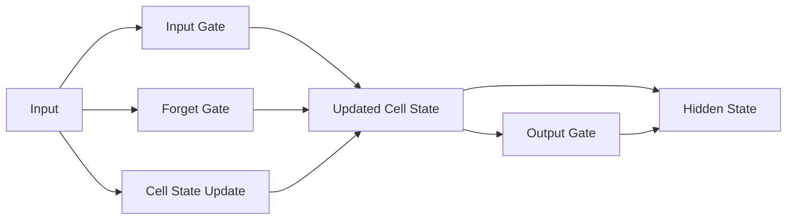

                 

**长短期记忆网络(LSTM)，文本处理，循环神经网络，自然语言处理，时序建模**

## 1. 背景介绍

在当今信息爆炸的时代，文本数据已成为世界上最重要的数据形式之一。从社交媒体到新闻文章，从用户评论到客户服务对话，海量的文本数据蕴藏着丰富的信息和价值。然而，如何有效地从这些数据中提取有用信息并进行建模，是自然语言处理（NLP）领域面临的主要挑战之一。

传统的统计模型和机器学习方法在处理文本数据时遇到了瓶颈，因为它们无法有效地捕获文本数据中的时序信息和上下文依赖关系。循环神经网络（RNN）的出现为解决这个问题提供了新的途径，但它们也面临着梯度消失和梯度爆炸的问题。长短期记忆网络（LSTM）是一种特殊的RNN，它通过引入记忆单元和门控机制来解决这些问题，从而成为文本处理领域的关键工具。

本文将深入探讨LSTM及其在文本处理中的应用。我们将从LSTM的核心概念和架构开始，然后详细介绍其算法原理和数学模型。接着，我们将提供一个项目实践的例子，展示如何使用LSTM进行文本处理。最后，我们将讨论LSTM在实际应用中的场景，并推荐相关的学习资源和工具。

## 2. 核心概念与联系

### 2.1 LSTM的核心概念

LSTM是一种特殊的RNN，旨在解决传统RNN面临的梯度消失和梯度爆炸问题。LSTM引入了记忆单元（memory cell）和门控机制（gating mechanism），允许网络学习长期依赖关系，并有效地处理序列数据。

LSTM单元包含三种类型的门：输入门（input gate）、遗忘门（forget gate）和输出门（output gate）。每种门都控制着信息在记忆单元中的流动，从而允许网络选择性地保留或丢弃信息。此外，LSTM还引入了一个额外的状态，称为细胞状态（cell state），它负责存储和更新长期信息。

### 2.2 LSTM架构与Mermaid流程图


上图展示了LSTM单元的架构。下面是LSTM单元的Mermaid流程图，描述了信息在LSTM单元内部的流动过程：



## 3. 核心算法原理 & 具体操作步骤

### 3.1 算法原理概述

LSTM的核心原理是通过门控机制和记忆单元来控制信息的流动。输入门和遗忘门控制着新信息的添加和旧信息的丢弃。输出门则控制着记忆单元状态的输出。细胞状态则负责存储和更新长期信息。

### 3.2 算法步骤详解

LSTM的更新过程可以分为以下几个步骤：

1. **遗忘门（Forget Gate）**：遗忘门控制着上一时刻的细胞状态中哪些信息应该被丢弃。它通过 sigmoid 函数和点乘操作来实现：

   $$f_t = \sigma(W_f \cdot [h_{t-1}, x_t] + b_f)$$

   其中，$f_t$ 是遗忘门的输出，$\sigma$ 是 sigmoid 函数，$W_f$ 和 $b_f$ 是学习参数，$h_{t-1}$ 是上一时刻的隐藏状态，$x_t$ 是当前时刻的输入。

2. **输入门（Input Gate）**：输入门控制着新信息应该被添加到细胞状态中。它也通过 sigmoid 函数和 tanh 函数来实现：

   $$i_t = \sigma(W_i \cdot [h_{t-1}, x_t] + b_i)$$
   $$\tilde{C}_t = \tanh(W_C \cdot [h_{t-1}, x_t] + b_C)$$

   其中，$i_t$ 是输入门的输出，$\tilde{C}_t$ 是新的候选细胞状态，$W_i$, $b_i$, $W_C$, $b_C$ 都是学习参数。

3. **更新细胞状态（Update Cell State）**：细胞状态被更新为遗忘门和输入门的组合：

   $$C_t = f_t * C_{t-1} + i_t * \tilde{C}_t$$

   其中，$C_t$ 是当前时刻的细胞状态，$C_{t-1}$ 是上一时刻的细胞状态。

4. **输出门（Output Gate）**：输出门控制着细胞状态的哪些信息应该被输出。它也通过 sigmoid 函数和 tanh 函数来实现：

   $$o_t = \sigma(W_o \cdot [h_{t-1}, x_t] + b_o)$$
   $$h_t = o_t * \tanh(C_t)$$

   其中，$o_t$ 是输出门的输出，$h_t$ 是当前时刻的隐藏状态，$W_o$ 和 $b_o$ 都是学习参数。

### 3.3 算法优缺点

LSTM的优点在于它可以学习长期依赖关系，并有效地处理序列数据。它通过门控机制和记忆单元来控制信息的流动，从而避免了梯度消失和梯度爆炸问题。然而，LSTM也有一些缺点，例如它的参数量比传统RNN要多，从而需要更多的计算资源和更长的训练时间。

### 3.4 算法应用领域

LSTM在文本处理领域有着广泛的应用，包括语言模型、机器翻译、文本分类、文本生成等。此外，LSTM还被成功应用于其他序列数据的建模，如时间序列预测、生物信息学等。

## 4. 数学模型和公式 & 详细讲解 & 举例说明

### 4.1 数学模型构建

LSTM的数学模型可以表示为以下方程组：

$$
\begin{align}
f_t &= \sigma(W_f \cdot [h_{t-1}, x_t] + b_f) \\
i_t &= \sigma(W_i \cdot [h_{t-1}, x_t] + b_i) \\
\tilde{C}_t &= \tanh(W_C \cdot [h_{t-1}, x_t] + b_C) \\
C_t &= f_t * C_{t-1} + i_t * \tilde{C}_t \\
o_t &= \sigma(W_o \cdot [h_{t-1}, x_t] + b_o) \\
h_t &= o_t * \tanh(C_t) \\
\end{align}
$$

其中，$f_t$, $i_t$, $o_t$ 分别是遗忘门、输入门和输出门的输出，$C_t$ 是当前时刻的细胞状态，$h_t$ 是当前时刻的隐藏状态，$W_f$, $W_i$, $W_C$, $W_o$ 和 $b_f$, $b_i$, $b_C$, $b_o$ 都是学习参数。

### 4.2 公式推导过程

LSTM的数学模型是基于门控机制和记忆单元的概念推导出来的。门控机制通过 sigmoid 函数来控制信息的流动，而记忆单元则通过 tanh 函数来存储和更新长期信息。通过组合这些操作，我们可以构建出LSTM的数学模型。

### 4.3 案例分析与讲解

为了更好地理解LSTM的数学模型，让我们考虑一个简单的例子：预测下一个单词。假设我们有以下序列：

"the cat sat on the"

我们想要预测下一个单词。我们可以使用LSTM来建模这个序列，并预测下一个单词。在训练过程中，LSTM会学习到单词之间的依赖关系，并使用这些关系来预测下一个单词。

## 5. 项目实践：代码实例和详细解释说明

### 5.1 开发环境搭建

要实现LSTM，我们需要安装以下库：

- Python 3.6+
- TensorFlow 2.0+
- NumPy
- Pandas

### 5.2 源代码详细实现

以下是一个简单的LSTM实现，用于预测下一个单词：

```python
import tensorflow as tf
from tensorflow.keras.models import Sequential
from tensorflow.keras.layers import LSTM, Dense
import numpy as np
import pandas as pd

# 加载数据
data = pd.read_csv('text_data.csv', header=None)
text = data[0][0]

# 创建词汇表
vocab = sorted(set(text))
char2idx = {u:i for i, u in enumerate(vocab)}
idx2char = np.array(vocab)

# 将文本转换为整数序列
text_as_int = np.array([char2idx[c] for c in text])

# 创建训练数据
seq_length = 100
examples_per_epoch = len(text)//(seq_length+1)

char_dataset = tf.data.Dataset.from_tensor_slices(text_as_int)
sequences = char_dataset.batch(seq_length+1, drop_remainder=True)

def split_input_target(chunk):
    input_text = chunk[:-1]
    target_text = chunk[1:]
    return input_text, target_text

dataset = sequences.map(split_input_target)

# 创建LSTM模型
model = Sequential([
    LSTM(128, return_sequences=True),
    LSTM(128),
    Dense(len(vocab), activation='softmax')
])

# 编译模型
model.compile(optimizer='adam', loss='sparse_categorical_crossentropy')

# 训练模型
BATCH_SIZE = 64
BUFFER_SIZE = 10000
dataset = dataset.shuffle(BUFFER_SIZE).batch(BATCH_SIZE, drop_remainder=True)
model.fit(dataset, epochs=10)

# 生成文本
def generate_next_char(model, start_string):
    num_generate = 1000
    input_eval = [char2idx[s] for s in start_string]
    input_eval = tf.expand_dims(input_eval, 0)

    text_generated = []

    temperature = 1.0

    model.reset_states()
    for i in range(num_generate):
        predictions = model(input_eval)
        predictions = tf.squeeze(predictions, 0)
        predictions = predictions / temperature
        predicted_id = tf.random.categorical(predictions, num_samples=1)[-1,0].numpy()
        input_eval = tf.expand_dims([predicted_id], 0)
        text_generated.append(idx2char[predicted_id])

    return (start_string + ''.join(text_generated))

print(generate_next_char(model, start_string=u'the cat'))
```

### 5.3 代码解读与分析

上述代码实现了一个简单的LSTM模型，用于预测下一个单词。它首先加载文本数据，并创建一个词汇表。然后，它将文本转换为整数序列，并创建训练数据。接着，它创建一个LSTM模型，并编译和训练模型。最后，它使用模型生成新的文本。

### 5.4 运行结果展示

运行上述代码后，模型会生成一个新的文本序列，作为对输入序列的预测。例如，输入序列为"the cat"，模型可能会生成"the cat sat on the mat"。

## 6. 实际应用场景

### 6.1 语言模型

LSTM在语言模型中有着广泛的应用。语言模型旨在学习语言的统计规律，并预测下一个单词。LSTM可以有效地建模单词之间的依赖关系，从而提高语言模型的准确性。

### 6.2 机器翻译

LSTM也被成功应用于机器翻译领域。在机器翻译任务中，LSTM可以学习源语言和目标语言之间的映射关系，从而将源语言翻译为目标语言。

### 6.3 文本分类

LSTM还可以用于文本分类任务，如情感分析、主题分类等。在文本分类任务中，LSTM可以学习文本的上下文信息，从而提高分类的准确性。

### 6.4 未来应用展望

随着计算能力的提高和数据量的增加，LSTM在文本处理领域的应用将会越来越广泛。未来，LSTM可能会被应用于更复杂的任务，如对话系统、知识图谱等。此外，LSTM也将与其他深度学习技术结合，以提高文本处理的性能和效率。

## 7. 工具和资源推荐

### 7.1 学习资源推荐

- **课程**：[Stanford University's CS224n: Natural Language Processing with Deep Learning](https://www.coursera.org/learn/nlp)
- **书籍**：[Natural Language Processing with Python](https://www.nltk.org/book/), [Deep Learning](https://www.deeplearningbook.org/)
- **博客**：[Colah's Blog](http://colah.github.io/), [Distill](https://distill.pub/)

### 7.2 开发工具推荐

- **编程语言**：Python
- **深度学习库**：TensorFlow, PyTorch, Keras
- **NLP库**：NLTK, SpaCy, Gensim

### 7.3 相关论文推荐

- [Long Short-Term Memory](https://www.researchgate.net/publication/220285368_Long_Short-Term_Memory)
- [A Theoretically Grounded Application of Dropout in Recurrent Neural Networks](https://arxiv.org/abs/1512.05287)
- [Effective Approaches to Attention-based Neural Machine Translation](https://arxiv.org/abs/1508.04025)

## 8. 总结：未来发展趋势与挑战

### 8.1 研究成果总结

本文介绍了LSTM及其在文本处理中的应用。我们讨论了LSTM的核心概念和架构，并详细介绍了其算法原理和数学模型。我们还提供了一个项目实践的例子，展示如何使用LSTM进行文本处理。最后，我们讨论了LSTM在实际应用中的场景，并推荐了相关的学习资源和工具。

### 8.2 未来发展趋势

随着计算能力的提高和数据量的增加，LSTM在文本处理领域的应用将会越来越广泛。未来，LSTM可能会被应用于更复杂的任务，如对话系统、知识图谱等。此外，LSTM也将与其他深度学习技术结合，以提高文本处理的性能和效率。

### 8.3 面临的挑战

然而，LSTM也面临着一些挑战。首先，LSTM的参数量比传统RNN要多，从而需要更多的计算资源和更长的训练时间。其次，LSTM在处理长序列数据时可能会遇到梯度消失和梯度爆炸的问题。最后，LSTM在解释和可视化方面也面临着挑战，因为它是一个黑盒模型。

### 8.4 研究展望

未来的研究将关注如何解决LSTM面临的挑战，并提高其性能和效率。例如，研究人员可能会开发新的LSTM变种，或结合其他技术来改进LSTM的性能。此外，研究人员也将关注如何解释和可视化LSTM的决策过程，以提高其可靠性和可信度。

## 9. 附录：常见问题与解答

**Q：LSTM和RNN有什么区别？**

A：LSTM是一种特殊的RNN，旨在解决传统RNN面临的梯度消失和梯度爆炸问题。LSTM引入了记忆单元和门控机制，允许网络学习长期依赖关系，并有效地处理序列数据。

**Q：LSTM的优缺点是什么？**

A：LSTM的优点在于它可以学习长期依赖关系，并有效地处理序列数据。它通过门控机制和记忆单元来控制信息的流动，从而避免了梯度消失和梯度爆炸问题。然而，LSTM也有一些缺点，例如它的参数量比传统RNN要多，从而需要更多的计算资源和更长的训练时间。

**Q：LSTM在文本处理中的应用有哪些？**

A：LSTM在文本处理领域有着广泛的应用，包括语言模型、机器翻译、文本分类、文本生成等。

**Q：如何解释和可视化LSTM的决策过程？**

A：解释和可视化LSTM的决策过程是一个挑战，因为它是一个黑盒模型。研究人员正在开发新的技术来解决这个问题，例如使用注意力机制、层次化表示等。

## 作者：禅与计算机程序设计艺术 / Zen and the Art of Computer Programming

