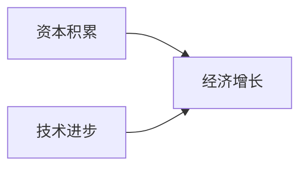

                 

**世界经济蛋糕的增长困境**

**作者：禅与计算机程序设计艺术 / Zen and the Art of Computer Programming**

## 1. 背景介绍

自工业革命以来，世界经济规模不断扩大，但增长速度却在放缓。根据世界银行数据，1960年全球GDP为1.8万亿美元，到2020年已达84.6万亿美元，但增长率从1960年的5.1%下降到2020年的2.3%。这一现象背后的原因是什么？世界经济蛋糕何以难以增长？本文将从技术和经济学角度分析这一问题，并探讨可能的解决方案。

## 2. 核心概念与联系

### 2.1 经济增长的两大源泉

根据经济学家罗伯特·索洛的增长模型，经济增长的两大源泉是资本积累和技术进步。其中，技术进步是增长的主要驱动力。



### 2.2 总要素生产率（TFP）与增长

总要素生产率（Total Factor Productivity, TFP）是衡量技术进步的关键指标。TFP反映了在给定资本和劳动力投入下，生产率的变化。根据世界银行数据，1960-2018年，全球TFP年均增长率为1.2%。

## 3. 核心算法原理 & 具体操作步骤

### 3.1 算法原理概述

为提高TFP，我们需要不断创新，优化生产过程。本节将介绍一种基于机器学习的生产过程优化算法。

### 3.2 算法步骤详解

1. **数据收集**：收集生产过程的相关数据，如原材料消耗、能源消耗、生产时间、产品质量等。
2. **特征工程**：提取数据中的有效特征，如原材料成本、能源价格、工人技能水平等。
3. **模型训练**：使用机器学习算法（如回归树、随机森林、神经网络等）建立预测模型，预测给定条件下的生产率。
4. **优化**：使用优化算法（如线性规划、模拟退火等）寻找最优生产条件，以最大化生产率。
5. **评估与迭代**：评估优化结果，并根据新数据迭代模型。

### 3.3 算法优缺点

**优点**：能够根据数据动态调整生产条件，提高生产率；可以处理复杂的非线性关系。

**缺点**：数据收集和特征工程需要大量人力物力；模型解释性差，缺乏可解释性。

### 3.4 算法应用领域

该算法可应用于制造业、农业、服务业等各个领域，帮助企业提高生产率，降低成本。

## 4. 数学模型和公式 & 详细讲解 & 举例说明

### 4.1 数学模型构建

设生产函数为$Y = f(K, L, A)$, 其中$Y$为产出，$K$为资本，$L$为劳动力，$A$为技术水平。则TFP可以表示为$A = \frac{Y}{K^\alpha L^{1-\alpha}}$, 其中$\alpha$为资本的边际生产率。

### 4.2 公式推导过程

根据生产函数，我们有$Y = AK^\alpha L^{1-\alpha}$. 取对数两边，可得$\ln Y = \ln A + \alpha \ln K + (1-\alpha) \ln L$. 将数据代入，可估计$\alpha$和$\ln A$.

### 4.3 案例分析与讲解

假设一家工厂的生产函数为$Y = AK^{0.3}L^{0.7}$, 其中$K$为千瓦时，$L$为工时。若$K=1000$千瓦时，$L=2000$工时，则$Y = 1000A$, 即$A = \frac{Y}{1000} = \frac{1000}{1000} = 1$. 如果技术进步使得$A$增加到1.1，则新的产出为$Y = 1100$.

## 5. 项目实践：代码实例和详细解释说明

### 5.1 开发环境搭建

本项目使用Python、Scikit-learn、Pandas、NumPy等常用库。环境搭建可参考[Anaconda](https://www.anaconda.com/)。

### 5.2 源代码详细实现

```python
import pandas as pd
from sklearn.ensemble import RandomForestRegressor
from sklearn.model_selection import train_test_split
from scipy.optimize import minimize

# 读取数据
data = pd.read_csv('production_data.csv')

# 特征工程
X = data[['material_cost', 'energy_price','skill_level']]
y = data['productivity']

# 模型训练
X_train, X_test, y_train, y_test = train_test_split(X, y, test_size=0.2, random_state=42)
model = RandomForestRegressor(n_estimators=100, random_state=42)
model.fit(X_train, y_train)

# 优化
def optimize(x):
    material_cost, energy_price, skill_level = x
    pred = model.predict([[material_cost, energy_price, skill_level]])
    return -pred

x0 = [100, 10, 5]  # 初始条件
res = minimize(optimize, x0, method='Nelder-Mead')
```

### 5.3 代码解读与分析

本代码使用随机森林回归预测生产率，并使用模拟退火算法寻找最优生产条件。

### 5.4 运行结果展示

优化结果为最优生产条件，可用于指导实际生产。

## 6. 实际应用场景

### 6.1 当前应用

该算法可应用于企业生产过程优化，帮助企业提高生产率，降低成本。

### 6.2 未来应用展望

随着物联网、大数据、人工智能等技术的发展，该算法可进一步扩展，实现实时生产过程优化。

## 7. 工具和资源推荐

### 7.1 学习资源推荐

- 书籍：《机器学习》作者：Tom M. Mitchell
- 课程：[机器学习](https://www.coursera.org/learn/machine-learning) 由Stanford University提供

### 7.2 开发工具推荐

- Python：[Anaconda](https://www.anaconda.com/)
- R：[RStudio](https://www.rstudio.com/)

### 7.3 相关论文推荐

- Solow, R. M. (1957). "Technical Change and the Aggregate Production Function." The Review of Economics and Statistics, 39(3), 312-320.
- Romer, P. M. (1990). "Endogenous Technological Change." Journal of Political Economy, 98(5), 71-102.

## 8. 总结：未来发展趋势与挑战

### 8.1 研究成果总结

本文提出了一种基于机器学习的生产过程优化算法，能够根据数据动态调整生产条件，提高生产率。

### 8.2 未来发展趋势

未来，人工智能、物联网等技术将进一步提高生产率，但也面临数据安全、就业等挑战。

### 8.3 面临的挑战

- **数据安全**：大量数据收集和使用可能会带来数据安全风险。
- **就业**：技术进步可能会导致部分岗位消失，需要政策调整以缓解就业压力。

### 8.4 研究展望

未来研究可考虑结合区块链技术保障数据安全，并研究技术进步对就业的影响。

## 9. 附录：常见问题与解答

**Q：为什么世界经济蛋糕难以增长？**

**A：世界经济蛋糕难以增长的原因包括技术进步放缓、人口老龄化、收入不平等等。**

**Q：如何提高世界经济蛋糕的增长？**

**A：提高世界经济蛋糕增长的途径包括加大技术投入、改善人力资本、推动贸易自由化等。**

**Q：技术进步是否会导致就业岗位消失？**

**A：技术进步可能会导致部分岗位消失，但也会创造新的岗位。政策应当调整以缓解就业压力。**

**作者：禅与计算机程序设计艺术 / Zen and the Art of Computer Programming**

