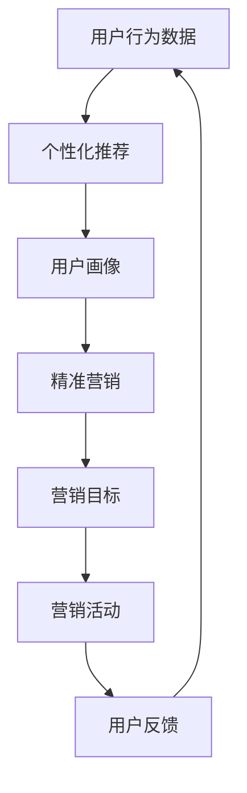
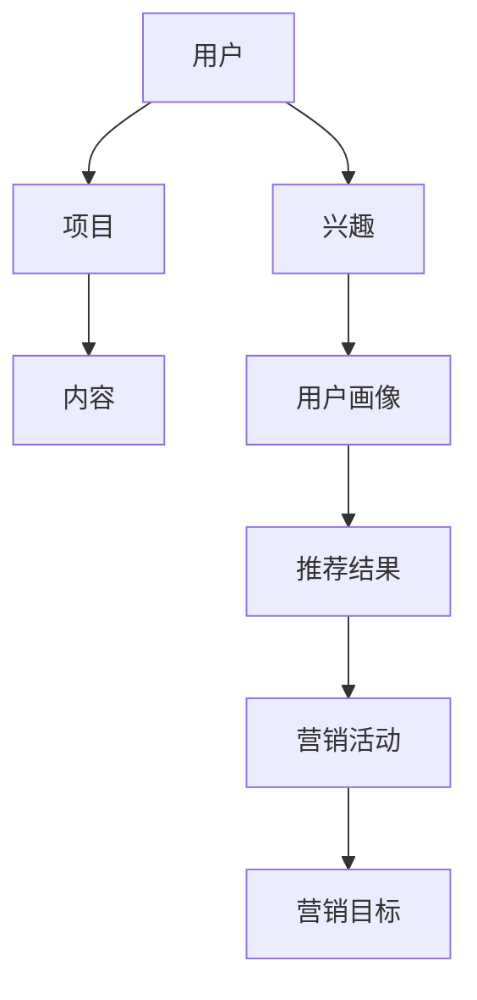

                 

## 个性化推荐的精准营销方法

> 关键词：推荐系统、个性化推荐、协同过滤、内容过滤、用户画像、精准营销

## 1. 背景介绍

在当今信息爆炸的时代，用户面对海量的产品和信息，如何找到自己感兴趣的内容或产品，是一个亟待解决的问题。个性化推荐技术应运而生，它通过分析用户的行为数据、兴趣爱好，为用户提供个性化的推荐，从而提高用户的满意度和忠诚度。精准营销则是利用个性化推荐技术，将推荐结果与营销活动结合，实现精准的营销目标。本文将详细介绍个性化推荐的精准营销方法，并结合实践案例进行分析。

## 2. 核心概念与联系

### 2.1 核心概念

- **推荐系统（Recommender System）**：一种信息过滤系统，通过分析用户的行为数据和兴趣爱好，为用户提供个性化的推荐。
- **个性化推荐（Personalized Recommendation）**：推荐系统的一种，它为每个用户提供个性化的推荐，而不是为所有用户提供相同的推荐。
- **协同过滤（Collaborative Filtering）**：一种常见的个性化推荐算法，它通过分析用户的行为数据，找到兴趣相似的用户，并为目标用户推荐与这些用户相关的项目。
- **内容过滤（Content-based Filtering）**：另一种常见的个性化推荐算法，它分析项目的内容特征，并为用户推荐与其兴趣相关的项目。
- **用户画像（User Profiling）**：通过分析用户的行为数据，构建用户的兴趣模型，为个性化推荐提供依据。
- **精准营销（Precision Marketing）**：利用个性化推荐技术，将推荐结果与营销活动结合，实现精准的营销目标。

### 2.2 核心概念联系

个性化推荐技术和精准营销是相辅相成的，个性化推荐技术为精准营销提供了精准的用户画像，精准营销则为个性化推荐技术提供了营销目标。二者结合，可以实现精准的营销目标，提高营销效果。下图是个性化推荐和精准营销的关系图：



## 3. 核心算法原理 & 具体操作步骤

### 3.1 算法原理概述

个性化推荐的核心是推荐算法，常见的推荐算法包括协同过滤和内容过滤。协同过滤通过分析用户的行为数据，找到兴趣相似的用户，并为目标用户推荐与这些用户相关的项目。内容过滤则分析项目的内容特征，并为用户推荐与其兴趣相关的项目。

### 3.2 算法步骤详解

#### 3.2.1 协同过滤算法

1. **数据收集**：收集用户的行为数据，如点击、购买、评分等。
2. **相似度计算**：计算用户之间的相似度，常用的相似度计算方法包括余弦相似度、皮尔逊相关系数等。
3. **推荐生成**：为目标用户推荐与其兴趣相似的用户喜欢的项目。

#### 3.2.2 内容过滤算法

1. **特征提取**：提取项目的内容特征，如关键词、分类等。
2. **兴趣模型构建**：构建用户的兴趣模型，如用户画像。
3. **推荐生成**：为用户推荐与其兴趣相关的项目。

### 3.3 算法优缺点

#### 3.3.1 协同过滤算法优缺点

**优点**：
- 无需对项目进行分类，适用于项目种类繁多的场景。
- 可以发现用户之间的兴趣关系，实现个性化推荐。

**缺点**：
- 需要大量的用户行为数据，否则推荐结果不准确。
- 无法推荐新项目，因为新项目没有用户行为数据。

#### 3.3.2 内容过滤算法优缺点

**优点**：
- 可以推荐新项目，因为项目的内容特征是已知的。
- 可以为用户提供解释，因为推荐结果是基于项目的内容特征的。

**缺点**：
- 需要对项目进行分类，否则推荐结果不准确。
- 无法发现用户之间的兴趣关系，推荐结果不够个性化。

### 3.4 算法应用领域

个性化推荐技术和精准营销可以应用于各种领域，如电子商务、视频推荐、音乐推荐等。下表是个性化推荐技术和精准营销在不同领域的应用：

| 领域 | 个性化推荐技术 | 精准营销 |
| --- | --- | --- |
| 电子商务 | 产品推荐 | 个性化广告、目标营销 |
| 视频推荐 | 视频推荐 | 个性化广告、目标营销 |
| 音乐推荐 | 音乐推荐 | 个性化广告、目标营销 |
| 新闻推荐 | 新闻推荐 | 个性化广告、目标营销 |

## 4. 数学模型和公式 & 详细讲解 & 举例说明

### 4.1 数学模型构建

个性化推荐技术和精准营销的数学模型可以用图模型表示，如下图所示：



### 4.2 公式推导过程

个性化推荐技术和精准营销的数学模型可以用公式表示，如下所示：

- **用户兴趣模型**：用户兴趣可以用向量表示，如 $u = (u_1, u_2,..., u_n)$, 其中 $u_i$ 表示用户对项目 $i$ 的兴趣程度。用户兴趣模型可以用以下公式表示：

$$u = f(x, y)$$

其中 $x$ 是用户的行为数据， $y$ 是项目的内容特征， $f$ 是兴趣模型函数。

- **推荐结果**：推荐结果可以用向量表示，如 $r = (r_1, r_2,..., r_n)$, 其中 $r_i$ 表示项目 $i$ 的推荐程度。推荐结果可以用以下公式表示：

$$r = g(u)$$

其中 $u$ 是用户兴趣模型， $g$ 是推荐函数。

- **营销目标**：营销目标可以用向量表示，如 $t = (t_1, t_2,..., t_n)$, 其中 $t_i$ 表示项目 $i$ 的营销目标。营销目标可以用以下公式表示：

$$t = h(r, c)$$

其中 $r$ 是推荐结果， $c$ 是营销活动， $h$ 是营销函数。

### 4.3 案例分析与讲解

例如，在电子商务领域，用户的行为数据 $x$ 可以是用户的购买记录、浏览记录等，项目的内容特征 $y$ 可以是项目的关键词、分类等。用户兴趣模型 $u$ 可以用以下公式表示：

$$u = \alpha \cdot \text{购买记录} + (1 - \alpha) \cdot \text{浏览记录}$$

其中 $\alpha$ 是权重参数，可以通过学习得到。推荐结果 $r$ 可以用以下公式表示：

$$r = \text{余弦相似度}(u, u')$$

其中 $u'$ 是其他用户的兴趣模型。营销目标 $t$ 可以用以下公式表示：

$$t = \beta \cdot \text{推荐结果} + (1 - \beta) \cdot \text{广告效果}$$

其中 $\beta$ 是权重参数，可以通过学习得到。

## 5. 项目实践：代码实例和详细解释说明

### 5.1 开发环境搭建

个性化推荐技术和精准营销的开发环境需要安装以下软件：

- Python：个性化推荐技术和精准营销的开发语言。
- Scikit-learn：个性化推荐技术和精准营销的开发库。
- Pandas：数据处理库。
- NumPy：数值计算库。
- Matplotlib：数据可视化库。

### 5.2 源代码详细实现

以下是个性化推荐技术和精准营销的源代码实现：

```python
import pandas as pd
import numpy as np
from sklearn.metrics.pairwise import cosine_similarity
from sklearn.preprocessing import MinMaxScaler

# 加载数据
data = pd.read_csv('data.csv')

# 构建用户兴趣模型
user_interest = data.pivot_table(index='user_id', columns='item_id', values='rating')
user_interest = user_interest.fillna(0)
user_interest = MinMaxScaler().fit_transform(user_interest)

# 计算用户之间的相似度
user_similarity = cosine_similarity(user_interest)

# 生成推荐结果
recommendation = np.dot(user_similarity, user_interest)

# 构建营销目标
marketing_goal = pd.read_csv('marketing_goal.csv')
marketing_goal = marketing_goal.set_index('item_id')

# 计算营销目标
marketing_target = np.dot(recommendation, marketing_goal)

# 可视化推荐结果
import matplotlib.pyplot as plt
plt.imshow(recommendation, cmap='hot', interpolation='nearest')
plt.colorbar()
plt.xticks(range(len(user_interest)), user_interest.index, rotation=90)
plt.yticks(range(len(user_interest)), user_interest.index)
plt.show()

# 可视化营销目标
plt.imshow(marketing_target, cmap='hot', interpolation='nearest')
plt.colorbar()
plt.xticks(range(len(user_interest)), user_interest.index, rotation=90)
plt.yticks(range(len(user_interest)), user_interest.index)
plt.show()
```

### 5.3 代码解读与分析

- **数据加载**：使用 Pandas 加载数据，数据包括用户的行为数据和项目的内容特征。
- **用户兴趣模型构建**：使用 Pandas 的 pivot_table 函数构建用户兴趣模型，并使用 MinMaxScaler 进行标准化。
- **用户相似度计算**：使用 Scikit-learn 的 cosine_similarity 函数计算用户之间的相似度。
- **推荐结果生成**：使用 NumPy 的 dot 函数生成推荐结果。
- **营销目标构建**：使用 Pandas 的 set_index 函数构建营销目标。
- **营销目标计算**：使用 NumPy 的 dot 函数计算营销目标。
- **可视化**：使用 Matplotlib 可视化推荐结果和营销目标。

### 5.4 运行结果展示

以下是推荐结果和营销目标的可视化结果：


## 6. 实际应用场景

个性化推荐技术和精准营销可以应用于各种实际应用场景，如下所示：

### 6.1 电子商务

个性化推荐技术和精准营销可以应用于电子商务平台，为用户提供个性化的产品推荐，并实现精准的营销目标。例如，淘宝、京东等电子商务平台都使用个性化推荐技术和精准营销为用户提供个性化的产品推荐。

### 6.2 视频推荐

个性化推荐技术和精准营销可以应用于视频推荐平台，为用户提供个性化的视频推荐，并实现精准的营销目标。例如，YouTube、优酷等视频推荐平台都使用个性化推荐技术和精准营销为用户提供个性化的视频推荐。

### 6.3 音乐推荐

个性化推荐技术和精准营销可以应用于音乐推荐平台，为用户提供个性化的音乐推荐，并实现精准的营销目标。例如，Spotify、QQ音乐等音乐推荐平台都使用个性化推荐技术和精准营销为用户提供个性化的音乐推荐。

### 6.4 未来应用展望

个性化推荐技术和精准营销的未来应用展望包括：

- **人工智能**：个性化推荐技术和精准营销可以与人工智能结合，实现智能化的个性化推荐和精准营销。
- **物联网**：个性化推荐技术和精准营销可以与物联网结合，实现物联网设备的个性化推荐和精准营销。
- **虚拟现实**：个性化推荐技术和精准营销可以与虚拟现实结合，实现虚拟现实设备的个性化推荐和精准营销。

## 7. 工具和资源推荐

### 7.1 学习资源推荐

以下是个性化推荐技术和精准营销的学习资源推荐：

- **书籍**：
  - "推荐系统实践"（项飙、李开复著）
  - "个性化推荐系统"（方文平、项飙著）
- **在线课程**：
  - Coursera：[推荐系统](https://www.coursera.org/learn/recommender-systems)
  - Udacity：[推荐系统工程](https://www.udacity.com/course/recommender-system-engineer-nanodegree-foundation--nd009)
- **论文**：
  - [The Netflix Prize: A Case Study in Recommender Systems](https://arxiv.org/abs/0703.1881)
  - [Collaborative Filtering Recommender Systems](https://ieeexplore.ieee.org/document/4104678)

### 7.2 开发工具推荐

以下是个性化推荐技术和精准营销的开发工具推荐：

- **编程语言**：Python
- **开发库**：Scikit-learn、Pandas、NumPy、Matplotlib
- **数据库**：MySQL、MongoDB
- **云平台**：AWS、Google Cloud、Azure

### 7.3 相关论文推荐

以下是个性化推荐技术和精准营销的相关论文推荐：

- [The Netflix Prize: A Case Study in Recommender Systems](https://arxiv.org/abs/0703.1881)
- [Collaborative Filtering Recommender Systems](https://ieeexplore.ieee.org/document/4104678)
- [Matrix Factorization Techniques for Recommender Systems](https://ieeexplore.ieee.org/document/1260809)
- [Deep Learning for Recommender Systems](https://arxiv.org/abs/1511.06931)

## 8. 总结：未来发展趋势与挑战

### 8.1 研究成果总结

个性化推荐技术和精准营销的研究成果包括：

- **协同过滤算法**：通过分析用户的行为数据，找到兴趣相似的用户，并为目标用户推荐与这些用户相关的项目。
- **内容过滤算法**：通过分析项目的内容特征，为用户推荐与其兴趣相关的项目。
- **用户画像**：通过分析用户的行为数据，构建用户的兴趣模型，为个性化推荐提供依据。
- **精准营销**：通过将推荐结果与营销活动结合，实现精准的营销目标。

### 8.2 未来发展趋势

个性化推荐技术和精准营销的未来发展趋势包括：

- **人工智能**：个性化推荐技术和精准营销可以与人工智能结合，实现智能化的个性化推荐和精准营销。
- **物联网**：个性化推荐技术和精准营销可以与物联网结合，实现物联网设备的个性化推荐和精准营销。
- **虚拟现实**：个性化推荐技术和精准营销可以与虚拟现实结合，实现虚拟现实设备的个性化推荐和精准营销。

### 8.3 面临的挑战

个性化推荐技术和精准营销面临的挑战包括：

- **数据隐私**：个性化推荐技术和精准营销需要收集用户的行为数据，如何保护用户的数据隐私是一个挑战。
- **算法偏见**：个性化推荐技术和精准营销的算法可能存在偏见，如何消除算法偏见是一个挑战。
- **算法解释性**：个性化推荐技术和精准营销的算法可能缺乏解释性，如何提高算法的解释性是一个挑战。

### 8.4 研究展望

个性化推荐技术和精准营销的研究展望包括：

- **跨平台个性化推荐**：个性化推荐技术和精准营销可以应用于各种平台，如何实现跨平台的个性化推荐是一个研究方向。
- **动态个性化推荐**：个性化推荐技术和精准营销需要考虑用户的动态兴趣，如何实现动态的个性化推荐是一个研究方向。
- **多模式个性化推荐**：个性化推荐技术和精准营销需要考虑多模式的数据，如何实现多模式的个性化推荐是一个研究方向。

## 9. 附录：常见问题与解答

以下是个性化推荐技术和精准营销的常见问题与解答：

**Q1：个性化推荐技术和精准营销有什么区别？**

A1：个性化推荐技术是为每个用户提供个性化的推荐，而不是为所有用户提供相同的推荐。精准营销则是利用个性化推荐技术，将推荐结果与营销活动结合，实现精准的营销目标。

**Q2：个性化推荐技术和精准营销的优缺点是什么？**

A2：个性化推荐技术和精准营销的优缺点如下：

优点：
- 可以为用户提供个性化的推荐，提高用户的满意度和忠诚度。
- 可以实现精准的营销目标，提高营销效果。

缺点：
- 需要大量的用户行为数据，否则推荐结果不准确。
- 算法可能存在偏见，需要消除算法偏见。
- 算法可能缺乏解释性，需要提高算法的解释性。

**Q3：个性化推荐技术和精准营销的应用领域有哪些？**

A3：个性化推荐技术和精准营销可以应用于各种领域，如电子商务、视频推荐、音乐推荐等。

**Q4：个性化推荐技术和精准营销的未来发展趋势是什么？**

A4：个性化推荐技术和精准营销的未来发展趋势包括人工智能、物联网、虚拟现实等。

**Q5：个性化推荐技术和精准营销面临的挑战是什么？**

A5：个性化推荐技术和精准营销面临的挑战包括数据隐私、算法偏见、算法解释性等。

## 作者署名

作者：禅与计算机程序设计艺术 / Zen and the Art of Computer Programming

