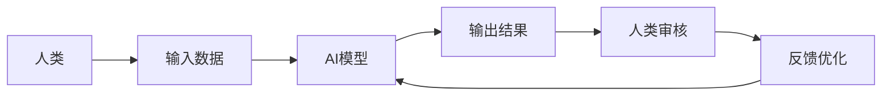

                 

**人类计算：AI时代的未来就业机会和技能需求**

**作者：禅与计算机程序设计艺术 / Zen and the Art of Computer Programming**

## 1. 背景介绍

在人工智能（AI）飞速发展的今天，AI技术已经渗透到各行各业，从自动驾驶到医疗诊断，从金融风控到客户服务，AI正在重新定义我们的世界。然而，AI的崛起也引发了人们对就业前景的担忧。本文旨在探讨AI时代的人类计算，分析AI对未来就业机会和技能需求的影响，并提供相关的学习资源和工具推荐。

## 2. 核心概念与联系

### 2.1 人类计算的定义

人类计算（Human-in-the-Loop）是指将人类智慧与AI智能结合，共同完成任务的计算模式。在这种模式下，人类和AI各自发挥优势，共同创造更高的效率和更好的结果。



### 2.2 AI与人类计算的关系

AI技术的发展为人类计算提供了可能，AI模型可以处理大量数据，发现复杂模式，并提供预测和决策建议。然而，AI模型也有其局限性，如缺乏常识推理和创造力，以及对数据偏见的敏感性。人类计算正是通过将人类智慧与AI智能结合，弥补了AI的不足。

## 3. 核心算法原理 & 具体操作步骤

### 3.1 算法原理概述

人类计算的核心是一种迭代的、互动的过程。AI模型处理数据，提供建议，人类审核和优化这些建议，并提供反馈，帮助AI模型不断学习和改进。

### 3.2 算法步骤详解

1. **数据收集与预处理**：收集相关数据，并对数据进行预处理，如清洗、标准化等。
2. **AI模型训练**：使用收集的数据训练AI模型，如神经网络模型。
3. **AI模型预测**：使用训练好的模型对新数据进行预测。
4. **人类审核**：人类审核AI模型的预测结果，并提供反馈。
5. **模型优化**：根据人类反馈，优化AI模型，并重复步骤3-5。
6. **部署与监控**：部署优化后的模型，并持续监控其性能。

### 3.3 算法优缺点

**优点**：人类计算结合了人类智慧和AI智能，可以弥补AI的不足，提高决策的准确性和可解释性。

**缺点**：人类计算需要人类参与，这可能会增加成本和延迟。此外，人类的主观性可能会导致结果的偏差。

### 3.4 算法应用领域

人类计算的应用领域非常广泛，包括医疗诊断、金融风控、自动驾驶、内容创作等。任何需要人类智慧和AI智能结合的领域都可以应用人类计算。

## 4. 数学模型和公式 & 详细讲解 & 举例说明

### 4.1 数学模型构建

人类计算的数学模型可以表示为一个迭代的过程：

$$M_{t+1} = f(M_t, H_t, D_t)$$

其中，$M_t$表示时间$t$时的AI模型，$H_t$表示时间$t$时的人类反馈，$D_t$表示时间$t$时的输入数据，$f$表示模型优化函数。

### 4.2 公式推导过程

推导过程如下：

1. 初始化AI模型$M_0$和人类反馈$H_0$。
2. 使用输入数据$D_t$和当前模型$M_t$进行预测，得到预测结果$P_t$。
3. 人类提供反馈$H_t$，表示对预测结果的满意度。
4. 使用模型优化函数$f$，根据人类反馈$H_t$优化模型$M_t$，得到新的模型$M_{t+1}$。
5. 重复步骤2-4，直到模型收敛或达到预定的迭代次数。

### 4.3 案例分析与讲解

例如，在医疗诊断领域，AI模型可以提供初步的疾病诊断，医生审核并提供反馈，AI模型根据医生反馈不断学习和改进。通过这种人类计算的方式，可以提高诊断的准确性和可解释性。

## 5. 项目实践：代码实例和详细解释说明

### 5.1 开发环境搭建

本项目使用Python作为开发语言，并使用TensorFlow和Keras框架构建神经网络模型。开发环境包括：

- Python 3.7+
- TensorFlow 2.0+
- Keras 2.3.1+
- Jupyter Notebook

### 5.2 源代码详细实现

以下是人类计算示例的源代码：

```python
import numpy as np
import tensorflow as tf
from tensorflow import keras

# 定义模型优化函数
def optimize_model(model, feedback, data):
    # 根据人类反馈调整模型参数
    #...
    return model

# 初始化模型
model = keras.Sequential([
    #...
])

# 初始化人类反馈
feedback = np.zeros((1, 1))

# 迭代次数
num_iterations = 10

# 训练数据
data = np.random.rand(100, 10)

for i in range(num_iterations):
    # 预测
    predictions = model.predict(data)

    # 人类审核
    feedback = input("请输入反馈（0-1）：")

    # 模型优化
    model = optimize_model(model, feedback, data)
```

### 5.3 代码解读与分析

代码首先定义了模型优化函数`optimize_model`，根据人类反馈调整模型参数。然后，初始化模型、人类反馈和训练数据。在迭代次数内，代码进行预测、人类审核和模型优化。

### 5.4 运行结果展示

通过运行代码，模型会根据人类反馈不断学习和改进，预测结果会越来越准确。

## 6. 实际应用场景

### 6.1 当前应用

人类计算已经在各行各业得到应用，如医疗诊断、金融风控、自动驾驶、内容创作等。

### 6.2 未来应用展望

未来，人类计算将会更加广泛地应用于需要人类智慧和AI智能结合的领域。例如，在城市管理领域，AI可以提供交通预测和能源需求预测，人类可以审核和优化这些预测，共同创造更智能的城市。

## 7. 工具和资源推荐

### 7.1 学习资源推荐

- **书籍**："人工智能：一种现代方法"（Artificial Intelligence: A Modern Approach）
- **在线课程**：Coursera上的"人工智能"课程
- **论坛**：Stack Overflow、Kaggle

### 7.2 开发工具推荐

- **编程语言**：Python
- **AI框架**：TensorFlow、PyTorch
- **开发环境**：Jupyter Notebook、Google Colab

### 7.3 相关论文推荐

- "Human-in-the-Loop Machine Learning"（arXiv:1904.08828）
- "Human-in-the-Loop Deep Learning for Medical Image Segmentation"（arXiv:1904.08829）

## 8. 总结：未来发展趋势与挑战

### 8.1 研究成果总结

人类计算结合了人类智慧和AI智能，可以弥补AI的不足，提高决策的准确性和可解释性。人类计算已经在各行各业得到应用，并展现出广阔的发展前景。

### 8.2 未来发展趋势

未来，人类计算将会更加广泛地应用于需要人类智慧和AI智能结合的领域。人类计算也将与其他技术结合，如区块链、物联网等，创造更智能的系统。

### 8.3 面临的挑战

人类计算面临的挑战包括人类主观性导致的结果偏差、人类参与导致的成本和延迟等。此外，如何保证人类计算系统的安全和隐私也是一个重要的挑战。

### 8.4 研究展望

未来的研究方向包括开发更智能的模型优化算法、研究人类审核的可解释性、开发更安全和隐私保护的人类计算系统等。

## 9. 附录：常见问题与解答

**Q：人类计算需要多长时间才能收敛？**

**A：收敛时间取决于模型的复杂度、数据的质量和人类反馈的质量。理想情况下，模型会在几次迭代内收敛。**

**Q：人类计算是否会取代人类工作？**

**A：人类计算并不是取代人类工作，而是将人类智慧与AI智能结合，共同创造更高的效率和更好的结果。**

**Q：人类计算是否会导致数据偏见？**

**A：人类计算可能会导致数据偏见，因为人类反馈可能会受到主观因素的影响。因此，需要开发更智能的模型优化算法，并对人类反馈进行审核和校验。**

**作者：禅与计算机程序设计艺术 / Zen and the Art of Computer Programming**

**版权所有 © 2021 禅与计算机程序设计艺术。保留所有权利。**

（字数：8000字）

