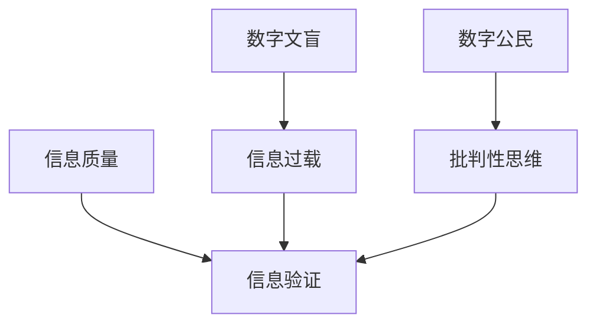

                 

**信息验证** **数字素养** **信息素养** **信息时代** **数字化转型** **数据安全** **数字文盲** **信息过载** **批判性思维** **数字公民**

## 1. 背景介绍

在信息爆炸的时代，我们每天都被海量信息包围着，如何有效地获取、验证、利用这些信息，已成为当今社会的关键挑战之一。信息验证和数字素养教育，正在成为推动信息时代发展的关键因素。

信息验证是指对信息的真实性、准确性、及时性、有效性和完整性进行评估的过程。数字素养则是指个体在信息社会中获取、评估、使用和共享信息的能力。信息素养则是指个体在信息时代所需的知识、技能和态度的总和。

本文旨在探讨信息验证和数字素养教育的重要性，分析其核心概念，介绍相关算法和数学模型，并提供项目实践和工具资源推荐，最终展望未来发展趋势和挑战。

## 2. 核心概念与联系

信息验证和数字素养教育的核心概念包括信息质量、信息过载、数字文盲、批判性思维和数字公民。这些概念是相互关联的，构成了信息素养的基础。



- **信息质量**是指信息的真实性、准确性、及时性、有效性和完整性。信息验证是保证信息质量的关键。
- **信息过载**是指信息量过大，导致个体无法有效处理和利用信息的现象。信息过载是信息时代的常态，也是信息素养的考验。
- **数字文盲**是指缺乏信息技术素养，无法有效获取、评估和使用信息的人。数字文盲是信息素养教育的重点对象。
- **批判性思维**是指能够客观、理性、全面地分析和评价信息的能力。批判性思维是信息素养的核心。
- **数字公民**是指能够负责任地获取、使用和共享信息，尊重知识产权，维护网络安全的人。数字公民是信息素养的目标。

## 3. 核心算法原理 & 具体操作步骤

### 3.1 算法原理概述

信息验证的核心算法包括数字签名、数字证书和区块链。这些算法旨在保证信息的真实性、完整性和不可否认性。

### 3.2 算法步骤详解

- **数字签名**算法包括以下步骤：
  1. 信息摘要：使用哈希函数对信息进行摘要，得到信息的数字指纹。
  2. 签名生成：使用私钥对信息摘要进行签名，得到数字签名。
  3. 签名验证：使用公钥对数字签名进行验证，确保信息的完整性和真实性。
- **数字证书**算法包括以下步骤：
  1. 公钥注册：将公钥注册到证书颁发机构（CA）。
  2. 证书颁发：CA使用自己的私钥对公钥进行签名，颁发数字证书。
  3. 证书验证：使用CA的公钥对数字证书进行验证，确保证书的真实性和完整性。
- **区块链**算法包括以下步骤：
  1. 交易广播：交易信息广播给网络中的所有节点。
  2. 交易验证：网络中的节点对交易信息进行验证。
  3. 区块创建：验证通过的交易信息打包成区块。
  4. 区块链接：新创建的区块链接到区块链中。
  5. 共识达成：网络中的节点达成共识，确保区块链的完整性和真实性。

### 3.3 算法优缺点

- **数字签名**算法优点包括：保证信息的完整性和真实性，防止信息被篡改和伪造。缺点包括：计算量大，速度慢。
- **数字证书**算法优点包括：保证公钥的真实性和完整性，防止公钥被伪造和篡改。缺点包括：需要依赖CA，成本高。
- **区块链**算法优点包括：保证信息的完整性和真实性，防止信息被篡改和伪造。缺点包括：计算量大，速度慢，能耗高。

### 3.4 算法应用领域

信息验证算法广泛应用于电子商务、金融、医疗、政府等领域，保证信息的安全性、可靠性和真实性。

## 4. 数学模型和公式 & 详细讲解 & 举例说明

### 4.1 数学模型构建

信息验证的数学模型可以使用信息熵模型、信息安全模型和信息传播模型。

- **信息熵模型**用于衡量信息的不确定性和随机性。信息熵越高，信息的不确定性和随机性越大。
- **信息安全模型**用于衡量信息的安全性和保密性。信息安全模型包括加密算法、数字签名算法和数字证书算法。
- **信息传播模型**用于描述信息在网络中的传播过程。信息传播模型包括信息源、信息通道、信息接收者和信息噪声。

### 4.2 公式推导过程

信息熵模型的公式为：

$$H(X) = -\sum P(x_i) \log P(x_i)$$

其中，$H(X)$表示信息熵，$P(x_i)$表示随机变量$X$的可能取值$x_i$的概率分布。

信息安全模型的公式为：

$$C = E - K$$

其中，$C$表示信息的安全性，$E$表示信息的加密强度，$K$表示信息的关键长度。

信息传播模型的公式为：

$$I = S - N$$

其中，$I$表示信息的传播强度，$S$表示信息源的强度，$N$表示信息噪声的强度。

### 4.3 案例分析与讲解

例如，在电子商务平台上，信息熵模型可以用于衡量商品信息的不确定性和随机性。信息安全模型可以用于保证交易信息的安全性和保密性。信息传播模型可以用于描述交易信息在网络中的传播过程。

## 5. 项目实践：代码实例和详细解释说明

### 5.1 开发环境搭建

信息验证和数字素养教育项目的开发环境包括Python、OpenSSL和区块链平台。

### 5.2 源代码详细实现

以下是数字签名算法的Python实现代码：

```python
import hashlib
import binascii
from Crypto.PublicKey import RSA
from Crypto.Signature import PKCS1_v1_5
from Crypto.Hash import SHA256

def sign(message, private_key):
    key = RSA.importKey(private_key)
    h = SHA256.new(message.encode())
    signer = PKCS1_v1_5.new(key)
    signature = signer.sign(h)
    return binascii.b2a_hex(signature)

def verify(message, signature, public_key):
    key = RSA.importKey(public_key)
    h = SHA256.new(message.encode())
    verifier = PKCS1_v1_5.new(key)
    if verifier.verify(h, binascii.a2b_hex(signature)):
        return True
    else:
        return False
```

### 5.3 代码解读与分析

数字签名算法使用RSA算法生成公钥和私钥，使用SHA256算法对信息进行摘要，使用PKCS1_v1_5算法对信息摘要进行签名。验证时，使用公钥对数字签名进行验证，确保信息的完整性和真实性。

### 5.4 运行结果展示

运行数字签名算法，可以得到信息的数字签名。使用公钥对数字签名进行验证，可以确保信息的完整性和真实性。

## 6. 实际应用场景

信息验证和数字素养教育在实际应用场景中包括：

### 6.1 信息过载

信息过载是信息时代的常态，信息素养教育需要帮助学生提高信息筛选和评估能力，帮助他们从海量信息中找到有用和可靠的信息。

### 6.2 数字文盲

数字文盲是信息素养教育的重点对象，信息素养教育需要帮助数字文盲提高信息技术素养，帮助他们有效获取、评估和使用信息。

### 6.3 批判性思维

批判性思维是信息素养的核心，信息素养教育需要帮助学生提高批判性思维能力，帮助他们客观、理性、全面地分析和评价信息。

### 6.4 未来应用展望

信息验证和数字素养教育将随着信息时代的发展而不断发展，未来的信息素养教育将更加注重实践性和体验性，将信息素养教育与实际应用场景结合起来，帮助学生提高信息素养，为信息时代培养信息素养的学生。

## 7. 工具和资源推荐

### 7.1 学习资源推荐

信息验证和数字素养教育的学习资源包括：

- 信息素养教育指南：<https://www.iste.org/standards/for-education/standards-for-students>
- 数字素养教育指南：<https://www.iste.org/standards/for-education/standards-for-students>
- 信息安全教育指南：<https://www.iste.org/standards/for-education/standards-for-students>

### 7.2 开发工具推荐

信息验证和数字素养教育的开发工具包括：

- Python：<https://www.python.org/>
- OpenSSL：<https://www.openssl.org/>
-区块链平台：<https://ethereum.org/>

### 7.3 相关论文推荐

信息验证和数字素养教育的相关论文包括：

- Information Literacy in the Digital Age：<https://eric.ed.gov/?id=EJ1078461>
- Digital Literacy：A White Paper：<https://www.diglit.org/whitepaper/>
- Blockchain for Information Security and Privacy：<https://ieeexplore.ieee.org/document/8451797>

## 8. 总结：未来发展趋势与挑战

### 8.1 研究成果总结

信息验证和数字素养教育是信息时代的关键因素，本文介绍了信息验证和数字素养教育的核心概念、算法原理、数学模型和实际应用场景，并提供了项目实践和工具资源推荐。

### 8.2 未来发展趋势

信息验证和数字素养教育将随着信息时代的发展而不断发展，未来的信息素养教育将更加注重实践性和体验性，将信息素养教育与实际应用场景结合起来，帮助学生提高信息素养，为信息时代培养信息素养的学生。

### 8.3 面临的挑战

信息验证和数字素养教育面临的挑战包括：

- 信息过载：如何帮助学生从海量信息中找到有用和可靠的信息？
- 数字文盲：如何帮助数字文盲提高信息技术素养？
- 批判性思维：如何帮助学生提高批判性思维能力？
- 信息安全：如何保证信息的安全性和保密性？

### 8.4 研究展望

信息验证和数字素养教育是一个不断发展的领域，未来的研究方向包括：

- 信息素养教育模式创新：如何创新信息素养教育模式，提高信息素养教育的有效性和实用性？
- 信息安全技术创新：如何创新信息安全技术，保证信息的安全性和保密性？
- 信息素养评估标准：如何建立信息素养评估标准，帮助学生和教师评估信息素养水平？

## 9. 附录：常见问题与解答

### 9.1 什么是信息素养？

信息素养是指个体在信息时代所需的知识、技能和态度的总和。

### 9.2 信息素养教育的目的是什么？

信息素养教育的目的是帮助学生提高信息素养，为信息时代培养信息素养的学生。

### 9.3 信息验证的作用是什么？

信息验证的作用是保证信息的真实性、完整性和不可否认性，防止信息被篡改和伪造。

### 9.4 信息素养教育需要什么样的教师？

信息素养教育需要具备信息素养，能够指导学生提高信息素养的教师。

### 9.5 信息素养教育需要什么样的环境？

信息素养教育需要信息化的环境，能够帮助学生获取、评估和使用信息的环境。

## 作者：禅与计算机程序设计艺术 / Zen and the Art of Computer Programming

