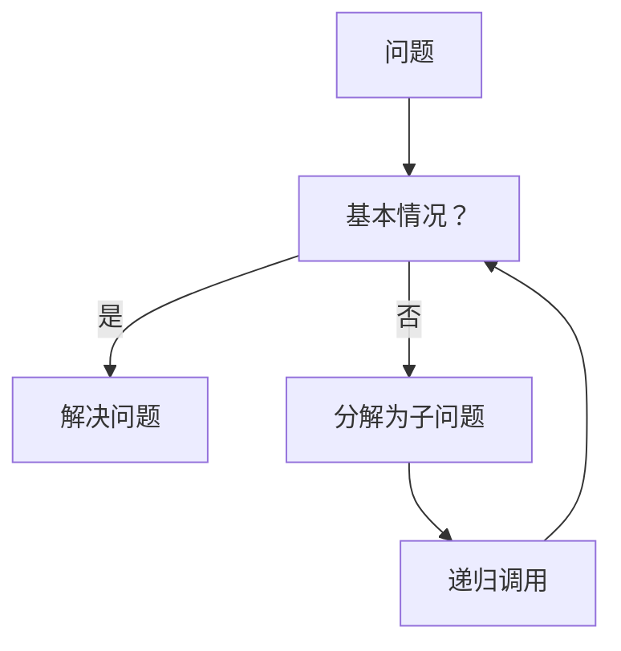

                 

递归，数学思维，算法，程序设计，计算机科学，数学模型，公式推导，项目实践，实际应用场景，工具和资源推荐，未来发展趋势

## 1. 背景介绍

在计算机科学领域，递归是一种强大的问题解决方法，它允许函数在其定义中调用自身。这种自引用的特性使得递归成为解决复杂问题的有力工具。然而，要像数学家一样思考递归，我们需要理解其背后的数学原理和逻辑结构。本文将深入探讨递归原理，从核心概念到具体算法，再到数学模型和实际应用，为读者提供全面的理解和实践指南。

## 2. 核心概念与联系

### 2.1 递归的定义

递归是一种计算过程，其中一个函数直接或间接地调用自身。递归函数的定义通常包含两个部分：基本情况（base case）和递归情况（recursive case）。基本情况定义了何时停止递归调用，而递归情况则描述了如何将问题分解为更小的子问题。

### 2.2 递归与迭代的区别

与递归相反，迭代是一种通过重复执行一系列步骤来解决问题的方法。迭代通常使用循环结构，如 for 循环或 while 循环。与递归相比，迭代通常更容易理解和实现，但递归在解决某些问题时更加简洁和直观。

### 2.3 递归的优缺点

递归的优点包括：

* 简化代码：递归可以使代码更简洁明了，易于理解和维护。
* 更自然的问题解决方法：递归允许我们使用更直观和自然的方式解决问题，因为它模拟了人类解决问题的方式。
* 更容易推导数学公式：递归可以帮助我们推导数学公式，并更容易理解这些公式的含义。

递归的缺点包括：

* 更高的内存消耗：递归调用会导致栈帧的创建，这可能会导致内存消耗增加。
* 更难以调试：递归代码通常更难以调试，因为它涉及到多层次的函数调用。
* 更容易出现错误：递归代码更容易出现错误，如无限递归或无法到达基本情况。

### 2.4 递归的应用领域

递归在计算机科学领域有着广泛的应用，包括：

* 算法设计：递归是设计算法的关键工具，用于解决各种问题，如排序、搜索和图论等。
* 数学计算：递归可以用于计算数学函数的值，如Factorial、Fibonacci序列等。
* 编程语言设计：递归是许多编程语言的关键特性，允许函数调用自身。

### 2.5 递归原理的 Mermaid 流程图



## 3. 核心算法原理 & 具体操作步骤

### 3.1 算法原理概述

递归算法的原理是将问题分解为更小的子问题，直到到达基本情况。基本情况定义了何时停止递归调用，而递归情况则描述了如何将问题分解为更小的子问题。递归算法的关键是确保每个递归调用都向基本情况迈进一步。

### 3.2 算法步骤详解

1. 定义基本情况：基本情况是递归调用停止的条件。基本情况通常是问题的最小单位，或者是问题的解决方案。
2. 定义递归情况：递归情况描述了如何将问题分解为更小的子问题。递归情况通常涉及到递归调用，将问题分解为更小的子问题。
3. 实现递归函数：编写递归函数，在函数定义中调用自身。确保每个递归调用都向基本情况迈进一步。
4. 测试和调试：测试递归函数，确保它能够正确地解决问题。调试递归函数可能会更困难，因为它涉及到多层次的函数调用。

### 3.3 算法优缺点

递归算法的优点包括：

* 简化代码：递归算法可以使代码更简洁明了，易于理解和维护。
* 更自然的问题解决方法：递归算法允许我们使用更直观和自然的方式解决问题，因为它模拟了人类解决问题的方式。
* 更容易推导数学公式：递归算法可以帮助我们推导数学公式，并更容易理解这些公式的含义。

递归算法的缺点包括：

* 更高的内存消耗：递归调用会导致栈帧的创建，这可能会导致内存消耗增加。
* 更难以调试：递归算法通常更难以调试，因为它涉及到多层次的函数调用。
* 更容易出现错误：递归算法更容易出现错误，如无限递归或无法到达基本情况。

### 3.4 算法应用领域

递归算法在计算机科学领域有着广泛的应用，包括：

* 算法设计：递归算法是设计算法的关键工具，用于解决各种问题，如排序、搜索和图论等。
* 数学计算：递归算法可以用于计算数学函数的值，如Factorial、Fibonacci序列等。
* 编程语言设计：递归算法是许多编程语言的关键特性，允许函数调用自身。

## 4. 数学模型和公式 & 详细讲解 & 举例说明

### 4.1 数学模型构建

递归问题的数学模型通常是递归方程，描述了问题的解决方案如何依赖于更小的子问题的解决方案。递归方程通常包含两个部分：基本情况和递归情况。

### 4.2 公式推导过程

递归方程的推导过程通常涉及到将问题分解为更小的子问题，直到到达基本情况。然后，使用基本情况的解决方案构建更大问题的解决方案。这个过程重复进行，直到构建出原始问题的解决方案。

### 4.3 案例分析与讲解

#### 4.3.1 Factorial 函数

Factorial 函数是一个典型的递归函数，用于计算给定数字的阶乘。Factorial 函数的递归方程为：

$$n! = n \times (n-1)!$$

基本情况是当 $n=0$ 或 $n=1$ 时，Factorial 函数的值为 $1$。

递归情况是当 $n > 1$ 时，Factorial 函数的值等于 $n$ 乘以 $(n-1)$ 的 Factorial 函数的值。

#### 4.3.2 Fibonacci 序列

Fibonacci 序列是另一个典型的递归问题，用于生成一系列数字，其中每个数字都是前两个数字的和。Fibonacci 序列的递归方程为：

$$F(n) = F(n-1) + F(n-2)$$

基本情况是当 $n=0$ 或 $n=1$ 时，Fibonacci 序列的值为 $n$。

递归情况是当 $n > 1$ 时，Fibonacci 序列的值等于 $(n-1)$ 和 $(n-2)$ 的 Fibonacci 序列的值之和。

## 5. 项目实践：代码实例和详细解释说明

### 5.1 开发环境搭建

本项目使用 Python 语言实现递归算法。确保您的系统上安装了 Python 3.x 版本。您可以从官方网站（https://www.python.org/downloads/）下载并安装 Python。

### 5.2 源代码详细实现

#### 5.2.1 Factorial 函数实现

```python
def factorial(n):
    if n == 0 or n == 1:
        return 1
    else:
        return n * factorial(n-1)
```

#### 5.2.2 Fibonacci 序列实现

```python
def fibonacci(n):
    if n == 0 or n == 1:
        return n
    else:
        return fibonacci(n-1) + fibonacci(n-2)
```

### 5.3 代码解读与分析

#### 5.3.1 Factorial 函数解读

Factorial 函数的实现遵循递归原理，将问题分解为更小的子问题。当 $n=0$ 或 $n=1$ 时，函数返回 $1$。否则，函数调用自身，计算 $(n-1)$ 的 Factorial 函数的值，并将其乘以 $n$。

#### 5.3.2 Fibonacci 序列解读

Fibonacci 序列的实现也遵循递归原理，将问题分解为更小的子问题。当 $n=0$ 或 $n=1$ 时，函数返回 $n$。否则，函数调用自身，计算 $(n-1)$ 和 $(n-2)$ 的 Fibonacci 序列的值，并将其相加。

### 5.4 运行结果展示

#### 5.4.1 Factorial 函数运行结果

```python
print(factorial(5))  # Output: 120
```

#### 5.4.2 Fibonacci 序列运行结果

```python
print(fibonacci(10))  # Output: 55
```

## 6. 实际应用场景

### 6.1 算法设计

递归算法在算法设计中扮演着关键角色。它们允许我们使用更直观和自然的方式解决问题，并使代码更简洁明了。递归算法的应用领域包括排序、搜索和图论等。

### 6.2 数学计算

递归算法可以用于计算数学函数的值，如Factorial、Fibonacci序列等。这些算法允许我们使用更直观和自然的方式计算数学函数的值。

### 6.3 编程语言设计

递归算法是许多编程语言的关键特性，允许函数调用自身。这使得编程语言更强大和灵活，允许程序员使用更直观和自然的方式解决问题。

### 6.4 未来应用展望

未来，递归算法将继续在计算机科学领域发挥关键作用。随着编程语言和算法设计的不断发展，递归算法将变得更加强大和高效。此外，递归算法在人工智能和机器学习领域也将扮演重要角色，帮助我们解决更复杂和更抽象的问题。

## 7. 工具和资源推荐

### 7.1 学习资源推荐

* "算法导论"（Introduction to Algorithms） - 托马斯·H. 科尔曼（Thomas H. Cormen）等人著
* "计算机程序的构造和解释"（Concrete Mathematics: A Foundation for Computer Science） - 克努特·海泽（Knuth）和大卫·加尔文（Gries）著
* "编程珠玑"（Programming Pearls） - Jon Bentley 编著

### 7.2 开发工具推荐

* Python：一种强大的编程语言，广泛用于递归算法的实现。
* Visual Studio Code：一种跨平台集成开发环境（IDE），支持 Python 等多种编程语言。
* Jupyter Notebook：一种开源的交互式计算环境，支持 Python 等多种编程语言。

### 7.3 相关论文推荐

* "Recursion" - Donald E. Knuth
* "The Art of Computer Programming" - Donald E. Knuth
* "Recursive algorithms" - Robert Sedgewick and Philippe Flajolet

## 8. 总结：未来发展趋势与挑战

### 8.1 研究成果总结

本文深入探讨了递归原理，从核心概念到具体算法，再到数学模型和实际应用。我们讨论了递归的优缺点，并提供了 Factorial 和 Fibonacci 序列的代码实现。此外，我们还推荐了相关的学习资源、开发工具和论文。

### 8.2 未来发展趋势

未来，递归算法将继续在计算机科学领域发挥关键作用。随着编程语言和算法设计的不断发展，递归算法将变得更加强大和高效。此外，递归算法在人工智能和机器学习领域也将扮演重要角色，帮助我们解决更复杂和更抽象的问题。

### 8.3 面临的挑战

递归算法面临的挑战包括：

* 内存消耗：递归调用会导致栈帧的创建，这可能会导致内存消耗增加。
* 调试困难：递归代码通常更难以调试，因为它涉及到多层次的函数调用。
* 错误可能性：递归代码更容易出现错误，如无限递归或无法到达基本情况。

### 8.4 研究展望

未来的研究将关注于提高递归算法的效率和可靠性。这包括开发新的递归算法，改进现有算法，并研究递归算法在人工智能和机器学习领域的应用。

## 9. 附录：常见问题与解答

**Q1：递归和迭代有什么区别？**

A1：递归是一种计算过程，其中一个函数直接或间接地调用自身。迭代是一种通过重复执行一系列步骤来解决问题的方法。与递归相比，迭代通常更容易理解和实现，但递归在解决某些问题时更加简洁和直观。

**Q2：递归算法的优缺点是什么？**

A2：递归算法的优点包括简化代码、更自然的问题解决方法和更容易推导数学公式。递归算法的缺点包括更高的内存消耗、更难以调试和更容易出现错误。

**Q3：递归算法有哪些应用领域？**

A3：递归算法在计算机科学领域有着广泛的应用，包括算法设计、数学计算和编程语言设计。

**Q4：如何构建递归算法的数学模型？**

A4：递归问题的数学模型通常是递归方程，描述了问题的解决方案如何依赖于更小的子问题的解决方案。递归方程通常包含两个部分：基本情况和递归情况。

**Q5：如何推导递归方程？**

A5：递归方程的推导过程通常涉及到将问题分解为更小的子问题，直到到达基本情况。然后，使用基本情况的解决方案构建更大问题的解决方案。这个过程重复进行，直到构建出原始问题的解决方案。

**Q6：如何实现递归算法？**

A6：实现递归算法的关键是确保每个递归调用都向基本情况迈进一步。这包括定义基本情况和递归情况，并编写递归函数。

**Q7：如何调试递归算法？**

A7：调试递归算法可能会更困难，因为它涉及到多层次的函数调用。常见的调试技术包括使用调试器、添加调试日志和使用断点。

**Q8：递归算法的未来发展趋势是什么？**

A8：未来，递归算法将继续在计算机科学领域发挥关键作用。随着编程语言和算法设计的不断发展，递归算法将变得更加强大和高效。此外，递归算法在人工智能和机器学习领域也将扮演重要角色，帮助我们解决更复杂和更抽象的问题。

**Q9：递归算法面临的挑战是什么？**

A9：递归算法面临的挑战包括内存消耗、调试困难和错误可能性。

**Q10：未来的研究将关注于什么？**

A10：未来的研究将关注于提高递归算法的效率和可靠性。这包括开发新的递归算法，改进现有算法，并研究递归算法在人工智能和机器学习领域的应用。

## 作者：禅与计算机程序设计艺术 / Zen and the Art of Computer Programming

