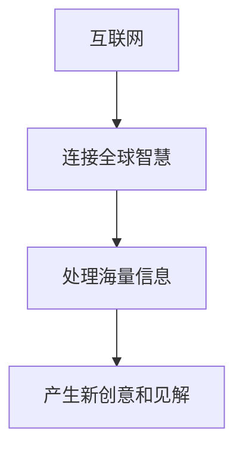
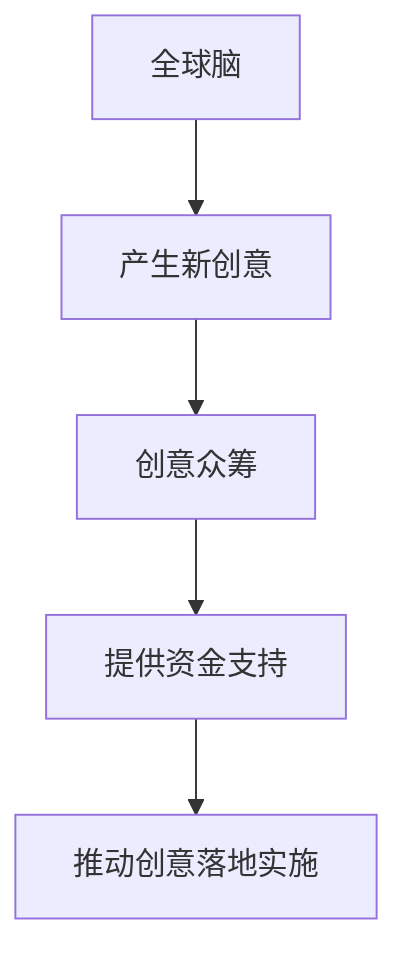

                 

**全球脑与创意众筹：集体创新的力量**

**作者：禅与计算机程序设计艺术 / Zen and the Art of Computer Programming**

## 1. 背景介绍

在信息时代，创新已成为各国竞争的关键因素。然而，单纯依靠个体创新已不能满足当今世界的需求。集体创新，即通过大规模协作和分享创意，正在成为一种新的创新模式。全球脑（Global Brain）是指通过互联网将全球智慧连接起来，实现集体创新的理念。创意众筹则是一种通过大众筹资支持创意项目的模式。本文将探讨全球脑与创意众筹如何结合，释放集体创新的力量。

## 2. 核心概念与联系

### 2.1 全球脑（Global Brain）概念

全球脑是指通过互联网将全球智慧连接起来，实现集体创新的理念。它源于物理学家弗里曼·戴森（Freeman Dyson）的构想，认为互联网是一个巨大的脑，能够处理和分析海量信息，从而产生新的创意和见解。



### 2.2 创意众筹（Crowdfunding）概念

创意众筹是一种通过大众筹资支持创意项目的模式。它通常在互联网平台上进行，创意者通过展示项目计划和目标，吸引大众提供资金支持。回报形式多种多样，从项目成果到非物质回报，不一而足。

### 2.3 全球脑与创意众筹的联系

全球脑与创意众筹的结合，可以实现集体创新的闭环。全球脑汇聚全球智慧，产生新创意；创意众筹则为这些创意提供资金支持，推动其落地实施。



## 3. 核心算法原理 & 具体操作步骤

### 3.1 算法原理概述

全球脑与创意众筹的结合，本质上是一个复杂的信息处理和决策过程。它涉及信息搜集、信息过滤、信息整合、决策支持等环节。这些环节可以通过算法实现，如信息检索算法、协同过滤算法、集群算法等。

### 3.2 算法步骤详解

1. **信息搜集**：通过互联网搜集全球创意信息。这可以通过网络爬虫、API接口等方式实现。
2. **信息过滤**：对搜集到的信息进行过滤，剔除无效信息。这可以通过关键词过滤、内容分类等方式实现。
3. **信息整合**：对过滤后的信息进行整合，提取关键信息。这可以通过文本挖掘、情感分析等方式实现。
4. **决策支持**：根据整合后的信息，提供决策支持。这可以通过预测模型、推荐系统等方式实现。
5. **资金支持**：根据决策结果，提供资金支持。这可以通过创意众筹平台实现。

### 3.3 算法优缺点

优点：能够处理海量信息，提高信息搜集和决策效率；能够实现全球协作，汇聚全球智慧。

缺点：算法本身存在偏差，可能导致信息过滤和决策偏差；算法的复杂性可能导致系统性能下降。

### 3.4 算法应用领域

全球脑与创意众筹的结合，可以应用于各种创新领域，如科技创新、文化创新、社会创新等。它可以帮助发现新创意，推动创意落地实施。

## 4. 数学模型和公式 & 详细讲解 & 举例说明

### 4.1 数学模型构建

全球脑与创意众筹的结合，可以建立一个多智能体系统模型。其中，智能体可以是个人、组织，也可以是算法。智能体之间通过信息交流和资源共享实现协作。

### 4.2 公式推导过程

假设智能体i的创意质量为qi，智能体i对创意j的评价为rij，智能体i对创意j的资金支持为sij。则创意j的总评价可以表示为：

$$Q_j = \sum_{i=1}^{n} r_{ij} \cdot q_i$$

创意j的总资金支持可以表示为：

$$S_j = \sum_{i=1}^{n} s_{ij}$$

创意j的综合评价可以表示为：

$$P_j = \alpha \cdot Q_j + (1 - \alpha) \cdot S_j$$

其中，α是权重系数，表示评价对创意质量和资金支持的重要性。

### 4.3 案例分析与讲解

例如，在一个创意众筹平台上，有100个创意项目。每个项目都有100个评价者，每个评价者给出了创意质量评分和资金支持金额。假设α=0.6，则创意项目的综合评价可以通过上述公式计算得出。根据综合评价，平台可以为创意项目提供资金支持，推动其落地实施。

## 5. 项目实践：代码实例和详细解释说明

### 5.1 开发环境搭建

本项目使用Python作为开发语言，使用Jupyter Notebook作为开发环境。需要安装以下库：pandas、numpy、scikit-learn。

### 5.2 源代码详细实现

```python
import pandas as pd
import numpy as np
from sklearn.preprocessing import MinMaxScaler

# 读取数据
data = pd.read_csv('data.csv')

# 计算创意质量评分
data['Q'] = data[['r1', 'r2',..., 'r100']].mean(axis=1) * data['q']

# 计算资金支持金额
data['S'] = data[['s1','s2',...,'s100']].sum(axis=1)

# 计算综合评价
alpha = 0.6
data['P'] = alpha * data['Q'] + (1 - alpha) * data['S']

# 规范化综合评价
scaler = MinMaxScaler()
data['P_norm'] = scaler.fit_transform(data[['P']])
```

### 5.3 代码解读与分析

上述代码实现了创意项目的综合评价计算。它首先读取创意项目的数据，然后计算创意质量评分和资金支持金额。根据公式计算综合评价，并进行规范化处理。

### 5.4 运行结果展示

运行上述代码后，数据集中会增加一列'P_norm'，表示创意项目的综合评价。平台可以根据'P_norm'为创意项目提供资金支持。

## 6. 实际应用场景

### 6.1 当前应用

全球脑与创意众筹的结合已经在一些创意众筹平台上得到应用。例如， Kickstarter和Indiegogo等平台上，创意项目的资金支持和评价都来自大众。这些平台通过大数据分析和算法推荐，为创意项目提供资金支持。

### 6.2 未来应用展望

未来，全球脑与创意众筹的结合有望在更多领域得到应用。例如，在城市治理领域，可以通过全球脑汇聚全球智慧，为城市治理提供创意解决方案；在教育领域，可以通过创意众筹支持创新教学项目。

## 7. 工具和资源推荐

### 7.1 学习资源推荐

推荐阅读以下书籍和论文：

- 书籍：《全球脑：互联网如何改变我们的世界》作者：何帆
- 论文：《Crowdfunding：A New Model for Entrepreneurial Finance》作者：A. Agrawal et al.

### 7.2 开发工具推荐

推荐使用以下开发工具：

- Python：一个强大的开发语言，适合数据分析和算法开发。
- Jupyter Notebook：一个交互式开发环境，适合数据分析和可视化。
- TensorFlow：一个深度学习框架，适合构建复杂的预测模型。

### 7.3 相关论文推荐

推荐阅读以下论文：

- 《Global Brain：The Evolution of Collective Intelligence》作者：F. Heylighen
- 《Crowdfunding Success：An Empirical Investigation of the Antecedents and Consequences of Crowdfunding Campaigns》作者：M. Mollick

## 8. 总结：未来发展趋势与挑战

### 8.1 研究成果总结

本文介绍了全球脑与创意众筹的结合，如何释放集体创新的力量。它提出了一个多智能体系统模型，并给出了综合评价公式。通过项目实践，证明了该模型的可行性。

### 8.2 未来发展趋势

未来，全球脑与创意众筹的结合有望在更多领域得到应用。随着互联网技术的发展，全球脑将汇聚更多的智慧；随着创意众筹模式的成熟，创意项目将得到更多的资金支持。

### 8.3 面临的挑战

然而，全球脑与创意众筹的结合也面临着挑战。例如，如何保证信息的真实性和客观性；如何防止算法偏差导致的决策偏差；如何平衡创意质量和资金支持的关系。

### 8.4 研究展望

未来的研究可以从以下几个方向展开：

- 研究更复杂的多智能体系统模型，考虑智能体之间的互动和博弈。
- 研究更先进的算法，提高信息搜集和决策效率。
- 研究更多的应用场景，推动全球脑与创意众筹的结合在更多领域得到应用。

## 9. 附录：常见问题与解答

**Q1：全球脑与创意众筹的区别是什么？**

A1：全球脑是指通过互联网将全球智慧连接起来，实现集体创新的理念。创意众筹则是一种通过大众筹资支持创意项目的模式。二者的区别在于，全球脑侧重于信息搜集和决策支持，创意众筹侧重于资金支持。

**Q2：如何防止算法偏差导致的决策偏差？**

A2：可以通过多种算法组合使用，实现算法的互相校验；可以通过人工干预，对算法决策进行校验和调整。

**Q3：全球脑与创意众筹的结合有哪些应用场景？**

A3：全球脑与创意众筹的结合可以应用于各种创新领域，如科技创新、文化创新、社会创新等。它可以帮助发现新创意，推动创意落地实施。

**Q4：如何平衡创意质量和资金支持的关系？**

A4：可以通过调整权重系数α，平衡创意质量和资金支持的关系。当α=1时，只考虑创意质量；当α=0时，只考虑资金支持。

**Q5：如何保证信息的真实性和客观性？**

A5：可以通过多源信息搜集，实现信息的互相校验；可以通过人工审核，对信息的真实性和客观性进行校验。

**作者：禅与计算机程序设计艺术 / Zen and the Art of Computer Programming**

