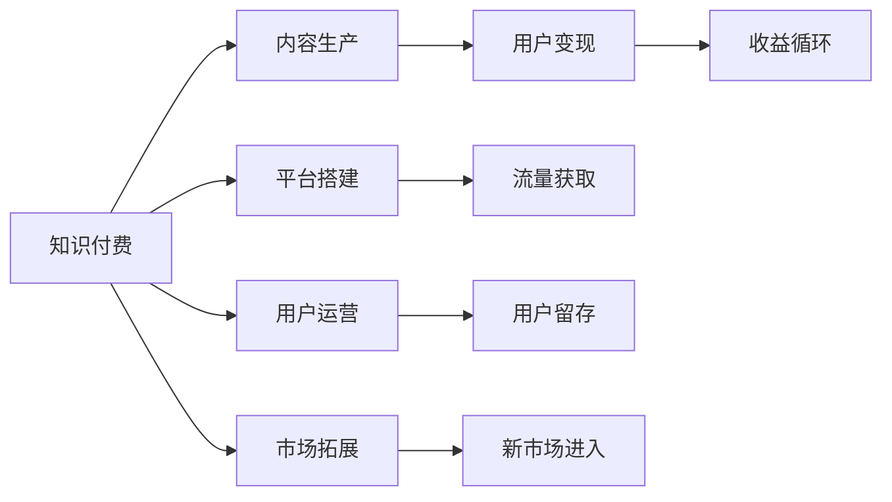

                 

# 知识付费创业的跨平台运营策略

## 1. 背景介绍

随着移动互联网的普及和知识经济的兴起，知识付费已成为新型互联网内容消费的重要形式。作为内容创造者，如何有效地运营知识付费平台，最大化变现，并打造品牌，成为当前创业者和运营者面临的重要课题。本文将深入探讨知识付费创业的跨平台运营策略，涵盖内容生产、平台搭建、用户运营、市场拓展等多个方面，旨在为相关从业者提供一套系统化、实战化的运营指南。

## 2. 核心概念与联系

### 2.1 核心概念概述

为了更好地理解知识付费的跨平台运营，本节将介绍几个核心概念：

- **知识付费**：指用户为获取特定知识和信息而支付费用的商业模式。知识付费平台通过整合优质内容，为知识创作者提供变现渠道。
- **内容生产**：指知识创作者根据市场需求和自身专长，创作有价值的内容，如音频、视频、文章等。
- **平台搭建**：指利用技术手段搭建知识付费平台，并提供内容的发布、交易、管理等功能。
- **用户运营**：指通过各类运营手段吸引和留存用户，提升平台活跃度和用户粘性。
- **市场拓展**：指在已有市场的基础上，探索新的市场机会，拓展新用户群体。
- **用户变现**：指通过用户订阅、单次付费、广告收入等方式实现平台收益。

这些核心概念相互关联，构成了知识付费创业的运营框架。理解这些概念及其内在联系，将有助于我们制定和执行有效的跨平台运营策略。

### 2.2 核心概念原理和架构的 Mermaid 流程图



这个流程图展示了知识付费平台的核心运营流程：

1. **知识付费**：起点和终点，实现知识变现。
2. **内容生产**：核心驱动，为变现提供内容支撑。
3. **平台搭建**：基础设施，提供内容交易和技术支持。
4. **用户运营**：关键环节，吸引和维护用户，提升平台粘性。
5. **市场拓展**：拓展机会，探索新市场，扩大用户基数。
6. **用户变现**：收益来源，实现平台盈利。
7. **流量获取**：平台访问量，吸引潜在用户。
8. **用户留存**：用户活跃度，提升平台生命力。
9. **新市场进入**：业务扩展，寻找新增长点。
10. **收益循环**：循环过程，确保平台持续盈利。

这些环节相互依赖，共同推动知识付费平台的运营和发展。

## 3. 核心算法原理 & 具体操作步骤

### 3.1 算法原理概述

知识付费创业的跨平台运营策略，本质上是一种多维度、多渠道的协同优化策略。其核心思想是通过精准的内容生产、高效的平台运营、精细化的用户管理和主动的市场拓展，实现平台的持续增长和收益最大化。

知识付费平台的运营模型可以概括为：

$$
\text{运营收入} = \text{内容质量} \times \text{用户量} \times \text{单用户收益}
$$

其中：

- **内容质量**：指内容的专业性、独特性和价值性，直接影响用户的订阅意愿。
- **用户量**：指平台活跃用户数，反映了平台的吸引力和市场占有率。
- **单用户收益**：指每位用户的平均收入，受到内容订阅模式、单次付费价格和广告收入等因素的影响。

平台运营的目标是最大化上述乘积，实现可持续的盈利模式。

### 3.2 算法步骤详解

知识付费创业的跨平台运营策略，可以分为以下几个关键步骤：

**Step 1: 确定内容定位和战略**

- **市场需求分析**：通过市场调研和用户反馈，确定目标用户群体的知识需求和消费习惯。
- **内容定位**：根据市场需求和自身专长，制定内容生产的战略方向，如行业深耕、主题多元等。
- **资源整合**：整合优质内容资源，包括知识创作者、版权作品等，为内容生产提供保障。

**Step 2: 搭建平台基础设施**

- **技术选型**：选择合适的技术栈和开发工具，确保平台的稳定性和扩展性。
- **功能设计**：设计平台的核心功能，如内容发布、交易、支付、统计等，满足用户需求。
- **用户体验**：注重平台的界面设计和用户体验，提升用户满意度和留存率。

**Step 3: 内容生产与优化**

- **内容筛选**：建立内容筛选机制，确保内容的专业性和质量。
- **内容创新**：鼓励创作者不断创新，推出有差异化的优质内容。
- **内容优化**：通过用户反馈和数据分析，持续优化内容，提升用户粘性。

**Step 4: 用户运营与留存**

- **用户拉新**：通过市场推广、内容营销、社交网络等手段，吸引新用户。
- **用户留存**：通过个性化推荐、会员体系、社区建设等措施，提升用户活跃度和留存率。
- **用户粘性**：通过持续的内容更新、互动交流等，增强用户粘性。

**Step 5: 市场拓展与变现**

- **新市场探索**：探索新的市场机会，如行业细分、新主题领域等，拓展用户群体。
- **多渠道变现**：结合订阅模式、单次付费、广告收入等多种变现方式，实现收入多元化。
- **运营数据分析**：通过数据分析，优化运营策略，提升平台效率和收益。

### 3.3 算法优缺点

知识付费创业的跨平台运营策略具有以下优点：

- **协同效应**：多维度、多渠道的协同优化，提升平台整体运营效率和收益。
- **灵活性**：可以根据市场变化和用户需求，灵活调整策略，适应不断变化的市场环境。
- **可扩展性**：平台技术架构可扩展性强，支持未来业务的快速扩展和创新。

但该策略也存在一定的局限性：

- **资源投入**：需要大量资金和技术投入，初创平台面临较高的运营门槛。
- **风险管理**：运营策略复杂，需要精细化的管理，稍有不慎可能面临亏损风险。
- **市场竞争**：知识付费市场竞争激烈，需要持续创新和优化，保持市场竞争力。

### 3.4 算法应用领域

知识付费创业的跨平台运营策略，广泛应用于各类知识付费平台，如得到、分答、知乎live等。这些平台通过精准的内容定位、高效的运营管理、精细化的用户运营和主动的市场拓展，成功实现了知识变现和品牌建设。

## 4. 数学模型和公式 & 详细讲解

### 4.1 数学模型构建

知识付费平台的运营收入可以表示为一个简单的数学模型：

$$
\text{运营收入} = f(\text{内容质量}, \text{用户量}, \text{单用户收益})
$$

其中，$f$表示一个多变量函数，反映了内容质量、用户量、单用户收益等因素对运营收入的综合影响。

### 4.2 公式推导过程

通过分析运营收入的构成，可以推导出以下公式：

$$
\text{运营收入} = \text{内容订阅收入} + \text{单次付费收入} + \text{广告收入}
$$

其中：

- **内容订阅收入**：根据订阅模式和用户数计算。
- **单次付费收入**：根据单次付费金额和用户数计算。
- **广告收入**：根据广告曝光量和广告单价计算。

### 4.3 案例分析与讲解

以知乎live为例，其运营收入主要由以下几部分组成：

- **内容订阅收入**：用户通过购买订阅，获取特定内容。
- **单次付费收入**：用户单次购买特定内容，如某场直播讲座。
- **广告收入**：广告主通过在live页面展示广告，获取曝光。

知乎live通过内容生产、平台运营和用户运营等手段，实现高内容质量、高用户量和高单用户收益，最终实现了良好的运营收入。

## 5. 项目实践：代码实例和详细解释说明

### 5.1 开发环境搭建

在进行知识付费平台的开发前，需要准备好开发环境。以下是使用Python进行Flask开发的环境配置流程：

1. 安装Anaconda：从官网下载并安装Anaconda，用于创建独立的Python环境。

2. 创建并激活虚拟环境：
```bash
conda create -n flask-env python=3.8 
conda activate flask-env
```

3. 安装Flask：
```bash
pip install flask
```

4. 安装Flask-RESTful：
```bash
pip install flask-restful
```

5. 安装Flask-SQLAlchemy：
```bash
pip install flask-sqlalchemy
```

6. 安装Flask-Login：
```bash
pip install flask-login
```

7. 安装Flask-WTF：
```bash
pip install flask-wtf
```

8. 安装SQLite：
```bash
pip install pysqlite3
```

完成上述步骤后，即可在`flask-env`环境中开始知识付费平台的开发。

### 5.2 源代码详细实现

以下是一个简单的知识付费平台API接口的实现，包括用户登录、内容发布、订单支付等功能。

```python
from flask import Flask, request, jsonify
from flask_sqlalchemy import SQLAlchemy
from flask_login import LoginManager, login_user, logout_user, login_required, current_user
from flask_wtf import FlaskForm
from wtforms import StringField, PasswordField, SubmitField
from wtforms.validators import DataRequired
from werkzeug.security import generate_password_hash, check_password_hash

app = Flask(__name__)
app.config['SQLALCHEMY_DATABASE_URI'] = 'sqlite:////tmp/test.db'
app.config['SECRET_KEY'] = 'secret_key'

db = SQLAlchemy(app)
login_manager = LoginManager()
login_manager.init_app(app)

class User(db.Model):
    id = db.Column(db.Integer, primary_key=True)
    username = db.Column(db.String(80), unique=True, nullable=False)
    password = db.Column(db.String(120), nullable=False)

    def __repr__(self):
        return f'<User {self.username}>'

@login_manager.user_loader
def load_user(user_id):
    return User.query.get(int(user_id))

class LoginForm(FlaskForm):
    username = StringField('Username', validators=[DataRequired()])
    password = PasswordField('Password', validators=[DataRequired()])
    submit = SubmitField('Log In')

@app.route('/login', methods=['GET', 'POST'])
def login():
    form = LoginForm()
    if form.validate_on_submit():
        user = User.query.filter_by(username=form.username.data).first()
        if user and check_password_hash(user.password, form.password.data):
            login_user(user)
            return redirect(url_for('home'))
    return render_template('login.html', title='Log In', form=form)

@app.route('/logout')
@login_required
def logout():
    logout_user()
    return redirect(url_for('home'))

@app.route('/register', methods=['GET', 'POST'])
def register():
    form = RegistrationForm()
    if form.validate_on_submit():
        hashed_password = generate_password_hash(form.password.data, method='sha256')
        new_user = User(username=form.username.data, password=hashed_password)
        db.session.add(new_user)
        db.session.commit()
        return redirect(url_for('login'))
    return render_template('register.html', title='Register', form=form)

@app.route('/home')
@login_required
def home():
    return render_template('home.html', title='Home')

@app.route('/logout')
@login_required
def logout():
    logout_user()
    return redirect(url_for('home'))

if __name__ == '__main__':
    app.run(debug=True)
```

这个代码实现了用户登录、注册和主页展示等功能。开发者可以根据自己的需求，进一步扩展平台功能，如内容发布、订单支付、数据分析等。

### 5.3 代码解读与分析

**Flask框架**：
- Flask是一个轻量级的Python Web应用框架，简单易用，适合快速搭建Web应用。
- Flask-RESTful提供RESTful风格的API接口，方便开发API服务。
- Flask-SQLAlchemy用于数据库操作，方便管理用户数据。
- Flask-Login提供用户认证功能，方便用户登录和退出。

**SQLite数据库**：
- SQLite是一种轻量级的关系型数据库，适合小型Web应用。
- 使用SQLAlchemy库操作SQLite，方便管理用户数据。

**Flask-WTF表单验证**：
- Flask-WTF提供WTForms表单验证功能，方便处理用户输入，防止SQL注入等安全问题。

**用户认证**：
- 用户登录页面通过Flask-Login认证机制，确保用户登录状态的持久化。
- 用户注册页面通过Flask-WTF表单验证，确保用户输入的合法性。

**用户登录和注册**：
- 用户登录页面通过检查用户名和密码，验证用户身份，并使用Flask-Login进行登录状态的持久化。
- 用户注册页面通过生成哈希密码，存储用户数据，确保密码的安全性。

**用户主页**：
- 用户登录后，可以访问主页，享受知识付费平台提供的内容和服务。

以上代码实现了知识付费平台的基本功能，开发者可以在此基础上进一步扩展和优化。

## 6. 实际应用场景

### 6.1 在线教育平台

知识付费在在线教育领域得到了广泛应用。在线教育平台通过整合优质课程和知识创作者，为学生提供个性化的学习服务。平台通过订阅模式、单次付费等方式实现变现，同时通过用户运营和市场拓展，不断提升用户量和品牌影响力。

以Coursera为例，其通过与知名大学和机构合作，提供海量高质量课程，覆盖多种学科和领域。平台通过精准的课程推荐和优质的用户服务，吸引了大量学生和教师入驻，成为全球领先的在线教育平台。

### 6.2 在线咨询平台

在线咨询平台通过整合行业专家和知识创作者，为大众提供专业化的咨询服务。平台通过订阅模式、单次付费等方式实现变现，同时通过用户运营和市场拓展，不断提升用户量和品牌影响力。

以知乎live为例，其通过整合知乎平台的优质内容创作者，提供实时在线咨询和讲座服务。用户可以通过订阅和单次付费的方式，获取专业的知识和信息，同时通过社区互动，提升平台活跃度和用户粘性。

### 6.3 企业培训平台

企业培训平台通过整合内部培训资源和外部专家，为企业员工提供持续的知识更新和技能提升服务。平台通过订阅模式、单次付费等方式实现变现，同时通过用户运营和市场拓展，不断提升用户量和品牌影响力。

以腾讯学院为例，其通过整合腾讯内部的技术专家和行业专家，提供海量课程和培训服务，帮助企业员工提升技能水平，实现职业发展。平台通过精准的内容推荐和优质的用户服务，吸引了大量企业和员工入驻，成为领先的在线企业培训平台。

## 7. 工具和资源推荐

### 7.1 学习资源推荐

为了帮助开发者系统掌握知识付费的跨平台运营理论基础和实践技巧，这里推荐一些优质的学习资源：

1. **《知识付费平台运营手册》**：系统介绍了知识付费平台的运营模式、用户运营、市场拓展等核心内容。

2. **《知识付费营销策略》**：讲解了知识付费平台的市场推广、用户运营、数据分析等关键环节。

3. **《知识付费平台开发实战》**：介绍了知识付费平台的开发技术栈、API设计、用户认证等技术细节。

4. **《知识付费数据分析》**：讲解了知识付费平台的数据分析方法、用户行为分析、转化率优化等实用技巧。

5. **《知识付费平台用户体验设计》**：介绍了知识付费平台的用户体验设计原则、界面设计、用户交互等设计细节。

通过这些学习资源的学习实践，相信你一定能够快速掌握知识付费平台的运营精髓，并用于解决实际的运营问题。

### 7.2 开发工具推荐

高效的开发离不开优秀的工具支持。以下是几款用于知识付费平台开发的常用工具：

1. **Flask框架**：轻量级Python Web应用框架，适合快速迭代研究。

2. **SQLite数据库**：轻量级的关系型数据库，适合小型Web应用。

3. **Flask-WTF表单验证**：提供WTForms表单验证功能，方便处理用户输入，防止SQL注入等安全问题。

4. **Flask-Login用户认证**：提供用户认证功能，方便用户登录和退出。

5. **Flask-RESTful API接口**：提供RESTful风格的API接口，方便开发API服务。

6. **Flask-SQLAlchemy数据库操作**：用于数据库操作，方便管理用户数据。

合理利用这些工具，可以显著提升知识付费平台的开发效率，加快创新迭代的步伐。

### 7.3 相关论文推荐

知识付费平台的运营模式和技术架构的研究，吸引了学界和业界的广泛关注。以下是几篇代表性的相关论文，推荐阅读：

1. **《知识付费平台用户行为分析》**：通过数据分析，揭示知识付费平台用户行为模式和消费习惯，为运营策略提供数据支持。

2. **《知识付费平台的社区建设》**：探讨了知识付费平台社区的建设思路和运营策略，提升用户活跃度和粘性。

3. **《知识付费平台的内容推荐算法》**：研究了内容推荐算法在知识付费平台中的应用，提升用户对内容的发现和消费效率。

4. **《知识付费平台的订阅模式分析》**：分析了知识付费平台的订阅模式和收益模型，探讨了不同订阅模式对用户行为和平台收益的影响。

5. **《知识付费平台的技术架构设计》**：介绍了知识付费平台的技术架构设计思路和关键技术点，提供参考。

这些论文代表了大语言模型微调技术的发展脉络。通过学习这些前沿成果，可以帮助研究者把握学科前进方向，激发更多的创新灵感。

## 8. 总结：未来发展趋势与挑战

### 8.1 总结

本文对知识付费创业的跨平台运营策略进行了全面系统的介绍。首先阐述了知识付费平台的运营模式和核心概念，明确了运营策略的框架和目标。其次，从运营收入的构成、用户运营的核心环节、市场拓展的策略等各个方面，详细讲解了知识付费平台的具体运营策略。最后，通过实际应用场景的案例分析，展示了知识付费平台的广阔应用前景。

通过本文的系统梳理，可以看到，知识付费平台的跨平台运营策略在内容和用户运营、市场拓展等多个环节进行协同优化，最大化运营收入和用户价值。伴随技术的不断进步和市场的逐步成熟，知识付费平台必将迎来更加多元化和智能化的发展方向，为社会知识传播和经济发展提供新的动力。

### 8.2 未来发展趋势

展望未来，知识付费平台的跨平台运营策略将呈现以下几个发展趋势：

1. **AI辅助运营**：引入人工智能技术，如自然语言处理、机器学习等，提升平台的用户运营和数据分析能力，实现智能化运营。

2. **多模态互动**：结合视频、音频、文本等多模态数据，提升用户对内容的感知和互动体验。

3. **个性化推荐**：通过深度学习算法，实现更加精准和智能的内容推荐，提升用户满意度。

4. **数据驱动决策**：通过大数据分析，优化运营策略，提升平台运营效率和收益。

5. **国际化扩展**：拓展国际市场，吸引全球用户，实现平台的全球化运营。

6. **生态系统构建**：构建知识付费平台的生态系统，整合更多优质内容创作者和合作机构，形成良性互动。

7. **实时互动**：引入实时互动功能，如在线问答、直播互动等，提升用户粘性和平台活跃度。

以上趋势凸显了知识付费平台跨平台运营策略的广阔前景。这些方向的探索发展，将进一步提升知识付费平台的运营效率和用户价值，推动知识传播和经济发展。

### 8.3 面临的挑战

尽管知识付费平台的跨平台运营策略已经取得了显著成效，但在迈向更加智能化、普适化应用的过程中，仍面临诸多挑战：

1. **内容质量控制**：平台如何筛选和保证内容质量，防止劣质内容的泛滥，是运营的一大挑战。

2. **用户粘性提升**：如何提升用户活跃度和留存率，防止用户流失，是运营的关键问题。

3. **市场竞争激烈**：知识付费市场竞争激烈，平台如何通过创新和优化，保持市场竞争力，是一大难题。

4. **盈利模式单一**：当前的盈利模式主要以订阅和单次付费为主，如何拓展更多盈利渠道，实现收入多元化，需要更多探索。

5. **技术架构复杂**：平台的技术架构复杂，如何确保系统的稳定性和扩展性，需要更多技术积累。

6. **用户数据安全**：如何保护用户数据安全，防止数据泄露和滥用，是一大挑战。

7. **用户体验设计**：如何提升用户界面和交互设计，提升用户体验，需要更多创新和优化。

8. **国际化运营**：如何拓展国际市场，适应不同国家和地区的文化和需求，是一大挑战。

正视知识付费平台运营所面临的这些挑战，积极应对并寻求突破，将是大平台实现可持续发展的必由之路。

### 8.4 研究展望

面对知识付费平台跨平台运营所面临的挑战，未来的研究需要在以下几个方面寻求新的突破：

1. **AI辅助运营**：引入人工智能技术，提升平台的用户运营和数据分析能力，实现智能化运营。

2. **多模态互动**：结合视频、音频、文本等多模态数据，提升用户对内容的感知和互动体验。

3. **个性化推荐**：通过深度学习算法，实现更加精准和智能的内容推荐，提升用户满意度。

4. **数据驱动决策**：通过大数据分析，优化运营策略，提升平台运营效率和收益。

5. **国际化扩展**：拓展国际市场，吸引全球用户，实现平台的全球化运营。

6. **生态系统构建**：构建知识付费平台的生态系统，整合更多优质内容创作者和合作机构，形成良性互动。

7. **实时互动**：引入实时互动功能，如在线问答、直播互动等，提升用户粘性和平台活跃度。

8. **内容质量控制**：建立严格的内容审核机制，筛选和保证优质内容。

9. **用户粘性提升**：通过个性化推荐、会员体系、社区建设等措施，提升用户活跃度和留存率。

10. **市场竞争**：持续创新和优化，保持市场竞争力，不断拓展新用户群体。

11. **盈利模式多元化**：拓展更多盈利渠道，如广告收入、知识付费服务等，实现收入多元化。

12. **技术架构优化**：优化技术架构，确保系统的稳定性和扩展性。

13. **用户数据保护**：建立健全的用户数据保护机制，确保用户数据安全。

14. **用户体验优化**：提升用户界面和交互设计，提升用户体验。

15. **国际化运营**：适应不同国家和地区的文化和需求，拓展国际市场。

这些研究方向的探索，将进一步提升知识付费平台的运营效率和用户价值，推动知识传播和经济发展。

## 9. 附录：常见问题与解答

**Q1: 知识付费平台的盈利模式有哪些？**

A: 知识付费平台的盈利模式主要包括：

- **订阅模式**：用户支付月度或年度订阅费用，获取平台内全部或部分内容。
- **单次付费模式**：用户支付单次费用，获取特定内容，如某场直播讲座、某篇文章等。
- **广告收入**：平台展示广告，获取广告收入。
- **内容营销**：通过内容营销，获取品牌合作和推广费用。
- **增值服务**：提供知识付费平台的增值服务，如VIP会员、专业咨询等。

以上盈利模式可根据平台特点和用户需求进行灵活组合，实现最大化收益。

**Q2: 知识付费平台如何吸引新用户？**

A: 知识付费平台可以通过以下方式吸引新用户：

- **市场推广**：通过SEO优化、社交媒体推广、线上线下活动等方式，提升平台知名度和曝光率。
- **内容营销**：通过优质内容吸引用户关注，提升用户转化率。
- **用户推荐**：建立用户推荐机制，通过老用户带动新用户。
- **优惠活动**：通过免费试用、折扣优惠等方式，吸引新用户注册和付费。

**Q3: 知识付费平台如何提升用户粘性？**

A: 知识付费平台可以通过以下方式提升用户粘性：

- **个性化推荐**：通过深度学习算法，实现内容推荐，提升用户对内容的发现和消费效率。
- **会员体系**：建立会员体系，提供会员专属内容和福利，增强用户粘性。
- **社区建设**：建立用户社区，促进用户交流和互动，提升平台活跃度。
- **互动交流**：通过在线问答、直播互动等方式，提升用户粘性。
- **用户反馈**：通过用户反馈，持续优化内容和服务，提升用户满意度。

**Q4: 知识付费平台如何保证内容质量？**

A: 知识付费平台可以通过以下方式保证内容质量：

- **内容筛选**：建立严格的内容筛选机制，筛选和保证优质内容。
- **创作者审核**：建立创作者审核机制，确保创作者的专业性和可靠性。
- **内容更新**：持续更新内容，提升内容的时效性和权威性。
- **用户评价**：建立用户评价机制，通过用户反馈筛选和优化内容。

**Q5: 知识付费平台如何实现多渠道变现？**

A: 知识付费平台可以通过以下方式实现多渠道变现：

- **订阅模式**：通过付费订阅，获取稳定收入。
- **单次付费模式**：通过单次付费，获取高附加值内容收入。
- **广告收入**：通过广告展示，获取广告收入。
- **内容营销**：通过内容营销，获取品牌合作和推广费用。
- **增值服务**：提供知识付费平台的增值服务，如VIP会员、专业咨询等。

以上盈利模式可根据平台特点和用户需求进行灵活组合，实现最大化收益。

---

作者：禅与计算机程序设计艺术 / Zen and the Art of Computer Programming

