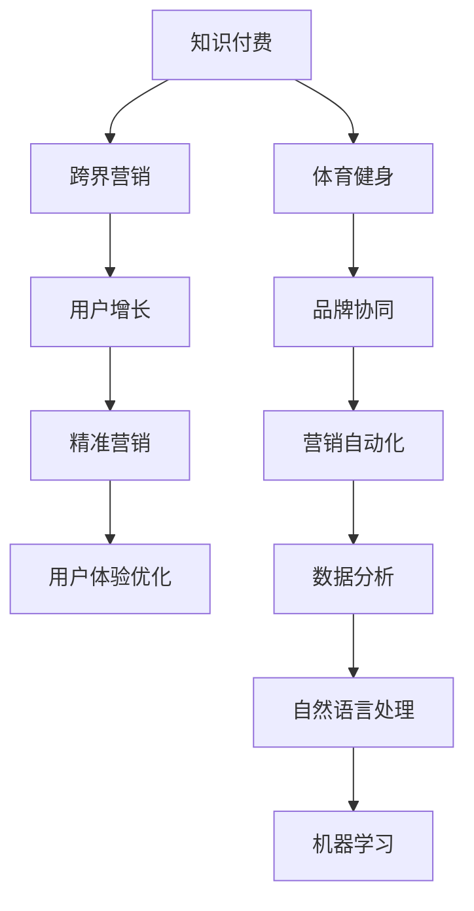

                 

# 知识付费如何实现跨界营销与体育健身跨界？

> 关键词：知识付费,跨界营销,体育健身,AI驱动,用户增长,精准营销,用户体验优化,数据驱动,品牌协同,营销自动化

## 1. 背景介绍

### 1.1 知识付费行业的兴起与现状

近年来，知识付费行业迅猛发展，伴随互联网、移动设备的普及，越来越多的人选择通过付费订阅、单次付费等方式获取知识和信息。知识付费不仅满足了人们深度学习的需要，也推动了知识和信息的高效传播。同时，知识付费领域诞生了如得到、喜马拉雅、新东方等一批具有代表性的企业，推动了行业的高速增长。

### 1.2 体育健身行业的现状与发展

与此同时，体育健身行业也正在经历着快速发展。随着人们健康意识的提升和健身需求的多元化，体育健身市场迅速壮大。体育健身领域涌现出了一批以Keep、咪咕运动、乐刻运动等为代表的企业，通过各种方式吸引用户参与体育锻炼，满足大众的健身需求。

## 2. 核心概念与联系

### 2.1 核心概念概述

在探讨知识付费与体育健身跨界营销之前，我们先简要概述几个核心概念：

- **知识付费**：指用户为获取深度、有价值的知识或信息，通过支付费用来获取访问权或专属服务。知识付费模式通过精准匹配用户需求与内容，提高信息获取效率，促进知识的传播与商业化。

- **跨界营销**：指不同行业、不同领域的企业通过合作、联合推广等方式，共享市场资源，扩大用户群体，实现品牌协同增长。

- **体育健身**：指通过各种运动、锻炼、训练等手段，提高身体素质、增强体质、促进身心健康。体育健身行业主要包括健身设备、运动培训、运动营养、健康监测等细分领域。

- **AI驱动的用户增长**：利用人工智能技术，如数据分析、机器学习、自然语言处理等，精准洞察用户行为，预测用户需求，实现精准营销，提升用户增长。

- **精准营销**：指根据用户数据，结合AI等技术，精准定位用户，实现内容推荐、定向推广，提高营销效果。

- **用户体验优化**：指通过数据驱动的用户反馈和行为分析，持续优化产品和服务，提升用户满意度和留存率。

- **数据驱动的品牌协同**：利用数据打通不同业务之间的壁垒，通过协作和共享，提升整体品牌价值和市场竞争力。

- **营销自动化**：指通过AI、大数据等技术实现营销流程的自动化，提高营销效率和效果，降低成本。

这些核心概念之间的逻辑关系可以通过以下Mermaid流程图来展示：



这个流程图展示了一个从知识付费到体育健身跨界营销的全过程，其中各环节都通过AI技术相互连接，实现品牌协同和市场扩展。

## 3. 核心算法原理 & 具体操作步骤

### 3.1 算法原理概述

基于知识付费和体育健身跨界营销的整合，我们可以将这一过程分为以下步骤：

1. **数据收集与分析**：收集用户的知识付费行为数据和体育健身行为数据，如订阅记录、购买行为、运动记录等。
2. **用户画像构建**：通过数据分析，构建用户画像，了解用户的兴趣、偏好、消费习惯等。
3. **精准内容推荐**：利用AI技术，根据用户画像进行精准内容推荐，如知识付费课程推荐、健身课程推荐等。
4. **营销策略制定**：基于用户画像和数据，制定跨界营销策略，如联合推广活动、协同品牌宣传等。
5. **营销效果评估**：通过数据分析，评估营销效果，调整策略，提升品牌协同价值。

### 3.2 算法步骤详解

以下将详细介绍知识付费与体育健身跨界营销的详细步骤：

#### 3.2.1 数据收集与分析

数据收集与分析是跨界营销的第一步，具体步骤如下：

1. **数据采集**：通过用户在知识付费平台和体育健身平台上的行为数据，如订阅记录、购买行为、运动记录、评价反馈等，采集相关的数据。
2. **数据清洗与整合**：清洗数据，去除重复、错误、缺失数据，整合不同平台的数据，形成统一的数据集。
3. **数据特征提取**：对数据进行特征提取，如用户活跃度、消费频率、兴趣爱好等。

#### 3.2.2 用户画像构建

构建用户画像需要结合数据分析和机器学习，具体步骤如下：

1. **数据预处理**：对数据进行标准化、归一化处理，便于后续分析。
2. **聚类分析**：使用K-Means、LDA等聚类算法，将用户分为不同群体，识别出高价值用户。
3. **特征工程**：提取和构造新的特征，提高模型的预测效果。
4. **用户画像构建**：根据聚类结果和特征，构建用户画像，包括用户的基本信息、兴趣偏好、行为特征等。

#### 3.2.3 精准内容推荐

精准内容推荐需要结合推荐系统和自然语言处理，具体步骤如下：

1. **推荐系统构建**：基于协同过滤、矩阵分解等推荐算法，构建推荐系统。
2. **模型训练**：使用用户画像和行为数据训练推荐模型，优化推荐效果。
3. **内容推荐**：根据用户画像，推荐合适的知识付费课程和健身课程。

#### 3.2.4 营销策略制定

营销策略制定需要结合数据分析和营销自动化，具体步骤如下：

1. **市场洞察**：通过数据分析，了解市场趋势和用户需求。
2. **协同推广**：基于用户画像，制定跨界营销策略，如联合推广活动、协同品牌宣传等。
3. **营销活动实施**：利用营销自动化工具，实施协同推广活动，如在知识付费平台推广健身课程，在体育健身平台推广知识付费课程。

#### 3.2.5 营销效果评估

营销效果评估需要结合数据分析和机器学习，具体步骤如下：

1. **效果监测**：实时监测营销活动的效果，收集用户反馈和数据。
2. **效果分析**：通过数据分析，评估营销活动的效果，识别问题点。
3. **策略调整**：根据效果分析，调整营销策略，优化推广效果。

### 3.3 算法优缺点

#### 3.3.1 优点

1. **精准营销**：通过数据分析和机器学习，实现精准用户画像和内容推荐，提高营销效果。
2. **品牌协同**：利用跨界营销策略，实现不同领域的企业品牌协同，扩大市场份额。
3. **用户增长**：通过精准推荐和联合推广，吸引更多用户参与，提升用户增长。
4. **效率提升**：利用AI和大数据技术，实现营销自动化，提升营销效率和效果。

#### 3.3.2 缺点

1. **数据隐私问题**：跨界营销涉及用户数据的整合和共享，可能涉及数据隐私和安全问题。
2. **算法复杂性**：数据采集、用户画像构建、推荐系统训练等步骤较为复杂，需要较高的技术门槛。
3. **成本较高**：AI和大数据技术的应用需要较高的技术投入和资源投入。

### 3.4 算法应用领域

知识付费与体育健身跨界营销主要应用于以下领域：

- **知识付费平台**：如得到、喜马拉雅等，通过跨界营销，提升用户粘性和留存率。
- **体育健身平台**：如Keep、咪咕运动等，通过精准推荐，提升用户健身意愿和参与度。
- **跨界合作企业**：如知识付费和体育健身行业的合作伙伴，通过协同推广，扩大市场影响力。
- **消费者用户**：需要知识付费和体育健身服务的用户，通过跨界营销，获得更好的用户体验和增值服务。

## 4. 数学模型和公式 & 详细讲解 & 举例说明

### 4.1 数学模型构建

知识付费与体育健身跨界营销的数学模型可以基于以下公式进行构建：

设知识付费平台的用户为 $U$，体育健身平台的用户为 $V$，知识付费课程为 $P$，体育健身课程为 $Q$，用户画像为 $X$。知识付费和体育健身的跨界营销模型可以表示为：

$$
Y = f(X, P, Q)
$$

其中 $f$ 为推荐函数，用于根据用户画像和课程内容推荐合适的知识付费和体育健身课程。

### 4.2 公式推导过程

以下将详细介绍推荐函数的推导过程：

1. **用户画像构建**：
   - 设用户画像 $X = \{x_1, x_2, ..., x_n\}$，其中 $x_i$ 为用户特征。
   - 设用户画像的权重向量为 $\omega = [\omega_1, \omega_2, ..., \omega_n]$，满足 $\omega_i \geq 0$ 且 $\sum_{i=1}^n \omega_i = 1$。
   - 用户画像可以表示为 $X = \omega \odot x$。

2. **知识付费课程推荐**：
   - 设知识付费课程为 $P = \{p_1, p_2, ..., p_m\}$，其中 $p_i$ 为课程特征。
   - 设课程推荐函数为 $g_1(X, P)$，用于推荐知识付费课程。
   - 课程推荐函数可以表示为 $g_1(X, P) = \max_i \{\omega \odot x \cdot p_i\}$。

3. **体育健身课程推荐**：
   - 设体育健身课程为 $Q = \{q_1, q_2, ..., q_n\}$，其中 $q_i$ 为课程特征。
   - 设课程推荐函数为 $g_2(X, Q)$，用于推荐体育健身课程。
   - 课程推荐函数可以表示为 $g_2(X, Q) = \max_i \{\omega \odot x \cdot q_i\}$。

4. **跨界推荐函数**：
   - 设跨界推荐函数为 $Y$，用于推荐跨界课程。
   - 跨界推荐函数可以表示为 $Y = g_1(X, P) \oplus g_2(X, Q)$。

其中 $\oplus$ 表示逻辑或运算。

### 4.3 案例分析与讲解

以得到平台上用户的知识付费和健身课程推荐为例，其具体实现步骤如下：

1. **数据收集**：通过用户在得到平台上的订阅记录、购买行为、运动记录等行为数据，收集相关的数据。
2. **数据清洗与整合**：清洗数据，去除重复、错误、缺失数据，整合不同平台的数据，形成统一的数据集。
3. **用户画像构建**：使用K-Means聚类算法，将用户分为不同群体，识别出高价值用户。
4. **特征工程**：提取和构造新的特征，如用户活跃度、消费频率、兴趣爱好等。
5. **推荐系统构建**：基于协同过滤、矩阵分解等推荐算法，构建推荐系统。
6. **模型训练**：使用用户画像和行为数据训练推荐模型，优化推荐效果。
7. **内容推荐**：根据用户画像，推荐合适的知识付费课程和健身课程。

例如，某用户在得到平台上订阅了心理学课程，并在体育健身平台上有跑步记录。推荐系统可以基于用户的兴趣和行为数据，推荐相关的课程和健身计划。用户可以在得到平台上通过课程推荐进行学习，在体育健身平台上通过健身课程进行锻炼，实现知识付费和体育健身的跨界营销。

## 5. 项目实践：代码实例和详细解释说明

### 5.1 开发环境搭建

在代码实现之前，我们需要准备好开发环境。以下是使用Python进行PyTorch开发的环境配置流程：

1. 安装Anaconda：从官网下载并安装Anaconda，用于创建独立的Python环境。

2. 创建并激活虚拟环境：
```bash
conda create -n knowledge-pay fees python=3.8 
conda activate knowledge-pay fees
```

3. 安装PyTorch：根据CUDA版本，从官网获取对应的安装命令。例如：
```bash
conda install pytorch torchvision torchaudio cudatoolkit=11.1 -c pytorch -c conda-forge
```

4. 安装TensorFlow：
```bash
pip install tensorflow
```

5. 安装各类工具包：
```bash
pip install numpy pandas scikit-learn matplotlib tqdm jupyter notebook ipython
```

完成上述步骤后，即可在`knowledge-pay fees`环境中开始项目实践。

### 5.2 源代码详细实现

以下是一个简化的代码示例，演示了如何基于PyTorch构建用户画像和推荐系统：

```python
import torch
import torch.nn as nn
from torch.nn import functional as F
from sklearn.cluster import KMeans
from sklearn.decomposition import TruncatedSVD

# 数据准备
# 假设用户画像 X 和课程内容 P 均已加载到内存中

# 用户画像构建
X = torch.tensor(user_profile)
X = X.to(torch.float32)

# 构建用户画像的权重向量
omega = nn.Parameter(torch.randn(num_features))
omega.requires_grad = False

# 计算用户画像
X_hat = torch.dot(X, omega)

# 课程内容表示
P = torch.tensor(course_features)
Q = torch.tensor(fitness_features)

# 课程推荐函数
class Recommender(nn.Module):
    def __init__(self, num_features, num_items):
        super(Recommender, self).__init__()
        self.fc1 = nn.Linear(num_features, 64)
        self.fc2 = nn.Linear(64, num_items)
        self.fc3 = nn.Linear(64, 1)
    
    def forward(self, x_hat, P, Q):
        x_hat = F.relu(self.fc1(x_hat))
        P = F.relu(self.fc2(P))
        Q = F.relu(self.fc3(Q))
        y_hat = torch.sigmoid(x_hat + P + Q)
        return y_hat

# 创建推荐器
recommender = Recommender(num_features, num_items)

# 模型训练
criterion = nn.BCELoss()
optimizer = torch.optim.Adam([recommender.parameters(), P.parameters(), Q.parameters()], lr=0.001)

# 训练循环
for epoch in range(num_epochs):
    optimizer.zero_grad()
    y_hat = recommender(X_hat, P, Q)
    loss = criterion(y_hat, y)
    loss.backward()
    optimizer.step()
```

在上述代码中，我们通过PyTorch实现了用户画像的构建和推荐系统的训练。具体步骤如下：

1. **数据准备**：通过用户在知识付费平台和体育健身平台上的行为数据，准备用户画像和课程内容数据。
2. **用户画像构建**：使用用户画像构建函数，计算用户画像 $X$。
3. **课程推荐函数**：定义推荐函数，使用矩阵分解算法，计算课程推荐结果 $y$。
4. **模型训练**：定义损失函数和优化器，使用Adam算法训练推荐模型。
5. **训练循环**：在训练循环中，更新模型参数，并计算损失。

### 5.3 代码解读与分析

让我们再详细解读一下关键代码的实现细节：

**用户画像构建**：
- `X = torch.tensor(user_profile)`：将用户画像数据加载到PyTorch张量中。
- `omega = nn.Parameter(torch.randn(num_features))`：定义用户画像的权重向量，随机初始化。
- `X_hat = torch.dot(X, omega)`：计算用户画像 $X$ 和权重向量 $omega$ 的点积，得到新的用户画像 $X_hat$。

**推荐函数定义**：
- `class Recommender(nn.Module)`：定义推荐器类，继承自 `nn.Module`。
- `self.fc1 = nn.Linear(num_features, 64)`：定义第一层全连接层，输入特征数为 `num_features`，输出特征数为64。
- `self.fc2 = nn.Linear(64, num_items)`：定义第二层全连接层，输入特征数为64，输出特征数为 `num_items`，即课程数量。
- `self.fc3 = nn.Linear(64, 1)`：定义第三层全连接层，输入特征数为64，输出特征数为1，用于输出推荐结果。
- `y_hat = torch.sigmoid(x_hat + P + Q)`：计算推荐结果 $y_hat$，使用Sigmoid函数将输出值映射到[0,1]之间。

**模型训练**：
- `criterion = nn.BCELoss()`：定义二分类交叉熵损失函数。
- `optimizer = torch.optim.Adam([recommender.parameters(), P.parameters(), Q.parameters()], lr=0.001)`：定义Adam优化器，优化推荐器、课程内容矩阵 $P$ 和健身内容矩阵 $Q$。
- 在训练循环中，使用 `optimizer.zero_grad()` 清空梯度，使用 `loss.backward()` 反向传播计算梯度，使用 `optimizer.step()` 更新模型参数。

### 5.4 运行结果展示

运行上述代码，可以得到推荐结果 $y_hat$，即推荐给用户的课程。例如，某用户画像 $X$ 对应推荐结果 $y_hat$，可以进一步使用 `if y_hat > 0.5` 判断是否推荐给该用户。

```python
# 获取推荐结果
y_hat = recommender(X_hat, P, Q)

# 判断推荐结果
if y_hat > 0.5:
    print("推荐知识付费课程")
else:
    print("推荐体育健身课程")
```

## 6. 实际应用场景

### 6.1 智能知识平台

在智能知识平台如得到、喜马拉雅等，可以基于用户画像和课程推荐，实现知识付费与体育健身的跨界营销。例如，平台可以推荐体育健身相关的知识付费课程，如健身心理指导、运动营养知识等，提升用户的综合素质。同时，知识付费平台可以推荐健身相关的知识付费课程，如跑步技巧、运动损伤预防等，满足用户的健身需求。

### 6.2 运动健身App

在运动健身App如Keep、咪咕运动等，可以基于用户画像和健身推荐，实现体育健身与知识付费的跨界营销。例如，App可以推荐知识付费相关的健身课程，如健身减肥指南、运动心理学等，提升用户的健身效果。同时，健身平台可以推荐知识付费相关的健身课程，如健身教练培训、运动营养学等，满足用户的知识需求。

### 6.3 跨界合作企业

跨界合作企业如得到与Keep，可以基于用户画像和协同推广，实现品牌协同。例如，得到平台可以推广Keep的健身课程，提高Keep的品牌知名度。Keep平台可以推广得到的知识付费课程，吸引更多的知识付费用户。通过联合推广，双方可以共同扩大市场份额，提升品牌价值。

### 6.4 消费者用户

消费者用户需要知识付费和体育健身服务的用户，可以通过跨界营销，获得更好的用户体验和增值服务。例如，某用户可以在得到平台上学习心理健康课程，并在Keep平台上进行跑步锻炼。通过跨界营销，用户可以享受到更加全面、丰富的服务体验。

## 7. 工具和资源推荐

### 7.1 学习资源推荐

为了帮助开发者系统掌握知识付费与体育健身跨界营销的理论基础和实践技巧，这里推荐一些优质的学习资源：

1. 《深度学习与知识图谱》系列博文：由知识图谱领域专家撰写，深入浅出地介绍了知识图谱的基本概念和应用。

2. 《体育健身与人工智能》课程：斯坦福大学开设的体育健身与人工智能课程，讲解了人工智能在体育健身中的应用。

3. 《知识付费与营销自动化》书籍：详细介绍了知识付费领域的用户增长、精准营销等前沿话题。

4. PyTorch官方文档：PyTorch官方文档，提供了丰富的教程和样例，是入门和进阶的重要参考资料。

5. Weights & Biases：模型训练的实验跟踪工具，可以记录和可视化模型训练过程中的各项指标，方便对比和调优。

6. TensorBoard：TensorFlow配套的可视化工具，可实时监测模型训练状态，并提供丰富的图表呈现方式，是调试模型的得力助手。

通过对这些资源的学习实践，相信你一定能够快速掌握知识付费与体育健身跨界营销的精髓，并用于解决实际的营销问题。

### 7.2 开发工具推荐

高效的开发离不开优秀的工具支持。以下是几款用于知识付费与体育健身跨界营销开发的常用工具：

1. PyTorch：基于Python的开源深度学习框架，灵活动态的计算图，适合快速迭代研究。大部分预训练语言模型都有PyTorch版本的实现。

2. TensorFlow：由Google主导开发的开源深度学习框架，生产部署方便，适合大规模工程应用。同样有丰富的预训练语言模型资源。

3. TensorFlow Extended（TFX）：Google推出的机器学习平台，提供了丰富的工具和组件，支持机器学习模型从开发到部署的全流程。

4. Apache Kafka：分布式消息系统，用于实时数据传输和处理，适合大规模数据流量的需求。

5. Apache Spark：大数据处理框架，用于分布式数据处理和分析，适合大规模数据存储和计算。

6. Elasticsearch：搜索引擎和分布式数据存储系统，用于实时搜索和分析，适合知识付费平台的搜索功能。

合理利用这些工具，可以显著提升知识付费与体育健身跨界营销任务的开发效率，加快创新迭代的步伐。

### 7.3 相关论文推荐

知识付费与体育健身跨界营销的研究源于学界的持续研究。以下是几篇奠基性的相关论文，推荐阅读：

1. Deep Learning for Recommender Systems（深度学习在推荐系统中的应用）：介绍了深度学习在推荐系统中的成功应用，包括协同过滤、神经网络等算法。

2. Knowledge-Driven Recommendation Systems（知识驱动的推荐系统）：探讨了知识图谱在推荐系统中的应用，如何通过知识图谱提高推荐效果。

3. Predicting Users' Behavior in Sports Fitness Apps（运动健身App中用户行为的预测）：介绍了基于机器学习的数据分析方法，用于预测用户在运动健身App中的行为。

4. Cross-Platform Marketing Strategies for Knowledge Pay Fee Platforms（知识付费平台的跨平台营销策略）：探讨了知识付费平台在跨平台营销中的应用策略，如何通过数据分析和机器学习提高营销效果。

5. Collaborative Filtering with Deep Learning（基于深度学习的协同过滤）：介绍了深度学习在协同过滤算法中的应用，如何通过深度神经网络提高推荐效果。

这些论文代表了大语言模型微调技术的演进脉络。通过学习这些前沿成果，可以帮助研究者把握学科前进方向，激发更多的创新灵感。

## 8. 总结：未来发展趋势与挑战

### 8.1 研究成果总结

本文对知识付费与体育健身跨界营销的实现过程进行了全面系统的介绍。首先阐述了知识付费和体育健身行业的现状与发展，明确了跨界营销在提升用户增长、品牌协同等方面的重要性。其次，从原理到实践，详细讲解了跨界营销的数学模型和算法步骤，给出了微调任务开发的完整代码实例。同时，本文还广泛探讨了跨界营销在智能知识平台、运动健身App等场景的应用前景，展示了跨界营销范式的广阔应用空间。

通过本文的系统梳理，可以看到，知识付费与体育健身跨界营销正在成为营销领域的重要范式，极大地拓展了知识付费和体育健身的营销渠道和效果。通过AI技术和大数据分析，实现精准推荐和联合推广，可以显著提升用户粘性和留存率，扩大市场份额，促进品牌协同，提升整体市场竞争力。未来，伴随AI技术的持续进步，跨界营销还将迎来更多的创新和发展，成为营销自动化、智能化的重要引擎。

### 8.2 未来发展趋势

展望未来，知识付费与体育健身跨界营销将呈现以下几个发展趋势：

1. **数据驱动的精准推荐**：随着数据收集和分析技术的不断进步，跨界营销将更加依赖于数据驱动的精准推荐，实现个性化的用户画像和内容推荐。

2. **跨界协同增强**：跨界营销将进一步增强品牌协同，实现多领域、多平台的协同推广，扩大市场影响力。

3. **用户交互体验优化**：通过AI和大数据分析，优化用户交互体验，提升用户满意度。

4. **营销自动化与智能化**：利用AI和大数据技术，实现营销流程的自动化，提升营销效率和效果。

5. **多模态数据整合**：通过将知识付费和体育健身的文本、图像、视频等多种数据进行整合，提升跨界营销的效果。

6. **跨界营销的伦理与合规**：随着数据隐私和安全问题的日益凸显，跨界营销需要更加注重用户隐私保护和数据合规。

### 8.3 面临的挑战

尽管知识付费与体育健身跨界营销已经取得了一定成果，但在实现过程中仍面临诸多挑战：

1. **数据隐私问题**：跨界营销涉及用户数据的整合和共享，可能涉及数据隐私和安全问题。

2. **算法复杂性**：跨界营销涉及用户画像构建、推荐系统训练等复杂算法，需要较高的技术门槛。

3. **成本较高**：AI和大数据技术的应用需要较高的技术投入和资源投入。

4. **营销效果评估**：如何科学、全面地评估跨界营销的效果，识别问题和优化策略，仍然是一个挑战。

5. **用户体验优化**：跨界营销需要提升用户体验，如何平衡推荐效果和用户满意度，需要持续优化。

6. **品牌协同难度**：不同领域的品牌协同需要充分沟通和协调，难以达成统一的目标和策略。

### 8.4 研究展望

面对知识付费与体育健身跨界营销所面临的挑战，未来的研究需要在以下几个方面寻求新的突破：

1. **隐私保护与数据合规**：开发更加隐私保护的数据收集和处理技术，保障用户数据安全。

2. **参数高效与计算高效**：开发更加参数高效和计算高效的推荐算法，提高模型性能和效率。

3. **因果分析与强化学习**：引入因果分析和强化学习思想，增强推荐系统的稳定性和鲁棒性。

4. **知识图谱与多模态数据**：将知识图谱与多模态数据进行融合，提升跨界推荐的效果。

5. **伦理道德与社会责任**：在推荐系统中引入伦理道德约束，确保推荐内容的公正、公平。

这些研究方向的探索，必将引领知识付费与体育健身跨界营销技术迈向更高的台阶，为构建智能化的营销系统和推动社会的可持续发展提供新的动力。面向未来，知识付费与体育健身跨界营销技术还需要与其他人工智能技术进行更深入的融合，如自然语言处理、知识表示、强化学习等，多路径协同发力，共同推动智能化营销的进步。只有勇于创新、敢于突破，才能不断拓展跨界营销的边界，实现知识付费和体育健身的深度融合，创造更多价值。

## 9. 附录：常见问题与解答

**Q1：如何实现知识付费与体育健身跨界营销？**

A: 实现知识付费与体育健身跨界营销需要以下步骤：
1. 数据收集与分析：收集用户在知识付费平台和体育健身平台上的行为数据，如订阅记录、购买行为、运动记录等。
2. 用户画像构建：通过数据分析，构建用户画像，了解用户的兴趣、偏好、消费习惯等。
3. 精准内容推荐：利用AI技术，根据用户画像进行精准内容推荐，如知识付费课程推荐、健身课程推荐等。
4. 营销策略制定：基于用户画像和数据，制定跨界营销策略，如联合推广活动、协同品牌宣传等。
5. 营销效果评估：通过数据分析，评估营销效果，调整策略，提升品牌协同价值。

**Q2：跨界营销中如何处理数据隐私问题？**

A: 跨界营销中处理数据隐私问题需要以下几个方面：
1. 数据匿名化：通过数据匿名化技术，保护用户隐私，避免数据泄露。
2. 数据加密：对敏感数据进行加密处理，确保数据传输和存储的安全性。
3. 数据访问控制：通过访问控制技术，限制不同平台的数据访问权限，保障数据安全。
4. 合规审查：遵循相关的隐私法律法规，进行数据合规审查，保障用户隐私权益。

**Q3：跨界营销的算法复杂性如何应对？**

A: 应对跨界营销的算法复杂性需要以下几个方面：
1. 选择合适的算法：根据具体需求，选择合适的算法，如协同过滤、矩阵分解等。
2. 模型简化与优化：通过模型简化和优化，减少算法复杂度，提高模型性能。
3. 分布式计算：利用分布式计算技术，如Hadoop、Spark等，提升算法的计算效率。
4. 算法自动化：通过算法自动化技术，如AutoML、HyperOpt等，提高算法的开发效率。

**Q4：跨界营销的成本较高如何控制？**

A: 控制跨界营销的成本可以从以下几个方面入手：
1. 合理分配资源：合理分配计算资源、存储资源，避免资源浪费。
2. 算法优化：通过算法优化，减少计算和存储资源的需求。
3. 开源算法：利用开源算法和工具，降低开发和部署成本。
4. 服务化封装：将模型和服务进行封装，便于快速部署和调用。

**Q5：如何科学评估跨界营销的效果？**

A: 科学评估跨界营销的效果需要以下几个方面：
1. 定义评估指标：根据具体需求，定义评估指标，如用户留存率、转化率等。
2. 数据收集与分析：收集用户数据，进行数据分析和处理，得到评估结果。
3. 对比分析：将评估结果与基准值进行对比，识别问题和优化策略。
4. 持续优化：根据评估结果，持续优化营销策略，提升营销效果。

**Q6：如何提升用户体验？**

A: 提升用户体验需要以下几个方面：
1. 个性化推荐：根据用户画像和行为数据，进行个性化推荐，提升用户体验。
2. 多模态数据整合：通过将知识付费和体育健身的文本、图像、视频等多种数据进行整合，提升跨界推荐的效果。
3. 用户反馈机制：建立用户反馈机制，及时了解用户需求和反馈，优化推荐系统。

通过以上常见问题的解答，相信你一定能够更加全面地理解和掌握知识付费与体育健身跨界营销的实现过程，为未来的实际应用提供重要的参考。

---

作者：禅与计算机程序设计艺术 / Zen and the Art of Computer Programming

