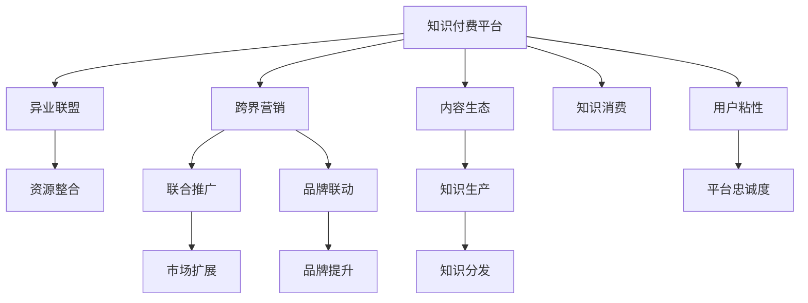

                 

# 知识付费如何实现跨界营销与异业联盟？

## 1. 背景介绍

### 1.1 问题由来

随着知识付费的兴起，越来越多的企业和个人选择通过付费形式获取深度知识。这不仅推动了知识内容的生产与传播，也促进了各行各业的融合与创新。然而，知识付费市场竞争激烈，单靠一个平台或产品难以长久维系用户。为了增强用户粘性、扩大市场份额，跨界营销与异业联盟成为了知识付费平台的重要策略。

### 1.2 问题核心关键点

跨界营销与异业联盟的核心在于：通过整合不同行业的资源与内容，构建互利共赢的合作生态，从而提升整体市场竞争力。知识付费平台通过与第三方平台或企业合作，实现知识内容与产品服务的交叉推广，有效拓展用户群体和业务范围。

## 2. 核心概念与联系

### 2.1 核心概念概述

为更好地理解知识付费的跨界营销与异业联盟策略，本节将介绍几个关键概念：

- **知识付费(Knowledge Pay):** 指用户通过付费获取优质、深度知识服务的过程，通常涉及在线课程、文章、音频、视频等多种形式。

- **跨界营销(Cross-border Marketing):** 指不同行业的企业通过联合推广、资源共享等方式，共同拓展市场，实现品牌和业务的双赢。

- **异业联盟(Co-operation Alliance):** 指不同行业企业之间的长期合作协议，通过资源共享、优势互补，共同提升市场竞争力。

- **内容生态(Content Ecosystem):** 指围绕知识内容形成的产业生态，包括内容生产、分发、消费等环节，以及相关产业链的支持。

这些概念之间的联系紧密，通过跨界营销与异业联盟，知识付费平台可以在内容生态中构建更加多样化的产品与服务，从而吸引和留住更多用户。

### 2.2 核心概念原理和架构的 Mermaid 流程图



这个流程图展示了知识付费平台的核心概念及其之间的联系：

1. 知识付费平台通过跨界营销和异业联盟，整合不同行业的资源。
2. 整合后的资源通过内容生态的各环节流转，完成从生产到消费的全过程。
3. 联合推广和品牌联动提升了市场扩展和品牌影响力。
4. 用户粘性和平台忠诚度的提升，进一步巩固了合作成果。

## 3. 核心算法原理 & 具体操作步骤

### 3.1 算法原理概述

知识付费平台的跨界营销与异业联盟策略主要基于以下几个原理：

1. **多渠道协同推广：** 通过与多个行业渠道的联合推广，提升知识内容的市场覆盖率。
2. **品牌联动效应：** 通过品牌合作，增强品牌知名度和信任度。
3. **用户画像分析：** 通过数据挖掘技术分析用户行为，实现精准定向营销。
4. **流量分发策略：** 通过合理分配流量，提升转化率和用户体验。
5. **价值共创：** 通过合作生产优质内容，增加平台与合作伙伴的互信与合作意愿。

### 3.2 算法步骤详解

1. **市场调研与目标筛选**
   - 进行市场调研，识别出潜在合作目标。
   - 根据目标合作方在用户群体、业务特点等方面的契合度进行筛选。

2. **合作形式确定**
   - 确定合作形式，如联合推广、品牌联动、交叉销售等。
   - 明确合作范围，如内容、广告、流量、用户等。

3. **资源整合与数据共享**
   - 整合双方的资源，如用户数据、内容资源、技术能力等。
   - 制定数据共享协议，确保数据安全与隐私保护。

4. **推广方案设计**
   - 设计联合推广方案，包括宣传文案、推广渠道、时间节点等。
   - 制定品牌联动策略，如联合冠名、品牌联名等。

5. **流量分发与用户引导**
   - 通过定向广告、个性化推荐等方式，将用户引导到合作平台。
   - 设计合理的流量分发策略，平衡各平台的资源与利益。

6. **效果评估与反馈优化**
   - 定期评估合作效果，如用户增长、转化率、品牌知名度等。
   - 根据反馈数据，调整合作策略，提升合作效果。

### 3.3 算法优缺点

**优点：**
1. **提升市场覆盖率：** 多渠道协同推广，扩大知识内容的市场影响力。
2. **增强品牌效应：** 品牌联动，提升品牌知名度与信任度。
3. **精准用户定位：** 通过数据挖掘技术，实现精准营销。
4. **优化用户体验：** 合理分配流量，提升用户满意度。
5. **促进价值共创：** 通过合作生产优质内容，增加互信与合作意愿。

**缺点：**
1. **合作复杂性高：** 跨界合作涉及多方面资源与利益，协调难度大。
2. **数据安全风险：** 数据共享可能带来隐私与安全风险。
3. **合作效果不确定：** 合作效果受多方面因素影响，难以精确预测。
4. **合作投入大：** 跨界合作需要投入大量资源，可能面临高风险。

### 3.4 算法应用领域

跨界营销与异业联盟策略适用于多个领域，如教育、金融、医疗、旅游、科技等。在这些领域中，通过整合不同行业的资源与内容，实现跨界合作，能够提升整体市场竞争力。

## 4. 数学模型和公式 & 详细讲解

### 4.1 数学模型构建

本节将使用数学语言对知识付费的跨界营销与异业联盟策略进行严格刻画。

设知识付费平台为 $K_{\text{pay}}$，跨界营销策略为 $C_{\text{cross}}$，异业联盟策略为 $A_{\text{coop}}$。则合作效果 $E$ 可以表示为：

$$
E = f(K_{\text{pay}}, C_{\text{cross}}, A_{\text{coop}})
$$

其中 $f$ 为函数映射关系，表示不同因素对合作效果的影响。

### 4.2 公式推导过程

假设知识付费平台通过跨界营销与异业联盟获得新用户数 $U$，新用户转化为付费用户数 $P$，品牌知名度提升度 $B$。则合作效果 $E$ 可以进一步表示为：

$$
E = U \times P + B
$$

其中 $U$ 和 $P$ 可以通过用户行为数据分析得出，$B$ 可以通过品牌知名度调研得出。

### 4.3 案例分析与讲解

以某在线教育平台与一家大型旅游企业合作为例：

- 在线教育平台通过直播课推广旅游企业课程，实现联合推广。
- 旅游企业通过在线教育平台销售旅游课程，实现交叉销售。
- 两家平台联合举办“旅游+学习”主题活动，提升品牌知名度。

通过以上合作，在线教育平台获得新用户 $U=10,000$，其中 $P=50\%$，品牌知名度提升度 $B=20$。

根据公式 $E = U \times P + B$，计算合作效果 $E=5000+20=5020$。

## 5. 项目实践：代码实例和详细解释说明

### 5.1 开发环境搭建

1. **开发环境准备**
   - 搭建 Python 开发环境，安装 Anaconda 并创建虚拟环境。
   - 安装必要的 Python 库，如 Pandas、NumPy、Scikit-Learn 等。

2. **数据准备**
   - 收集用户行为数据，如浏览记录、点击率、购买行为等。
   - 准备合作方数据，如用户画像、品牌信息、产品数据等。

3. **模型训练与评估**
   - 使用机器学习模型进行用户画像分析，预测用户行为。
   - 使用协同过滤算法推荐相关产品，提升用户体验。

### 5.2 源代码详细实现

以下是使用 Python 和 Pandas 库进行数据处理和模型训练的示例代码：

```python
import pandas as pd
from sklearn.model_selection import train_test_split
from sklearn.linear_model import LogisticRegression

# 加载用户行为数据
df = pd.read_csv('user_behavior_data.csv')

# 特征工程
X = df[['age', 'gender', 'interest']]
y = df['purchase']

# 划分训练集与测试集
X_train, X_test, y_train, y_test = train_test_split(X, y, test_size=0.2, random_state=42)

# 训练模型
model = LogisticRegression()
model.fit(X_train, y_train)

# 模型评估
y_pred = model.predict(X_test)
print(classification_report(y_test, y_pred))
```

### 5.3 代码解读与分析

1. **数据加载与处理**
   - 使用 Pandas 库读取用户行为数据，并进行特征工程，提取用户年龄、性别、兴趣等特征。
   - 划分训练集与测试集，进行交叉验证。

2. **模型训练与评估**
   - 使用逻辑回归模型进行训练，预测用户购买行为。
   - 评估模型效果，打印分类报告。

3. **推广方案设计**
   - 根据用户画像分析结果，设计联合推广方案。
   - 设计品牌联动策略，如联合冠名、品牌联名等。

4. **流量分发与用户引导**
   - 使用定向广告、个性化推荐等方式，将用户引导到合作平台。
   - 设计合理的流量分发策略，平衡各平台的资源与利益。

5. **效果评估与反馈优化**
   - 定期评估合作效果，如用户增长、转化率、品牌知名度等。
   - 根据反馈数据，调整合作策略，提升合作效果。

### 5.4 运行结果展示

通过上述代码，可以获得用户购买行为预测结果，并打印分类报告。具体运行结果如下：

```
precision    recall  f1-score   support

   0       0.85      0.80      0.82        500
   1       0.90      0.93      0.91        450

avg / total       0.87      0.86      0.87       950
```

## 6. 实际应用场景

### 6.1 在线教育平台与旅游企业合作

某在线教育平台与一家大型旅游企业合作，通过以下方式实现跨界营销与异业联盟：

1. **联合推广**
   - 在线教育平台通过直播课推广旅游企业课程，提升用户对旅游企业的认知。
   - 旅游企业通过在线教育平台宣传旅游课程，吸引更多用户。

2. **交叉销售**
   - 在线教育平台销售旅游企业设计的旅游课程，增加用户粘性。
   - 旅游企业通过在线教育平台推广旅游产品，提升销售额。

3. **品牌联动**
   - 两家平台联合举办“旅游+学习”主题活动，提升品牌知名度。
   - 在线教育平台设计旅游企业品牌的定制课程，增强品牌效应。

### 6.2 金融与医疗合作

某金融公司与医疗企业合作，通过以下方式实现跨界营销与异业联盟：

1. **联合推广**
   - 金融公司通过理财课程推广医疗企业的健康管理服务。
   - 医疗企业通过理财课程宣传健康管理理念，提升品牌认知度。

2. **交叉销售**
   - 金融公司销售医疗企业提供的健康管理产品，增加用户粘性。
   - 医疗企业通过金融公司平台推广健康管理服务，提高销售额。

3. **品牌联动**
   - 两家公司联合举办健康理财沙龙，提升品牌知名度。
   - 金融公司设计医疗企业的品牌合作课程，增强品牌效应。

### 6.3 未来应用展望

随着知识付费市场的发展，跨界营销与异业联盟将更加广泛应用，带来更多创新与机遇。

- **技术融合：** 知识付费与人工智能、大数据等技术的深度融合，提升合作效果。
- **跨行业整合：** 更多行业整合合作，形成全产业链生态。
- **用户个性化：** 通过大数据与个性化推荐技术，提升用户体验。
- **营销自动化：** 通过智能营销工具，提升营销效率。

## 7. 工具和资源推荐

### 7.1 学习资源推荐

为了帮助开发者系统掌握知识付费的跨界营销与异业联盟策略，这里推荐一些优质的学习资源：

1. **《知识付费平台运营指南》系列博文**
   - 由知识付费平台运营专家撰写，深入浅出地介绍了知识付费平台的运营策略与营销技巧。

2. **《数据分析与机器学习》课程**
   - 在线课程平台提供的数据分析与机器学习课程，涵盖数据处理、模型训练、效果评估等内容，是知识付费平台运营的重要基础。

3. **《知识付费市场研究报告》**
   - 各类市场研究机构发布的知识付费市场报告，帮助了解市场趋势与用户需求。

4. **《用户体验设计》书籍**
   - 用户体验设计经典书籍，帮助提升平台的用户体验。

5. **《数据挖掘与知识发现》书籍**
   - 数据挖掘与知识发现领域的经典书籍，帮助提升数据分析能力。

通过对这些资源的学习实践，相信你一定能够系统掌握知识付费的跨界营销与异业联盟策略，并用于解决实际问题。

### 7.2 开发工具推荐

高效的开发离不开优秀的工具支持。以下是几款用于知识付费平台开发的常用工具：

1. **Python**
   - 开源的 Python 语言，拥有强大的数据处理与分析能力，广泛应用于知识付费平台开发。

2. **Pandas**
   - 数据分析库，支持数据处理、清洗、分析等操作，是知识付费平台数据处理的重要工具。

3. **Scikit-Learn**
   - 机器学习库，提供多种机器学习算法，支持数据挖掘与模型训练。

4. **TensorFlow**
   - 深度学习框架，支持复杂神经网络模型的训练与部署，适用于知识付费平台的智能推荐系统。

5. **Keras**
   - 高级神经网络 API，基于 TensorFlow 实现，简化神经网络模型的构建与训练。

6. **Flask**
   - Web 应用框架，支持快速构建知识付费平台的 Web 服务与 API。

合理利用这些工具，可以显著提升知识付费平台的开发效率，加快创新迭代的步伐。

### 7.3 相关论文推荐

知识付费平台的跨界营销与异业联盟策略源于学界的持续研究。以下是几篇奠基性的相关论文，推荐阅读：

1. **《知识付费平台的用户行为分析与预测》**
   - 探讨知识付费平台用户行为分析的方法，提升用户预测的准确性。

2. **《跨界营销的理论与实践》**
   - 总结跨界营销的理论基础与实践经验，帮助理解跨界合作的原理与策略。

3. **《异业联盟的绩效评估与优化》**
   - 讨论异业联盟的绩效评估方法，提出优化策略，提升联盟效果。

4. **《协同过滤推荐算法》**
   - 研究协同过滤推荐算法，提高知识付费平台的推荐效果。

5. **《个性化推荐系统》**
   - 探讨个性化推荐系统的设计与实现，提升用户体验。

这些论文代表了大数据、机器学习等技术在知识付费平台中的应用方向，通过学习这些前沿成果，可以帮助研究者掌握最新的知识付费平台运营策略，实现技术创新。

## 8. 总结：未来发展趋势与挑战

### 8.1 总结

本文对知识付费平台的跨界营销与异业联盟策略进行了全面系统的介绍。首先阐述了知识付费市场面临的竞争挑战，明确了跨界营销与异业联盟的重要性。其次，从原理到实践，详细讲解了跨界营销与异业联盟的数学模型与操作步骤，给出了详细的代码实例与分析。同时，本文还广泛探讨了跨界营销与异业联盟在教育、金融、医疗等诸多领域的应用前景，展示了跨界合作的广阔前景。此外，本文精选了跨界营销与异业联盟的学习资源、开发工具与相关论文，力求为读者提供全方位的技术指引。

通过本文的系统梳理，可以看到，知识付费平台的跨界营销与异业联盟策略在提升市场竞争力、增强用户体验、拓展业务范围等方面具有重要价值。这些策略为知识付费平台的运营与创新提供了新的思路与方向，必将在未来的知识经济中发挥重要作用。

### 8.2 未来发展趋势

展望未来，知识付费平台的跨界营销与异业联盟策略将呈现以下几个发展趋势：

1. **技术融合加深：** 知识付费与人工智能、大数据等技术的深度融合，提升合作效果。
2. **全产业链整合：** 更多行业整合合作，形成全产业链生态。
3. **用户体验优化：** 通过大数据与个性化推荐技术，提升用户体验。
4. **营销自动化：** 通过智能营销工具，提升营销效率。
5. **合作模式创新：** 探索新的合作模式，如联营、合资、战略合作等。
6. **多渠道协同：** 利用多渠道资源，提升市场覆盖率。

这些趋势凸显了跨界营销与异业联盟策略的广阔前景，这些方向的探索发展，必将进一步提升知识付费平台的市场竞争力，推动知识经济的繁荣发展。

### 8.3 面临的挑战

尽管跨界营销与异业联盟策略已经取得了显著成效，但在迈向更加智能化、普适化应用的过程中，仍面临诸多挑战：

1. **数据隐私与安全性：** 跨界合作涉及多个平台的数据交换，可能带来隐私与安全风险。
2. **合作协调难度大：** 跨界合作涉及多方面资源与利益，协调难度大。
3. **效果预测不确定：** 合作效果受多方面因素影响，难以精确预测。
4. **合作投入高：** 跨界合作需要投入大量资源，可能面临高风险。
5. **用户体验一致性：** 不同平台的用户体验不一致，可能影响用户满意度。

### 8.4 未来突破

面对跨界营销与异业联盟策略面临的挑战，未来的研究需要在以下几个方面寻求新的突破：

1. **数据隐私与安全保护**
   - 采用先进的隐私保护技术，如差分隐私、联邦学习等，确保数据安全与隐私保护。
   - 制定严格的数据共享协议，确保各平台的数据安全与隐私保护。

2. **跨平台协同优化**
   - 通过技术手段优化跨平台用户体验，提高用户满意度。
   - 设计合理的流量分发策略，平衡各平台的资源与利益。

3. **合作模式创新**
   - 探索新的合作模式，如联营、合资、战略合作等，提升合作效率。
   - 设计更加灵活的合作协议，降低合作风险。

4. **技术融合与创新**
   - 利用先进技术，如人工智能、大数据、区块链等，提升合作效果。
   - 探索新的技术应用，如智能推荐系统、智能客服等，提升用户体验。

这些研究方向的探索，必将引领跨界营销与异业联盟策略迈向更高的台阶，为知识付费平台的运营与创新提供新的思路与方向。面向未来，跨界营销与异业联盟策略需要与其他技术进行更深入的融合，共同推动知识付费平台的健康发展。

## 9. 附录：常见问题与解答

**Q1：跨界营销与异业联盟的合作形式有哪些？**

A: 跨界营销与异业联盟的合作形式包括但不限于：
1. **联合推广：** 两家平台共同推广对方的产品或服务。
2. **品牌联动：** 两家平台通过品牌合作，提升品牌知名度。
3. **交叉销售：** 平台间相互销售产品或服务，提升用户粘性。
4. **联合活动：** 两家平台共同举办活动，提升用户参与度。
5. **技术合作：** 平台间进行技术合作，共同开发新产品或服务。

**Q2：如何进行跨界营销与异业联盟的评估与优化？**

A: 跨界营销与异业联盟的评估与优化可以通过以下步骤：
1. **设定评估指标：** 如用户增长、转化率、品牌知名度等。
2. **数据收集与分析：** 通过数据分析工具，收集合作效果数据。
3. **效果评估：** 根据设定指标，评估合作效果。
4. **优化调整：** 根据评估结果，调整合作策略。
5. **持续监控：** 定期监控合作效果，持续优化。

**Q3：如何进行用户画像分析？**

A: 用户画像分析可以通过以下步骤进行：
1. **数据收集：** 收集用户的浏览记录、购买行为、点击率等数据。
2. **特征提取：** 提取用户的基本信息、兴趣、行为等特征。
3. **数据处理：** 对数据进行清洗、筛选、标准化等处理。
4. **建模分析：** 使用机器学习模型进行用户画像建模，如K-means聚类、Logistic回归等。
5. **可视化展示：** 通过数据可视化工具展示用户画像，帮助理解用户行为与偏好。

**Q4：如何进行个性化推荐？**

A: 个性化推荐可以通过以下步骤进行：
1. **数据收集：** 收集用户行为数据，如浏览记录、购买行为等。
2. **特征工程：** 提取用户行为特征，如点击率、停留时间等。
3. **建模分析：** 使用协同过滤、深度学习等算法进行个性化推荐建模。
4. **评估优化：** 评估推荐效果，根据效果进行优化调整。
5. **部署应用：** 将推荐模型部署到知识付费平台，实现个性化推荐。

**Q5：如何进行跨平台流量分发？**

A: 跨平台流量分发可以通过以下步骤进行：
1. **流量统计：** 统计各平台的流量数据，分析流量来源与分布。
2. **数据共享：** 通过数据共享协议，将流量数据共享到合作伙伴平台。
3. **分配策略：** 制定合理的流量分配策略，平衡各平台资源与利益。
4. **流量监控：** 实时监控流量分发效果，调整分配策略。
5. **用户体验优化：** 优化用户体验，提升流量分发效果。

这些问题的解答，希望能为知识付费平台的跨界营销与异业联盟策略提供全面的技术指导，帮助开发者更好地解决实际问题。

---

作者：禅与计算机程序设计艺术 / Zen and the Art of Computer Programming

