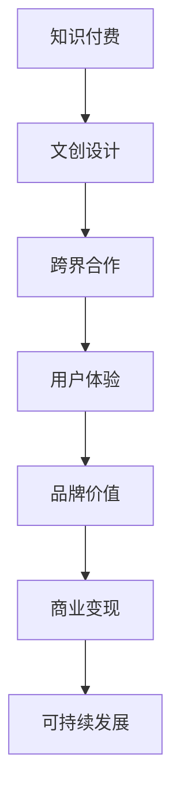

                 

# 知识付费如何实现跨界营销与文创设计跨界？

> 关键词：知识付费,跨界营销,文创设计,数字经济,内容创新

## 1. 背景介绍

### 1.1 问题由来
随着互联网技术的快速发展，知识付费模式在知识传播和消费领域中逐渐兴起。其核心在于通过在线平台为用户提供专业知识服务，以有偿方式换取用户的时间和注意力。知识付费行业不仅涵盖了广泛的教育、科技、生活等领域的专家讲座、书籍、课程等，还包括音频、视频、播客等多媒体内容。这一模式为知识传播开辟了新的道路，同时也为内容创造者提供了全新的经济增长点。

然而，知识付费市场目前还面临诸多挑战。如何在激烈的市场竞争中脱颖而出？如何提升用户体验并增加用户粘性？如何实现商业变现并实现可持续发展？这些问题已经逐渐成为知识付费行业发展的重要课题。

与此同时，文化创意产业（以下简称“文创产业”）的兴起，为知识付费带来了新的发展思路。文创产业结合了艺术、设计和科技的元素，通过创意产品、数字内容等形式，满足了消费者对个性化、差异化需求。文创产业与知识付费的跨界合作，不仅可以提升知识付费的内容质量，还能拓展其应用场景，推动数字经济的发展。

## 2. 核心概念与联系

### 2.1 核心概念概述

为了更好地理解知识付费与文创设计的跨界营销策略，首先需要介绍几个关键概念：

- **知识付费**：指用户为获取特定知识或技能而支付费用的模式。其核心在于提供有价值的内容，满足用户需求。
- **文创设计**：指结合文化、艺术和设计元素的创意产品、数字内容等的开发和设计。文创产业注重内容的原创性和独特性，致力于打造具有品牌价值和市场竞争力的产品。
- **跨界营销**：指不同领域或行业的企业、组织或个体通过合作、融合等形式，共同推广产品或服务，实现资源共享、优势互补的营销策略。

### 2.2 核心概念原理和架构的 Mermaid 流程图



这个流程图展示了知识付费与文创设计的跨界合作路径，即通过结合文创设计和跨界营销策略，提升用户体验，增强品牌价值，实现商业变现和可持续发展。

## 3. 核心算法原理 & 具体操作步骤

### 3.1 算法原理概述

知识付费与文创设计的跨界营销，本质上是将知识付费的商业模式与文创设计的内容创新相结合，通过跨界合作来提升内容价值和用户粘性，实现市场拓展和品牌价值提升。其核心算法包括：

- **内容筛选与推荐算法**：利用机器学习算法，根据用户兴趣和行为数据，筛选和推荐高质量的文创内容，提升用户体验。
- **用户行为分析算法**：通过数据分析，了解用户需求和行为习惯，优化内容和营销策略，提高用户留存率。
- **互动设计算法**：结合用户行为数据，设计互动性强的交互界面和活动，增加用户参与度。

### 3.2 算法步骤详解

#### 3.2.1 内容筛选与推荐算法

1. **数据收集**：从知识付费平台和文创内容提供方收集用户行为数据和内容标签。
2. **特征提取**：利用文本处理、图像识别等技术，提取内容的关键词、风格、主题等特征。
3. **算法模型训练**：采用协同过滤、内容基推荐、深度学习等算法，建立推荐模型。
4. **内容推荐**：根据用户兴趣和行为，实时推荐符合用户需求的文创内容。

#### 3.2.2 用户行为分析算法

1. **数据采集**：收集用户在知识付费平台上的浏览、购买、评价等行为数据。
2. **数据预处理**：清洗、整合数据，去除噪声和异常值。
3. **数据分析**：采用聚类、分类等算法，分析用户行为模式和偏好。
4. **策略优化**：根据分析结果，优化内容推荐和营销策略。

#### 3.2.3 互动设计算法

1. **交互设计**：结合用户行为数据，设计互动性强的界面和活动，如话题讨论、在线讲座等。
2. **用户反馈收集**：通过问卷调查、评价等方式，收集用户对互动活动的反馈。
3. **优化调整**：根据反馈结果，调整和优化互动设计。

### 3.3 算法优缺点

#### 3.3.1 优点

1. **提升内容价值**：通过文创设计的跨界合作，提升知识付费平台的内容质量，满足用户多样化需求。
2. **增强用户粘性**：结合文创设计的多样化和互动性，提升用户体验，增加用户粘性。
3. **优化营销策略**：通过用户行为分析，优化推荐算法和营销策略，提升平台的市场竞争力。

#### 3.3.2 缺点

1. **技术门槛较高**：需要结合知识付费和文创设计的特点，开发适合的具体算法模型。
2. **数据隐私问题**：在数据采集和处理过程中，需要注意保护用户隐私和数据安全。
3. **内容版权问题**：文创设计需要保护原创性和版权，需要与内容提供方协调合作。

### 3.4 算法应用领域

知识付费与文创设计的跨界营销策略，可以应用于多个领域，如：

1. **在线教育**：通过结合文创设计，提升教育内容的多样化和互动性，吸引更多用户。
2. **科技资讯**：结合科技领域的文创设计，提升科技资讯的可读性和趣味性，增加用户粘性。
3. **健康管理**：结合健康领域的文创设计，提供多样化的健康管理内容和互动活动，提升用户参与度。

## 4. 数学模型和公式 & 详细讲解 & 举例说明

### 4.1 数学模型构建

#### 4.1.1 内容筛选与推荐模型

1. **协同过滤算法**
   - **用户相似度计算**：计算用户之间的相似度，采用余弦相似度或皮尔逊相关系数等。
   - **物品相似度计算**：计算物品之间的相似度，采用余弦相似度或欧几里得距离等。
   - **推荐公式**：根据相似度计算结果，采用加权平均或矩阵分解等方法，得到推荐结果。

2. **内容基推荐算法**
   - **内容特征提取**：提取内容的关键词、主题等特征，构建内容特征向量。
   - **相似度计算**：计算用户和内容之间的相似度，采用余弦相似度或Jaccard相似度等。
   - **推荐公式**：根据相似度计算结果，采用加权平均或矩阵分解等方法，得到推荐结果。

#### 4.1.2 用户行为分析模型

1. **用户行为聚类**
   - **数据预处理**：清洗、整合用户行为数据，去除噪声和异常值。
   - **聚类算法**：采用K-means、层次聚类等算法，对用户行为进行聚类。
   - **聚类结果**：根据聚类结果，分析用户行为模式和偏好。

2. **用户行为分类**
   - **数据预处理**：清洗、整合用户行为数据，去除噪声和异常值。
   - **分类算法**：采用决策树、支持向量机等算法，对用户行为进行分类。
   - **分类结果**：根据分类结果，优化内容推荐和营销策略。

#### 4.1.3 互动设计模型

1. **用户行为互动设计**
   - **交互界面设计**：根据用户行为数据，设计互动性强的界面和活动，如话题讨论、在线讲座等。
   - **用户反馈收集**：通过问卷调查、评价等方式，收集用户对互动活动的反馈。
   - **优化调整**：根据反馈结果，调整和优化互动设计。

2. **用户行为分析**
   - **数据采集**：收集用户在知识付费平台上的浏览、购买、评价等行为数据。
   - **数据预处理**：清洗、整合数据，去除噪声和异常值。
   - **数据分析**：采用聚类、分类等算法，分析用户行为模式和偏好。

### 4.2 公式推导过程

#### 4.2.1 协同过滤算法公式推导

$$
\text{相似度} = \cos\theta(\mathbf{u}, \mathbf{i}) = \frac{\mathbf{u} \cdot \mathbf{i}}{\|\mathbf{u}\|\|\mathbf{i}\|}
$$

$$
\text{推荐结果} = \text{加权平均} = \sum_{i=1}^{N} w_i\mathbf{u}_i\mathbf{i}
$$

其中，$\mathbf{u}$ 为用户的兴趣向量，$\mathbf{i}$ 为内容的特征向量，$w_i$ 为权重系数。

#### 4.2.2 内容基推荐算法公式推导

$$
\text{相似度} = \cos\theta(\mathbf{u}, \mathbf{c}) = \frac{\mathbf{u} \cdot \mathbf{c}}{\|\mathbf{u}\|\|\mathbf{c}\|}
$$

$$
\text{推荐结果} = \text{加权平均} = \sum_{i=1}^{N} w_i\mathbf{u}_i\mathbf{c}_i
$$

其中，$\mathbf{u}$ 为用户兴趣向量，$\mathbf{c}$ 为内容特征向量，$w_i$ 为权重系数。

### 4.3 案例分析与讲解

#### 4.3.1 案例一：在线教育平台的内容推荐

某在线教育平台通过结合文创设计的跨界合作，提升了教育内容的多样化和互动性，吸引了更多用户。平台采用协同过滤算法，根据用户行为数据，推荐适合用户的文创课程和内容。平台还采用了内容基推荐算法，通过分析课程内容和用户兴趣，推荐符合用户需求的多样化课程。

#### 4.3.2 案例二：科技资讯平台的用户行为分析

某科技资讯平台通过结合文创设计的跨界合作，提升了科技资讯的可读性和趣味性，增加了用户粘性。平台采用用户行为聚类算法，通过分析用户行为数据，对用户进行聚类，发现不同用户群体的兴趣偏好。平台还采用了用户行为分类算法，通过分析用户行为数据，对用户行为进行分类，优化内容推荐和营销策略。

## 5. 项目实践：代码实例和详细解释说明

### 5.1 开发环境搭建

#### 5.1.1 环境配置

1. **安装Python**：从官网下载安装Python，确保环境配置正确。
2. **安装相关库**：安装numpy、pandas、scikit-learn等常用的数据处理和机器学习库。
3. **搭建开发环境**：搭建虚拟环境，安装所需的依赖库和框架。

#### 5.1.2 工具和资源推荐

1. **数据集**：收集知识付费平台和文创内容的数据集，如用户行为数据、课程内容标签等。
2. **机器学习框架**：使用TensorFlow、PyTorch等机器学习框架，进行算法模型训练和优化。
3. **可视化工具**：使用Matplotlib、Seaborn等可视化工具，展示算法模型效果和用户行为分析结果。

### 5.2 源代码详细实现

#### 5.2.1 协同过滤算法实现

```python
from sklearn.metrics.pairwise import cosine_similarity
import numpy as np

# 构建用户-内容相似度矩阵
def similarity_matrix(user_behaviors, item_features):
    user_similarities = cosine_similarity(user_behaviors)
    item_similarities = cosine_similarity(item_features)
    similarity_matrix = np.dot(user_similarities, item_similarities.T)
    return similarity_matrix

# 推荐函数
def recommendation(similarity_matrix, user_index, top_n=10):
    user_index = user_index + 1  # 用户编号从1开始
    similarities = similarity_matrix[user_index]
    sorted_indices = np.argsort(similarities)[::-1]
    recommended_items = sorted_indices[:top_n]
    return recommended_items
```

#### 5.2.2 用户行为分析实现

```python
from sklearn.cluster import KMeans
from sklearn.preprocessing import StandardScaler
import pandas as pd

# 用户行为数据预处理
def preprocess_user_data(user_data):
    data = pd.read_csv(user_data)
    user_features = data[['purchase', 'rate', 'time']]  # 选择相关特征
    user_features = user_features.fillna(0)  # 填充缺失值
    user_features = StandardScaler().fit_transform(user_features)  # 标准化
    return user_features

# 用户行为聚类
def cluster_user_data(user_features, n_clusters):
    kmeans = KMeans(n_clusters=n_clusters)
    kmeans.fit(user_features)
    user_labels = kmeans.labels_
    return user_labels

# 用户行为分类
def classify_user_data(user_data, n_clusters):
    user_labels = cluster_user_data(user_data, n_clusters)
    data = pd.read_csv(user_data)
    features = data[['purchase', 'rate', 'time']]  # 选择相关特征
    features = features.fillna(0)  # 填充缺失值
    features = StandardScaler().fit_transform(features)  # 标准化
    classifier = RandomForestClassifier(n_estimators=100, random_state=42)
    classifier.fit(features, user_labels)
    return classifier
```

### 5.3 代码解读与分析

#### 5.3.1 协同过滤算法解读

1. **数据预处理**：将用户行为数据和内容特征数据进行标准化处理，消除数据间的量纲差异。
2. **相似度计算**：使用余弦相似度计算用户和内容之间的相似度。
3. **推荐结果**：根据相似度计算结果，采用加权平均等方法，得到推荐结果。

#### 5.3.2 用户行为分析解读

1. **数据预处理**：清洗、整合用户行为数据，去除噪声和异常值。
2. **聚类算法**：使用K-means等聚类算法，对用户行为进行聚类。
3. **分类算法**：使用随机森林等分类算法，对用户行为进行分类。

### 5.4 运行结果展示

#### 5.4.1 协同过滤算法运行结果

```python
user_index = 1  # 用户编号从1开始
top_n = 10  # 推荐数量
similarity_matrix = similarity_matrix(user_behaviors, item_features)
recommended_items = recommendation(similarity_matrix, user_index, top_n)
print(f"为用户{user_index}推荐的内容有：{recommended_items}")
```

#### 5.4.2 用户行为分析运行结果

```python
user_data = 'user_behaviors.csv'
n_clusters = 5  # 聚类数
user_features = preprocess_user_data(user_data)
user_labels = cluster_user_data(user_features, n_clusters)
classifier = classify_user_data(user_data, n_clusters)
```

## 6. 实际应用场景

### 6.1 在线教育平台

在线教育平台通过结合文创设计的跨界合作，提升了教育内容的多样化和互动性，吸引了更多用户。平台采用协同过滤算法，根据用户行为数据，推荐适合用户的文创课程和内容。平台还采用了内容基推荐算法，通过分析课程内容和用户兴趣，推荐符合用户需求的多样化课程。

### 6.2 科技资讯平台

科技资讯平台通过结合文创设计的跨界合作，提升了科技资讯的可读性和趣味性，增加了用户粘性。平台采用用户行为聚类算法，通过分析用户行为数据，对用户进行聚类，发现不同用户群体的兴趣偏好。平台还采用了用户行为分类算法，通过分析用户行为数据，对用户行为进行分类，优化内容推荐和营销策略。

## 7. 工具和资源推荐

### 7.1 学习资源推荐

1. **《Python数据科学手册》**：介绍Python在数据科学中的应用，包括数据处理、机器学习、可视化等。
2. **《机器学习实战》**：通过实例讲解机器学习算法和应用，适合初学者学习。
3. **《Deep Learning with Python》**：介绍深度学习在实际项目中的应用，包括模型构建、优化等。
4. **Coursera课程**：提供大量高质量的机器学习、深度学习课程，涵盖理论知识和实践技巧。
5. **Kaggle竞赛**：参与机器学习和数据科学竞赛，提升实战能力。

### 7.2 开发工具推荐

1. **Jupyter Notebook**：开源的交互式编程环境，支持Python、R等多种编程语言。
2. **TensorFlow**：由Google开发的机器学习框架，适合大规模数据处理和深度学习应用。
3. **PyTorch**：Facebook开发的深度学习框架，适合研究和原型开发。
4. **Python IDE**：如PyCharm、Jupyter Lab等，提供代码编写、调试、版本控制等功能。
5. **数据可视化工具**：如Matplotlib、Seaborn、Plotly等，支持多种图表绘制。

### 7.3 相关论文推荐

1. **《协同过滤推荐系统》**：介绍协同过滤推荐算法的原理和应用，适合理论学习。
2. **《用户行为分析》**：介绍用户行为分析的方法和应用，涵盖聚类、分类等算法。
3. **《跨界营销策略》**：介绍跨界营销的案例和方法，适合实践应用。

## 8. 总结：未来发展趋势与挑战

### 8.1 未来发展趋势

知识付费与文创设计的跨界营销策略，未来将继续发展，呈现出以下趋势：

1. **技术融合**：知识付费平台与文创设计将更深入地融合，提升内容质量和用户体验。
2. **个性化定制**：通过用户行为分析，提供个性化推荐和定制化服务，满足用户多样化需求。
3. **跨平台协同**：结合多种平台和渠道，实现多平台协同推广，提升市场覆盖率。
4. **技术创新**：引入更多前沿技术，如AI、AR/VR等，提升互动体验和沉浸感。

### 8.2 未来挑战

尽管知识付费与文创设计的跨界营销策略已取得显著成效，但面临以下挑战：

1. **技术瓶颈**：结合知识付费和文创设计的复杂性，需要高水平的技术支持。
2. **数据隐私**：用户行为数据和内容数据的隐私保护，需要严格的技术手段。
3. **市场竞争**：知识付费平台之间的竞争激烈，需要不断创新和优化。
4. **内容版权**：文创设计需要保护原创性和版权，需要与内容提供方协调合作。

### 8.3 研究展望

未来，知识付费与文创设计的跨界营销策略将持续发展，需要在以下方面进行深入研究：

1. **模型优化**：优化算法模型，提升推荐准确率和用户满意度。
2. **数据增强**：提升数据质量和多样性，增强推荐效果。
3. **用户交互**：提升用户交互体验，增加用户粘性。
4. **市场拓展**：拓展新的应用场景，提升市场竞争力。

## 9. 附录：常见问题与解答

### 9.1 常见问题

1. **如何选择合适的协同过滤算法？**
   - 根据数据量和特征复杂度，选择适合的数据驱动型算法（如基于矩阵分解的算法）或模型驱动型算法（如基于深度学习的算法）。

2. **用户行为分析如何处理缺失数据？**
   - 采用插值、均值填充等方式，处理缺失数据，保证数据分析的完整性。

3. **跨界合作如何实现？**
   - 通过数据共享、技术合作等方式，实现跨界平台的资源整合和优势互补。

### 9.2 解答

1. **如何选择合适的协同过滤算法？**
   - 根据数据量和特征复杂度，选择适合的数据驱动型算法（如基于矩阵分解的算法）或模型驱动型算法（如基于深度学习的算法）。

2. **用户行为分析如何处理缺失数据？**
   - 采用插值、均值填充等方式，处理缺失数据，保证数据分析的完整性。

3. **跨界合作如何实现？**
   - 通过数据共享、技术合作等方式，实现跨界平台的资源整合和优势互补。

---

作者：禅与计算机程序设计艺术 / Zen and the Art of Computer Programming

