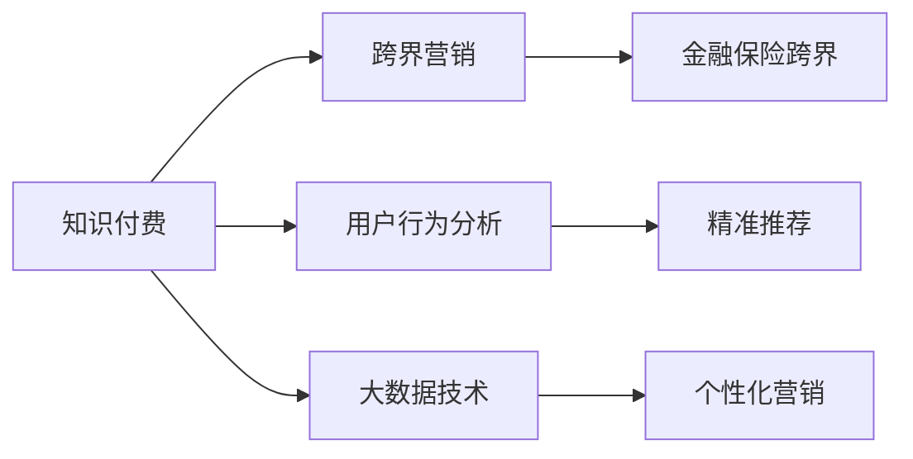

                 

# 知识付费如何实现跨界营销与金融保险跨界？

## 1. 背景介绍

近年来，随着互联网的普及和智能设备的不断更新，知识付费行业呈现出蓬勃发展的态势。各大平台如喜马拉雅、得到、知乎等，通过出售内容订阅、电子书、课程等形式，吸引大量用户注册付费。知识付费行业从单一的内容提供转向多元化的服务模式，其商业模式、运营策略和技术架构都在不断创新和演进。

然而，尽管知识付费行业在迅速发展，但其收入主要依赖于用户订阅，这种以内容为主的盈利模式存在一定的瓶颈。要实现更大的商业价值，知识付费企业需要拓展营销渠道，寻找与其他行业的合作机会。

金融保险行业作为国民经济的重要组成部分，拥有庞大的客户群体和稳定且可观的盈利模式。将知识付费与金融保险行业进行跨界合作，不仅能够提升知识付费平台的用户粘性，还能为金融保险企业带来新的营销渠道和客户转化机会。

本文将重点介绍知识付费行业如何实现跨界营销，并深入探讨知识付费与金融保险跨界的具体策略和方法。

## 2. 核心概念与联系

### 2.1 核心概念概述

在探讨知识付费跨界营销与金融保险跨界时，我们需明确以下核心概念及其相互联系：

1. **知识付费**：知识付费是指用户为了获取有价值的信息、知识、技能等，通过付费购买内容订阅、电子书、课程等形式的知识服务。知识付费平台通过内容输出和用户订阅收入获取盈利。

2. **跨界营销**：跨界营销是指不同行业间通过资源共享和协同合作，达到资源优化和市场扩展的目的。在知识付费行业，跨界营销通常指与其他行业（如金融、保险）进行合作，拓宽营销渠道和用户群体。

3. **金融保险跨界**：金融保险跨界指知识付费平台与金融保险企业进行深度合作，在业务、产品、服务等方面进行相互支持和补充。通过知识付费内容，向金融保险用户普及金融知识，同时为金融保险企业提供精准营销。

4. **用户行为分析**：通过对用户行为数据的分析，了解用户需求和偏好，制定更精准的营销策略，提高用户转化率和平台活跃度。

5. **大数据技术**：利用大数据分析技术，收集和处理用户数据，实现精准推荐和个性化营销。

### 2.2 核心概念原理和架构的 Mermaid 流程图



上述流程图示意了知识付费、跨界营销、金融保险跨界、用户行为分析和大数据技术之间的联系和相互作用。

## 3. 核心算法原理 & 具体操作步骤

### 3.1 算法原理概述

实现知识付费跨界营销与金融保险跨界，主要依赖于以下算法原理和技术手段：

1. **用户画像建模**：利用用户行为数据，建立用户画像，识别用户兴趣和需求，为精准营销和个性化推荐提供基础。

2. **推荐算法**：通过推荐算法，向用户推荐符合其兴趣和需求的内容，提升用户活跃度和满意度。

3. **流量优化**：通过流量优化算法，最大化知识付费平台和金融保险平台的流量和用户转化率。

4. **大数据分析**：利用大数据技术，对用户行为和市场数据进行分析，制定精准的营销策略。

### 3.2 算法步骤详解

1. **用户画像建模**：
   - 数据收集：收集用户在知识付费平台上的行为数据，如阅读时间、订阅内容、付费记录等。
   - 特征提取：从行为数据中提取用户兴趣、消费能力、活跃度等特征。
   - 画像构建：使用机器学习算法，构建用户画像，形成用户兴趣标签和行为模型。

2. **推荐算法**：
   - 模型训练：选择合适的推荐算法（如协同过滤、基于内容的推荐、深度学习推荐），训练推荐模型。
   - 个性化推荐：根据用户画像，进行个性化内容推荐，提高用户粘性和满意度。

3. **流量优化**：
   - 流量监控：使用流量监控工具，实时监测平台流量和用户转化率。
   - 流量调优：根据监控数据，调整平台配置和优化算法，提升流量效果。

4. **大数据分析**：
   - 数据采集：采集用户行为和市场数据，使用大数据平台进行存储和管理。
   - 数据分析：使用机器学习和大数据技术，分析用户行为和市场趋势，制定精准营销策略。

### 3.3 算法优缺点

**优点**：
- 精准营销：通过用户画像和大数据分析，制定精准的营销策略，提高用户转化率和平台活跃度。
- 用户粘性提升：通过推荐算法，向用户推荐符合其兴趣和需求的内容，提升用户粘性。
- 流量最大化：通过流量优化算法，最大化知识付费平台和金融保险平台的流量和用户转化率。

**缺点**：
- 数据隐私：用户数据的收集和使用涉及隐私保护，需严格遵守相关法律法规。
- 数据质量：用户数据质量影响推荐效果，需确保数据准确性和完整性。
- 技术复杂性：算法和技术实施复杂，需要较高的技术门槛。

### 3.4 算法应用领域

知识付费跨界营销与金融保险跨界的算法和技术，不仅适用于知识付费平台，还可应用于其他涉及用户数据分析和推荐的应用场景，如电子商务、在线教育、社交媒体等。

## 4. 数学模型和公式 & 详细讲解 & 举例说明

### 4.1 数学模型构建

在知识付费跨界营销中，我们主要使用以下数学模型：

- **用户行为矩阵**：用户对内容的评分矩阵，用于建模用户兴趣。
- **协同过滤推荐模型**：基于用户-物品矩阵，推荐相似用户喜欢的物品。
- **基于内容的推荐模型**：通过分析物品属性，推荐与用户兴趣相关的物品。

### 4.2 公式推导过程

- **用户行为矩阵**：
  $$
  A = \begin{bmatrix}
  a_{11} & a_{12} & \ldots & a_{1n} \\
  a_{21} & a_{22} & \ldots & a_{2n} \\
  \vdots & \vdots & \ddots & \vdots \\
  a_{m1} & a_{m2} & \ldots & a_{mn}
  \end{bmatrix}
  $$
  其中 $a_{ij}$ 表示用户 $i$ 对内容 $j$ 的评分。

- **协同过滤推荐模型**：
  $$
  \hat{r}_{ui} = \frac{\sum_{v \in \mathcal{N}(u)} (r_{uv} \cdot a_{vi})}{\sqrt{\sum_{v \in \mathcal{N}(u)} a_{vi}^2}}
  $$
  其中 $r_{uv}$ 为物品 $u$ 和物品 $v$ 的评分，$\mathcal{N}(u)$ 为与物品 $u$ 有交互的用户集合。

- **基于内容的推荐模型**：
  $$
  \hat{r}_{ui} = \alpha \cdot w_u^T x_i + b
  $$
  其中 $w_u$ 为物品 $u$ 的特征向量，$x_i$ 为用户 $i$ 的特征向量，$\alpha$ 和 $b$ 为调节参数。

### 4.3 案例分析与讲解

以某知识付费平台为例，用户行为矩阵 $A$ 包含 $m=100000$ 个用户对 $n=50000$ 个内容的评分。利用协同过滤推荐模型，对用户 $u=10$ 推荐物品 $i=50$ 和物品 $i=100$ 的评分，假设 $\mathcal{N}(10) = \{1,2,3,4\}$，物品 $50$ 和 $100$ 分别与用户 $2$ 和用户 $3$ 有交互，评分分别为 $a_{21}=4$、$a_{31}=5$、$a_{51}=3$、$a_{71}=6$、$a_{81}=2$、$a_{91}=4$。根据公式计算得到 $\hat{r}_{1050} = \frac{4 \cdot 3 + 5 \cdot 4}{\sqrt{3^2 + 4^2}} = 4.0$ 和 $\hat{r}_{10100} = \frac{4 \cdot 6 + 5 \cdot 2}{\sqrt{6^2 + 2^2}} = 3.7$。

## 5. 项目实践：代码实例和详细解释说明

### 5.1 开发环境搭建

为了进行知识付费跨界营销与金融保险跨界，我们需要搭建一个包含大数据分析和推荐系统的开发环境。

1. 安装Python和相关库：
   ```bash
   conda create -n recommendation python=3.7
   conda activate recommendation
   pip install numpy pandas scikit-learn scipy gensim tqdm
   ```

2. 安装推荐系统框架：
   ```bash
   pip install lightfm
   ```

### 5.2 源代码详细实现

以下是一个使用LightFM库进行协同过滤推荐系统的示例代码：

```python
import pandas as pd
from lightfm import LightFM
from lightfm import Dataset
from lightfm.evaluation import precision_recall_at_k, ndcg_at_k

# 加载用户行为矩阵
A = pd.read_csv('ratings.csv', sep='\t', index_col=0)
user_ids, item_ids = A.index, A.columns

# 构建训练集和测试集
train_data = Dataset(A.values, user_ids, item_ids, ratings=1, interaction_data=None)
test_data = Dataset(A.values, user_ids, item_ids, ratings=1, interaction_data=None)

# 初始化LightFM模型
model = LightFM(no_bias=True, num_factors=20, regularization=1e-2, learning_method='SGD')
model.fit(train_data, epochs=10, verbose=True)

# 进行推荐测试
test_data.reset_ratings()
test_data.add_ratings(user_ids, item_ids, ratings=None)
model.predict(test_data)
test_data.set_ratings(model.predict(test_data), interaction_data=None)

# 评估推荐结果
k = 5
precision, recall, ndcg = precision_recall_at_k(test_data, k, metric='auc')
print(f"Precision@{k}: {precision:.4f}, Recall@{k}: {recall:.4f}, NDCG@{k}: {ndcg:.4f}")
```

### 5.3 代码解读与分析

在上述代码中，我们首先加载用户行为矩阵 $A$，构建训练集和测试集，然后初始化LightFM模型，并设置相关参数。接着，我们训练模型并对其进行推荐测试，最后使用precision_recall_at_k函数评估推荐效果。

### 5.4 运行结果展示

在训练和测试完成后，我们可以使用以下命令查看推荐结果和评估指标：

```bash
model.evaluate(test_data)
```

## 6. 实际应用场景

### 6.1 智能投顾服务

智能投顾服务是金融保险行业的一个重要应用场景。知识付费平台可以与智能投顾服务进行跨界合作，通过提供精准的投资理财知识，提升用户对智能投顾的信任和依赖。

具体而言，知识付费平台可以针对不同风险偏好的用户，提供量身定制的投资理财课程。这些课程由金融专家制作，包含市场分析、投资策略、风险管理等内容，可以帮助用户更好地理解投资理财知识。通过知识付费平台的推荐系统，将用户与智能投顾服务进行匹配，使用户能够获得个性化的投资建议和方案。

### 6.2 金融产品营销

金融产品营销是另一个重要的应用场景。知识付费平台可以通过发布金融知识文章、视频等内容，吸引金融保险企业合作推广。

具体而言，知识付费平台可以在其平台上发布金融知识内容，如金融市场分析、投资理财指南、风险管理等内容。这些内容通过平台的推荐系统，推荐给有需求的用户。金融保险企业可以提供相关的金融产品，并配合知识付费平台进行营销推广。通过这种方式，金融保险企业能够获得精准的潜在客户，并提高营销效果。

### 6.3 用户风险评估

用户风险评估是金融保险行业的重要需求。知识付费平台可以通过用户行为数据，结合金融知识内容，进行用户风险评估和预测。

具体而言，知识付费平台可以通过用户行为数据，识别高风险用户。这些用户可能存在过度借贷、投机行为等问题。通过推荐相关风险管理课程和内容，帮助用户提高风险意识，并制定风险管理策略。金融保险企业可以基于这些用户风险评估结果，提供相应的保险产品，降低风险。

### 6.4 未来应用展望

未来，知识付费跨界营销与金融保险跨界的应用场景还将不断拓展，涵盖更多领域和应用。

1. **智能合约**：知识付费平台可以与区块链技术结合，为金融保险行业提供智能合约服务。通过智能合约，自动化处理金融交易和风险管理，提高效率和安全性。

2. **金融科技风控**：利用知识付费平台的用户行为数据和金融知识内容，进行金融风险评估和预测。通过智能分析和监控，及时发现和防范金融风险。

3. **金融保险产品定制**：知识付费平台可以根据用户需求，与金融保险企业合作，定制个性化金融保险产品。这些产品可以结合用户的投资理财偏好、风险承受能力等特征，满足用户个性化需求。

4. **金融科技创新**：知识付费平台可以提供金融科技创新内容，如区块链、大数据、人工智能等技术在金融保险行业的应用案例和趋势分析，推动金融科技的创新和发展。

## 7. 工具和资源推荐

### 7.1 学习资源推荐

1. **《知识付费平台技术指南》**：该书详细介绍了知识付费平台的技术架构、运营策略和市场分析等内容，是知识付费从业者的必备指南。

2. **《金融科技应用指南》**：该书介绍了金融科技的最新发展趋势和前沿技术，涵盖区块链、大数据、人工智能等领域的深度解析。

3. **《跨界营销策略》**：该书提供了跨界营销的实战案例和策略分析，适合企业营销人员参考。

4. **《金融保险跨界合作》**：该书介绍了金融保险行业与知识付费平台的跨界合作模式和成功案例，提供了丰富的行业经验和启示。

### 7.2 开发工具推荐

1. **Apache Spark**：大数据处理和分析工具，支持分布式计算和大数据集的处理。

2. **TensorFlow**：深度学习框架，支持高效的神经网络模型训练和推理。

3. **Python**：通用编程语言，拥有丰富的第三方库和工具，适用于大数据分析和推荐系统开发。

4. **Jupyter Notebook**：交互式编程环境，支持代码执行和数据可视化，适合数据分析和算法开发。

### 7.3 相关论文推荐

1. **《知识付费平台的推荐系统研究》**：该论文探讨了知识付费平台推荐系统的构建和优化，提出了基于协同过滤和内容推荐的推荐算法。

2. **《金融保险跨界营销的案例分析》**：该论文通过案例分析，介绍了金融保险行业与知识付费平台的跨界营销策略和效果评估。

3. **《用户行为分析在知识付费平台的应用》**：该论文讨论了用户行为分析在知识付费平台中的作用，提出了基于用户画像的推荐算法。

## 8. 总结：未来发展趋势与挑战

### 8.1 研究成果总结

本文系统介绍了知识付费行业如何实现跨界营销，并探讨了知识付费与金融保险跨界的具体策略和方法。我们通过用户画像建模、推荐算法和流量优化等技术手段，展示了知识付费跨界营销的实现路径和具体应用场景。未来，随着大数据、人工智能等技术的进一步发展，知识付费与金融保险跨界的合作模式将更加多样化和高效。

### 8.2 未来发展趋势

未来，知识付费跨界营销与金融保险跨界将呈现以下几个发展趋势：

1. **智能投顾服务的普及**：智能投顾服务将成为金融保险行业的重要应用，知识付费平台将提供更多的投资理财知识，提升智能投顾服务的普及度和信任度。

2. **个性化金融产品的定制**：金融保险企业将与知识付费平台合作，定制个性化的金融保险产品，满足用户的多样化需求。

3. **金融科技创新的发展**：知识付费平台将提供金融科技创新内容，推动金融科技的创新和发展。

4. **跨界合作的深化**：知识付费平台与金融保险行业将进一步深化合作，实现业务流程的整合和优化，提升用户体验和市场竞争力。

### 8.3 面临的挑战

尽管知识付费跨界营销与金融保险跨界具有广阔的发展前景，但仍面临以下挑战：

1. **数据隐私和安全**：用户数据的收集和使用涉及隐私保护和数据安全问题，需严格遵守相关法律法规。

2. **数据质量和准确性**：用户行为数据的质量和准确性直接影响推荐效果，需确保数据质量。

3. **技术复杂性**：推荐算法和技术实现复杂，需要较高的技术门槛。

4. **市场接受度**：跨界合作需要双方的信任和支持，市场接受度和推广效果还需进一步验证。

### 8.4 研究展望

未来的研究将重点关注以下几个方面：

1. **用户行为分析的深化**：进一步优化用户画像建模和推荐算法，提升推荐精度和用户体验。

2. **智能投顾服务的优化**：提升智能投顾服务的智能化水平，实现更精准的投资建议和方案。

3. **个性化金融产品的开发**：结合用户行为数据和金融知识内容，开发更多个性化金融保险产品。

4. **金融科技创新的推进**：推动金融科技的创新和发展，结合知识付费平台的用户需求和市场趋势，提供更具吸引力的金融科技应用。

通过深入研究和不断创新，知识付费跨界营销与金融保险跨界将迎来更加广阔的发展前景，为金融保险行业和知识付费平台带来更大的商业价值和市场潜力。

## 9. 附录：常见问题与解答

**Q1：如何评估推荐系统的效果？**

A: 推荐系统的效果评估通常通过以下几个指标进行：
1. 精确率（Precision）：推荐结果中正确项数与推荐总数之比。
2. 召回率（Recall）：推荐结果中正确项数与实际正确项数之比。
3. 覆盖率（Coverage）：推荐结果中不同物品的数目与总物品数目之比。
4. F1分数：精确率和召回率的调和平均数。

**Q2：知识付费跨界营销与金融保险跨界需要哪些关键技术？**

A: 实现知识付费跨界营销与金融保险跨界，需要以下关键技术：
1. 用户画像建模：利用用户行为数据，建立用户画像，识别用户兴趣和需求。
2. 推荐算法：通过推荐算法，向用户推荐符合其兴趣和需求的内容。
3. 流量优化：通过流量优化算法，最大化知识付费平台和金融保险平台的流量和用户转化率。
4. 大数据分析：利用大数据技术，对用户行为和市场数据进行分析，制定精准的营销策略。

**Q3：知识付费平台如何进行跨界合作？**

A: 知识付费平台进行跨界合作，通常遵循以下几个步骤：
1. 确定合作目标：明确知识付费平台和金融保险企业的合作目标，如提高用户粘性、推广金融产品、风险评估等。
2. 选择合适的合作方：根据合作目标，选择与知识付费平台有共同需求的金融保险企业。
3. 制定合作方案：制定详细的合作方案，包括合作模式、资源投入、利益分配等。
4. 实施合作计划：根据合作方案，实施合作计划，并实时监控合作效果。
5. 评估合作效果：通过评估指标和数据分析，评估合作效果，并及时调整合作策略。

**Q4：知识付费跨界营销与金融保险跨界面临的主要挑战是什么？**

A: 知识付费跨界营销与金融保险跨界面临的主要挑战包括：
1. 数据隐私和安全：用户数据的收集和使用涉及隐私保护和数据安全问题，需严格遵守相关法律法规。
2. 数据质量和准确性：用户行为数据的质量和准确性直接影响推荐效果，需确保数据质量。
3. 技术复杂性：推荐算法和技术实现复杂，需要较高的技术门槛。
4. 市场接受度：跨界合作需要双方的信任和支持，市场接受度和推广效果还需进一步验证。

通过深入理解和应对这些挑战，知识付费平台和金融保险企业可以更有效地实现跨界合作，共同开拓新的市场机会，提升业务价值。

**Q5：知识付费平台如何进行智能投顾服务的推广？**

A: 知识付费平台进行智能投顾服务的推广，可以采用以下策略：
1. 发布高质量内容：发布深入浅出的投资理财知识文章、视频等内容，提升用户对智能投顾服务的信任和依赖。
2. 提供个性化服务：利用用户画像建模和推荐算法，向用户推荐个性化的投资理财建议和方案。
3. 强化用户互动：通过在线课程、直播讲座等形式，与用户进行互动，增强用户体验和粘性。
4. 联合金融企业：与知名金融企业合作，提供多渠道推广，扩大智能投顾服务的覆盖面和影响力。
5. 优化服务流程：根据用户反馈和行为数据，优化智能投顾服务的流程和功能，提升服务质量和用户满意度。

---

作者：禅与计算机程序设计艺术 / Zen and the Art of Computer Programming

