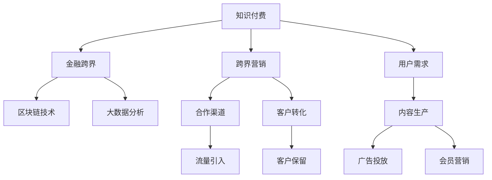

                 

# 知识付费如何实现跨界营销与金融跨界？

## 1. 背景介绍

### 1.1 问题由来
随着互联网技术的快速发展和普及，知识付费成为一种新兴的商业模式，它通过将优质的知识和信息转化为有偿服务，满足了用户对知识和信息的需求。知识付费市场近年来持续增长，逐渐成为教育、媒体、科技等领域的重要组成部分。

然而，知识付费市场面临的挑战也日益严峻。一方面，用户对内容的期待值越来越高，平台需要提供更具深度、广泛、实用的内容以吸引用户；另一方面，在激烈的市场竞争中，如何扩大用户规模、提高用户粘性、增加收入成为平台的重要课题。

## 2. 核心概念与联系

### 2.1 核心概念概述

为了更好地理解知识付费如何实现跨界营销与金融跨界，本节将介绍几个密切相关的核心概念：

- **知识付费**：通过付费获取高质量知识和信息的服务，包括在线课程、电子书、知识问答等形式。
- **跨界营销**：跨界即指不同领域之间的融合与创新，营销则指以客户需求为中心，通过各种手段和方法吸引和留住客户。
- **金融跨界**：金融跨界通常指金融领域与其他行业（如教育、医疗、互联网等）的融合和创新，旨在提高金融服务的效率和质量。
- **区块链技术**：一种去中心化的分布式账本技术，可以用于保障交易安全、提高数据透明性等。
- **大数据分析**：通过收集和分析大量数据，从数据中提取有价值的信息，帮助企业做出更好的决策。

这些核心概念之间的逻辑关系可以通过以下Mermaid流程图来展示：



这个流程图展示了知识付费、跨界营销、金融跨界等概念之间的联系：

1. 知识付费为内容生产提供动力，同时也需要通过跨界营销拓展用户群体。
2. 金融跨界提供金融服务，如支付、理财等，增强平台的用户粘性。
3. 区块链技术和数据分析工具用于提高服务的安全性和精准度。
4. 用户需求是所有活动的出发点，内容生产、广告投放、会员营销等都是围绕用户需求进行的。
5. 跨界营销通过合作渠道引入流量，同时转化和保留客户，增强平台的影响力。

## 3. 核心算法原理 & 具体操作步骤
### 3.1 算法原理概述

知识付费平台通过跨界营销和金融跨界，可以拓展用户规模，提升平台价值，提高用户粘性。具体来说，算法原理如下：

1. **用户行为分析**：通过对用户行为数据的收集和分析，了解用户的需求和偏好，帮助内容生产者优化内容策略，提高内容的吸引力和转化率。
2. **内容推荐算法**：根据用户的浏览历史、搜索记录等数据，推荐可能感兴趣的内容，提高用户对平台的依赖度和停留时间。
3. **广告投放策略**：通过大数据分析，精准投放广告，提高广告的点击率和转化率，同时降低广告成本。
4. **金融服务集成**：通过金融跨界，为平台提供支付、理财、贷款等服务，增加用户粘性，并提高平台收入。

### 3.2 算法步骤详解

以下是对知识付费实现跨界营销与金融跨界的基本操作步骤：

**Step 1: 数据收集与分析**
- 收集平台用户的行为数据，包括浏览记录、搜索历史、互动行为等。
- 对收集到的数据进行分析，提取用户偏好、兴趣等信息。

**Step 2: 内容推荐算法设计**
- 设计推荐算法，可以根据用户的特征和行为，推荐相关内容。
- 使用协同过滤、基于内容的推荐、深度学习等技术，提升推荐效果。

**Step 3: 广告投放策略设计**
- 根据用户数据，设计精准的广告投放策略，包括广告位、展示时间、广告形式等。
- 通过A/B测试等方法，不断优化广告效果，提高点击率和转化率。

**Step 4: 金融服务集成**
- 选择适合的金融服务提供商，集成支付、理财、贷款等金融功能。
- 优化金融服务的用户体验，提高用户粘性和平台收入。

**Step 5: 持续优化与迭代**
- 根据用户反馈和平台数据，不断优化推荐算法和广告策略。
- 定期更新和优化金融服务，提高用户满意度和忠诚度。

### 3.3 算法优缺点

知识付费平台通过跨界营销和金融跨界实现盈利的方法具有以下优点：
1. 扩大用户规模。通过跨界合作和金融服务，吸引更多用户，提高平台的活跃度和用户粘性。
2. 提高平台收入。金融服务的收入补充，可以抵消知识付费平台的成本，增加平台的盈利能力。
3. 提升用户体验。内容推荐和广告投放的优化，提升用户的满意度和平台价值。

同时，这种方法也存在一定的局限性：
1. 数据安全风险。用户数据的收集和分析可能涉及隐私问题，需要严格遵守数据保护法规。
2. 金融服务风险。金融服务的集成和运营可能涉及高风险，需要建立完善的风控机制。
3. 广告效果不确定。广告投放效果受多种因素影响，可能难以达到预期目标。
4. 内容同质化。过度依赖算法推荐可能导致内容同质化，降低用户粘性。

## 4. 数学模型和公式 & 详细讲解 & 举例说明

### 4.1 数学模型构建

知识付费平台的推荐系统可以使用协同过滤、基于内容的推荐、深度学习等算法。以下是协同过滤模型的数学模型构建：

假设用户集为 $U$，物品集为 $I$，用户对物品的评分矩阵为 $R \in \mathbb{R}^{N\times M}$，其中 $N$ 为用户数，$M$ 为物品数。协同过滤的目标是通过用户和物品的相似性，预测用户对物品的评分。

设用户 $u_i$ 对物品 $j$ 的评分为 $r_{ij}$，则协同过滤模型可以表示为：

$$
\hat{r}_{ij} = w_0 + \sum_{k=1}^{K} w_k \left(\frac{\sum_{i'=1}^{N} r_{i'j} \alpha_{ik}}{\sqrt{\sum_{k=1}^{K} \alpha_{ik}^2}} \right) \left(\frac{\sum_{j'=1}^{M} r_{iu'} \beta_{kj'}}{\sqrt{\sum_{k=1}^{K} \beta_{kj'}^2}} \right)
$$

其中，$w_0$ 为常数项，$w_k$ 为权重，$\alpha_{ik}$ 和 $\beta_{kj'}$ 分别为用户 $i$ 和物品 $j$ 的特征向量，$K$ 为特征维度。

### 4.2 公式推导过程

协同过滤模型的推导如下：

设用户 $u_i$ 和物品 $j$ 的特征向量分别为 $\alpha_i$ 和 $\beta_j$，则协同过滤模型的预测评分可以表示为：

$$
\hat{r}_{ij} = w_0 + \sum_{k=1}^{K} w_k (\alpha_i \odot \beta_j)_k
$$

其中 $\odot$ 表示向量点乘。

假设用户 $u_i$ 对物品 $j$ 的实际评分为 $r_{ij}$，则协同过滤模型的均方误差损失函数为：

$$
L = \frac{1}{N}\sum_{i=1}^{N}\frac{1}{M}\sum_{j=1}^{M} (r_{ij} - \hat{r}_{ij})^2
$$

通过最小化损失函数 $L$，得到协同过滤模型的参数 $w_0$ 和 $w_k$。

### 4.3 案例分析与讲解

假设某知识付费平台希望优化推荐系统，提高用户粘性和平台价值。具体步骤如下：

1. 收集用户行为数据，包括浏览记录、搜索历史等。
2. 使用协同过滤算法，设计推荐模型。
3. 根据用户的特征和行为，预测用户对物品的评分。
4. 优化推荐效果，提升用户的满意度和平台价值。

通过上述步骤，平台可以有效提升推荐系统的精准度，同时提高用户粘性和平台收入。

## 5. 项目实践：代码实例和详细解释说明
### 5.1 开发环境搭建

在进行知识付费推荐系统的开发前，我们需要准备好开发环境。以下是使用Python进行TensorFlow开发的环境配置流程：

1. 安装Anaconda：从官网下载并安装Anaconda，用于创建独立的Python环境。

2. 创建并激活虚拟环境：
```bash
conda create -n tf-env python=3.7 
conda activate tf-env
```

3. 安装TensorFlow：从官网获取对应的安装命令。例如：
```bash
conda install tensorflow
```

4. 安装相关工具包：
```bash
pip install pandas scikit-learn matplotlib
```

完成上述步骤后，即可在`tf-env`环境中开始推荐系统的开发。

### 5.2 源代码详细实现

这里我们以协同过滤推荐算法为例，给出使用TensorFlow实现知识付费推荐系统的代码实现。

```python
import tensorflow as tf
from tensorflow.keras.layers import Input, Embedding, Dot, Dense, Add

def create_model(input_dim, embedding_dim, hidden_dim, output_dim):
    input_ = Input(shape=(input_dim,))
    embedding = Embedding(input_dim, embedding_dim, input_length=input_dim)(input_)
    dot = Dot(axes=[2, 2])([embedding, embedding])
    hidden = Dense(hidden_dim, activation='relu')(dot)
    output = Dense(output_dim, activation='sigmoid')(hidden)
    model = tf.keras.Model(inputs=[input_], outputs=[output])
    return model

# 创建模型
model = create_model(input_dim=100, embedding_dim=32, hidden_dim=64, output_dim=10)

# 编译模型
model.compile(optimizer='adam', loss='binary_crossentropy', metrics=['accuracy'])

# 训练模型
model.fit(x_train, y_train, epochs=10, batch_size=32, validation_data=(x_val, y_val))
```

### 5.3 代码解读与分析

让我们再详细解读一下关键代码的实现细节：

**create_model函数**：
- 定义模型的输入层、嵌入层、点积层、全连接层、输出层等组件，构建协同过滤模型的计算图。
- 使用TensorFlow的Keras API，构建模型对象，并返回。

**模型训练**：
- 使用训练集数据 `x_train` 和标签 `y_train`，进行模型训练。
- 设置训练轮数 `epochs` 和批量大小 `batch_size`，并使用验证集数据 `x_val` 和标签 `y_val`，监控模型性能。

通过上述步骤，即可构建并训练协同过滤推荐模型，实现知识付费平台的推荐系统。

### 5.4 运行结果展示

训练结束后，可以使用测试集数据 `x_test` 和标签 `y_test`，评估模型的性能：

```python
model.evaluate(x_test, y_test)
```

以上就是在TensorFlow环境下实现协同过滤推荐算法的代码示例，展示了如何使用TensorFlow进行知识付费推荐系统的开发。

## 6. 实际应用场景
### 6.1 智能推荐系统

知识付费平台可以通过智能推荐系统，向用户推荐可能感兴趣的内容，提高用户粘性和平台价值。具体场景包括：

- 书籍推荐：根据用户的浏览历史、评分记录等数据，推荐相关书籍。
- 课程推荐：根据用户的浏览历史、学习进度等数据，推荐相关课程。
- 文章推荐：根据用户的浏览历史、评论记录等数据，推荐相关文章。

### 6.2 金融服务集成

知识付费平台可以集成金融服务，提供支付、理财、贷款等服务，增加用户粘性和平台收入。具体场景包括：

- 在线支付：用户可以通过知识付费平台进行在线支付，享受更便捷的服务。
- 理财服务：提供基金、保险、股票等理财产品，满足用户理财需求。
- 贷款服务：提供无抵押贷款，帮助用户解决资金问题。

### 6.3 跨界营销合作

知识付费平台可以通过跨界合作，拓展用户规模，提升平台价值。具体场景包括：

- 联合广告：与其他平台进行联合广告投放，引入新用户。
- 内容合作：与其他平台进行内容合作，共享用户资源。
- 活动推广：联合举办线上线下活动，吸引用户参与。

### 6.4 未来应用展望

随着知识付费市场的不断发展和成熟，未来的知识付费平台将更加注重跨界营销和金融跨界，带来更多创新应用和商业模式。

在智慧教育领域，知识付费平台可以通过推荐系统、个性化学习等手段，提升教育服务的质量，帮助学生高效学习。

在金融科技领域，知识付费平台可以提供金融咨询、理财规划等服务，帮助用户更好地管理财务。

在智慧医疗领域，知识付费平台可以提供医疗知识、健康管理等服务，提高用户的健康水平。

未来，知识付费平台将与更多领域进行融合，提供更多元化的服务，满足用户的全面需求，提升平台价值。

## 7. 工具和资源推荐
### 7.1 学习资源推荐

为了帮助开发者系统掌握知识付费的跨界营销和金融跨界技术，这里推荐一些优质的学习资源：

1. 《深度学习与知识图谱》课程：斯坦福大学开设的深度学习课程，涵盖知识图谱构建、推理等技术，适合学习知识付费平台的内容推荐。
2. 《金融科技》书籍：介绍了金融科技的最新进展和应用场景，适合了解知识付费平台的金融跨界应用。
3. 《区块链基础》课程：Coursera提供的区块链课程，涵盖区块链技术的原理和应用，适合学习知识付费平台的金融跨界技术。
4. Kaggle：提供各种数据集和竞赛，适合练习和优化推荐算法、广告投放策略等。

通过这些资源的学习实践，相信你一定能够快速掌握知识付费的跨界营销和金融跨界技术的精髓，并用于解决实际的NLP问题。

### 7.2 开发工具推荐

高效的开发离不开优秀的工具支持。以下是几款用于知识付费跨界营销和金融跨界开发的常用工具：

1. TensorFlow：基于Python的开源深度学习框架，灵活动态的计算图，适合快速迭代研究。
2. PyTorch：基于Python的开源深度学习框架，灵活的动态计算图，适合高效开发。
3. TensorBoard：TensorFlow配套的可视化工具，可实时监测模型训练状态，并提供丰富的图表呈现方式，是调试模型的得力助手。
4. HuggingFace：提供预训练模型和推荐系统等工具，适合开发推荐算法和广告投放策略。

合理利用这些工具，可以显著提升知识付费跨界营销和金融跨界的开发效率，加快创新迭代的步伐。

### 7.3 相关论文推荐

知识付费平台的跨界营销和金融跨界技术的发展源于学界的持续研究。以下是几篇奠基性的相关论文，推荐阅读：

1. Knowledge-aware Recommender Systems: A Survey and Analysis of Knowledge Graphs in Recommender Systems（《知识图谱在推荐系统中的应用》）：介绍了知识图谱在推荐系统中的应用，适合学习知识付费平台的内容推荐。
2. Financial Inclusion and Digital Identification in Developing Countries：《数字身份在发展中国家的金融包容性》：介绍了数字身份技术在金融服务中的应用，适合了解知识付费平台的金融跨界技术。
3. Blockchain for Financial Innovation: Benefits, Challenges, and Opportunities：《区块链在金融创新中的应用：优势、挑战和机遇》：介绍了区块链技术在金融领域的应用，适合学习知识付费平台的金融跨界技术。

这些论文代表了大语言模型微调技术的发展脉络。通过学习这些前沿成果，可以帮助研究者把握学科前进方向，激发更多的创新灵感。

## 8. 总结：未来发展趋势与挑战
### 8.1 总结

本文对知识付费实现跨界营销与金融跨界的技术进行了全面系统的介绍。首先阐述了知识付费平台通过跨界营销和金融跨界拓展用户规模、提升平台价值、提高用户粘性的必要性和方法。其次，从原理到实践，详细讲解了知识付费跨界营销和金融跨界的基本算法和操作步骤，给出了具体代码示例和运行结果。同时，本文还探讨了知识付费平台在智能推荐、金融服务、跨界合作等场景中的应用，展示了跨界营销和金融跨界的广阔前景。

通过本文的系统梳理，可以看到，知识付费平台通过跨界营销和金融跨界技术，可以在教育、媒体、金融等领域实现跨界融合，提高平台价值和用户粘性，带来更多创新应用和商业模式。未来，随着技术的不断发展和应用，知识付费平台将更加注重跨界营销和金融跨界，为更多行业带来新的机会和挑战。

### 8.2 未来发展趋势

展望未来，知识付费平台的跨界营销和金融跨界技术将呈现以下几个发展趋势：

1. 数据驱动营销：通过大数据分析，实现精准营销和广告投放，提高广告效果和用户转化率。
2. 多模态推荐：结合文本、图像、语音等多种模态数据，提高推荐系统的准确性和用户体验。
3. 区块链技术应用：利用区块链技术的去中心化、安全性等特性，提高金融服务的信任度和安全性。
4. 人工智能集成：结合人工智能技术，实现智能推荐、个性化学习、金融咨询等多元化服务。

这些趋势凸显了知识付费平台跨界营销和金融跨界技术的广阔前景。这些方向的探索发展，必将进一步提升平台的用户粘性和价值，推动平台向更加智能化、普适化的方向发展。

### 8.3 面临的挑战

尽管知识付费平台的跨界营销和金融跨界技术已经取得了瞩目成就，但在迈向更加智能化、普适化应用的过程中，它仍面临着诸多挑战：

1. 数据隐私问题：用户数据的收集和分析可能涉及隐私问题，需要严格遵守数据保护法规。
2. 金融风险管理：金融服务的集成和运营可能涉及高风险，需要建立完善的风险管理机制。
3. 广告效果不确定：广告投放效果受多种因素影响，可能难以达到预期目标。
4. 内容同质化问题：过度依赖算法推荐可能导致内容同质化，降低用户粘性。

尽管存在这些挑战，但知识付费平台的跨界营销和金融跨界技术已经展现出强大的生命力和应用潜力，相信在学界和产业界的共同努力下，这些挑战终将一一克服，知识付费平台必将在更多领域绽放异彩。

### 8.4 研究展望

面对知识付费平台跨界营销和金融跨界面临的挑战，未来的研究需要在以下几个方面寻求新的突破：

1. 隐私保护技术：研究如何在数据收集和分析过程中保护用户隐私，建立安全可靠的数据处理机制。
2. 风险管理技术：研究如何建立完善的金融风险管理体系，保障金融服务的稳定性和安全性。
3. 广告优化技术：研究如何通过算法优化和资源调度，提高广告投放的效果和ROI。
4. 内容多样化技术：研究如何通过内容创新和多样化，提升推荐系统的精准度和用户粘性。

这些研究方向的探索，必将引领知识付费平台跨界营销和金融跨界技术迈向更高的台阶，为更多行业带来新的机会和挑战。只有勇于创新、敢于突破，才能不断拓展知识付费平台的技术边界，让智能技术更好地造福人类社会。

## 9. 附录：常见问题与解答

**Q1：知识付费平台的跨界营销和金融跨界是否适用于所有场景？**

A: 知识付费平台的跨界营销和金融跨界技术具有广泛的应用前景，但并不是所有场景都适合。例如，对于需要高度专业化的服务场景，金融跨界可能效果不佳；而对于需要深度技术支持的场景，跨界营销可能需要更精细的策略设计。因此，在应用这些技术时，需要根据具体场景进行选择和调整。

**Q2：如何降低知识付费平台的数据隐私风险？**

A: 降低知识付费平台的数据隐私风险，可以从以下几个方面入手：
1. 数据匿名化：通过数据匿名化处理，保护用户隐私。
2. 数据加密：对数据进行加密存储和传输，防止数据泄露。
3. 数据访问控制：建立严格的访问控制机制，限制数据的访问范围。
4. 数据生命周期管理：对数据进行生命周期管理，及时删除不再需要的数据。

**Q3：知识付费平台如何进行跨界营销？**

A: 知识付费平台可以通过以下方式进行跨界营销：
1. 联合广告：与其他平台进行联合广告投放，引入新用户。
2. 内容合作：与其他平台进行内容合作，共享用户资源。
3. 活动推广：联合举办线上线下活动，吸引用户参与。

**Q4：知识付费平台如何进行金融跨界？**

A: 知识付费平台可以通过以下方式进行金融跨界：
1. 在线支付：提供在线支付服务，方便用户支付。
2. 理财服务：提供基金、保险、股票等理财产品，满足用户理财需求。
3. 贷款服务：提供无抵押贷款，帮助用户解决资金问题。

**Q5：知识付费平台的跨界营销和金融跨界如何结合？**

A: 知识付费平台的跨界营销和金融跨界结合，可以通过以下方式实现：
1. 推荐系统：通过推荐系统，向用户推荐理财产品、贷款服务等信息。
2. 联合活动：联合举办金融和知识付费领域的活动，吸引用户参与。
3. 会员增值服务：为会员提供金融服务，增加会员粘性。

这些问题的解答，可以帮助我们更好地理解知识付费平台的跨界营销和金融跨界技术，指导实践中的具体操作和优化。

---

作者：禅与计算机程序设计艺术 / Zen and the Art of Computer Programming

