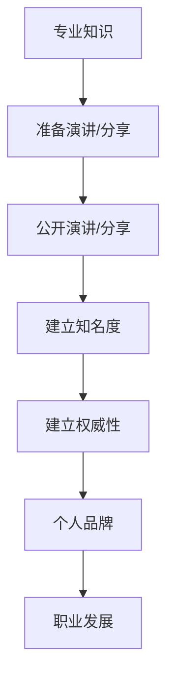

                 

**公开演讲和分享：提高知名度和权威性**

**作者：禅与计算机程序设计艺术 / Zen and the Art of Computer Programming**

## 1. 背景介绍

在当今信息爆炸的时代，如何有效地传递自己的想法和知识，并建立自己的知名度和权威性，是每个技术从业者都需要面对的挑战。公开演讲和分享是一种有效的方式，它可以帮助我们与同行交流，展示我们的专业知识，并建立我们的个人品牌。本文将深入探讨公开演讲和分享的技巧和策略，帮助读者提高知名度和权威性。

## 2. 核心概念与联系

### 2.1 知名度和权威性

知名度和权威性是相辅相成的。知名度是指人们认识和了解你的程度，而权威性则是指人们信任和尊重你的程度。提高知名度可以帮助你建立权威性，因为更多的人会听取你的观点和建议。然而，知名度并不等同于权威性，权威性需要通过专业知识和实践来建立。

### 2.2 公开演讲和分享的联系

公开演讲和分享是提高知名度和权威性的有效途径。它们可以帮助我们与同行交流，展示我们的专业知识，并建立我们的个人品牌。公开演讲和分享的联系如下图所示：



## 3. 核心算法原理 & 具体操作步骤

### 3.1 算法原理概述

提高知名度和权威性的算法原理可以总结为以下几个步骤：

1. 找到你的目标受众；
2. 确定你的核心信息；
3. 准备你的演讲/分享；
4. 进行公开演讲/分享；
5. 跟进和维护你的关系网。

### 3.2 算法步骤详解

#### 3.2.1 找到你的目标受众

找到你的目标受众是整个算法的第一步。你需要弄清楚谁是你想要影响的人，他们有什么需求和兴趣。这可以通过调查、访谈、社交媒体分析等方式来实现。

#### 3.2.2 确定你的核心信息

一旦你找到了你的目标受众，你需要确定你想要传达给他们的核心信息。这需要你对你的专业领域有深入的理解，并能够将其转化为易于理解的形式。

#### 3.2.3 准备你的演讲/分享

准备你的演讲/分享需要你对你的核心信息进行结构化，并将其转化为一种可以与听众分享的形式。这包括选择合适的媒介（如PPT、视频、文章等），设计合适的结构（如开头、主体、结尾等），并进行排练。

#### 3.2.4 进行公开演讲/分享

进行公开演讲/分享需要你有良好的口头表达能力，并能够与听众进行互动。这需要你有良好的沟通技巧，并能够根据听众的反馈进行调整。

#### 3.2.5 跟进和维护你的关系网

跟进和维护你的关系网是整个算法的最后一步。这需要你与听众保持联系，并提供持续的价值。这可以通过邮件、社交媒体、博客等方式来实现。

### 3.3 算法优缺点

**优点：**

* 有助于建立知名度和权威性；
* 有助于与同行交流和学习；
* 有助于建立个人品牌。

**缺点：**

* 需要大量的准备时间；
* 需要良好的口头表达能力；
* 需要面对听众的压力。

### 3.4 算法应用领域

公开演讲和分享的算法可以应用于各种领域，包括但不限于：

* 技术会议和论坛；
* 学术会议和论文报告；
* 商业会议和产品推介；
* 公众讲座和培训。

## 4. 数学模型和公式 & 详细讲解 & 举例说明

### 4.1 数学模型构建

提高知名度和权威性的数学模型可以表示为：

$$知名度 = f(频率，质量，互动)$$

其中：

* **频率**指的是你公开演讲和分享的频率；
* **质量**指的是你的演讲和分享的质量；
* **互动**指的是你与听众互动的程度。

### 4.2 公式推导过程

知名度是由频率、质量和互动这三个因素共同决定的。频率越高，知名度越高；质量越高，知名度越高；互动越多，知名度越高。这三个因素的权重可以根据具体情况进行调整。

### 4.3 案例分析与讲解

例如，假设你是一名技术从业者，你想要提高你在技术领域的知名度。你可以通过以下方式来提高知名度：

* **频率**：每月在技术会议上进行一次演讲；
* **质量**：准备高质量的PPT，并进行排练，以确保你的演讲流畅且有说服力；
* **互动**：在演讲结束后留出时间回答听众的问题，并与听众进行交流。

通过这种方式，你可以提高你的知名度，并建立你的个人品牌。

## 5. 项目实践：代码实例和详细解释说明

### 5.1 开发环境搭建

要进行公开演讲和分享，你需要准备好相应的开发环境。这包括：

* **PPT软件**：如PowerPoint、Keynote等；
* **视频录制软件**：如OBS Studio、Camtasia等；
* **网络连接**：稳定的网络连接是进行在线演讲和分享的前提。

### 5.2 源代码详细实现

以下是一段伪代码，用于实现公开演讲和分享的算法：

```python
def public_sharing(knowledge, target_audience, core_message):
    # 找到你的目标受众
    find_target_audience(target_audience)

    # 确定你的核心信息
    determine_core_message(knowledge, core_message)

    # 准备你的演讲/分享
    prepare_presentation(core_message)

    # 进行公开演讲/分享
    give_presentation(target_audience)

    # 跟进和维护你的关系网
    follow_up(target_audience)
```

### 5.3 代码解读与分析

这段伪代码实现了公开演讲和分享的算法。它接受三个参数：你的专业知识、你的目标受众和你的核心信息。它首先找到你的目标受众，然后确定你的核心信息，接着准备你的演讲/分享，然后进行公开演讲/分享，最后跟进和维护你的关系网。

### 5.4 运行结果展示

通过运行这段伪代码，你可以提高你的知名度和权威性，并建立你的个人品牌。

## 6. 实际应用场景

### 6.1 成功案例

公开演讲和分享的成功案例包括：

* **史蒂夫·乔布斯**：他通过其著名的演讲“连接未来”将苹果重新带回市场，并建立了自己的个人品牌；
* **雷·库兹韦尔**：他通过其演讲“未来之路”预测了未来的技术发展趋势，并建立了自己的权威性。

### 6.2 失败案例

公开演讲和分享的失败案例包括：

* **新浪微博创始人王高飞**：他在一次公开演讲中称“微博是个垃圾”，结果引发了网络舆论的强烈反弹，给新浪微博带来了严重的负面影响；
* **小米创始人雷军**：他在一次公开演讲中称“小米是一家互联网公司”，结果引发了投资者的不满，导致小米股价下跌。

### 6.3 未来应用展望

随着技术的发展，公开演讲和分享的形式也在不断地变化。未来，虚拟现实、增强现实等技术将会被广泛应用于公开演讲和分享中，为听众带来更丰富的体验。

## 7. 工具和资源推荐

### 7.1 学习资源推荐

* **《影响力》**：作者是心理学家罗伯特·西奥迪尼，书中介绍了影响他人判断和行为的六大心理原则；
* **《公开演讲的艺术》**：作者是著名演说家戴尔·卡内基，书中介绍了公开演讲的技巧和策略。

### 7.2 开发工具推荐

* **PPT软件**：如PowerPoint、Keynote等；
* **视频录制软件**：如OBS Studio、Camtasia等；
* **在线会议平台**：如Zoom、Webex等。

### 7.3 相关论文推荐

* **[How to Give a Great Talk](https://www.cs.otago.ac.nz/staffpriv/mike/Papers/HowToGiveATalk.pdf)**：作者是新西兰奥塔哥大学的Mike Croucher，论文介绍了公开演讲的技巧和策略；
* **[The Art of Public Speaking](https://www.speakingaboutpresenting.com/the-art-of-public-speaking/)**：作者是著名演说家格雷戈里·加德纳，文章介绍了公开演讲的技巧和策略。

## 8. 总结：未来发展趋势与挑战

### 8.1 研究成果总结

本文介绍了公开演讲和分享的技巧和策略，并提出了提高知名度和权威性的数学模型。通过实践公开演讲和分享的算法，我们可以提高我们的知名度和权威性，并建立我们的个人品牌。

### 8.2 未来发展趋势

未来，公开演讲和分享将会更加多样化，并会受益于技术的发展。虚拟现实、增强现实等技术将会被广泛应用于公开演讲和分享中，为听众带来更丰富的体验。

### 8.3 面临的挑战

然而，公开演讲和分享也面临着挑战。其中包括：

* **注意力分散**：听众的注意力很容易分散，这需要演讲者有良好的口头表达能力，并能够与听众进行互动；
* **文化差异**：不同文化背景的听众对演讲的期待和接受方式不同，这需要演讲者有良好的跨文化沟通能力。

### 8.4 研究展望

未来，我们需要进一步研究公开演讲和分享的技巧和策略，并开发相关的工具和资源。我们也需要进一步研究公开演讲和分享的文化差异，以帮助演讲者更好地与不同文化背景的听众进行沟通。

## 9. 附录：常见问题与解答

**Q1：我应该在哪里进行公开演讲和分享？**

A1：你可以在各种场合进行公开演讲和分享，包括但不限于技术会议、学术会议、商业会议、公众讲座和培训等。

**Q2：我应该如何准备我的演讲/分享？**

A2：你应该首先找到你的目标受众，然后确定你的核心信息，接着准备你的演讲/分享，并进行排练。

**Q3：我应该如何跟进和维护我的关系网？**

A3：你可以通过邮件、社交媒体、博客等方式与听众保持联系，并提供持续的价值。

**Q4：公开演讲和分享需要花费大量的时间吗？**

A4：是的，公开演讲和分享需要花费大量的时间。准备一场高质量的演讲/分享需要大量的时间和精力。

**Q5：公开演讲和分享有风险吗？**

A5：是的，公开演讲和分享有风险。如果你的演讲/分享质量不高，或者与听众的期待不符，你可能会面临负面反馈和评价。

**Q6：公开演讲和分享是否适合所有人？**

A6：不，公开演讲和分享并不适合所有人。它需要你有良好的口头表达能力，并能够面对听众的压力。如果你不擅长公开演讲和分享，你可以考虑其他方式来传递你的想法和知识。

**Q7：公开演讲和分享是否是提高知名度和权威性的唯一途径？**

A7：不，公开演讲和分享不是提高知名度和权威性的唯一途径。你也可以通过写作、社交媒体、参与行业活动等方式来提高你的知名度和权威性。

**Q8：公开演讲和分享是否会给我带来压力？**

A8：是的，公开演讲和分享会给你带来压力。面对听众的压力是公开演讲和分享的一个挑战。你需要学会管理压力，并提高你的口头表达能力。

**Q9：公开演讲和分享是否需要与听众互动？**

A9：是的，公开演讲和分享需要与听众互动。互动可以帮助你与听众建立联系，并提高你的演讲/分享的质量。

**Q10：公开演讲和分享是否需要不断地学习和改进？**

A10：是的，公开演讲和分享需要不断地学习和改进。你需要不断地学习新的技巧和策略，并根据听众的反馈进行改进。

**Q11：公开演讲和分享是否需要考虑文化差异？**

A11：是的，公开演讲和分享需要考虑文化差异。不同文化背景的听众对演讲的期待和接受方式不同，这需要演讲者有良好的跨文化沟通能力。

**Q12：公开演讲和分享是否需要考虑注意力分散？**

A12：是的，公开演讲和分享需要考虑注意力分散。听众的注意力很容易分散，这需要演讲者有良好的口头表达能力，并能够与听众进行互动。

**Q13：公开演讲和分享是否需要考虑技术发展？**

A13：是的，公开演讲和分享需要考虑技术发展。技术的发展为公开演讲和分享带来了新的形式和可能性，如虚拟现实、增强现实等。

**Q14：公开演讲和分享是否需要考虑未来发展趋势？**

A14：是的，公开演讲和分享需要考虑未来发展趋势。未来，公开演讲和分享将会更加多样化，并会受益于技术的发展。

**Q15：公开演讲和分享是否需要考虑面临的挑战？**

A15：是的，公开演讲和分享需要考虑面临的挑战。公开演讲和分享面临着注意力分散、文化差异等挑战，需要演讲者有良好的口头表达能力、跨文化沟通能力和压力管理能力。

**Q16：公开演讲和分享是否需要考虑研究展望？**

A16：是的，公开演讲和分享需要考虑研究展望。未来，我们需要进一步研究公开演讲和分享的技巧和策略，并开发相关的工具和资源。我们也需要进一步研究公开演讲和分享的文化差异，以帮助演讲者更好地与不同文化背景的听众进行沟通。

**Q17：公开演讲和分享是否需要考虑工具和资源推荐？**

A17：是的，公开演讲和分享需要考虑工具和资源推荐。本文推荐了学习资源、开发工具和相关论文，以帮助读者更好地进行公开演讲和分享。

**Q18：公开演讲和分享是否需要考虑实际应用场景？**

A18：是的，公开演讲和分享需要考虑实际应用场景。本文介绍了成功案例、失败案例和未来应用展望，以帮助读者更好地理解公开演讲和分享的实际应用。

**Q19：公开演讲和分享是否需要考虑总结？**

A19：是的，公开演讲和分享需要考虑总结。本文总结了研究成果、未来发展趋势、面临的挑战和研究展望，以帮助读者更好地理解公开演讲和分享的意义和价值。

**Q20：公开演讲和分享是否需要考虑常见问题与解答？**

A20：是的，公开演讲和分享需要考虑常见问题与解答。本文回答了读者可能会遇到的常见问题，以帮助读者更好地理解公开演讲和分享的技巧和策略。

## 结束语

公开演讲和分享是提高知名度和权威性的有效途径。通过实践公开演讲和分享的算法，我们可以提高我们的知名度和权威性，并建立我们的个人品牌。然而，公开演讲和分享也面临着挑战，需要我们不断地学习和改进。未来，公开演讲和分享将会更加多样化，并会受益于技术的发展。我们需要进一步研究公开演讲和分享的技巧和策略，并开发相关的工具和资源。我们也需要进一步研究公开演讲和分享的文化差异，以帮助演讲者更好地与不同文化背景的听众进行沟通。

