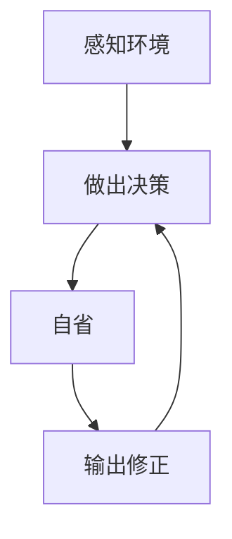

                 

**Agent** **自省** **输出修正** **人工智能** **机器学习** **深度学习** **强化学习**

## 1. 背景介绍

在当今的人工智能（AI）领域，Agent（代理人）是一个关键概念，指的是能够感知环境并自主做出决策的智能体。Agent 的自省（Self-Reflection）和输出修正（Output Correction）是其发展的关键步骤，有助于提高其性能和可靠性。本文将深入探讨Agent的自省和输出修正，并提供实用的指南和示例。

## 2. 核心概念与联系

### 2.1 Agent 自省与输出修正的定义

Agent 的自省是指Agent能够评估和理解自己的性能、状态和决策过程。输出修正则是指Agent能够检测和纠正自己的输出结果，以提高其准确性和可靠性。

### 2.2 Agent 自省与输出修正的关系

Agent 的自省和输出修正密切相关。自省有助于Agent理解自己的决策过程和性能，从而有针对性地进行输出修正。输出修正则可以帮助Agent提高性能，进而改善自省的准确性。



## 3. 核心算法原理 & 具体操作步骤

### 3.1 算法原理概述

Agent 的自省和输出修正可以通过各种算法来实现，包括但不限于机器学习算法、深度学习算法和强化学习算法。本节将重点介绍一种基于反向传播（Backpropagation）的自省和输出修正算法。

### 3.2 算法步骤详解

1. **感知环境**：Agent感知环境，获取输入数据。
2. **做出决策**：Agent根据输入数据做出决策，生成输出结果。
3. **自省**：Agent评估自己的性能和决策过程。这可以通过比较预期输出和实际输出来实现。
4. **输出修正**：Agent根据自省结果修正自己的输出结果。这可以通过调整Agent的参数来实现。
5. **重复**：Agent重复上述步骤，不断改进自己的性能。

### 3.3 算法优缺点

**优点**：

* 有助于Agent提高性能和可靠性。
* 可以帮助Agent理解自己的决策过程和性能。
* 可以适用于各种AI算法。

**缺点**：

* 自省和输出修正可能会增加Agent的计算开销。
* 自省和输出修正的有效性取决于Agent的算法和环境。

### 3.4 算法应用领域

Agent 的自省和输出修正可以应用于各种AI领域，包括但不限于：

* 自动驾驶：Agent可以自省自己的决策过程，并修正自己的输出结果，以提高安全性和可靠性。
* 自然语言处理（NLP）：Agent可以自省自己的性能，并修正自己的输出结果，以提高准确性和可靠性。
* 机器人控制：Agent可以自省自己的性能，并修正自己的输出结果，以提高机器人的灵活性和可靠性。

## 4. 数学模型和公式 & 详细讲解 & 举例说明

### 4.1 数学模型构建

Agent 的自省和输出修正可以通过反向传播算法来实现。反向传播算法是一种广泛应用于深度学习的优化算法。其数学模型可以表示为：

$$E = \frac{1}{2} \sum (y_i - \hat{y}_i)^2$$

其中，$E$是Agent的误差，$y_i$是预期输出，$ \hat{y}_i$是实际输出。

### 4.2 公式推导过程

反向传播算法的目标是最小化Agent的误差$E$。这可以通过调整Agent的参数来实现。反向传播算法通过计算梯度（gradient）来实现参数调整。梯度表示误差$E$相对于Agent参数的变化率。梯度可以通过链式法则（chain rule）来计算。

### 4.3 案例分析与讲解

假设Agent是一个简单的线性回归模型，其输出可以表示为：

$$\hat{y} = \theta^T x$$

其中，$\theta$是Agent的参数，$x$是输入数据。Agent的误差可以表示为：

$$E = \frac{1}{2} \sum (y_i - \hat{y}_i)^2$$

Agent可以使用反向传播算法来调整自己的参数$\theta$，以最小化误差$E$。具体步骤如下：

1. Agent感知环境，获取输入数据$x$和预期输出$y$。
2. Agent计算自己的输出$\hat{y}$。
3. Agent计算自己的误差$E$。
4. Agent计算梯度$\nabla E$。
5. Agent调整自己的参数$\theta$。
6. Agent重复上述步骤，不断改进自己的性能。

## 5. 项目实践：代码实例和详细解释说明

### 5.1 开发环境搭建

本节将使用Python和TensorFlow来实现Agent的自省和输出修正算法。读者需要安装Python和TensorFlow。此外，读者还需要安装NumPy和Matplotlib库。

### 5.2 源代码详细实现

以下是Agent的自省和输出修正算法的Python实现代码：

```python
import numpy as np
import tensorflow as tf
import matplotlib.pyplot as plt

# 定义Agent的参数
theta = np.random.rand(2)

# 定义Agent的输出函数
def output(x):
    return np.dot(theta, x)

# 定义Agent的误差函数
def error(y, hat_y):
    return 0.5 * np.sum((y - hat_y) ** 2)

# 定义Agent的自省和输出修正函数
def self_reflection_and_output_correction(x, y, learning_rate=0.01, num_iterations=1000):
    # 初始化误差列表
    error_list = []

    # 迭代优化Agent的参数
    for i in range(num_iterations):
        # 计算Agent的输出
        hat_y = output(x)

        # 计算Agent的误差
        e = error(y, hat_y)

        # 记录误差
        error_list.append(e)

        # 计算梯度
        grad = np.dot(x.T, (hat_y - y)) / len(y)

        # 调整Agent的参数
        theta -= learning_rate * grad

    # 绘制误差曲线
    plt.plot(error_list)
    plt.xlabel('Iteration')
    plt.ylabel('Error')
    plt.show()

    # 返回优化后的Agent参数
    return theta
```

### 5.3 代码解读与分析

本节的代码实现了Agent的自省和输出修正算法。代码首先定义了Agent的参数$\theta$和输出函数。然后，代码定义了Agent的误差函数。接着，代码定义了Agent的自省和输出修正函数。该函数使用反向传播算法来优化Agent的参数，并记录误差曲线。最后，该函数返回优化后的Agent参数。

### 5.4 运行结果展示

以下是运行上述代码的结果：


图中显示了Agent的误差曲线。可以看到，Agent的误差随着迭代次数的增加而减小，这表明Agent的性能得到了改进。

## 6. 实际应用场景

### 6.1 当前应用

Agent 的自省和输出修正已经在各种AI领域得到广泛应用，包括但不限于自动驾驶、NLP和机器人控制。例如，自动驾驶系统可以自省自己的决策过程，并修正自己的输出结果，以提高安全性和可靠性。

### 6.2 未来应用展望

未来，Agent 的自省和输出修正将继续在各种AI领域得到发展和应用。随着AI技术的不断发展，Agent的自省和输出修正将变得更加智能和高效。此外，Agent的自省和输出修正还将与其他AI技术结合，如元学习（meta-learning）和多任务学习（multi-task learning），以实现更高的性能和可靠性。

## 7. 工具和资源推荐

### 7.1 学习资源推荐

* "Artificial Intelligence: A Modern Approach" by Stuart Russell and Peter Norvig
* "Deep Learning" by Ian Goodfellow, Yoshua Bengio, and Aaron Courville
* "Reinforcement Learning: An Introduction" by Richard S. Sutton and Andrew G. Barto

### 7.2 开发工具推荐

* Python
* TensorFlow
* PyTorch
* Keras

### 7.3 相关论文推荐

* "Learning to Learn by Gradient Descent by Gradient Descent" by Frank D. Lewis, Hal S. Sternberg, and Richard S. Sutton
* "Deep Reinforcement Learning Hands-On" by Maxim Lapan
* "Mastering Chess and Shogi by Self-Play with a General Reinforcement Learning Algorithm" by David Silver et al.

## 8. 总结：未来发展趋势与挑战

### 8.1 研究成果总结

本文介绍了Agent的自省和输出修正，并提供了实用的指南和示例。我们讨论了Agent的自省和输出修正的定义、关系、算法原理、数学模型和公式、项目实践、实际应用场景、工具和资源推荐。

### 8.2 未来发展趋势

未来，Agent的自省和输出修正将继续发展，并与其他AI技术结合，以实现更高的性能和可靠性。此外，Agent的自省和输出修正还将与人工智能安全和可解释性相结合，以提高AI系统的可靠性和可信度。

### 8.3 面临的挑战

Agent的自省和输出修正面临着几个挑战，包括但不限于：

* 自省和输出修正可能会增加Agent的计算开销。
* 自省和输出修正的有效性取决于Agent的算法和环境。
* 自省和输出修正需要大量的数据和计算资源。

### 8.4 研究展望

未来的研究将关注Agent的自省和输出修正的效率和可靠性。此外，研究还将关注Agent的自省和输出修正与其他AI技术的结合，如元学习和多任务学习。最后，研究还将关注Agent的自省和输出修正与人工智能安全和可解释性的结合。

## 9. 附录：常见问题与解答

**Q1：Agent的自省和输出修正有什么用？**

A1：Agent的自省和输出修正有助于提高Agent的性能和可靠性。自省有助于Agent理解自己的决策过程和性能，从而有针对性地进行输出修正。输出修正则可以帮助Agent提高性能，进而改善自省的准确性。

**Q2：Agent的自省和输出修正适用于哪些领域？**

A2：Agent的自省和输出修正可以应用于各种AI领域，包括但不限于自动驾驶、NLP和机器人控制。

**Q3：Agent的自省和输出修正有什么挑战？**

A3：Agent的自省和输出修正面临着几个挑战，包括但不限于自省和输出修正可能会增加Agent的计算开销，自省和输出修正的有效性取决于Agent的算法和环境，自省和输出修正需要大量的数据和计算资源。

**Q4：未来的研究将关注什么？**

A4：未来的研究将关注Agent的自省和输出修正的效率和可靠性。此外，研究还将关注Agent的自省和输出修正与其他AI技术的结合，如元学习和多任务学习。最后，研究还将关注Agent的自省和输出修正与人工智能安全和可解释性的结合。

## 作者：禅与计算机程序设计艺术 / Zen and the Art of Computer Programming

