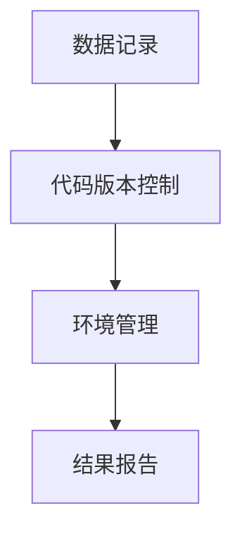

                 

**可复现性研究与实验管理原理与代码实战案例讲解**

**作者：禅与计算机程序设计艺术 / Zen and the Art of Computer Programming**

## 1. 背景介绍

在当今的科研和工程领域，可复现性（Reproducibility）已成为一项关键的科学标准。可复现性研究旨在确保研究结果和实验过程可以被其他研究人员重复，从而验证其有效性和可靠性。本文将深入探讨可复现性研究与实验管理的原理，并提供代码实战案例进行讲解。

## 2. 核心概念与联系

可复现性研究与实验管理的核心概念包括数据记录、代码版本控制、环境管理和结果报告。这些概念通过以下 Mermaid 流程图进行了总结：



### 2.1 数据记录

数据记录是可复现性的基础，它要求记录所有实验输入数据、中间结果和最终输出。这有助于其他研究人员重现实验并验证结果。

### 2.2 代码版本控制

代码版本控制是保持实验可复现性的关键。它跟踪代码的更改历史，并允许研究人员轻松地回到特定版本。Git 是一种流行的分布式版本控制系统，广泛用于科学计算和可复现性研究。

### 2.3 环境管理

环境管理确保实验在相同的软硬件环境下重复。Docker 是一种流行的容器化平台，它允许研究人员创建和共享包含所有依赖项的自给自足的环境。

### 2.4 结果报告

结果报告是可复现性的关键组成部分，它要求提供足够的细节，以便其他研究人员能够重现实验并评估结果。这通常包括实验设置、数据集、代码版本和任何相关的统计分析。

## 3. 核心算法原理 & 具体操作步骤

### 3.1 算法原理概述

可复现性研究的核心算法原理是数据记录、代码版本控制、环境管理和结果报告的组合。这些步骤确保实验结果可以被其他研究人员重复，从而验证其有效性和可靠性。

### 3.2 算法步骤详解

1. **数据记录**：记录所有实验输入数据、中间结果和最终输出。使用数据库或版本控制系统（如 Git LFS）来存储和管理数据。
2. **代码版本控制**：使用版本控制系统（如 Git）跟踪代码的更改历史。为每个实验创建一个新的分支，并记录分支名称和版本号。
3. **环境管理**：使用容器化平台（如 Docker）创建和共享包含所有依赖项的自给自足的环境。记录 Docker 映像的标签和版本号。
4. **结果报告**：提供足够的细节，以便其他研究人员能够重现实验并评估结果。这通常包括实验设置、数据集、代码版本和任何相关的统计分析。

### 3.3 算法优缺点

**优点**：

* 提高研究的可信度和可靠性
* 促进合作和协作
* 简化重现实验的过程

**缺点**：

* 需要额外的时间和资源来记录和管理实验
* 可能会限制研究人员的灵活性和创新

### 3.4 算法应用领域

可复现性研究的算法原理适用于各种领域，包括但不限于：

* 计算机科学（如机器学习、数据挖掘和人工智能）
* 生物信息学（如基因组学和蛋白质结构预测）
* 物理科学（如模拟和仿真）
* 社会科学（如统计分析和模型建立）

## 4. 数学模型和公式 & 详细讲解 & 举例说明

### 4.1 数学模型构建

可复现性研究的数学模型旨在描述实验过程和结果。它通常包括输入数据、中间结果和最终输出。数学模型的构建需要考虑实验的目标、约束和假设。

**示例**：假设我们正在研究一种新的机器学习算法。数学模型可以描述如下：

$$y = f(x; \theta)$$

其中，$x$ 是输入数据，$y$ 是输出结果，$\theta$ 是算法的参数。

### 4.2 公式推导过程

数学模型的公式推导过程取决于具体的实验和领域。通常，它需要对实验过程进行数学建模，并使用数学工具（如微积分、线性代数和概率统计）进行推导。

**示例**：在机器学习算法的情况下，公式推导过程可能涉及到优化算法的参数$\theta$，以最小化损失函数$L(y, f(x; \theta))$：

$$\theta^* = \arg\min_{\theta} L(y, f(x; \theta))$$

### 4.3 案例分析与讲解

**示例**：假设我们正在研究一种新的分类算法，并使用 Iris 数据集进行实验。数学模型可以描述为：

$$y = \text{softmax}(Wx + b)$$

其中，$x$ 是输入数据，$y$ 是输出结果，$W$ 和$b$ 是算法的参数。公式推导过程涉及到使用梯度下降算法优化参数$W$ 和$b$，以最小化交叉熵损失函数：

$$L(y, \text{softmax}(Wx + b)) = -\sum_{c=1}^{C} y_c \log(\text{softmax}_c(Wx + b))$$

## 5. 项目实践：代码实例和详细解释说明

### 5.1 开发环境搭建

为确保可复现性，我们需要创建一个可重复的开发环境。我们将使用 Python 和 Jupyter Notebook 进行实验，并使用 Docker 进行环境管理。

1. 安装 Docker：https://docs.docker.com/get-docker/
2. 创建一个新的 Jupyter Notebook 环境：
```bash
docker run -it --rm -p 8888:8888 jupyter/tensorflow-notebook
```

### 5.2 源代码详细实现

我们将实现一个简单的线性回归算法，并记录所有实验输入数据、中间结果和最终输出。我们将使用 Git 进行代码版本控制。

1. 创建一个新的 Git 仓库：
```bash
mkdir linear-regression
cd linear-regression
git init
```

2. 创建一个新的 Jupyter Notebook 文件（`linear_regression.ipynb`），并实现线性回归算法：
```python
import numpy as np
import matplotlib.pyplot as plt
import pandas as pd
from sklearn.model_selection import train_test_split
from sklearn.linear_model import LinearRegression
from sklearn.metrics import mean_squared_error

# Load data
data = pd.read_csv('housing.csv')
X = data.drop('median_house_value', axis=1)
y = data['median_house_value']

# Preprocess data
X = pd.get_dummies(X)
X_train, X_test, y_train, y_test = train_test_split(X, y, test_size=0.2, random_state=42)

# Train model
model = LinearRegression()
model.fit(X_train, y_train)

# Evaluate model
y_pred = model.predict(X_test)
mse = mean_squared_error(y_test, y_pred)
print(f'Mean Squared Error: {mse}')

# Plot results
plt.scatter(y_test, y_pred)
plt.xlabel('True Values')
plt.ylabel('Predictions')
plt.show()
```

### 5.3 代码解读与分析

我们使用 sklearn 库实现了一个简单的线性回归算法。我们首先加载数据集，然后进行预处理（使用 one-hot 编码处理分类变量）。我们使用 train_test_split 函数将数据集分成训练集和测试集。然后，我们使用 LinearRegression 类训练模型，并使用 mean_squared_error 函数评估模型的性能。最后，我们绘制真实值和预测值的关系图。

### 5.4 运行结果展示

运行代码后，我们可以在 Jupyter Notebook 中查看 Mean Squared Error 和关系图。这些结果可以记录在实验报告中，以便其他研究人员重现实验。

## 6. 实际应用场景

可复现性研究的实际应用场景包括：

* 机器学习和人工智能：确保模型的可靠性和可信度
* 生物信息学：重现实验结果并验证发现
* 物理科学：模拟和仿真结果的可靠性
* 社会科学：统计分析和模型建立的可复现性

### 6.1 未来应用展望

未来，可复现性研究将继续在各个领域扮演关键角色。随着大数据和人工智能的兴起，可复现性将成为确保研究结果可靠性和可信度的关键因素。此外，可复现性研究还将促进跨学科合作和协作，从而推动科学进步。

## 7. 工具和资源推荐

### 7.1 学习资源推荐

* Reproducibility: The Key to the Success of Science - https://www.nature.com/articles/d41586-019-00036-6
* Reproducibility in Machine Learning - https://arxiv.org/abs/1906.00650
* The Turing Way: A handbook for reproducible data science - https://the-turing-way.netlify.app/

### 7.2 开发工具推荐

* Git - https://git-scm.com/
* Docker - https://www.docker.com/
* Jupyter Notebook - https://jupyter.org/
* R Markdown - https://rmarkdown.rstudio.com/

### 7.3 相关论文推荐

* "Reproducibility in Computational Science and Engineering" - https://arxiv.org/abs/1803.07547
* "Reproducibility in Machine Learning: A Survey" - https://arxiv.org/abs/1906.00650
* "The Turing Way: A handbook for reproducible data science" - https://the-turing-way.netlify.app/

## 8. 总结：未来发展趋势与挑战

### 8.1 研究成果总结

本文介绍了可复现性研究与实验管理的原理，并提供了代码实战案例进行讲解。我们讨论了核心概念、算法原理、数学模型和公式、项目实践，以及实际应用场景。我们还推荐了学习资源、开发工具和相关论文。

### 8.2 未来发展趋势

未来，可复现性研究将继续在各个领域扮演关键角色。随着大数据和人工智能的兴起，可复现性将成为确保研究结果可靠性和可信度的关键因素。此外，可复现性研究还将促进跨学科合作和协作，从而推动科学进步。

### 8.3 面临的挑战

可复现性研究面临的挑战包括：

* 需要额外的时间和资源来记录和管理实验
* 可能会限制研究人员的灵活性和创新
* 缺乏统一的标准和最佳实践

### 8.4 研究展望

未来的研究将关注开发新的工具和框架，以简化可复现性研究的过程。此外，还将开发新的标准和最佳实践，以指导研究人员进行可复现性研究。最后，研究人员将继续探索可复现性研究在各个领域的应用，从而推动科学进步。

## 9. 附录：常见问题与解答

**Q：可复现性研究需要记录哪些信息？**

A：可复现性研究需要记录所有实验输入数据、中间结果和最终输出。这有助于其他研究人员重现实验并验证结果。

**Q：如何管理实验环境？**

A：使用容器化平台（如 Docker）创建和共享包含所有依赖项的自给自足的环境。记录 Docker 映像的标签和版本号。

**Q：如何报告实验结果？**

A：提供足够的细节，以便其他研究人员能够重现实验并评估结果。这通常包括实验设置、数据集、代码版本和任何相关的统计分析。

**Q：可复现性研究的优缺点是什么？**

A：可复现性研究的优点包括提高研究的可信度和可靠性，促进合作和协作，简化重现实验的过程。缺点包括需要额外的时间和资源来记录和管理实验，可能会限制研究人员的灵活性和创新。

**Q：可复现性研究适用于哪些领域？**

A：可复现性研究适用于各种领域，包括但不限于计算机科学、生物信息学、物理科学和社会科学。

**Q：未来可复现性研究的发展趋势是什么？**

A：未来，可复现性研究将继续在各个领域扮演关键角色。随着大数据和人工智能的兴起，可复现性将成为确保研究结果可靠性和可信度的关键因素。此外，可复现性研究还将促进跨学科合作和协作，从而推动科学进步。

**Q：可复现性研究面临的挑战是什么？**

A：可复现性研究面临的挑战包括需要额外的时间和资源来记录和管理实验，可能会限制研究人员的灵活性和创新，缺乏统一的标准和最佳实践。

**Q：未来可复现性研究的研究展望是什么？**

A：未来的研究将关注开发新的工具和框架，以简化可复现性研究的过程。此外，还将开发新的标准和最佳实践，以指导研究人员进行可复现性研究。最后，研究人员将继续探索可复现性研究在各个领域的应用，从而推动科学进步。

## 作者署名

作者：禅与计算机程序设计艺术 / Zen and the Art of Computer Programming

