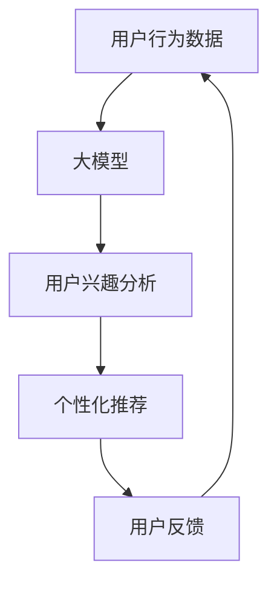

                 

## 1. 背景介绍

在当今数字化时代，推荐系统已成为各大互联网平台的核心组成部分，为用户提供个性化的内容和产品推荐。然而，推荐系统的有效性和用户生命周期管理密切相关。本文将探讨如何利用大模型来管理推荐系统用户生命周期，以提高用户参与度、忠诚度和满意度。

## 2. 核心概念与联系

### 2.1 用户生命周期

用户生命周期（User Lifecycle）是指用户从接触产品或服务到离开的整个过程。它通常分为五个阶段：获取（Acquisition）、激活（Activation）、保留（Retention）、重新激活（Re-engagement）和转化（Monetization）。

### 2.2 大模型

大模型（Large Language Models）是一种通过处理大量文本数据训练而成的模型，能够理解和生成人类语言。它们在推荐系统中具有广泛的应用，如内容推荐、个性化搜索和对话式人工智能。

### 2.3 大模型在推荐系统中的应用

大模型可以帮助推荐系统更好地理解用户意图，个性化推荐内容，并与用户进行互动。它们可以分析用户的搜索历史、点击行为和反馈，从而提供更相关、更有吸引力的推荐。



## 3. 核心算法原理 & 具体操作步骤

### 3.1 算法原理概述

我们将介绍一种基于大模型的用户生命周期管理算法，该算法利用大模型分析用户行为数据，预测用户生命周期阶段，并提供个性化推荐。

### 3.2 算法步骤详解

1. **数据收集**：收集用户行为数据，如搜索历史、点击行为、评分和反馈等。
2. **数据预处理**：清洗和格式化数据，并将其转换为大模型可以处理的格式。
3. **大模型训练**：使用预处理后的数据训练大模型，使其能够理解用户意图和兴趣。
4. **生命周期预测**：使用大模型预测用户当前所处的生命周期阶段。
5. **个性化推荐**：根据预测的生命周期阶段，提供个性化的内容推荐。
6. **反馈分析**：分析用户对推荐的反馈，并更新大模型以改进未来的推荐。

### 3.3 算法优缺点

**优点**：

* 个性化推荐：大模型可以提供更相关、更有吸引力的推荐。
* 用户生命周期管理：算法可以帮助平台更好地理解和管理用户生命周期。
* 适应性强：大模型可以学习和适应用户兴趣的变化。

**缺点**：

* 数据依赖：大模型的性能取决于训练数据的质量和数量。
* 计算资源：大模型通常需要大量计算资源进行训练和推理。
* 解释性：大模型的决策过程可能难以解释，这可能会导致推荐的透明度降低。

### 3.4 算法应用领域

该算法可以应用于各种推荐系统，如电子商务平台、视频流媒体平台、新闻聚合平台和社交媒体平台。它可以帮助这些平台更好地理解用户需求，提供个性化的内容推荐，并管理用户生命周期。

## 4. 数学模型和公式 & 详细讲解 & 举例说明

### 4.1 数学模型构建

我们将使用序列到序列（Seq2Seq）模型作为大模型的基础架构。Seq2Seq模型由编码器和解码器组成，编码器将输入序列转换为上下文向量，解码器则根据上下文向量生成输出序列。

### 4.2 公式推导过程

给定用户行为数据序列 $X = (x_1, x_2,..., x_T)$，我们的目标是预测用户生命周期阶段 $Y = (y_1, y_2,..., y_T)$。编码器将输入序列 $X$ 映射到上下文向量 $C$：

$$C = Encoder(X)$$

解码器则根据上下文向量 $C$ 生成输出序列 $Y$：

$$Y = Decoder(C)$$

其中，$Encoder$ 和 $Decoder$ 是神经网络模型，可以使用循环神经网络（RNN）或转换器（Transformer）架构实现。

### 4.3 案例分析与讲解

假设我们要为视频流媒体平台构建推荐系统。用户行为数据序列 $X$ 包括用户观看的视频标题、搜索关键词和点击历史。我们的目标是预测用户生命周期阶段 $Y$：

* 获取（Acquisition）：用户第一次注册或安装应用程序。
* 激活（Activation）：用户第一次登录或使用应用程序。
* 保留（Retention）：用户定期登录和使用应用程序。
* 重新激活（Re-engagement）：用户长时间未登录或使用应用程序后重新登录。
* 转化（Monetization）：用户购买会员资格或付费内容。

大模型可以分析用户行为数据序列 $X$ 并预测用户生命周期阶段 $Y$。例如，如果用户最近搜索了与体育相关的关键词并观看了体育节目，大模型可能会预测用户处于保留阶段，并提供相关的体育节目推荐。

## 5. 项目实践：代码实例和详细解释说明

### 5.1 开发环境搭建

我们将使用Python和PyTorch框架来实现大模型。我们需要安装以下库：

* Transformers：Hugging Face的转换器库，提供预训练的大模型。
* Pandas：数据处理库。
* NumPy：数值计算库。
* Matplotlib：数据可视化库。

### 5.2 源代码详细实现

以下是大模型训练和推理的高级代码示例：

```python
import torch
from transformers import AutoTokenizer, AutoModelForSeq2SeqLM

# 加载预训练模型和分词器
model_name = "t5-base"
tokenizer = AutoTokenizer.from_pretrained(model_name)
model = AutoModelForSeq2SeqLM.from_pretrained(model_name)

# 准备数据
inputs = tokenizer("用户行为数据序列", return_tensors="pt")
labels = tokenizer("用户生命周期阶段", return_tensors="pt")

# 训练模型
optimizer = torch.optim.AdamW(model.parameters(), lr=1e-4)
for epoch in range(10):
    outputs = model(**inputs, labels=labels["input_ids"])
    loss = outputs.loss
    loss.backward()
    optimizer.step()
    optimizer.zero_grad()

# 推理
inputs = tokenizer("新的用户行为数据序列", return_tensors="pt")
outputs = model.generate(inputs["input_ids"], max_length=50)
predicted_lifecycle = tokenizer.decode(outputs[0])
```

### 5.3 代码解读与分析

我们首先加载预训练的大模型和分词器。然后，我们准备训练数据，其中输入是用户行为数据序列，标签是用户生命周期阶段。我们使用AdamW优化器训练模型，并进行10个epoch的训练。

在推理阶段，我们使用新的用户行为数据序列生成输出，并解码输出以获取预测的用户生命周期阶段。

### 5.4 运行结果展示

在训练和推理过程中，我们可以监控模型的损失和准确性，并可视化训练过程。在推理阶段，我们可以比较预测的用户生命周期阶段和实际阶段，并评估模型的性能。

## 6. 实际应用场景

### 6.1 用户获取

在获取阶段，我们可以使用大模型分析用户搜索关键词和点击行为，并提供相关的内容推荐。例如，如果用户搜索了与体育相关的关键词，我们可以推荐相关的体育节目。

### 6.2 用户激活

在激活阶段，我们可以使用大模型分析用户的点击和互动行为，并提供个性化的内容推荐。例如，如果用户观看了体育节目并点击了相关推荐，我们可以推荐更多相关的体育节目。

### 6.3 用户保留

在保留阶段，我们可以使用大模型分析用户的长期行为模式，并提供个性化的内容推荐。例如，如果用户定期观看体育节目，我们可以推荐相关的体育节目和其他相关内容。

### 6.4 未来应用展望

未来，大模型可以进一步发展，以更好地理解用户意图和兴趣。它们可以分析更复杂的用户行为数据，如社交媒体互动和语音助手交互。此外，大模型可以与其他人工智能技术结合，如强化学习和深度学习，以提供更智能、更个性化的推荐。

## 7. 工具和资源推荐

### 7.1 学习资源推荐

* "Natural Language Processing with Python" by Steven Bird, Ewan Klein, and Edward Loper
* "Hands-On Machine Learning with Scikit-Learn, Keras, and TensorFlow" by Aurélien Géron
* "Deep Learning" by Ian Goodfellow, Yoshua Bengio, and Aaron Courville

### 7.2 开发工具推荐

* Jupyter Notebook：交互式数据分析和可视化工具。
* Google Colab：免费的云端Jupyter Notebook环境。
* PyCharm：Python集成开发环境。

### 7.3 相关论文推荐

* "BERT: Pre-training of Deep Bidirectional Transformers for Language Understanding" by Jacob Devlin, Ming-Wei Chang, and Kenton Lee
* "T5: Text-to-Text Transfer Transformer" by Colin Raffel, Noam Shazeer, Adam Roberts, Katherine Lee, Sharan Vaswani, Nitish Shirish Keskar, and Peter L. Liu
* "User Lifecycle Management in Mobile Applications: A Systematic Literature Review" by Maria José Sousa, Ana Fred, and Paulo Novais

## 8. 总结：未来发展趋势与挑战

### 8.1 研究成果总结

本文介绍了如何利用大模型管理推荐系统用户生命周期。我们提出了一种基于大模型的算法，该算法可以分析用户行为数据，预测用户生命周期阶段，并提供个性化的内容推荐。我们还提供了代码示例和实际应用场景。

### 8.2 未来发展趋势

未来，大模型将继续发展，以更好地理解用户意图和兴趣。它们可以分析更复杂的用户行为数据，并与其他人工智能技术结合，以提供更智能、更个性化的推荐。此外，大模型可以应用于各种推荐系统，如电子商务平台、视频流媒体平台和社交媒体平台。

### 8.3 面临的挑战

然而，大模型面临着数据依赖、计算资源需求和解释性等挑战。平台需要收集大量高质量的用户行为数据，并投入大量计算资源来训练和推理大模型。此外，大模型的决策过程可能难以解释，这可能会导致推荐的透明度降低。

### 8.4 研究展望

未来的研究可以探索大模型在推荐系统中的其他应用，如个性化搜索和对话式人工智能。此外，研究人员可以开发新的大模型架构和训练方法，以提高大模型的性能和解释性。最后，研究人员可以开发新的评估指标和方法，以更好地评估大模型在推荐系统中的性能。

## 9. 附录：常见问题与解答

**Q1：大模型需要多少计算资源？**

A1：大模型通常需要大量计算资源进行训练和推理。例如，训练一个T5模型需要数千个GPU小时。平台需要投入大量计算资源来训练和推理大模型。

**Q2：大模型的决策过程是否可以解释？**

A2：大模型的决策过程可能难以解释，因为它们是通过处理大量数据训练而成的。然而，研究人员正在开发新的方法来解释大模型的决策过程，如注意力机制可视化和层次结构分析。

**Q3：大模型是否可以应用于其他推荐系统？**

A3：是的，大模型可以应用于各种推荐系统，如电子商务平台、视频流媒体平台和社交媒体平台。它们可以分析用户行为数据，预测用户生命周期阶段，并提供个性化的内容推荐。

## 作者：禅与计算机程序设计艺术 / Zen and the Art of Computer Programming

