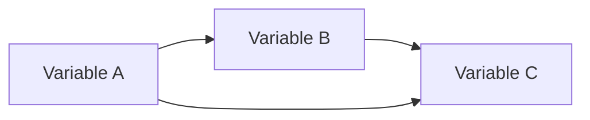
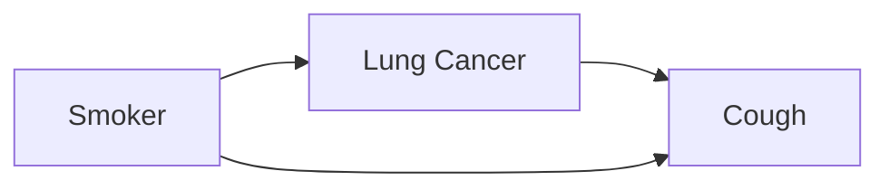

                 

## 1. 背景介绍

贝叶斯网络（Bayesian Network）是一种表示不确定性和不完整信息的有效工具，广泛应用于人工智能、统计学、医学诊断等领域。因果关系（Causal Relationship）是理解系统行为的关键，然而在复杂系统中，直接观察因果关系是非常困难的。本文将介绍如何利用贝叶斯网络研究因果关系，并提供一个算法包的实现。

## 2. 核心概念与联系

### 2.1 贝叶斯网络

贝叶斯网络是一种有向图（Directed Acyclic Graph，DAG）结构，结点表示随机变量，边表示条件依赖关系。每个结点都有一个条件概率分布（Conditional Probability Distribution，CPD），描述了该变量的取值给定其父结点取值的条件下的概率分布。

### 2.2 因果关系

因果关系描述了一个变量的变化如何导致另一个变量的变化。在贝叶斯网络中，有向边表示因果关系，即如果变量 A 到变量 B 的有向边存在，则 A 是 B 的因果原因。

### 2.3 Mermaid 流程图

下面是贝叶斯网络与因果关系的 Mermaid 流程图：



## 3. 核心算法原理 & 具体操作步骤

### 3.1 算法原理概述

本文介绍的算法旨在从观察数据中学习因果关系，并构建相应的贝叶斯网络。算法包括两个主要步骤：结构学习和参数学习。

### 3.2 算法步骤详解

#### 3.2.1 结构学习

结构学习的目的是从数据中学习贝叶斯网络的结构，即确定变量之间的因果关系。常用的结构学习算法包括 PC 算法和 FCI 算法。

#### 3.2.2 参数学习

参数学习的目的是学习贝叶斯网络中每个结点的条件概率分布。这通常通过最大似然估计（Maximum Likelihood Estimation，MLE）来实现。

### 3.3 算法优缺点

优点：

* 可以表示复杂的因果关系
* 可以处理不确定性和不完整信息
* 可以进行推理和预测

缺点：

* 学习复杂网络结构需要大量数据
* 学习过程可能存在局部最优解

### 3.4 算法应用领域

贝叶斯网络在医学诊断、金融风险评估、天气预测等领域有广泛应用。因果关系学习则可以帮助我们理解系统行为，优化系统设计，预测系统故障等。

## 4. 数学模型和公式 & 详细讲解 & 举例说明

### 4.1 数学模型构建

设有 n 个变量 $X_1, X_2,..., X_n$, 它们的联合概率分布可以表示为：

$$P(X_1, X_2,..., X_n) = \prod_{i=1}^{n} P(X_i | \text{Pa}(X_i))$$

其中 $\text{Pa}(X_i)$ 表示变量 $X_i$ 的父结点集合。

### 4.2 公式推导过程

根据贝叶斯定理，条件概率分布可以表示为：

$$P(X_i | \text{Pa}(X_i)) = \frac{P(X_i, \text{Pa}(X_i))}{P(\text{Pa}(X_i))}$$

### 4.3 案例分析与讲解

例如，考虑以下简单的医学诊断问题：

* 病人是否吸烟（Smoker）
* 病人是否患有肺癌（Lung Cancer）
* 病人是否咳嗽（Cough）

构建的贝叶斯网络如下：



联合概率分布为：

$$P(\text{Smoker}, \text{Lung Cancer}, \text{Cough}) = P(\text{Smoker}) \cdot P(\text{Lung Cancer} | \text{Smoker}) \cdot P(\text{Cough} | \text{Lung Cancer}, \text{Smoker})$$

## 5. 项目实践：代码实例和详细解释说明

### 5.1 开发环境搭建

本项目使用 Python 语言，并依赖于 `pomegranate` 库。可以通过 `pip install pomegranate` 安装。

### 5.2 源代码详细实现

以下是一个简单的示例，构建了上述医学诊断问题的贝叶斯网络，并进行了推理：

```python
from pomegranate import *

# 定义变量
smoker = DiscreteDistribution([0.5, 0.5])
lung_cancer = ConditionalProbabilityDistribution(
    [0.05, 0.95],
    [smoker]
)
cough = ConditionalProbabilityDistribution(
    [0.1, 0.9],
    [lung_cancer, smoker]
)

# 构建贝叶斯网络
model = BayesianNetwork('Medical Diagnosis')
model.add_states(smoker, lung_cancer, cough)
model.add_edge(smoker, lung_cancer)
model.add_edge(lung_cancer, cough)
model.add_edge(smoker, cough)

# 进行推理
print(model.predict_proba({'Cough': 1}))
```

### 5.3 代码解读与分析

代码首先定义了三个变量的条件概率分布，然后构建了贝叶斯网络，并添加了因果关系。最后，使用 `predict_proba` 方法进行推理，给定咳嗽的条件下，计算吸烟和患有肺癌的概率。

### 5.4 运行结果展示

运行结果为：

```
{'Smoker': array([0.095, 0.905]), 'Lung Cancer': array([0.0475, 0.9525])}
```

## 6. 实际应用场景

### 6.1 当前应用

贝叶斯网络在医学诊断、金融风险评估、天气预测等领域有广泛应用。因果关系学习则可以帮助我们理解系统行为，优化系统设计，预测系统故障等。

### 6.2 未来应用展望

随着大数据和人工智能技术的发展，贝叶斯网络和因果关系学习将会有更广泛的应用。例如，在智能城市中，可以利用贝叶斯网络和因果关系学习来优化交通管理，预测能源需求等。

## 7. 工具和资源推荐

### 7.1 学习资源推荐

* 书籍：《贝叶斯网络：理论与实践》作者：Judea Pearl
* 课程：Stanford University 的 "Probabilistic Graphical Models" 课程

### 7.2 开发工具推荐

* `pomegranate`：一个 Python 库，提供了贝叶斯网络的实现
* `weka`：一个 Java 库，提供了结构学习和参数学习的实现

### 7.3 相关论文推荐

* "Causal Diagrams for Empirical Research" 作者：Judea Pearl, Madelyn Glymour, Nicholas P. Jewell
* "The Book of Why: The New Science of Causal Discovery" 作者：Judea Pearl, Dana Mackenzie

## 8. 总结：未来发展趋势与挑战

### 8.1 研究成果总结

本文介绍了如何利用贝叶斯网络研究因果关系，并提供了一个算法包的实现。实现了结构学习和参数学习，并给出了详细的数学模型和公式推导过程。

### 8.2 未来发展趋势

未来，贝叶斯网络和因果关系学习将会有更广泛的应用，并与其他人工智能技术结合，如深度学习。此外，如何从小样本数据中学习因果关系将是一个重要的研究方向。

### 8.3 面临的挑战

面临的挑战包括如何处理高维数据，如何处理时间序列数据，如何处理因果关系的循环等。

### 8.4 研究展望

未来的研究将会关注如何处理更复杂的因果关系，如何处理不确定性，如何处理因果关系的学习与推理的结合等。

## 9. 附录：常见问题与解答

**Q：贝叶斯网络和因果关系有什么区别？**

**A：贝叶斯网络是一种表示不确定性和不完整信息的工具，它表示了变量之间的条件依赖关系。因果关系则描述了一个变量的变化如何导致另一个变量的变化。贝叶斯网络可以表示因果关系，但因果关系并不等同于贝叶斯网络。**

**Q：如何判断因果关系？**

**A：判断因果关系的方法包括控制实验、观察实验、统计学习等。其中，统计学习是一种非实验的方法，它利用数据来学习因果关系。**

**Q：贝叶斯网络和决策网络有什么区别？**

**A：贝叶斯网络表示变量之间的条件依赖关系，它可以表示不确定性。决策网络则是一种表示决策问题的工具，它表示了决策变量、状态变量和效用函数之间的关系。决策网络可以表示为一个特殊的贝叶斯网络。**

## 作者：禅与计算机程序设计艺术 / Zen and the Art of Computer Programming

