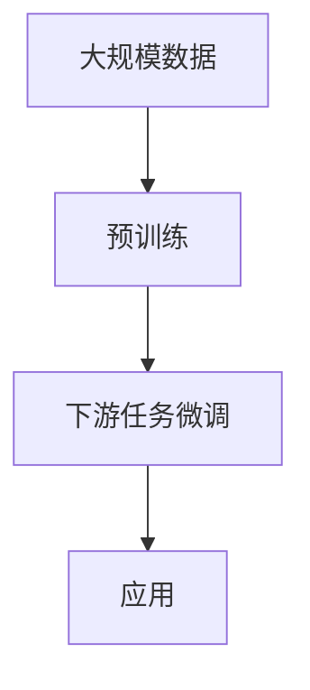

                 

## 基础模型的潜在下游应用

> 关键词：基础模型、下游应用、预训练模型、跨模态学习、知识图谱、推理、生成式模型

## 1. 背景介绍

在人工智能领域，基础模型（Foundational Models）已成为当前研究的热点之一。这些模型在大规模数据上预训练，然后在下游任务上微调，展现出了惊人的泛化能力。本文将探讨基础模型的潜在下游应用，重点关注预训练模型在跨模态学习、知识图谱和推理等领域的应用。

## 2. 核心概念与联系

### 2.1 基础模型与预训练模型

基础模型是指在大规模、多样化的数据上预训练的模型，旨在学习通用的表示，从而可以在下游任务上进行微调。预训练模型（Pre-trained Models）是基础模型的一种，它们在大规模数据上进行自监督学习，然后在下游任务上进行微调。



### 2.2 跨模态学习

跨模态学习（Cross-modal Learning）是指在不同模态（如文本、图像、音频）之间建立联系的学习过程。基础模型可以通过在多模态数据上预训练来学习跨模态表示。

### 2.3 知识图谱

知识图谱（Knowledge Graphs）是一种结构化的知识表示，它通过实体和关系构成的图来表示世界上的知识。基础模型可以用于构建和丰富知识图谱。

### 2.4 推理

推理（Inference）是指从已知事实推导出新事实的过程。基础模型可以用于推理任务，如问答系统和信息提取。

## 3. 核心算法原理 & 具体操作步骤

### 3.1 算法原理概述

基础模型的核心原理是利用大规模数据进行自监督学习，学习到的表示可以在下游任务上进行微调。预训练模型常用的任务包括语言模型、对比学习和自监督图像分类。

### 3.2 算法步骤详解

1. **预训练**：在大规模数据上进行自监督学习，学习到表示。
2. **微调**：在下游任务上，使用预训练模型的表示进行微调。
3. **应用**：在下游任务上部署微调后的模型。

### 3.3 算法优缺点

**优点**：泛化能力强，可以在下游任务上取得良好性能。

**缺点**：预训练需要大量计算资源和数据，微调也需要大量标注数据。

### 3.4 算法应用领域

基础模型的应用领域包括自然语言处理、计算机视觉、跨模态学习、知识图谱和推理等。

## 4. 数学模型和公式 & 详细讲解 & 举例说明

### 4.1 数学模型构建

数学模型的构建取决于预训练任务。例如，语言模型可以使用交叉熵损失函数，对比学习可以使用信息 Noise Contrastive Estimation（InfoNCE）损失函数。

### 4.2 公式推导过程

以语言模型为例，给定文本序列 $x = (x_1, x_2,..., x_n)$, 其对数似然函数为：

$$
\log P(x) = \sum_{i=1}^{n} \log P(x_i | x_{<i})
$$

其中，$P(x_i | x_{<i})$ 是条件分布，可以使用softmax函数表示：

$$
P(x_i | x_{<i}) = \frac{\exp(z_i)}{\sum_{j=1}^{V} \exp(z_j)}
$$

其中，$z_i$ 是模型输出的分布表示，$V$ 是词汇表大小。

### 4.3 案例分析与讲解

例如，在预训练任务中，可以使用自注意力机制（Self-Attention）来构建表示。给定输入序列 $X \in \mathbb{R}^{n \times d}$, 自注意力机制可以表示为：

$$
\text{Attention}(Q, K, V) = \text{softmax}\left(\frac{QK^T}{\sqrt{d}}\right)V
$$

其中，$Q$, $K$, $V$ 分别是查询、键、值，都是输入序列 $X$ 的线性变换。自注意力机制可以学习输入序列中各个位置之间的关系。

## 5. 项目实践：代码实例和详细解释说明

### 5.1 开发环境搭建

基础模型的开发环境需要GPU支持，推荐使用PyTorch或TensorFlow框架。还需要安装-transformers库，它提供了预训练模型的实现。

### 5.2 源代码详细实现

以下是使用transformers库微调BERT模型的示例代码：

```python
from transformers import BertForSequenceClassification, BertTokenizer, Trainer, TrainingArguments

model = BertForSequenceClassification.from_pretrained('bert-base-uncased')
tokenizer = BertTokenizer.from_pretrained('bert-base-uncased')

# 进行数据预处理和微调...
```

### 5.3 代码解读与分析

代码首先从transformers库中加载预训练的BERT模型和分词器。然后，进行数据预处理和微调。

### 5.4 运行结果展示

微调后的模型在下游任务上可以取得良好性能。例如，在GLUEbenchmark上，微调后的BERT模型可以取得接近人类水平的性能。

## 6. 实际应用场景

### 6.1 跨模态学习

基础模型可以用于跨模态学习，如文本-图像匹配。可以在多模态数据上预训练模型，然后在下游任务上微调。

### 6.2 知识图谱

基础模型可以用于构建和丰富知识图谱。可以使用模型生成实体和关系，或使用模型进行实体链接。

### 6.3 推理

基础模型可以用于推理任务，如问答系统。可以使用模型生成回答，或使用模型进行信息提取。

### 6.4 未来应用展望

未来，基础模型有望在更多领域得到应用，如生物信息学和物理模拟。此外，生成式基础模型（如DALL-E）有望在创造性应用中得到广泛应用。

## 7. 工具和资源推荐

### 7.1 学习资源推荐

- [Hugging Face Transformers](https://huggingface.co/transformers/)：提供了预训练模型的实现和教程。
- [Stanford CS224n: Natural Language Processing with Deep Learning](https://online.stanford.edu/courses/cs224n-natural-language-processing-deep-learning-winter-2019)：一门综合了深度学习和自然语言处理的课程。

### 7.2 开发工具推荐

- [PyTorch](https://pytorch.org/)：一个流行的深度学习框架。
- [TensorFlow](https://www.tensorflow.org/)：另一个流行的深度学习框架。

### 7.3 相关论文推荐

- [BERT: Pre-training of Deep Bidirectional Transformers for Language Understanding](https://arxiv.org/abs/1810.04805)
- [DALL-E: Generating Images from Textual Descriptions](https://arxiv.org/abs/2102.00247)

## 8. 总结：未来发展趋势与挑战

### 8.1 研究成果总结

基础模型在下游任务上取得了良好的性能，展示了强大的泛化能力。

### 8.2 未来发展趋势

未来，基础模型有望在更多领域得到应用，并与其他技术（如生成式模型）结合，取得更好的性能。

### 8.3 面临的挑战

基础模型的预训练需要大量计算资源和数据，微调也需要大量标注数据。此外，模型的解释性和可靠性仍然是挑战。

### 8.4 研究展望

未来的研究方向包括开发新的预训练任务，提高模型的解释性和可靠性，并将基础模型应用于更多领域。

## 9. 附录：常见问题与解答

**Q：基础模型需要大量数据吗？**

**A：**是的，基础模型需要大量数据进行预训练。通常，预训练数据的规模在千万到十亿级别。

**Q：基础模型可以在小数据集上微调吗？**

**A：**是的，基础模型可以在小数据集上微调。微调需要的数据量远远小于预训练需要的数据量。

**Q：基础模型的泛化能力来自何处？**

**A：**基础模型的泛化能力来自于在大规模、多样化的数据上学习到的表示。这些表示可以在下游任务上进行微调，从而取得良好的性能。

## 作者：禅与计算机程序设计艺术 / Zen and the Art of Computer Programming

