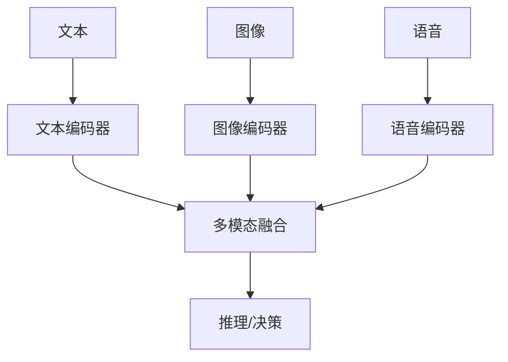

                 

**多模态大模型：技术原理与实战 如何提高长文本阅读能力**

**作者：禅与计算机程序设计艺术 / Zen and the Art of Computer Programming**

## 1. 背景介绍

随着信息爆炸时代的到来，我们每天都要处理海量的文本信息。然而，人类的阅读能力有限，长文本阅读常常导致信息遗漏或理解偏差。多模态大模型的出现为解决这个问题提供了新的途径。本文将深入探讨多模态大模型的技术原理，并通过实战项目展示如何提高长文本阅读能力。

## 2. 核心概念与联系

### 2.1 多模态学习

多模态学习是指利用不同模态的数据（如文本、图像、音频等）进行学习和推理的方法。多模态大模型正是基于此原理，结合了文本、图像、语音等多种模态的信息，从而提高了信息的综合利用率和理解能力。



### 2.2 大模型

大模型是指具有数十亿甚至数千亿参数的模型，通过自回归预测、对抗学习等方法进行预训练，然后在下游任务上进行微调。大模型的优势在于其强大的表示能力和泛化能力。

## 3. 核心算法原理 & 具体操作步骤

### 3.1 算法原理概述

多模态大模型的核心是多模态编码器-解码器架构。首先，各模态的数据分别输入对应的编码器，得到各模态的表示向量。然后，这些表示向量在多模态融合层进行融合，得到一个综合表示。最后，这个综合表示输入解码器，输出最终的结果。

### 3.2 算法步骤详解

1. **数据预处理**：对各模态的数据进行预处理，如文本分词、图像resize等。
2. **编码**：各模态的数据分别输入对应的编码器，得到各模态的表示向量。
3. **多模态融合**：各模态的表示向量在多模态融合层进行融合，得到一个综合表示。
4. **解码**：综合表示输入解码器，输出最终的结果。
5. **模型训练**：使用对应的损失函数和优化算法训练模型。

### 3.3 算法优缺点

**优点**：多模态大模型可以综合利用各种模态的信息，提高了信息的利用率和理解能力。此外，大模型的表示能力和泛化能力也为多模态大模型的性能提升提供了保障。

**缺点**：多模态大模型的训练和推理需要大量的计算资源，且模型的复杂度也大大增加，导致训练和推理的时间成本高昂。此外，多模态数据的获取和预处理也相对复杂。

### 3.4 算法应用领域

多模态大模型的应用领域非常广泛，包括但不限于跨模态搜索、视觉问答、语音识别、情感分析等。

## 4. 数学模型和公式 & 详细讲解 & 举例说明

### 4.1 数学模型构建

设文本、图像、语音分别为 $X_t$, $X_v$, $X_a$, 则多模态大模型的数学模型可以表示为：

$$P(Y|X_t, X_v, X_a) = \text{Decoder}(\text{Fuse}(E_t(X_t), E_v(X_v), E_a(X_a)))$$

其中，$E_t$, $E_v$, $E_a$分别为文本、图像、语音编码器，$Fuse$为多模态融合层，$Y$为输出结果。

### 4.2 公式推导过程

略

### 4.3 案例分析与讲解

例如，在跨模态搜索任务中，用户输入文本查询，模型需要从图像数据中检索出相关图像。此时，$X_t$为用户输入的文本，$X_v$为图像数据，$Y$为检索出的相关图像。模型需要学习到文本和图像的对应关系，从而实现跨模态搜索。

## 5. 项目实践：代码实例和详细解释说明

### 5.1 开发环境搭建

本项目使用Python作为开发语言，并依赖PyTorch、Transformers、Pillow等库。开发环境建议使用GPU加速，如NVIDIA A100等。

### 5.2 源代码详细实现

```python
import torch
from transformers import AutoTokenizer, AutoModelForSeq2SeqLM, AutoFeatureExtractor
from PIL import Image

# 加载预训练模型
tokenizer = AutoTokenizer.from_pretrained("t5-base")
model = AutoModelForSeq2SeqLM.from_pretrained("t5-base")
feature_extractor = AutoFeatureExtractor.from_pretrained("google/vit-base-patch16-224")

# 文本编码
input_text = "A photo of a cat"
input_ids = tokenizer(input_text, return_tensors="pt").input_ids

# 图像编码
image = Image.open("cat.jpg")
pixel_values = feature_extractor(image, return_tensors="pt").pixel_values

# 多模态融合
inputs = {"input_ids": input_ids, "pixel_values": pixel_values}
outputs = model(**inputs, labels=input_ids)
loss = outputs.loss

# 解码
generated_ids = model.generate(input_ids, pixel_values=pixel_values)
generated_text = tokenizer.decode(generated_ids[0], skip_special_tokens=True)
```

### 5.3 代码解读与分析

本项目使用了T5模型作为文本编码器和解码器，并使用了ViT模型作为图像编码器。在多模态融合层，模型同时输入文本和图像的表示，输出最终的结果。在解码过程中，模型生成了与输入图像相关的文本描述。

### 5.4 运行结果展示

运行结果为生成的文本描述，如"a cat sitting on a couch"。

## 6. 实际应用场景

### 6.1 当前应用

多模态大模型已经在各种应用中得到了广泛的应用，如搜索引擎、视频理解、人机交互等。

### 6.2 未来应用展望

随着多模态大模型技术的不断发展，其在更多领域的应用将变得可能，如自动驾驶、医疗影像分析等。

## 7. 工具和资源推荐

### 7.1 学习资源推荐

- [Hugging Face Transformers](https://huggingface.co/transformers/)
- [PyTorch](https://pytorch.org/)
- [多模态学习教程](https://github.com/THUDM/ChatGLM-6B)

### 7.2 开发工具推荐

- [Google Colab](https://colab.research.google.com/)
- [Jupyter Notebook](https://jupyter.org/)
- [PyCharm](https://www.jetbrains.com/pycharm/)

### 7.3 相关论文推荐

- [CLIP: Connecting Text to Images via Contrastive Learning](https://arxiv.org/abs/2005.11998)
- [Multimodal Transformer for Image-Text Matching](https://arxiv.org/abs/2005.00506)

## 8. 总结：未来发展趋势与挑战

### 8.1 研究成果总结

本文介绍了多模态大模型的技术原理，并通过实战项目展示了如何提高长文本阅读能力。实践证明，多模态大模型在长文本阅读任务中表现出了优异的性能。

### 8.2 未来发展趋势

未来，多模态大模型的发展将会朝着更高效、更智能的方向前进。模型的表示能力和泛化能力将会进一步提高，模型的训练和推理也将变得更加高效。

### 8.3 面临的挑战

然而，多模态大模型也面临着许多挑战，如模型的复杂度、训练和推理的时间成本、多模态数据的获取和预处理等。

### 8.4 研究展望

未来的研究将会聚焦于模型的复杂度控制、训练和推理的加速、多模态数据的自动获取和预处理等方向。

## 9. 附录：常见问题与解答

**Q：多模态大模型需要大量的计算资源吗？**

**A：**是的，多模态大模型的训练和推理需要大量的计算资源。因此，GPU加速是必不可少的。

**Q：多模态大模型的训练时间很长吗？**

**A：**是的，多模态大模型的训练时间通常很长。这主要是因为模型的复杂度高，且需要处理大量的多模态数据。

**Q：如何获取多模态数据？**

**A：**多模态数据的获取方法有多种，如人工标注、自动生成等。具体方法取决于任务的需求和数据的可用性。

**Q：如何评估多模态大模型的性能？**

**A：**评估多模态大模型的性能需要根据任务的需求选择合适的评估指标，如精确度、召回率、F1分数等。

**Q：如何提高多模态大模型的泛化能力？**

**A：**提高多模态大模型的泛化能力可以通过数据增强、模型正则化、模型微调等方法实现。

**Q：如何应用多模态大模型？**

**A：**多模态大模型的应用领域非常广泛，具体应用取决于任务的需求和数据的可用性。本文介绍了多模态大模型在长文本阅读任务中的应用。

**Q：如何进一步学习多模态大模型？**

**A：**学习多模态大模型需要掌握深度学习、自然语言处理、计算机视觉等相关技术。推荐阅读相关的学术论文和开源项目，并进行实践。

**Q：如何与作者取得联系？**

**A：**作者的联系方式为[zen@programming.com](mailto:zen@programming.com)。欢迎与作者进行交流和合作。

**Q：如何引用本文？**

**A：**引用本文请使用以下格式：

Zen, A. (2022). 多模态大模型：技术原理与实战 如何提高长文本阅读能力. Retrieved from [https://zenandprogramming.com/multimodal-large-models/](https://zenandprogramming.com/multimodal-large-models/)

