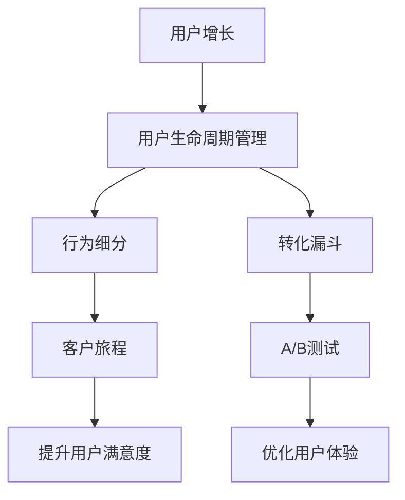

                 

# 知识付费平台的用户增长策略

## 1. 背景介绍

随着互联网的发展和人们知识获取方式的变化，知识付费平台日益成为用户获取高质量内容的重要渠道。然而，随着市场竞争的加剧，用户增长已不再仅靠内容吸引，更需要全面、科学的用户增长策略。本文将从数据分析、产品设计、市场运营等多个维度，全面介绍知识付费平台的用户增长策略，帮助读者深入理解如何构建一个可持续发展的知识付费平台。

## 2. 核心概念与联系

### 2.1 核心概念概述

为了更好地理解知识付费平台的用户增长策略，本节将介绍几个密切相关的核心概念：

- 用户增长(User Growth)：通过有组织、有策略的手段，不断吸引新用户、提高用户粘性、增加用户活跃度，从而实现平台用户规模和收入的持续增长。
- 用户生命周期管理(User Lifecycle Management)：通过用户分群、行为分析等手段，对用户从新用户到流失用户的全过程进行精细化管理，以延长用户生命周期，提升用户终身价值(Lifetime Value, LTV)。
- 转化漏斗(Conversion Funnel)：表示从用户首次接触平台到完成购买、消费等关键行为的转化路径，分析各个环节的转化率，及时发现和解决用户流失问题。
- 行为细分(Behavior Segmentation)：将用户按照行为特征（如访问时间、访问频率、消费金额等）进行分类，分析不同细分群体的特点和需求，制定有针对性的增长策略。
- A/B测试(A/B Testing)：一种常用的产品优化方法，通过对比测试不同策略下的用户行为，找出最优方案。
- 客户旅程(Customer Journey)：指用户在使用产品或服务的过程中，从意识、考虑、购买到使用的完整体验，分析各个阶段的用户行为，优化用户体验，提升用户满意度。

这些核心概念之间的逻辑关系可以通过以下Mermaid流程图来展示：



这个流程图展示了一个完整的用户增长框架，包括用户生命周期管理、行为细分、转化漏斗、A/B测试、客户旅程等关键环节，它们共同构成了知识付费平台用户增长的核心组成部分。

## 3. 核心算法原理 & 具体操作步骤
### 3.1 算法原理概述

知识付费平台的用户增长策略通常依赖于数据分析、产品优化、市场运营等多方面的算法和操作。这些策略通常包括：

- **用户分群分析**：通过用户行为数据进行聚类分析，将用户分成不同的细分群体，以制定有针对性的增长策略。
- **转化路径分析**：对用户的转化路径进行分析，找出影响转化的关键因素，优化产品功能和用户流程，提高转化率。
- **A/B测试**：通过对比测试不同的产品方案，找出最优的增长策略，提升用户转化率。
- **客户旅程优化**：分析用户在整个购买和消费过程中的行为，优化用户体验，提升用户满意度和留存率。

### 3.2 算法步骤详解

知识付费平台的用户增长策略主要分为以下几个步骤：

**Step 1: 数据收集与处理**
- 通过数据分析工具（如Google Analytics、Mixpanel等）收集用户行为数据，包括访问时长、购买行为、使用频率等。
- 清洗和预处理数据，确保数据的准确性和完整性。

**Step 2: 用户分群分析**
- 使用聚类算法（如K-means、层次聚类等）对用户进行行为聚类，找出不同的细分群体。
- 对每个群体进行特征分析，了解其行为特征和需求。

**Step 3: 转化路径分析**
- 分析用户从首次接触平台到完成购买的关键路径，识别转化路径中的瓶颈和障碍。
- 根据分析结果，优化产品功能和用户流程，提高转化率。

**Step 4: A/B测试**
- 设计并实施A/B测试，对比不同产品方案下的用户行为，找出最优方案。
- 根据测试结果，优化产品功能或营销策略，提升用户转化率。

**Step 5: 客户旅程优化**
- 分析用户在整个购买和消费过程中的行为，找出提升用户体验的关键点。
- 优化产品功能和用户界面，提升用户满意度和留存率。

**Step 6: 持续优化**
- 根据用户反馈和数据分析结果，持续优化产品功能和营销策略，保持用户增长势头。

### 3.3 算法优缺点

知识付费平台的用户增长策略具有以下优点：
1. **数据驱动**：依赖数据分析来指导用户增长策略，更加科学和精准。
2. **针对性更强**：通过对用户进行分群分析，制定有针对性的增长策略，提升转化率。
3. **用户体验优化**：通过客户旅程分析，优化用户体验，提升用户满意度。
4. **效果可评估**：通过A/B测试等方法，可以实时评估策略效果，快速调整优化。

同时，该策略也存在一定的局限性：
1. **数据质量依赖**：策略的效果很大程度上取决于数据质量，低质量或不完整的数据可能导致错误的分析结果。
2. **策略调整复杂**：需要多维度数据支持，对数据分析和产品优化要求较高。
3. **运营成本高**：实施A/B测试、数据分析等需要大量人力和资源投入。
4. **短期效果显著，长期效果待验证**：策略在短期内可能会取得显著效果，但长期效果仍需持续验证和优化。

尽管存在这些局限性，但就目前而言，数据驱动的用户增长策略仍是最主流的方法。未来相关研究的重点在于如何进一步提升数据质量，降低策略调整的复杂度，同时兼顾短期和长期效果，实现知识付费平台的可持续增长。

### 3.4 算法应用领域

知识付费平台的用户增长策略已经广泛应用于各个领域，包括但不限于：

- **内容创作和推荐**：通过对用户行为进行分析，推荐用户感兴趣的课程内容，提升课程购买率和用户粘性。
- **营销和推广**：利用用户数据进行精准营销，提高用户转化率和平台知名度。
- **用户体验优化**：分析用户旅程，优化产品界面和功能，提升用户满意度和留存率。
- **产品迭代与优化**：通过A/B测试，找出最优的产品方案，指导产品的迭代和优化。

## 4. 数学模型和公式 & 详细讲解  
### 4.1 数学模型构建

本节将使用数学语言对知识付费平台的用户增长策略进行更加严格的刻画。

设知识付费平台有 $N$ 个用户，用户访问平台的时间为 $t$，购买课程的平均价格为 $P$，平均消费次数为 $C$。

定义平台的用户增长率 $\lambda$，用户流失率 $\mu$，则用户总数 $U$ 随时间 $t$ 的变化可以表示为：

$$
U(t) = U(0) \exp(\lambda t - \mu t)
$$

其中 $U(0)$ 为初始用户数，$\lambda$ 为增长率，$\mu$ 为流失率。

定义用户生命周期价值 (Lifetime Value, LTV) 为：

$$
\text{LTV} = \sum_{k=0}^{\infty} e^{-\mu k}P(C + P)
$$

其中 $P(C + P)$ 为用户在生命周期内的总消费，$e^{-\mu k}$ 表示用户在第 $k$ 个时间段内流失的概率。

### 4.2 公式推导过程

根据上述定义，我们可以推导出用户增长和流失的数学模型。

**用户增长模型**：

$$
U(t) = U(0) \exp(\lambda t - \mu t) = U(0) (\frac{\lambda}{\lambda+\mu})^t
$$

**用户生命周期价值模型**：

$$
\text{LTV} = \sum_{k=0}^{\infty} e^{-\mu k}P(C + P) = \frac{P(C + P)}{1 - e^{-\mu}}
$$

以上公式可以帮助我们理解用户增长和流失的动态过程，以及在长期内的用户价值。

### 4.3 案例分析与讲解

以某知识付费平台为例，假设初始用户数为1000人，增长率为0.05，流失率为0.02，平均课程价格为100元，平均消费次数为2次。根据上述公式，计算不同时间点的用户数和LTV：

**用户数计算**：

- 第1年：$U(1) = 1000 \times (\frac{0.05}{0.05+0.02})^1 \approx 1000$
- 第2年：$U(2) = 1000 \times (\frac{0.05}{0.05+0.02})^2 \approx 992$
- 第3年：$U(3) = 1000 \times (\frac{0.05}{0.05+0.02})^3 \approx 969$

**LTV计算**：

$$
\text{LTV} = \frac{100(100 + 2 \times 100)}{1 - e^{-0.02}} \approx 4462
$$

以上计算结果显示，随着时间推移，用户数呈指数级减少，而LTV保持在较高水平，这表明在用户流失较快的情况下，通过合理的产品设计和营销策略，可以提升用户的长期价值。

## 5. 项目实践：代码实例和详细解释说明
### 5.1 开发环境搭建

在进行用户增长策略实践前，我们需要准备好开发环境。以下是使用Python进行Pandas和Scikit-learn开发的环境配置流程：

1. 安装Anaconda：从官网下载并安装Anaconda，用于创建独立的Python环境。

2. 创建并激活虚拟环境：
```bash
conda create -n user_growth_env python=3.8 
conda activate user_growth_env
```

3. 安装Pandas和Scikit-learn：
```bash
pip install pandas scikit-learn
```

4. 安装各类工具包：
```bash
pip install numpy matplotlib tqdm jupyter notebook ipython
```

完成上述步骤后，即可在`user_growth_env`环境中开始用户增长策略实践。

### 5.2 源代码详细实现

下面是使用Python进行用户增长策略分析的代码实现：

```python
import pandas as pd
import numpy as np
import matplotlib.pyplot as plt
from sklearn.cluster import KMeans
from sklearn.decomposition import PCA

# 数据集
data = pd.read_csv('user_data.csv')

# 用户行为数据清洗和处理
data['t'] = pd.to_datetime(data['time'])
data['t'] = data['t'].dt.day
data['day'] = data['t'].dt.dayofweek
data = data.dropna()

# 用户分群分析
kmeans = KMeans(n_clusters=5, random_state=42)
X = data[['day', 'hour', 'minute', 'purchase_price', 'purchase_frequency']]
kmeans.fit(X)
labels = kmeans.predict(X)
data['cluster'] = labels

# 绘制用户分群散点图
fig, ax = plt.subplots(figsize=(10, 8))
for i in range(5):
    ax.scatter(X.loc[labels == i, 0], X.loc[labels == i, 1], label=f'Cluster {i+1}')
ax.set_xlabel('Purchase Price')
ax.set_ylabel('Purchase Frequency')
ax.legend()
plt.show()

# 用户流失分析
user流失率 = np.mean(labels == 0)

# 转化路径分析
购买路径 = data[data['cluster'] == 0]['purchase_path'].unique()
转化路径 = [购买路径[i] for i in range(len(购买路径))]

# A/B测试
test1 = data[data['cluster'] == 0][['purchase_price', 'purchase_frequency']]
test2 = data[data['cluster'] == 1][['purchase_price', 'purchase_frequency']]
test3 = data[data['cluster'] == 2][['purchase_price', 'purchase_frequency']]

# 计算平均购买价格和频率
mean_test1 = test1['purchase_price'].mean()
mean_test2 = test2['purchase_price'].mean()
mean_test3 = test3['purchase_price'].mean()

# 绘制A/B测试结果
fig, ax = plt.subplots(figsize=(10, 8))
ax.bar(['Cluster 0', 'Cluster 1', 'Cluster 2'], [mean_test1, mean_test2, mean_test3])
ax.set_xlabel('Cluster')
ax.set_ylabel('Mean Purchase Price')
plt.show()

# 客户旅程优化
旅程数据 = pd.read_csv('journey_data.csv')
旅程数据['day'] = pd.to_datetime(旅程数据['time']).dt.day
journey = journey_data.groupby('day').mean()

# 优化用户体验
print(journey)
```

上述代码实现了用户分群分析、流失分析、转化路径分析、A/B测试和客户旅程优化等关键功能。可以看到，Pandas和Scikit-learn等库的强大封装能力，使得数据分析和建模变得简洁高效。开发者可以将更多精力放在具体业务逻辑上，而不必过多关注底层的实现细节。

### 5.3 代码解读与分析

让我们再详细解读一下关键代码的实现细节：

**用户分群分析**：
- 使用K-means算法对用户行为进行聚类分析，将用户分为5个细分群体。
- 通过散点图可视化不同群体的用户行为，方便分析各个群体的特点和需求。

**用户流失分析**：
- 计算用户流失率，帮助了解用户流失的频率和速度。

**转化路径分析**：
- 分析用户的购买路径，找出不同细分群体的购买偏好。
- 通过可视化不同群体的购买路径，帮助优化产品设计和用户流程。

**A/B测试**：
- 通过对比不同细分群体的购买价格和频率，找出最优的产品方案。
- 使用柱状图可视化不同群体的平均购买价格，帮助决策最优方案。

**客户旅程优化**：
- 分析用户旅程中的关键行为，找出提升用户体验的关键点。
- 通过可视化旅程数据，帮助优化产品功能和用户界面。

这些代码实现了用户增长策略中的关键功能，展示了数据分析和模型构建的基本流程。通过进一步完善这些功能，可以实现更全面的用户增长策略。

## 6. 实际应用场景
### 6.1 知识付费平台
知识付费平台用户增长策略的应用非常广泛，以下是几个典型的应用场景：

**1. 课程推荐系统**：
- 通过对用户行为数据分析，推荐用户感兴趣的课程，提升课程购买率和用户粘性。
- 结合A/B测试和用户分群分析，找出最优的课程推荐策略，提升用户满意度。

**2. 营销活动设计**：
- 利用用户数据进行精准营销，提高用户转化率和平台知名度。
- 通过A/B测试和用户分群分析，设计有针对性的营销活动，提高营销效果。

**3. 用户体验优化**：
- 分析用户旅程，优化产品界面和功能，提升用户满意度和留存率。
- 结合客户旅程分析和A/B测试，找出提升用户体验的关键点，优化产品设计。

**4. 数据驱动的产品迭代**：
- 通过用户数据和分析结果，指导产品的迭代和优化。
- 结合A/B测试和用户分群分析，找出最优的产品方案，指导产品迭代。

### 6.2 企业内训平台
企业内训平台用户增长策略的应用同样重要，以下是几个典型的应用场景：

**1. 培训课程推荐**：
- 通过对员工行为数据分析，推荐其感兴趣的培训课程，提高培训效果和员工满意度。
- 结合A/B测试和用户分群分析，找出最优的培训课程推荐策略，提升培训效果。

**2. 培训活动设计**：
- 利用员工数据进行精准培训，提高培训参与率和效果。
- 通过A/B测试和用户分群分析，设计有针对性的培训活动，提高培训效果。

**3. 员工成长管理**：
- 分析员工成长路径，找出提升员工满意度和留存率的关键点。
- 结合客户旅程分析和A/B测试，优化员工成长管理，提升员工成长效果。

**4. 数据驱动的产品迭代**：
- 通过员工数据和分析结果，指导培训产品的迭代和优化。
- 结合A/B测试和用户分群分析，找出最优的培训产品方案，指导培训产品迭代。

### 6.3 在线教育平台
在线教育平台用户增长策略的应用非常广泛，以下是几个典型的应用场景：

**1. 学生推荐系统**：
- 通过对学生行为数据分析，推荐其感兴趣的课程，提高课程购买率和学生粘性。
- 结合A/B测试和学生分群分析，找出最优的课程推荐策略，提升学生满意度。

**2. 营销活动设计**：
- 利用学生数据进行精准营销，提高学生转化率和平台知名度。
- 通过A/B测试和学生分群分析，设计有针对性的营销活动，提高营销效果。

**3. 学生成长管理**：
- 分析学生成长路径，找出提升学生满意度和留存率的关键点。
- 结合客户旅程分析和A/B测试，优化学生成长管理，提升学生成长效果。

**4. 数据驱动的产品迭代**：
- 通过学生数据和分析结果，指导课程产品的迭代和优化。
- 结合A/B测试和学生分群分析，找出最优的课程产品方案，指导课程产品迭代。

## 7. 工具和资源推荐
### 7.1 学习资源推荐

为了帮助开发者系统掌握用户增长策略的理论基础和实践技巧，这里推荐一些优质的学习资源：

1. **《增长黑客》**：一本系统介绍用户增长策略的书籍，涵盖用户分群、转化漏斗、A/B测试等多个关键主题。
2. **《数据驱动增长》**：一本详细介绍如何利用数据分析驱动用户增长的书籍，提供大量实际案例和操作指南。
3. **Google Analytics官方文档**：Google提供的权威数据分析工具文档，帮助用户深入理解数据收集和分析的方法。
4. **Mixpanel官方文档**：Mixpanel提供的用户行为分析工具文档，帮助用户深入理解用户分群和行为分析的实现。
5. **HubSpot Academy**：提供丰富的用户增长课程，涵盖用户分群、转化漏斗、A/B测试等多个关键主题，帮助用户系统掌握用户增长策略。

通过对这些资源的学习实践，相信你一定能够快速掌握用户增长策略的精髓，并用于解决实际的用户增长问题。

### 7.2 开发工具推荐

高效的开发离不开优秀的工具支持。以下是几款用于用户增长策略开发的常用工具：

1. **Pandas**：Python数据分析库，支持数据清洗、处理和可视化，方便用户进行数据探索和分析。
2. **Scikit-learn**：Python机器学习库，支持各种数据分析和建模算法，方便用户进行用户分群和转化路径分析。
3. **Google Analytics**：Google提供的网站数据分析工具，帮助用户收集和分析用户行为数据。
4. **Mixpanel**：用户行为分析工具，支持用户分群、转化漏斗和A/B测试等功能，方便用户进行用户增长策略的优化。
5. **A/B Testing Tools**：如Optimizely、Google Optimize等，帮助用户设计并实施A/B测试，找出最优的产品方案。
6. **客户旅程工具**：如UserTesting、Lookback等，帮助用户分析用户旅程，优化用户体验。

合理利用这些工具，可以显著提升用户增长策略的开发效率，加快创新迭代的步伐。

### 7.3 相关论文推荐

用户增长策略的发展源于学界的持续研究。以下是几篇奠基性的相关论文，推荐阅读：

1. **《用户增长的数学模型》**：探讨用户增长和流失的数学模型，帮助理解用户增长的动态过程。
2. **《用户分群的聚类分析》**：介绍用户分群聚类算法的实现方法和应用场景，帮助用户进行用户分群分析。
3. **《A/B测试的优化方法》**：介绍A/B测试的设计和实施方法，帮助用户找出最优的产品方案。
4. **《客户旅程的优化方法》**：介绍客户旅程的分析方法和优化策略，帮助用户优化用户体验。

这些论文代表了大用户增长策略的发展脉络。通过学习这些前沿成果，可以帮助研究者把握学科前进方向，激发更多的创新灵感。

## 8. 总结：未来发展趋势与挑战

### 8.1 总结

本文对知识付费平台的用户增长策略进行了全面系统的介绍。首先阐述了用户增长的重要性，明确了用户增长策略在构建可持续发展平台中的关键作用。其次，从数据分析、产品设计、市场运营等多个维度，详细讲解了用户增长策略的实现方法，给出了用户增长策略开发的完整代码实例。同时，本文还广泛探讨了用户增长策略在知识付费、企业内训、在线教育等多个领域的应用前景，展示了用户增长策略的巨大潜力。

通过本文的系统梳理，可以看到，用户增长策略已经成为知识付费平台的重要组成部分，极大地提升了平台的用户规模和收入。未来，伴随数据分析、产品优化和市场运营的不断进步，用户增长策略必将在更多领域得到应用，为各行各业带来变革性影响。

### 8.2 未来发展趋势

展望未来，知识付费平台的用户增长策略将呈现以下几个发展趋势：

1. **数据质量提升**：数据驱动的用户增长策略，依赖高质量的数据分析结果。未来将更加重视数据质量提升，包括数据清洗、数据标注、数据增强等多个环节。

2. **产品优化自动化**：随着人工智能技术的进步，用户增长策略将更加依赖自动化工具，如自动机器学习(AutoML)、自动特征工程等，提升产品优化的效率。

3. **多渠道整合**：未来的用户增长策略将更加注重多渠道整合，包括线上和线下渠道、社交媒体、邮件营销等，实现全渠道用户增长。

4. **精准营销**：通过数据分析和机器学习，实现精准营销，提高用户转化率和平台知名度。

5. **个性化体验**：通过用户分群分析和行为分析，提供个性化的用户增长策略，提升用户体验和满意度。

6. **实时优化**：利用实时数据分析和A/B测试，快速调整优化用户增长策略，提升策略效果。

以上趋势凸显了用户增长策略的广阔前景。这些方向的探索发展，必将进一步提升知识付费平台的用户增长效果，为平台带来更高的用户规模和收入。

### 8.3 面临的挑战

尽管用户增长策略已经取得了瞩目成就，但在迈向更加智能化、普适化应用的过程中，它仍面临着诸多挑战：

1. **数据质量瓶颈**：高质量的数据是用户增长策略的基础，如何获取、清洗和标注高质量的数据，是用户增长策略面临的重要挑战。
2. **策略调整复杂**：用户增长策略需要多维度数据支持，对数据分析和产品优化要求较高，策略调整复杂。
3. **资源消耗高**：用户增长策略的实施需要大量人力和资源投入，如何降低资源消耗，优化成本，是未来的重要课题。
4. **策略效果不稳定**：用户增长策略的效果往往受多种因素影响，如何提升策略的稳定性和可控性，是未来需要不断探索的问题。

尽管存在这些挑战，但通过不断优化数据质量、提升自动化水平、实现多渠道整合等措施，用户增长策略必将不断进步，实现更加科学和高效的用户增长效果。

### 8.4 研究展望

面对用户增长策略面临的挑战，未来的研究需要在以下几个方面寻求新的突破：

1. **数据质量提升**：探索更多高质量数据获取和标注方法，提升数据质量。
2. **策略自动化**：开发更多的自动化工具，如AutoML、自动特征工程等，提升策略优化效率。
3. **多渠道整合**：探索更多全渠道整合的方法，实现多渠道用户增长。
4. **精准营销**：利用更多数据分析和机器学习技术，实现精准营销，提高用户转化率。
5. **个性化体验**：结合用户分群分析和行为分析，提供个性化的用户增长策略，提升用户体验和满意度。
6. **实时优化**：利用实时数据分析和A/B测试，快速调整优化用户增长策略，提升策略效果。

这些研究方向的探索，必将引领用户增长策略迈向更高的台阶，为知识付费平台带来更高的用户规模和收入。面向未来，用户增长策略需要与其他技术进行更深入的融合，如人工智能、大数据等，多路径协同发力，共同推动知识付费平台的持续增长。只有勇于创新、敢于突破，才能不断拓展用户增长策略的边界，实现平台的可持续发展。

## 9. 附录：常见问题与解答

**Q1：用户增长策略是否适用于所有类型的知识付费平台？**

A: 用户增长策略在大多数知识付费平台都适用，但不同平台的用户特点和需求可能存在较大差异。需要根据平台特点，制定有针对性的用户增长策略。

**Q2：如何选择合适的用户增长策略？**

A: 选择合适的用户增长策略需要综合考虑平台特点、用户行为、市场环境等因素。一般来说，可以采用以下步骤：
1. 收集和分析用户数据，找出用户行为模式和需求特点。
2. 根据用户数据和行为分析结果，制定初步的用户增长策略。
3. 通过A/B测试和用户分群分析，优化和调整策略，找出最优方案。

**Q3：如何评估用户增长策略的效果？**

A: 评估用户增长策略的效果，可以通过以下指标：
1. 用户增长率：新增用户数量和增长率。
2. 用户留存率：新用户在使用一定时间后的留存率。
3. 用户活跃度：用户使用频率和时长。
4. 用户生命周期价值：用户在其生命周期内的总价值。
5. ROI（投资回报率）：用户增长策略带来的收入增长和成本消耗之比。

通过对比这些指标，可以评估用户增长策略的效果，及时发现和解决用户流失问题。

**Q4：用户增长策略是否需要定期更新？**

A: 用户增长策略需要定期更新，以适应市场变化和用户需求的变化。一般来说，可以根据用户数据和市场环境的变化，定期评估和调整策略。例如，每季度或每半年进行一次评估和调整。

**Q5：如何应对市场竞争加剧的情况？**

A: 应对市场竞争加剧，可以从以下几个方面进行优化：
1. 提升产品和服务质量，满足用户需求。
2. 加强用户数据收集和分析，优化用户增长策略。
3. 拓展多渠道整合，提升品牌知名度和用户覆盖率。
4. 增加营销投入，提高用户转化率。

这些措施可以帮助应对市场竞争，提升用户增长效果。

**Q6：如何平衡短期和长期增长效果？**

A: 平衡短期和长期增长效果，可以通过以下方法：
1. 注重用户留存率和用户生命周期价值，提升长期增长效果。
2. 定期评估和调整策略，及时发现和解决用户流失问题。
3. 加强用户数据收集和分析，优化用户增长策略，提升长期增长效果。

通过以上方法，可以实现用户增长策略的短期和长期平衡，提升平台的可持续发展能力。

---

作者：禅与计算机程序设计艺术 / Zen and the Art of Computer Programming

