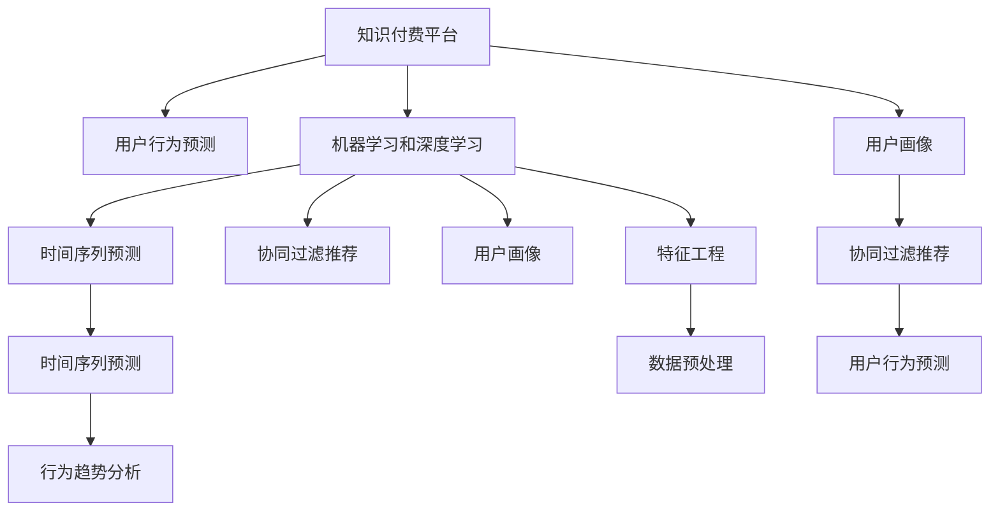

                 

# 知识付费平台的用户行为预测与分析

> 关键词：知识付费,用户行为预测,机器学习,深度学习,时间序列预测,协同过滤推荐,用户画像,特征工程

## 1. 背景介绍

在知识付费领域，如何通过精准预测和深入分析用户行为，提高用户满意度和平台收益，一直是行业的热点话题。随着人工智能技术的不断发展，知识付费平台开始借助机器学习和深度学习技术，对用户行为进行预测和分析，为用户推荐个性化的内容，提升用户体验和平台的商业价值。本文将全面介绍基于机器学习和深度学习的知识付费平台用户行为预测与分析技术，剖析其实现原理和工程实践，并提供完整的项目实践代码实例。

## 2. 核心概念与联系

### 2.1 核心概念概述

为更好地理解用户行为预测与分析技术，本节将介绍几个关键概念：

- **知识付费平台**：指提供有价值的学习资料、课程、讲座等知识服务，并通过收费模式进行变现的在线平台，如得到、喜马拉雅等。
- **用户行为预测**：指基于用户的历史行为数据和特征，预测用户未来可能采取的行动，如购买、续订、取消订阅等。
- **机器学习和深度学习**：指通过算法和模型，自动从数据中学习规律并进行预测和决策的技术，包括回归、分类、聚类、协同过滤等多种算法。
- **时间序列预测**：指利用时间序列数据进行趋势和周期性预测，常用于行为分析和时间趋势预测。
- **协同过滤推荐**：指通过分析用户和内容间的相似度，推荐用户可能感兴趣的内容，常用于个性化推荐。
- **用户画像**：指通过分析用户的历史行为数据和特征，构建用户特征模型，以描述用户的行为和偏好。
- **特征工程**：指在数据预处理阶段，通过提取和构造有效特征，提升模型的预测能力。

这些核心概念之间的逻辑关系可以通过以下Mermaid流程图来展示：



这个流程图展示了大语言模型的核心概念及其之间的关系：

1. 知识付费平台通过收集用户行为数据，应用机器学习和深度学习技术，进行用户行为预测和分析。
2. 机器学习和深度学习提供了各种预测和推荐算法，包括时间序列预测和协同过滤推荐。
3. 用户画像和特征工程是数据预处理和模型训练的重要环节，通过刻画用户特征，提升模型的预测效果。
4. 协同过滤推荐根据用户和内容之间的相似度，为用户推荐个性化的内容。
5. 时间序列预测分析用户行为的时间趋势，帮助平台掌握用户行为规律。

这些核心概念共同构成了知识付费平台的用户行为预测和分析框架，使其能够精准预测用户行为，推荐个性化内容，从而提升用户体验和平台收益。

## 3. 核心算法原理 & 具体操作步骤
### 3.1 算法原理概述

知识付费平台的用户行为预测与分析，本质上是一个多任务学习(Multi-task Learning)的过程，其中包含时间序列预测、协同过滤推荐等多个子任务。我们通常将预测问题分解为多个子任务，分别使用不同的机器学习算法进行处理，并最终将各个子任务的预测结果进行集成。

具体来说，基于机器学习的用户行为预测包括以下步骤：

1. 数据收集：收集知识付费平台的用户行为数据，包括但不限于注册时间、购买记录、学习时长、收藏文章、评分评价等。
2. 特征工程：对收集到的数据进行清洗和特征提取，如时间特征、行为频率、内容特征等。
3. 模型训练：分别训练不同的预测模型，如线性回归、随机森林、神经网络等，对用户行为进行预测。
4. 结果集成：将各个子任务的预测结果进行集成，如加权平均、投票等，得到最终的预测结果。

### 3.2 算法步骤详解

基于机器学习的用户行为预测主要包括以下几个关键步骤：

**Step 1: 数据收集与预处理**

1. **数据收集**：通过API接口和平台日志，收集用户行为数据。数据包括但不限于注册时间、购买记录、学习时长、收藏文章、评分评价等。
2. **数据清洗**：去除异常值、重复数据和噪声，保证数据的质量和完整性。
3. **特征工程**：提取和构造有效特征，如时间戳、学习频率、课程评分等，提升模型的预测能力。

**Step 2: 模型训练与选择**

1. **模型选择**：根据任务需求选择合适的模型，如线性回归、随机森林、神经网络等。
2. **模型训练**：使用训练集数据训练模型，调整超参数，选择最优模型。
3. **模型评估**：使用验证集数据评估模型性能，选择性能最优的模型。

**Step 3: 结果集成与优化**

1. **结果集成**：将多个模型的预测结果进行集成，提升预测准确性。
2. **优化与调参**：根据实际业务需求，对集成后的结果进行优化和调参，提升用户体验。

### 3.3 算法优缺点

基于机器学习的用户行为预测与分析方法具有以下优点：

- **灵活性高**：不同的预测任务可以使用不同的模型进行处理，适应不同的业务需求。
- **精度高**：通过集成多个模型的预测结果，可以显著提升预测精度。
- **泛化能力强**：通过特征工程，模型可以适应不同的数据分布和业务场景。

同时，该方法也存在一定的局限性：

- **计算复杂度高**：多模型集成和特征工程可能导致计算复杂度增加。
- **数据需求大**：需要大量高质量的标注数据和特征工程的数据，获取成本较高。
- **模型解释性不足**：复杂模型的决策过程难以解释，难以进行业务分析。

尽管存在这些局限性，但就目前而言，基于机器学习的用户行为预测与分析方法仍然是知识付费平台用户行为预测的主要技术手段。未来相关研究的重点在于如何进一步降低对标注数据的依赖，提高模型的可解释性，提升预测效果。

### 3.4 算法应用领域

基于机器学习的用户行为预测与分析技术，在知识付费平台中得到了广泛的应用，具体领域包括：

- **用户流失预测**：预测用户是否会取消订阅，帮助平台进行用户流失分析，采取相应的挽留措施。
- **课程推荐**：根据用户的历史行为和偏好，推荐用户可能感兴趣的新课程，提升用户粘性和平台收益。
- **学习进度预测**：预测用户的学习进度，帮助平台推荐合适的内容，提升学习效率。
- **热点课程分析**：分析课程的受欢迎程度和用户评价，帮助平台调整课程内容，提升课程质量。

除了上述这些经典应用外，基于机器学习的用户行为预测与分析技术还在诸多领域得到应用，如广告推荐、个性化营销等，为知识付费平台提供了全面的数据分析和技术支持。

## 4. 数学模型和公式 & 详细讲解 & 举例说明

### 4.1 数学模型构建

假设知识付费平台收集到的用户行为数据为 $D=\{(x_i,y_i)\}_{i=1}^N$，其中 $x_i$ 为特征向量，$y_i$ 为行为标签，如是否购买、学习时长等。我们的目标是通过训练一个预测模型，对新用户的行为进行预测。

定义预测模型的参数为 $\theta$，模型的预测函数为 $f_{\theta}(x)$，损失函数为 $\ell(f_{\theta}(x),y)$，则预测模型的训练目标为：

$$
\min_{\theta} \frac{1}{N}\sum_{i=1}^N \ell(f_{\theta}(x_i),y_i)
$$

常见的损失函数包括均方误差（MSE）、交叉熵（Cross-Entropy）等。例如，对于回归任务，可以使用均方误差损失：

$$
\ell(y,f_{\theta}(x)) = \frac{1}{N}\sum_{i=1}^N (y_i - f_{\theta}(x_i))^2
$$

对于分类任务，可以使用交叉熵损失：

$$
\ell(y,f_{\theta}(x)) = -\frac{1}{N}\sum_{i=1}^N y_i\log f_{\theta}(x_i) + (1-y_i)\log(1-f_{\theta}(x_i))
$$

### 4.2 公式推导过程

以线性回归为例，推导其预测模型和损失函数的公式。

假设输入特征 $x$ 为 $d$ 维向量，线性回归模型的预测函数为：

$$
f_{\theta}(x) = \theta_0 + \theta_1x_1 + \cdots + \theta_dx_d
$$

其中 $\theta = (\theta_0,\theta_1,\cdots,\theta_d)$ 为模型参数。对于回归任务，均方误差损失为：

$$
\ell(y,f_{\theta}(x)) = \frac{1}{N}\sum_{i=1}^N (y_i - f_{\theta}(x_i))^2
$$

利用均方误差损失对模型参数 $\theta$ 进行梯度下降优化，其梯度为：

$$
\frac{\partial \ell}{\partial \theta} = -\frac{2}{N}\sum_{i=1}^N (y_i - f_{\theta}(x_i))x_i
$$

将梯度代入优化算法，如随机梯度下降（SGD），对模型参数进行更新：

$$
\theta \leftarrow \theta - \eta \frac{\partial \ell}{\partial \theta}
$$

其中 $\eta$ 为学习率，控制每次迭代的学习速度。

### 4.3 案例分析与讲解

以知识付费平台的课程推荐为例，说明基于机器学习的预测模型的应用。

假设收集到的用户行为数据包括用户ID、课程ID、学习时长等，目标预测用户是否会购买新课程。我们可以构造以下特征：

- 用户ID：表示用户基本信息。
- 课程ID：表示课程的基本信息。
- 学习时长：表示用户在该课程上花费的时间。
- 历史购买记录：表示用户之前购买课程的历史数据。

使用随机森林算法对以上特征进行建模，预测用户是否会购买新课程。具体步骤如下：

1. **数据预处理**：对数据进行归一化和缺失值处理，保证数据的质量。
2. **特征选择**：选择对预测结果有显著影响的特征，如学习时长、历史购买记录等。
3. **模型训练**：使用随机森林算法对特征进行建模，得到预测模型。
4. **结果评估**：使用验证集数据评估模型性能，调整超参数，选择最优模型。
5. **预测与推荐**：对新用户的行为进行预测，根据预测结果进行课程推荐。

## 5. 项目实践：代码实例和详细解释说明
### 5.1 开发环境搭建

在进行项目实践前，我们需要准备好开发环境。以下是使用Python进行Scikit-learn开发的环境配置流程：

1. 安装Anaconda：从官网下载并安装Anaconda，用于创建独立的Python环境。

2. 创建并激活虚拟环境：
```bash
conda create -n myenv python=3.8 
conda activate myenv
```

3. 安装Scikit-learn：
```bash
conda install scikit-learn
```

4. 安装pandas：
```bash
conda install pandas
```

5. 安装matplotlib：
```bash
conda install matplotlib
```

6. 安装tqdm：
```bash
conda install tqdm
```

7. 安装joblib：
```bash
conda install joblib
```

完成上述步骤后，即可在`myenv`环境中开始项目实践。

### 5.2 源代码详细实现

下面我们以课程推荐为例，给出使用Scikit-learn进行机器学习模型训练的Python代码实现。

首先，定义数据处理函数：

```python
import pandas as pd
from sklearn.model_selection import train_test_split

def load_data(filename):
    data = pd.read_csv(filename)
    X = data[['learning_time', 'history_purchase']]
    y = data['purchased']
    return X, y

X_train, X_test, y_train, y_test = train_test_split(X, y, test_size=0.2, random_state=42)
```

然后，定义模型训练函数：

```python
from sklearn.ensemble import RandomForestClassifier
from sklearn.metrics import accuracy_score

def train_model(X_train, y_train, X_test, y_test):
    model = RandomForestClassifier(n_estimators=100, random_state=42)
    model.fit(X_train, y_train)
    y_pred = model.predict(X_test)
    accuracy = accuracy_score(y_test, y_pred)
    return accuracy
```

接着，定义评估函数：

```python
def evaluate_model(model, X_test, y_test):
    y_pred = model.predict(X_test)
    accuracy = accuracy_score(y_test, y_pred)
    return accuracy
```

最后，启动模型训练和评估：

```python
from tqdm import tqdm

accuracy = train_model(X_train, y_train, X_test, y_test)
print(f"Training accuracy: {accuracy:.2f}")

accuracy = evaluate_model(model, X_test, y_test)
print(f"Testing accuracy: {accuracy:.2f}")
```

以上就是使用Scikit-learn进行机器学习模型训练的完整代码实现。可以看到，通过简单的几行代码，就可以实现基于随机森林的课程推荐预测模型。

### 5.3 代码解读与分析

让我们再详细解读一下关键代码的实现细节：

**load_data函数**：
- 定义了数据读取和预处理函数，将用户行为数据和购买记录加载到数据框中，并划分为特征和标签。

**train_model函数**：
- 定义了随机森林分类器的训练函数，设置模型参数，使用训练集数据进行训练，并在测试集上评估模型性能。

**evaluate_model函数**：
- 定义了模型评估函数，使用测试集数据评估模型预测准确率。

**训练流程**：
- 使用train_model函数对模型进行训练，并在测试集上评估性能。

可以看到，Scikit-learn提供了高效易用的机器学习算法和工具，大大简化了模型的训练和评估过程。开发者可以将更多精力放在数据处理和模型改进上，而不必过多关注底层的实现细节。

当然，工业级的系统实现还需考虑更多因素，如模型的保存和部署、超参数的自动搜索、更灵活的任务适配层等。但核心的机器学习预测模型基本与此类似。

## 6. 实际应用场景
### 6.1 智能推荐系统

基于机器学习的用户行为预测与分析，可以广泛应用于智能推荐系统的构建。传统推荐系统往往依赖用户的历史行为数据进行物品推荐，难以应对用户的个性化需求。通过机器学习模型对用户行为进行预测和分析，可以更好地把握用户偏好，推荐更加个性化和多样化的内容。

在技术实现上，可以收集用户浏览、点击、评价等行为数据，提取和构造有效特征，如用户ID、行为时间、兴趣偏好等。使用机器学习模型对特征进行建模，预测用户的行为标签，从而实现精准推荐。具体的推荐算法包括协同过滤、内容推荐、混合推荐等。

### 6.2 用户流失分析

在知识付费平台中，用户流失是一个普遍存在的问题。通过机器学习模型对用户行为进行预测和分析，可以提前发现潜在流失用户，采取相应的挽留措施。

具体而言，可以收集用户注册时间、购买记录、学习时长等行为数据，使用时间序列分析等方法预测用户流失概率。对于流失概率较高的用户，平台可以采取发送通知、提供优惠等方式进行挽留。

### 6.3 课程优化

知识付费平台需要持续优化课程内容和结构，提升用户体验和课程质量。通过机器学习模型对用户行为进行预测和分析，可以发现用户对课程内容的喜好和反馈，帮助平台调整课程内容，提升课程的吸引力和效果。

具体而言，可以收集用户对课程的评价、评分等反馈数据，使用机器学习模型对评价进行建模，预测课程的受欢迎程度和用户满意度。对于用户评价较低的课程，平台可以及时调整课程内容，提升课程质量。

### 6.4 未来应用展望

随着机器学习和深度学习技术的不断发展，基于用户行为预测与分析的方法将在更多领域得到应用，为各行各业带来变革性影响。

在智慧医疗领域，基于用户行为预测与分析的医疗推荐系统，可以帮助医生精准推荐诊疗方案，提升诊疗效果。

在智能教育领域，基于用户行为预测与分析的个性化学习推荐系统，可以因材施教，促进教育公平，提高教学质量。

在智能金融领域，基于用户行为预测与分析的风险评估和信用评分系统，可以帮助银行等金融机构进行风险控制，提升金融服务质量。

此外，在电商、娱乐、交通等众多领域，基于用户行为预测与分析的方法也将不断涌现，为各行各业提供全面、精准的用户行为分析服务。

## 7. 工具和资源推荐
### 7.1 学习资源推荐

为了帮助开发者系统掌握用户行为预测与分析的理论基础和实践技巧，这里推荐一些优质的学习资源：

1. 《机器学习实战》系列书籍：通过实例演示机器学习算法在实际项目中的应用，适合初学者入门。
2. 《Python数据科学手册》：详细介绍了Python在数据科学中的应用，包括数据预处理、特征工程、模型训练等。
3. 《机器学习基石》课程：斯坦福大学开设的机器学习课程，内容深入浅出，适合系统学习。
4. Scikit-learn官方文档：Scikit-learn的官方文档，提供了丰富的机器学习算法和示例代码，是上手实践的必备资料。
5. Kaggle竞赛平台：提供了大量的机器学习竞赛数据集和代码，适合实战练习和经验交流。

通过对这些资源的学习实践，相信你一定能够快速掌握用户行为预测与分析的精髓，并用于解决实际的业务问题。

### 7.2 开发工具推荐

高效的开发离不开优秀的工具支持。以下是几款用于用户行为预测与分析开发的常用工具：

1. Python：作为数据科学和机器学习的通用语言，Python具备丰富的第三方库和工具，适合快速迭代和开发。
2. Scikit-learn：基于Python的机器学习库，提供了丰富的算法和工具，适合快速搭建和评估模型。
3. TensorFlow：由Google主导开发的深度学习框架，支持大规模模型训练和优化，适合复杂业务场景的开发。
4. Keras：基于Python的高层次深度学习库，适合快速原型设计和实验。
5. PyTorch：由Facebook主导开发的深度学习框架，具备动态计算图和灵活性，适合研究和实验。

合理利用这些工具，可以显著提升用户行为预测与分析的开发效率，加快创新迭代的步伐。

### 7.3 相关论文推荐

用户行为预测与分析技术的发展源于学界的持续研究。以下是几篇奠基性的相关论文，推荐阅读：

1. Gradient Boosting Machines：提出了梯度提升树算法，成为机器学习领域的重要算法。
2. Deep Learning for Recommender Systems：介绍了深度学习在推荐系统中的应用，包括协同过滤、内容推荐等。
3. Predictive User Behavior Analysis in Mobile Systems：研究了移动设备上的用户行为预测问题，提出了多种算法和应用。
4. Machine Learning for Online Business：介绍了机器学习在电子商务中的应用，包括用户行为预测、个性化推荐等。
5. Multi-Task Learning for Recommender Systems：提出了多任务学习在推荐系统中的应用，提高了推荐效果。

这些论文代表了大语言模型用户行为预测与分析的发展脉络。通过学习这些前沿成果，可以帮助研究者把握学科前进方向，激发更多的创新灵感。

## 8. 总结：未来发展趋势与挑战

### 8.1 总结

本文对基于机器学习的用户行为预测与分析技术进行了全面系统的介绍。首先阐述了知识付费平台用户行为预测与分析的研究背景和意义，明确了预测分析在提升用户体验和平台收益中的重要作用。其次，从原理到实践，详细讲解了用户行为预测的数学模型和算法流程，给出了机器学习模型训练的完整代码实例。同时，本文还广泛探讨了用户行为预测与分析技术在推荐系统、用户流失分析、课程优化等多个行业领域的应用前景，展示了用户行为预测与分析技术的广阔前景。最后，本文精选了用户行为预测与分析技术的各类学习资源，力求为读者提供全方位的技术指引。

通过本文的系统梳理，可以看到，基于机器学习的用户行为预测与分析技术正在成为知识付费平台用户行为预测的主要技术手段，极大地提升了用户个性化推荐的准确性和平台收益。未来，伴随机器学习和深度学习技术的不断发展，基于用户行为预测与分析的方法还将进一步拓展应用范围，为各行各业提供全面、精准的用户行为分析服务。

### 8.2 未来发展趋势

展望未来，基于机器学习的用户行为预测与分析技术将呈现以下几个发展趋势：

1. 深度学习的应用范围将进一步扩大。随着深度学习算法在推荐系统、用户流失预测等任务上的表现逐渐优于传统机器学习算法，未来将有更多领域引入深度学习进行预测和分析。
2. 多任务学习和联合学习将得到广泛应用。通过联合多个任务的预测模型，可以提升模型的泛化能力和鲁棒性。
3. 在线学习将逐步成为主流。实时更新模型，根据新数据不断优化模型，将极大提升模型的预测精度和业务价值。
4. 可解释性将得到重视。模型预测的透明性和可解释性是业务决策的重要依据，未来的研究将更加注重模型的可解释性。
5. 自动化和自动化调参将得到广泛应用。自动化模型选择、自动化调参等技术将大大降低人工干预，提高模型开发效率。

以上趋势凸显了基于机器学习的用户行为预测与分析技术的广阔前景。这些方向的探索发展，必将进一步提升预测分析的效果和业务价值，为知识付费平台提供更加精准和全面的用户行为分析服务。

### 8.3 面临的挑战

尽管基于机器学习的用户行为预测与分析技术已经取得了瞩目成就，但在迈向更加智能化、普适化应用的过程中，它仍面临着诸多挑战：

1. 数据质量问题。高质量标注数据和特征工程的数据获取成本较高，数据的完整性和质量直接影响预测结果。如何降低数据标注成本，提升数据质量，将是未来的重要课题。
2. 模型鲁棒性不足。机器学习模型面对新数据和新场景时，泛化能力不足，容易过拟合。如何提高模型的鲁棒性和泛化能力，避免灾难性遗忘，还需要更多理论和实践的积累。
3. 计算资源需求大。大规模机器学习模型的训练和推理需要大量的计算资源，对硬件和算法的要求较高。如何在保持模型精度的同时，降低计算复杂度，是未来的重要研究方向。
4. 模型解释性不足。复杂机器学习模型的决策过程难以解释，难以进行业务分析。如何提升模型的可解释性，满足业务需求，将是未来的重要课题。
5. 数据隐私问题。用户行为数据的隐私保护是重要的问题，如何在保证用户隐私的前提下，进行有效的数据处理和分析，是未来的重要研究方向。

正视这些挑战，积极应对并寻求突破，将是大语言模型用户行为预测与分析技术走向成熟的必由之路。相信随着学界和产业界的共同努力，这些挑战终将一一被克服，用户行为预测与分析技术必将在构建智能推荐系统、用户流失分析、课程优化等方面发挥更大的作用。

### 8.4 研究展望

面对用户行为预测与分析所面临的种种挑战，未来的研究需要在以下几个方面寻求新的突破：

1. 探索更加高效的数据获取和标注方法。通过半监督学习和主动学习等方法，降低对高质量标注数据的依赖。
2. 研究更加高效和可解释的机器学习算法。开发高效计算、可解释性强的算法，降低模型训练和推理的资源消耗，提升模型的可解释性。
3. 引入更多先验知识和外部数据。将符号化的先验知识，如知识图谱、逻辑规则等，与机器学习模型进行融合，提升模型的泛化能力和鲁棒性。
4. 纳入伦理道德约束。在模型训练目标中引入伦理导向的评估指标，过滤和惩罚有偏见、有害的输出倾向，确保模型的公平性和安全性。
5. 结合因果分析和博弈论工具。将因果分析方法引入机器学习模型，识别出模型决策的关键特征，增强输出解释的因果性和逻辑性。

这些研究方向的探索，必将引领用户行为预测与分析技术迈向更高的台阶，为各行各业提供全面、精准的用户行为分析服务。面向未来，用户行为预测与分析技术还需要与其他人工智能技术进行更深入的融合，如知识表示、因果推理、强化学习等，多路径协同发力，共同推动知识付费平台和其他行业的智能化转型。只有勇于创新、敢于突破，才能不断拓展用户行为预测与分析的边界，让智能技术更好地造福人类社会。

## 9. 附录：常见问题与解答

**Q1：用户行为预测与分析的准确性如何提升？**

A: 提升用户行为预测与分析的准确性，可以从以下几个方面进行改进：
1. 特征工程：提取和构造更多有效特征，提升模型的预测能力。
2. 模型选择：选择合适的预测模型，如随机森林、深度学习等，提升模型的泛化能力和鲁棒性。
3. 数据增强：通过数据增强技术，扩充训练数据集，提升模型的泛化能力。
4. 模型集成：将多个预测模型的结果进行集成，提升预测准确性。
5. 模型调参：通过自动调参或超参数搜索，选择最优模型，提升预测效果。

**Q2：用户行为预测与分析有哪些应用场景？**

A: 用户行为预测与分析的应用场景非常广泛，包括但不限于：
1. 智能推荐系统：根据用户历史行为，推荐个性化内容。
2. 用户流失预测：预测用户流失概率，采取挽留措施。
3. 课程优化：分析用户对课程的反馈，优化课程内容和结构。
4. 风险评估：分析用户信用记录，进行风险控制。
5. 热点分析：分析用户行为数据，发现热门趋势和话题。

**Q3：用户行为预测与分析的计算复杂度如何优化？**

A: 优化用户行为预测与分析的计算复杂度，可以从以下几个方面进行改进：
1. 特征选择：选择对预测结果有显著影响的特征，降低计算复杂度。
2. 模型剪枝：通过剪枝和稀疏化，降低模型的参数规模。
3. 分布式计算：使用分布式计算框架，如Spark、Hadoop等，提升计算效率。
4. 硬件优化：使用GPU、TPU等高性能硬件设备，提升计算速度。

**Q4：用户行为预测与分析的模型解释性如何提升？**

A: 提升用户行为预测与分析的模型解释性，可以从以下几个方面进行改进：
1. 可解释性算法：选择可解释性强的模型，如决策树、逻辑回归等，提升模型的可解释性。
2. 特征重要性分析：分析模型特征的重要性，提升特征解释性。
3. 可视化分析：使用可视化工具，如t-SNE、LIME等，进行特征和模型分析。

**Q5：用户行为预测与分析的隐私保护如何保障？**

A: 保障用户行为预测与分析的隐私保护，可以从以下几个方面进行改进：
1. 数据匿名化：对用户数据进行匿名化处理，保护用户隐私。
2. 差分隐私：使用差分隐私技术，保护用户数据不被泄露。
3. 模型加密：对模型进行加密处理，防止模型被攻击和泄露。
4. 访问控制：对模型和数据进行访问控制，限制模型的访问权限。

这些问题是知识付费平台用户行为预测与分析中的常见问题，通过有效的优化和改进，可以显著提升预测分析的效果和业务价值。

---

作者：禅与计算机程序设计艺术 / Zen and the Art of Computer Programming

