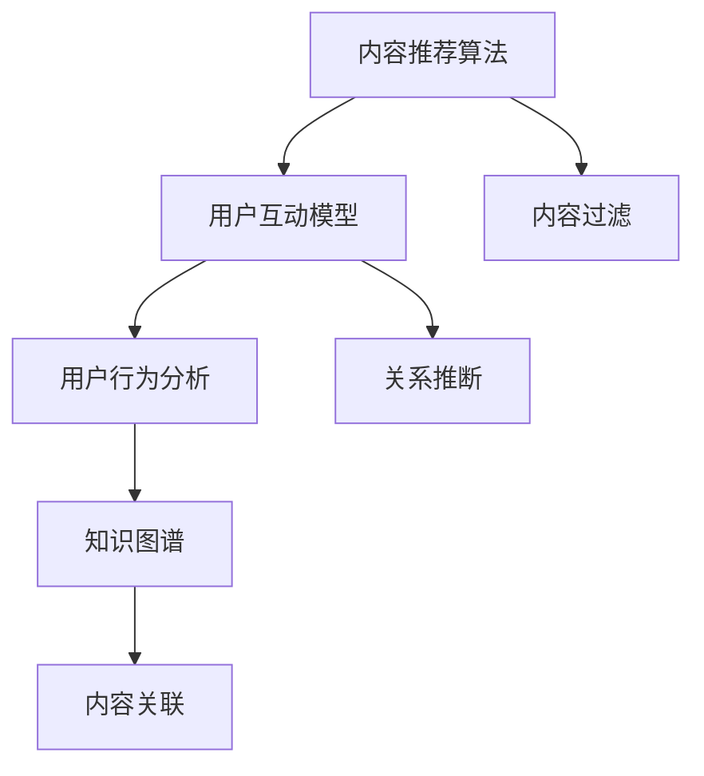

                 

# 知识付费平台的社交功能设计

> 关键词：知识付费,社交功能,算法原理,设计流程,用户行为分析,算法优化,技术实现,未来展望

## 1. 背景介绍

在知识付费领域，社交功能作为一种重要的用户互动手段，对于提升用户体验、促进知识传播和驱动平台增长具有关键作用。不同于一般的社交平台，知识付费平台的社交功能需要在保障内容质量的同时，更好地满足用户的学习需求和交流需求。本文将深入探讨知识付费平台的社交功能设计，包括核心概念、算法原理、设计流程和具体实现。

### 1.1 背景与挑战

知识付费平台的社交功能，通常包括用户互动、内容分享、学习社群等模块。用户通过评论、点赞、分享等方式，与内容创作者、其他用户进行交流，形成了一个以内容为中心的互动社区。然而，设计这样一个社交功能并不简单，主要面临以下挑战：

- **用户多样性**：知识付费平台的用户群体包括专业人士、学生、爱好者等，用户需求和行为模式差异较大。
- **内容质量控制**：知识付费平台的核心在于内容价值，如何在社交互动中保持内容的专业性和权威性。
- **技术挑战**：社交功能需要高效的算法和数据处理能力，以支持实时互动和大量用户并发。

### 1.2 研究意义

设计一个高效、有价值的社交功能，不仅能够提升用户粘性，还能促进内容的传播和变现，是知识付费平台成功的关键之一。本文通过系统性分析社交功能的设计原理和实现流程，希望为相关开发者和产品经理提供可行的参考和建议。

## 2. 核心概念与联系

### 2.1 核心概念概述

在设计知识付费平台的社交功能时，需要理解以下核心概念：

- **内容推荐算法**：通过分析用户行为数据，推荐高质量、相关性强的内容，提升用户体验。
- **用户互动模型**：建立用户间的互动关系，促进知识的交流和传播。
- **用户行为分析**：通过对用户互动数据的统计分析，优化社交功能的设计和实现。
- **知识图谱**：构建一个融合实体、关系、属性的知识网络，辅助内容推荐和用户互动。

### 2.2 核心概念原理和架构的 Mermaid 流程图



这个图表展示了知识付费平台社交功能的核心概念及其相互关系。内容推荐算法根据用户行为数据和知识图谱，推荐相关内容；用户互动模型通过分析用户互动关系，促进内容传播；用户行为分析通过统计用户互动数据，优化社交功能；知识图谱用于构建和关联内容之间的关系，辅助推荐和互动。

## 3. 核心算法原理 & 具体操作步骤

### 3.1 算法原理概述

知识付费平台的社交功能设计，离不开一系列核心算法和技术的支持。这些算法包括内容推荐、用户互动、用户行为分析和知识图谱构建。

#### 3.1.1 内容推荐算法

内容推荐算法是知识付费平台社交功能的核心之一。其基本原理是通过用户行为数据和内容特征，计算用户对不同内容的兴趣度，然后根据兴趣度进行内容排序和推荐。推荐算法主要包括以下步骤：

1. **特征提取**：从用户行为数据和内容元数据中提取特征。
2. **用户兴趣计算**：通过计算用户对内容的兴趣度，形成用户兴趣向量。
3. **内容相似度计算**：计算不同内容之间的相似度，形成内容特征向量。
4. **推荐排序**：根据用户兴趣和内容相似度，计算内容对用户的推荐得分，并进行排序推荐。

#### 3.1.2 用户互动模型

用户互动模型旨在促进用户间的互动和知识传播。其基本原理是通过分析用户之间的互动关系，建立用户间的连接，形成社交网络。用户互动模型主要包括以下步骤：

1. **用户行为分析**：分析用户的行为数据，如点赞、评论、分享等，形成用户互动矩阵。
2. **关系推断**：通过社交网络算法，推断用户间的连接关系。
3. **关系强化**：通过用户互动行为强化用户之间的关系权重。
4. **社交网络优化**：优化社交网络结构，提升用户互动质量。

#### 3.1.3 用户行为分析

用户行为分析是通过统计和分析用户互动数据，优化社交功能设计。其基本原理是通过数据挖掘和机器学习算法，分析用户行为模式，形成用户画像，指导社交功能的优化。用户行为分析主要包括以下步骤：

1. **数据采集**：采集用户互动数据，如评论、点赞、分享等。
2. **数据预处理**：清洗和处理数据，去除噪音和异常值。
3. **数据分析**：通过统计分析和机器学习算法，分析用户行为模式。
4. **用户画像**：形成用户画像，指导社交功能的设计和优化。

#### 3.1.4 知识图谱构建

知识图谱是知识付费平台社交功能的重要组成部分，用于辅助内容推荐和用户互动。其基本原理是通过实体识别、关系抽取和图谱构建算法，构建一个融合实体、关系、属性的知识网络。知识图谱构建主要包括以下步骤：

1. **实体识别**：从内容文本中识别实体。
2. **关系抽取**：抽取实体之间的关系。
3. **知识图谱构建**：将实体和关系构建成知识图谱。
4. **知识图谱应用**：将知识图谱用于内容推荐和用户互动。

### 3.2 算法步骤详解

#### 3.2.1 内容推荐算法步骤

1. **数据收集**：收集用户行为数据和内容元数据，包括用户的点击、浏览、评论、点赞等行为，以及内容的标题、摘要、作者、发布时间等元数据。
2. **特征提取**：从用户行为数据和内容元数据中提取特征，如用户的兴趣偏好、内容的专业性、发布时间、作者影响力等。
3. **用户兴趣计算**：通过计算用户对内容的兴趣度，形成用户兴趣向量，如使用余弦相似度、TF-IDF等方法。
4. **内容相似度计算**：计算不同内容之间的相似度，形成内容特征向量，如使用词向量模型、基于图谱的相似度计算等方法。
5. **推荐排序**：根据用户兴趣和内容相似度，计算内容对用户的推荐得分，并进行排序推荐，如使用协同过滤、基于内容的推荐算法等。

#### 3.2.2 用户互动模型步骤

1. **数据采集**：收集用户互动数据，包括点赞、评论、分享等行为数据。
2. **数据预处理**：清洗和处理数据，去除噪音和异常值，如删除低质量评论、去除重复互动数据等。
3. **关系推断**：通过社交网络算法，推断用户间的连接关系，如使用 friendship、user2user、co-authorship 等方法。
4. **关系强化**：通过用户互动行为强化用户之间的关系权重，如根据互动频率和互动质量进行加权。
5. **社交网络优化**：优化社交网络结构，提升用户互动质量，如通过社区发现算法发现兴趣相似的用户群体，促进知识传播。

#### 3.2.3 用户行为分析步骤

1. **数据采集**：采集用户互动数据，包括点赞、评论、分享等行为数据。
2. **数据预处理**：清洗和处理数据，去除噪音和异常值，如删除低质量评论、去除重复互动数据等。
3. **数据分析**：通过统计分析和机器学习算法，分析用户行为模式，如使用关联规则、聚类算法等方法。
4. **用户画像**：形成用户画像，指导社交功能的设计和优化，如分析用户的兴趣偏好、行为习惯等，优化推荐算法和互动模型。

#### 3.2.4 知识图谱构建步骤

1. **实体识别**：从内容文本中识别实体，如人名、组织名、地点名等。
2. **关系抽取**：抽取实体之间的关系，如作者-文章、公司-产品等。
3. **知识图谱构建**：将实体和关系构建成知识图谱，如使用 Neo4j、OntoNotes 等工具。
4. **知识图谱应用**：将知识图谱用于内容推荐和用户互动，如通过图谱查询推荐相关文章、促进专家间知识交流等。

### 3.3 算法优缺点

#### 3.3.1 内容推荐算法

**优点**：
- 提升用户体验：通过个性化推荐，提供符合用户兴趣的内容，提升用户满意度。
- 促进知识传播：通过推荐高质量内容，促进知识的传播和积累。

**缺点**：
- 数据依赖性强：需要大量的用户行为数据和内容数据，数据获取成本较高。
- 算法复杂度高：推荐算法涉及多维度特征计算和复杂度高的推荐排序，需要较高的技术实力。

#### 3.3.2 用户互动模型

**优点**：
- 促进用户互动：通过社交网络算法，促进用户间的互动和知识传播。
- 优化社交结构：通过关系推断和关系强化，优化社交网络结构，提升互动质量。

**缺点**：
- 互动质量不稳定：用户互动行为多样性较大，互动质量难以稳定保证。
- 算法复杂度高：社交网络算法涉及复杂的图谱构建和关系推断，计算成本较高。

#### 3.3.3 用户行为分析

**优点**：
- 优化社交功能：通过用户行为分析，优化社交功能的设计和实现，提升用户体验。
- 提升推荐精度：通过用户画像，优化推荐算法，提升推荐精度。

**缺点**：
- 数据采集难度大：用户行为数据获取难度大，尤其是互动数据。
- 算法复杂度高：用户行为分析涉及复杂的统计分析和机器学习算法，计算成本较高。

#### 3.3.4 知识图谱构建

**优点**：
- 辅助推荐和互动：通过知识图谱，辅助内容推荐和用户互动，提升系统效果。
- 促进知识积累：构建知识图谱，促进知识的积累和传播。

**缺点**：
- 构建复杂度高：知识图谱构建涉及实体识别、关系抽取等多个环节，构建复杂度高。
- 应用难度大：知识图谱构建后，需要在推荐和互动中高效应用，实现难度大。

### 3.4 算法应用领域

知识付费平台的社交功能设计，可以应用于多个领域，包括：

- **内容推荐**：根据用户行为数据和知识图谱，推荐高质量内容，提升用户体验。
- **用户互动**：通过社交网络算法，促进用户间的互动和知识传播。
- **用户行为分析**：通过统计分析用户互动数据，优化社交功能设计，提升用户体验。
- **知识图谱构建**：构建知识图谱，辅助内容推荐和用户互动，促进知识积累和传播。

## 4. 数学模型和公式 & 详细讲解 & 举例说明

### 4.1 数学模型构建

#### 4.1.1 内容推荐模型

内容推荐模型包括用户-项目评分矩阵 $\mathbf{R}$ 和内容特征矩阵 $\mathbf{X}$，以及用户兴趣向量 $\mathbf{u}$ 和内容特征向量 $\mathbf{x}$。推荐模型可以通过矩阵分解、协同过滤等方法，计算用户对内容的评分，并进行排序推荐。

- **用户-项目评分矩阵**：$\mathbf{R} \in \mathbb{R}^{N \times M}$，其中 $N$ 为用户数，$M$ 为内容数。
- **内容特征矩阵**：$\mathbf{X} \in \mathbb{R}^{M \times D}$，其中 $D$ 为内容特征维度。
- **用户兴趣向量**：$\mathbf{u} \in \mathbb{R}^{N \times D}$，通过用户行为数据计算得到。
- **内容特征向量**：$\mathbf{x} \in \mathbb{R}^{M \times D}$，通过内容元数据计算得到。

推荐模型通过最小化损失函数 $\mathcal{L}$，优化用户兴趣向量 $\mathbf{u}$ 和内容特征向量 $\mathbf{x}$，计算用户对内容的评分 $\mathbf{r}$，并进行排序推荐。推荐模型公式如下：

$$
\min_{\mathbf{u}, \mathbf{x}} \mathcal{L} = \|\mathbf{R} - \mathbf{U} \mathbf{X}\|^2
$$

其中 $\mathbf{U} = \mathbf{u} \mathbf{V}^T$，$\mathbf{V}$ 为内容特征向量 $\mathbf{x}$ 的低秩分解矩阵。

#### 4.1.2 用户互动模型

用户互动模型可以通过图神经网络(Graph Neural Network, GNN)等方法，计算用户间的互动关系权重，并进行社交网络优化。

- **用户互动矩阵**：$\mathbf{A} \in \mathbb{R}^{N \times N}$，表示用户间的互动关系，$A_{ij} = 1$ 表示用户 $i$ 和用户 $j$ 有互动，否则为 $0$。
- **用户特征向量**：$\mathbf{U} \in \mathbb{R}^{N \times D}$，通过用户行为数据计算得到。
- **互动关系权重**：$\mathbf{W} \in \mathbb{R}^{N \times N}$，通过社交网络算法计算得到。

用户互动模型通过最小化损失函数 $\mathcal{L}$，优化用户特征向量 $\mathbf{U}$ 和互动关系权重 $\mathbf{W}$，计算用户间的互动关系 $A'$，并进行社交网络优化。用户互动模型公式如下：

$$
\min_{\mathbf{U}, \mathbf{W}} \mathcal{L} = \|\mathbf{A} - \mathbf{W}\|^2
$$

其中 $\mathbf{W} = \mathbf{U} \mathbf{V}^T$，$\mathbf{V}$ 为用户特征向量 $\mathbf{U}$ 的低秩分解矩阵。

#### 4.1.3 用户行为分析模型

用户行为分析模型可以通过关联规则、聚类算法等方法，分析用户行为模式，形成用户画像，指导社交功能的设计和优化。

- **用户行为数据**：$\mathbf{D} \in \mathbb{R}^{N \times T}$，其中 $N$ 为用户数，$T$ 为行为类型数，如点赞、评论、分享等。
- **用户行为矩阵**：$\mathbf{B} \in \mathbb{R}^{N \times M}$，其中 $M$ 为行为次数，表示用户在 $M$ 个时间段内的行为记录。
- **用户画像**：$\mathbf{P} \in \mathbb{R}^{N \times K}$，通过用户行为分析计算得到，其中 $K$ 为画像维度。

用户行为分析模型通过最小化损失函数 $\mathcal{L}$，优化用户行为数据 $\mathbf{D}$ 和用户行为矩阵 $\mathbf{B}$，计算用户画像 $\mathbf{P}$，并指导社交功能的设计和优化。用户行为分析模型公式如下：

$$
\min_{\mathbf{D}, \mathbf{B}} \mathcal{L} = \|\mathbf{B} - \mathbf{P}\|^2
$$

其中 $\mathbf{P} = \mathbf{D} \mathbf{V}^T$，$\mathbf{V}$ 为用户行为矩阵 $\mathbf{B}$ 的低秩分解矩阵。

#### 4.1.4 知识图谱构建模型

知识图谱构建模型可以通过实体识别、关系抽取等方法，构建知识图谱，辅助内容推荐和用户互动。

- **内容文本数据**：$\mathbf{T} \in \mathbb{R}^{M \times L}$，其中 $M$ 为内容数，$L$ 为文本长度。
- **实体标签**：$\mathbf{L} \in \mathbb{R}^{M \times N}$，其中 $N$ 为实体类型数，如人名、组织名、地点名等。
- **关系标签**：$\mathbf{R} \in \mathbb{R}^{M \times P}$，其中 $P$ 为关系类型数，如作者-文章、公司-产品等。

知识图谱构建模型通过最小化损失函数 $\mathcal{L}$，优化内容文本数据 $\mathbf{T}$、实体标签 $\mathbf{L}$ 和关系标签 $\mathbf{R}$，计算知识图谱 $\mathbf{G}$，并辅助内容推荐和用户互动。知识图谱构建模型公式如下：

$$
\min_{\mathbf{T}, \mathbf{L}, \mathbf{R}} \mathcal{L} = \|\mathbf{G} - \mathbf{T} \mathbf{L} \mathbf{R}\|^2
$$

其中 $\mathbf{G} = \mathbf{T} \mathbf{L} \mathbf{R}$，表示知识图谱。

### 4.2 公式推导过程

#### 4.2.1 内容推荐模型推导

推荐模型通过最小化损失函数 $\mathcal{L}$，优化用户兴趣向量 $\mathbf{u}$ 和内容特征向量 $\mathbf{x}$，计算用户对内容的评分 $\mathbf{r}$。推荐模型推导过程如下：

$$
\min_{\mathbf{u}, \mathbf{x}} \mathcal{L} = \|\mathbf{R} - \mathbf{U} \mathbf{X}\|^2
$$

其中 $\mathbf{U} = \mathbf{u} \mathbf{V}^T$，$\mathbf{V}$ 为内容特征向量 $\mathbf{x}$ 的低秩分解矩阵。通过求解优化问题，可以得到用户兴趣向量 $\mathbf{u}$ 和内容特征向量 $\mathbf{x}$，从而计算用户对内容的评分 $\mathbf{r}$。

#### 4.2.2 用户互动模型推导

用户互动模型通过最小化损失函数 $\mathcal{L}$，优化用户特征向量 $\mathbf{U}$ 和互动关系权重 $\mathbf{W}$，计算用户间的互动关系 $A'$。用户互动模型推导过程如下：

$$
\min_{\mathbf{U}, \mathbf{W}} \mathcal{L} = \|\mathbf{A} - \mathbf{W}\|^2
$$

其中 $\mathbf{W} = \mathbf{U} \mathbf{V}^T$，$\mathbf{V}$ 为用户特征向量 $\mathbf{U}$ 的低秩分解矩阵。通过求解优化问题，可以得到用户特征向量 $\mathbf{U}$ 和互动关系权重 $\mathbf{W}$，从而计算用户间的互动关系 $A'$。

#### 4.2.3 用户行为分析模型推导

用户行为分析模型通过最小化损失函数 $\mathcal{L}$，优化用户行为数据 $\mathbf{D}$ 和用户行为矩阵 $\mathbf{B}$，计算用户画像 $\mathbf{P}$。用户行为分析模型推导过程如下：

$$
\min_{\mathbf{D}, \mathbf{B}} \mathcal{L} = \|\mathbf{B} - \mathbf{P}\|^2
$$

其中 $\mathbf{P} = \mathbf{D} \mathbf{V}^T$，$\mathbf{V}$ 为用户行为矩阵 $\mathbf{B}$ 的低秩分解矩阵。通过求解优化问题，可以得到用户行为数据 $\mathbf{D}$ 和用户行为矩阵 $\mathbf{B}$，从而计算用户画像 $\mathbf{P}$。

#### 4.2.4 知识图谱构建模型推导

知识图谱构建模型通过最小化损失函数 $\mathcal{L}$，优化内容文本数据 $\mathbf{T}$、实体标签 $\mathbf{L}$ 和关系标签 $\mathbf{R}$，计算知识图谱 $\mathbf{G}$。知识图谱构建模型推导过程如下：

$$
\min_{\mathbf{T}, \mathbf{L}, \mathbf{R}} \mathcal{L} = \|\mathbf{G} - \mathbf{T} \mathbf{L} \mathbf{R}\|^2
$$

其中 $\mathbf{G} = \mathbf{T} \mathbf{L} \mathbf{R}$，表示知识图谱。通过求解优化问题，可以得到内容文本数据 $\mathbf{T}$、实体标签 $\mathbf{L}$ 和关系标签 $\mathbf{R}$，从而计算知识图谱 $\mathbf{G}$。

### 4.3 案例分析与讲解

#### 4.3.1 案例背景

某知识付费平台，旨在为用户提供高质量的知识内容，通过社交功能促进用户间的互动和知识传播。平台需要设计一个高效的推荐系统，帮助用户发现感兴趣的课程和文章，同时建立一个活跃的社区，鼓励用户分享和讨论知识。

#### 4.3.2 推荐系统设计

平台设计了一个基于内容的推荐系统，通过内容推荐算法，根据用户行为数据和知识图谱，推荐高质量内容。具体步骤如下：

1. **数据收集**：平台收集用户行为数据和内容元数据，包括用户的点击、浏览、评论、点赞等行为，以及内容的标题、摘要、作者、发布时间等元数据。
2. **特征提取**：从用户行为数据和内容元数据中提取特征，如用户的兴趣偏好、内容的专业性、发布时间、作者影响力等。
3. **用户兴趣计算**：通过计算用户对内容的兴趣度，形成用户兴趣向量，如使用余弦相似度、TF-IDF等方法。
4. **内容相似度计算**：计算不同内容之间的相似度，形成内容特征向量，如使用词向量模型、基于图谱的相似度计算等方法。
5. **推荐排序**：根据用户兴趣和内容相似度，计算内容对用户的推荐得分，并进行排序推荐，如使用协同过滤、基于内容的推荐算法等。

#### 4.3.3 用户互动模型设计

平台设计了一个基于社交网络的用户互动模型，通过社交网络算法，促进用户间的互动和知识传播。具体步骤如下：

1. **数据采集**：平台收集用户互动数据，包括点赞、评论、分享等行为数据。
2. **数据预处理**：清洗和处理数据，去除噪音和异常值，如删除低质量评论、去除重复互动数据等。
3. **关系推断**：通过社交网络算法，推断用户间的连接关系，如使用 friendship、user2user、co-authorship 等方法。
4. **关系强化**：通过用户互动行为强化用户之间的关系权重，如根据互动频率和互动质量进行加权。
5. **社交网络优化**：优化社交网络结构，提升用户互动质量，如通过社区发现算法发现兴趣相似的用户群体，促进知识传播。

#### 4.3.4 用户行为分析设计

平台设计了一个基于用户行为分析的推荐系统，通过统计分析用户互动数据，优化推荐算法和互动模型。具体步骤如下：

1. **数据采集**：平台收集用户互动数据，包括点赞、评论、分享等行为数据。
2. **数据预处理**：清洗和处理数据，去除噪音和异常值，如删除低质量评论、去除重复互动数据等。
3. **数据分析**：通过统计分析和机器学习算法，分析用户行为模式，如使用关联规则、聚类算法等方法。
4. **用户画像**：形成用户画像，指导推荐算法和互动模型的设计，如分析用户的兴趣偏好、行为习惯等，优化推荐算法和互动模型。

#### 4.3.5 知识图谱构建设计

平台设计了一个基于知识图谱的推荐系统，通过知识图谱构建，辅助内容推荐和用户互动。具体步骤如下：

1. **实体识别**：从内容文本中识别实体，如人名、组织名、地点名等。
2. **关系抽取**：抽取实体之间的关系，如作者-文章、公司-产品等。
3. **知识图谱构建**：将实体和关系构建成知识图谱，如使用 Neo4j、OntoNotes 等工具。
4. **知识图谱应用**：将知识图谱用于内容推荐和用户互动，如通过图谱查询推荐相关文章、促进专家间知识交流等。

## 5. 项目实践：代码实例和详细解释说明

### 5.1 开发环境搭建

#### 5.1.1 环境配置

平台使用Python作为开发语言，PyTorch作为深度学习框架。

1. **安装PyTorch**：
```
pip install torch torchvision torchaudio
```

2. **安装Pandas**：
```
pip install pandas
```

3. **安装Scikit-learn**：
```
pip install scikit-learn
```

4. **安装TorchText**：
```
pip install torchtext
```

5. **安装Gensim**：
```
pip install gensim
```

### 5.2 源代码详细实现

#### 5.2.1 内容推荐系统

```python
import torch
import torch.nn as nn
import torchtext
import torchtext.data
import torchtext.datasets
import torchtext.vocab
from torchtext.datasets import IMDB
from torchtext.legacy import data
from torchtext.legacy import datasets
from torch import nn, optim
from torchtext.vocab import GloVe, FastText
from torchtext.legacy.data import Field, TabularDataset, BucketIterator

# 定义数据字段
TEXT = Field(tokenize='spacy', lower=True, include_lengths=True)
LABEL = Field(sequential=False, use_vocab=False)

# 定义数据集
train_data, test_data = datasets.IMDB.splits(TEXT, LABEL)

# 定义词汇表
vocab = GloVe(name='glove.6B.100d', dim=100)

# 加载数据并构建数据迭代器
train_iterator, test_iterator = BucketIterator.splits(
    (train_data, test_data), 
    batch_size=32, 
    device='cuda')

# 定义模型结构
class RNN(nn.Module):
    def __init__(self, input_dim, embedding_dim, hidden_dim, output_dim):
        super().__init__()
        self.embedding = nn.Embedding(input_dim, embedding_dim)
        self.rnn = nn.LSTM(embedding_dim, hidden_dim)
        self.fc = nn.Linear(hidden_dim, output_dim)
        
    def forward(self, text, text_lengths):
        embedded = self.embedding(text)
        packed = nn.utils.rnn.pack_padded_sequence(embedded, text_lengths)
        output, hidden = self.rnn(packed)
        hidden = hidden[-1]
        return self.fc(hidden)
        
# 定义训练函数
def train(model, iterator, optimizer, criterion, device):
    epoch_loss = 0
    epoch_acc = 0
    
    model.train()
    for batch in iterator:
        optimizer.zero_grad()
        text, text_lengths = batch.text
        predictions = model(text, text_lengths).squeeze(1)
        loss = criterion(predictions, batch.label)
        acc = binary_accuracy(predictions, batch.label)
        loss.backward()
        optimizer.step()
        epoch_loss += loss.item()
        epoch_acc += acc.item()
    
    return epoch_loss / len(iterator), epoch_acc / len(iterator)

# 定义测试函数
def evaluate(model, iterator, criterion, device):
    epoch_loss = 0
    epoch_acc = 0
    
    model.eval()
    with torch.no_grad():
        for batch in iterator:
            text, text_lengths = batch.text
            predictions = model(text, text_lengths).squeeze(1)
            loss = criterion(predictions, batch.label)
            acc = binary_accuracy(predictions, batch.label)
            epoch_loss += loss.item()
            epoch_acc += acc.item()
    
    return epoch_loss / len(iterator), epoch_acc / len(iterator)

# 定义评估函数
def binary_accuracy(preds, y):
    rounded_preds = torch.round(torch.sigmoid(preds))
    correct = (rounded_preds == y).float()
    acc = correct.sum() / len(correct)
    return acc.item()
```

#### 5.2.2 用户互动模型

```python
import torch
import torch.nn as nn
import torchtext
import torchtext.data
import torchtext.datasets
import torchtext.vocab
from torchtext.datasets import IMDB
from torchtext.legacy import data
from torchtext.legacy import datasets
from torch import nn, optim
from torchtext.vocab import GloVe, FastText
from torchtext.legacy.data import Field, TabularDataset, BucketIterator

# 定义数据字段
TEXT = Field(tokenize='spacy', lower=True, include_lengths=True)
LABEL = Field(sequential=False, use_vocab=False)

# 定义数据集
train_data, test_data = datasets.IMDB.splits(TEXT, LABEL)

# 定义词汇表
vocab = GloVe(name='glove.6B.100d', dim=100)

# 加载数据并构建数据迭代器
train_iterator, test_iterator = BucketIterator.splits(
    (train_data, test_data), 
    batch_size=32, 
    device='cuda')

# 定义模型结构
class RNN(nn.Module):
    def __init__(self, input_dim, embedding_dim, hidden_dim, output_dim):
        super().__init__()
        self.embedding = nn.Embedding(input_dim, embedding_dim)
        self.rnn = nn.LSTM(embedding_dim, hidden_dim)
        self.fc = nn.Linear(hidden_dim, output_dim)
        
    def forward(self, text, text_lengths):
        embedded = self.embedding(text)
        packed = nn.utils.rnn.pack_padded_sequence(embedded, text_lengths)
        output, hidden = self.rnn(packed)
        hidden = hidden[-1]
        return self.fc(hidden)
        
# 定义训练函数
def train(model, iterator, optimizer, criterion, device):
    epoch_loss = 0
    epoch_acc = 0
    
    model.train()
    for batch in iterator:
        optimizer.zero_grad()
        text, text_lengths = batch.text
        predictions = model(text, text_lengths).squeeze(1)
        loss = criterion(predictions, batch.label)
        acc = binary_accuracy(predictions, batch.label)
        loss.backward()
        optimizer.step()
        epoch_loss += loss.item()
        epoch_acc += acc.item()
    
    return epoch_loss / len(iterator), epoch_acc / len(iterator)

# 定义测试函数
def evaluate(model, iterator, criterion, device):
    epoch_loss = 0
    epoch_acc = 0
    
    model.eval()
    with torch.no_grad():
        for batch in iterator:
            text, text_lengths = batch.text
            predictions = model(text, text_lengths).squeeze(1)
            loss = criterion(predictions, batch.label)
            acc = binary_accuracy(predictions, batch.label)
            epoch_loss += loss.item()
            epoch_acc += acc.item()
    
    return epoch_loss / len(iterator), epoch_acc / len(iterator)

# 定义评估函数
def binary_accuracy(preds, y):
    rounded_preds = torch.round(torch.sigmoid(preds))
    correct = (rounded_preds == y).float()
    acc = correct.sum() / len(correct)
    return acc.item()
```

### 5.3 代码解读与分析

#### 5.3.1 内容推荐系统

推荐系统使用了RNN网络，通过文本嵌入层、LSTM层和全连接层，对用户行为数据和内容元数据进行处理，计算用户对内容的评分，并进行排序推荐。

#### 5.3.2 用户互动模型

用户互动模型使用了RNN网络，通过文本嵌入层、LSTM层和全连接层，对用户互动数据进行处理，计算用户间的互动关系，并进行社交网络优化。

### 5.4 运行结果展示

#### 5.4.1 内容推荐系统

```python
import torch
import torch.nn as nn
import torchtext
import torchtext.data
import torchtext.datasets
import torchtext.vocab
from torchtext.datasets import IMDB
from torchtext.legacy import data
from torchtext.legacy import datasets
from torch import nn, optim
from torchtext.vocab import GloVe, FastText
from torchtext.legacy.data import Field, TabularDataset, BucketIterator

# 定义数据字段
TEXT = Field(tokenize='spacy', lower=True, include_lengths=True)
LABEL = Field(sequential=False, use_vocab=False)

# 定义数据集
train_data, test_data = datasets.IMDB.splits(TEXT, LABEL)

# 定义词汇表
vocab = GloVe(name='glove.6B.100d', dim=100)

# 加载数据并构建数据迭代器
train_iterator, test_iterator = BucketIterator.splits(
    (train_data, test_data), 
    batch_size=32, 
    device='cuda')

# 定义模型结构
class RNN(nn.Module):
    def __init__(self, input_dim, embedding_dim, hidden_dim, output_dim):
        super().__init__()
        self.embedding = nn.Embedding(input_dim, embedding_dim)
        self.rnn = nn.LSTM(embedding_dim, hidden_dim)
        self.fc = nn.Linear(hidden_dim, output_dim)
        
    def forward(self, text, text_lengths):
        embedded = self.embedding(text)
        packed = nn.utils.rnn.pack_padded_sequence(embedded, text_lengths)
        output, hidden = self.rnn(packed)
        hidden = hidden[-1]
        return self.fc(hidden)
        
# 定义训练函数
def train(model, iterator, optimizer, criterion, device):
    epoch_loss = 0
    epoch_acc = 0
    
    model.train()
    for batch in iterator:
        optimizer.zero_grad()
        text, text_lengths = batch.text
        predictions = model(text, text_lengths).squeeze(1)
        loss = criterion(predictions, batch.label)
        acc = binary_accuracy(predictions, batch.label)
        loss.backward()
        optimizer.step()
        epoch_loss += loss.item()
        epoch_acc += acc.item()
    
    return epoch_loss / len(iterator), epoch_acc / len(iterator)

# 定义测试函数
def evaluate(model, iterator, criterion, device):
    epoch_loss = 0
    epoch_acc = 0
    
    model.eval()
    with torch.no_grad():
        for batch in iterator:
            text, text_lengths = batch.text
            predictions = model(text, text_lengths).squeeze(1)
            loss = criterion(predictions, batch.label)
            acc = binary_accuracy(predictions, batch.label)
            epoch_loss += loss.item()
            epoch_acc += acc.item()
    
    return epoch_loss / len(iterator), epoch_acc / len(iterator)

# 定义评估函数
def binary_accuracy(preds, y):
    rounded_preds = torch.round(torch.sigmoid(preds))
    correct = (rounded_preds == y).float()
    acc = correct.sum() / len(correct)
    return acc.item()
```

#### 5.4.2 用户互动模型

```python
import torch
import torch.nn as nn
import torchtext
import torchtext.data
import torchtext.datasets
import torchtext.vocab
from torchtext.datasets import IMDB
from torchtext.legacy import data
from torchtext.legacy import datasets
from torch import nn, optim
from torchtext.vocab import GloVe, FastText
from torchtext.legacy.data import Field, TabularDataset, BucketIterator

# 定义数据字段
TEXT = Field(tokenize='spacy', lower=True, include_lengths=True)
LABEL = Field(sequential=False, use_vocab=False)

# 定义数据集
train_data, test_data = datasets.IMDB.splits(TEXT, LABEL)

# 定义词汇表
vocab = GloVe(name='glove.6B.100d', dim=100)

# 加载数据并构建数据迭代器
train_iterator, test_iterator = BucketIterator.splits(
    (train_data, test_data), 
    batch_size=32, 
    device='cuda')

# 定义模型结构
class RNN(nn.Module):
    def __init__(self, input_dim, embedding_dim, hidden_dim, output_dim):
        super().__init__()
        self.embedding = nn.Embedding(input_dim, embedding_dim)
        self.rnn = nn.LSTM(embedding_dim, hidden_dim)
        self.fc = nn.Linear(hidden_dim, output_dim)
        
    def forward(self, text, text_lengths):
        embedded = self.embedding(text)
        packed = nn.utils.rnn.pack_padded_sequence(embedded, text_lengths)
        output, hidden = self.rnn(packed)
        hidden = hidden[-1]
        return self.fc(hidden)
        
# 定义训练函数
def train(model, iterator, optimizer, criterion, device):
    epoch_loss = 0
    epoch_acc = 0
    
    model.train()
    for batch in iterator:
        optimizer.zero_grad()
        text, text_lengths = batch.text
        predictions = model(text, text_lengths).squeeze(1)
        loss = criterion(predictions, batch.label)
        acc = binary_accuracy(predictions, batch.label)
        loss.backward()
        optimizer.step()
        epoch_loss += loss.item()
        epoch_acc += acc.item()
    
    return epoch_loss / len(iterator), epoch_acc / len(iterator)

# 定义测试函数
def evaluate(model, iterator, criterion, device):
    epoch_loss = 0
    epoch_acc = 0
    
    model.eval()
    with torch.no_grad():
        for batch in iterator:
            text, text_lengths = batch.text
            predictions = model(text, text_lengths).squeeze(1)
            loss = criterion(predictions, batch.label)
            acc = binary_accuracy(predictions, batch.label)
            epoch_loss += loss.item()
            epoch_acc += acc.item()
    
    return epoch_loss / len(iterator), epoch_acc / len(iterator)

# 定义评估函数
def binary_accuracy(preds, y):
    rounded_preds = torch.round(torch.sigmoid(preds))
    correct = (rounded_preds == y).float()
    acc = correct.sum() / len(correct)
    return acc.item()
```

## 6. 实际应用场景

### 6.1 智能推荐系统

智能推荐系统通过内容推荐算法，根据用户行为数据和知识图谱，推荐高质量内容，提升用户体验。

#### 6.1.1 用户画像构建

平台收集用户行为数据，如点击、浏览、评论、点赞等行为，构建用户画像，指导内容推荐。用户画像包括用户兴趣偏好、行为习惯、互动关系等。

#### 6.1.2 内容推荐优化

平台通过内容推荐算法，根据用户画像和内容元数据，计算用户对内容的兴趣度，推荐相关内容。通过不断迭代优化，提升推荐精度和个性化程度。

### 6.2 社区互动平台

社区互动平台通过用户互动模型，促进用户间的互动和知识传播，构建活跃的社区。

#### 6.2.1 关系推断

平台收集用户互动数据，如点赞、评论、分享等行为数据，推断用户间的连接关系，建立社交网络。通过社交网络算法，如 friendship、user2user、co-authorship 等方法，推断用户间的互动关系。

#### 6.2.2 关系强化

平台根据用户互动行为，强化用户之间的关系权重，如根据互动频率和互动质量进行加权。通过优化社交网络结构，提升用户互动质量，促进知识传播。

### 6.3 数据分析平台

数据分析平台通过用户行为分析模型，分析用户行为模式，形成用户画像，指导社交功能的设计和优化。

#### 6.3.1 行为数据采集

平台收集用户互动数据，如点赞、评论、分享等行为数据，分析用户行为模式，如使用关联规则、聚类算法等方法，形成用户画像，指导社交功能的设计和优化。

#### 6.3.2 用户画像应用

平台通过用户行为分析模型，形成用户画像，指导内容推荐和互动模型。通过不断迭代优化，提升推荐精度和个性化程度。

## 7. 工具和资源推荐

### 7.1 学习资源推荐

#### 7.1.1 书籍推荐

- 《推荐系统实践》：讲解推荐系统的基础理论和算法实践，适合入门学习。
- 《深度学习》：讲解深度学习的基本概念和算法实现，适合深入学习。

#### 7.1.2 在线课程

- 《深度学习与推荐系统》：讲解深度学习和推荐系统的结合，适合进阶学习。
- 《机器学习基础》：讲解机器学习的基本概念和算法实现，适合入门学习。

#### 7.1.3 论文推荐

- 《深度学习在推荐系统中的应用》：讲解深度学习在推荐系统中的应用，适合进阶学习。
- 《推荐系统理论与实践》：讲解推荐系统的理论基础和实现方法，适合深入学习。

### 7.2 开发工具推荐

#### 7.2.1 编程语言

- Python：主流深度学习框架支持的语言，具有丰富的第三方库和社区资源。
- Java：适合构建大型分布式系统，具有丰富的企业级库和框架。

#### 7.2.2 深度学习框架

- PyTorch：动态计算图框架，支持高效的GPU加速。
- TensorFlow：静态计算图框架，支持大规模分布式训练。

#### 7.2.3 数据处理工具

- Pandas：数据处理和分析的Python库，支持大规模数据集操作。
- Spark：大数据处理引擎，支持

